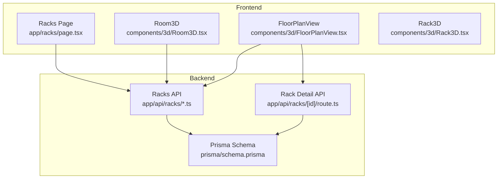
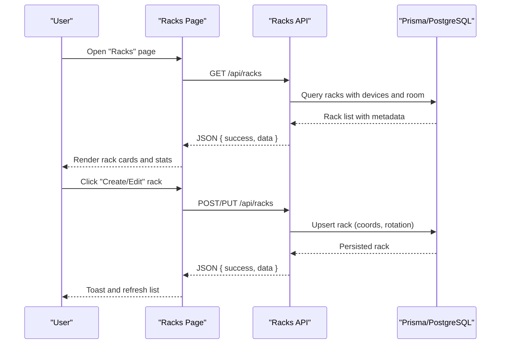
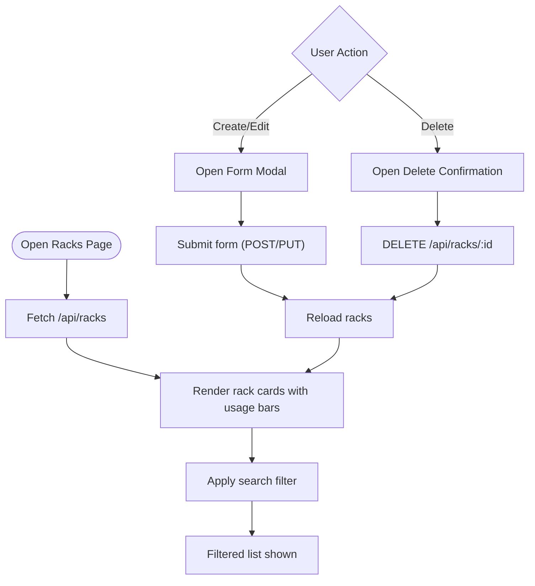
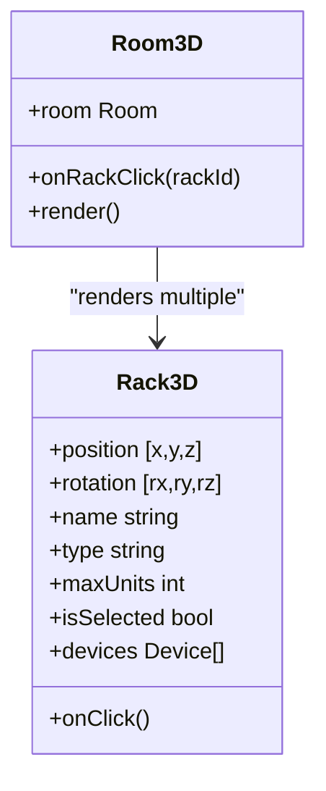
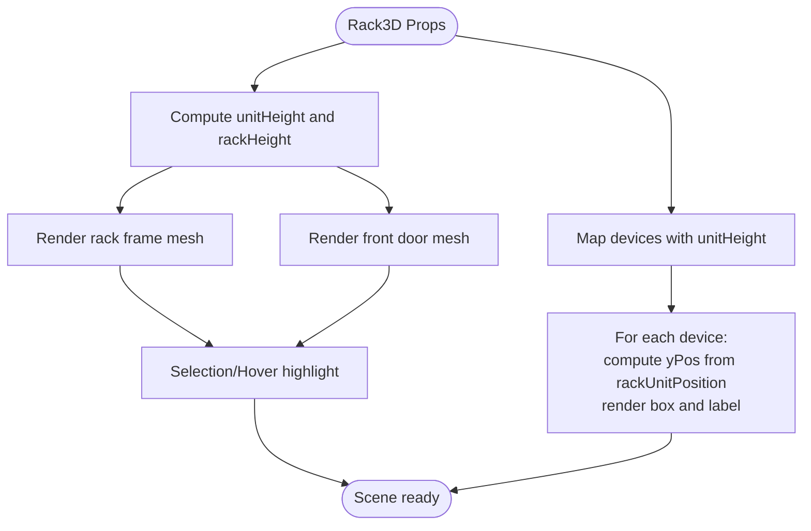
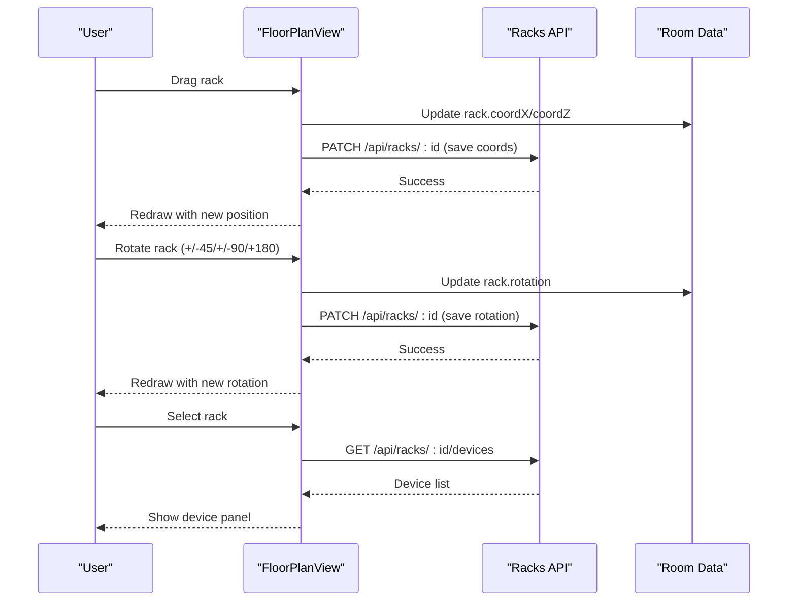
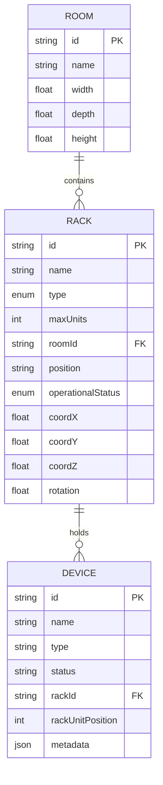
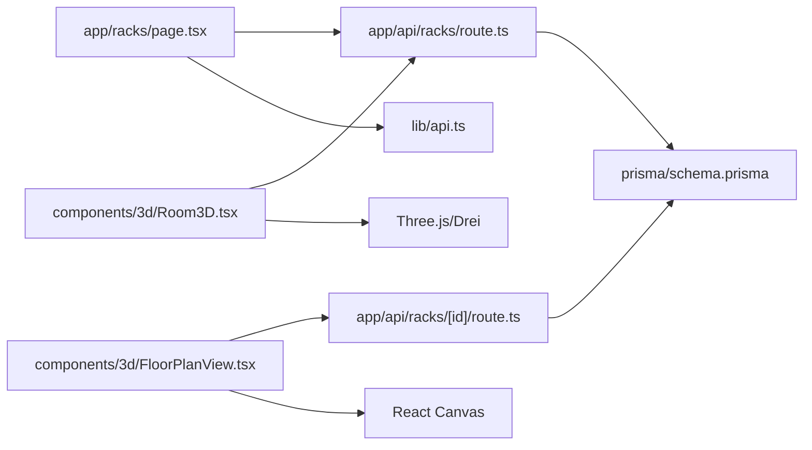

# Rack Management & 3D Visualization

<cite>
**Referenced Files in This Document**
- [app/racks/page.tsx](file://app/racks/page.tsx)
- [components/3d/Rack3D.tsx](file://components/3d/Rack3D.tsx)
- [components/3d/Room3D.tsx](file://components/3d/Room3D.tsx)
- [components/3d/FloorPlanView.tsx](file://components/3d/FloorPlanView.tsx)
- [app/api/racks/route.ts](file://app/api/racks/route.ts)
- [app/api/racks/[id]/route.ts](file://app/api/racks/[id]/route.ts)
- [lib/api.ts](file://lib/api.ts)
- [prisma/schema.prisma](file://prisma/schema.prisma)
- [scripts/add-racks-v2.js](file://scripts/add-racks-v2.js)
- [scripts/setup-room.js](file://scripts/setup-room.js)
</cite>

## Table of Contents
1. [Introduction](#introduction)
2. [Project Structure](#project-structure)
3. [Core Components](#core-components)
4. [Architecture Overview](#architecture-overview)
5. [Detailed Component Analysis](#detailed-component-analysis)
6. [Dependency Analysis](#dependency-analysis)
7. [Performance Considerations](#performance-considerations)
8. [Troubleshooting Guide](#troubleshooting-guide)
9. [Conclusion](#conclusion)
10. [Appendices](#appendices)

## Introduction
This document explains the rack management and 3D visualization capabilities of the platform. It covers rack configuration (dimensions, unit capacity, spatial coordinates), 3D rack modeling with Three.js, U-positioning of devices, and the integration between the 2D rack management interface and 3D visualization components. It also provides practical examples for adding racks, configuring properties, visualizing layouts, and strategies for capacity planning and optimal utilization.

## Project Structure
The rack management system spans frontend pages, 3D visualization components, and backend APIs backed by Prisma ORM and PostgreSQL. Key areas:
- 2D rack management UI: lists, filters, creates, updates, deletes racks and displays summary statistics.
- 3D visualization: renders racks in a room with realistic materials, lighting, and interactive controls.
- 2D floor plan editor: drag-and-drop to place racks, adjust rotation, and inspect devices.
- Backend APIs: CRUD for racks, including spatial coordinates and rotation.
- Data model: Prisma schema defines racks, rooms, devices, and rack units.

**Diagram sources**
- [app/racks/page.tsx:64-449](file://app/racks/page.tsx#L64-L449)
- [components/3d/Room3D.tsx:46-222](file://components/3d/Room3D.tsx#L46-L222)
- [components/3d/FloorPlanView.tsx:71-768](file://components/3d/FloorPlanView.tsx#L71-L768)
- [components/3d/Rack3D.tsx:25-160](file://components/3d/Rack3D.tsx#L25-L160)
- [app/api/racks/route.ts:9-122](file://app/api/racks/route.ts#L9-L122)
- [app/api/racks/[id]/route.ts:18-388](file://app/api/racks/[id]/route.ts#L18-L388)
- [prisma/schema.prisma:94-133](file://prisma/schema.prisma#L94-L133)

**Section sources**
- [app/racks/page.tsx:64-449](file://app/racks/page.tsx#L64-L449)
- [components/3d/Room3D.tsx:46-222](file://components/3d/Room3D.tsx#L46-L222)
- [components/3d/FloorPlanView.tsx:71-768](file://components/3d/FloorPlanView.tsx#L71-L768)
- [components/3d/Rack3D.tsx:25-160](file://components/3d/Rack3D.tsx#L25-L160)
- [app/api/racks/route.ts:9-122](file://app/api/racks/route.ts#L9-L122)
- [app/api/racks/[id]/route.ts:18-388](file://app/api/racks/[id]/route.ts#L18-L388)
- [prisma/schema.prisma:94-133](file://prisma/schema.prisma#L94-L133)

## Core Components
- Rack management UI: loads racks, rooms, supports search, edit/create/delete, and computes capacity usage.
- 3D Room renderer: renders racks with realistic materials, lighting, shadows, and orbit controls.
- 2D Floor Plan editor: drag-to-place racks, rotate, zoom, pan, and inspect devices.
- Rack 3D model: builds rack frame, internal devices, labels, and selection indicators.
- Backend APIs: list/create/update/delete racks and device associations; persist spatial coordinates and rotation.
- Data model: Prisma schema defines rooms, racks, devices, and rack units with foreign keys and enums.

**Section sources**
- [app/racks/page.tsx:64-449](file://app/racks/page.tsx#L64-L449)
- [components/3d/Room3D.tsx:46-222](file://components/3d/Room3D.tsx#L46-L222)
- [components/3d/FloorPlanView.tsx:71-768](file://components/3d/FloorPlanView.tsx#L71-L768)
- [components/3d/Rack3D.tsx:25-160](file://components/3d/Rack3D.tsx#L25-L160)
- [app/api/racks/route.ts:9-122](file://app/api/racks/route.ts#L9-L122)
- [app/api/racks/[id]/route.ts:18-388](file://app/api/racks/[id]/route.ts#L18-L388)
- [prisma/schema.prisma:94-133](file://prisma/schema.prisma#L94-L133)

## Architecture Overview
The system integrates a React/Next.js frontend with Three.js-based 3D rendering and a REST-like API layer backed by Prisma and PostgreSQL. The 2D UI and 3D renderer share the same data model and coordinate system.

**Diagram sources**
- [app/racks/page.tsx:80-161](file://app/racks/page.tsx#L80-L161)
- [app/api/racks/route.ts:69-121](file://app/api/racks/route.ts#L69-L121)

## Detailed Component Analysis

### 2D Rack Management UI
- Loads racks and rooms, supports search by name/building/floor, and shows summary stats (total racks, devices, utilization, critical utilization).
- Provides modal forms to create/edit racks with fields for name, room, type, max units, operational status, and optional position label.
- Handles saving, deletion, and error feedback via toast notifications.

**Diagram sources**
- [app/racks/page.tsx:80-181](file://app/racks/page.tsx#L80-L181)

**Section sources**
- [app/racks/page.tsx:64-449](file://app/racks/page.tsx#L64-L449)

### 3D Room Renderer (Room3D)
- Renders a room with floor/walls and a grid helper.
- Places racks using either provided coordinates or auto-layout grid.
- Uses OrbitControls for camera movement and PerspectiveCamera for viewing.
- Lighting includes ambient, hemisphere, point, and directional lights with shadows.
- Each rack is rendered via Rack3D with realistic materials and wireframe edges.

**Diagram sources**
- [components/3d/Room3D.tsx:46-222](file://components/3d/Room3D.tsx#L46-L222)
- [components/3d/Rack3D.tsx:25-160](file://components/3d/Rack3D.tsx#L25-L160)

**Section sources**
- [components/3d/Room3D.tsx:46-222](file://components/3d/Room3D.tsx#L46-L222)

### 3D Rack Model (Rack3D)
- Defines standard rack dimensions: width, depth, and computed height from max units (1U = 44.45 mm).
- Renders the rack frame with wireframe edges and a semi-transparent front door.
- Positions devices inside the rack according to their U-position and unit height metadata.
- Highlights selection and hover states; adds device labels and status LEDs.

**Diagram sources**
- [components/3d/Rack3D.tsx:25-160](file://components/3d/Rack3D.tsx#L25-L160)

**Section sources**
- [components/3d/Rack3D.tsx:25-160](file://components/3d/Rack3D.tsx#L25-L160)

### 2D Floor Plan Editor (FloorPlanView)
- Draws a scalable 2D floor plan with grid background and room boundaries.
- Supports drag-to-move racks, rotate via buttons, zoom with mouse wheel, and pan by dragging.
- Computes auto-layout grid positions for racks without explicit coordinates.
- Fetches and displays device list for the selected rack with status badges and rack unit indicators.

**Diagram sources**
- [components/3d/FloorPlanView.tsx:436-456](file://components/3d/FloorPlanView.tsx#L436-L456)
- [components/3d/FloorPlanView.tsx:134-147](file://components/3d/FloorPlanView.tsx#L134-L147)

**Section sources**
- [components/3d/FloorPlanView.tsx:71-768](file://components/3d/FloorPlanView.tsx#L71-L768)

### Backend APIs and Data Model
- Racks API:
  - GET /api/racks: returns racks with included room and device details, cached for 30 seconds.
  - POST /api/racks: creates a rack with name, type, maxUnits, roomId, position, operationalStatus, and optional spatial coordinates and rotation.
  - PUT /api/racks/:id: updates rack properties with validation and optional spatial updates.
  - DELETE /api/racks/:id: removes a rack and returns success/error.
- Rack Detail API:
  - GET /api/racks/:id: returns a single rack with devices and units.
  - PUT /api/racks/:id: updates rack fields with validation.
  - DELETE /api/racks/:id: removes a rack and returns success/error.
- Data model:
  - Room: width, depth, height, racks.
  - Rack: name, type, maxUnits, roomId, position, operationalStatus, coordX, coordY, coordZ, rotation, devices, units.
  - Device: name, type, status, rackId, rackUnitPosition, metadata.
  - RackUnit: position, rackId, deviceId, side.

**Diagram sources**
- [prisma/schema.prisma:94-133](file://prisma/schema.prisma#L94-L133)
- [prisma/schema.prisma:112-133](file://prisma/schema.prisma#L112-L133)
- [prisma/schema.prisma:151-228](file://prisma/schema.prisma#L151-L228)
- [prisma/schema.prisma:135-149](file://prisma/schema.prisma#L135-L149)

**Section sources**
- [app/api/racks/route.ts:9-122](file://app/api/racks/route.ts#L9-L122)
- [app/api/racks/[id]/route.ts:18-388](file://app/api/racks/[id]/route.ts#L18-L388)
- [prisma/schema.prisma:94-133](file://prisma/schema.prisma#L94-L133)
- [prisma/schema.prisma:112-133](file://prisma/schema.prisma#L112-L133)
- [prisma/schema.prisma:151-228](file://prisma/schema.prisma#L151-L228)
- [prisma/schema.prisma:135-149](file://prisma/schema.prisma#L135-L149)

## Dependency Analysis
- UI components depend on:
  - React hooks for state and effects.
  - Shadcn UI primitives for dialogs, cards, inputs, and buttons.
  - @react-three/fiber and @react-three/drei for 3D rendering.
  - Axios wrapper for API requests.
- Backend APIs depend on:
  - Prisma client for database operations.
  - Next.js routes for HTTP handlers.
- Data model enforces referential integrity between rooms, racks, devices, and rack units.

**Diagram sources**
- [app/racks/page.tsx:64-449](file://app/racks/page.tsx#L64-L449)
- [components/3d/Room3D.tsx:46-222](file://components/3d/Room3D.tsx#L46-L222)
- [components/3d/FloorPlanView.tsx:71-768](file://components/3d/FloorPlanView.tsx#L71-L768)
- [app/api/racks/route.ts:9-122](file://app/api/racks/route.ts#L9-L122)
- [app/api/racks/[id]/route.ts:18-388](file://app/api/racks/[id]/route.ts#L18-L388)
- [lib/api.ts:1-57](file://lib/api.ts#L1-L57)
- [prisma/schema.prisma:94-133](file://prisma/schema.prisma#L94-L133)

**Section sources**
- [app/racks/page.tsx:64-449](file://app/racks/page.tsx#L64-L449)
- [components/3d/Room3D.tsx:46-222](file://components/3d/Room3D.tsx#L46-L222)
- [components/3d/FloorPlanView.tsx:71-768](file://components/3d/FloorPlanView.tsx#L71-L768)
- [app/api/racks/route.ts:9-122](file://app/api/racks/route.ts#L9-L122)
- [app/api/racks/[id]/route.ts:18-388](file://app/api/racks/[id]/route.ts#L18-L388)
- [lib/api.ts:1-57](file://lib/api.ts#L1-L57)
- [prisma/schema.prisma:94-133](file://prisma/schema.prisma#L94-L133)

## Performance Considerations
- API caching: GET /api/racks caches results for 30 seconds to reduce database load.
- Efficient rendering: Room3D uses auto-layout grid and minimal geometry; shadows and lighting are tuned for smooth performance.
- 2D floor plan: Canvas redraws only when necessary; hover and selection states are updated incrementally.
- Large datasets: Consider pagination or virtualization for very large rack/device lists.

[No sources needed since this section provides general guidance]

## Troubleshooting Guide
- API failures: The API wrapper returns structured error responses with success flag and error messages; UI displays toast notifications for user feedback.
- WebGL errors: Room3D catches rendering errors and displays a user-friendly error message with details.
- Coordinate normalization: FloorPlanView rotates labels to remain readable across rotations; ensure rotation values are within expected ranges.
- Validation: Backend validates required fields and acceptable values for rack type and status; invalid requests return descriptive errors.

**Section sources**
- [lib/api.ts:10-56](file://lib/api.ts#L10-L56)
- [components/3d/Room3D.tsx:50-67](file://components/3d/Room3D.tsx#L50-L67)
- [components/3d/FloorPlanView.tsx:268-298](file://components/3d/FloorPlanView.tsx#L268-L298)
- [app/api/racks/route.ts:85-91](file://app/api/racks/route.ts#L85-L91)
- [app/api/racks/[id]/route.ts:172-195](file://app/api/racks/[id]/route.ts#L172-L195)

## Conclusion
The platform provides a cohesive solution for rack management with both 2D and 3D views. The 2D UI offers quick creation, editing, and capacity insights, while the 3D renderer delivers immersive rack modeling and spatial awareness. The backend ensures robust persistence of rack properties, spatial coordinates, and rotation, enabling accurate capacity planning and optimal utilization strategies.

[No sources needed since this section summarizes without analyzing specific files]

## Appendices

### Practical Examples

- Add demo racks to rooms
  - Run the setup script to create a room with defined dimensions and add multiple racks with initial coordinates and rotation.
  - Example command: docker exec infrascope-web-dev node scripts/setup-room.js
  - Follow-up arrangement: docker exec infrascope-web-dev node scripts/arrange-racks.js

- Configure rack properties
  - Use the Racks page to create or edit a rack, specifying name, room, type (42U/45U/CUSTOM), max units, operational status, and optional position label.
  - Coordinates and rotation can be adjusted in the 2D floor plan editor.

- Visualize rack layouts in 3D
  - Open the 3D room view to see racks positioned according to saved coordinates and rotation.
  - Use orbit controls to navigate around the room and inspect rack placements.

- Capacity planning and utilization
  - The 2D UI computes total capacity, used units, and highlights critical utilization (≥90%).
  - Optimize by balancing rack loads, consolidating underutilized racks, and using higher-density units where appropriate.

- Coordinate systems and spatial positioning
  - X/Y/Z coordinates are stored in meters; rotation is in degrees around the Y-axis.
  - The 2D floor plan and 3D renderer consume the same coordinate system for consistency.

**Section sources**
- [scripts/setup-room.js:4-64](file://scripts/setup-room.js#L4-L64)
- [scripts/add-racks-v2.js:4-60](file://scripts/add-racks-v2.js#L4-L60)
- [app/racks/page.tsx:124-161](file://app/racks/page.tsx#L124-L161)
- [components/3d/FloorPlanView.tsx:436-456](file://components/3d/FloorPlanView.tsx#L436-L456)
- [components/3d/Room3D.tsx:144-170](file://components/3d/Room3D.tsx#L144-L170)
- [prisma/schema.prisma:123-126](file://prisma/schema.prisma#L123-L126)