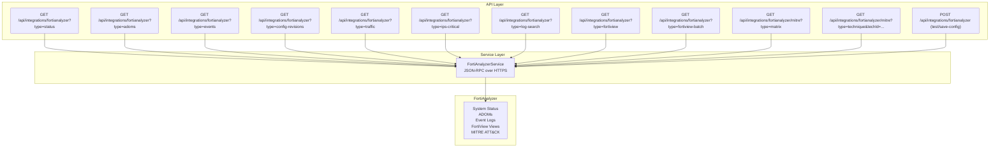
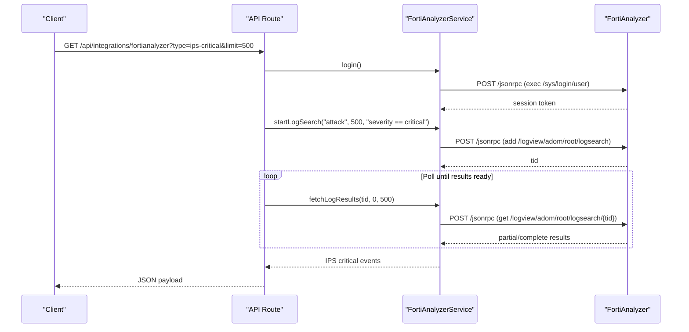
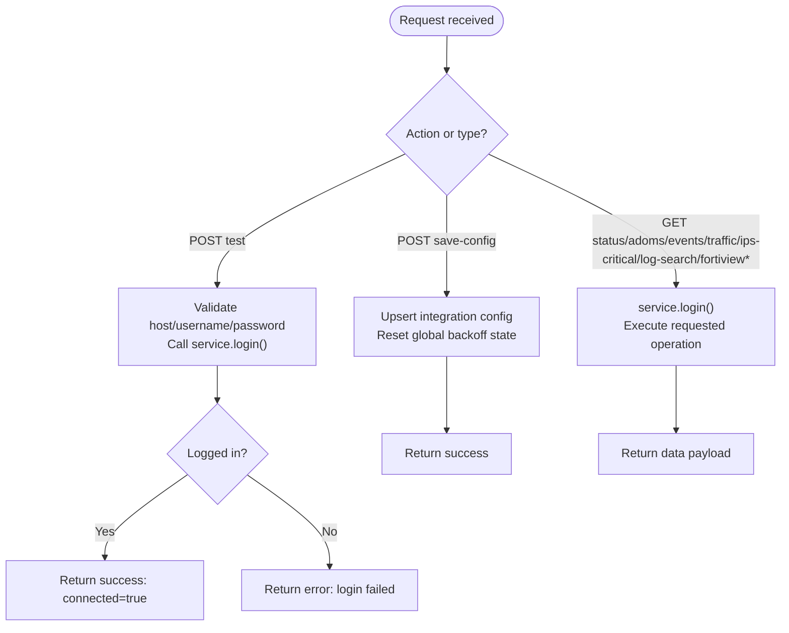
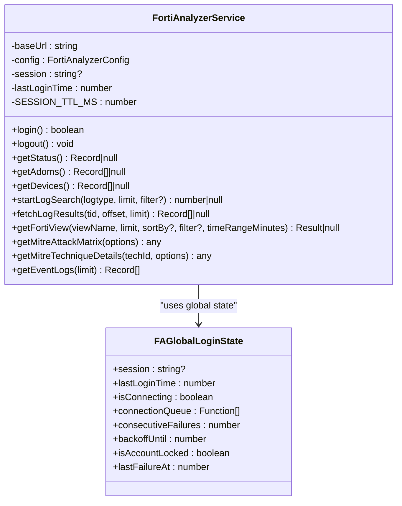
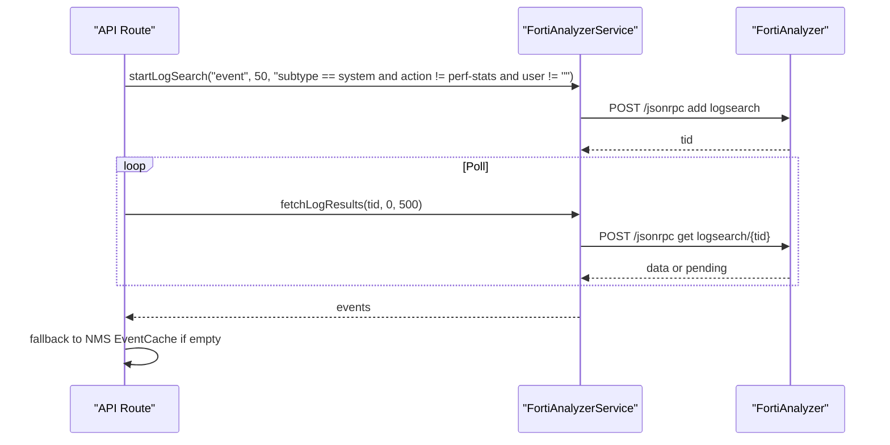
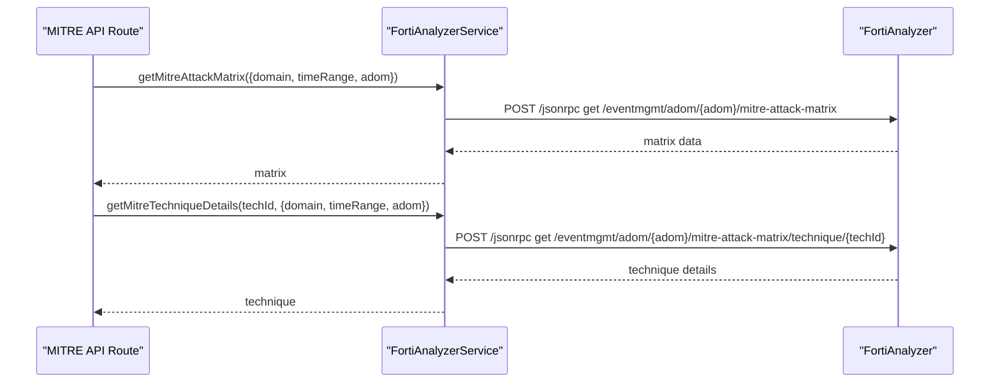
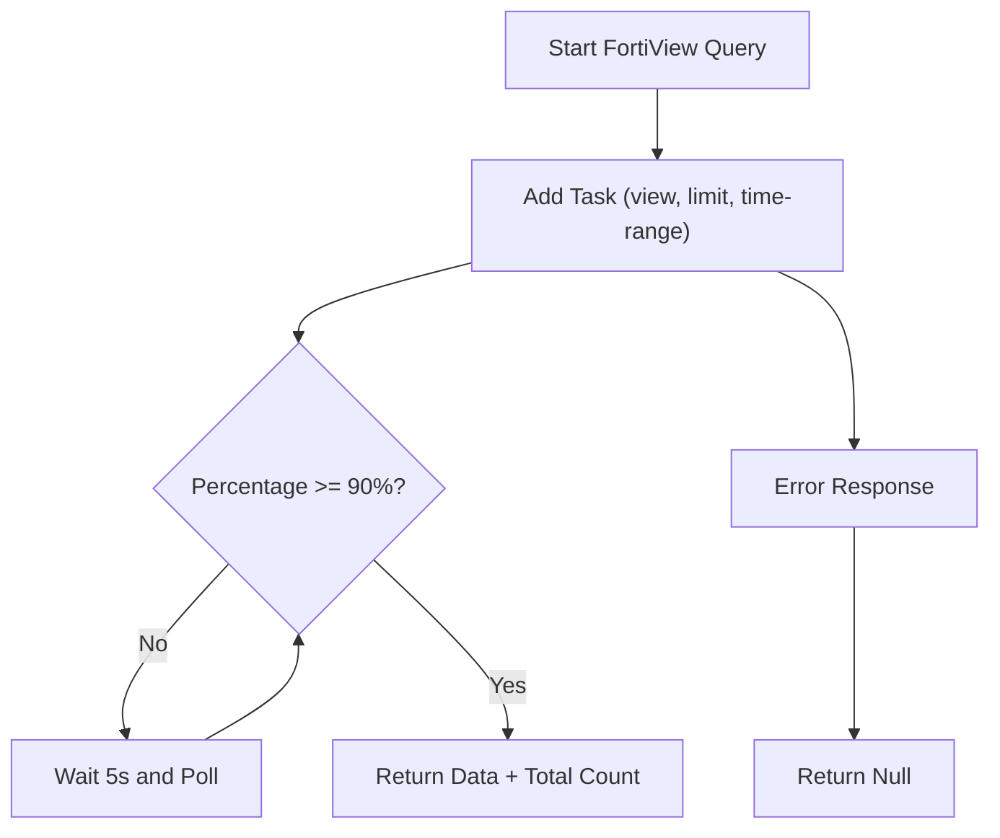
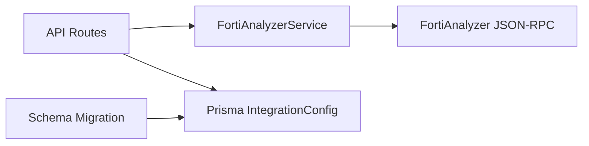

# Fortinet Integration

<cite>
**Referenced Files in This Document**
- [route.ts](file://app/api/integrations/fortianalyzer/route.ts)
- [route.ts](file://app/api/integrations/fortianalyzer/mitre/route.ts)
- [fortianalyzer.ts](file://lib/integrations/fortianalyzer.ts)
- [fortianalyzer.md](file://docs/20-modules/integrations/fortianalyzer.md)
- [integration.sql](file://prisma/migrations/20260203140035_add_fortianalyzer/migration.sql)
- [faz_eventmgmt.htm](file://api-ref/faz_eventmgmt.htm)
- [faz_logview.htm](file://api-ref/faz_logview.htm)
- [test-fa-login.mjs](file://scripts/test-fa-login.mjs)
- [SECURITY_RISKS_CONFIGURATION.md](file://docs/20-modules/security/SECURITY_RISKS_CONFIGURATION.md)
</cite>

## Table of Contents
1. [Introduction](#introduction)
2. [Project Structure](#project-structure)
3. [Core Components](#core-components)
4. [Architecture Overview](#architecture-overview)
5. [Detailed Component Analysis](#detailed-component-analysis)
6. [Dependency Analysis](#dependency-analysis)
7. [Performance Considerations](#performance-considerations)
8. [Troubleshooting Guide](#troubleshooting-guide)
9. [Conclusion](#conclusion)
10. [Appendices](#appendices)

## Introduction
This document explains the Fortinet FortiAnalyzer integration for security event management and threat intelligence. It covers API connectivity, authentication, SSL certificate handling, log collection, security event correlation, MITRE ATT&CK framework integration, and data synchronization patterns for firewall logs, IPS events, and security analytics. It also documents threat intelligence sharing, security policy mapping, and incident response integration, with practical configuration examples, authentication setup, and troubleshooting guidance for high-volume log processing.

## Project Structure
The FortiAnalyzer integration spans API routes, a service layer, and supporting documentation and scripts:
- API routes expose endpoints for configuration, status, ADOM retrieval, event logs, traffic logs, IPS critical events, generic log search, FortiView single/batch queries, and MITRE ATT&CK matrix/technique details.
- The FortiAnalyzer service encapsulates JSON-RPC communication, session lifecycle, retry/backoff, and specialized methods for log search, FortiView, and MITRE ATT&CK.
- Documentation and API reference materials describe architecture, methods, and integration patterns.
- Migration schema defines integration type support in the database.

**Diagram sources**
- [route.ts:110-391](file://app/api/integrations/fortianalyzer/route.ts#L110-L391)
- [route.ts:6-76](file://app/api/integrations/fortianalyzer/mitre/route.ts#L6-L76)
- [fortianalyzer.ts:146-1024](file://lib/integrations/fortianalyzer.ts#L146-L1024)

**Section sources**
- [route.ts:1-392](file://app/api/integrations/fortianalyzer/route.ts#L1-L392)
- [route.ts:1-77](file://app/api/integrations/fortianalyzer/mitre/route.ts#L1-L77)
- [fortianalyzer.ts:146-1024](file://lib/integrations/fortianalyzer.ts#L146-L1024)
- [fortianalyzer.md:1-133](file://docs/20-modules/integrations/fortianalyzer.md#L1-L133)

## Core Components
- API routes for FortiAnalyzer integration:
  - Configuration and testing endpoints for host, username, and password.
  - Status, ADOMs, event logs, traffic logs, IPS critical events, generic log search, and FortiView single/batch queries.
  - MITRE ATT&CK matrix and technique endpoints with domain/time-range/adom options.
- FortiAnalyzer service:
  - JSON-RPC over HTTPS with session-based authentication and optional API key mode.
  - Global session state, mutex, exponential backoff, and retry logic.
  - Methods for status, ADOMs, devices, log search (start/poll/fetch), FortiView, and MITRE ATT&CK.
- Integration schema:
  - Adds integration type FORTIANALYZER to the database schema.

**Section sources**
- [route.ts:30-108](file://app/api/integrations/fortianalyzer/route.ts#L30-L108)
- [route.ts:110-391](file://app/api/integrations/fortianalyzer/route.ts#L110-L391)
- [route.ts:6-76](file://app/api/integrations/fortianalyzer/mitre/route.ts#L6-L76)
- [fortianalyzer.ts:146-1024](file://lib/integrations/fortianalyzer.ts#L146-L1024)
- [integration.sql:1-15](file://prisma/migrations/20260203140035_add_fortianalyzer/migration.sql#L1-L15)

## Architecture Overview
The integration follows a layered architecture:
- API routes orchestrate requests, manage configuration, and delegate to the FortiAnalyzer service.
- The FortiAnalyzer service manages sessions, retries, and backoff, and communicates with FortiAnalyzer via JSON-RPC.
- Data flows include status checks, ADOM/device enumeration, log search with task IDs, FortiView aggregation, and MITRE ATT&CK queries.
- Caching strategies reduce load for heavy queries (e.g., IPS critical events, FortiView single/batch).

**Diagram sources**
- [route.ts:237-268](file://app/api/integrations/fortianalyzer/route.ts#L237-L268)
- [fortianalyzer.ts:621-766](file://lib/integrations/fortianalyzer.ts#L621-L766)

**Section sources**
- [route.ts:164-268](file://app/api/integrations/fortianalyzer/route.ts#L164-L268)
- [fortianalyzer.ts:621-766](file://lib/integrations/fortianalyzer.ts#L621-L766)

## Detailed Component Analysis

### API Routes: FortiAnalyzer Integration
- Configuration and testing:
  - POST /api/integrations/fortianalyzer supports actions:
    - test: validates host, username, and password; performs login and returns success/connected/error.
    - save-config: persists host, username, and password in integration configuration; resets global backoff state for immediate credential updates.
- Data retrieval endpoints:
  - type=status: returns system status after login.
  - type=adoms: lists ADOMs.
  - type=events: retrieves recent event logs.
  - type=config-revisions: searches admin/system events and falls back to NMS EventCache if FortiAnalyzer returns empty.
  - type=traffic: retrieves recent traffic logs.
  - type=ips-critical: retrieves critical IPS events with a 5-minute in-memory cache and reduced polling cadence.
  - type=log-search: generic debug endpoint to search logs by logtype/filter/limit.
  - type=fortiview: single view query with per-view caching.
  - type=fortiview-batch: batch of views with shared login and caching.
- MITRE ATT&CK endpoints:
  - type=matrix: returns ATT&CK matrix with metadata and counts.
  - type=technique: returns technique details with handler summary.

**Diagram sources**
- [route.ts:30-108](file://app/api/integrations/fortianalyzer/route.ts#L30-L108)
- [route.ts:110-391](file://app/api/integrations/fortianalyzer/route.ts#L110-L391)

**Section sources**
- [route.ts:30-108](file://app/api/integrations/fortianalyzer/route.ts#L30-L108)
- [route.ts:110-391](file://app/api/integrations/fortianalyzer/route.ts#L110-L391)
- [route.ts:6-76](file://app/api/integrations/fortianalyzer/mitre/route.ts#L6-L76)

### FortiAnalyzer Service: Authentication, SSL, and Session Management
- Authentication modes:
  - Username/password session (30-minute TTL) with logout before re-login to avoid session pile-up.
  - API key mode (accessToken) treated as a stateless session.
- SSL certificate configuration:
  - Self-signed certificate bypass is enabled in development via environment variable.
  - Production environments should configure proper certificates; development-only override is present.
- Session lifecycle:
  - Global mutex ensures only one login occurs concurrently across instances.
  - Exponential backoff prevents account lockouts from repeated failures.
  - Session invalidation on specific error codes or messages; logout best-effort on server.
- Retry and timeouts:
  - withRetry applies exponential backoff with jitter for transient failures.
  - Login/search/results requests use AbortController timeouts to avoid hangs.

**Diagram sources**
- [fortianalyzer.ts:146-144](file://lib/integrations/fortianalyzer.ts#L146-L144)
- [fortianalyzer.ts:146-1024](file://lib/integrations/fortianalyzer.ts#L146-L1024)

**Section sources**
- [fortianalyzer.ts:1-13](file://lib/integrations/fortianalyzer.ts#L1-L13)
- [fortianalyzer.ts:146-433](file://lib/integrations/fortianalyzer.ts#L146-L433)
- [fortianalyzer.ts:435-519](file://lib/integrations/fortianalyzer.ts#L435-L519)
- [fortianalyzer.ts:521-616](file://lib/integrations/fortianalyzer.ts#L521-L616)
- [fortianalyzer.ts:621-766](file://lib/integrations/fortianalyzer.ts#L621-L766)
- [fortianalyzer.ts:771-903](file://lib/integrations/fortianalyzer.ts#L771-L903)
- [fortianalyzer.ts:908-1007](file://lib/integrations/fortianalyzer.ts#L908-L1007)
- [fortianalyzer.ts:1012-1021](file://lib/integrations/fortianalyzer.ts#L1012-L1021)
- [fortianalyzer.ts:1031-1072](file://lib/integrations/fortianalyzer.ts#L1031-L1072)

### Log Collection and Security Event Correlation
- Log search pattern:
  - startLogSearch initiates a task with a time range and optional filter, returning a task ID.
  - fetchLogResults polls for completion and returns paginated results.
- Correlation and fallback:
  - Config revisions combine FortiAnalyzer event logs with NMS EventCache when FA returns empty.
  - Alarm queries use a cache-first approach with soft fallback to live FA API for critical events.
- Filtering and parsing:
  - Filters use FortiAnalyzer query syntax (e.g., subtype, action, status).
  - Results are normalized for consumption by frontend components.

**Diagram sources**
- [route.ts:171-230](file://app/api/integrations/fortianalyzer/route.ts#L171-L230)
- [fortianalyzer.ts:621-766](file://lib/integrations/fortianalyzer.ts#L621-L766)

**Section sources**
- [route.ts:171-230](file://app/api/integrations/fortianalyzer/route.ts#L171-L230)
- [fortianalyzer.ts:621-766](file://lib/integrations/fortianalyzer.ts#L621-L766)

### MITRE ATT&CK Framework Integration
- Matrix and technique queries:
  - getMitreAttackMatrix returns tactic/technique coverage with counts and handler summaries.
  - getMitreTechniqueDetails returns technique metadata and handler statistics.
- Options include domain selection, time range, and ADOM targeting.

**Diagram sources**
- [route.ts:57-71](file://app/api/integrations/fortianalyzer/mitre/route.ts#L57-L71)
- [fortianalyzer.ts:908-1007](file://lib/integrations/fortianalyzer.ts#L908-L1007)
- [faz_eventmgmt.htm:1797-2004](file://api-ref/faz_eventmgmt.htm#L1797-L2004)

**Section sources**
- [route.ts:6-76](file://app/api/integrations/fortianalyzer/mitre/route.ts#L6-L76)
- [fortianalyzer.ts:908-1007](file://lib/integrations/fortianalyzer.ts#L908-L1007)
- [faz_eventmgmt.htm:1797-2004](file://api-ref/faz_eventmgmt.htm#L1797-L2004)

### Data Synchronization: Firewall Logs, IPS Events, and Security Analytics
- Firewall logs:
  - Devices enumeration and event logs retrieval via service methods.
- IPS events:
  - Critical severity IPS events retrieved with caching and reduced polling intervals.
- Security analytics:
  - FortiView single/batch queries aggregate top websites, users, and policy metrics with per-view caching.

**Diagram sources**
- [route.ts:287-331](file://app/api/integrations/fortianalyzer/route.ts#L287-L331)
- [route.ts:332-369](file://app/api/integrations/fortianalyzer/route.ts#L332-L369)
- [fortianalyzer.ts:771-903](file://lib/integrations/fortianalyzer.ts#L771-L903)

**Section sources**
- [route.ts:231-268](file://app/api/integrations/fortianalyzer/route.ts#L231-L268)
- [route.ts:287-369](file://app/api/integrations/fortianalyzer/route.ts#L287-L369)
- [fortianalyzer.ts:771-903](file://lib/integrations/fortianalyzer.ts#L771-L903)

### Threat Intelligence Sharing, Security Policy Mapping, and Incident Response
- Threat intelligence sharing:
  - MITRE ATT&CK integration enables correlation of detected techniques with handlers and incidents.
- Security policy mapping:
  - Event logs and FortiView analytics help map policy effectiveness and identify violations.
- Incident response integration:
  - Event management handlers and correlation rules can trigger incident workflows; see FortiAnalyzer event management documentation for handler coverage and rules.

**Section sources**
- [faz_eventmgmt.htm:1341-1552](file://api-ref/faz_eventmgmt.htm#L1341-L1552)
- [faz_eventmgmtconfig.htm:640-691](file://api-ref/faz_eventmgmtconfig.htm#L640-L691)

## Dependency Analysis
- API routes depend on the FortiAnalyzer service and Prisma integration configuration.
- FortiAnalyzer service depends on HTTPS requests, global state, and FortiAnalyzer JSON-RPC endpoints.
- Database migration adds integration type FORTIANALYZER to support persistent configuration.

**Diagram sources**
- [route.ts:8-11](file://app/api/integrations/fortianalyzer/route.ts#L8-L11)
- [fortianalyzer.ts:146-1024](file://lib/integrations/fortianalyzer.ts#L146-L1024)
- [integration.sql:1-15](file://prisma/migrations/20260203140035_add_fortianalyzer/migration.sql#L1-L15)

**Section sources**
- [route.ts:8-11](file://app/api/integrations/fortianalyzer/route.ts#L8-L11)
- [integration.sql:1-15](file://prisma/migrations/20260203140035_add_fortianalyzer/migration.sql#L1-L15)

## Performance Considerations
- Caching:
  - IPS critical events cached for 5 minutes; FortiView single/batch queries cached with TTL.
- Reduced polling:
  - IPS critical events poll up to four times with shorter intervals to minimize latency.
- Retry and backoff:
  - Transient failures retried with exponential backoff; login backoff prevents lockouts.
- Timeouts:
  - Login (60s), log search (90s), and results (120s) timeouts prevent indefinite waits.
- Device filtering:
  - Environment variable controls device scope for log queries to reduce payload size.

**Section sources**
- [route.ts:238-268](file://app/api/integrations/fortianalyzer/route.ts#L238-L268)
- [route.ts:294-331](file://app/api/integrations/fortianalyzer/route.ts#L294-L331)
- [route.ts:340-369](file://app/api/integrations/fortianalyzer/route.ts#L340-L369)
- [fortianalyzer.ts:43-78](file://lib/integrations/fortianalyzer.ts#L43-L78)
- [fortianalyzer.ts:621-766](file://lib/integrations/fortianalyzer.ts#L621-L766)

## Troubleshooting Guide
- Connection and authentication:
  - Use the test action to validate host, username, and password; review error messages for login failures.
  - If account appears locked, unlock via FortiAnalyzer GUI and allow backoff to expire.
- SSL certificate issues:
  - Development environment uses self-signed certificate bypass; ensure production uses valid certificates.
- Session management:
  - Logout best-effort before re-login to prevent session pile-up; invalidate session on specific error codes.
- Timeout handling:
  - Requests include AbortController timeouts; transient failures are retried with exponential backoff.
- Log search failures:
  - Absence of TID indicates search timeout; adjust filters or increase limits.

**Section sources**
- [route.ts:35-56](file://app/api/integrations/fortianalyzer/route.ts#L35-L56)
- [fortianalyzer.ts:167-186](file://lib/integrations/fortianalyzer.ts#L167-L186)
- [fortianalyzer.ts:213-249](file://lib/integrations/fortianalyzer.ts#L213-L249)
- [fortianalyzer.ts:367-432](file://lib/integrations/fortianalyzer.ts#L367-L432)
- [test-fa-login.mjs:1-53](file://scripts/test-fa-login.mjs#L1-L53)

## Conclusion
The FortiAnalyzer integration provides robust connectivity for security event management and threat intelligence. It supports secure authentication, resilient session handling, efficient log collection, and advanced analytics via FortiView and MITRE ATT&CK. The documented endpoints, caching strategies, and troubleshooting guidance enable reliable operation at scale, with practical examples for configuration and maintenance.

## Appendices

### Practical Configuration Examples
- Configure FortiAnalyzer host and credentials:
  - Use the save-config action to persist host, username, and password; the system resets backoff state for immediate effect.
- Test connectivity:
  - Use the test action to validate credentials and login success.
- Example MITRE queries:
  - Matrix: specify domain and time range; technique: provide techId with domain/time range/adom.

**Section sources**
- [route.ts:58-101](file://app/api/integrations/fortianalyzer/route.ts#L58-L101)
- [route.ts:35-56](file://app/api/integrations/fortianalyzer/route.ts#L35-L56)
- [route.ts:8-21](file://app/api/integrations/fortianalyzer/mitre/route.ts#L8-L21)

### Security Event Filtering and Parsing Notes
- Filters:
  - Use FortiAnalyzer query syntax for subtype, action, status, and device selection.
- Parsing:
  - Results are normalized for frontend consumption; ensure downstream components handle missing fields gracefully.

**Section sources**
- [route.ts:174-178](file://app/api/integrations/fortianalyzer/route.ts#L174-L178)
- [route.ts:274-284](file://app/api/integrations/fortianalyzer/route.ts#L274-L284)
- [faz_logview.htm:2594-2604](file://api-ref/faz_logview.htm#L2594-L2604)

### Security Risks and Threat Intelligence
- Threat log analysis:
  - Use FortiAnalyzer logs to detect IPS events, malware/virus detections, policy violations, and compromised hosts, mapping to risk entries.

**Section sources**
- [SECURITY_RISKS_CONFIGURATION.md:157-184](file://docs/20-modules/security/SECURITY_RISKS_CONFIGURATION.md#L157-L184)