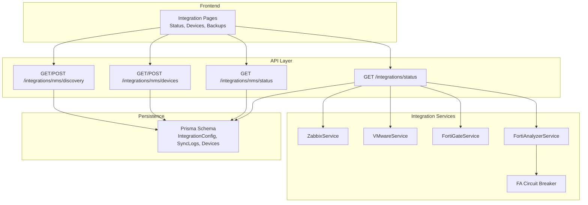
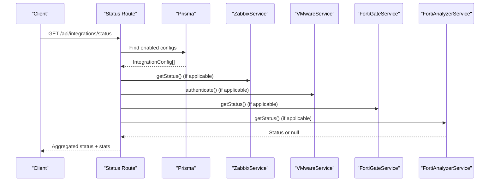
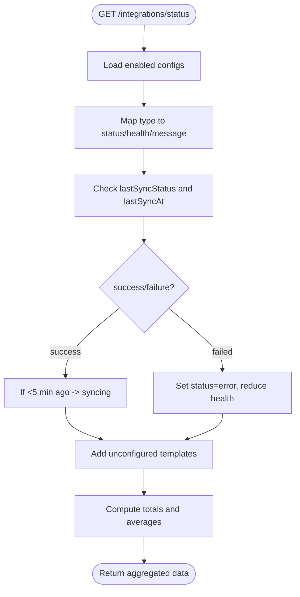
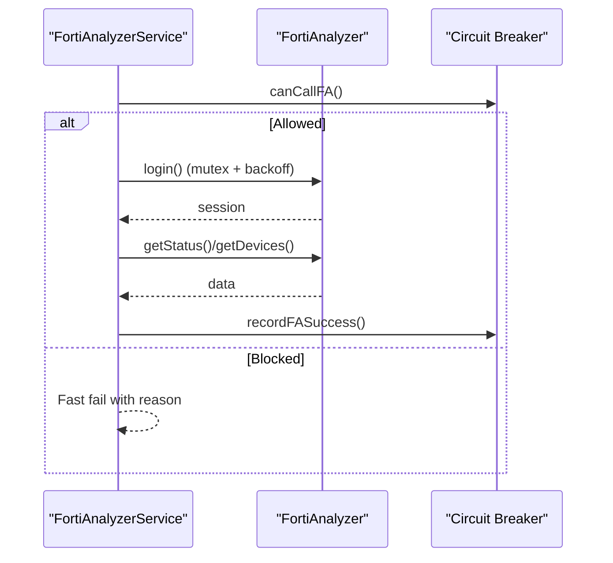
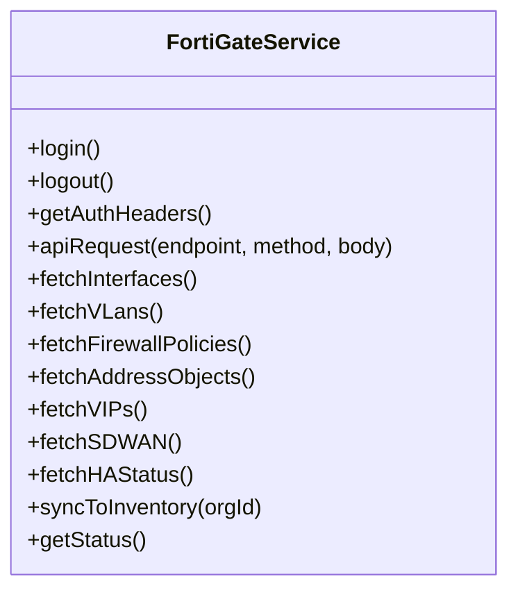
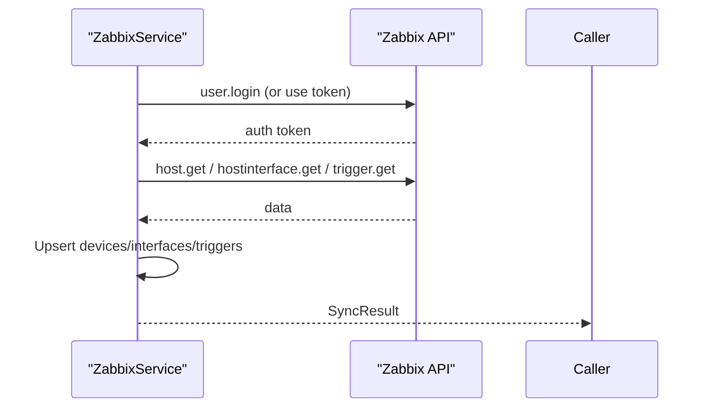
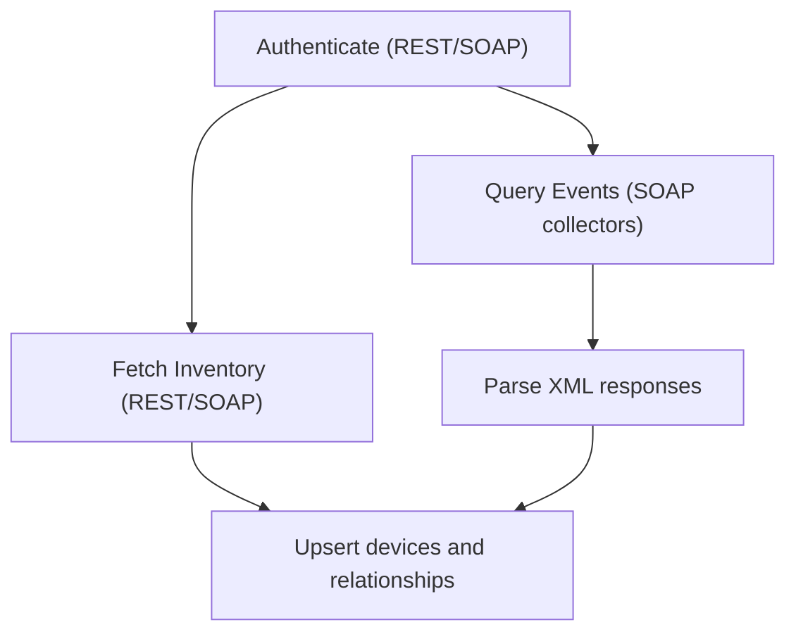
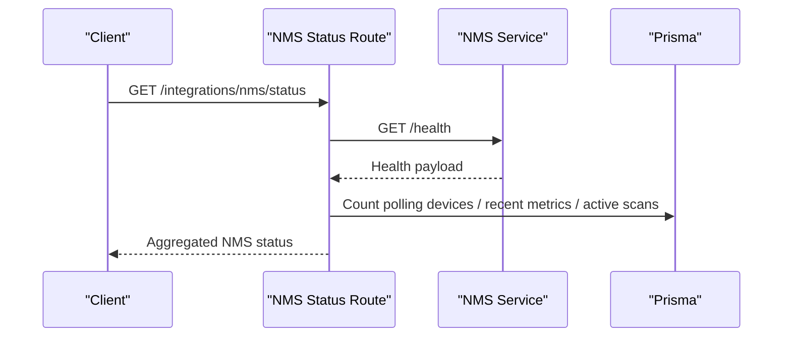
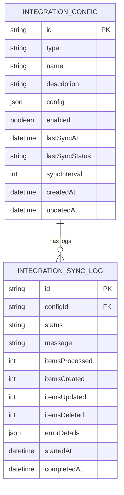
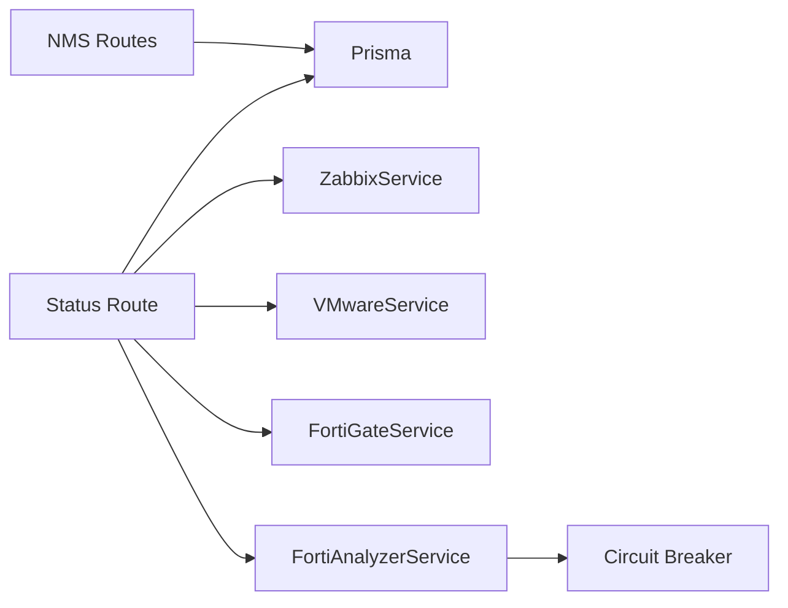

# Integration Configuration & Management

<cite>
**Referenced Files in This Document**
- [app/api/integrations/status/route.ts](file://app/api/integrations/status/route.ts)
- [lib/integrations/index.ts](file://lib/integrations/index.ts)
- [lib/integrations/fortianalyzer.ts](file://lib/integrations/fortianalyzer.ts)
- [lib/integrations/fortigate.ts](file://lib/integrations/fortigate.ts)
- [lib/integrations/zabbix.ts](file://lib/integrations/zabbix.ts)
- [lib/integrations/vmware.ts](file://lib/integrations/vmware.ts)
- [lib/integrations/fa-circuit-breaker.ts](file://lib/integrations/fa-circuit-breaker.ts)
- [app/api/integrations/nms/route.ts](file://app/api/integrations/nms/route.ts)
- [app/api/integrations/nms/devices/route.ts](file://app/api/integrations/nms/devices/route.ts)
- [app/api/integrations/nms/discovery/route.ts](file://app/api/integrations/nms/discovery/route.ts)
- [prisma/schema.prisma](file://prisma/schema.prisma)
</cite>

## Table of Contents
1. [Introduction](#introduction)
2. [Project Structure](#project-structure)
3. [Core Components](#core-components)
4. [Architecture Overview](#architecture-overview)
5. [Detailed Component Analysis](#detailed-component-analysis)
6. [Dependency Analysis](#dependency-analysis)
7. [Performance Considerations](#performance-considerations)
8. [Troubleshooting Guide](#troubleshooting-guide)
9. [Conclusion](#conclusion)
10. [Appendices](#appendices)

## Introduction
This document describes how integrations are configured, monitored, and maintained across external systems in the platform. It covers:
- Integration status monitoring and health checks
- Connectivity verification and authentication token handling
- Device registration workflows and credential management
- Backup management for integrated systems (including automated scheduling and restoration)
- Troubleshooting procedures, error logging, and diagnostics
- Practical examples for adding new integrations, configuring webhook endpoints, and managing credentials
- Security considerations for external connections, access control, and audit logging

## Project Structure
The integration subsystem spans frontend pages, backend API routes, and service libraries:
- API routes under app/api/integrations expose endpoints for status, device management, discovery, and NMS health.
- Service libraries under lib/integrations encapsulate external system clients (Zabbix, VMware, Fortinet, FortiAnalyzer).
- Prisma schema defines integration configuration records and related entities.

**Diagram sources**
- [app/api/integrations/status/route.ts:1-202](file://app/api/integrations/status/route.ts#L1-L202)
- [app/api/integrations/nms/route.ts:1-53](file://app/api/integrations/nms/route.ts#L1-L53)
- [app/api/integrations/nms/devices/route.ts:1-117](file://app/api/integrations/nms/devices/route.ts#L1-L117)
- [app/api/integrations/nms/discovery/route.ts:1-83](file://app/api/integrations/nms/discovery/route.ts#L1-L83)
- [lib/integrations/zabbix.ts:1-438](file://lib/integrations/zabbix.ts#L1-L438)
- [lib/integrations/vmware.ts:1-800](file://lib/integrations/vmware.ts#L1-L800)
- [lib/integrations/fortigate.ts:1-800](file://lib/integrations/fortigate.ts#L1-L800)
- [lib/integrations/fortianalyzer.ts:1-800](file://lib/integrations/fortianalyzer.ts#L1-L800)
- [lib/integrations/fa-circuit-breaker.ts:1-212](file://lib/integrations/fa-circuit-breaker.ts#L1-L212)
- [prisma/schema.prisma:764-800](file://prisma/schema.prisma#L764-L800)

**Section sources**
- [app/api/integrations/status/route.ts:1-202](file://app/api/integrations/status/route.ts#L1-L202)
- [lib/integrations/index.ts:1-48](file://lib/integrations/index.ts#L1-L48)
- [prisma/schema.prisma:764-800](file://prisma/schema.prisma#L764-L800)

## Core Components
- Integration configuration model: Stores type, name, encrypted credentials, enabled flag, sync interval, and timestamps.
- Integration status aggregator: Computes per-integration status, health score, and last sync label; includes unconfigured integrations.
- Service clients:
  - ZabbixService: Authentication, host/interface/trigger sync, and status.
  - VMwareService: SOAP/REST authentication, event querying, and inventory sync.
  - FortiGateService: Cookie/Bearer auth, REST API calls, and inventory sync.
  - FortiAnalyzerService: JSON-RPC with session management, login mutex, backoff, and log search.
- NMS integration: Health status, device polling, discovery scanning, and metrics ingestion.
- Circuit breaker: Protects FortiAnalyzer from cascading failures.

**Section sources**
- [prisma/schema.prisma:764-800](file://prisma/schema.prisma#L764-L800)
- [app/api/integrations/status/route.ts:14-181](file://app/api/integrations/status/route.ts#L14-L181)
- [lib/integrations/zabbix.ts:88-147](file://lib/integrations/zabbix.ts#L88-L147)
- [lib/integrations/vmware.ts:154-743](file://lib/integrations/vmware.ts#L154-L743)
- [lib/integrations/fortigate.ts:171-286](file://lib/integrations/fortigate.ts#L171-L286)
- [lib/integrations/fortianalyzer.ts:146-433](file://lib/integrations/fortianalyzer.ts#L146-L433)
- [lib/integrations/fa-circuit-breaker.ts:48-166](file://lib/integrations/fa-circuit-breaker.ts#L48-L166)
- [app/api/integrations/nms/route.ts:8-47](file://app/api/integrations/nms/route.ts#L8-L47)

## Architecture Overview
The integration architecture follows a layered pattern:
- API routes orchestrate integration status and device management.
- Service clients encapsulate external system protocols and authentication.
- Prisma persists integration configurations, sync logs, and device metadata.
- NMS provides polling, discovery, and metrics ingestion.

**Diagram sources**
- [app/api/integrations/status/route.ts:14-181](file://app/api/integrations/status/route.ts#L14-L181)
- [lib/integrations/zabbix.ts:421-434](file://lib/integrations/zabbix.ts#L421-L434)
- [lib/integrations/vmware.ts:694-743](file://lib/integrations/vmware.ts#L694-L743)
- [lib/integrations/fortigate.ts:784-797](file://lib/integrations/fortigate.ts#L784-L797)
- [lib/integrations/fortianalyzer.ts:438-483](file://lib/integrations/fortianalyzer.ts#L438-L483)

## Detailed Component Analysis

### Integration Status Monitoring
- Aggregates live status from configured integrations and injects unconfigured templates.
- Computes health scores and last sync labels based on thresholds.
- Tracks sync status to mark integrations as syncing or error.

**Diagram sources**
- [app/api/integrations/status/route.ts:14-181](file://app/api/integrations/status/route.ts#L14-L181)

**Section sources**
- [app/api/integrations/status/route.ts:14-181](file://app/api/integrations/status/route.ts#L14-L181)

### FortiAnalyzer Integration
- Session lifecycle with global state, mutex, and backoff to prevent account lockouts.
- Login/logout, session TTL, and JSON-RPC wrappers with retry logic.
- Event log search with task-based retrieval and timeouts.
- Circuit breaker integration to protect downstream consumers.

**Diagram sources**
- [lib/integrations/fortianalyzer.ts:280-433](file://lib/integrations/fortianalyzer.ts#L280-L433)
- [lib/integrations/fa-circuit-breaker.ts:48-147](file://lib/integrations/fa-circuit-breaker.ts#L48-L147)

**Section sources**
- [lib/integrations/fortianalyzer.ts:146-483](file://lib/integrations/fortianalyzer.ts#L146-L483)
- [lib/integrations/fa-circuit-breaker.ts:191-212](file://lib/integrations/fa-circuit-breaker.ts#L191-L212)

### FortiGate Integration
- Dual authentication modes: cookie-based session and Bearer token.
- Logout to prevent session pile-ups; CSRF token handling.
- REST API calls for interfaces, VLANs, policies, addresses, VIPs, SD-WAN, HA.
- Inventory sync to database with upserts and error accumulation.

**Diagram sources**
- [lib/integrations/fortigate.ts:171-797](file://lib/integrations/fortigate.ts#L171-L797)

**Section sources**
- [lib/integrations/fortigate.ts:171-797](file://lib/integrations/fortigate.ts#L171-L797)

### Zabbix Integration
- Token-based authentication and JSON-RPC calls.
- Host, interface, and trigger synchronization with device mapping.
- Status reporting via API version query.

**Diagram sources**
- [lib/integrations/zabbix.ts:88-147](file://lib/integrations/zabbix.ts#L88-L147)
- [lib/integrations/zabbix.ts:255-416](file://lib/integrations/zabbix.ts#L255-L416)

**Section sources**
- [lib/integrations/zabbix.ts:88-434](file://lib/integrations/zabbix.ts#L88-L434)

### VMware Integration
- REST and SOAP authentication with fallbacks and session auto-refresh.
- Event history collection via SOAP collectors and XML parsing.
- Inventory sync for datacenters, clusters, hosts, VMs, datastores.

**Diagram sources**
- [lib/integrations/vmware.ts:694-743](file://lib/integrations/vmware.ts#L694-L743)
- [lib/integrations/vmware.ts:217-520](file://lib/integrations/vmware.ts#L217-L520)

**Section sources**
- [lib/integrations/vmware.ts:154-800](file://lib/integrations/vmware.ts#L154-L800)

### NMS Integration
- Health status aggregation for NMS service and polling activity.
- Device polling enablement with SNMP configuration assignment.
- Discovery scanning initiation and progress tracking.

**Diagram sources**
- [app/api/integrations/nms/route.ts:8-47](file://app/api/integrations/nms/route.ts#L8-L47)

**Section sources**
- [app/api/integrations/nms/route.ts:8-47](file://app/api/integrations/nms/route.ts#L8-L47)
- [app/api/integrations/nms/devices/route.ts:12-116](file://app/api/integrations/nms/devices/route.ts#L12-L116)
- [app/api/integrations/nms/discovery/route.ts:12-82](file://app/api/integrations/nms/discovery/route.ts#L12-L82)

### Integration Configuration Model
- IntegrationConfig stores type, name, encrypted config, enabled flag, sync interval, and timestamps.
- IntegrationSyncLog tracks sync outcomes and error details.

**Diagram sources**
- [prisma/schema.prisma:764-800](file://prisma/schema.prisma#L764-L800)

**Section sources**
- [prisma/schema.prisma:764-800](file://prisma/schema.prisma#L764-L800)

## Dependency Analysis
- API routes depend on Prisma for configuration and device metadata.
- Service clients encapsulate external protocol specifics and are reused by status routes.
- Circuit breaker isolates FortiAnalyzer to improve resilience.

**Diagram sources**
- [app/api/integrations/status/route.ts:14-181](file://app/api/integrations/status/route.ts#L14-L181)
- [lib/integrations/fortianalyzer.ts:146-433](file://lib/integrations/fortianalyzer.ts#L146-L433)
- [lib/integrations/fa-circuit-breaker.ts:48-166](file://lib/integrations/fa-circuit-breaker.ts#L48-L166)
- [app/api/integrations/nms/route.ts:8-47](file://app/api/integrations/nms/route.ts#L8-L47)

**Section sources**
- [app/api/integrations/status/route.ts:14-181](file://app/api/integrations/status/route.ts#L14-L181)
- [lib/integrations/fortianalyzer.ts:146-433](file://lib/integrations/fortianalyzer.ts#L146-L433)
- [lib/integrations/fa-circuit-breaker.ts:48-166](file://lib/integrations/fa-circuit-breaker.ts#L48-L166)
- [app/api/integrations/nms/route.ts:8-47](file://app/api/integrations/nms/route.ts#L8-L47)

## Performance Considerations
- FortiAnalyzer circuit breaker prevents repeated failures and allows recovery testing.
- Retry mechanisms with exponential backoff reduce transient failure impact.
- SOAP/REST authentication includes session reuse and auto-refresh to minimize overhead.
- Status route computes health scores and last sync labels client-side to reduce DB load.

[No sources needed since this section provides general guidance]

## Troubleshooting Guide
- FortiAnalyzer login failures:
  - Review backoff windows and account lockout conditions; use circuit breaker status to diagnose.
  - Invalidate session on both local and global state to force re-authentication.
- FortiGate session pile-ups:
  - Ensure logout is called before re-authentication to prevent admin session limits.
- Zabbix authentication:
  - Verify token-based auth and API version availability.
- VMware authentication:
  - Prefer REST API where available; fall back to SOAP with proper session handling.
- NMS health:
  - Check service availability and recent health metrics to confirm polling activity.

**Section sources**
- [lib/integrations/fortianalyzer.ts:300-433](file://lib/integrations/fortianalyzer.ts#L300-L433)
- [lib/integrations/fa-circuit-breaker.ts:114-166](file://lib/integrations/fa-circuit-breaker.ts#L114-L166)
- [lib/integrations/fortigate.ts:195-224](file://lib/integrations/fortigate.ts#L195-L224)
- [lib/integrations/zabbix.ts:130-147](file://lib/integrations/zabbix.ts#L130-L147)
- [lib/integrations/vmware.ts:694-743](file://lib/integrations/vmware.ts#L694-L743)
- [app/api/integrations/nms/route.ts:8-47](file://app/api/integrations/nms/route.ts#L8-L47)

## Conclusion
The integration subsystem provides robust status monitoring, resilient external connectivity, and comprehensive device management across Zabbix, VMware, Fortinet, and NMS. Configuration persistence, sync logging, and circuit breaking ensure reliability and observability. The APIs and services are structured to support secure, auditable, and maintainable integration workflows.

[No sources needed since this section summarizes without analyzing specific files]

## Appendices

### Adding a New Integration
- Define configuration schema and types in the integration service.
- Implement authentication and data retrieval methods.
- Wire into the status aggregator to surface health and sync status.
- Persist configuration via IntegrationConfig and log sync outcomes.

**Section sources**
- [lib/integrations/index.ts:11-48](file://lib/integrations/index.ts#L11-L48)
- [app/api/integrations/status/route.ts:47-94](file://app/api/integrations/status/route.ts#L47-L94)

### Configuring Webhook Endpoints
- NMS discovery and health endpoints are proxied through API routes.
- Ensure NMS service URL is configured and reachable from the API runtime.

**Section sources**
- [app/api/integrations/nms/discovery/route.ts:47-70](file://app/api/integrations/nms/discovery/route.ts#L47-L70)
- [app/api/integrations/nms/route.ts:11-23](file://app/api/integrations/nms/route.ts#L11-L23)

### Managing Integration Credentials
- Store encrypted credentials in IntegrationConfig.config.
- Use service-specific auth flows (cookie/Bearer/token) and logout to prevent session leaks.
- Rotate tokens and update stored credentials through secure channels.

**Section sources**
- [prisma/schema.prisma:764-777](file://prisma/schema.prisma#L764-L777)
- [lib/integrations/fortigate.ts:229-286](file://lib/integrations/fortigate.ts#L229-L286)
- [lib/integrations/fortianalyzer.ts:280-311](file://lib/integrations/fortianalyzer.ts#L280-L311)

### Backup Management for Integrated Systems
- NMS backup records are tracked via NmsBackup and related metrics.
- Automated backup scheduling and restoration procedures are coordinated through NMS service endpoints and reflected in the UI.

**Section sources**
- [prisma/schema.prisma:219-219](file://prisma/schema.prisma#L219-L219)
- [app/api/integrations/nms/devices/route.ts:1-117](file://app/api/integrations/nms/devices/route.ts#L1-L117)

### Security Considerations
- Disable strict TLS verification only in controlled environments; prefer certificate pinning or trusted CA.
- Enforce least privilege for integration accounts and rotate credentials regularly.
- Use audit logs to track integration configuration changes and sync outcomes.

**Section sources**
- [lib/integrations/fortianalyzer.ts:3-6](file://lib/integrations/fortianalyzer.ts#L3-L6)
- [lib/integrations/vmware.ts:696-697](file://lib/integrations/vmware.ts#L696-L697)
- [prisma/schema.prisma:390-402](file://prisma/schema.prisma#L390-L402)