# Multi-System Integration

<cite>
**Referenced Files in This Document**
- [nms_service/main.py](file://nms_service/main.py)
- [nms_service/orchestrator.py](file://nms_service/orchestrator.py)
- [nms_service/discovery_worker.py](file://nms_service/discovery_worker.py)
- [nms_service/snmp/poller.py](file://nms_service/snmp/poller.py)
- [nms_service/snmp/session.py](file://nms_service/snmp/session.py)
- [nms_service/ssh/poller.py](file://nms_service/ssh/poller.py)
- [nms_service/core/config.py](file://nms_service/core/config.py)
- [nms_service/database/models.py](file://nms_service/database/models.py)
- [nms_service/database/repository.py](file://nms_service/database/repository.py)
- [nms_service/core/models.py](file://nms_service/core/models.py)
- [prisma/schema.prisma](file://prisma/schema.prisma)
- [app/api/integrations/nms/route.ts](file://app/api/integrations/nms/route.ts)
- [app/api/integrations/nms/devices/route.ts](file://app/api/integrations/nms/devices/route.ts)
- [app/api/integrations/nms/discovery/route.ts](file://app/api/integrations/nms/discovery/route.ts)
- [app/api/integrations/nms/discovery/[scanId]/route.ts](file://app/api/integrations/nms/discovery/[scanId]/route.ts)
- [app/api/integrations/nms/discovery/[scanId]/import/route.ts](file://app/api/integrations/nms/discovery/[scanId]/import/route.ts)
- [app/api/integrations/nms/backups/route.ts](file://app/api/integrations/nms/backups/route.ts)
- [app/api/integrations/nms/backups/[id]/route.ts](file://app/api/integrations/nms/backups/[id]/route.ts)
- [app/api/integrations/nms/network-devices/route.ts](file://app/api/integrations/nms/network-devices/route.ts)
- [app/api/integrations/nms/network-devices/[id]/route.ts](file://app/api/integrations/nms/network-devices/[id]/route.ts)
- [app/api/integrations/nms/devices/[id]/backups/route.ts](file://app/api/integrations/nms/devices/[id]/backups/route.ts)
- [app/api/integrations/nms/devices/[id]/backups/[backupId]/route.ts](file://app/api/integrations/nms/devices/[id]/backups/[backupId]/route.ts)
- [app/api/integrations/nms/devices/[id]/ports/[portName]/route.ts](file://app/api/integrations/nms/devices/[id]/ports/[portName]/route.ts)
- [app/api/integrations/nms/devices/[id]/ports/monitored/route.ts](file://app/api/integrations/nms/devices/[id]/ports/monitored/route.ts)
- [app/api/integrations/nms/alarms/route.ts](file://app/api/integrations/nms/alarms/route.ts)
- [app/api/integrations/vmware/route.ts](file://app/api/integrations/vmware/route.ts)
- [app/api/integrations/fortianalyzer/route.ts](file://app/api/integrations/fortianalyzer/route.ts)
- [app/api/integrations/fortianalyzer/mitre/route.ts](file://app/api/integrations/fortianalyzer/mitre/route.ts)
- [app/api/integrations/fortigate/route.ts](file://app/api/integrations/fortigate/route.ts)
- [app/api/integrations/status/route.ts](file://app/api/integrations/status/route.ts)
</cite>

## Table of Contents
1. [Introduction](#introduction)
2. [Project Structure](#project-structure)
3. [Core Components](#core-components)
4. [Architecture Overview](#architecture-overview)
5. [Detailed Component Analysis](#detailed-component-analysis)
6. [Dependency Analysis](#dependency-analysis)
7. [Performance Considerations](#performance-considerations)
8. [Troubleshooting Guide](#troubleshooting-guide)
9. [Conclusion](#conclusion)
10. [Appendices](#appendices)

## Introduction
This document explains the multi-system integration capabilities of InfraScope with a focus on external system connectivity and data synchronization. It covers:
- Network Management Service (NMS) architecture for SNMP polling, device discovery, and background processing
- Integration patterns with VMware vCenter for virtualization management, Zabbix for monitoring and alerting, and Fortinet for security operations
- Authentication, webhook configuration, and real-time data synchronization
- Data mapping between external systems and InfraScope models
- Integration monitoring, error handling, and retry mechanisms
- Practical setup examples, data flows, and troubleshooting guidance
- Security considerations and access control for external system connections

## Project Structure
InfraScope’s integration architecture spans:
- A Python-based NMS service that polls network devices, discovers new assets, and persists metrics to the shared PostgreSQL database
- A Next.js API surface that exposes integration endpoints for UI and automation
- A Prisma-managed schema that defines shared models and relationships across integrations

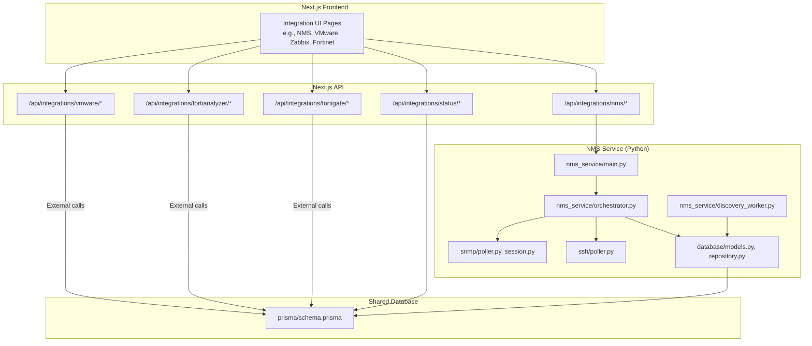

**Diagram sources**
- [nms_service/main.py:39-483](file://nms_service/main.py#L39-L483)
- [nms_service/orchestrator.py:35-461](file://nms_service/orchestrator.py#L35-L461)
- [nms_service/discovery_worker.py:128-262](file://nms_service/discovery_worker.py#L128-L262)
- [nms_service/snmp/poller.py:63-592](file://nms_service/snmp/poller.py#L63-L592)
- [nms_service/ssh/poller.py:221-625](file://nms_service/ssh/poller.py#L221-L625)
- [nms_service/database/models.py:43-227](file://nms_service/database/models.py#L43-L227)
- [nms_service/database/repository.py:28-251](file://nms_service/database/repository.py#L28-L251)
- [prisma/schema.prisma:152-228](file://prisma/schema.prisma#L152-L228)

**Section sources**
- [nms_service/main.py:39-483](file://nms_service/main.py#L39-L483)
- [nms_service/orchestrator.py:35-461](file://nms_service/orchestrator.py#L35-L461)
- [nms_service/discovery_worker.py:128-262](file://nms_service/discovery_worker.py#L128-L262)
- [nms_service/snmp/poller.py:63-592](file://nms_service/snmp/poller.py#L63-L592)
- [nms_service/ssh/poller.py:221-625](file://nms_service/ssh/poller.py#L221-L625)
- [nms_service/database/models.py:43-227](file://nms_service/database/models.py#L43-L227)
- [nms_service/database/repository.py:28-251](file://nms_service/database/repository.py#L28-L251)
- [prisma/schema.prisma:152-228](file://prisma/schema.prisma#L152-L228)

## Core Components
- NMS Orchestrator: Registers devices from InfraScope’s shared database, polls them concurrently via SNMP and SSH, and writes metrics to nms_* tables. Implements dynamic polling intervals and fallbacks.
- SNMP Poller: Performs OID walks and queries for interfaces, health, inventory, and topology using subprocess-based net-snmp commands.
- SSH Poller: Stateless SSH sessions for interface status, device health, and configuration backups with vendor-aware command selection.
- Discovery Worker: Scans CIDR ranges for reachable devices using parallel SNMP and SSH probes, storing results in discovery tables.
- Database Layer: SQLAlchemy models and repositories mapping to Prisma-managed tables, including nms_* metrics and discovery artifacts.
- API Surface: Next.js routes under /api/integrations expose NMS, VMware, Zabbix, and Fortinet integrations.

**Section sources**
- [nms_service/orchestrator.py:35-461](file://nms_service/orchestrator.py#L35-L461)
- [nms_service/snmp/poller.py:63-592](file://nms_service/snmp/poller.py#L63-L592)
- [nms_service/ssh/poller.py:221-625](file://nms_service/ssh/poller.py#L221-L625)
- [nms_service/discovery_worker.py:128-262](file://nms_service/discovery_worker.py#L128-L262)
- [nms_service/database/models.py:43-227](file://nms_service/database/models.py#L43-L227)
- [nms_service/database/repository.py:28-251](file://nms_service/database/repository.py#L28-L251)
- [app/api/integrations/nms/route.ts](file://app/api/integrations/nms/route.ts)
- [app/api/integrations/nms/devices/route.ts](file://app/api/integrations/nms/devices/route.ts)
- [app/api/integrations/nms/discovery/route.ts](file://app/api/integrations/nms/discovery/route.ts)
- [app/api/integrations/nms/discovery/[scanId]/route.ts](file://app/api/integrations/nms/discovery/[scanId]/route.ts)
- [app/api/integrations/nms/discovery/[scanId]/import/route.ts](file://app/api/integrations/nms/discovery/[scanId]/import/route.ts)
- [app/api/integrations/nms/backups/route.ts](file://app/api/integrations/nms/backups/route.ts)
- [app/api/integrations/nms/backups/[id]/route.ts](file://app/api/integrations/nms/backups/[id]/route.ts)
- [app/api/integrations/nms/network-devices/route.ts](file://app/api/integrations/nms/network-devices/route.ts)
- [app/api/integrations/nms/network-devices/[id]/route.ts](file://app/api/integrations/nms/network-devices/[id]/route.ts)
- [app/api/integrations/nms/devices/[id]/backups/route.ts](file://app/api/integrations/nms/devices/[id]/backups/route.ts)
- [app/api/integrations/nms/devices/[id]/backups/[backupId]/route.ts](file://app/api/integrations/nms/devices/[id]/backups/[backupId]/route.ts)
- [app/api/integrations/nms/devices/[id]/ports/[portName]/route.ts](file://app/api/integrations/nms/devices/[id]/ports/[portName]/route.ts)
- [app/api/integrations/nms/devices/[id]/ports/monitored/route.ts](file://app/api/integrations/nms/devices/[id]/ports/monitored/route.ts)
- [app/api/integrations/nms/alarms/route.ts](file://app/api/integrations/nms/alarms/route.ts)
- [app/api/integrations/vmware/route.ts](file://app/api/integrations/vmware/route.ts)
- [app/api/integrations/fortianalyzer/route.ts](file://app/api/integrations/fortianalyzer/route.ts)
- [app/api/integrations/fortianalyzer/mitre/route.ts](file://app/api/integrations/fortianalyzer/mitre/route.ts)
- [app/api/integrations/fortigate/route.ts](file://app/api/integrations/fortigate/route.ts)
- [app/api/integrations/status/route.ts](file://app/api/integrations/status/route.ts)

## Architecture Overview
The integration architecture centers on a shared PostgreSQL database managed by Prisma. The NMS service runs as a background process, polling devices and writing metrics. The Next.js API exposes integration endpoints that either call external systems or read from the shared database.

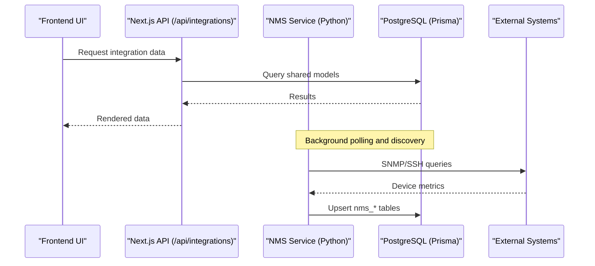

**Diagram sources**
- [nms_service/main.py:39-483](file://nms_service/main.py#L39-L483)
- [nms_service/orchestrator.py:407-434](file://nms_service/orchestrator.py#L407-L434)
- [nms_service/database/models.py:43-227](file://nms_service/database/models.py#L43-L227)
- [prisma/schema.prisma:152-228](file://prisma/schema.prisma#L152-L228)

## Detailed Component Analysis

### Network Management Service (NMS) Orchestration
The orchestrator coordinates device registration, concurrent polling, and persistence:
- Loads polling-enabled devices from the shared database and registers them for SNMP and SSH
- Applies dynamic polling intervals and jitter to avoid thundering herds
- Polls interfaces, health, and topology with fallbacks and throttling
- Writes metrics to nms_* tables and updates last polled timestamps

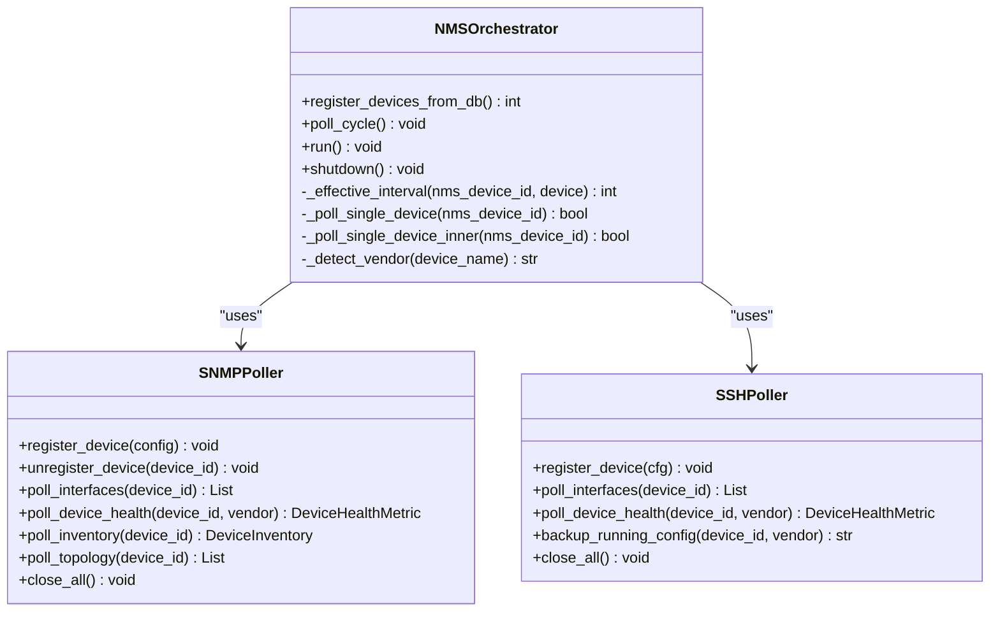

**Diagram sources**
- [nms_service/orchestrator.py:35-461](file://nms_service/orchestrator.py#L35-L461)
- [nms_service/snmp/poller.py:63-592](file://nms_service/snmp/poller.py#L63-L592)
- [nms_service/ssh/poller.py:221-625](file://nms_service/ssh/poller.py#L221-L625)

**Section sources**
- [nms_service/orchestrator.py:35-461](file://nms_service/orchestrator.py#L35-L461)

### SNMP Polling Engine
The SNMP engine performs OID-based queries and vendor-aware parsing:
- Uses subprocess-based net-snmp commands for true parallelism
- Supports vendor-specific OIDs for CPU, memory, temperature, and inventory
- Provides topology discovery via LLDP/CDP

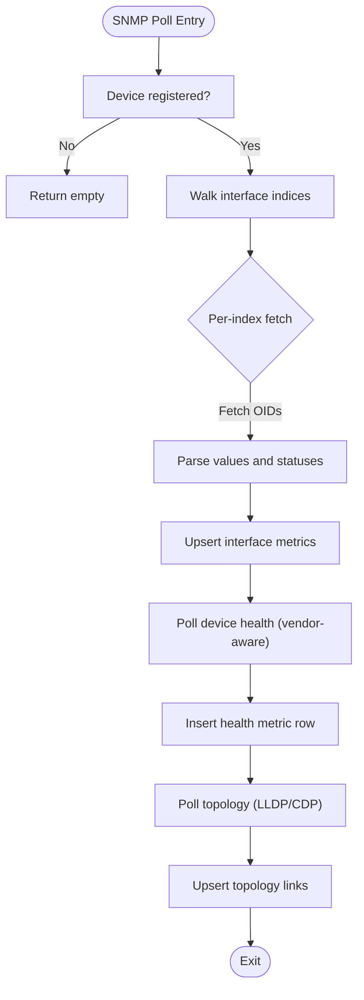

**Diagram sources**
- [nms_service/snmp/poller.py:132-592](file://nms_service/snmp/poller.py#L132-L592)
- [nms_service/snmp/session.py:109-241](file://nms_service/snmp/session.py#L109-L241)

**Section sources**
- [nms_service/snmp/poller.py:132-592](file://nms_service/snmp/poller.py#L132-L592)
- [nms_service/snmp/session.py:109-241](file://nms_service/snmp/session.py#L109-L241)

### SSH Polling and Configuration Backup
The SSH engine provides stateless, vendor-aware operations:
- Global semaphore limits concurrent SSH connections
- Vendor-aware command selection for interface status, device health, and configuration backups
- Pager handling and error detection for robust output parsing

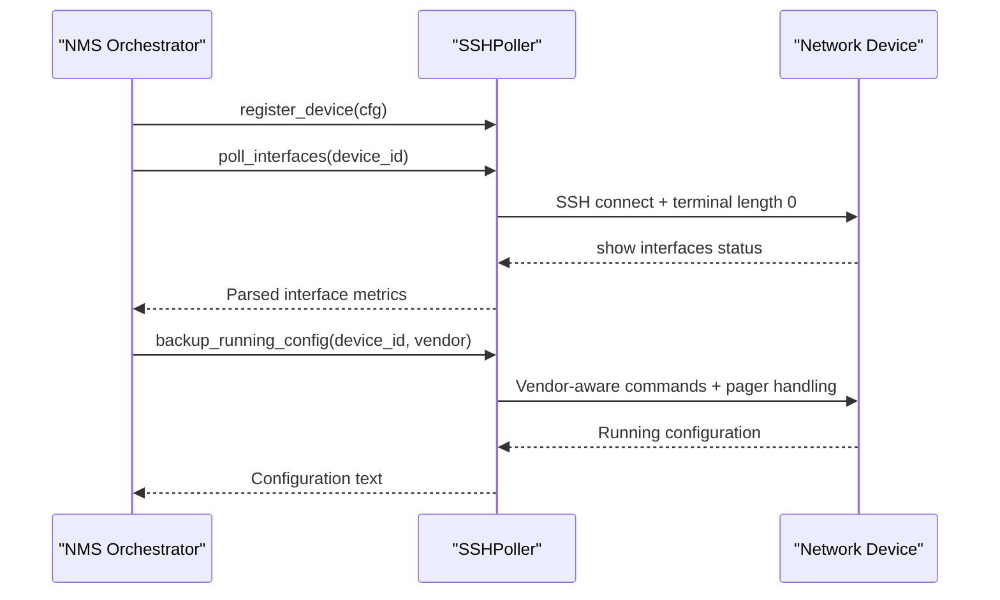

**Diagram sources**
- [nms_service/ssh/poller.py:221-625](file://nms_service/ssh/poller.py#L221-L625)

**Section sources**
- [nms_service/ssh/poller.py:221-625](file://nms_service/ssh/poller.py#L221-L625)

### Network Discovery Workflow
The discovery worker scans CIDR ranges and stores results:
- Parallel SNMP and SSH probes per IP
- Vendor inference from system descriptions
- Batched persistence with conflict resolution

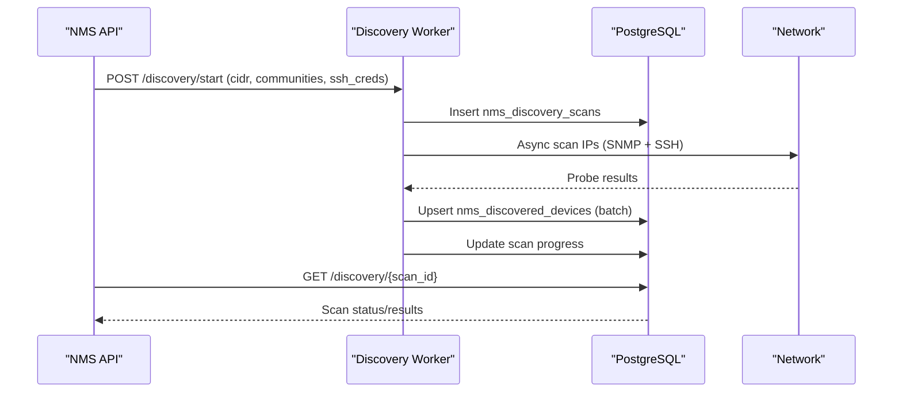

**Diagram sources**
- [nms_service/main.py:328-404](file://nms_service/main.py#L328-L404)
- [nms_service/discovery_worker.py:128-262](file://nms_service/discovery_worker.py#L128-L262)
- [nms_service/database/models.py:146-194](file://nms_service/database/models.py#L146-L194)

**Section sources**
- [nms_service/main.py:328-404](file://nms_service/main.py#L328-L404)
- [nms_service/discovery_worker.py:128-262](file://nms_service/discovery_worker.py#L128-L262)
- [nms_service/database/models.py:146-194](file://nms_service/database/models.py#L146-L194)

### Data Mapping Between External Systems and InfraScope Models
InfraScope’s Prisma schema defines shared models and integration fields:
- Device model includes fields for VMware (vCenter identifiers), Zabbix host IDs, Fortinet device IDs, and NMS integration fields
- NMS metrics tables (nms_interfaces, nms_health_metrics, nms_topology_links) map to the orchestrator’s output
- Integration configuration and sync logs track external system connectivity and synchronization status

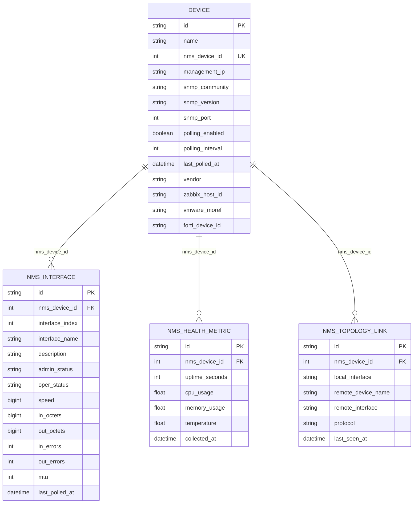

**Diagram sources**
- [prisma/schema.prisma:152-228](file://prisma/schema.prisma#L152-L228)
- [nms_service/database/models.py:43-227](file://nms_service/database/models.py#L43-L227)

**Section sources**
- [prisma/schema.prisma:152-228](file://prisma/schema.prisma#L152-L228)
- [nms_service/database/models.py:43-227](file://nms_service/database/models.py#L43-L227)

### Integration Patterns: VMware vCenter
- InfraScope tracks VMware relationships via Device fields for vCenter identifiers and cluster/datastore references
- The integration endpoint under /api/integrations/vmware provides VMware-specific operations
- Data mapping aligns with Prisma models for clusters, datastores, and relationships

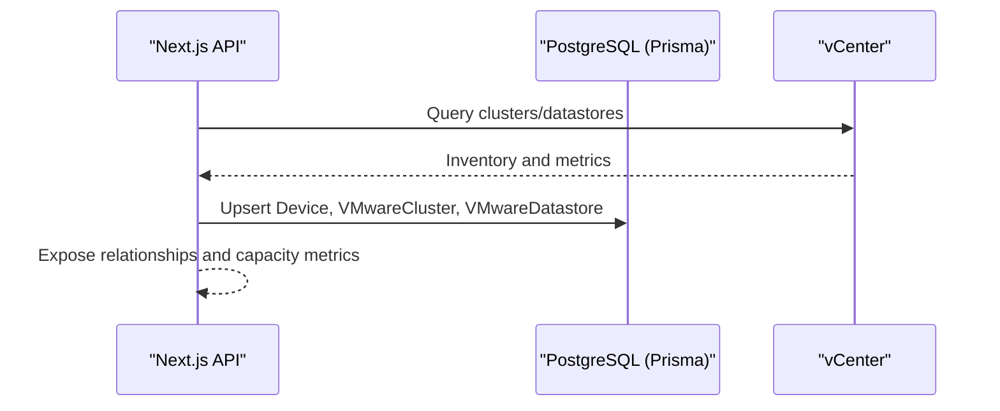

**Diagram sources**
- [app/api/integrations/vmware/route.ts](file://app/api/integrations/vmware/route.ts)
- [prisma/schema.prisma:669-712](file://prisma/schema.prisma#L669-L712)

**Section sources**
- [app/api/integrations/vmware/route.ts](file://app/api/integrations/vmware/route.ts)
- [prisma/schema.prisma:669-712](file://prisma/schema.prisma#L669-L712)

### Integration Patterns: Zabbix
- Device model includes zabbix_host_id for linking Zabbix host identifiers
- The integration endpoint under /api/integrations/zabbix provides Zabbix-specific operations
- Data mapping aligns with Prisma models for relationships and event handling

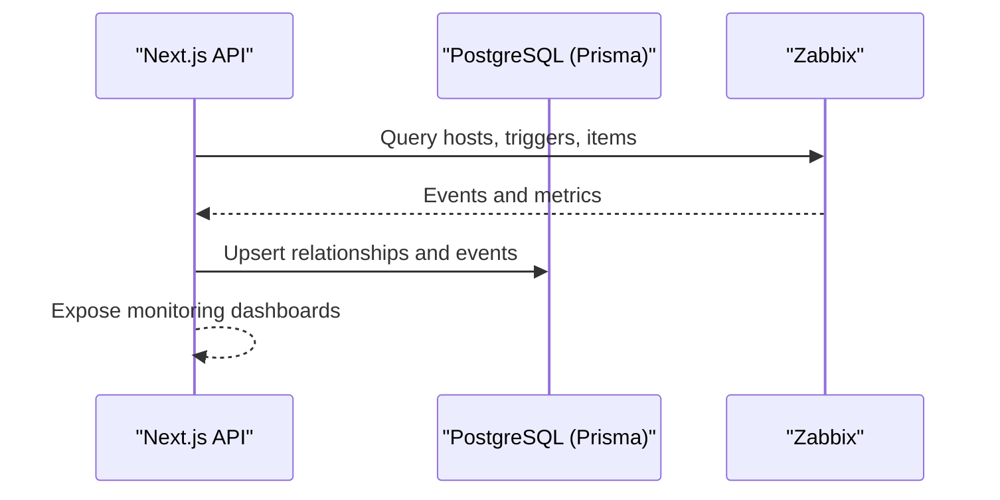

**Diagram sources**
- [app/api/integrations/status/route.ts](file://app/api/integrations/status/route.ts)
- [prisma/schema.prisma:152-228](file://prisma/schema.prisma#L152-L228)

**Section sources**
- [app/api/integrations/status/route.ts](file://app/api/integrations/status/route.ts)
- [prisma/schema.prisma:152-228](file://prisma/schema.prisma#L152-L228)

### Integration Patterns: Fortinet
- Device model includes forti_device_id for Fortinet device linkage
- Fortinet integration endpoints under /api/integrations/fortianalyzer and /api/integrations/fortigate provide Fortinet-specific operations
- MITRE ATT&CK mapping endpoint under /api/integrations/fortianalyzer/mitre supports threat intelligence alignment

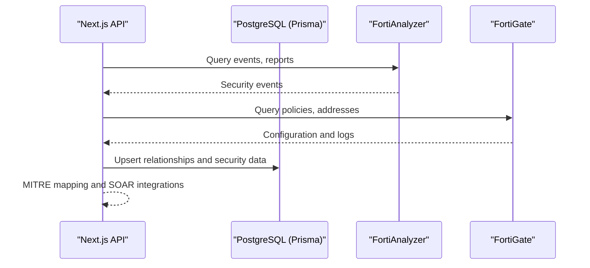

**Diagram sources**
- [app/api/integrations/fortianalyzer/route.ts](file://app/api/integrations/fortianalyzer/route.ts)
- [app/api/integrations/fortianalyzer/mitre/route.ts](file://app/api/integrations/fortianalyzer/mitre/route.ts)
- [app/api/integrations/fortigate/route.ts](file://app/api/integrations/fortigate/route.ts)
- [prisma/schema.prisma:152-228](file://prisma/schema.prisma#L152-L228)

**Section sources**
- [app/api/integrations/fortianalyzer/route.ts](file://app/api/integrations/fortianalyzer/route.ts)
- [app/api/integrations/fortianalyzer/mitre/route.ts](file://app/api/integrations/fortianalyzer/mitre/route.ts)
- [app/api/integrations/fortigate/route.ts](file://app/api/integrations/fortigate/route.ts)
- [prisma/schema.prisma:152-228](file://prisma/schema.prisma#L152-L228)

### Real-Time Data Synchronization and Webhooks
- NMS provides on-demand polling and backup endpoints for immediate synchronization
- Discovery scans are asynchronous with progress tracking and import endpoints
- Integration status endpoints expose health and connectivity indicators

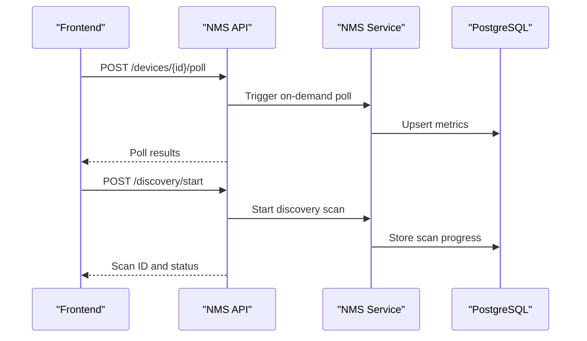

**Diagram sources**
- [nms_service/main.py:131-182](file://nms_service/main.py#L131-L182)
- [nms_service/main.py:328-404](file://nms_service/main.py#L328-L404)
- [nms_service/discovery_worker.py:128-262](file://nms_service/discovery_worker.py#L128-L262)

**Section sources**
- [nms_service/main.py:131-182](file://nms_service/main.py#L131-L182)
- [nms_service/main.py:328-404](file://nms_service/main.py#L328-L404)
- [nms_service/discovery_worker.py:128-262](file://nms_service/discovery_worker.py#L128-L262)

### Authentication and Access Control
- NMS configuration reads credentials from environment variables and applies sensible defaults
- SSH credentials are enforced with global concurrency limits to protect upstream devices
- Integration configurations store encrypted credentials and track sync status and logs

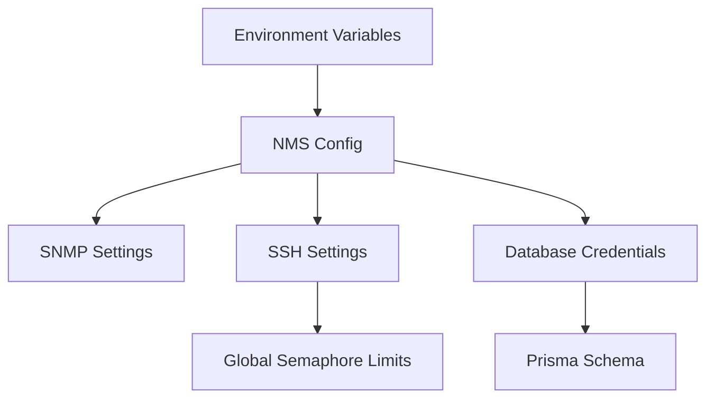

**Diagram sources**
- [nms_service/core/config.py:71-172](file://nms_service/core/config.py#L71-L172)
- [nms_service/ssh/poller.py:37-40](file://nms_service/ssh/poller.py#L37-L40)
- [prisma/schema.prisma:764-800](file://prisma/schema.prisma#L764-L800)

**Section sources**
- [nms_service/core/config.py:71-172](file://nms_service/core/config.py#L71-L172)
- [nms_service/ssh/poller.py:37-40](file://nms_service/ssh/poller.py#L37-L40)
- [prisma/schema.prisma:764-800](file://prisma/schema.prisma#L764-L800)

## Dependency Analysis
The integration stack exhibits clear separation of concerns:
- NMS orchestrator depends on SNMP and SSH pollers and the database layer
- Next.js API depends on shared database models and external system endpoints
- Prisma schema governs data models and relationships across integrations

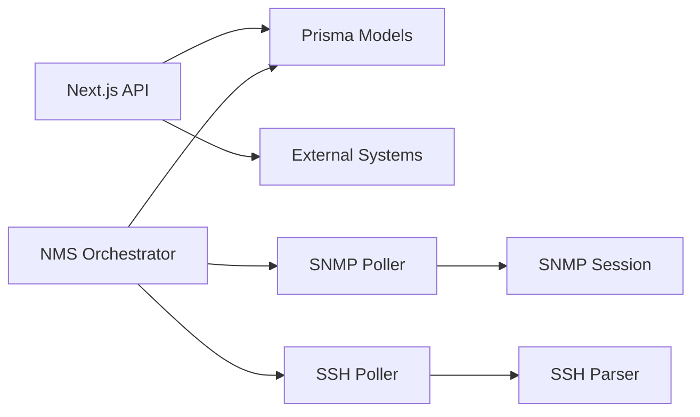

**Diagram sources**
- [nms_service/orchestrator.py:35-461](file://nms_service/orchestrator.py#L35-L461)
- [nms_service/snmp/poller.py:63-592](file://nms_service/snmp/poller.py#L63-L592)
- [nms_service/ssh/poller.py:221-625](file://nms_service/ssh/poller.py#L221-L625)
- [nms_service/snmp/session.py:38-258](file://nms_service/snmp/session.py#L38-L258)
- [nms_service/database/models.py:43-227](file://nms_service/database/models.py#L43-L227)
- [prisma/schema.prisma:152-228](file://prisma/schema.prisma#L152-L228)

**Section sources**
- [nms_service/orchestrator.py:35-461](file://nms_service/orchestrator.py#L35-L461)
- [nms_service/snmp/poller.py:63-592](file://nms_service/snmp/poller.py#L63-L592)
- [nms_service/ssh/poller.py:221-625](file://nms_service/ssh/poller.py#L221-L625)
- [nms_service/snmp/session.py:38-258](file://nms_service/snmp/session.py#L38-L258)
- [nms_service/database/models.py:43-227](file://nms_service/database/models.py#L43-L227)
- [prisma/schema.prisma:152-228](file://prisma/schema.prisma#L152-L228)

## Performance Considerations
- Concurrent polling: ThreadPoolExecutor with configurable max workers and per-device throttling
- SNMP subprocess-based polling for true parallelism and reduced Python overhead
- SSH global semaphore to cap concurrent connections and prevent device overload
- Dynamic polling intervals and jitter to balance responsiveness and load
- Batched discovery scanning with timeouts and conflict resolution

[No sources needed since this section provides general guidance]

## Troubleshooting Guide
Common issues and resolutions:
- SNMP timeouts and authentication failures: Verify community strings, versions, and ports; reduce retries and timeouts for faster fallback
- SSH connection errors: Ensure credentials and device accessibility; check global concurrency limits
- Discovery scan hangs: Monitor timeouts and adjust batch sizes; confirm network reachability
- Data inconsistencies: Validate Prisma schema alignment and unique constraints on nms_* tables
- Integration sync failures: Review integration sync logs and credential encryption

**Section sources**
- [nms_service/snmp/session.py:135-142](file://nms_service/snmp/session.py#L135-L142)
- [nms_service/ssh/poller.py:134-142](file://nms_service/ssh/poller.py#L134-L142)
- [nms_service/discovery_worker.py:174-179](file://nms_service/discovery_worker.py#L174-L179)
- [nms_service/database/models.py:68-144](file://nms_service/database/models.py#L68-L144)
- [prisma/schema.prisma:764-800](file://prisma/schema.prisma#L764-L800)

## Conclusion
InfraScope’s multi-system integration leverages a robust NMS service, shared database models, and a modular API to connect VMware vCenter, Zabbix, and Fortinet systems. The architecture emphasizes concurrent polling, vendor-aware parsing, asynchronous discovery, and secure credential handling, enabling reliable real-time synchronization and comprehensive observability.

[No sources needed since this section summarizes without analyzing specific files]

## Appendices

### Practical Setup Examples
- Configure NMS environment variables for SNMP and SSH settings
- Enable polling on devices by setting nms_device_id and management IP in the Device model
- Start discovery scans via the NMS API and import results into InfraScope
- Link external systems by populating zabbix_host_id, vmware_moref, and forti_device_id fields

**Section sources**
- [nms_service/core/config.py:111-147](file://nms_service/core/config.py#L111-L147)
- [nms_service/main.py:328-404](file://nms_service/main.py#L328-L404)
- [prisma/schema.prisma:152-228](file://prisma/schema.prisma#L152-L228)