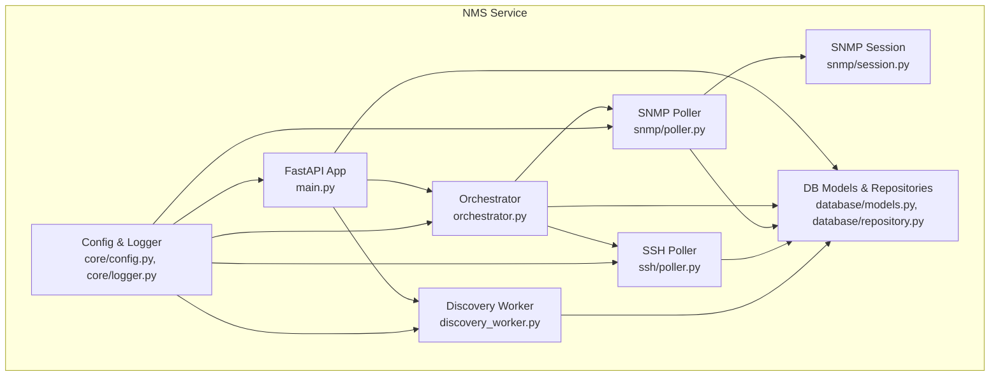
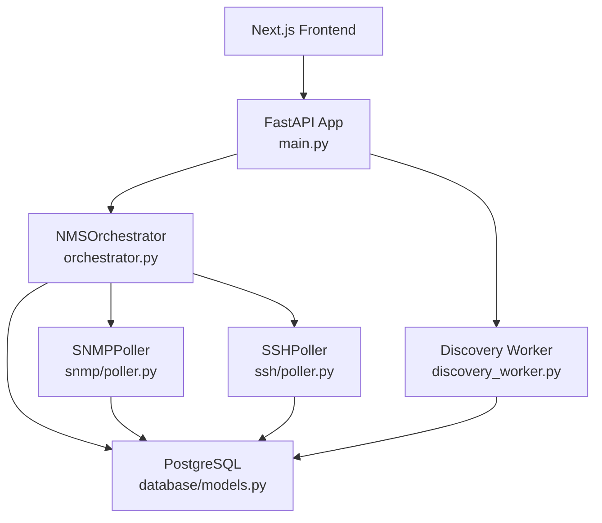
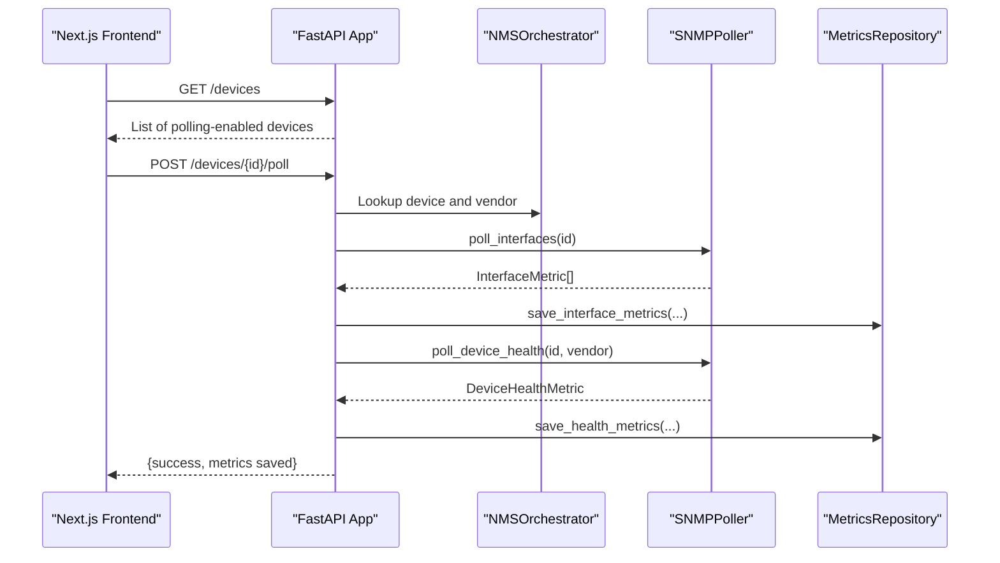
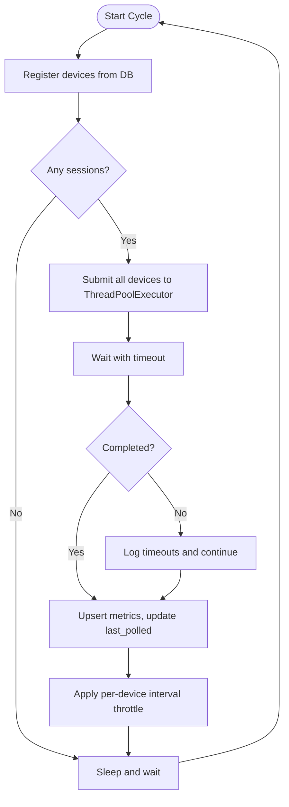
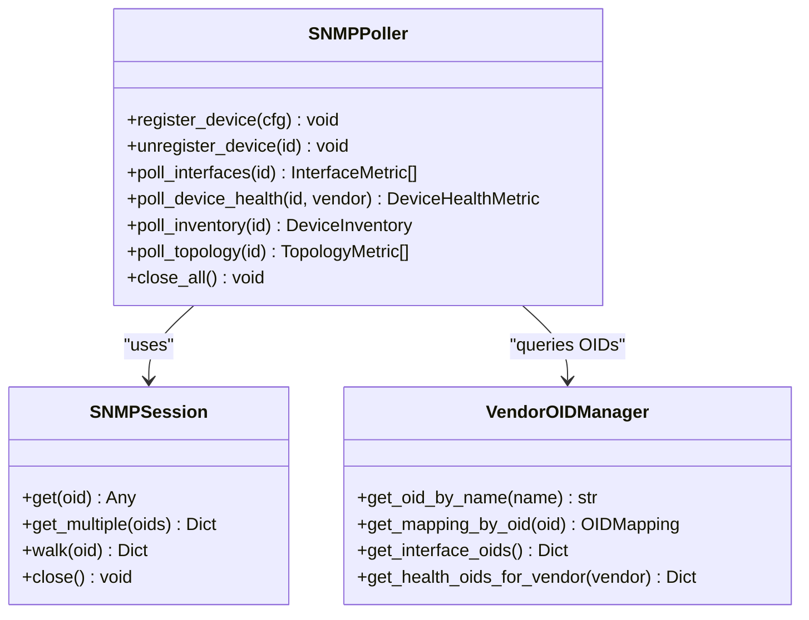
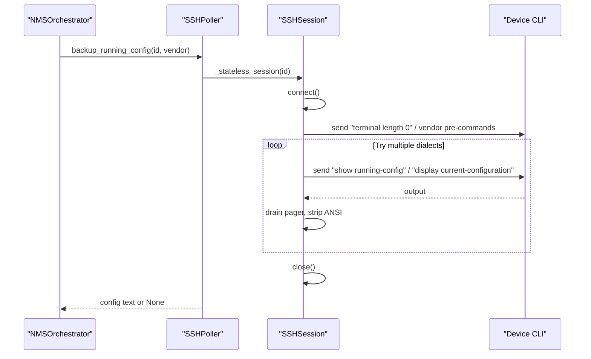
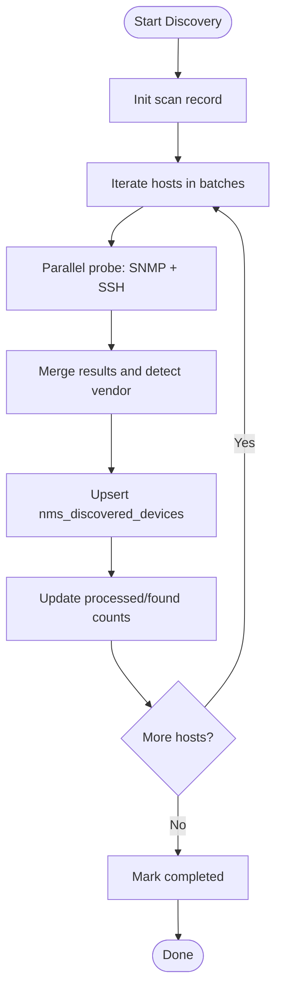
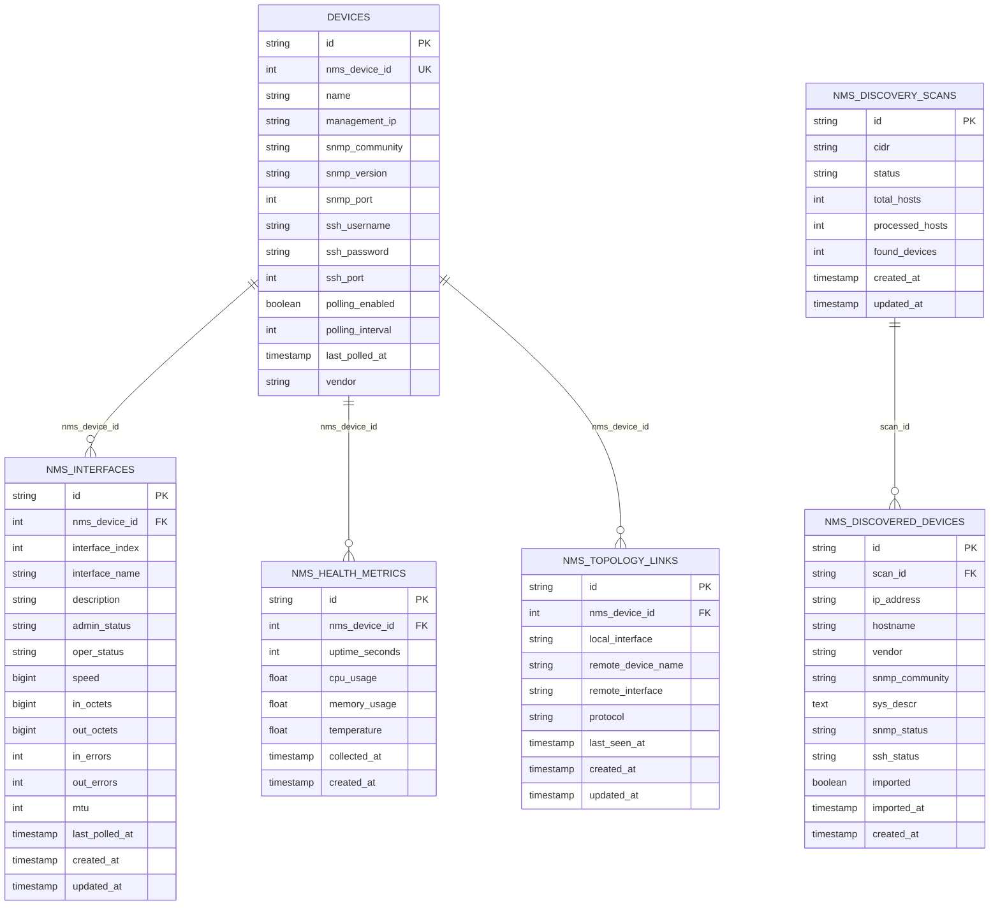
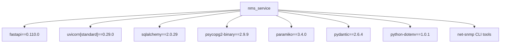

# Network Management Service (NMS)

<cite>
**Referenced Files in This Document**
- [main.py](file://nms_service/main.py)
- [config.py](file://nms_service/core/config.py)
- [logger.py](file://nms_service/core/logger.py)
- [models.py](file://nms_service/core/models.py)
- [orchestrator.py](file://nms_service/orchestrator.py)
- [discovery_worker.py](file://nms_service/discovery_worker.py)
- [poller.py](file://nms_service/snmp/poller.py)
- [session.py](file://nms_service/snmp/session.py)
- [vendor_oids.py](file://nms_service/snmp/vendor_oids.py)
- [vendor_oids.json](file://nms_service/snmp/vendor_oids.json)
- [poller.py](file://nms_service/ssh/poller.py)
- [models.py](file://nms_service/database/models.py)
- [repository.py](file://nms_service/database/repository.py)
- [requirements.txt](file://nms_service/requirements.txt)
- [Dockerfile](file://nms_service/Dockerfile)
</cite>

## Table of Contents
1. [Introduction](#introduction)
2. [Project Structure](#project-structure)
3. [Core Components](#core-components)
4. [Architecture Overview](#architecture-overview)
5. [Detailed Component Analysis](#detailed-component-analysis)
6. [Dependency Analysis](#dependency-analysis)
7. [Performance Considerations](#performance-considerations)
8. [Troubleshooting Guide](#troubleshooting-guide)
9. [Conclusion](#conclusion)
10. [Appendices](#appendices)

## Introduction
The Network Management Service (NMS) is an internal sidecar that integrates with the InfraScope platform to manage network devices. It performs SNMP-based polling for interface and device health metrics, discovers devices across CIDR ranges, and optionally backs up device configurations via SSH. The service exposes a FastAPI HTTP interface for internal consumption and runs a continuous background polling loop using a thread pool executor. It writes metrics directly into the shared PostgreSQL database used by InfraScope.

## Project Structure
The NMS service is organized into cohesive modules:
- Core configuration and logging
- Database models and repositories
- SNMP and SSH polling engines
- Discovery worker for network scanning
- Orchestrator coordinating polling and scheduling
- FastAPI application exposing internal endpoints

**Diagram sources**
- [main.py:1-483](file://nms_service/main.py#L1-L483)
- [orchestrator.py:1-461](file://nms_service/orchestrator.py#L1-L461)
- [poller.py:1-592](file://nms_service/snmp/poller.py#L1-L592)
- [session.py:1-258](file://nms_service/snmp/session.py#L1-L258)
- [poller.py:1-625](file://nms_service/ssh/poller.py#L1-L625)
- [discovery_worker.py:1-262](file://nms_service/discovery_worker.py#L1-L262)
- [config.py:1-172](file://nms_service/core/config.py#L1-L172)
- [logger.py:1-47](file://nms_service/core/logger.py#L1-L47)
- [models.py:1-227](file://nms_service/database/models.py#L1-L227)
- [repository.py:1-251](file://nms_service/database/repository.py#L1-L251)

**Section sources**
- [main.py:1-483](file://nms_service/main.py#L1-L483)
- [config.py:1-172](file://nms_service/core/config.py#L1-L172)
- [logger.py:1-47](file://nms_service/core/logger.py#L1-L47)
- [models.py:1-227](file://nms_service/database/models.py#L1-L227)
- [repository.py:1-251](file://nms_service/database/repository.py#L1-L251)

## Core Components
- FastAPI application: Internal endpoints for device listing, on-demand polling, backups, metrics retrieval, discovery control, and topology export.
- Orchestrator: Central coordinator that registers devices, schedules polling cycles, throttles per-device intervals, tracks outcomes, and persists metrics.
- SNMP Poller: Synchronous engine that walks MIB tables, aggregates interface and health metrics, and supports vendor-specific OIDs.
- SSH Poller: Stateless SSH session manager for interface polling, device health, and configuration backups with vendor-aware command dialects.
- Discovery Worker: Async CIDR scanner that probes hosts via SNMP and SSH, stores results, and updates discovery progress.
- Database Layer: SQLAlchemy models and repositories mapping to InfraScope’s shared PostgreSQL schema.

**Section sources**
- [main.py:103-182](file://nms_service/main.py#L103-L182)
- [main.py:186-270](file://nms_service/main.py#L186-L270)
- [main.py:274-442](file://nms_service/main.py#L274-L442)
- [orchestrator.py:35-461](file://nms_service/orchestrator.py#L35-L461)
- [poller.py:63-592](file://nms_service/snmp/poller.py#L63-L592)
- [poller.py:1-625](file://nms_service/ssh/poller.py#L1-L625)
- [discovery_worker.py:128-244](file://nms_service/discovery_worker.py#L128-L244)
- [models.py:43-194](file://nms_service/database/models.py#L43-L194)
- [repository.py:28-251](file://nms_service/database/repository.py#L28-L251)

## Architecture Overview
The NMS architecture follows a FastAPI-driven internal API with a background orchestrator. The orchestrator periodically polls devices using SNMP and SSH, writes metrics to the shared database, and exposes read-only endpoints for the frontend.

**Diagram sources**
- [main.py:1-483](file://nms_service/main.py#L1-L483)
- [orchestrator.py:1-461](file://nms_service/orchestrator.py#L1-L461)
- [poller.py:1-592](file://nms_service/snmp/poller.py#L1-L592)
- [poller.py:1-625](file://nms_service/ssh/poller.py#L1-L625)
- [models.py:1-227](file://nms_service/database/models.py#L1-L227)
- [discovery_worker.py:1-262](file://nms_service/discovery_worker.py#L1-L262)

## Detailed Component Analysis

### FastAPI Application and Endpoints
The FastAPI app provides:
- Health endpoint to check poller thread and registered devices
- Device listing with registration status
- On-demand SNMP polling for interfaces and device health
- SSH-based configuration backup with vendor-aware commands
- Metrics retrieval for health and interface states
- Discovery control: start scan, check progress, and fetch results
- Topology export

**Diagram sources**
- [main.py:103-182](file://nms_service/main.py#L103-L182)
- [orchestrator.py:175-354](file://nms_service/orchestrator.py#L175-L354)
- [poller.py:132-224](file://nms_service/snmp/poller.py#L132-L224)
- [repository.py:71-190](file://nms_service/database/repository.py#L71-L190)

**Section sources**
- [main.py:91-182](file://nms_service/main.py#L91-L182)
- [main.py:186-270](file://nms_service/main.py#L186-L270)
- [main.py:274-442](file://nms_service/main.py#L274-L442)

### Orchestrator: Concurrent Polling and Dynamic Scheduling
The orchestrator:
- Loads polling-enabled devices from the shared database
- Registers devices for both SNMP and SSH polling
- Schedules polling cycles with per-device throttling and jitter
- Tracks device status (“snmp_ok”, “ssh_only”, “unstable”) to adjust polling intervals dynamically
- Persists interface, health, and topology metrics

**Diagram sources**
- [orchestrator.py:407-434](file://nms_service/orchestrator.py#L407-L434)
- [orchestrator.py:355-406](file://nms_service/orchestrator.py#L355-L406)
- [repository.py:71-190](file://nms_service/database/repository.py#L71-L190)

**Section sources**
- [orchestrator.py:35-174](file://nms_service/orchestrator.py#L35-L174)
- [orchestrator.py:175-354](file://nms_service/orchestrator.py#L175-L354)
- [orchestrator.py:407-434](file://nms_service/orchestrator.py#L407-L434)

### SNMP Polling Engine: Sessions, Vendor OIDs, and Metrics
The SNMP engine:
- Uses subprocess-based net-snmp CLI tools for true parallelism
- Registers devices with connection parameters and vendor hints
- Polls interfaces, device health, inventory, and topology
- Supports vendor-specific OIDs for CPU, memory, and temperature

**Diagram sources**
- [session.py:38-258](file://nms_service/snmp/session.py#L38-L258)
- [poller.py:63-592](file://nms_service/snmp/poller.py#L63-L592)
- [vendor_oids.py:30-374](file://nms_service/snmp/vendor_oids.py#L30-L374)

**Section sources**
- [session.py:109-241](file://nms_service/snmp/session.py#L109-L241)
- [poller.py:132-592](file://nms_service/snmp/poller.py#L132-L592)
- [vendor_oids.py:18-374](file://nms_service/snmp/vendor_oids.py#L18-L374)
- [vendor_oids.json:1-201](file://nms_service/snmp/vendor_oids.json#L1-L201)

### SSH Polling Engine: Stateless Sessions and Vendor-Aware Backups
The SSH engine:
- Provides stateless connect-execute-close sessions
- Enforces global concurrency limits to protect device VTY pools
- Parses interface status and uptime from device outputs
- Performs vendor-aware configuration backups with pager handling

**Diagram sources**
- [poller.py:380-511](file://nms_service/ssh/poller.py#L380-L511)
- [poller.py:309-329](file://nms_service/ssh/poller.py#L309-L329)

**Section sources**
- [poller.py:1-625](file://nms_service/ssh/poller.py#L1-L625)

### Device Discovery Worker: Async CIDR Scanning
The discovery worker:
- Scans a CIDR range asynchronously
- Probes hosts via SNMP and SSH in parallel threads
- Detects vendor from system descriptions
- Upserts discovered devices and updates scan progress

**Diagram sources**
- [discovery_worker.py:128-244](file://nms_service/discovery_worker.py#L128-L244)

**Section sources**
- [discovery_worker.py:85-126](file://nms_service/discovery_worker.py#L85-L126)
- [discovery_worker.py:128-244](file://nms_service/discovery_worker.py#L128-L244)

### Database Models and Repositories
The database layer defines models and repositories that map to InfraScope’s shared PostgreSQL schema:
- Device: device metadata and polling configuration
- NmsInterface: current interface state with upsert semantics
- NmsHealthMetric: time-series device health metrics
- NmsTopologyLink: LLDP/CDP neighbor links with upsert semantics
- Repositories handle upserts, time-series inserts, and queries

**Diagram sources**
- [models.py:43-194](file://nms_service/database/models.py#L43-L194)
- [repository.py:71-251](file://nms_service/database/repository.py#L71-L251)

**Section sources**
- [models.py:43-194](file://nms_service/database/models.py#L43-L194)
- [repository.py:28-251](file://nms_service/database/repository.py#L28-L251)

## Dependency Analysis
External dependencies include FastAPI, Uvicorn, SQLAlchemy, PostgreSQL driver, SNMP CLI tools, Paramiko for SSH, Pydantic, and python-dotenv. The service is containerized with system-level SNMP tools installed.

**Diagram sources**
- [requirements.txt:1-11](file://nms_service/requirements.txt#L1-L11)
- [Dockerfile:6-11](file://nms_service/Dockerfile#L6-L11)

**Section sources**
- [requirements.txt:1-11](file://nms_service/requirements.txt#L1-L11)
- [Dockerfile:1-30](file://nms_service/Dockerfile#L1-L30)

## Performance Considerations
- Parallelism and Concurrency
  - SNMP polling uses subprocess calls per OID fetch to avoid Python GIL contention and achieve true parallelism.
  - ThreadPoolExecutor with bounded workers controls concurrency across devices.
  - SSH uses a global semaphore to cap concurrent TCP connections and prevent overwhelming device VTY pools.
- Scheduling and Throttling
  - Per-device polling intervals are respected using last_poll timestamps and jitter to avoid synchronized thundering herds.
  - Dynamic intervals adapt based on recent outcomes (“snmp_ok”, “ssh_only”, “unstable”).
- Database Writes
  - Upserts minimize duplicate rows and reduce write overhead for interface and topology data.
  - Time-series inserts for health metrics are append-only.
- Discovery Scalability
  - Discovery worker batches host probes and uses thread pools to accelerate scanning.
  - Progress is persisted incrementally to track completion and errors.

[No sources needed since this section provides general guidance]

## Troubleshooting Guide
Common issues and resolutions:
- SNMP Connectivity Failures
  - Symptoms: “No SNMP response received before timeout” or empty interface lists.
  - Actions: Verify device reachability, correct SNMP version/community/port, and firewall rules. Reduce SNMP timeout/retries via configuration.
- SSH Authentication Failures
  - Symptoms: “SSH connect FAILED” messages.
  - Actions: Ensure SSH credentials are configured and device accepts the provided username/password. Check device banner/auth timeouts.
- Discovery Scan Errors
  - Symptoms: Scan marked as failed with error messages.
  - Actions: Inspect logs for invalid CIDR or permission issues. Retry with adjusted thread pool sizes.
- Database Write Failures
  - Symptoms: Upsert failures or constraint violations.
  - Actions: Confirm schema alignment with Prisma-managed tables and unique constraints. Validate FK references to devices.nms_device_id.

**Section sources**
- [session.py:123-142](file://nms_service/snmp/session.py#L123-L142)
- [poller.py:320-328](file://nms_service/ssh/poller.py#L320-L328)
- [discovery_worker.py:354-366](file://nms_service/discovery_worker.py#L354-L366)
- [repository.py:94-157](file://nms_service/database/repository.py#L94-L157)

## Conclusion
The NMS service provides a robust, scalable solution for network device monitoring and discovery. Its FastAPI interface, concurrent orchestrator, vendor-aware SNMP/SSH engines, and shared database integration enable efficient metric collection and configuration backups. Proper configuration of timeouts, concurrency limits, and dynamic intervals ensures reliable operation across large networks.

[No sources needed since this section summarizes without analyzing specific files]

## Appendices

### Practical Setup Examples
- Running the NMS service
  - Build and run the container image that installs net-snmp CLI tools and Python dependencies.
  - Exposes internal FastAPI port 8500 for Next.js to consume.
- Environment configuration
  - Configure DATABASE_URL or individual DB_* variables.
  - Set SNMP and SSH parameters, polling intervals, and concurrency limits.
  - Point VENDOR_OID_CONFIG_PATH to the OID mapping file if customized.

**Section sources**
- [Dockerfile:1-30](file://nms_service/Dockerfile#L1-L30)
- [config.py:74-172](file://nms_service/core/config.py#L74-L172)

### Polling Schedule Configuration
- Global intervals
  - interface_poll_interval, cpu_memory_poll_interval, inventory_poll_interval, topology_poll_interval
- Dynamic intervals by outcome
  - poll_interval_snmp_ok, poll_interval_ssh_only, poll_interval_unstable
- Jitter
  - POLL_JITTER_MAX spreads load across devices
- SNMP tuning
  - SNMP_TIMEOUT, SNMP_RETRIES, MAX_CONCURRENT_POLLERS

**Section sources**
- [config.py:51-141](file://nms_service/core/config.py#L51-L141)

### Vendor-Specific OID Handling
- OID mappings are managed centrally and can be loaded from JSON or generated programmatically.
- Vendor detection influences which OIDs are queried for CPU/memory/temperature.

**Section sources**
- [vendor_oids.py:30-374](file://nms_service/snmp/vendor_oids.py#L30-L374)
- [vendor_oids.json:1-201](file://nms_service/snmp/vendor_oids.json#L1-L201)

### Device Connectivity Troubleshooting Checklist
- Network
  - ICMP/SSH/TCP 22 reachability
  - Firewall rules for SNMP UDP 161
- Credentials
  - SNMP community strings and SSH usernames/passwords
- Timeouts
  - Increase SNMP timeout/retries and SSH timeouts if devices are slow
- Concurrency
  - Lower MAX_CONCURRENT_POLLERS and SSH_MAX_CONCURRENT to reduce pressure on devices

**Section sources**
- [config.py:112-127](file://nms_service/core/config.py#L112-L127)
- [session.py:63-65](file://nms_service/snmp/session.py#L63-L65)
- [poller.py:39-40](file://nms_service/ssh/poller.py#L39-L40)