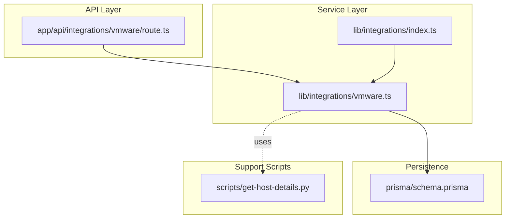
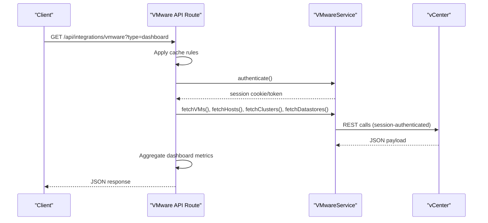
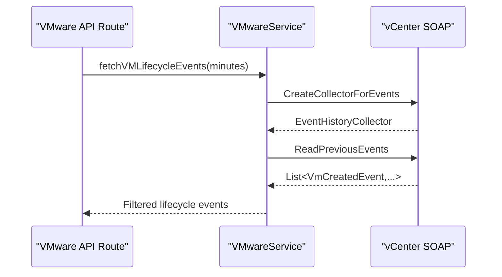
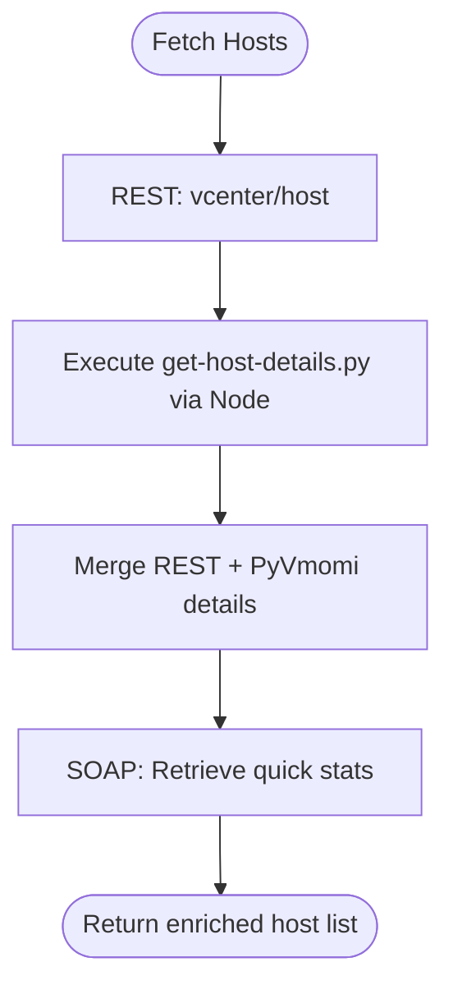
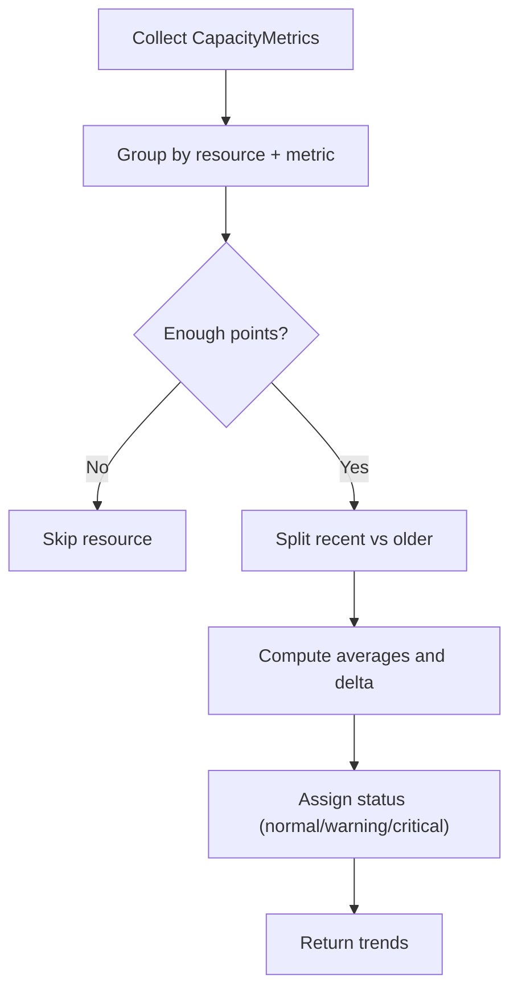
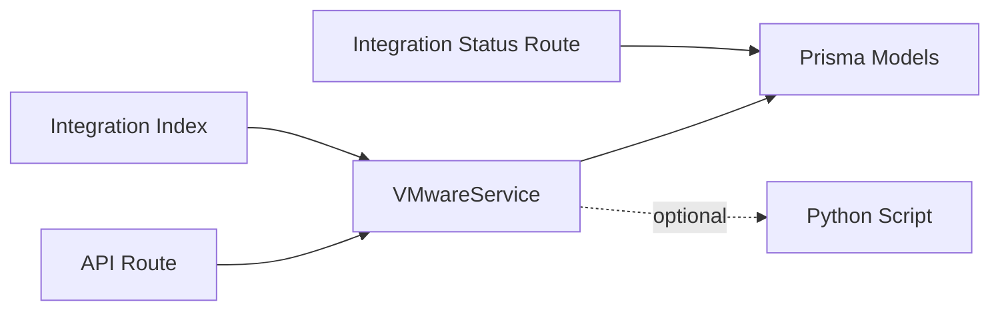

# VMware Integration

<cite>
**Referenced Files in This Document**
- [route.ts](file://app/api/integrations/vmware/route.ts)
- [vmware.ts](file://lib/integrations/vmware.ts)
- [index.ts](file://lib/integrations/index.ts)
- [schema.prisma](file://prisma/schema.prisma)
- [route.ts](file://app/api/integrations/status/route.ts)
- [get-host-details.py](file://scripts/get-host-details.py)
</cite>

## Table of Contents
1. [Introduction](#introduction)
2. [Project Structure](#project-structure)
3. [Core Components](#core-components)
4. [Architecture Overview](#architecture-overview)
5. [Detailed Component Analysis](#detailed-component-analysis)
6. [Dependency Analysis](#dependency-analysis)
7. [Performance Considerations](#performance-considerations)
8. [Troubleshooting Guide](#troubleshooting-guide)
9. [Conclusion](#conclusion)
10. [Appendices](#appendices)

## Introduction
This document explains the VMware vCenter integration in InfraScope, focusing on how the system connects to vCenter, authenticates, discovers virtualization assets, monitors hosts and clusters, manages datastores, synchronizes data into InfraScope models, tracks snapshots, and supports lifecycle events. It also covers configuration, credential handling, data synchronization flows, and operational best practices for large environments.

## Project Structure
The VMware integration spans three primary areas:
- API surface: HTTP endpoints under the VMware integration route that expose discovery, monitoring, and management operations.
- Service layer: The VMwareService class encapsulates authentication, API calls, event retrieval, and data enrichment.
- Persistence: Prisma models define how clusters, datastores, snapshots, and capacity metrics are persisted and indexed.



**Diagram sources**
- [route.ts:187-800](file://app/api/integrations/vmware/route.ts#L187-L800)
- [vmware.ts:154-2431](file://lib/integrations/vmware.ts#L154-L2431)
- [index.ts:11-24](file://lib/integrations/index.ts#L11-L24)
- [schema.prisma:669-742](file://prisma/schema.prisma#L669-L742)
- [get-host-details.py:1-69](file://scripts/get-host-details.py#L1-L69)

**Section sources**
- [route.ts:1-1072](file://app/api/integrations/vmware/route.ts#L1-L1072)
- [vmware.ts:1-2431](file://lib/integrations/vmware.ts#L1-L2431)
- [index.ts:1-48](file://lib/integrations/index.ts#L1-L48)
- [schema.prisma:669-742](file://prisma/schema.prisma#L669-L742)

## Core Components
- VMwareService: Provides authentication, REST and SOAP API access, event queries, host quick stats, snapshot enumeration, and lifecycle/snapshot event extraction.
- API routes: Expose endpoints for status, discovery, dashboard summaries, snapshots, configuration, and testing.
- Prisma models: Persist clusters, datastores, snapshots, and capacity metrics with appropriate indexing for performance.
- Integration index: Central exports for integration services and types.

Key responsibilities:
- Authentication: REST session creation and SOAP session cookie acquisition.
- Discovery: Clusters, hosts, VMs, datastores via REST; host quick stats via SOAP.
- Monitoring: Dashboard summaries, capacity trends, growth forecasting.
- Lifecycle and snapshot tracking: Events via SOAP; snapshot creation detection via batch enumeration.
- Data persistence: Mapping vCenter identifiers to InfraScope models.

**Section sources**
- [vmware.ts:154-2431](file://lib/integrations/vmware.ts#L154-L2431)
- [route.ts:187-800](file://app/api/integrations/vmware/route.ts#L187-L800)
- [schema.prisma:669-742](file://prisma/schema.prisma#L669-L742)
- [index.ts:11-24](file://lib/integrations/index.ts#L11-L24)

## Architecture Overview
The integration follows a layered pattern:
- API routes orchestrate requests, apply caching, and delegate to the service layer.
- The service layer authenticates against vCenter using REST or SOAP, then retrieves and enriches data.
- Data is persisted into InfraScope models and exposed via API endpoints.



**Diagram sources**
- [route.ts:284-440](file://app/api/integrations/vmware/route.ts#L284-L440)
- [vmware.ts:694-743](file://lib/integrations/vmware.ts#L694-L743)
- [vmware.ts:909-1002](file://lib/integrations/vmware.ts#L909-L1002)

## Detailed Component Analysis

### API Routes: VMware Integration
Responsibilities:
- Connection status and configuration retrieval.
- Discovery endpoints for clusters, hosts, VMs, datastores, and snapshots.
- Dashboard summary aggregation.
- Capacity analytics (trends and forecasts).
- Event testing (REST and SOAP).
- Configuration save/update.

Notable behaviors:
- Caching strategy with stale-while-revalidate for frequently accessed endpoints.
- Background cache warming for related resources.
- Authentication performed per-request when needed.

Example endpoints:
- GET /api/integrations/vmware?type=status
- GET /api/integrations/vmware?type=dashboard
- GET /api/integrations/vmware?type=vms
- GET /api/integrations/vmware?type=hosts
- GET /api/integrations/vmware?type=clusters
- GET /api/integrations/vmware?type=datastores
- GET /api/integrations/vmware?type=snapshots&vmId={id}
- GET /api/integrations/vmware?type=config
- GET /api/integrations/vmware?type=capacity-trends&days=30
- GET /api/integrations/vmware?type=growth-forecast
- GET /api/integrations/vmware?type=test-events-api
- GET /api/integrations/vmware?type=test-soap-events&minutes=120

Operational notes:
- Configuration is read from the database; credentials are stored encrypted in the config field.
- Cache keys are derived from the request type and optional VM ID.
- Background revalidation bypasses local cache via a header to avoid loops.

**Section sources**
- [route.ts:187-800](file://app/api/integrations/vmware/route.ts#L187-L800)

### VMwareService: Authentication and API Access
Capabilities:
- REST authentication:
  - vSphere 7+ session endpoint returns a session ID.
  - Legacy vCenter 6.5–6.7 CIS session endpoint returns a token.
  - Automatic retry with session refresh on 401.
- SOAP authentication:
  - Login via SOAP to obtain vmware_soap_session cookie.
  - Used for advanced operations like EventManager and quick stats.
- REST operations:
  - Clusters, hosts, VMs, tasks, and events discovery.
  - Guest identity retrieval for VM IP addresses.
- SOAP operations:
  - Event history collection via EventHistoryCollector.
  - Host quick stats via RetrievePropertiesEx traversal.
  - View management for container traversal.
- Snapshot handling:
  - Batch enumeration of snapshots across VMs.
  - Recent snapshot detection within a time window.
- Event extraction:
  - Lifecycle events (create, delete, power on/off, reboot/reset).
  - Snapshot events (create, delete, revert).
- Host enrichment:
  - Best-effort hardware details via Python/PyVmomi script invoked from Node.

Security and TLS:
- TLS verification disabled during authentication and API calls to accommodate self-signed certificates commonly found in vCenter deployments.

**Section sources**
- [vmware.ts:154-2431](file://lib/integrations/vmware.ts#L154-L2431)

### Data Models: Clusters, Datastores, Snapshots, Capacity Metrics
Models and relationships:
- VMwareCluster: Represents vCenter clusters with CPU/memory totals and counts; linked to hosts and datastores.
- VMwareDatastore: Represents vCenter datastores with capacity/free space; linked to clusters.
- VmSnapshot: Tracks VM snapshots with current flag and size.
- CapacityMetric: Time-series metrics for resource usage (CPU, memory, disk) across clusters, hosts, and datastores.

Indexing:
- Composite indexes on resourceType/resourceId/metricType/timestamp for efficient time-series queries.

```mermaid
erDiagram
ORG ||--o{ CLUSTER as "organizationId"
ORG ||--o{ DATASTORE as "organizationId"
CLUSTER ||--o{ DATASTORE as "clusterId"
DEVICE ||--o{ SNAPSHOT as "vmId"
METRIC {
string resourceType
string resourceId
string resourceName
string metricType
float value
float total
datetime timestamp
}
```

**Diagram sources**
- [schema.prisma:669-742](file://prisma/schema.prisma#L669-L742)

**Section sources**
- [schema.prisma:669-742](file://prisma/schema.prisma#L669-L742)

### Snapshot Tracking and Lifecycle Events
Lifecycle events:
- Detected via SOAP EventManager for VM-created, removed, powered-on, powered-off, rebooted/resetting events.
- Usernames matching backup accounts are filtered out to reduce noise.

Snapshot events:
- Captured via SOAP for created, removed, reverted events; snapshot names extracted from messages.

Recent snapshot detection:
- Enumerates all snapshots and filters by creation time within a configurable window.



**Diagram sources**
- [vmware.ts:1017-1077](file://lib/integrations/vmware.ts#L1017-L1077)

**Section sources**
- [vmware.ts:1017-1140](file://lib/integrations/vmware.ts#L1017-L1140)

### Host Enrichment and Quick Stats
- REST API provides basic host info; detailed hardware (vendor, model, CPU cores, memory) is fetched via a Python/PyVmomi script executed from Node.
- Quick stats (CPU/memory usage) are retrieved via SOAP RetrievePropertiesEx using a ContainerView traversal.



**Diagram sources**
- [vmware.ts:940-1002](file://lib/integrations/vmware.ts#L940-L1002)
- [get-host-details.py:1-69](file://scripts/get-host-details.py#L1-L69)

**Section sources**
- [vmware.ts:940-1002](file://lib/integrations/vmware.ts#L940-L1002)
- [get-host-details.py:1-69](file://scripts/get-host-details.py#L1-L69)

### Capacity Analytics: Trends and Forecasts
- Trends: Aggregates capacity metrics by resource and computes average usage over recent and older windows to derive trends.
- Forecast: Uses linear regression on recent time-series data to predict future usage and estimate days until thresholds.



**Diagram sources**
- [route.ts:22-151](file://app/api/integrations/vmware/route.ts#L22-L151)

**Section sources**
- [route.ts:22-151](file://app/api/integrations/vmware/route.ts#L22-L151)

## Dependency Analysis
- API routes depend on VMwareService for all vCenter interactions.
- VMwareService depends on Prisma for persistence and optionally invokes a Python script for host enrichment.
- Integration index centralizes service exports and types for reuse across the application.
- Integration status route aggregates health across all integrations, including VMware.



**Diagram sources**
- [route.ts:187-800](file://app/api/integrations/vmware/route.ts#L187-L800)
- [vmware.ts:154-2431](file://lib/integrations/vmware.ts#L154-L2431)
- [index.ts:11-24](file://lib/integrations/index.ts#L11-L24)
- [route.ts:14-202](file://app/api/integrations/status/route.ts#L14-L202)

**Section sources**
- [route.ts:187-800](file://app/api/integrations/vmware/route.ts#L187-L800)
- [vmware.ts:154-2431](file://lib/integrations/vmware.ts#L154-L2431)
- [index.ts:11-24](file://lib/integrations/index.ts#L11-L24)
- [route.ts:14-202](file://app/api/integrations/status/route.ts#L14-L202)

## Performance Considerations
- Caching:
  - Global in-memory cache with TTL and stale-while-revalidate to minimize repeated vCenter calls.
  - Background warming for related resources (e.g., clusters and datastores after VMs are fetched).
- Parallelization:
  - Many discovery endpoints use Promise.all to fetch multiple resource types concurrently.
- Event-driven data:
  - Prefer SOAP-based event queries for recent lifecycle and snapshot activity to avoid polling large datasets.
- Host enrichment:
  - Executing a Python script introduces overhead; ensure it is only used when REST details are insufficient.
- Capacity analytics:
  - Time-series queries leverage composite indexes for efficient filtering and sorting.

[No sources needed since this section provides general guidance]

## Troubleshooting Guide
Common issues and resolutions:
- Authentication failures:
  - Verify vCenter host, username, and password in the integration configuration.
  - Ensure TLS verification is disabled for self-signed certificates (handled automatically).
  - Use the status endpoint to confirm connectivity.
- SOAP session errors:
  - Some vCenter versions require SOAP authentication for advanced features; ensure the SOAP session is established before invoking SOAP-only methods.
- Snapshot and lifecycle event gaps:
  - SOAP event types may vary by vCenter version; use the test endpoints to validate availability and coverage.
- Host details missing:
  - If REST-only details are incomplete, confirm the Python/PyVmomi script executes successfully and returns hardware info.
- Performance in large environments:
  - Use caching and background warming; avoid frequent snapshot enumeration; prefer event-based updates.

Operational endpoints for diagnostics:
- GET /api/integrations/vmware?type=status
- GET /api/integrations/vmware?type=test-events-api
- GET /api/integrations/vmware?type=test-soap-events&minutes=120
- GET /api/integrations/vmware?type=config

**Section sources**
- [route.ts:698-790](file://app/api/integrations/vmware/route.ts#L698-L790)
- [vmware.ts:168-215](file://lib/integrations/vmware.ts#L168-L215)
- [vmware.ts:220-267](file://lib/integrations/vmware.ts#L220-L267)

## Conclusion
InfraScope’s VMware integration provides a robust, layered approach to vCenter connectivity, discovery, monitoring, and lifecycle tracking. By combining REST and SOAP APIs, intelligent caching, and event-driven updates, it delivers responsive dashboards and accurate capacity insights. Proper configuration, credential handling, and adherence to best practices ensure reliable operation across small and large vCenter environments.

[No sources needed since this section summarizes without analyzing specific files]

## Appendices

### Practical Configuration Examples
- Save configuration:
  - Use the configuration save endpoint to persist host, credentials, polling interval, and enabled modules.
- Test connectivity:
  - Use the status endpoint to verify authentication and reachability.
- Monitor integration health:
  - Use the integration status endpoint to observe overall health and sync status across all integrations.

**Section sources**
- [route.ts.bak:557-595](file://app/api/integrations/vmware/route.ts.bak#L557-L595)
- [route.ts.bak2:576-614](file://app/api/integrations/vmware/route.ts.bak2#L576-L614)
- [route.ts:14-202](file://app/api/integrations/status/route.ts#L14-L202)