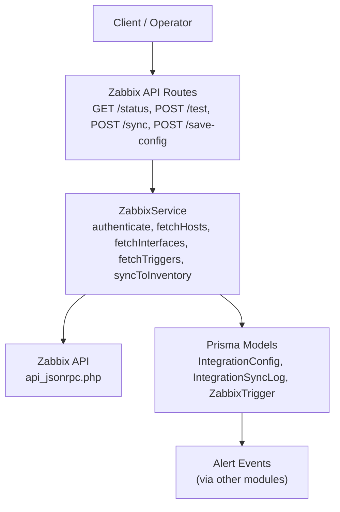
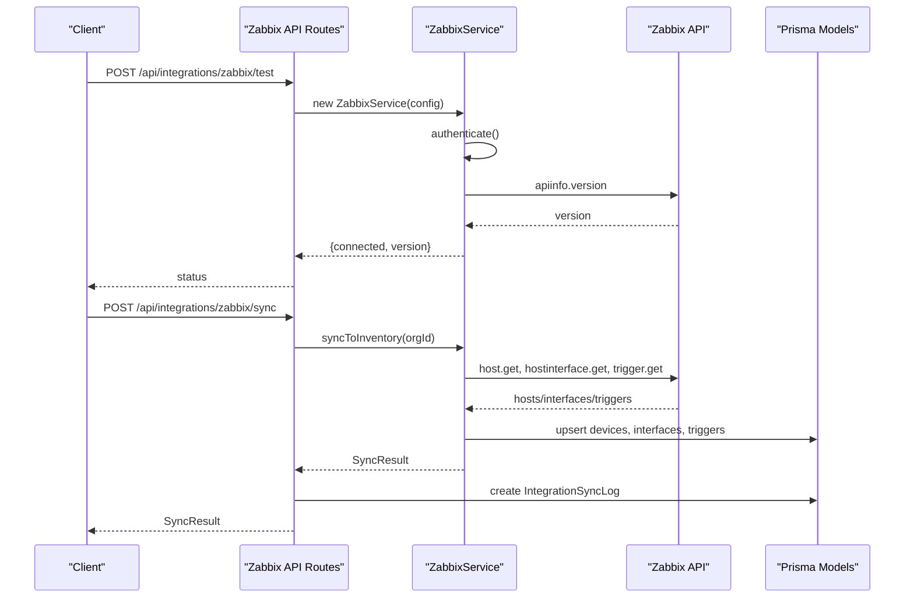
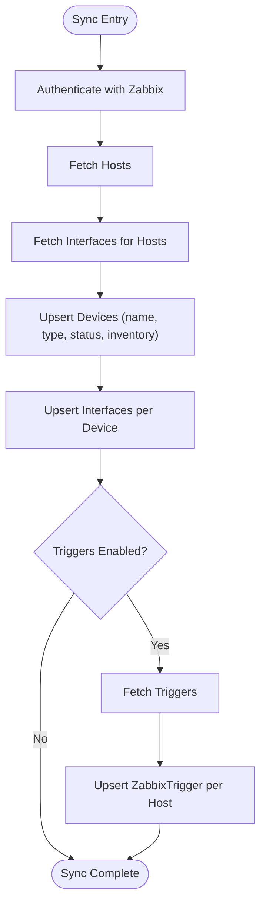
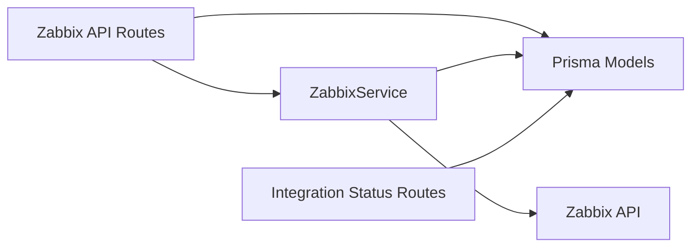

# Zabbix Integration

<cite>
**Referenced Files in This Document**
- [route.ts](file://app/api/integrations/zabbix/route.ts)
- [zabbix.ts](file://lib/integrations/zabbix.ts)
- [schema.prisma](file://prisma/schema.prisma)
- [route.ts](file://app/api/integrations/nms/devices/route.ts)
- [main.py](file://nms_service/main.py)
- [route.ts](file://app/api/integrations/status/route.ts)
</cite>

## Table of Contents
1. [Introduction](#introduction)
2. [Project Structure](#project-structure)
3. [Core Components](#core-components)
4. [Architecture Overview](#architecture-overview)
5. [Detailed Component Analysis](#detailed-component-analysis)
6. [Dependency Analysis](#dependency-analysis)
7. [Performance Considerations](#performance-considerations)
8. [Troubleshooting Guide](#troubleshooting-guide)
9. [Conclusion](#conclusion)
10. [Appendices](#appendices)

## Introduction
This document describes the Zabbix monitoring integration within the platform. It covers how Zabbix hosts and interfaces are synchronized into the InfraScope inventory, how triggers are mapped and stored, and how the integration status and logs are maintained. It also explains the configuration model, authentication approach, and operational controls such as testing connectivity, triggering a sync, and saving configuration. Practical setup steps, data mapping between Zabbix and InfraScope entities, and guidance for large-scale environments are included.

## Project Structure
The Zabbix integration spans three layers:
- API routes that expose endpoints for status checks, testing, and synchronization
- A Zabbix service that communicates with the Zabbix API and persists data
- Database schema that stores integration configuration, sync logs, and Zabbix-trigger data

**Diagram sources**
- [route.ts:13-56](file://app/api/integrations/zabbix/route.ts#L13-L56)
- [zabbix.ts:88-147](file://lib/integrations/zabbix.ts#L88-L147)
- [schema.prisma:764-822](file://prisma/schema.prisma#L764-L822)

**Section sources**
- [route.ts:1-203](file://app/api/integrations/zabbix/route.ts#L1-L203)
- [zabbix.ts:1-438](file://lib/integrations/zabbix.ts#L1-L438)
- [schema.prisma:764-822](file://prisma/schema.prisma#L764-L822)

## Core Components
- Zabbix API Routes: Provide endpoints to check status, test connectivity, save configuration, and trigger synchronization.
- ZabbixService: Implements authentication, API calls, host/interface/trigger retrieval, and inventory synchronization.
- Database Models: IntegrationConfig stores credentials and sync settings; IntegrationSyncLog tracks sync outcomes; ZabbixTrigger stores Zabbix trigger data linked to devices.

Key responsibilities:
- Authentication and connectivity verification
- Host discovery and inventory population
- Interface synchronization per host
- Optional trigger synchronization and storage
- Sync logging and status updates

**Section sources**
- [route.ts:13-56](file://app/api/integrations/zabbix/route.ts#L13-L56)
- [zabbix.ts:88-147](file://lib/integrations/zabbix.ts#L88-L147)
- [schema.prisma:764-822](file://prisma/schema.prisma#L764-L822)

## Architecture Overview
The integration follows a request-driven pattern:
- Clients call the Zabbix API routes to manage configuration and initiate syncs
- The routes instantiate ZabbixService with persisted configuration
- ZabbixService authenticates against Zabbix and retrieves data
- Retrieved data is normalized and persisted to InfraScope’s database
- Sync results and logs are recorded for auditing and status reporting

**Diagram sources**
- [route.ts:58-155](file://app/api/integrations/zabbix/route.ts#L58-L155)
- [zabbix.ts:88-147](file://lib/integrations/zabbix.ts#L88-L147)
- [schema.prisma:764-822](file://prisma/schema.prisma#L764-L822)

## Detailed Component Analysis

### Zabbix API Routes
Endpoints:
- GET /api/integrations/zabbix/status: Returns connection status and Zabbix version if authenticated
- POST /api/integrations/zabbix/test: Tests provided credentials without persisting
- POST /api/integrations/zabbix/sync: Performs a full sync to inventory and logs results
- POST /api/integrations/zabbix/save-config: Upserts Zabbix integration configuration

Behavior highlights:
- Uses Prisma to fetch and upsert IntegrationConfig
- For sync, creates IntegrationSyncLog entries and updates lastSyncAt/lastSyncStatus
- Organization scoping: uses either provided organizationId or the first organization found

**Section sources**
- [route.ts:13-56](file://app/api/integrations/zabbix/route.ts#L13-L56)
- [route.ts:58-155](file://app/api/integrations/zabbix/route.ts#L58-L155)
- [route.ts:157-192](file://app/api/integrations/zabbix/route.ts#L157-L192)

### ZabbixService
Responsibilities:
- Authentication: Attempts to authenticate and prepares Authorization header
- Data retrieval: Hosts, interfaces, triggers, and host groups
- Mapping: Maps Zabbix host/device attributes to InfraScope device and interface models
- Synchronization: Persists devices, interfaces, and triggers; aggregates counts and errors

Key mappings:
- Device type: Heuristics based on inventory fields and host name
- Device status: Active/Inactive based on Zabbix status
- Interface type: Normalized to ETHERNET-like types
- Trigger storage: Priority, status, value, last change, and comments

Error handling:
- Aggregates errors during host processing and trigger sync
- Returns a SyncResult with success flag, counts, and duration

**Section sources**
- [zabbix.ts:88-147](file://lib/integrations/zabbix.ts#L88-L147)
- [zabbix.ts:152-189](file://lib/integrations/zabbix.ts#L152-L189)
- [zabbix.ts:203-250](file://lib/integrations/zabbix.ts#L203-L250)
- [zabbix.ts:255-416](file://lib/integrations/zabbix.ts#L255-L416)

### Database Models and Sync Logging
IntegrationConfig:
- Stores type, name, encrypted config (including URL and token), enabled flag, sync interval, and timestamps
- Used by routes to retrieve persisted configuration

IntegrationSyncLog:
- Captures each sync outcome: status, message, items processed/created/updated/deleted, timestamps
- Linked to IntegrationConfig via foreign key

ZabbixTrigger:
- Stores Zabbix trigger metadata and links to host/device via hostId
- Indexed for efficient querying by triggerId, hostId, and status

**Section sources**
- [schema.prisma:764-822](file://prisma/schema.prisma#L764-L822)

### Webhook Integration and Event Correlation
- The Zabbix integration synchronizes triggers into InfraScope’s ZabbixTrigger model
- While the Zabbix route does not define a webhook endpoint, InfraScope maintains an AlertEvent model suitable for correlating external events
- To correlate Zabbix events with InfraScope alarms, map ZabbixTrigger entries to AlertEvent records using device linkage and metadata

Note: The provided Zabbix route does not expose a dedicated webhook receiver. If webhook ingestion is required, implement a new endpoint that:
- Validates webhook signature/token
- Parses incoming event payload
- Resolves device by Zabbix hostId
- Creates or updates AlertEvent entries
- Optionally triggers downstream alarm evaluation

**Section sources**
- [schema.prisma:803-846](file://prisma/schema.prisma#L803-L846)

### Host Discovery, Trigger Monitoring, and Event Correlation
- Host discovery: Performed via host.get; interfaces via hostinterface.get
- Trigger monitoring: Optional; controlled by enabledModules.triggers; stored in ZabbixTrigger
- Event correlation: Use AlertEvent to correlate Zabbix-triggered events with device context and severity

**Diagram sources**
- [zabbix.ts:255-416](file://lib/integrations/zabbix.ts#L255-L416)

**Section sources**
- [zabbix.ts:152-189](file://lib/integrations/zabbix.ts#L152-L189)
- [zabbix.ts:255-416](file://lib/integrations/zabbix.ts#L255-L416)

### Data Mapping Between Zabbix and InfraScope
- ZabbixHost → InfraScope Device
  - name/host → device name
  - inventory fields → vendor, model, OS, serial
  - status → ACTIVE/INACTIVE
  - hostid → zabbixHostId (foreign key linkage)
- ZabbixInterface → InfraScope NetworkInterface
  - ip/dns → ipv4/ipv6
  - type → normalized to ETHERNET-like
  - interface identifiers → name
  - hostid → deviceId
- ZabbixTrigger → InfraScope ZabbixTrigger
  - triggerid → id
  - description/expression → description/expression
  - priority/status/value/lastchange/comments → stored as-is
  - hostId → hostId

Severity and categorization:
- Severity mapping is not performed in the Zabbix service; use AlertEvent severity fields to normalize Zabbix priority values into InfraScope severity levels (INFO, WARNING, AVERAGE, HIGH, DISASTER) as part of downstream alarm processing.

**Section sources**
- [zabbix.ts:203-250](file://lib/integrations/zabbix.ts#L203-L250)
- [zabbix.ts:298-361](file://lib/integrations/zabbix.ts#L298-L361)
- [zabbix.ts:379-403](file://lib/integrations/zabbix.ts#L379-L403)
- [schema.prisma:803-846](file://prisma/schema.prisma#L803-L846)

### Backup Management Integration for Network Devices
While the Zabbix integration focuses on monitoring data, backup management for network devices is handled by the NMS module. The NMS module:
- Enables SNMP polling on devices and stores device metadata
- Periodically backs up device configurations via SSH
- Exposes APIs to list, download, and manage backups

This complements Zabbix by ensuring configuration baselines are preserved alongside live monitoring.

**Section sources**
- [route.ts:12-60](file://app/api/integrations/nms/devices/route.ts#L12-L60)
- [main.py:199-272](file://nms_service/main.py#L199-L272)

### Monitoring Configuration Synchronization
- Zabbix configuration is persisted in IntegrationConfig with encrypted credentials
- Sync intervals and module toggles are stored per integration
- Status and logs are exposed via integration status endpoints

**Section sources**
- [route.ts:157-192](file://app/api/integrations/zabbix/route.ts#L157-L192)
- [route.ts:14-201](file://app/api/integrations/status/route.ts#L14-L201)
- [schema.prisma:764-801](file://prisma/schema.prisma#L764-L801)

## Dependency Analysis
- API Routes depend on ZabbixService and Prisma models
- ZabbixService depends on Zabbix API and Prisma models
- Integration status aggregation depends on IntegrationConfig and IntegrationSyncLog

**Diagram sources**
- [route.ts:13-56](file://app/api/integrations/zabbix/route.ts#L13-L56)
- [zabbix.ts:88-147](file://lib/integrations/zabbix.ts#L88-L147)
- [schema.prisma:764-822](file://prisma/schema.prisma#L764-L822)
- [route.ts:14-201](file://app/api/integrations/status/route.ts#L14-L201)

**Section sources**
- [route.ts:13-56](file://app/api/integrations/zabbix/route.ts#L13-L56)
- [zabbix.ts:88-147](file://lib/integrations/zabbix.ts#L88-L147)
- [schema.prisma:764-822](file://prisma/schema.prisma#L764-L822)
- [route.ts:14-201](file://app/api/integrations/status/route.ts#L14-L201)

## Performance Considerations
- Pagination and batching: The ZabbixService fetches hosts and interfaces in bulk; consider chunking hostIds for interface retrieval in very large environments
- Conditional trigger fetch: Only active triggers are fetched by default to reduce load
- Indexing: Ensure database indexes on IntegrationConfig and ZabbixTrigger support frequent lookups
- Sync cadence: Tune syncInterval in IntegrationConfig to balance freshness and overhead
- Error aggregation: SyncResult collects errors; monitor IntegrationSyncLog for partial failures

[No sources needed since this section provides general guidance]

## Troubleshooting Guide
Common issues and resolutions:
- Authentication failure: Verify Zabbix URL and token; use POST /api/integrations/zabbix/test to validate
- No organization found: Ensure at least one organization exists before triggering sync
- Empty sync results: Confirm Zabbix has hosts and that enabledModules includes hosts/interfaces
- Partial sync: Review IntegrationSyncLog entries for detailed messages and item counts
- Version mismatch: Use GET /api/integrations/zabbix/status to confirm Zabbix version

Operational checks:
- Use integration status endpoint to view overall health and last sync times
- Inspect IntegrationSyncLog for granular error details

**Section sources**
- [route.ts:13-56](file://app/api/integrations/zabbix/route.ts#L13-L56)
- [route.ts:86-155](file://app/api/integrations/zabbix/route.ts#L86-L155)
- [schema.prisma:783-801](file://prisma/schema.prisma#L783-L801)

## Conclusion
The Zabbix integration provides a robust foundation for synchronizing hosts, interfaces, and triggers into InfraScope. It supports secure configuration persistence, connectivity testing, and comprehensive sync logging. For production environments, combine the integration with alert normalization and correlation to transform Zabbix events into actionable InfraScope alarms, and complement monitoring with NMS-backed configuration backups.

[No sources needed since this section summarizes without analyzing specific files]

## Appendices

### Setup and Configuration Examples
- Save Zabbix configuration:
  - Action: save-config
  - Fields: url, authToken, pollingInterval, enabledModules (hosts, interfaces, triggers, items)
- Test connection:
  - Action: test
  - Fields: url, authToken
- Trigger sync:
  - Action: sync
  - Optional: organizationId
- Check status:
  - Endpoint: GET /api/integrations/zabbix/status

Notes:
- enabledModules controls which data modules are synced
- pollingInterval sets the sync cadence in minutes
- IntegrationSyncLog captures outcomes for audit and diagnostics

**Section sources**
- [route.ts:58-192](file://app/api/integrations/zabbix/route.ts#L58-L192)
- [schema.prisma:764-801](file://prisma/schema.prisma#L764-L801)

### Data Filtering and Deduplication
- Filter triggers: The service fetches only active triggers by default; adjust logic if passive triggers are required
- Deduplicate events: Use unique identifiers (e.g., triggerid, hostid) when upserting ZabbixTrigger and AlertEvent
- De-duplicate sync runs: Ensure only one sync job executes concurrently for the same configuration

**Section sources**
- [zabbix.ts:175-189](file://lib/integrations/zabbix.ts#L175-L189)
- [schema.prisma:803-846](file://prisma/schema.prisma#L803-L846)