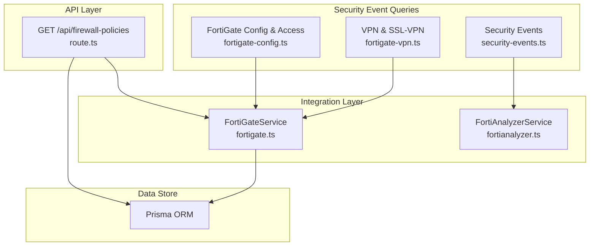
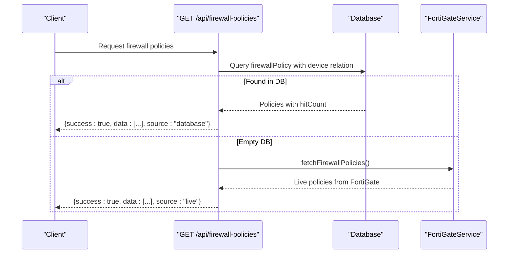
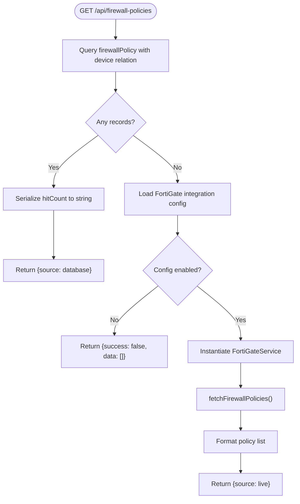
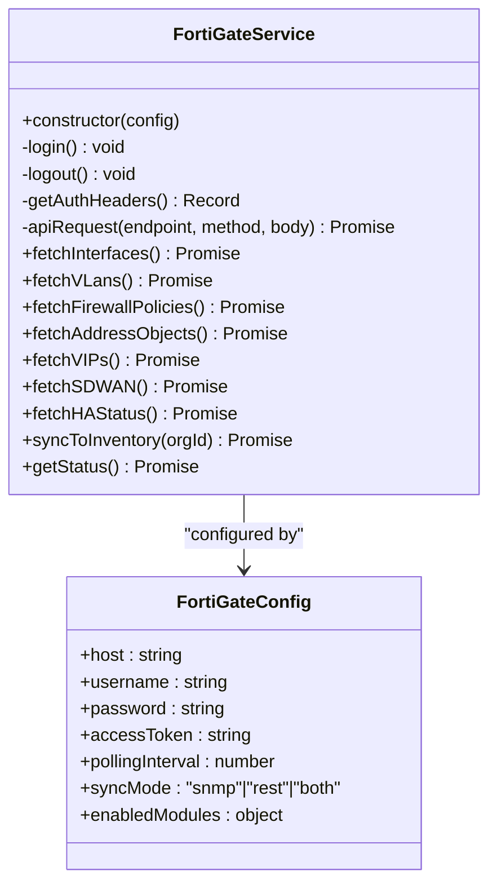
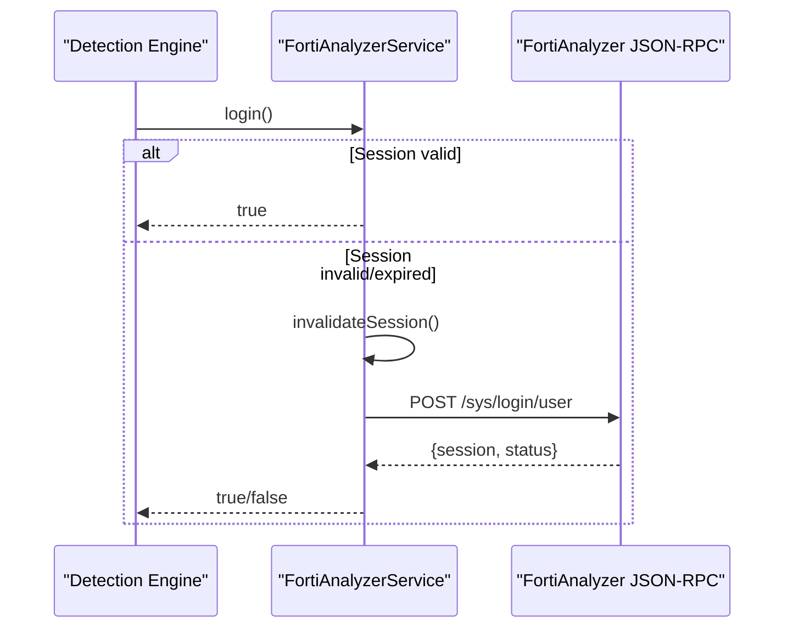
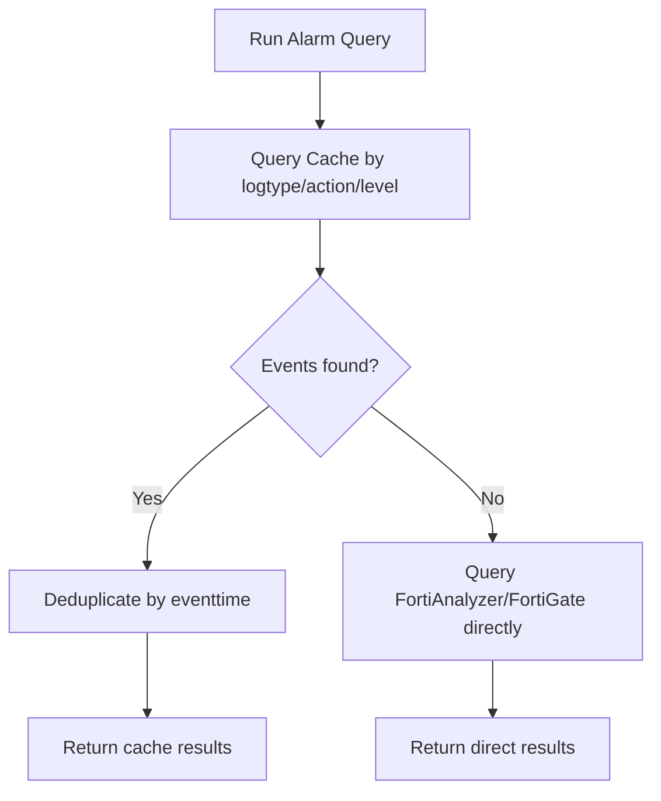
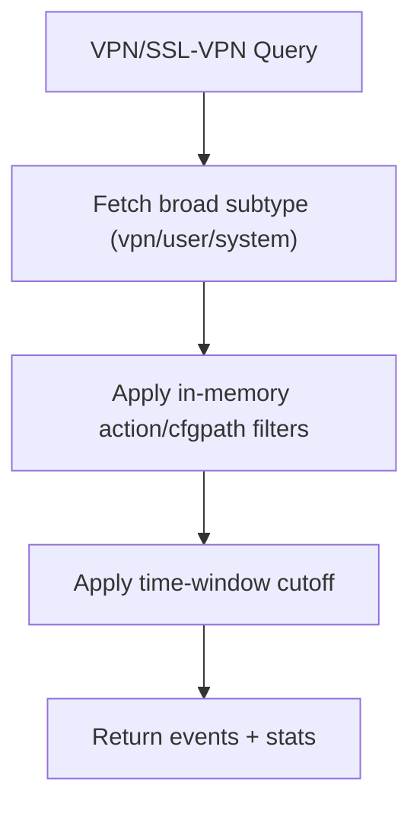
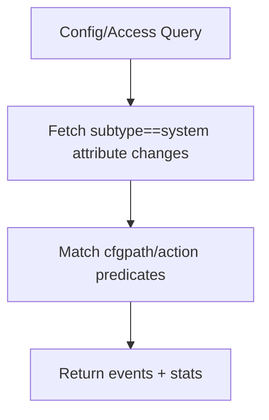
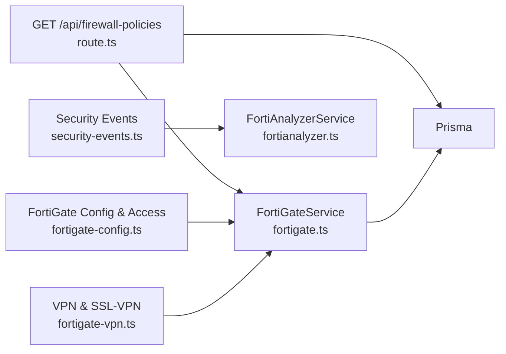

# Firewall Management

<cite>
**Referenced Files in This Document**
- [route.ts](file://app/api/firewall-policies/route.ts)
- [fortigate.ts](file://lib/integrations/fortigate.ts)
- [fortianalyzer.ts](file://lib/integrations/fortianalyzer.ts)
- [security-events.ts](file://lib/alarms/queries/security-events.ts)
- [fortigate-config.ts](file://lib/alarms/queries/fortigate-config.ts)
- [fortigate-vpn.ts](file://lib/alarms/queries/fortigate-vpn.ts)
- [index.ts](file://lib/integrations/index.ts)
</cite>

## Table of Contents
1. [Introduction](#introduction)
2. [Project Structure](#project-structure)
3. [Core Components](#core-components)
4. [Architecture Overview](#architecture-overview)
5. [Detailed Component Analysis](#detailed-component-analysis)
6. [Dependency Analysis](#dependency-analysis)
7. [Performance Considerations](#performance-considerations)
8. [Troubleshooting Guide](#troubleshooting-guide)
9. [Conclusion](#conclusion)
10. [Appendices](#appendices)

## Introduction
This document explains firewall policy management and network security enforcement within the platform. It covers how firewall rules are fetched and presented, how policy evaluation order and traffic inspection are modeled, and how NAT/VIPs, port forwarding, and VPN tunnels are integrated. It also documents logging, audit trails, and security event monitoring, along with practical examples for rule creation, policy testing, performance tuning, high availability, and troubleshooting. Integration points with Fortinet devices (FortiGate and FortiAnalyzer) are central to the implementation.

## Project Structure
The firewall management capability spans:
- API surface for retrieving firewall policies
- Integration services for FortiGate and FortiAnalyzer
- Security event query layers for IPS, malware, app control, web filtering, IOC hits, and traffic anomalies
- VPN and SSL-VPN event queries
- Configuration change and access event queries

**Diagram sources**
- [route.ts:1-112](file://app/api/firewall-policies/route.ts#L1-L112)
- [fortigate.ts:171-795](file://lib/integrations/fortigate.ts#L171-L795)
- [fortianalyzer.ts:146-800](file://lib/integrations/fortianalyzer.ts#L146-L800)
- [security-events.ts:1-292](file://lib/alarms/queries/security-events.ts#L1-L292)
- [fortigate-config.ts:1-235](file://lib/alarms/queries/fortigate-config.ts#L1-L235)
- [fortigate-vpn.ts:1-214](file://lib/alarms/queries/fortigate-vpn.ts#L1-L214)

**Section sources**
- [route.ts:1-112](file://app/api/firewall-policies/route.ts#L1-L112)
- [index.ts:1-48](file://lib/integrations/index.ts#L1-L48)

## Core Components
- Firewall policy retrieval API: Returns policies from the database or live from FortiGate when the database is empty. Policies include identifiers, action, interfaces, address lists, services, schedules, hit counters, and timestamps.
- FortiGate integration service: Provides REST and SNMP access to FortiGate for interfaces, VLANs, firewall policies, address objects, VIPs, SD-WAN, and HA status. Includes session management, authentication, and inventory synchronization.
- FortiAnalyzer integration service: Provides secure session management, exponential backoff, and JSON-RPC access to FortiAnalyzer for log search, FortiView queries, and device management.
- Security event queries: Define how to query and filter security events (IPS, malware, app control, web filtering, IOC, traffic anomalies) from cache or FortiAnalyzer/FortiGate APIs.
- VPN and SSL-VPN queries: Detect brute force attempts, lockouts, tunnel up/down events, and high traffic conditions.
- Configuration and access queries: Detect configuration changes and administrative access events directly from FortiGate.

**Section sources**
- [route.ts:5-111](file://app/api/firewall-policies/route.ts#L5-L111)
- [fortigate.ts:171-795](file://lib/integrations/fortigate.ts#L171-L795)
- [fortianalyzer.ts:146-800](file://lib/integrations/fortianalyzer.ts#L146-L800)
- [security-events.ts:1-292](file://lib/alarms/queries/security-events.ts#L1-L292)
- [fortigate-config.ts:1-235](file://lib/alarms/queries/fortigate-config.ts#L1-L235)
- [fortigate-vpn.ts:1-214](file://lib/alarms/queries/fortigate-vpn.ts#L1-L214)

## Architecture Overview
The system retrieves firewall policies from either the local database or the FortiGate REST API. Security events are aggregated from FortiAnalyzer and filtered by specialized queries. Administrative and configuration events are fetched directly from FortiGate. Sessions and authentication are managed centrally to avoid session pile-ups and to ensure reliability under load.

**Diagram sources**
- [route.ts:5-111](file://app/api/firewall-policies/route.ts#L5-L111)
- [fortigate.ts:426-463](file://lib/integrations/fortigate.ts#L426-L463)

## Detailed Component Analysis

### Firewall Policy Retrieval API
- Retrieves policies from the database ordered by hit count. If none are present, it authenticates to FortiGate and fetches policies via REST, then returns them with a “live” source.
- Serializes hitCount to string for compatibility and enriches with device metadata.

**Diagram sources**
- [route.ts:5-111](file://app/api/firewall-policies/route.ts#L5-L111)
- [fortigate.ts:426-463](file://lib/integrations/fortigate.ts#L426-L463)

**Section sources**
- [route.ts:5-111](file://app/api/firewall-policies/route.ts#L5-L111)

### FortiGate Integration Service
- Authentication: Supports cookie-based session with CSRF token handling and bearer token fallback. Automatically logs out stale sessions to prevent session pile-ups.
- Modules: Interfaces, VLANs, firewall policies, address objects, VIPs, SD-WAN, and HA status. Module enablement is configurable.
- Inventory sync: Upserts interfaces, VLANs, firewall policies, and address objects into the database with metrics and error tracking.
- Status: Provides detailed system information including CPU/memory, sessions, HA, SD-WAN, and license status.

**Diagram sources**
- [fortigate.ts:17-43](file://lib/integrations/fortigate.ts#L17-L43)
- [fortigate.ts:171-795](file://lib/integrations/fortigate.ts#L171-L795)

**Section sources**
- [fortigate.ts:171-795](file://lib/integrations/fortigate.ts#L171-L795)

### FortiAnalyzer Integration Service
- Session lifecycle: Centralized login with exponential backoff, global mutex to serialize concurrent logins, and session TTL management.
- JSON-RPC client: Provides methods for status, ADOMs, devices, log search tasks, and FortiView queries with retry logic and timeouts.
- Security: Disables TLS verification in development; robust error handling and session invalidation on expired/error codes.

**Diagram sources**
- [fortianalyzer.ts:146-433](file://lib/integrations/fortianalyzer.ts#L146-L433)

**Section sources**
- [fortianalyzer.ts:146-800](file://lib/integrations/fortianalyzer.ts#L146-L800)

### Security Event Monitoring
- IPS: High and critical severity attack logs; supports cache-first with soft fallback to FortiAnalyzer.
- Malware: Virus logs; high-value alerts with soft fallback.
- App Control: Blocked actions and shadow IT detections with risk scoring.
- Web Filter: Blocked URLs.
- IOC: Critical-level attack logs indicating IOCs.
- Traffic Anomaly: Outbound traffic with accept action; thresholds applied downstream.

**Diagram sources**
- [security-events.ts:34-91](file://lib/alarms/queries/security-events.ts#L34-L91)
- [security-events.ts:107-121](file://lib/alarms/queries/security-events.ts#L107-L121)
- [security-events.ts:135-154](file://lib/alarms/queries/security-events.ts#L135-L154)
- [security-events.ts:203-222](file://lib/alarms/queries/security-events.ts#L203-L222)
- [security-events.ts:237-257](file://lib/alarms/queries/security-events.ts#L237-L257)
- [security-events.ts:271-291](file://lib/alarms/queries/security-events.ts#L271-L291)

**Section sources**
- [security-events.ts:1-292](file://lib/alarms/queries/security-events.ts#L1-L292)

### VPN and SSL-VPN Event Monitoring
- VPN Brute Force, SSL-VPN Auth Failures, Multi-Failure, Lockout, Tunnel Up/Down, High Traffic, Off-Hours Sessions, New Users, IPsec/Ssl-Vpn Settings Changes, Tunnel Down.
- Uses broad filters to minimize API calls and applies in-memory predicates for fine-grained matching.

**Diagram sources**
- [fortigate-vpn.ts:50-99](file://lib/alarms/queries/fortigate-vpn.ts#L50-L99)
- [fortigate-vpn.ts:119-213](file://lib/alarms/queries/fortigate-vpn.ts#L119-L213)

**Section sources**
- [fortigate-vpn.ts:1-214](file://lib/alarms/queries/fortigate-vpn.ts#L1-L214)

### Configuration and Access Monitoring
- Detects firewall policy changes, firmware changes, admin password changes, privilege changes, address/service object additions, route table changes, interface config changes, and authentication server changes.
- Uses broad filters and in-memory cfgpath matching to reduce API load.

**Diagram sources**
- [fortigate-config.ts:49-100](file://lib/alarms/queries/fortigate-config.ts#L49-L100)
- [fortigate-config.ts:123-234](file://lib/alarms/queries/fortigate-config.ts#L123-L234)

**Section sources**
- [fortigate-config.ts:1-235](file://lib/alarms/queries/fortigate-config.ts#L1-L235)

## Dependency Analysis
- API depends on Prisma for database access and FortiGateService for live policy retrieval.
- FortiGateService encapsulates REST/cookie auth and integrates with Prisma for inventory sync.
- Security event queries depend on cache and FortiAnalyzer/FortiGate APIs; they share broad filters to reduce API calls.
- FortiAnalyzerService manages session state globally to avoid concurrent login storms.

**Diagram sources**
- [route.ts:1-112](file://app/api/firewall-policies/route.ts#L1-L112)
- [fortigate.ts:171-795](file://lib/integrations/fortigate.ts#L171-L795)
- [fortianalyzer.ts:146-800](file://lib/integrations/fortianalyzer.ts#L146-L800)
- [security-events.ts:1-292](file://lib/alarms/queries/security-events.ts#L1-L292)
- [fortigate-config.ts:1-235](file://lib/alarms/queries/fortigate-config.ts#L1-L235)
- [fortigate-vpn.ts:1-214](file://lib/alarms/queries/fortigate-vpn.ts#L1-L214)

**Section sources**
- [index.ts:1-48](file://lib/integrations/index.ts#L1-L48)

## Performance Considerations
- Minimize API calls: Broad filters and in-memory narrowing reduce repeated REST calls to FortiGate/FortiAnalyzer.
- Session reuse and TTL: FortiGateService maintains session cookies with expiry; FortiAnalyzerService enforces session TTL and global mutex to avoid redundant logins.
- Retry and backoff: FortiAnalyzerService implements exponential backoff and retry for transient failures.
- Cache-first strategy: Security event queries prefer cache and fall back to direct API only when needed.
- Time-window filtering: Queries apply time windows to limit result sets and improve responsiveness.

[No sources needed since this section provides general guidance]

## Troubleshooting Guide
Common issues and resolutions:
- FortiGate session invalidation: If a session expires or is rejected, the system invalidates the session and re-authenticates. Verify credentials and token validity.
- FortiAnalyzer account lockout: Excessive failed logins trigger backoff and potential lockout. Unlock via FortiAnalyzer GUI and allow backoff to expire.
- Rate limiting and timeouts: Use broad filters and in-memory predicates to avoid 429 errors; increase timeouts for large result sets.
- Missing live policies: Ensure FortiGate integration is enabled and the service can reach the device; confirm module enablement for policies.
- Audit trail gaps: Confirm FortiAnalyzer connectivity and session validity; verify device filters and time ranges for log searches.

**Section sources**
- [fortigate.ts:195-286](file://lib/integrations/fortigate.ts#L195-L286)
- [fortianalyzer.ts:280-433](file://lib/integrations/fortianalyzer.ts#L280-L433)
- [security-events.ts:34-91](file://lib/alarms/queries/security-events.ts#L34-L91)

## Conclusion
The platform integrates tightly with Fortinet devices to provide centralized visibility into firewall policies, NAT/VIPs, and VPN/SSL-VPN operations. Security event monitoring leverages cache-first strategies and targeted broad filters to reduce API overhead. Robust session management, exponential backoff, and global mutexes ensure reliability. The modular design allows incremental adoption of features like VIPs, SD-WAN, and HA status.

[No sources needed since this section summarizes without analyzing specific files]

## Appendices

### Practical Examples

- Retrieve firewall policies
  - Endpoint: GET /api/firewall-policies
  - Behavior: Returns database records sorted by hit count; if empty, fetches live policies from FortiGate and returns them with a “live” source.
  - Reference: [route.ts:5-111](file://app/api/firewall-policies/route.ts#L5-L111)

- Inspect policy evaluation order and traffic inspection
  - Policies include action, interfaces, addresses, services, schedules, and hit counters. Use hitCount and lastHit to assess rule activity and evaluate ordering.
  - Reference: [route.ts:77-96](file://app/api/firewall-policies/route.ts#L77-L96), [fortigate.ts:426-463](file://lib/integrations/fortigate.ts#L426-L463)

- NAT and port forwarding
  - VIPs are fetched from FortiGate and include fields for external/mapped IPs/ports, protocols, and port forwarding behavior.
  - Reference: [fortigate.ts:498-508](file://lib/integrations/fortigate.ts#L498-L508), [fortigate.ts:92-112](file://lib/integrations/fortigate.ts#L92-L112)

- VPN tunnel management
  - Monitor VPN/SSL-VPN events (brute force, lockouts, tunnel up/down, high traffic) using dedicated queries.
  - Reference: [fortigate-vpn.ts:119-213](file://lib/alarms/queries/fortigate-vpn.ts#L119-L213)

- Logging, audit trails, and security event monitoring
  - Use security event queries for IPS, malware, app control, web filtering, IOC, and traffic anomalies.
  - Reference: [security-events.ts:18-91](file://lib/alarms/queries/security-events.ts#L18-L91), [security-events.ts:107-121](file://lib/alarms/queries/security-events.ts#L107-L121), [security-events.ts:135-154](file://lib/alarms/queries/security-events.ts#L135-L154), [security-events.ts:203-222](file://lib/alarms/queries/security-events.ts#L203-L222), [security-events.ts:237-257](file://lib/alarms/queries/security-events.ts#L237-L257), [security-events.ts:271-291](file://lib/alarms/queries/security-events.ts#L271-L291)

- Policy testing and validation
  - Use hitCount and lastHit to validate whether a newly created rule is being evaluated. Cross-check with FortiGate live fetch.
  - Reference: [route.ts:77-96](file://app/api/firewall-policies/route.ts#L77-L96), [fortigate.ts:426-463](file://lib/integrations/fortigate.ts#L426-L463)

- Performance tuning
  - Prefer cache-first queries; use broad filters and in-memory predicates; adjust time windows; leverage session TTL and backoff.
  - Reference: [security-events.ts:34-91](file://lib/alarms/queries/security-events.ts#L34-L91), [fortianalyzer.ts:43-78](file://lib/integrations/fortianalyzer.ts#L43-L78)

- High availability and failover
  - HA status is fetched from FortiGate; monitor master/slave roles and HA mode to assess failover readiness.
  - Reference: [fortigate.ts:546-573](file://lib/integrations/fortigate.ts#L546-L573)

- Integration with external systems
  - FortiAnalyzer integration enables log search and FortiView queries; FortiGate integration enables live policy retrieval and inventory sync.
  - Reference: [index.ts:11-23](file://lib/integrations/index.ts#L11-L23), [fortianalyzer.ts:146-800](file://lib/integrations/fortianalyzer.ts#L146-L800), [fortigate.ts:171-795](file://lib/integrations/fortigate.ts#L171-L795)