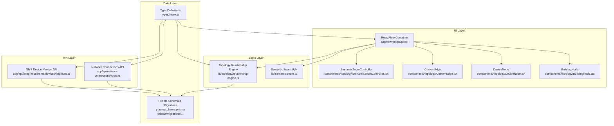
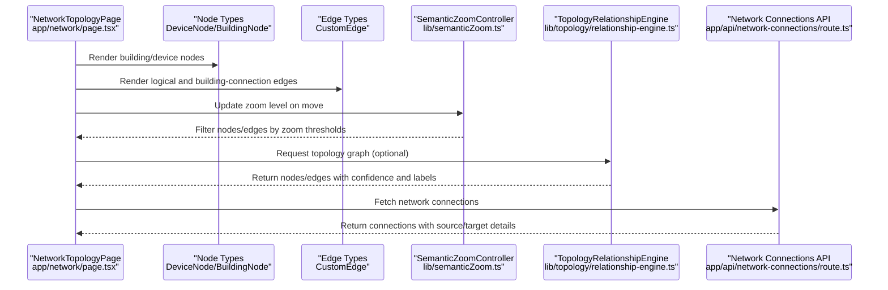
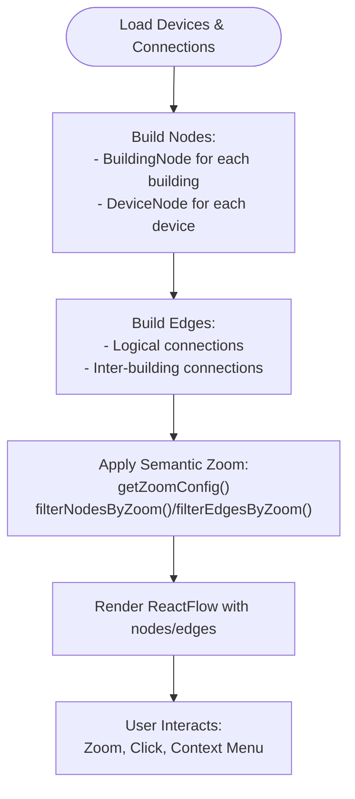
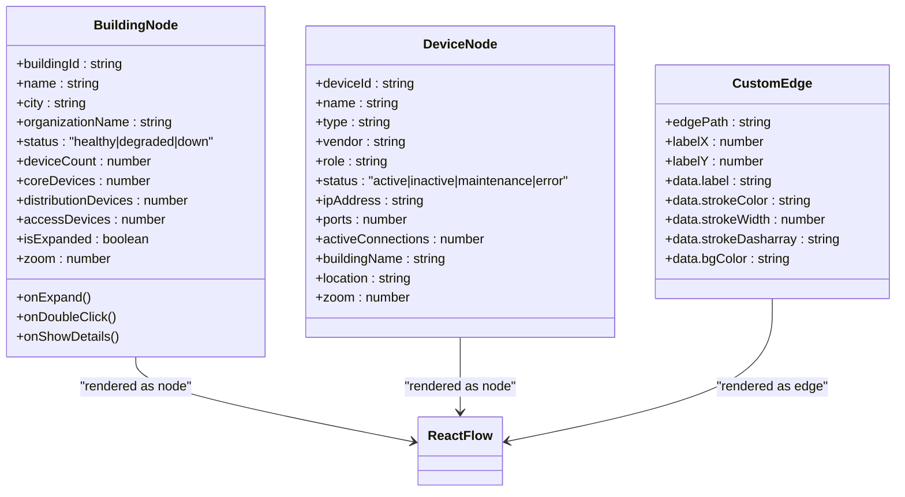
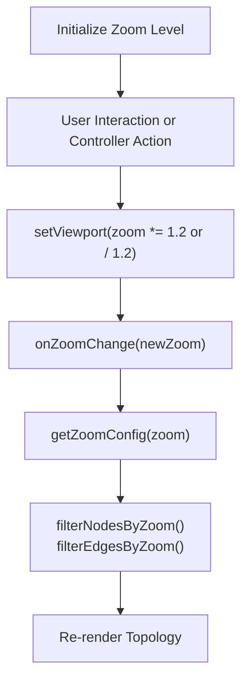
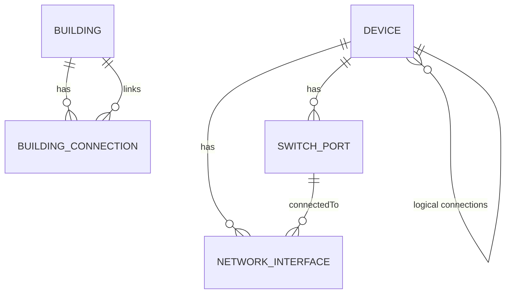
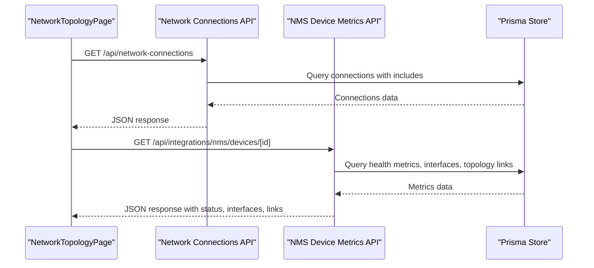
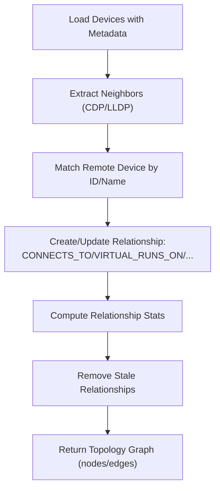
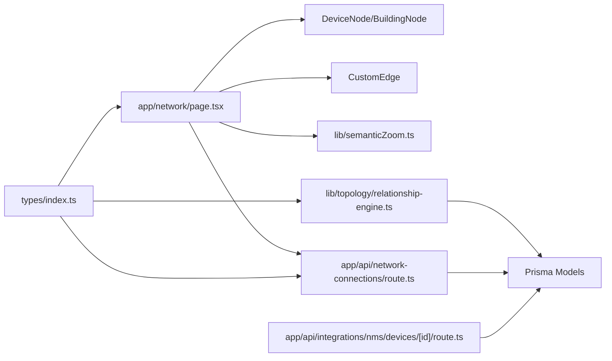

# Network Management

<cite>
**Referenced Files in This Document**
- [app/network/page.tsx](file://app/network/page.tsx)
- [components/topology/DeviceNode.tsx](file://components/topology/DeviceNode.tsx)
- [components/topology/BuildingNode.tsx](file://components/topology/BuildingNode.tsx)
- [components/topology/CustomEdge.tsx](file://components/topology/CustomEdge.tsx)
- [components/topology/SemanticZoomController.tsx](file://components/topology/SemanticZoomController.tsx)
- [lib/semanticZoom.ts](file://lib/semanticZoom.ts)
- [lib/topology/relationship-engine.ts](file://lib/topology/relationship-engine.ts)
- [types/index.ts](file://types/index.ts)
- [app/api/network-connections/route.ts](file://app/api/network-connections/route.ts)
- [prisma/schema.prisma](file://prisma/schema.prisma)
- [prisma/migrations/20260101220408_initial_schema/migration.sql](file://prisma/migrations/20260101220408_initial_schema/migration.sql)
- [app/api/integrations/nms/devices/[id]/route.ts](file://app/api/integrations/nms/devices/[id]/route.ts)
- [docs/network-topology-guide.md](file://docs/network-topology-guide.md)
</cite>

## Table of Contents
1. [Introduction](#introduction)
2. [Project Structure](#project-structure)
3. [Core Components](#core-components)
4. [Architecture Overview](#architecture-overview)
5. [Detailed Component Analysis](#detailed-component-analysis)
6. [Dependency Analysis](#dependency-analysis)
7. [Performance Considerations](#performance-considerations)
8. [Troubleshooting Guide](#troubleshooting-guide)
9. [Conclusion](#conclusion)
10. [Appendices](#appendices)

## Introduction
This document explains the network management capabilities centered on topology visualization and network administration. It covers:
- Interactive topology visualization using React Flow with custom nodes and edges
- Semantic zoom controls for hierarchical navigation across buildings, floors, rooms, racks, and devices
- Network interface management, switch port configuration, and VLAN management
- Network connection mapping, bandwidth monitoring, and status tracking
- The topology engine correlating physical infrastructure to logical network connections
- Troubleshooting workflows and impact analysis
- Practical examples for network discovery, topology updates, and connection management
- Security considerations and access control for network operations

## Project Structure
The network management feature spans UI components, data types, backend APIs, and a topology correlation engine:
- UI: React Flow-based topology with custom nodes (building and device) and edges (logical and inter-building)
- Data: Strongly typed models for devices, interfaces, switch ports, connections, and building connections
- Backend: APIs for network connections and NMS integration metrics
- Engine: Topology correlation engine mapping physical and logical relationships

**Diagram sources**
- [app/network/page.tsx:196-1432](file://app/network/page.tsx#L196-L1432)
- [components/topology/BuildingNode.tsx:24-176](file://components/topology/BuildingNode.tsx#L24-L176)
- [components/topology/DeviceNode.tsx:22-112](file://components/topology/DeviceNode.tsx#L22-L112)
- [components/topology/CustomEdge.tsx:91-134](file://components/topology/CustomEdge.tsx#L91-L134)
- [components/topology/SemanticZoomController.tsx:11-48](file://components/topology/SemanticZoomController.tsx#L11-L48)
- [lib/semanticZoom.ts:1-32](file://lib/semanticZoom.ts#L1-L32)
- [lib/topology/relationship-engine.ts:39-516](file://lib/topology/relationship-engine.ts#L39-L516)
- [types/index.ts:107-193](file://types/index.ts#L107-L193)
- [app/api/network-connections/route.ts:4-78](file://app/api/network-connections/route.ts#L4-L78)
- [prisma/schema.prisma:253-275](file://prisma/schema.prisma#L253-L275)
- [prisma/migrations/20260101220408_initial_schema/migration.sql:167-200](file://prisma/migrations/20260101220408_initial_schema/migration.sql#L167-L200)
- [app/api/integrations/nms/devices/[id]/route.ts:49-94](file://app/api/integrations/nms/devices/[id]/route.ts#L49-L94)

**Section sources**
- [app/network/page.tsx:196-1432](file://app/network/page.tsx#L196-L1432)
- [docs/network-topology-guide.md:1-25](file://docs/network-topology-guide.md#L1-L25)

## Core Components
- React Flow topology container with building-centric view, physical view, services view, and hierarchy view
- Custom nodes:
  - BuildingNode: hierarchical building representation with status and expandable behavior
  - DeviceNode: device cards with role icons, status indicators, and port/connection counts
- Custom edges:
  - Logical connections between devices
  - Inter-building connections with styles mapped by connection type
- Semantic zoom controller and filtering utilities for progressive disclosure
- Topology relationship engine correlating VM/host, cluster/host, VLAN memberships, and interface connections
- Strongly typed models for network interfaces, switch ports, connections, and building connections
- Backend APIs for network connections and NMS device metrics

**Section sources**
- [app/network/page.tsx:196-1432](file://app/network/page.tsx#L196-L1432)
- [components/topology/BuildingNode.tsx:24-176](file://components/topology/BuildingNode.tsx#L24-L176)
- [components/topology/DeviceNode.tsx:22-112](file://components/topology/DeviceNode.tsx#L22-L112)
- [components/topology/CustomEdge.tsx:91-134](file://components/topology/CustomEdge.tsx#L91-L134)
- [components/topology/SemanticZoomController.tsx:11-48](file://components/topology/SemanticZoomController.tsx#L11-L48)
- [lib/semanticZoom.ts:1-32](file://lib/semanticZoom.ts#L1-L32)
- [lib/topology/relationship-engine.ts:39-516](file://lib/topology/relationship-engine.ts#L39-L516)
- [types/index.ts:107-193](file://types/index.ts#L107-L193)

## Architecture Overview
The system integrates UI-driven topology visualization with backend data and correlation logic:
- UI builds nodes and edges from devices, services, connections, and building connections
- Semantic zoom filters nodes and edges progressively
- The topology engine correlates relationships from device metadata and external sources
- APIs expose network connections and NMS metrics for live status and bandwidth

**Diagram sources**
- [app/network/page.tsx:2283-2302](file://app/network/page.tsx#L2283-L2302)
- [lib/semanticZoom.ts:1-32](file://lib/semanticZoom.ts#L1-L32)
- [lib/topology/relationship-engine.ts:390-474](file://lib/topology/relationship-engine.ts#L390-L474)
- [app/api/network-connections/route.ts:4-78](file://app/api/network-connections/route.ts#L4-L78)

## Detailed Component Analysis

### Topology Visualization with React Flow
- Building-centric view organizes buildings radially and expands to show devices when zoomed in
- Physical and services views use custom DeviceNode components for device cards
- Inter-building connections rendered as styled edges with animated and labeled visuals
- Context menus and click handlers enable node/edge inspection and actions

**Diagram sources**
- [app/network/page.tsx:1069-1308](file://app/network/page.tsx#L1069-L1308)
- [lib/semanticZoom.ts:1-32](file://lib/semanticZoom.ts#L1-L32)

**Section sources**
- [app/network/page.tsx:1069-1308](file://app/network/page.tsx#L1069-L1308)
- [components/topology/BuildingNode.tsx:24-176](file://components/topology/BuildingNode.tsx#L24-L176)
- [components/topology/DeviceNode.tsx:22-112](file://components/topology/DeviceNode.tsx#L22-L112)
- [components/topology/CustomEdge.tsx:91-134](file://components/topology/CustomEdge.tsx#L91-L134)

### Interactive Node and Edge Rendering
- BuildingNode displays status, city, and organization with expandable behavior and handles for connections
- DeviceNode scales and adapts content based on zoom; shows role, vendor, IP, ports, and active connections
- CustomEdge renders paths with optional labels and background badges; supports building connection styles

**Diagram sources**
- [components/topology/BuildingNode.tsx:7-22](file://components/topology/BuildingNode.tsx#L7-L22)
- [components/topology/DeviceNode.tsx:7-20](file://components/topology/DeviceNode.tsx#L7-L20)
- [components/topology/CustomEdge.tsx:91-134](file://components/topology/CustomEdge.tsx#L91-L134)

**Section sources**
- [components/topology/BuildingNode.tsx:24-176](file://components/topology/BuildingNode.tsx#L24-L176)
- [components/topology/DeviceNode.tsx:22-112](file://components/topology/DeviceNode.tsx#L22-L112)
- [components/topology/CustomEdge.tsx:91-134](file://components/topology/CustomEdge.tsx#L91-L134)

### Semantic Zoom Controls
- SemanticZoomController adjusts zoom with smooth transitions and emits zoom changes
- Zoom thresholds determine whether floors, rooms, racks, and devices are shown
- Zoom level descriptions help contextualize the current view

**Diagram sources**
- [components/topology/SemanticZoomController.tsx:11-48](file://components/topology/SemanticZoomController.tsx#L11-L48)
- [lib/semanticZoom.ts:1-32](file://lib/semanticZoom.ts#L1-L32)
- [app/network/page.tsx:2296-2300](file://app/network/page.tsx#L2296-L2300)

**Section sources**
- [components/topology/SemanticZoomController.tsx:11-48](file://components/topology/SemanticZoomController.tsx#L11-L48)
- [lib/semanticZoom.ts:1-32](file://lib/semanticZoom.ts#L1-L32)
- [app/network/page.tsx:2296-2300](file://app/network/page.tsx#L2296-L2300)

### Network Interface Management, Switch Ports, and VLANs
- NetworkInterface model defines interface attributes (IPv4/IPv6, MAC, type, status)
- SwitchPort model captures port type, VLAN assignments, speed/duplex, and connectivity
- NetworkConnection model maps logical connections between devices/interfaces
- BuildingConnection model captures inter-building links with type, bandwidth, and status

**Diagram sources**
- [types/index.ts:145-193](file://types/index.ts#L145-L193)
- [prisma/schema.prisma:253-275](file://prisma/schema.prisma#L253-L275)
- [prisma/migrations/20260101220408_initial_schema/migration.sql:167-200](file://prisma/migrations/20260101220408_initial_schema/migration.sql#L167-L200)

**Section sources**
- [types/index.ts:145-193](file://types/index.ts#L145-L193)
- [prisma/schema.prisma:253-275](file://prisma/schema.prisma#L253-L275)
- [prisma/migrations/20260101220408_initial_schema/migration.sql:167-200](file://prisma/migrations/20260101220408_initial_schema/migration.sql#L167-L200)

### Network Connection Mapping and Bandwidth Monitoring
- Network connections API aggregates connections with source/target ports/interfaces and statuses
- NMS device metrics API exposes interface-level bandwidth and error metrics for live monitoring
- UI renders connection edges with animated states and labels derived from interfaces

**Diagram sources**
- [app/api/network-connections/route.ts:4-78](file://app/api/network-connections/route.ts#L4-L78)
- [app/api/integrations/nms/devices/[id]/route.ts:49-94](file://app/api/integrations/nms/devices/[id]/route.ts#L49-L94)

**Section sources**
- [app/api/network-connections/route.ts:4-78](file://app/api/network-connections/route.ts#L4-L78)
- [app/api/integrations/nms/devices/[id]/route.ts:49-94](file://app/api/integrations/nms/devices/[id]/route.ts#L49-L94)

### Topology Engine: Physical-to-Logical Mapping
- Correlates VM/host, cluster/host, VLAN memberships, and interface connections
- Extracts neighbor information from device metadata (CDP/LLDP)
- Removes stale relationships and generates a topology graph with confidence and animated edges

**Diagram sources**
- [lib/topology/relationship-engine.ts:390-474](file://lib/topology/relationship-engine.ts#L390-L474)
- [lib/topology/relationship-engine.ts:271-334](file://lib/topology/relationship-engine.ts#L271-L334)
- [lib/topology/relationship-engine.ts:336-368](file://lib/topology/relationship-engine.ts#L336-L368)

**Section sources**
- [lib/topology/relationship-engine.ts:39-516](file://lib/topology/relationship-engine.ts#L39-L516)

### Practical Examples
- Network discovery and topology updates:
  - Load devices, services, connections, organizations, and building connections
  - Build nodes and edges; apply semantic zoom filtering
  - Re-render when zoom or filters change
- Connection management:
  - Use Connection Wizard to create connections
  - Persist via API and update local state
- Status tracking and bandwidth monitoring:
  - Pull NMS metrics for interface admin/oper status and bandwidth
  - Render connection edges with animated and labeled visuals

**Section sources**
- [app/network/page.tsx:363-412](file://app/network/page.tsx#L363-L412)
- [app/network/page.tsx:651-676](file://app/network/page.tsx#L651-L676)
- [app/api/integrations/nms/devices/[id]/route.ts:49-94](file://app/api/integrations/nms/devices/[id]/route.ts#L49-L94)

### Network Troubleshooting and Impact Analysis
- Use context menus for node actions (ping, SSH, view logs, refresh)
- Inspect building connection details via edge click
- Correlation engine provides logical relationships to aid impact analysis
- NMS metrics enable live bandwidth and error monitoring for troubleshooting

**Section sources**
- [app/network/page.tsx:478-523](file://app/network/page.tsx#L478-L523)
- [app/network/page.tsx:525-539](file://app/network/page.tsx#L525-L539)
- [lib/topology/relationship-engine.ts:390-474](file://lib/topology/relationship-engine.ts#L390-L474)
- [app/api/integrations/nms/devices/[id]/route.ts:49-94](file://app/api/integrations/nms/devices/[id]/route.ts#L49-L94)

### Security Considerations and Access Control
- Restrict administrative actions behind role-based permissions
- Enforce API access control for sensitive operations (e.g., creating connections)
- Secure NMS credentials and TLS settings in integrations
- Audit topology changes and correlation runs for compliance

[No sources needed since this section provides general guidance]

## Dependency Analysis
The network management module exhibits cohesive UI components with clear separation of concerns:
- UI depends on custom nodes/edges and semantic zoom utilities
- Backend APIs supply data for connections and NMS metrics
- The topology engine encapsulates correlation logic and interacts with the data layer

**Diagram sources**
- [app/network/page.tsx:196-1432](file://app/network/page.tsx#L196-L1432)
- [lib/semanticZoom.ts:1-32](file://lib/semanticZoom.ts#L1-L32)
- [lib/topology/relationship-engine.ts:39-516](file://lib/topology/relationship-engine.ts#L39-L516)
- [app/api/network-connections/route.ts:4-78](file://app/api/network-connections/route.ts#L4-L78)
- [app/api/integrations/nms/devices/[id]/route.ts:49-94](file://app/api/integrations/nms/devices/[id]/route.ts#L49-L94)
- [types/index.ts:107-193](file://types/index.ts#L107-L193)

**Section sources**
- [app/network/page.tsx:196-1432](file://app/network/page.tsx#L196-L1432)
- [lib/semanticZoom.ts:1-32](file://lib/semanticZoom.ts#L1-L32)
- [lib/topology/relationship-engine.ts:39-516](file://lib/topology/relationship-engine.ts#L39-L516)
- [app/api/network-connections/route.ts:4-78](file://app/api/network-connections/route.ts#L4-L78)
- [app/api/integrations/nms/devices/[id]/route.ts:49-94](file://app/api/integrations/nms/devices/[id]/route.ts#L49-L94)
- [types/index.ts:107-193](file://types/index.ts#L107-L193)

## Performance Considerations
- Use semantic zoom to reduce node/edge count dynamically
- Memoize node/edge generation and filtering to minimize re-renders
- Batch API requests for devices, services, and connections
- Optimize NMS metric queries with appropriate limits and indexes

[No sources needed since this section provides general guidance]

## Troubleshooting Guide
- Verify device metadata contains neighbor information for accurate correlation
- Check NMS integration connectivity and TLS settings
- Use context menu actions to refresh node data and inspect logs
- Review topology engine statistics and remove stale relationships periodically

**Section sources**
- [lib/topology/relationship-engine.ts:370-388](file://lib/topology/relationship-engine.ts#L370-L388)
- [app/network/page.tsx:478-523](file://app/network/page.tsx#L478-L523)

## Conclusion
The network management module delivers a robust, scalable topology visualization system with semantic zoom, interactive nodes and edges, and strong backend integration for network connections and NMS metrics. The topology engine enhances logical understanding by correlating physical infrastructure, enabling effective troubleshooting and impact analysis. With proper access control and performance optimizations, it supports enterprise-grade network administration.

## Appendices
- Additional guidance on network topology visualization and view modes is available in the project documentation.

**Section sources**
- [docs/network-topology-guide.md:1-25](file://docs/network-topology-guide.md#L1-L25)