# Network Troubleshooting

<cite>
**Referenced Files in This Document**
- [README.md](file://README.md)
- [orchestrator.py](file://nms_service/orchestrator.py)
- [poller.py](file://nms_service/snmp/poller.py)
- [main.py](file://nms_service/main.py)
- [discovery_worker.py](file://nms_service/discovery_worker.py)
- [route.ts (NMS Devices)](file://app/api/integrations/nms/devices/route.ts)
- [route.ts (NMS Device Details)](file://app/api/integrations/nms/devices/[id]/route.ts)
- [route.ts (NMS Device Ports)](file://app/api/integrations/nms/devices/[id]/ports/[portName]/route.ts)
- [route.ts (NMS Discovery Scan)](file://app/api/integrations/nms/discovery/[scanId]/route.ts)
- [route.ts (NMS Import Discovered Device)](file://app/api/integrations/nms/discovery/[scanId]/import/route.ts)
- [route.ts (NMS Backups)](file://app/api/integrations/nms/devices/[id]/backups/[backupId]/route.ts)
- [route.ts (Network Connections)](file://app/api/network-connections/route.ts)
- [relationship-engine.ts](file://lib/topology/relationship-engine.ts)
- [detection-engine.ts](file://lib/alarms/detection-engine.ts)
- [schema.prisma](file://prisma/schema.prisma)
- [network-topology-guide.md](file://docs/20-modules/topology/network-topology-guide.md)
</cite>

## Table of Contents
1. [Introduction](#introduction)
2. [Project Structure](#project-structure)
3. [Core Components](#core-components)
4. [Architecture Overview](#architecture-overview)
5. [Detailed Component Analysis](#detailed-component-analysis)
6. [Dependency Analysis](#dependency-analysis)
7. [Performance Considerations](#performance-considerations)
8. [Troubleshooting Guide](#troubleshooting-guide)
9. [Conclusion](#conclusion)
10. [Appendices](#appendices)

## Introduction
This document explains the network troubleshooting and diagnostic capabilities implemented in the codebase. It covers:
- Connectivity testing and path tracing using SNMP and LLDP/CDP
- Latency measurement and bandwidth utilization tracking
- Network performance monitoring and bottleneck identification
- Network discovery, device enumeration, and topology validation
- Practical workflows for common network issues
- Simulation and impact analysis for planned changes
- Integration with external monitoring systems and alert escalation
- Security diagnostics and intrusion detection integration

## Project Structure
The solution spans a frontend Next.js application and a Python-based NMS service that performs SNMP/SSH polling, discovery, and topology correlation. Data is persisted in a shared PostgreSQL database with Prisma ORM.

```mermaid
graph TB
subgraph "Frontend (Next.js)"
FE_Devices["API: NMS Devices<br/>GET/POST"]
FE_DeviceDetail["API: NMS Device Details<br/>GET/PUT/DELETE"]
FE_PortDetail["API: NMS Port Details<br/>GET"]
FE_Discovery["API: Discovery Scan<br/>GET"]
FE_Import["API: Import Discovered Device<br/>POST"]
FE_Backups["API: Device Backups<br/>GET/DELETE"]
FE_Connections["API: Network Connections<br/>GET/POST"]
FE_Topology["Topology Views<br/>Guide"]
end
subgraph "Backend (Python NMS Service)"
Py_Orchestrator["NMS Orchestrator<br/>Concurrent polling"]
Py_Poller["SNMP Poller<br/>Interfaces/Health/Topology"]
Py_Main["FastAPI App<br/>Discovery endpoints"]
Py_Discovery["Discovery Worker<br/>CIDR scan"]
end
DB["PostgreSQL (Prisma)"]
FE_Devices --> DB
FE_DeviceDetail --> DB
FE_PortDetail --> DB
FE_Discovery --> DB
FE_Import --> DB
FE_Backups --> DB
FE_Connections --> DB
Py_Orchestrator --> DB
Py_Poller --> DB
Py_Main --> DB
Py_Discovery --> DB
```

**Diagram sources**
- [route.ts (NMS Devices):1-117](file://app/api/integrations/nms/devices/route.ts#L1-L117)
- [route.ts (NMS Device Details):1-166](file://app/api/integrations/nms/devices/[id]/route.ts#L1-L166)
- [route.ts (NMS Device Ports):1-89](file://app/api/integrations/nms/devices/[id]/ports/[portName]/route.ts#L1-L89)
- [route.ts (NMS Discovery Scan):1-52](file://app/api/integrations/nms/discovery/[scanId]/route.ts#L1-L52)
- [route.ts (NMS Import Discovered Device):1-228](file://app/api/integrations/nms/discovery/[scanId]/import/route.ts#L1-L228)
- [route.ts (NMS Backups):1-52](file://app/api/integrations/nms/devices/[id]/backups/[backupId]/route.ts#L1-L52)
- [route.ts (Network Connections):1-78](file://app/api/network-connections/route.ts#L1-L78)
- [orchestrator.py:1-461](file://nms_service/orchestrator.py#L1-L461)
- [poller.py:1-592](file://nms_service/snmp/poller.py#L1-L592)
- [main.py:298-441](file://nms_service/main.py#L298-L441)
- [discovery_worker.py:232-261](file://nms_service/discovery_worker.py#L232-L261)

**Section sources**
- [README.md](file://README.md)
- [network-topology-guide.md:1-52](file://docs/20-modules/topology/network-topology-guide.md#L1-L52)

## Core Components
- NMS Orchestrator: Concurrent SNMP/SSH polling with dynamic intervals and fallback.
- SNMP Poller: Interface state, health metrics, and topology discovery via LLDP/CDP.
- Discovery Service: CIDR scans, progress tracking, and device import pipeline.
- Frontend APIs: Device management, port details, backups, discovery status, and network connections.
- Topology Relationship Engine: Correlate relationships and build topology graphs.
- Alarm Detection Engine: Evaluate NMS and external events, trigger escalations.

**Section sources**
- [orchestrator.py:35-461](file://nms_service/orchestrator.py#L35-L461)
- [poller.py:63-592](file://nms_service/snmp/poller.py#L63-L592)
- [main.py:298-441](file://nms_service/main.py#L298-L441)
- [discovery_worker.py:232-261](file://nms_service/discovery_worker.py#L232-L261)
- [route.ts (NMS Devices):1-117](file://app/api/integrations/nms/devices/route.ts#L1-L117)
- [route.ts (NMS Device Details):1-166](file://app/api/integrations/nms/devices/[id]/route.ts#L1-L166)
- [route.ts (NMS Device Ports):1-89](file://app/api/integrations/nms/devices/[id]/ports/[portName]/route.ts#L1-L89)
- [route.ts (NMS Discovery Scan):1-52](file://app/api/integrations/nms/discovery/[scanId]/route.ts#L1-L52)
- [route.ts (NMS Import Discovered Device):1-228](file://app/api/integrations/nms/discovery/[scanId]/import/route.ts#L1-L228)
- [route.ts (NMS Backups):1-52](file://app/api/integrations/nms/devices/[id]/backups/[backupId]/route.ts#L1-L52)
- [route.ts (Network Connections):1-78](file://app/api/network-connections/route.ts#L1-L78)
- [relationship-engine.ts:1-516](file://lib/topology/relationship-engine.ts#L1-L516)
- [detection-engine.ts:1-200](file://lib/alarms/detection-engine.ts#L1-L200)

## Architecture Overview
The system integrates a Python-based NMS polling engine with a Next.js frontend. The NMS Orchestrator periodically polls devices via SNMP and SSH, writing metrics and topology into the shared database. The frontend exposes REST endpoints to inspect device health, port states, topology links, and discovery progress. Topology relationships are correlated and rendered in views.

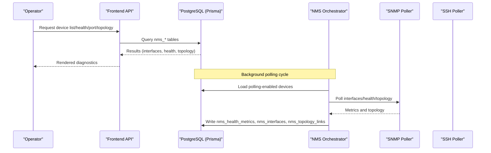

**Diagram sources**
- [orchestrator.py:355-431](file://nms_service/orchestrator.py#L355-L431)
- [poller.py:132-576](file://nms_service/snmp/poller.py#L132-L576)
- [route.ts (NMS Devices):12-60](file://app/api/integrations/nms/devices/route.ts#L12-L60)
- [route.ts (NMS Device Details):25-96](file://app/api/integrations/nms/devices/[id]/route.ts#L25-L96)

## Detailed Component Analysis

### Network Connectivity Testing and Path Tracing
- Connectivity: Interface admin/oper status and last-seen topology links.
- Path tracing: LLDP/CDP neighbor extraction and topology links stored per device/port.
- Port-level details: Endpoint resolves port by name or description and lists neighbors.

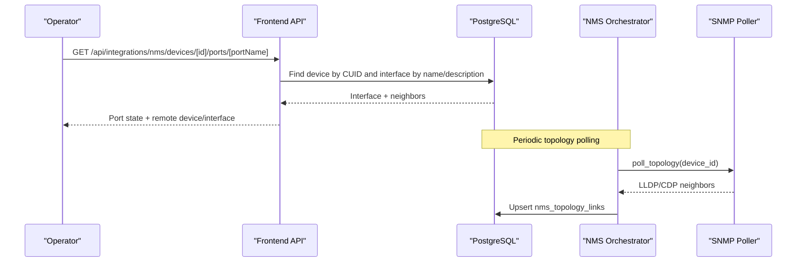

**Diagram sources**
- [route.ts (NMS Device Ports):12-83](file://app/api/integrations/nms/devices/[id]/ports/[portName]/route.ts#L12-L83)
- [poller.py:492-576](file://nms_service/snmp/poller.py#L492-L576)
- [route.ts (NMS Device Details):84-94](file://app/api/integrations/nms/devices/[id]/route.ts#L84-L94)

**Section sources**
- [route.ts (NMS Device Ports):1-89](file://app/api/integrations/nms/devices/[id]/ports/[portName]/route.ts#L1-L89)
- [poller.py:492-576](file://nms_service/snmp/poller.py#L492-L576)
- [route.ts (NMS Device Details):84-94](file://app/api/integrations/nms/devices/[id]/route.ts#L84-L94)

### Latency Measurement and Bandwidth Utilization Tracking
- Bandwidth tracking: Interface counters (in/out octets) recorded per poll cycle.
- Utilization: Derived from delta of octets over time intervals.
- Health metrics: CPU/memory/temperature trends help infer congestion and bottlenecks.

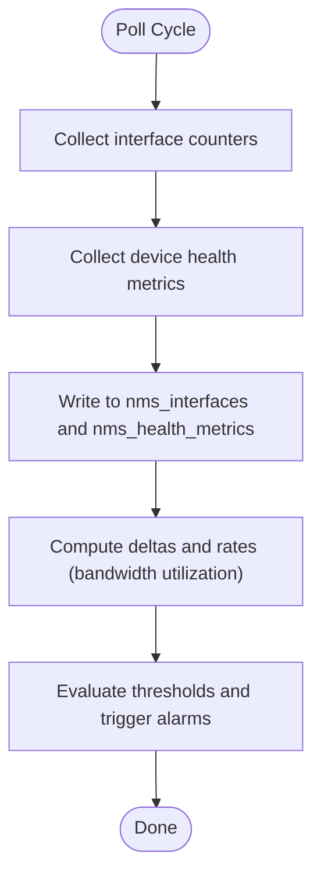

**Diagram sources**
- [orchestrator.py:220-313](file://nms_service/orchestrator.py#L220-L313)
- [poller.py:132-403](file://nms_service/snmp/poller.py#L132-L403)

**Section sources**
- [orchestrator.py:220-313](file://nms_service/orchestrator.py#L220-L313)
- [poller.py:132-403](file://nms_service/snmp/poller.py#L132-L403)

### Network Performance Monitoring and Bottleneck Identification
- Threshold-based NMS alarms: CPU, memory, temperature thresholds.
- Device unreachability detection: Silent periods exceeding poll intervals.
- Anomaly detection: Policy hit anomalies and excessive bandwidth patterns.

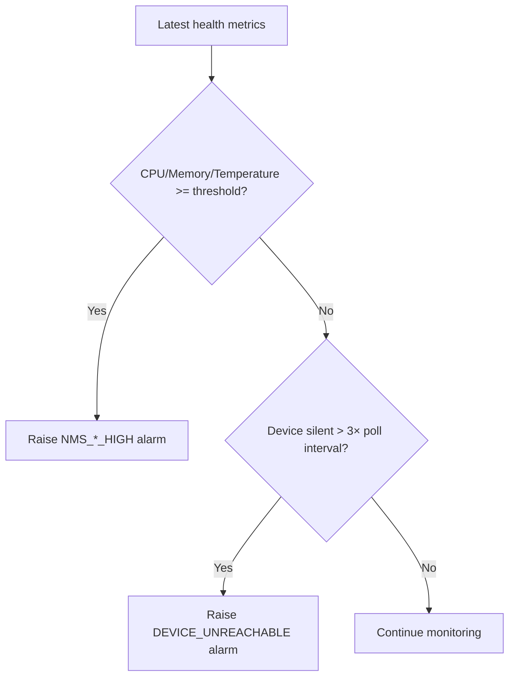

**Diagram sources**
- [detection-engine.ts:3686-3855](file://lib/alarms/detection-engine.ts#L3686-L3855)

**Section sources**
- [detection-engine.ts:3686-3855](file://lib/alarms/detection-engine.ts#L3686-L3855)

### Network Discovery, Device Enumeration, and Topology Validation
- Discovery: Start scan with CIDR and communities; track progress and results.
- Enumeration: Import discovered devices into InfraScope with auto-assigned nmsDeviceId.
- Topology validation: Compare LLDP/CDP neighbors with logical connections and relationships.

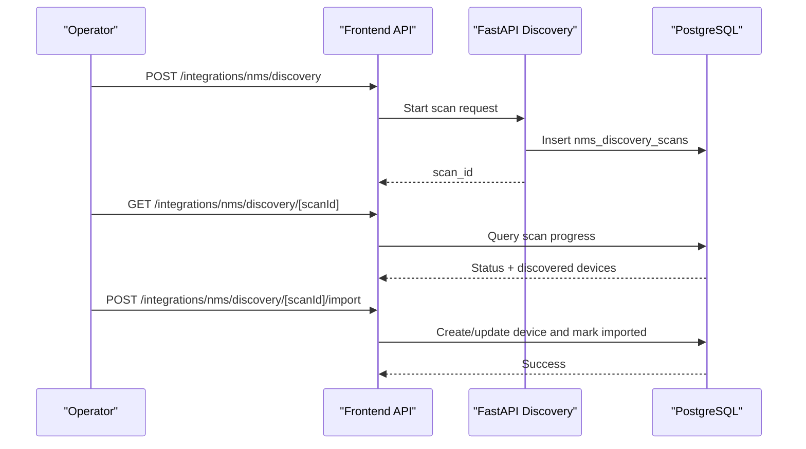

**Diagram sources**
- [main.py:328-373](file://nms_service/main.py#L328-L373)
- [route.ts (NMS Discovery Scan):10-46](file://app/api/integrations/nms/discovery/[scanId]/route.ts#L10-L46)
- [route.ts (NMS Import Discovered Device):20-221](file://app/api/integrations/nms/discovery/[scanId]/import/route.ts#L20-L221)

**Section sources**
- [main.py:328-441](file://nms_service/main.py#L328-L441)
- [route.ts (NMS Discovery Scan):1-52](file://app/api/integrations/nms/discovery/[scanId]/route.ts#L1-L52)
- [route.ts (NMS Import Discovered Device):1-228](file://app/api/integrations/nms/discovery/[scanId]/import/route.ts#L1-L228)
- [schema.prisma:1190-1206](file://prisma/schema.prisma#L1190-L1206)

### Topology Relationships and Graph Construction
- Correlation: VM/host, cluster/host, VLAN membership, and interface connections.
- Graph: Nodes and edges built from relationships with confidence and labels.
- Stale removal: Automatic cleanup of low-confidence auto-generated relationships.

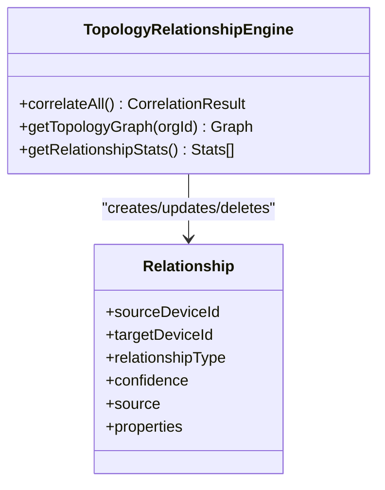

**Diagram sources**
- [relationship-engine.ts:39-83](file://lib/topology/relationship-engine.ts#L39-L83)
- [relationship-engine.ts:280-334](file://lib/topology/relationship-engine.ts#L280-L334)

**Section sources**
- [relationship-engine.ts:1-516](file://lib/topology/relationship-engine.ts#L1-L516)

### Network Configuration Backups and Rollback Procedures
- Backup retrieval: Fetch full configuration text for a specific backup.
- Deletion: Remove backup records from the database.
- Rollback: Use backed-up configuration text to restore device state.

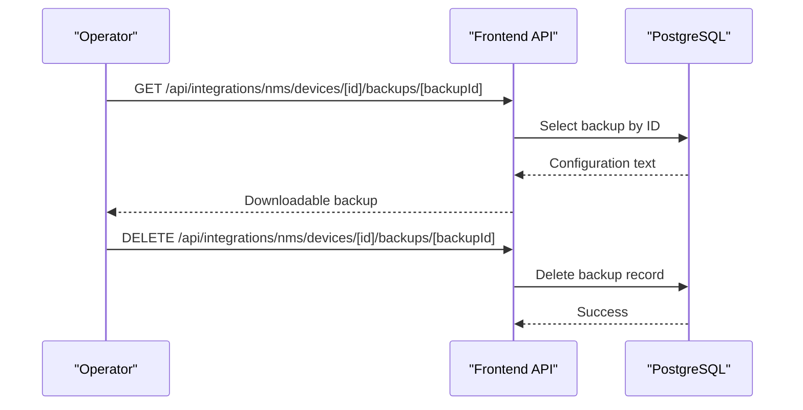

**Diagram sources**
- [route.ts (NMS Backups):10-36](file://app/api/integrations/nms/devices/[id]/backups/[backupId]/route.ts#L10-L36)

**Section sources**
- [route.ts (NMS Backups):1-52](file://app/api/integrations/nms/devices/[id]/backups/[backupId]/route.ts#L1-L52)

### Integration with External Monitoring Systems and Alert Escalation
- FortiAnalyzer integration: Live queries and caching for event-based alarms.
- FortiGate integration: REST-based module sync for firewall policies and SD-WAN.
- Email notifications: Alarm detection engine sends notifications and tracks stats.

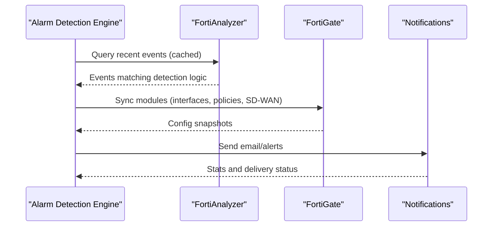

**Diagram sources**
- [detection-engine.ts:1-200](file://lib/alarms/detection-engine.ts#L1-L200)
- [detection-engine.ts:3686-3855](file://lib/alarms/detection-engine.ts#L3686-L3855)

**Section sources**
- [detection-engine.ts:1-200](file://lib/alarms/detection-engine.ts#L1-L200)
- [detection-engine.ts:3686-3855](file://lib/alarms/detection-engine.ts#L3686-L3855)

## Dependency Analysis
- Frontend APIs depend on Prisma models for device, interface, health, topology, and discovery tables.
- NMS Orchestrator depends on SNMP Poller and SSH Poller; writes to nms_* tables.
- Discovery endpoints depend on nms_discovery_scans and nms_discovered_devices.
- Topology engine depends on relationships and device metadata.

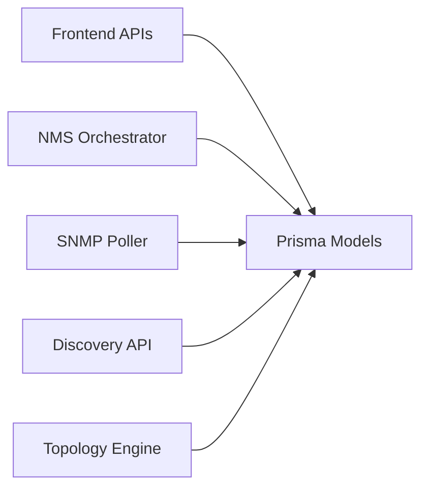

**Diagram sources**
- [route.ts (NMS Devices):12-55](file://app/api/integrations/nms/devices/route.ts#L12-L55)
- [orchestrator.py:35-70](file://nms_service/orchestrator.py#L35-L70)
- [poller.py:63-119](file://nms_service/snmp/poller.py#L63-L119)
- [main.py:328-441](file://nms_service/main.py#L328-L441)
- [relationship-engine.ts:390-474](file://lib/topology/relationship-engine.ts#L390-L474)

**Section sources**
- [route.ts (NMS Devices):1-117](file://app/api/integrations/nms/devices/route.ts#L1-L117)
- [orchestrator.py:35-70](file://nms_service/orchestrator.py#L35-L70)
- [poller.py:63-119](file://nms_service/snmp/poller.py#L63-L119)
- [main.py:328-441](file://nms_service/main.py#L328-L441)
- [relationship-engine.ts:390-474](file://lib/topology/relationship-engine.ts#L390-L474)

## Performance Considerations
- Concurrency: ThreadPoolExecutor with per-device interval throttling and jitter to smooth load.
- Dynamic intervals: Adjust polling cadence based on device status (SNMP OK, SSH-only, unstable).
- Polling scope: Separate cycles for interfaces, health, and topology with timeouts to avoid stalls.
- Bandwidth computation: Use delta of octets over time windows to derive utilization trends.

[No sources needed since this section provides general guidance]

## Troubleshooting Guide

### Common Issues and Resolution Workflows
- Port Down: Identify admin up but oper down interfaces; check neighbors and cable status.
- High CPU/Memory/Temperature: Review health metrics trends; investigate fan/thermal issues or traffic spikes.
- Device Unreachable: No health metrics for extended periods; validate SNMP reachability and credentials.
- Excessive Bandwidth: Investigate top talkers via policy hit anomalies and interface utilization.

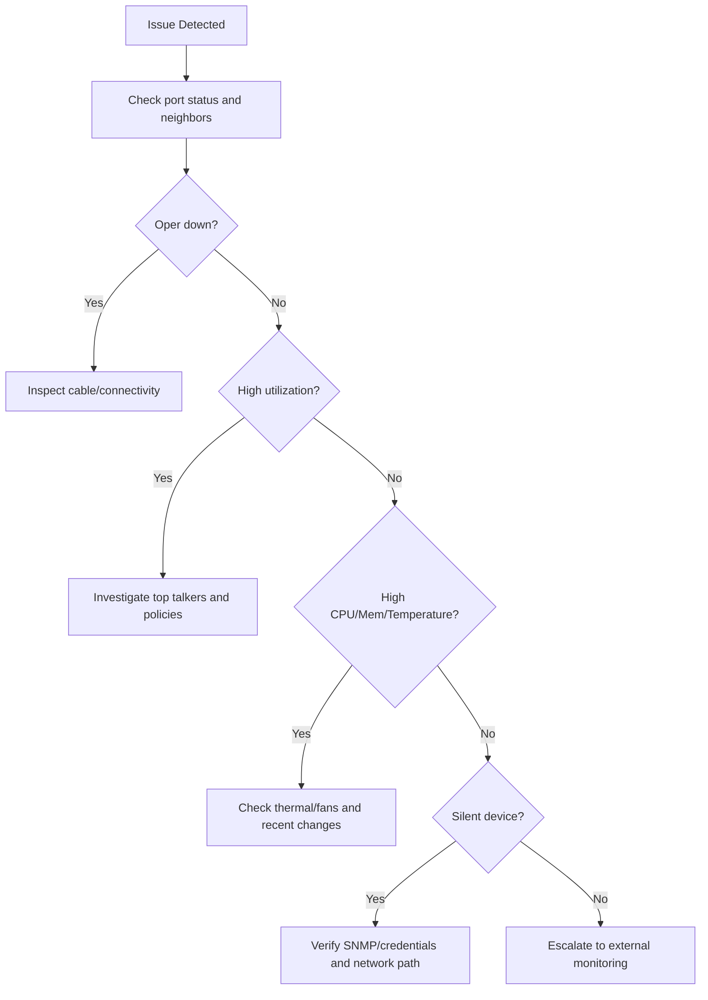

**Diagram sources**
- [route.ts (NMS Device Details):54-94](file://app/api/integrations/nms/devices/[id]/route.ts#L54-L94)
- [detection-engine.ts:3686-3855](file://lib/alarms/detection-engine.ts#L3686-L3855)

**Section sources**
- [route.ts (NMS Device Details):54-94](file://app/api/integrations/nms/devices/[id]/route.ts#L54-L94)
- [detection-engine.ts:3686-3855](file://lib/alarms/detection-engine.ts#L3686-L3855)

### Planned Change Impact Analysis and Rollback
- Pre-change: Take configuration backup via backup endpoint.
- Post-change: Monitor health and topology; compare with baseline.
- Rollback: Restore from backup using stored configuration text.

**Section sources**
- [route.ts (NMS Backups):1-52](file://app/api/integrations/nms/devices/[id]/backups/[backupId]/route.ts#L1-L52)

### Security Diagnostics and Intrusion Detection Integration
- Policy hygiene: Detect permissive or unused firewall rules.
- External exposure: Identify WAN-to-LAN policies.
- Event correlation: Use FortiAnalyzer integration to enrich detections.

**Section sources**
- [detection-engine.ts:3478-3500](file://lib/alarms/detection-engine.ts#L3478-L3500)

## Conclusion
The system provides end-to-end network troubleshooting through continuous SNMP/SSH telemetry, discovery, topology correlation, and alarm orchestration. Operators can validate connectivity, trace paths, monitor utilization, and respond to incidents with integrated alerts and backups.

[No sources needed since this section summarizes without analyzing specific files]

## Appendices

### Practical Examples Index
- Connectivity: [route.ts (NMS Device Ports):1-89](file://app/api/integrations/nms/devices/[id]/ports/[portName]/route.ts#L1-L89)
- Path tracing: [poller.py:492-576](file://nms_service/snmp/poller.py#L492-L576)
- Bandwidth: [orchestrator.py:220-313](file://nms_service/orchestrator.py#L220-L313)
- Discovery: [main.py:328-441](file://nms_service/main.py#L328-L441)
- Topology: [relationship-engine.ts:390-474](file://lib/topology/relationship-engine.ts#L390-L474)
- Alarms: [detection-engine.ts:3686-3855](file://lib/alarms/detection-engine.ts#L3686-L3855)
- Backups: [route.ts (NMS Backups):1-52](file://app/api/integrations/nms/devices/[id]/backups/[backupId]/route.ts#L1-L52)