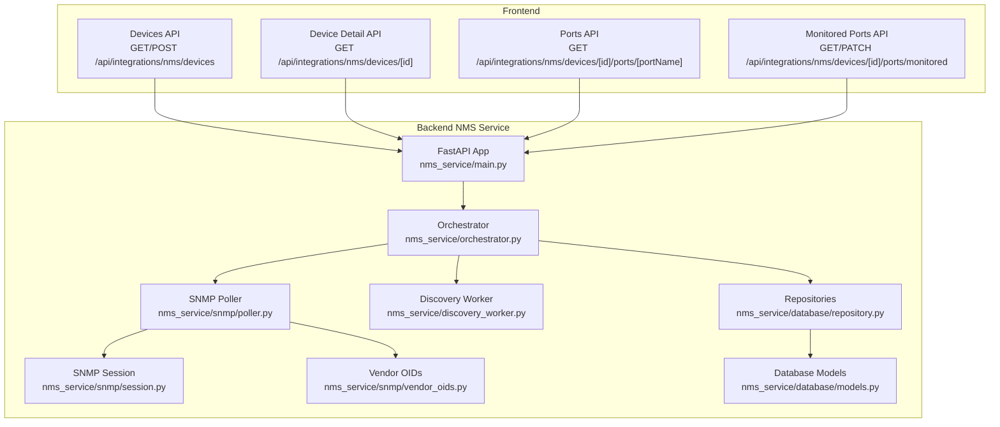
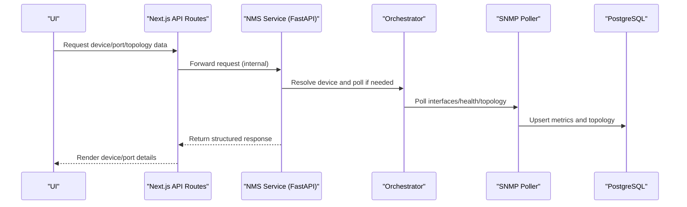
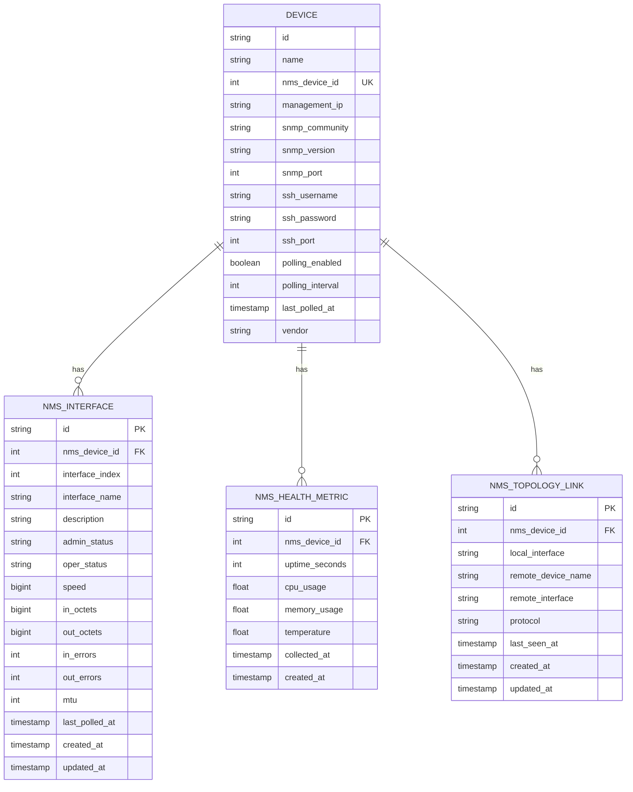
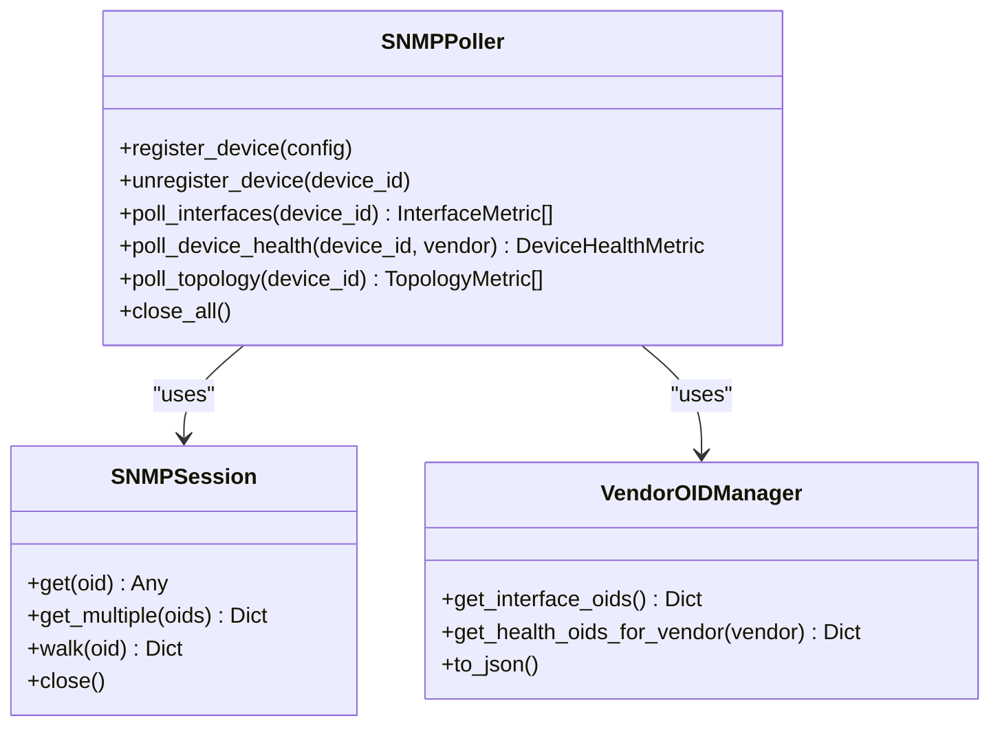
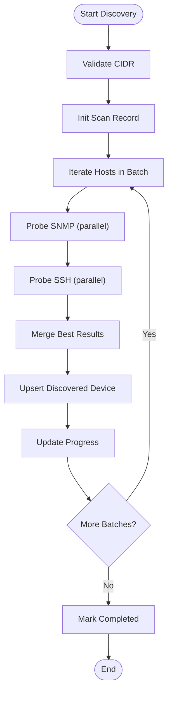
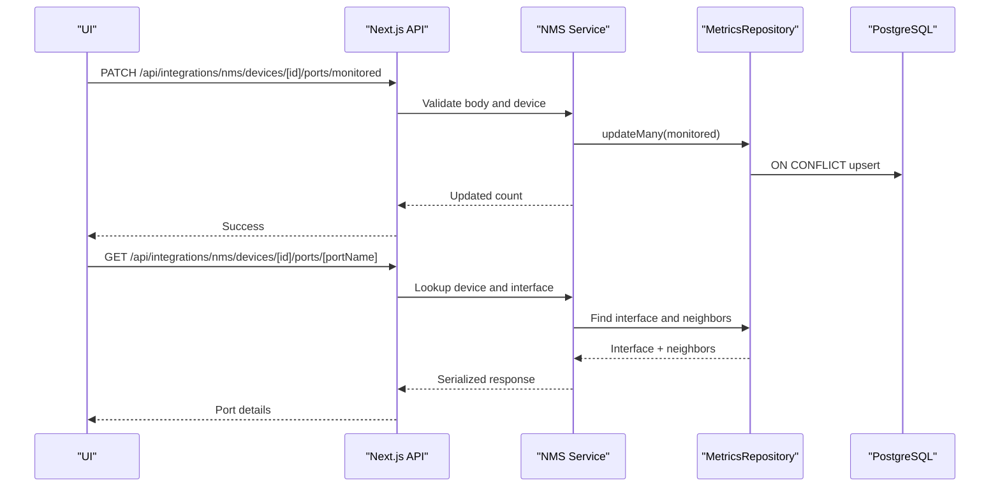
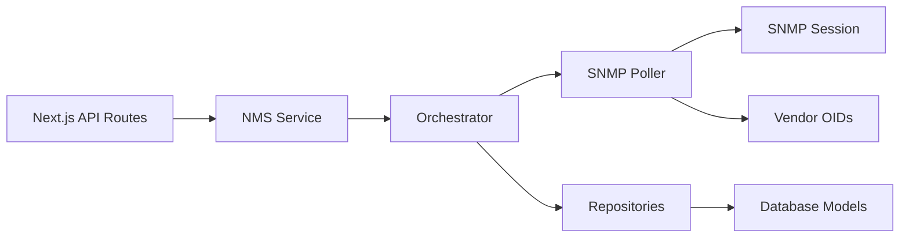

# Switch & Port Management

<cite>
**Referenced Files in This Document**
- [main.py](file://nms_service/main.py)
- [orchestrator.py](file://nms_service/orchestrator.py)
- [discovery_worker.py](file://nms_service/discovery_worker.py)
- [session.py](file://nms_service/snmp/session.py)
- [poller.py](file://nms_service/snmp/poller.py)
- [models.py](file://nms_service/database/models.py)
- [repository.py](file://nms_service/database/repository.py)
- [vendor_oids.py](file://nms_service/snmp/vendor_oids.py)
- [route.ts](file://app/api/integrations/nms/devices/route.ts)
- [route.ts](file://app/api/integrations/nms/devices/[id]/route.ts)
- [route.ts](file://app/api/integrations/nms/devices/[id]/ports/[portName]/route.ts)
- [route.ts](file://app/api/integrations/nms/devices/[id]/ports/monitored/route.ts)
</cite>

## Table of Contents
1. [Introduction](#introduction)
2. [Project Structure](#project-structure)
3. [Core Components](#core-components)
4. [Architecture Overview](#architecture-overview)
5. [Detailed Component Analysis](#detailed-component-analysis)
6. [Dependency Analysis](#dependency-analysis)
7. [Performance Considerations](#performance-considerations)
8. [Troubleshooting Guide](#troubleshooting-guide)
9. [Conclusion](#conclusion)
10. [Appendices](#appendices)

## Introduction
This document explains the switch and port management functionality implemented in the repository. It covers how physical ports are discovered and represented as logical network interfaces, how VLAN assignments and port channels are handled conceptually, and how interface status, topology, and performance are monitored. It also documents the port discovery process, MAC address learning via LLDP/CDP, and the relationship between physical ports and logical network interfaces. Practical workflows for provisioning, bandwidth allocation, and QoS are outlined, along with troubleshooting steps for connectivity and performance issues. Finally, it highlights vendor-specific features and standardized management protocols.

## Project Structure
The switch and port management spans two layers:
- Frontend API routes under app/api/integrations/nms/devices that expose device, interface, and topology data to the UI.
- Backend NMS service under nms_service that performs SNMP polling, SSH fallback, discovery scanning, and writes metrics to the database.

**Diagram sources**
- [main.py:1-483](file://nms_service/main.py#L1-L483)
- [orchestrator.py:1-461](file://nms_service/orchestrator.py#L1-L461)
- [discovery_worker.py:1-262](file://nms_service/discovery_worker.py#L1-L262)
- [session.py:1-258](file://nms_service/snmp/session.py#L1-L258)
- [poller.py:1-592](file://nms_service/snmp/poller.py#L1-L592)
- [models.py:1-227](file://nms_service/database/models.py#L1-L227)
- [repository.py:1-251](file://nms_service/database/repository.py#L1-L251)
- [vendor_oids.py:1-374](file://nms_service/snmp/vendor_oids.py#L1-L374)
- [route.ts:1-117](file://app/api/integrations/nms/devices/route.ts#L1-L117)
- [route.ts:1-166](file://app/api/integrations/nms/devices/[id]/route.ts#L1-L166)
- [route.ts:1-89](file://app/api/integrations/nms/devices/[id]/ports/[portName]/route.ts#L1-L89)
- [route.ts:1-146](file://app/api/integrations/nms/devices/[id]/ports/monitored/route.ts#L1-L146)

**Section sources**
- [main.py:1-483](file://nms_service/main.py#L1-L483)
- [route.ts:1-117](file://app/api/integrations/nms/devices/route.ts#L1-L117)
- [route.ts:1-166](file://app/api/integrations/nms/devices/[id]/route.ts#L1-L166)
- [route.ts:1-89](file://app/api/integrations/nms/devices/[id]/ports/[portName]/route.ts#L1-L89)
- [route.ts:1-146](file://app/api/integrations/nms/devices/[id]/ports/monitored/route.ts#L1-L146)

## Core Components
- Device and interface data model: The backend defines Device and NMS interface/time-series models that map to the InfraScope PostgreSQL schema. Interfaces are uniquely identified by nms_device_id plus interface_index and are upserted on each poll cycle.
- SNMP polling engine: The poller walks IF-MIB tables to collect interface states, speeds, octets, errors, and MTU. It also collects vendor-specific health metrics and topology via LLDP/CDP.
- Orchestrator: Registers devices, schedules polling with dynamic intervals, throttles per-device, and persists metrics and topology.
- Discovery worker: Scans CIDR ranges for reachable devices using SNMP and SSH checks, storing results for later import.
- Frontend APIs: Expose device lists, per-device metrics, port details, and monitored port toggling to the UI.

**Section sources**
- [models.py:43-144](file://nms_service/database/models.py#L43-L144)
- [poller.py:132-592](file://nms_service/snmp/poller.py#L132-L592)
- [orchestrator.py:98-461](file://nms_service/orchestrator.py#L98-L461)
- [discovery_worker.py:128-262](file://nms_service/discovery_worker.py#L128-L262)
- [repository.py:65-251](file://nms_service/database/repository.py#L65-L251)

## Architecture Overview
The system integrates a FastAPI service with a background orchestrator that concurrently polls devices, collects interface and health metrics, and discovers new devices. The UI consumes these metrics via Next.js API routes.

**Diagram sources**
- [main.py:103-182](file://nms_service/main.py#L103-L182)
- [orchestrator.py:355-431](file://nms_service/orchestrator.py#L355-L431)
- [poller.py:132-592](file://nms_service/snmp/poller.py#L132-L592)
- [repository.py:71-200](file://nms_service/database/repository.py#L71-L200)

## Detailed Component Analysis

### Device and Interface Data Model
- Device: Holds nms_device_id (integer bridge key), management IP, SNMP credentials, polling settings, and vendor hints.
- NmsInterface: Tracks per-port admin/oper status, speed, counters, MTU, and timestamps. Uniqueness is enforced by (nms_device_id, interface_index).
- NmsHealthMetric: Time-series of CPU/memory/temp/uptime.
- NmsTopologyLink: LLDP/CDP neighbor relationships with last-seen timestamps.

**Diagram sources**
- [models.py:43-144](file://nms_service/database/models.py#L43-L144)

**Section sources**
- [models.py:43-144](file://nms_service/database/models.py#L43-L144)
- [repository.py:71-200](file://nms_service/database/repository.py#L71-L200)

### SNMP Polling Engine and Vendor-Specific Features
- Interface polling: Walks IF-MIB to collect admin/oper status, speed, octets, errors, and MTU. Safely parses values and converts types.
- Health polling: Collects uptime and vendor-specific CPU/memory/temperature using OID mappings.
- Topology polling: Prefers LLDP, falls back to CDP for Cisco devices.
- Vendor OIDs: Centralized mapping for generic and vendor-specific metrics.

**Diagram sources**
- [poller.py:63-592](file://nms_service/snmp/poller.py#L63-L592)
- [session.py:38-258](file://nms_service/snmp/session.py#L38-L258)
- [vendor_oids.py:30-374](file://nms_service/snmp/vendor_oids.py#L30-L374)

**Section sources**
- [poller.py:132-592](file://nms_service/snmp/poller.py#L132-L592)
- [session.py:109-241](file://nms_service/snmp/session.py#L109-L241)
- [vendor_oids.py:138-265](file://nms_service/snmp/vendor_oids.py#L138-L265)

### Discovery Workflow
- Starts a discovery scan with a CIDR and optional SNMP communities and SSH credentials.
- Probes hosts via parallel SNMP and SSH checks, determines vendor from system descriptions, and persists results.
- Progress and results are queryable via dedicated endpoints.

**Diagram sources**
- [discovery_worker.py:128-262](file://nms_service/discovery_worker.py#L128-L262)
- [main.py:328-442](file://nms_service/main.py#L328-L442)

**Section sources**
- [discovery_worker.py:85-243](file://nms_service/discovery_worker.py#L85-L243)
- [main.py:328-442](file://nms_service/main.py#L328-L442)

### Port Monitoring and Status
- Monitored ports: Bulk toggle monitored flag per interface or all interfaces for a device.
- Per-port details: Retrieve interface state, description, admin/oper status, speed, counters, and topology neighbors.
- Device-level view: Admin/oper status counts and latest health metrics.

**Diagram sources**
- [route.ts:67-146](file://app/api/integrations/nms/devices/[id]/ports/monitored/route.ts#L67-L146)
- [route.ts:12-89](file://app/api/integrations/nms/devices/[id]/ports/[portName]/route.ts#L12-L89)
- [repository.py:71-200](file://nms_service/database/repository.py#L71-L200)

**Section sources**
- [route.ts:67-146](file://app/api/integrations/nms/devices/[id]/ports/monitored/route.ts#L67-L146)
- [route.ts:12-89](file://app/api/integrations/nms/devices/[id]/ports/[portName]/route.ts#L12-L89)
- [repository.py:71-200](file://nms_service/database/repository.py#L71-L200)

### Relationship Between Physical Ports and Logical Interfaces
- Physical ports are represented as entries in the IF-MIB interface table. Each entry has an index, description, admin/oper status, speed, and counters.
- The NMS interface model stores these attributes and timestamps, enabling historical tracking and anomaly detection.
- Topology links (LLDP/CDP) connect local interfaces to remote devices and ports, forming the logical network map.

**Section sources**
- [poller.py:132-224](file://nms_service/snmp/poller.py#L132-L224)
- [poller.py:492-577](file://nms_service/snmp/poller.py#L492-L577)
- [models.py:68-98](file://nms_service/database/models.py#L68-L98)

### Port Discovery, MAC Learning, and Trunking
- Discovery: CIDR scanning probes hosts via SNMP and SSH to identify reachable devices and vendors.
- MAC learning: Not directly exposed in the current code; however, LLDP/CDP neighbor information is collected and stored, which indirectly reflects MAC-to-port associations learned by neighboring devices.
- Trunking: The code does not implement explicit trunk/VLAN configuration. VLAN membership is inferred from LLDP/CDP neighbor relationships and interface descriptions; the system does not enforce or modify switchport modes or trunk encapsulations.

**Section sources**
- [discovery_worker.py:85-126](file://nms_service/discovery_worker.py#L85-L126)
- [poller.py:492-577](file://nms_service/snmp/poller.py#L492-L577)

### Bandwidth Allocation and QoS
- Bandwidth allocation: The code does not implement QoS policy configuration or bandwidth shaping. It collects interface counters (in/out octets) and speed, which can be used for traffic analysis and threshold-based alerts.
- QoS: No QoS profile provisioning is present. The system focuses on status monitoring and topology discovery.

**Section sources**
- [poller.py:132-224](file://nms_service/snmp/poller.py#L132-L224)
- [repository.py:71-158](file://nms_service/database/repository.py#L71-L158)

### Port Provisioning Examples
- Enable polling for a device: POST to the devices endpoint with device ID, management IP, SNMP community, version, port, and polling interval. The backend auto-assigns an integer nms_device_id and enables polling.
- Toggle monitored status: Use the monitored ports endpoint to bulk set monitored flags for specific interfaces or all interfaces on a device.

**Section sources**
- [route.ts:62-116](file://app/api/integrations/nms/devices/route.ts#L62-L116)
- [route.ts:76-145](file://app/api/integrations/nms/devices/[id]/ports/monitored/route.ts#L76-L145)

## Dependency Analysis
- Frontend API routes depend on the backend FastAPI service for device and metric data.
- The NMS service depends on the orchestrator, which coordinates SNMP polling, SSH fallback, and discovery.
- The poller depends on SNMP sessions and vendor OIDs; repositories persist data to PostgreSQL.
- Database models define foreign keys and uniqueness constraints ensuring data integrity.

**Diagram sources**
- [main.py:103-182](file://nms_service/main.py#L103-L182)
- [orchestrator.py:355-431](file://nms_service/orchestrator.py#L355-L431)
- [poller.py:63-131](file://nms_service/snmp/poller.py#L63-L131)
- [session.py:38-106](file://nms_service/snmp/session.py#L38-L106)
- [vendor_oids.py:30-62](file://nms_service/snmp/vendor_oids.py#L30-L62)
- [repository.py:65-200](file://nms_service/database/repository.py#L65-L200)
- [models.py:43-144](file://nms_service/database/models.py#L43-L144)

**Section sources**
- [main.py:103-182](file://nms_service/main.py#L103-L182)
- [orchestrator.py:355-431](file://nms_service/orchestrator.py#L355-L431)
- [poller.py:63-131](file://nms_service/snmp/poller.py#L63-L131)
- [repository.py:65-200](file://nms_service/database/repository.py#L65-L200)
- [models.py:43-144](file://nms_service/database/models.py#L43-L144)

## Performance Considerations
- Concurrency: The orchestrator uses a persistent ThreadPoolExecutor to poll devices concurrently, preventing long-running cycles from blocking.
- Dynamic intervals: Polling intervals adapt based on outcomes (SNMP OK, SSH only, unstable) to balance responsiveness and resource usage.
- Throttling: Per-device last_poll tracking ensures intervals are respected even under heavy load.
- Subprocess-based SNMP: Using external net-snmp tools avoids Python GIL contention and improves scalability for many devices.
- Jitter: Deterministic jitter per device spreads load across the network.

**Section sources**
- [orchestrator.py:61-70](file://nms_service/orchestrator.py#L61-L70)
- [orchestrator.py:75-96](file://nms_service/orchestrator.py#L75-L96)
- [orchestrator.py:407-431](file://nms_service/orchestrator.py#L407-L431)
- [session.py:63-65](file://nms_service/snmp/session.py#L63-L65)

## Troubleshooting Guide
- Device not found or no NMS configuration:
  - Verify the device has nms_device_id assigned and polling enabled.
  - Check the devices endpoint for enabled-only listing.
- Port not found:
  - Ensure the port name matches either interfaceName or description.
  - Confirm the device is polled and interfaces exist in the database.
- Connectivity issues:
  - Validate management IP, SNMP version, port, and community.
  - Confirm SNMP reachability and that the device responds to IF-MIB queries.
- Performance degradation:
  - Review polling intervals and device status transitions (SNMP OK vs SSH only).
  - Check timeouts and retries for SNMP operations.
- Topology missing:
  - Ensure LLDP/CDP is enabled on neighboring devices.
  - Verify the device supports LLDP/CDP and that the poller can walk the respective tables.

**Section sources**
- [route.ts:12-166](file://app/api/integrations/nms/devices/[id]/route.ts#L12-L166)
- [route.ts:12-89](file://app/api/integrations/nms/devices/[id]/ports/[portName]/route.ts#L12-L89)
- [poller.py:492-577](file://nms_service/snmp/poller.py#L492-L577)
- [session.py:109-143](file://nms_service/snmp/session.py#L109-L143)

## Conclusion
The system provides robust switch and port monitoring by collecting interface states, health metrics, and topology via SNMP with vendor-aware parsing. Discovery and SSH fallback improve coverage, while the UI exposes actionable insights through device and port endpoints. While VLAN/trunk provisioning and QoS are not implemented, the collected metrics support traffic analysis, anomaly detection, and informed operational decisions.

## Appendices

### Practical Workflows
- Provision a new switch:
  - Start a discovery scan for the subnet.
  - Import discovered devices and enable polling via the devices endpoint.
- Monitor a port:
  - Use the per-port endpoint to view admin/oper status, speed, counters, and neighbors.
- Toggle monitoring:
  - Bulk set monitored flags for specific interfaces or all interfaces on a device.

**Section sources**
- [main.py:328-442](file://nms_service/main.py#L328-L442)
- [route.ts:62-116](file://app/api/integrations/nms/devices/route.ts#L62-L116)
- [route.ts:12-89](file://app/api/integrations/nms/devices/[id]/ports/[portName]/route.ts#L12-L89)
- [route.ts:76-145](file://app/api/integrations/nms/devices/[id]/ports/monitored/route.ts#L76-L145)