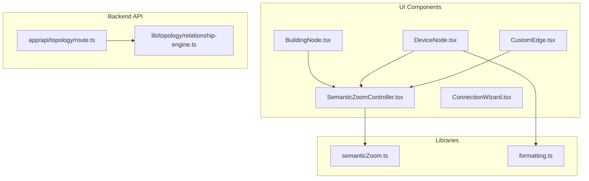
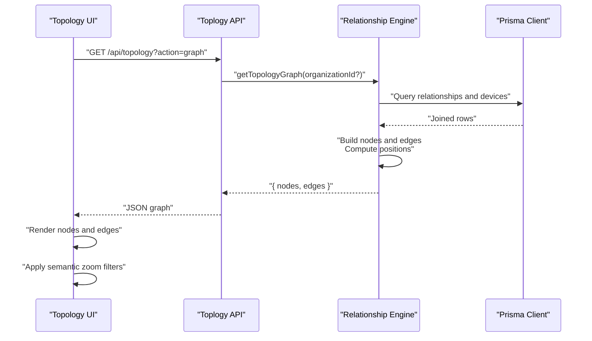
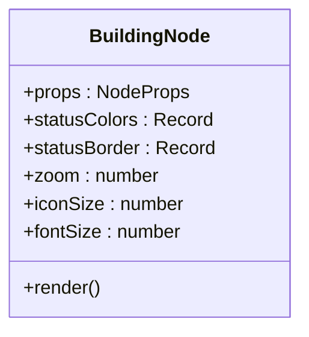
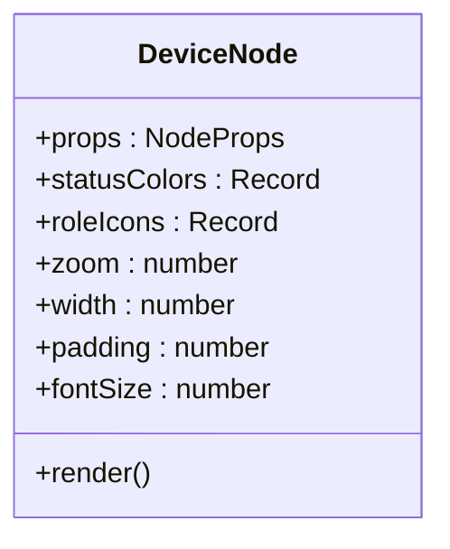
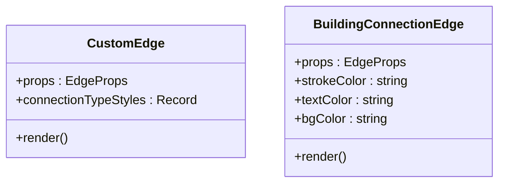
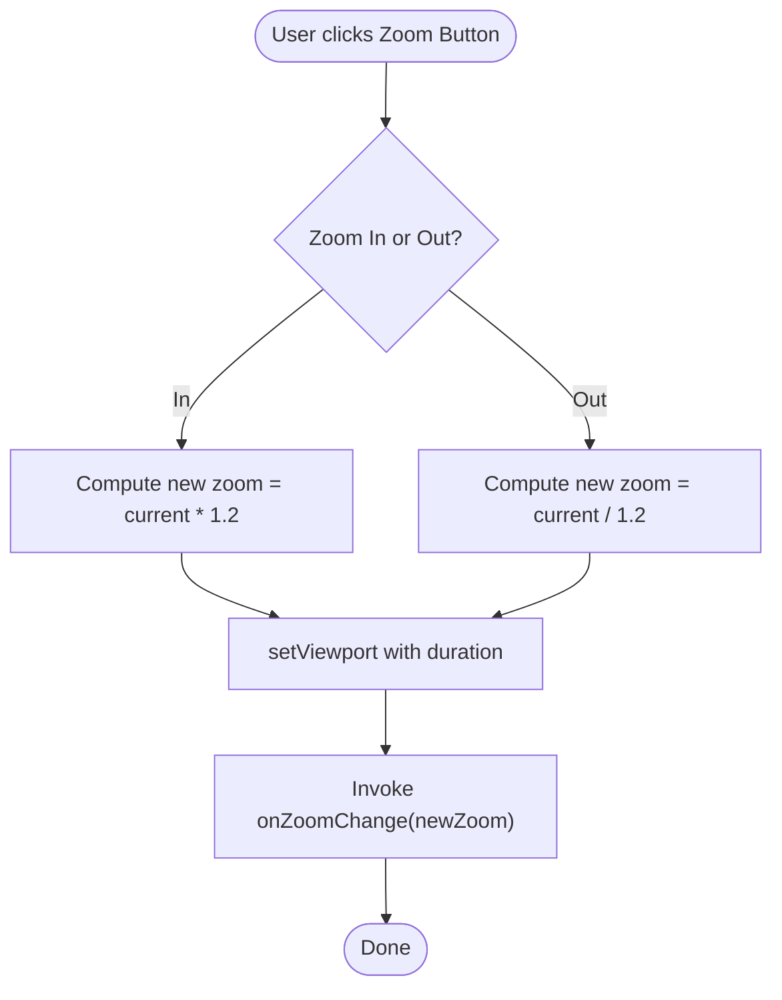
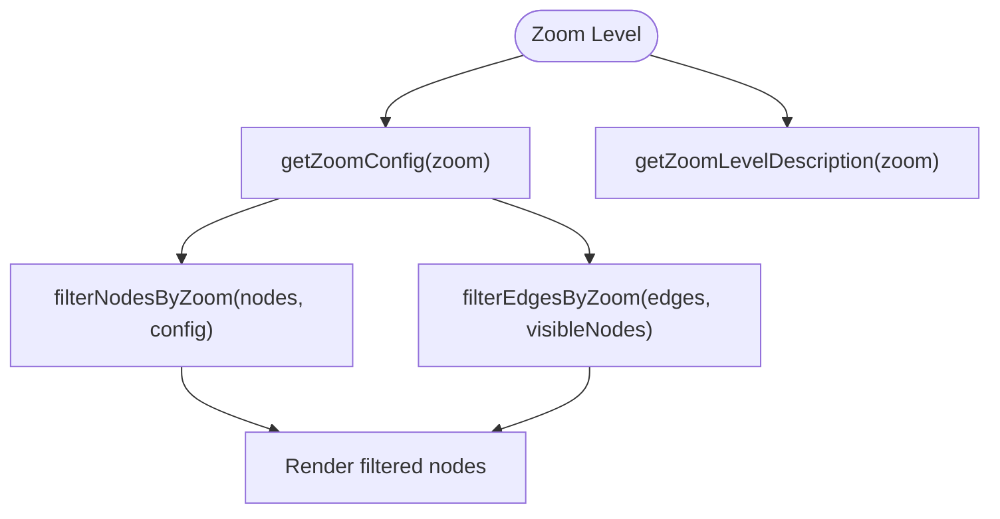
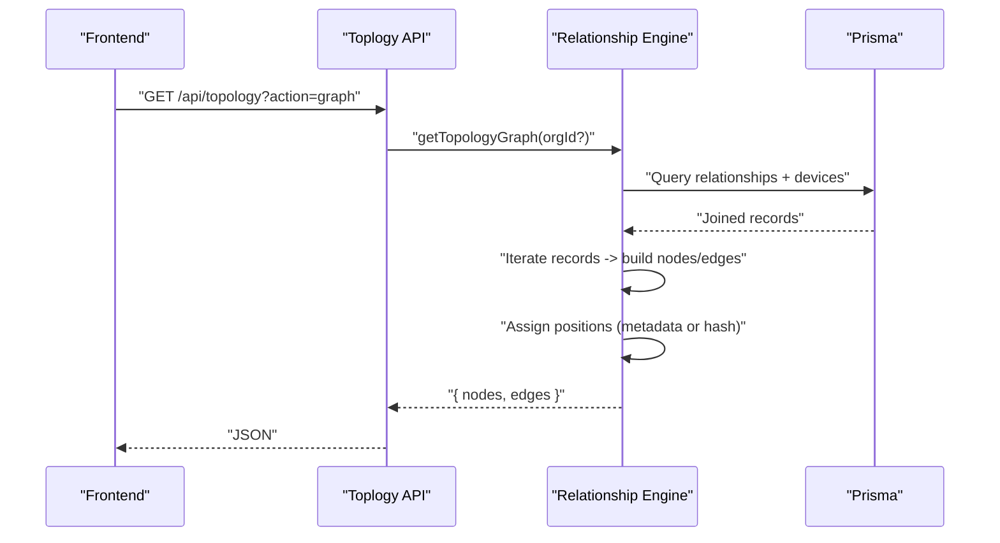
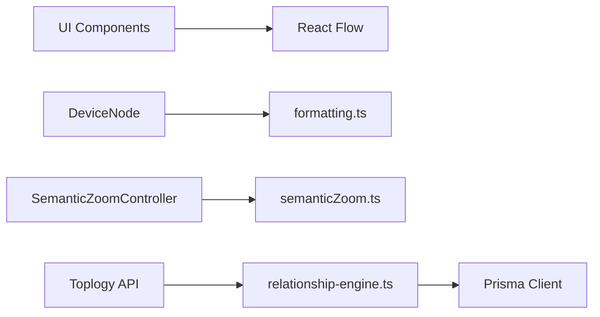

# Topology Visualization

<cite>
**Referenced Files in This Document**
- [BuildingNode.tsx](file://components/topology/BuildingNode.tsx)
- [DeviceNode.tsx](file://components/topology/DeviceNode.tsx)
- [CustomEdge.tsx](file://components/topology/CustomEdge.tsx)
- [SemanticZoomController.tsx](file://components/topology/SemanticZoomController.tsx)
- [semanticZoom.ts](file://lib/semanticZoom.ts)
- [relationship-engine.ts](file://lib/topology/relationship-engine.ts)
- [route.ts](file://app/api/topology/route.ts)
- [formatting.ts](file://lib/formatting.ts)
- [ConnectionWizard.tsx](file://components/topology/ConnectionWizard.tsx)
</cite>

## Table of Contents
1. [Introduction](#introduction)
2. [Project Structure](#project-structure)
3. [Core Components](#core-components)
4. [Architecture Overview](#architecture-overview)
5. [Detailed Component Analysis](#detailed-component-analysis)
6. [Dependency Analysis](#dependency-analysis)
7. [Performance Considerations](#performance-considerations)
8. [Troubleshooting Guide](#troubleshooting-guide)
9. [Conclusion](#conclusion)

## Introduction
This document explains the topology visualization system built with React Flow. It covers custom node and edge types, the semantic zoom controller for hierarchical navigation, the topology generation pipeline that maps physical infrastructure to logical network relationships, auto-layout considerations, filtering mechanisms for large-scale topologies, and practical examples for rendering, selection handling, and context menu interactions. Performance optimizations and memory management strategies are also documented.

## Project Structure
The topology visualization spans UI components, a semantic zoom library, and a backend API that generates the graph data from the data model.

**Diagram sources**
- [BuildingNode.tsx:1-176](file://components/topology/BuildingNode.tsx#L1-L176)
- [DeviceNode.tsx:1-112](file://components/topology/DeviceNode.tsx#L1-L112)
- [CustomEdge.tsx:1-156](file://components/topology/CustomEdge.tsx#L1-L156)
- [SemanticZoomController.tsx:1-49](file://components/topology/SemanticZoomController.tsx#L1-L49)
- [semanticZoom.ts:1-32](file://lib/semanticZoom.ts#L1-L32)
- [formatting.ts:62-89](file://lib/formatting.ts#L62-L89)
- [route.ts:1-51](file://app/api/topology/route.ts#L1-L51)
- [relationship-engine.ts:390-474](file://lib/topology/relationship-engine.ts#L390-L474)
- [ConnectionWizard.tsx:1-80](file://components/topology/ConnectionWizard.tsx#L1-L80)

**Section sources**
- [BuildingNode.tsx:1-176](file://components/topology/BuildingNode.tsx#L1-L176)
- [DeviceNode.tsx:1-112](file://components/topology/DeviceNode.tsx#L1-L112)
- [CustomEdge.tsx:1-156](file://components/topology/CustomEdge.tsx#L1-L156)
- [SemanticZoomController.tsx:1-49](file://components/topology/SemanticZoomController.tsx#L1-L49)
- [semanticZoom.ts:1-32](file://lib/semanticZoom.ts#L1-L32)
- [formatting.ts:62-89](file://lib/formatting.ts#L62-L89)
- [route.ts:1-51](file://app/api/topology/route.ts#L1-L51)
- [relationship-engine.ts:390-474](file://lib/topology/relationship-engine.ts#L390-L474)
- [ConnectionWizard.tsx:1-80](file://components/topology/ConnectionWizard.tsx#L1-L80)

## Core Components
- BuildingNode: A React Flow node representing a building with status, counts, and expandable behavior. It exposes connection handles and supports click/double-click handlers and a details action.
- DeviceNode: A React Flow node representing a network device with role, status, vendor, IP, and port metrics. It includes connection handles and selection visuals.
- CustomEdge and BuildingConnectionEdge: Two edge variants for device-to-device connections and building-level connections, with configurable styles and labels.
- SemanticZoomController: A UI controller to adjust viewport zoom and notify consumers of zoom changes.
- semanticZoom utilities: Zoom configuration, node/edge filtering by hierarchy level, and zoom level descriptions.
- Relationship Engine: Backend service that correlates relationships across devices and builds a graph payload for the frontend.
- API Endpoint: Exposes topology graph retrieval and statistics, and supports correlation actions.

**Section sources**
- [BuildingNode.tsx:24-176](file://components/topology/BuildingNode.tsx#L24-L176)
- [DeviceNode.tsx:22-112](file://components/topology/DeviceNode.tsx#L22-L112)
- [CustomEdge.tsx:7-156](file://components/topology/CustomEdge.tsx#L7-L156)
- [SemanticZoomController.tsx:11-49](file://components/topology/SemanticZoomController.tsx#L11-L49)
- [semanticZoom.ts:1-32](file://lib/semanticZoom.ts#L1-L32)
- [relationship-engine.ts:390-474](file://lib/topology/relationship-engine.ts#L390-L474)
- [route.ts:4-28](file://app/api/topology/route.ts#L4-L28)

## Architecture Overview
The system follows a layered architecture:
- Frontend renders a React Flow canvas using custom nodes and edges.
- The semantic zoom controller adjusts the viewport and drives filtering logic.
- The backend computes relationships and positions devices, returning a graph payload.

**Diagram sources**
- [route.ts:4-28](file://app/api/topology/route.ts#L4-L28)
- [relationship-engine.ts:390-474](file://lib/topology/relationship-engine.ts#L390-L474)

## Detailed Component Analysis

### Custom Node Types

#### BuildingNode
- Purpose: Visual representation of a building with status indicators, device counts, and expand controls.
- Handles: Four invisible handles at top, right, bottom, and left; become visible on hover.
- Interactions: Click triggers expansion, double-click triggers navigation, info button opens details.
- Scaling: Responsive sizing based on zoom to maintain readability.

**Diagram sources**
- [BuildingNode.tsx:24-176](file://components/topology/BuildingNode.tsx#L24-L176)

**Section sources**
- [BuildingNode.tsx:24-176](file://components/topology/BuildingNode.tsx#L24-L176)

#### DeviceNode
- Purpose: Visual representation of a network device with role, status, vendor, IP, and port metrics.
- Handles: Top target and bottom source handles for connecting to/from other nodes.
- Selection: Enhanced border and ring on selection; scaling and shadow effects.
- Vendor logos: Resolved via formatting utilities.

**Diagram sources**
- [DeviceNode.tsx:22-112](file://components/topology/DeviceNode.tsx#L22-L112)
- [formatting.ts:62-89](file://lib/formatting.ts#L62-L89)

**Section sources**
- [DeviceNode.tsx:22-112](file://components/topology/DeviceNode.tsx#L22-L112)
- [formatting.ts:62-89](file://lib/formatting.ts#L62-L89)

### Custom Edge Types

#### CustomEdge
- Purpose: Device-to-device connection with connection-type-specific styling (fiber, copper, wireless, VPN).
- Labeling: Optional label rendered near the edge midpoint.

#### BuildingConnectionEdge
- Purpose: Building-level connections with compact, styled labels and optional icons.

**Diagram sources**
- [CustomEdge.tsx:7-156](file://components/topology/CustomEdge.tsx#L7-L156)

**Section sources**
- [CustomEdge.tsx:7-156](file://components/topology/CustomEdge.tsx#L7-L156)

### Semantic Zoom Controller
- Purpose: Adjust viewport zoom with smooth transitions and notify parent components of zoom changes.
- Controls: Zoom-in and zoom-out buttons with fixed increments.

**Diagram sources**
- [SemanticZoomController.tsx:16-28](file://components/topology/SemanticZoomController.tsx#L16-L28)

**Section sources**
- [SemanticZoomController.tsx:11-49](file://components/topology/SemanticZoomController.tsx#L11-L49)

### Semantic Zoom Utilities
- Configuration: Determines visibility of floors, rooms, racks, and devices based on zoom thresholds.
- Filtering: Filters nodes and edges to keep only those visible at the current zoom level.
- Descriptions: Human-readable zoom level descriptions.

**Diagram sources**
- [semanticZoom.ts:1-32](file://lib/semanticZoom.ts#L1-L32)

**Section sources**
- [semanticZoom.ts:1-32](file://lib/semanticZoom.ts#L1-L32)

### Topology Generation Pipeline
- Data Source: Backend queries relationships and device metadata.
- Graph Construction: Builds nodes and edges, assigning positions either from metadata or deterministic hashing.
- Labels and Confidence: Edge labels derived from relationship types; animation toggled by confidence.

**Diagram sources**
- [route.ts:4-28](file://app/api/topology/route.ts#L4-L28)
- [relationship-engine.ts:390-474](file://lib/topology/relationship-engine.ts#L390-L474)

**Section sources**
- [route.ts:4-28](file://app/api/topology/route.ts#L4-L28)
- [relationship-engine.ts:390-474](file://lib/topology/relationship-engine.ts#L390-L474)

### Practical Examples

#### Rendering Topology
- Fetch graph from API and render nodes and edges.
- Use BuildingNode and DeviceNode components for building and device visuals.
- Use CustomEdge and BuildingConnectionEdge for connections.

References:
- [route.ts:4-28](file://app/api/topology/route.ts#L4-L28)
- [BuildingNode.tsx:24-176](file://components/topology/BuildingNode.tsx#L24-L176)
- [DeviceNode.tsx:22-112](file://components/topology/DeviceNode.tsx#L22-L112)
- [CustomEdge.tsx:7-156](file://components/topology/CustomEdge.tsx#L7-L156)

#### Node Selection Handling
- Selected nodes receive enhanced borders and scaling.
- DeviceNode applies selection visuals; BuildingNode scales on selection.

References:
- [DeviceNode.tsx:52-56](file://components/topology/DeviceNode.tsx#L52-L56)
- [BuildingNode.tsx:124-125](file://components/topology/BuildingNode.tsx#L124-L125)

#### Context Menu Interactions
- BuildingNode exposes onShowDetails callback for opening a details panel.
- ConnectionWizard allows creating new device connections via a modal form.

References:
- [BuildingNode.tsx:157-169](file://components/topology/BuildingNode.tsx#L157-L169)
- [ConnectionWizard.tsx:12-80](file://components/topology/ConnectionWizard.tsx#L12-L80)

## Dependency Analysis
- UI depends on React Flow primitives (NodeProps, EdgeProps, Handle, Position) and Tailwind classes for styling.
- DeviceNode depends on formatting utilities for vendor logos.
- Semantic zoom logic depends on zoom thresholds and visibility rules.
- API depends on the Relationship Engine, which depends on Prisma for data access.

**Diagram sources**
- [DeviceNode.tsx:5](file://components/topology/DeviceNode.tsx#L5)
- [formatting.ts:62-89](file://lib/formatting.ts#L62-L89)
- [SemanticZoomController.tsx:4](file://components/topology/SemanticZoomController.tsx#L4)
- [semanticZoom.ts:1-32](file://lib/semanticZoom.ts#L1-L32)
- [route.ts:2](file://app/api/topology/route.ts#L2)
- [relationship-engine.ts:1-516](file://lib/topology/relationship-engine.ts#L1-L516)

**Section sources**
- [DeviceNode.tsx:5](file://components/topology/DeviceNode.tsx#L5)
- [formatting.ts:62-89](file://lib/formatting.ts#L62-L89)
- [SemanticZoomController.tsx:4](file://components/topology/SemanticZoomController.tsx#L4)
- [semanticZoom.ts:1-32](file://lib/semanticZoom.ts#L1-L32)
- [route.ts:2](file://app/api/topology/route.ts#L2)
- [relationship-engine.ts:1-516](file://lib/topology/relationship-engine.ts#L1-L516)

## Performance Considerations
- Auto-layout and positioning:
  - Nodes are positioned using metadata coordinates when available; otherwise, deterministic hashing ensures consistent placement across sessions.
  - References: [relationship-engine.ts:476-481](file://lib/topology/relationship-engine.ts#L476-L481)
- Filtering for large topologies:
  - Use semantic zoom thresholds to hide lower hierarchy levels and device nodes when zoomed out.
  - References: [semanticZoom.ts:10-23](file://lib/semanticZoom.ts#L10-L23)
- Rendering optimizations:
  - Memoized node components reduce re-renders.
  - References: [BuildingNode.tsx:3](file://components/topology/BuildingNode.tsx#L3), [DeviceNode.tsx:3](file://components/topology/DeviceNode.tsx#L3)
- Memory management:
  - Avoid storing large intermediate arrays; stream or compute on demand.
  - Keep zoom-related state minimal and update only when necessary.
  - References: [SemanticZoomController.tsx:14-28](file://components/topology/SemanticZoomController.tsx#L14-L28)
- Network requests:
  - Paginate or scope topology queries by organization ID to limit payload size.
  - References: [route.ts:5-7](file://app/api/topology/route.ts#L5-L7)
- Edge rendering:
  - Prefer straight paths and compact labels for dense networks.
  - References: [CustomEdge.tsx:17-22](file://components/topology/CustomEdge.tsx#L17-L22), [CustomEdge.tsx:80-85](file://components/topology/CustomEdge.tsx#L80-L85)

## Troubleshooting Guide
- No devices or edges displayed:
  - Verify API returns nodes and edges; check organizationId parameter.
  - References: [route.ts:11-27](file://app/api/topology/route.ts#L11-L27)
- Incorrect positions:
  - Ensure device metadata includes position; otherwise, hashing is used deterministically.
  - References: [relationship-engine.ts:476-481](file://lib/topology/relationship-engine.ts#L476-L481)
- Edges not visible at current zoom:
  - Confirm semantic zoom thresholds and filtering logic.
  - References: [semanticZoom.ts:10-23](file://lib/semanticZoom.ts#L10-L23)
- Vendor logos missing:
  - Confirm vendor name matches supported patterns.
  - References: [formatting.ts:62-89](file://lib/formatting.ts#L62-L89)
- Zoom controls not working:
  - Ensure React Flow context is available and onZoomChange is handled.
  - References: [SemanticZoomController.tsx:14](file://components/topology/SemanticZoomController.tsx#L14)

**Section sources**
- [route.ts:11-27](file://app/api/topology/route.ts#L11-L27)
- [relationship-engine.ts:476-481](file://lib/topology/relationship-engine.ts#L476-L481)
- [semanticZoom.ts:10-23](file://lib/semanticZoom.ts#L10-L23)
- [formatting.ts:62-89](file://lib/formatting.ts#L62-L89)
- [SemanticZoomController.tsx:14](file://components/topology/SemanticZoomController.tsx#L14)

## Conclusion
The topology visualization system combines custom React Flow nodes and edges with a semantic zoom controller and a robust backend relationship engine. The frontend efficiently renders large topologies by filtering content based on zoom levels, while the backend consolidates diverse data sources into a unified graph. Together, these components enable hierarchical navigation, contextual interactions, and scalable performance.