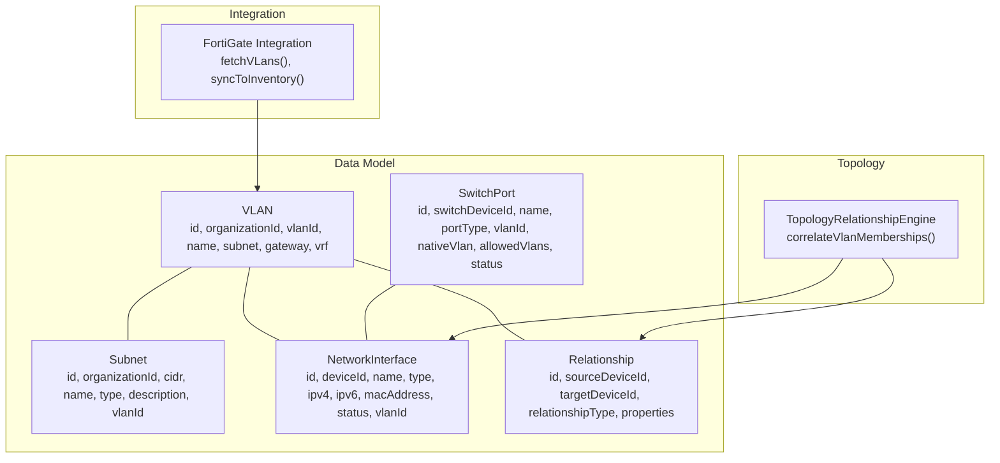
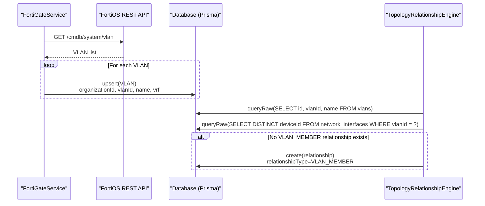
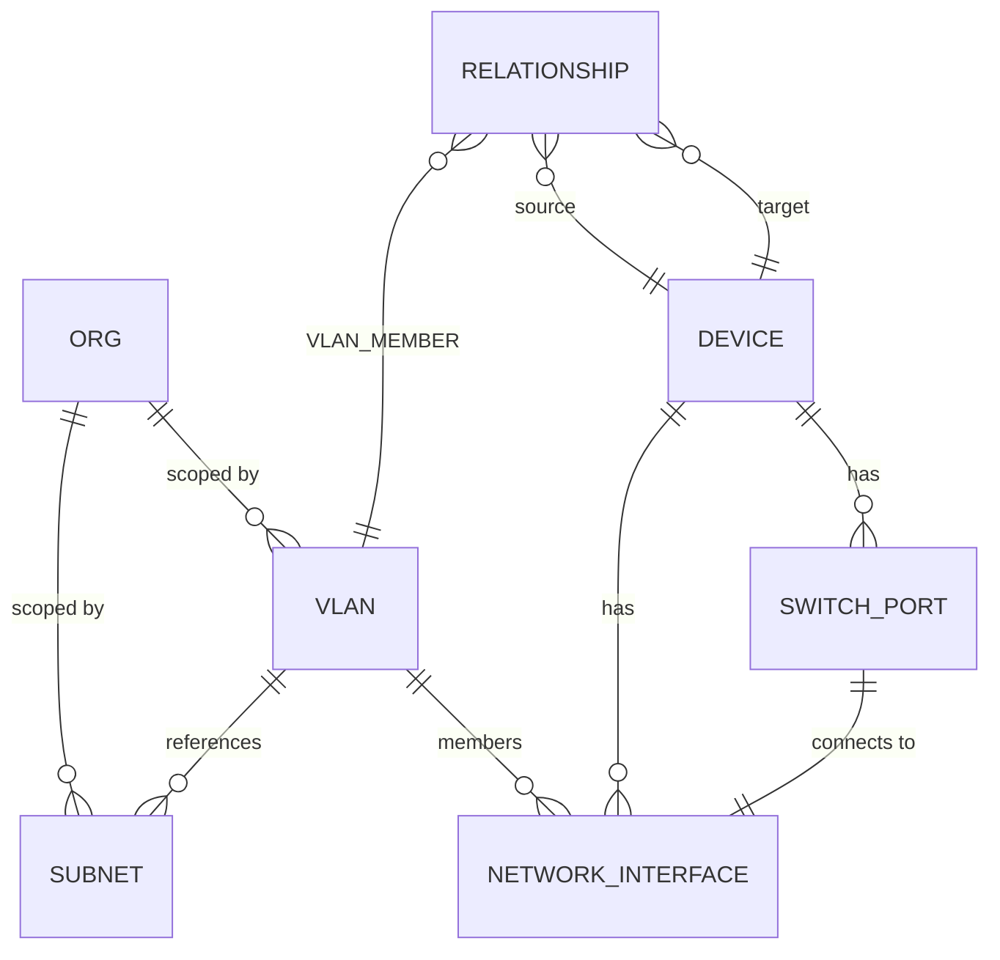
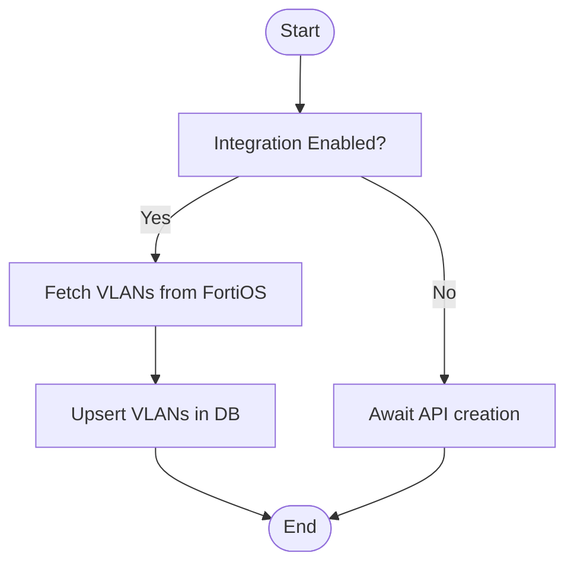
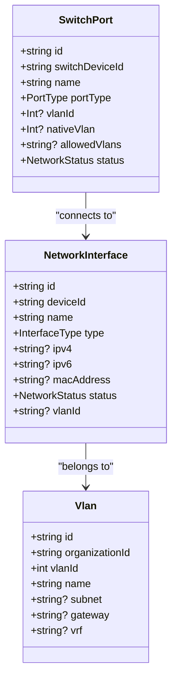
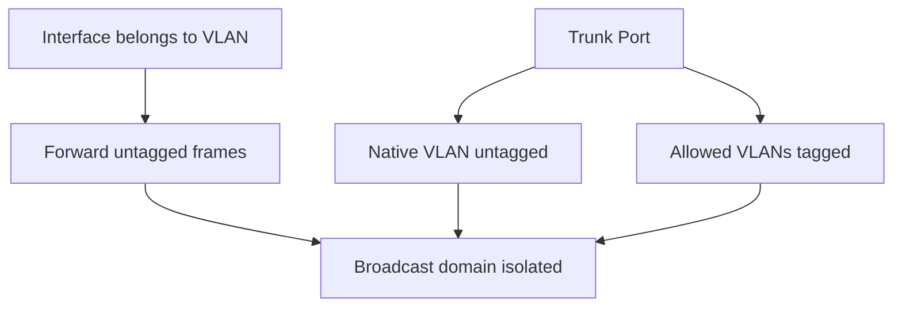
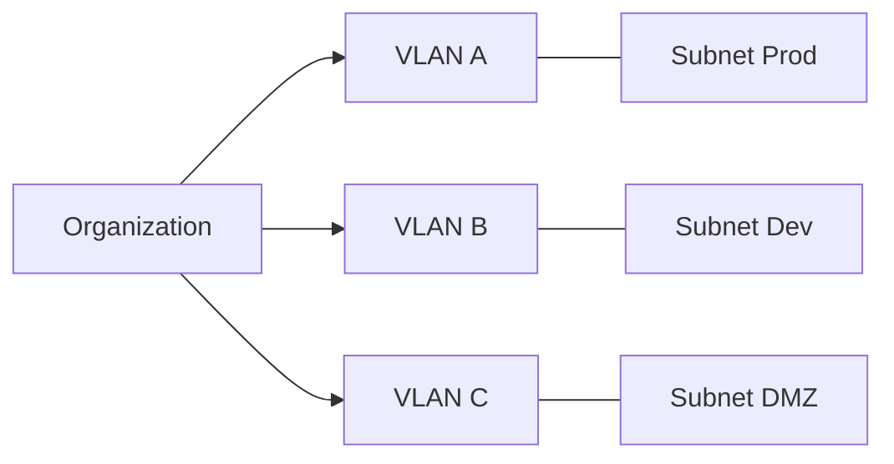
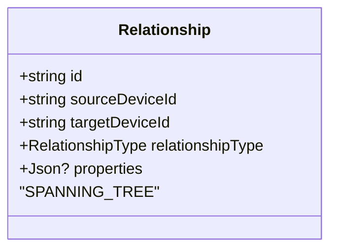
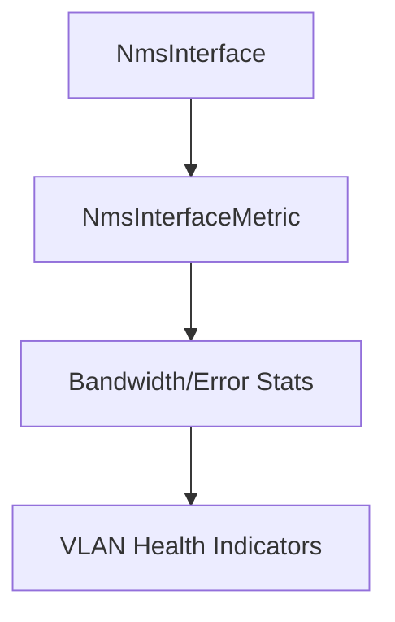
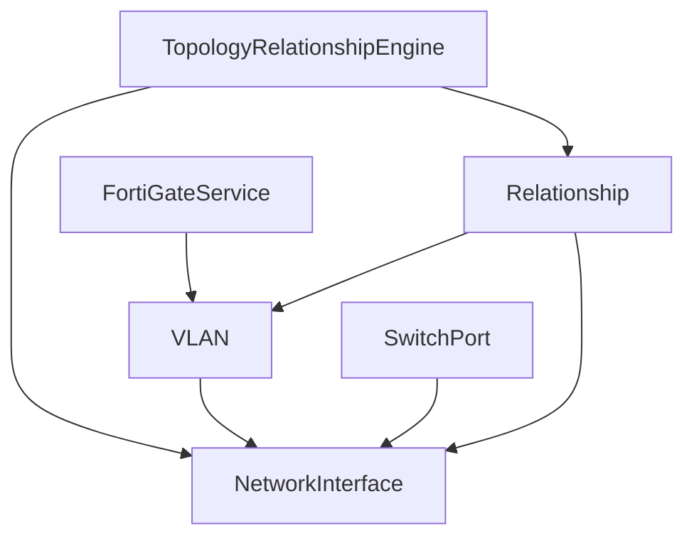

# VLAN Management

<cite>
**Referenced Files in This Document**
- [README.md](file://README.md)
- [schema.prisma](file://prisma/schema.prisma)
- [relationship-engine.ts](file://lib/topology/relationship-engine.ts)
- [fortigate.ts](file://lib/integrations/fortigate.ts)
- [app/network/vlans](file://app/network/vlans)
- [app/network/switches](file://app/network/switches)
- [app/network/ports](file://app/network/ports)
</cite>

## Table of Contents
1. [Introduction](#introduction)
2. [Project Structure](#project-structure)
3. [Core Components](#core-components)
4. [Architecture Overview](#architecture-overview)
5. [Detailed Component Analysis](#detailed-component-analysis)
6. [Dependency Analysis](#dependency-analysis)
7. [Performance Considerations](#performance-considerations)
8. [Troubleshooting Guide](#troubleshooting-guide)
9. [Conclusion](#conclusion)
10. [Appendices](#appendices)

## Introduction
This document explains the VLAN (Virtual Local Area Network) management capabilities present in the platform. It covers VLAN creation, configuration, lifecycle management, tagging, trunking, inter-VLAN routing concepts, assignment to switch ports, VLAN groups, broadcast domain isolation, planning and segmentation strategies, security considerations, spanning tree awareness, VLAN monitoring, statistics collection, performance optimization, and troubleshooting techniques grounded in the repository’s schema and integration code.

## Project Structure
The VLAN domain spans the data model, integration services, and topology correlation engine:
- Data model defines VLANs, subnets, switch ports, and relationships.
- Integration services synchronize VLANs from network devices (e.g., FortiGate).
- Topology engine correlates VLAN membership and builds topology edges.

**Diagram sources**
- [schema.prisma:590-626](file://prisma/schema.prisma#L590-L626)
- [schema.prisma:253-275](file://prisma/schema.prisma#L253-L275)
- [schema.prisma:744-762](file://prisma/schema.prisma#L744-L762)
- [fortigate.ts:394-421](file://lib/integrations/fortigate.ts#L394-L421)
- [relationship-engine.ts:206-269](file://lib/topology/relationship-engine.ts#L206-L269)

**Section sources**
- [README.md:34-49](file://README.md#L34-L49)
- [schema.prisma:590-626](file://prisma/schema.prisma#L590-L626)
- [schema.prisma:253-275](file://prisma/schema.prisma#L253-L275)
- [schema.prisma:744-762](file://prisma/schema.prisma#L744-L762)
- [fortigate.ts:394-421](file://lib/integrations/fortigate.ts#L394-L421)
- [relationship-engine.ts:206-269](file://lib/topology/relationship-engine.ts#L206-L269)

## Core Components
- VLAN model: Represents VLAN identity, organization scoping, optional subnet/gateway/VRF, and relationships to interfaces/subnets.
- Subnet model: Associates CIDR blocks with VLANs and organizations.
- SwitchPort model: Captures port type (access/trunk/hybrid), configured VLANs (native and allowed lists), and status.
- NetworkInterface model: Links to a VLAN and device, carrying IP/MAC/status.
- Relationship model: Encodes topology edges including VLAN_MEMBER, enabling VLAN membership correlation.
- FortiGate integration: Fetches VLANs from FortiOS and upserts them into the database.
- Topology engine: Creates VLAN_MEMBER relationships between devices and VLANs based on interface membership.

Practical implications:
- VLAN creation is achieved by inserting/upserting VLAN records (via integration or future API).
- VLAN assignment to switch ports is modeled by setting portType and VLAN fields on SwitchPort.
- VLAN grouping is implicit via organization scoping and explicit via Subnet associations.
- Broadcast isolation is enforced by associating interfaces to a single VLAN and by trunking configurations.

**Section sources**
- [schema.prisma:590-626](file://prisma/schema.prisma#L590-L626)
- [schema.prisma:253-275](file://prisma/schema.prisma#L253-L275)
- [schema.prisma:230-251](file://prisma/schema.prisma#L230-L251)
- [schema.prisma:744-762](file://prisma/schema.prisma#L744-L762)
- [fortigate.ts:662-692](file://lib/integrations/fortigate.ts#L662-L692)
- [relationship-engine.ts:206-269](file://lib/topology/relationship-engine.ts#L206-L269)

## Architecture Overview
The VLAN lifecycle integrates ingestion, persistence, and correlation:
- Ingestion: FortiGate integration queries VLANs and upserts them into the VLAN table.
- Persistence: VLANs are scoped to organizations and linked to subnets and interfaces.
- Correlation: Topology engine creates VLAN_MEMBER relationships between devices and VLANs based on interface membership.

**Diagram sources**
- [fortigate.ts:394-421](file://lib/integrations/fortigate.ts#L394-L421)
- [fortigate.ts:662-692](file://lib/integrations/fortigate.ts#L662-L692)
- [relationship-engine.ts:206-269](file://lib/topology/relationship-engine.ts#L206-L269)

**Section sources**
- [fortigate.ts:394-421](file://lib/integrations/fortigate.ts#L394-L421)
- [fortigate.ts:662-692](file://lib/integrations/fortigate.ts#L662-L692)
- [relationship-engine.ts:206-269](file://lib/topology/relationship-engine.ts#L206-L269)

## Detailed Component Analysis

### VLAN Data Model and Relationships
The VLAN model encapsulates identity and network context. Subnets can reference VLANs, and interfaces can belong to VLANs. Relationships capture VLAN membership for topology visualization.

**Diagram sources**
- [schema.prisma:10-25](file://prisma/schema.prisma#L10-L25)
- [schema.prisma:590-626](file://prisma/schema.prisma#L590-L626)
- [schema.prisma:610-626](file://prisma/schema.prisma#L610-L626)
- [schema.prisma:230-251](file://prisma/schema.prisma#L230-L251)
- [schema.prisma:253-275](file://prisma/schema.prisma#L253-L275)
- [schema.prisma:744-762](file://prisma/schema.prisma#L744-L762)

**Section sources**
- [schema.prisma:590-626](file://prisma/schema.prisma#L590-L626)
- [schema.prisma:610-626](file://prisma/schema.prisma#L610-L626)
- [schema.prisma:230-251](file://prisma/schema.prisma#L230-L251)
- [schema.prisma:253-275](file://prisma/schema.prisma#L253-L275)
- [schema.prisma:744-762](file://prisma/schema.prisma#L744-L762)

### VLAN Creation and Lifecycle Management
- Creation: VLANs are created via upsert operations in the FortiGate integration or via future API endpoints.
- Lifecycle: VLANs are scoped to organizations, optionally associated with subnets, and tracked for updates.

**Diagram sources**
- [fortigate.ts:608-779](file://lib/integrations/fortigate.ts#L608-L779)
- [fortigate.ts:662-692](file://lib/integrations/fortigate.ts#L662-L692)

**Section sources**
- [fortigate.ts:608-779](file://lib/integrations/fortigate.ts#L608-L779)
- [fortigate.ts:662-692](file://lib/integrations/fortigate.ts#L662-L692)

### VLAN Tagging, Trunking, and Inter-VLAN Routing
- Tagging: Interfaces can be bound to a VLAN via the interface’s vlanId field.
- Trunking: SwitchPort supports portType and maintains nativeVlan and allowedVlans fields to model trunk behavior.
- Inter-VLAN routing: VLANs can carry optional gateway and VRF fields, enabling routing context.

**Diagram sources**
- [schema.prisma:253-275](file://prisma/schema.prisma#L253-L275)
- [schema.prisma:230-251](file://prisma/schema.prisma#L230-L251)
- [schema.prisma:590-608](file://prisma/schema.prisma#L590-L608)

**Section sources**
- [schema.prisma:253-275](file://prisma/schema.prisma#L253-L275)
- [schema.prisma:230-251](file://prisma/schema.prisma#L230-L251)
- [schema.prisma:590-608](file://prisma/schema.prisma#L590-L608)

### VLAN Assignment to Switch Ports and Broadcast Domain Isolation
- Access ports: Assign a single VLAN via vlanId.
- Trunk ports: Configure nativeVlan and allowedVlans to carry multiple VLANs.
- Broadcast isolation: Interfaces belonging to a VLAN isolate broadcast domains; trunk links carry tagged frames.

[No sources needed since this diagram shows conceptual workflow, not actual code structure]

**Section sources**
- [schema.prisma:253-275](file://prisma/schema.prisma#L253-L275)
- [schema.prisma:230-251](file://prisma/schema.prisma#L230-L251)

### VLAN Groups, Planning, and Segmentation Strategies
- VLAN groups: Organize VLANs by organizationId to enforce administrative boundaries.
- Planning: Use subnet associations to align VLANs with network segments (e.g., production, development, DMZ).
- Security: Combine VLAN membership with firewall policies and address objects to control inter-VLAN traffic.

[No sources needed since this diagram shows conceptual workflow, not actual code structure]

**Section sources**
- [schema.prisma:10-25](file://prisma/schema.prisma#L10-L25)
- [schema.prisma:610-626](file://prisma/schema.prisma#L610-L626)

### Spanning Tree Protocol and VLAN-Aware Switching
- Spanning tree awareness: The RelationshipType enum includes SPANNING_TREE, enabling topology edges to represent STP blocking.
- VLAN-aware switching: SwitchPort fields (nativeVlan, allowedVlans) support VLAN-aware trunking.

**Diagram sources**
- [schema.prisma:896-907](file://prisma/schema.prisma#L896-L907)

**Section sources**
- [schema.prisma:896-907](file://prisma/schema.prisma#L896-L907)
- [schema.prisma:253-275](file://prisma/schema.prisma#L253-L275)

### VLAN Monitoring, Statistics Collection, and Performance Optimization
- Monitoring: NMS integration tables (NmsInterface, NmsInterfaceMetric) track interface operational status, bandwidth, and error counters, indirectly reflecting VLAN health.
- Statistics: Relationship statistics can be derived from the Relationship table to assess VLAN membership coverage.
- Performance: Use allowedVlans minimization and nativeVlan alignment to reduce CPU overhead on trunks.

[No sources needed since this diagram shows conceptual workflow, not actual code structure]

**Section sources**
- [schema.prisma:1125-1268](file://prisma/schema.prisma#L1125-L1268)
- [relationship-engine.ts:502-513](file://lib/topology/relationship-engine.ts#L502-L513)

### Practical Examples and Security Considerations
- Example: Create VLAN 100 for Production with subnet 10.10.100.0/24 and gateway; assign servers’ interfaces to this VLAN; configure trunk ports with nativeVlan 100 and allowedVlans “100,200”.
- Security: Enforce firewall policies between VLANs; restrict VLAN membership via access controls; audit VLAN_MEMBER relationships.

[No sources needed since this section provides general guidance]

### VLAN Trunk Negotiation
- Negotiation: SwitchPort fields (nativeVlan, allowedVlans) define the negotiated trunk behavior; ensure consistency across peer devices.

**Section sources**
- [schema.prisma:253-275](file://prisma/schema.prisma#L253-L275)

## Dependency Analysis
The following diagram highlights key dependencies among VLAN-related components.

**Diagram sources**
- [fortigate.ts:608-779](file://lib/integrations/fortigate.ts#L608-L779)
- [relationship-engine.ts:206-269](file://lib/topology/relationship-engine.ts#L206-L269)
- [schema.prisma:590-626](file://prisma/schema.prisma#L590-L626)
- [schema.prisma:230-251](file://prisma/schema.prisma#L230-L251)
- [schema.prisma:253-275](file://prisma/schema.prisma#L253-L275)
- [schema.prisma:744-762](file://prisma/schema.prisma#L744-L762)

**Section sources**
- [fortigate.ts:608-779](file://lib/integrations/fortigate.ts#L608-L779)
- [relationship-engine.ts:206-269](file://lib/topology/relationship-engine.ts#L206-L269)
- [schema.prisma:590-626](file://prisma/schema.prisma#L590-L626)
- [schema.prisma:230-251](file://prisma/schema.prisma#L230-L251)
- [schema.prisma:253-275](file://prisma/schema.prisma#L253-L275)
- [schema.prisma:744-762](file://prisma/schema.prisma#L744-L762)

## Performance Considerations
- Minimize allowedVlans lists to reduce CPU overhead on trunks.
- Prefer nativeVlan alignment to minimize tag processing.
- Use organization scoping to limit cross-VLAN queries.
- Monitor interface metrics to detect VLAN misconfigurations early.

[No sources needed since this section provides general guidance]

## Troubleshooting Guide
Common issues and resolutions grounded in the codebase:
- VLAN not visible in topology:
  - Ensure VLAN_MEMBER relationships exist; the topology engine creates them based on interface membership.
- VLAN mismatch after device sync:
  - Verify FortiGate integration fetched VLANs and upserted them correctly.
- Trunk misconfiguration:
  - Check SwitchPort.nativeVlan and SwitchPort.allowedVlans fields for consistency.

**Section sources**
- [relationship-engine.ts:206-269](file://lib/topology/relationship-engine.ts#L206-L269)
- [fortigate.ts:662-692](file://lib/integrations/fortigate.ts#L662-L692)
- [schema.prisma:253-275](file://prisma/schema.prisma#L253-L275)

## Conclusion
The platform models VLANs comprehensively with organization scoping, subnet association, and switch port configuration. Integration services bring VLAN data from FortiOS, while the topology engine correlates VLAN membership for accurate network visualization. By leveraging allowedVlans, nativeVlan, and gateway/VRF fields, administrators can implement robust VLAN tagging, trunking, and inter-VLAN routing strategies aligned with security and performance goals.

## Appendices
- Frontend entry points for VLAN management:
  - [app/network/vlans](file://app/network/vlans)
  - [app/network/switches](file://app/network/switches)
  - [app/network/ports](file://app/network/ports)

**Section sources**
- [README.md:191-200](file://README.md#L191-L200)
- [app/network/vlans](file://app/network/vlans)
- [app/network/switches](file://app/network/switches)
- [app/network/ports](file://app/network/ports)