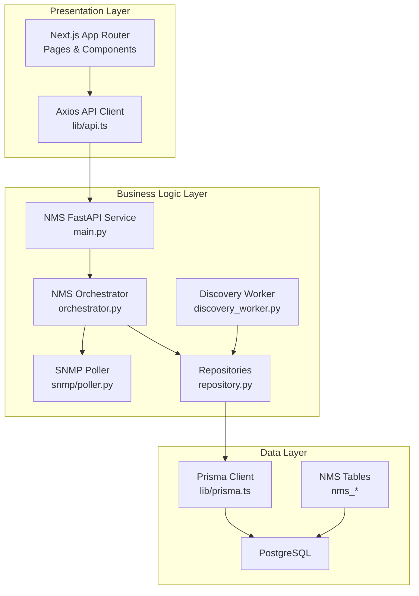
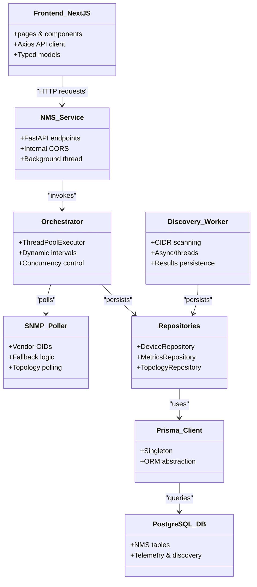
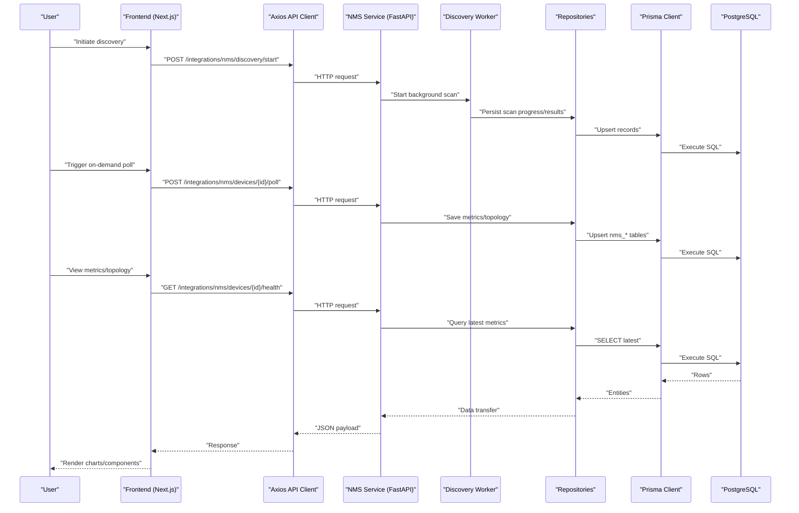
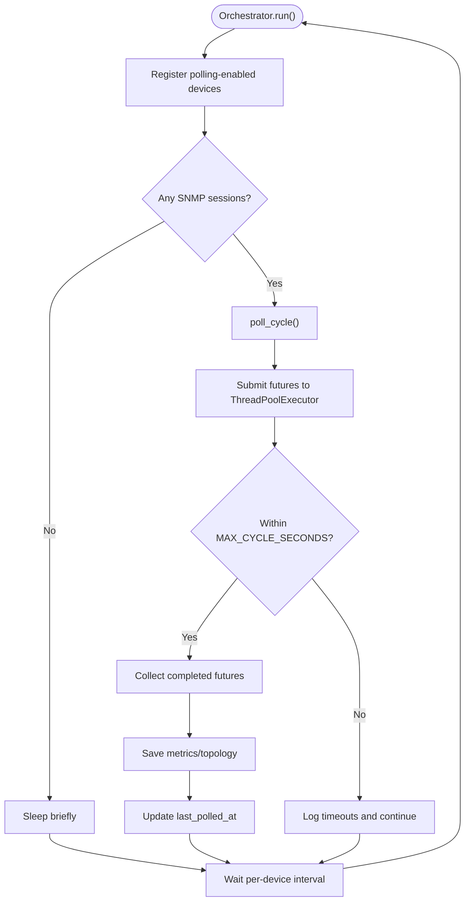
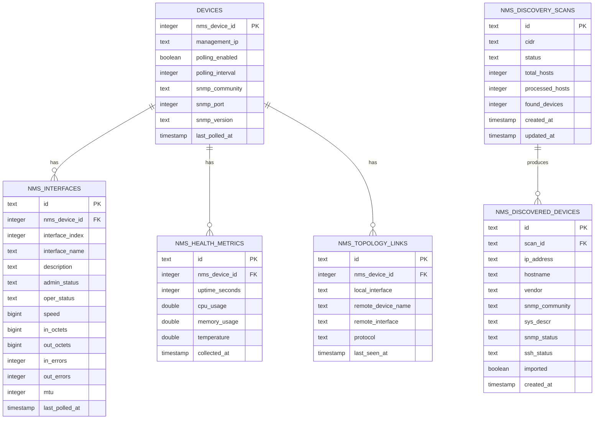
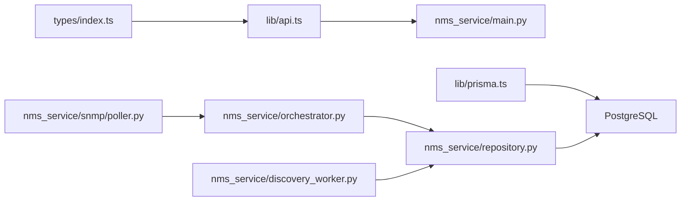

# Architecture Overview

<cite>
**Referenced Files in This Document**
- [README.md](file://README.md)
- [layout.tsx](file://app/layout.tsx)
- [api.ts](file://lib/api.ts)
- [prisma.ts](file://lib/prisma.ts)
- [types/index.ts](file://types/index.ts)
- [main.py](file://nms_service/main.py)
- [orchestrator.py](file://nms_service/orchestrator.py)
- [repository.py](file://nms_service/database/repository.py)
- [models.py](file://nms_service/core/models.py)
- [poller.py](file://nms_service/snmp/poller.py)
- [discovery_worker.py](file://nms_service/discovery_worker.py)
- [20260331134657_add_nms_integration/migration.sql](file://prisma/migrations/20260331134657_add_nms_integration/migration.sql)
- [20260413062959_add_nms_migration_tables/migration.sql](file://prisma/migrations/20260413062959_add_nms_migration_tables/migration.sql)
</cite>

## Table of Contents
1. [Introduction](#introduction)
2. [Project Structure](#project-structure)
3. [Core Components](#core-components)
4. [Architecture Overview](#architecture-overview)
5. [Detailed Component Analysis](#detailed-component-analysis)
6. [Dependency Analysis](#dependency-analysis)
7. [Performance Considerations](#performance-considerations)
8. [Troubleshooting Guide](#troubleshooting-guide)
9. [Conclusion](#conclusion)

## Introduction
This document presents the InfraScope architecture overview, focusing on the high-level system design and component relationships. InfraScope is a production-ready platform for centralized enterprise infrastructure management, integrating a frontend built with Next.js and a Python-based NMS service for device discovery, SNMP/SSH polling, and real-time metrics ingestion. The system follows a clean architecture pattern with clear separation between presentation, business logic, and data layers. It employs a microservices approach with the NMS service acting as a dedicated sidecar for telemetry and discovery, and an event-driven design for real-time updates. The data flow spans from device discovery and SNMP polling to database storage and frontend visualization.

## Project Structure
InfraScope is organized into distinct layers and modules:
- Presentation layer: Next.js App Router pages and components
- Business logic layer: NMS orchestrator, repositories, and polling engines
- Data layer: PostgreSQL with Prisma ORM and dedicated NMS tables
- Integration points: Internal HTTP API between frontend and NMS service

**Diagram sources**
- [layout.tsx:20-56](file://app/layout.tsx#L20-L56)
- [api.ts:1-57](file://lib/api.ts#L1-L57)
- [main.py:39-483](file://nms_service/main.py#L39-L483)
- [orchestrator.py:35-461](file://nms_service/orchestrator.py#L35-L461)
- [repository.py:28-251](file://nms_service/database/repository.py#L28-L251)
- [poller.py:63-592](file://nms_service/snmp/poller.py#L63-L592)
- [discovery_worker.py:128-262](file://nms_service/discovery_worker.py#L128-L262)
- [prisma.ts:6-21](file://lib/prisma.ts#L6-L21)
- [20260331134657_add_nms_integration/migration.sql:19-405](file://prisma/migrations/20260331134657_add_nms_integration/migration.sql#L19-L405)
- [20260413062959_add_nms_migration_tables/migration.sql:1-79](file://prisma/migrations/20260413062959_add_nms_migration_tables/migration.sql#L1-L79)

**Section sources**
- [README.md:114-172](file://README.md#L114-L172)
- [layout.tsx:20-56](file://app/layout.tsx#L20-L56)
- [api.ts:1-57](file://lib/api.ts#L1-L57)
- [prisma.ts:6-21](file://lib/prisma.ts#L6-L21)
- [main.py:39-483](file://nms_service/main.py#L39-L483)
- [orchestrator.py:35-461](file://nms_service/orchestrator.py#L35-L461)
- [repository.py:28-251](file://nms_service/database/repository.py#L28-L251)
- [poller.py:63-592](file://nms_service/snmp/poller.py#L63-L592)
- [discovery_worker.py:128-262](file://nms_service/discovery_worker.py#L128-L262)
- [20260331134657_add_nms_integration/migration.sql:19-405](file://prisma/migrations/20260331134657_add_nms_integration/migration.sql#L19-L405)
- [20260413062959_add_nms_migration_tables/migration.sql:1-79](file://prisma/migrations/20260413062959_add_nms_migration_tables/migration.sql#L1-L79)

## Core Components
- Frontend (Next.js): Provides pages, routing, and UI components. It communicates with the backend via a typed API client and consumes Prisma-generated types.
- NMS Service (FastAPI): Exposes internal endpoints for device polling, discovery, backups, and topology retrieval. It runs a continuous orchestration loop and maintains a background thread for SNMP polling.
- Orchestrator: Manages device registration, dynamic polling intervals, concurrency via ThreadPoolExecutor, and persistence of metrics and topology.
- Repositories: Encapsulate database operations for NMS entities (interfaces, health metrics, topology, discovery scans).
- SNMP Poller: Performs SNMP queries for interfaces, health, inventory, and topology, with vendor-specific OIDs and fallbacks.
- Discovery Worker: Scans CIDR ranges asynchronously, probing hosts via SNMP and SSH, and persists results to discovery tables.
- Database: PostgreSQL with Prisma ORM and dedicated NMS tables for telemetry and discovery.

**Section sources**
- [README.md:114-172](file://README.md#L114-L172)
- [layout.tsx:20-56](file://app/layout.tsx#L20-L56)
- [api.ts:1-57](file://lib/api.ts#L1-L57)
- [types/index.ts:1-312](file://types/index.ts#L1-L312)
- [prisma.ts:6-21](file://lib/prisma.ts#L6-L21)
- [main.py:39-483](file://nms_service/main.py#L39-L483)
- [orchestrator.py:35-461](file://nms_service/orchestrator.py#L35-L461)
- [repository.py:28-251](file://nms_service/database/repository.py#L28-L251)
- [models.py:36-136](file://nms_service/core/models.py#L36-L136)
- [poller.py:63-592](file://nms_service/snmp/poller.py#L63-L592)
- [discovery_worker.py:128-262](file://nms_service/discovery_worker.py#L128-L262)
- [20260331134657_add_nms_integration/migration.sql:19-405](file://prisma/migrations/20260331134657_add_nms_integration/migration.sql#L19-L405)
- [20260413062959_add_nms_migration_tables/migration.sql:1-79](file://prisma/migrations/20260413062959_add_nms_migration_tables/migration.sql#L1-L79)

## Architecture Overview
InfraScope adopts a clean architecture with three primary layers:
- Presentation: Next.js pages and components consume typed data models and communicate via a unified API client.
- Business Logic: NMS orchestrator coordinates polling, discovery, and persistence. It encapsulates domain logic and manages concurrency and scheduling.
- Data: Prisma ORM abstracts database operations, with dedicated NMS tables for telemetry and discovery.

The system uses a microservices approach:
- The NMS service is a separate internal component that the frontend calls to manage device telemetry and discovery.
- The frontend remains stateless and relies on the NMS service for background tasks and data ingestion.

Event-driven updates:
- The NMS service continuously polls devices and writes metrics to the database.
- The frontend can query the NMS endpoints for latest metrics and topology, enabling near real-time visualization.

System boundaries and integration points:
- Internal boundary: NMS service is exposed internally (CORS configured for localhost and web container).
- External integration: SNMP and SSH protocols for device polling; discovery worker integrates with network scanning.

Scalability considerations:
- Concurrency: ThreadPoolExecutor enables parallel polling across devices.
- Dynamic intervals: Adjusts polling cadence based on outcomes to balance load and responsiveness.
- Asynchronous discovery: CIDR scanning leverages asyncio and thread pools for throughput.

Design principles:
- SOLID: Single responsibility in repositories, clear separation between poller and orchestrator, and cohesive modules.
- Separation of concerns: Presentation, business logic, and data layers are decoupled.
- Maintainability: Centralized types, Prisma client singleton, and consistent API response format.

**Section sources**
- [README.md:234-254](file://README.md#L234-L254)
- [main.py:45-51](file://nms_service/main.py#L45-L51)
- [orchestrator.py:35-71](file://nms_service/orchestrator.py#L35-L71)
- [repository.py:28-63](file://nms_service/database/repository.py#L28-L63)
- [poller.py:63-70](file://nms_service/snmp/poller.py#L63-L70)
- [discovery_worker.py:137-138](file://nms_service/discovery_worker.py#L137-L138)

## Detailed Component Analysis

### Clean Architecture Layers and Component Relationships

**Diagram sources**
- [layout.tsx:20-56](file://app/layout.tsx#L20-L56)
- [api.ts:1-57](file://lib/api.ts#L1-L57)
- [types/index.ts:1-312](file://types/index.ts#L1-L312)
- [main.py:39-483](file://nms_service/main.py#L39-L483)
- [orchestrator.py:35-461](file://nms_service/orchestrator.py#L35-L461)
- [repository.py:28-251](file://nms_service/database/repository.py#L28-L251)
- [poller.py:63-592](file://nms_service/snmp/poller.py#L63-L592)
- [discovery_worker.py:128-262](file://nms_service/discovery_worker.py#L128-L262)
- [prisma.ts:6-21](file://lib/prisma.ts#L6-L21)
- [20260331134657_add_nms_integration/migration.sql:19-405](file://prisma/migrations/20260331134657_add_nms_integration/migration.sql#L19-L405)

**Section sources**
- [README.md:114-172](file://README.md#L114-L172)
- [layout.tsx:20-56](file://app/layout.tsx#L20-L56)
- [api.ts:1-57](file://lib/api.ts#L1-L57)
- [types/index.ts:1-312](file://types/index.ts#L1-L312)
- [prisma.ts:6-21](file://lib/prisma.ts#L6-L21)
- [main.py:39-483](file://nms_service/main.py#L39-L483)
- [orchestrator.py:35-461](file://nms_service/orchestrator.py#L35-L461)
- [repository.py:28-251](file://nms_service/database/repository.py#L28-L251)
- [poller.py:63-592](file://nms_service/snmp/poller.py#L63-L592)
- [discovery_worker.py:128-262](file://nms_service/discovery_worker.py#L128-L262)
- [20260331134657_add_nms_integration/migration.sql:19-405](file://prisma/migrations/20260331134657_add_nms_integration/migration.sql#L19-L405)

### Data Flow: Discovery, Polling, Storage, and Visualization

**Diagram sources**
- [main.py:328-442](file://nms_service/main.py#L328-L442)
- [discovery_worker.py:128-243](file://nms_service/discovery_worker.py#L128-L243)
- [repository.py:65-200](file://nms_service/database/repository.py#L65-L200)
- [prisma.ts:6-21](file://lib/prisma.ts#L6-L21)
- [20260331134657_add_nms_integration/migration.sql:200-281](file://prisma/migrations/20260331134657_add_nms_integration/migration.sql#L200-L281)

**Section sources**
- [main.py:328-442](file://nms_service/main.py#L328-L442)
- [discovery_worker.py:128-243](file://nms_service/discovery_worker.py#L128-L243)
- [repository.py:65-200](file://nms_service/database/repository.py#L65-L200)
- [prisma.ts:6-21](file://lib/prisma.ts#L6-L21)
- [20260331134657_add_nms_integration/migration.sql:200-281](file://prisma/migrations/20260331134657_add_nms_integration/migration.sql#L200-L281)

### Polling Cycle and Concurrency

**Diagram sources**
- [orchestrator.py:407-431](file://nms_service/orchestrator.py#L407-L431)
- [orchestrator.py:355-406](file://nms_service/orchestrator.py#L355-L406)

**Section sources**
- [orchestrator.py:407-431](file://nms_service/orchestrator.py#L407-L431)
- [orchestrator.py:355-406](file://nms_service/orchestrator.py#L355-L406)

### Database Schema for NMS Telemetry and Discovery

**Diagram sources**
- [20260331134657_add_nms_integration/migration.sql:19-405](file://prisma/migrations/20260331134657_add_nms_integration/migration.sql#L19-L405)
- [20260413062959_add_nms_migration_tables/migration.sql:1-79](file://prisma/migrations/20260413062959_add_nms_migration_tables/migration.sql#L1-L79)

**Section sources**
- [20260331134657_add_nms_integration/migration.sql:19-405](file://prisma/migrations/20260331134657_add_nms_integration/migration.sql#L19-L405)
- [20260413062959_add_nms_migration_tables/migration.sql:1-79](file://prisma/migrations/20260413062959_add_nms_migration_tables/migration.sql#L1-L79)

## Dependency Analysis
- Frontend depends on:
  - Axios API client for HTTP communication
  - Prisma client singleton for database access
  - Centralized TypeScript types for strong typing
- NMS Service depends on:
  - SQLAlchemy for database operations
  - Pydantic for request/response models
  - SNMP and SSH pollers for device data acquisition
- Repositories depend on:
  - SQLAlchemy sessions and raw SQL for efficient persistence
- Database depends on:
  - Prisma client and PostgreSQL for schema enforcement and indexing

**Diagram sources**
- [api.ts:1-57](file://lib/api.ts#L1-L57)
- [prisma.ts:6-21](file://lib/prisma.ts#L6-L21)
- [types/index.ts:1-312](file://types/index.ts#L1-L312)
- [main.py:39-483](file://nms_service/main.py#L39-L483)
- [orchestrator.py:35-461](file://nms_service/orchestrator.py#L35-L461)
- [repository.py:28-251](file://nms_service/database/repository.py#L28-L251)
- [poller.py:63-592](file://nms_service/snmp/poller.py#L63-L592)
- [discovery_worker.py:128-262](file://nms_service/discovery_worker.py#L128-L262)

**Section sources**
- [api.ts:1-57](file://lib/api.ts#L1-L57)
- [prisma.ts:6-21](file://lib/prisma.ts#L6-L21)
- [types/index.ts:1-312](file://types/index.ts#L1-L312)
- [main.py:39-483](file://nms_service/main.py#L39-L483)
- [orchestrator.py:35-461](file://nms_service/orchestrator.py#L35-L461)
- [repository.py:28-251](file://nms_service/database/repository.py#L28-L251)
- [poller.py:63-592](file://nms_service/snmp/poller.py#L63-L592)
- [discovery_worker.py:128-262](file://nms_service/discovery_worker.py#L128-L262)

## Performance Considerations
- Concurrency: ThreadPoolExecutor enables parallel polling across devices, reducing cycle time and improving throughput.
- Dynamic intervals: Adjusts polling cadence based on device status to balance load and responsiveness.
- Asynchronous discovery: CIDR scanning uses asyncio and thread pools to maximize host probing rate.
- Database efficiency: Upserts with conflict handling reduce duplicate writes; indexes on frequently queried columns improve query performance.
- Prisma logging: Query logging disabled by default to minimize I/O overhead; can be toggled for diagnostics.

[No sources needed since this section provides general guidance]

## Troubleshooting Guide
- Frontend API failures: Inspect Axios error handling and ensure API base URL and environment variables are correctly configured.
- Database connectivity: Verify Prisma client initialization and connection string; regenerate client if schema changes.
- NMS service health: Use the health endpoint to confirm the background thread is alive and registered devices are present.
- Polling timeouts: Review orchestrator logs for timed-out devices and adjust thread pool sizes or polling intervals.
- Discovery progress: Poll the discovery endpoint to track scan status and inspect error messages.

**Section sources**
- [api.ts:10-56](file://lib/api.ts#L10-L56)
- [prisma.ts:12-16](file://lib/prisma.ts#L12-L16)
- [main.py:91-98](file://nms_service/main.py#L91-L98)
- [orchestrator.py:390-397](file://nms_service/orchestrator.py#L390-L397)
- [main.py:376-403](file://nms_service/main.py#L376-L403)

## Conclusion
InfraScope’s architecture cleanly separates presentation, business logic, and data layers while leveraging a microservices approach with the NMS service for telemetry and discovery. The system’s event-driven design and real-time data ingestion enable responsive frontend visualization. Clean architecture, SOLID principles, and modular components contribute to maintainability and scalability. The documented data flow and component interactions provide a foundation for both stakeholder understanding and developer implementation.