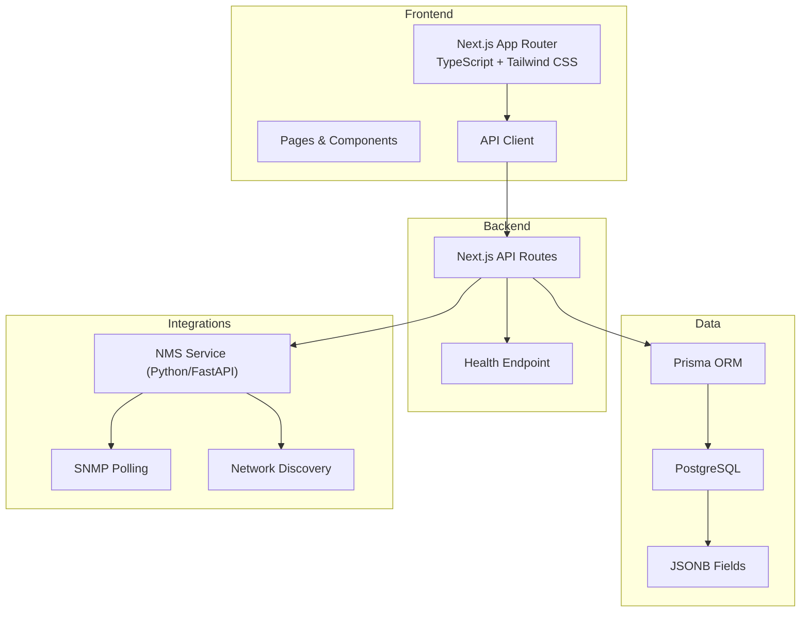
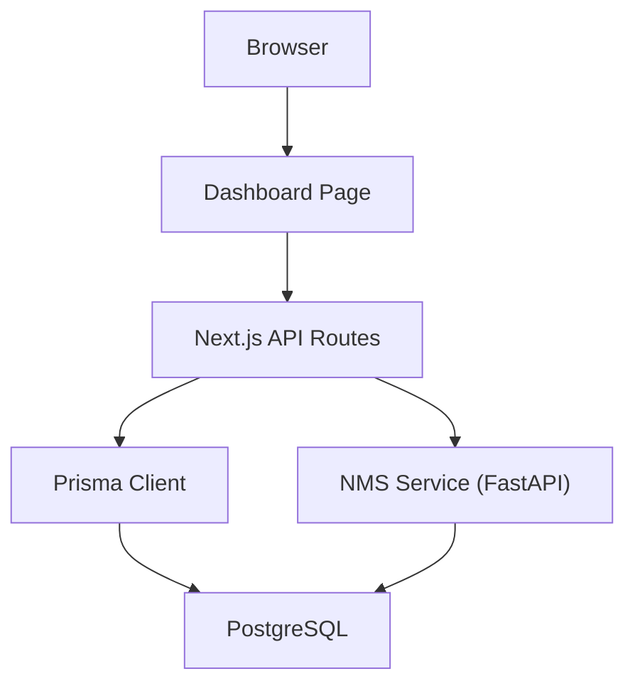
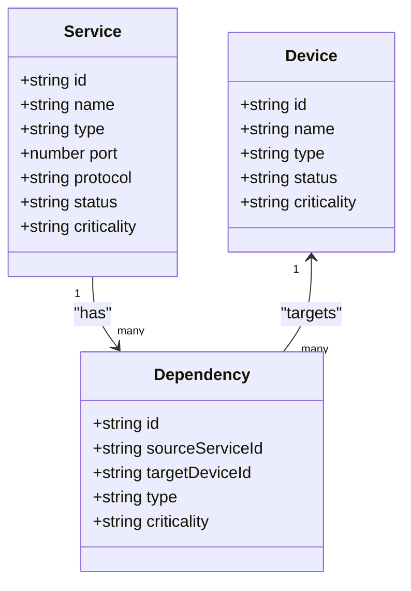
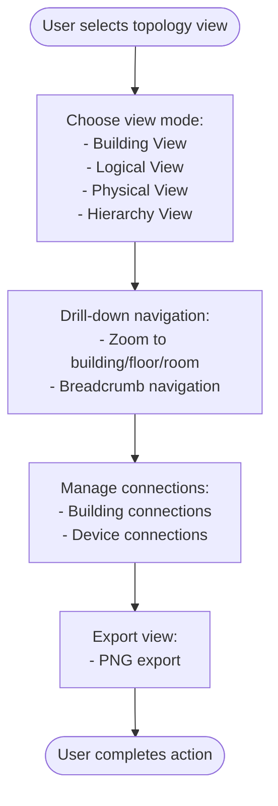
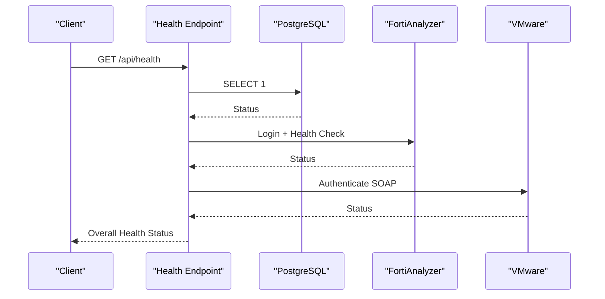
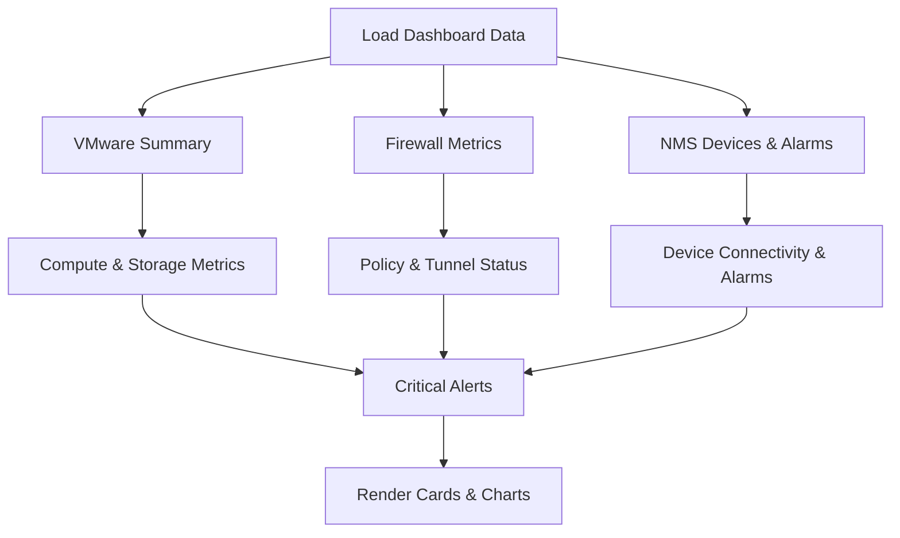
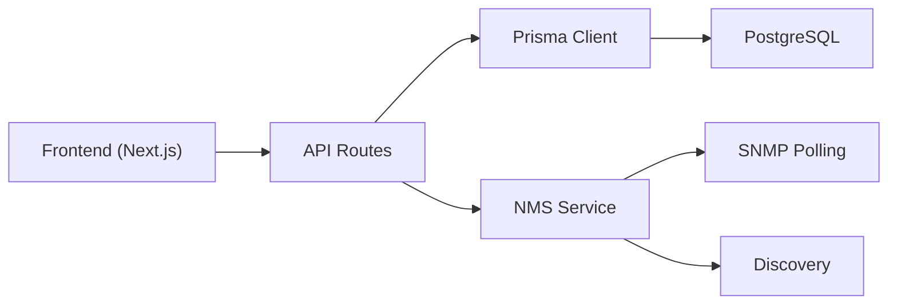

# Introduction and Purpose

<cite>
**Referenced Files in This Document**
- [README.md](file://README.md)
- [PROJECT_SUMMARY.md](file://PROJECT_SUMMARY.md)
- [ARCHITECTURE.md](file://ARCHITECTURE.md)
- [QUICK_START.md](file://QUICK_START.md)
- [types/index.ts](file://types/index.ts)
- [lib/prisma.ts](file://lib/prisma.ts)
- [lib/api.ts](file://lib/api.ts)
- [app/layout.tsx](file://app/layout.tsx)
- [app/dashboard/page.tsx](file://app/dashboard/page.tsx)
- [app/api/health/route.ts](file://app/api/health/route.ts)
- [docs/network-topology-guide.md](file://docs/network-topology-guide.md)
- [nms_service/main.py](file://nms_service/main.py)
- [nms_service/core/models.py](file://nms_service/core/models.py)
- [prisma/schema.prisma](file://prisma/schema.prisma)
</cite>

## Table of Contents
1. [Introduction](#introduction)
2. [Project Structure](#project-structure)
3. [Core Components](#core-components)
4. [Architecture Overview](#architecture-overview)
5. [Detailed Component Analysis](#detailed-component-analysis)
6. [Dependency Analysis](#dependency-analysis)
7. [Performance Considerations](#performance-considerations)
8. [Troubleshooting Guide](#troubleshooting-guide)
9. [Conclusion](#conclusion)

## Introduction
InfraScope is a production-ready, enterprise infrastructure management platform designed to centralize visibility and control over physical infrastructure, device inventory, network topology, and service dependencies. Its mission is to eliminate blind spots in complex IT environments by providing a unified CMDB-backed system that connects physical assets, logical services, and network relationships. This enables stakeholders to make informed decisions around capacity planning, incident response, and service impact analysis while delivering a robust foundation for advanced analytics and integrations.

Why InfraScope was created:
- To solve the lack of centralized infrastructure visibility across distributed enterprises
- To unify device inventory, network topology, and service dependency mapping into a single source of truth
- To enable proactive operations through dependency analysis and topology visualization
- To serve as a production-grade platform with enterprise-grade features and extensibility

Target audience:
- IT managers who need executive dashboards and capacity insights
- Network administrators who require topology visualization and impact analysis
- Infrastructure teams responsible for device lifecycle and physical asset management
- Security and compliance professionals needing audit trails and risk tracking

Core value proposition:
- Business: Reduce downtime, optimize capacity, accelerate incident response, and improve service reliability through centralized CMDB and topology visualization
- Technical: Provide a scalable, type-safe, modular architecture with integrated integrations, health monitoring, and extensible data models

Common scenarios:
- Capacity planning: Using device and service data to forecast growth and allocate resources
- Incident response: Leveraging dependency analysis to isolate affected services and devices during outages
- Service impact analysis: Understanding how device failures propagate through services and applications

Positioning:
- Production-ready with enterprise-grade features including type safety, modular architecture, and comprehensive documentation
- Built on a modern stack with Next.js, TypeScript, PostgreSQL, and Prisma, ensuring maintainability and scalability

**Section sources**
- [README.md:1-100](file://README.md#L1-L100)
- [PROJECT_SUMMARY.md:1-50](file://PROJECT_SUMMARY.md#L1-L50)
- [ARCHITECTURE.md:1-30](file://ARCHITECTURE.md#L1-L30)

## Project Structure
InfraScope organizes functionality into clear layers:
- Frontend: Next.js App Router with TypeScript, Tailwind CSS, and React components
- Backend: Next.js API routes for REST endpoints
- Data Layer: PostgreSQL with Prisma ORM and JSONB for extensibility
- Integrations: Internal NMS service for SNMP polling and discovery, plus third-party integrations

**Diagram sources**
- [ARCHITECTURE.md:28-103](file://ARCHITECTURE.md#L28-L103)
- [lib/prisma.ts:1-21](file://lib/prisma.ts#L1-L21)
- [nms_service/main.py:1-120](file://nms_service/main.py#L1-L120)

**Section sources**
- [ARCHITECTURE.md:28-103](file://ARCHITECTURE.md#L28-L103)
- [QUICK_START.md:116-139](file://QUICK_START.md#L116-L139)

## Core Components
InfraScope’s core capabilities align with enterprise infrastructure management needs:

- Infrastructure Management
  - Hierarchical organization: Org → Building → Floor → Room → Rack → Unit
  - Rack visualization with U-position management
  - Device placement and capacity planning
  - Physical location tracking

- Device Inventory
  - Support for 12+ device types (servers, switches, firewalls, workstations, storage)
  - Comprehensive device attributes (vendor, model, serial, firmware, OS)
  - Device relationships (parent-child for VMs on hosts)
  - Status tracking and criticality levels
  - Extensible metadata via JSONB

- Network Management
  - Network interface inventory
  - Switch port configuration
  - VLAN and trunk configuration
  - Network connection mapping
  - Topology visualization
  - Bandwidth and status monitoring

- Service Tracking
  - Application and service inventory
  - Service-to-device mapping
  - Port and protocol tracking
  - Service status monitoring
  - Criticality level assignment
  - Dependency relationships

- Dependency Management
  - Service dependency modeling (CMDB)
  - Impact analysis (what breaks if X fails)
  - Criticality tracking
  - Relationship visualization
  - Chain analysis

- Dashboard & Reporting
  - Key metrics overview
  - Recent activity feed
  - Device and service statistics
  - Health indicators
  - Quick action links

These components collectively address centralized infrastructure visibility, device inventory management, and network topology understanding—core pillars of enterprise infrastructure operations.

**Section sources**
- [README.md:19-63](file://README.md#L19-L63)
- [PROJECT_SUMMARY.md:18-40](file://PROJECT_SUMMARY.md#L18-L40)
- [ARCHITECTURE.md:170-207](file://ARCHITECTURE.md#L170-L207)

## Architecture Overview
InfraScope’s architecture emphasizes separation of concerns, type safety, and scalability:

- Frontend: Next.js with TypeScript and Tailwind CSS for responsive UI
- Backend: RESTful API routes with consistent response formats
- Database: PostgreSQL with Prisma ORM and JSONB for extensibility
- Integrations: Internal NMS service for SNMP polling and discovery, enabling real-world device data ingestion

**Diagram sources**
- [ARCHITECTURE.md:7-27](file://ARCHITECTURE.md#L7-L27)
- [lib/prisma.ts:1-21](file://lib/prisma.ts#L1-L21)
- [nms_service/main.py:1-120](file://nms_service/main.py#L1-L120)

**Section sources**
- [ARCHITECTURE.md:7-27](file://ARCHITECTURE.md#L7-L27)
- [app/layout.tsx:10-18](file://app/layout.tsx#L10-L18)

## Detailed Component Analysis

### CMDB and Dependency Management
InfraScope models a comprehensive CMDB with service dependencies, enabling impact analysis and criticality tracking. The type system defines dependency types and criticality levels, while the database schema enforces relationships and integrity.

**Diagram sources**
- [types/index.ts:254-293](file://types/index.ts#L254-L293)
- [prisma/schema.prisma:344-387](file://prisma/schema.prisma#L344-L387)

**Section sources**
- [types/index.ts:274-293](file://types/index.ts#L274-L293)
- [prisma/schema.prisma:370-387](file://prisma/schema.prisma#L370-L387)

### Topology Visualization and Network Management
The platform provides topology visualization and network management capabilities, including building connections, device connections, and logical views. The network topology guide documents view modes and drill-down navigation.

**Diagram sources**
- [docs/network-topology-guide.md:8-41](file://docs/network-topology-guide.md#L8-L41)

**Section sources**
- [docs/network-topology-guide.md:1-52](file://docs/network-topology-guide.md#L1-L52)

### Health Monitoring and Integration Orchestration
The health endpoint monitors database, FortiAnalyzer, and VMware integrations, auto-starting services when needed. The NMS service orchestrates SNMP polling and discovery, exposing metrics and topology data to the platform.

**Diagram sources**
- [app/api/health/route.ts:204-254](file://app/api/health/route.ts#L204-L254)

**Section sources**
- [app/api/health/route.ts:14-254](file://app/api/health/route.ts#L14-L254)
- [nms_service/main.py:1-120](file://nms_service/main.py#L1-L120)
- [nms_service/core/models.py:1-136](file://nms_service/core/models.py#L1-L136)

### Dashboard and Operational Insights
The dashboard aggregates key metrics from virtualization, security, and network monitoring, enabling quick situational awareness and actionable insights.

**Diagram sources**
- [app/dashboard/page.tsx:127-222](file://app/dashboard/page.tsx#L127-L222)

**Section sources**
- [app/dashboard/page.tsx:101-732](file://app/dashboard/page.tsx#L101-L732)

## Dependency Analysis
InfraScope’s dependencies reflect a cohesive, layered design:

- Frontend depends on:
  - Next.js for routing and SSR
  - TypeScript for type safety
  - Tailwind CSS for styling
  - Axios for API communication
- Backend depends on:
  - Next.js API routes
  - Prisma for database operations
  - Environment configuration for secrets and endpoints
- Database depends on:
  - PostgreSQL for persistence
  - JSONB for flexible metadata
  - Indexes and foreign keys for performance and integrity
- Integrations depend on:
  - NMS service for SNMP and discovery
  - External systems (FortiAnalyzer, VMware) via secure endpoints

**Diagram sources**
- [lib/api.ts:1-57](file://lib/api.ts#L1-L57)
- [lib/prisma.ts:1-21](file://lib/prisma.ts#L1-L21)
- [nms_service/main.py:1-120](file://nms_service/main.py#L1-L120)

**Section sources**
- [lib/api.ts:1-57](file://lib/api.ts#L1-L57)
- [lib/prisma.ts:1-21](file://lib/prisma.ts#L1-L21)
- [prisma/schema.prisma:1-800](file://prisma/schema.prisma#L1-L800)

## Performance Considerations
- Database: Use indexes on frequently queried fields, implement pagination for large datasets, and leverage JSONB for extensibility without sacrificing performance.
- Frontend: Implement code splitting, dynamic imports for large components, and virtual scrolling for extensive lists.
- API: Apply rate limiting, caching headers, compression, and request validation to reduce load and improve responsiveness.
- Monitoring: Track device health metrics, service availability, network statistics, and API response times to identify bottlenecks early.

[No sources needed since this section provides general guidance]

## Troubleshooting Guide
Common issues and resolutions:
- PostgreSQL connection errors: Verify database is running, check connection string in environment variables, and ensure the database exists.
- Prisma client not found: Regenerate the client or reinstall dependencies; confirm import paths are correct.
- Port already in use: Start the development server on a different port.
- TypeScript errors: Run type checking and resolve type mismatches; verify enum values and imports.

**Section sources**
- [QUICK_START.md:152-179](file://QUICK_START.md#L152-L179)

## Conclusion
InfraScope delivers a production-ready, enterprise-grade platform that centralizes infrastructure visibility, device inventory management, and network topology understanding. By combining a robust CMDB, dependency analysis, and topology visualization with a scalable architecture and comprehensive integrations, it empowers IT managers, network administrators, and infrastructure teams to plan capacity, respond to incidents, and analyze service impacts effectively. Its modular design, type safety, and extensible data model position it as a strong foundation for future enhancements and enterprise adoption.

[No sources needed since this section summarizes without analyzing specific files]