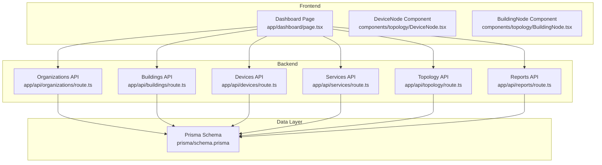
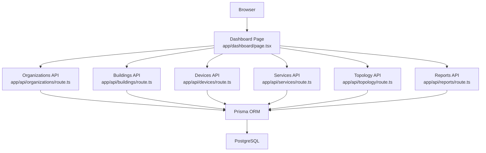
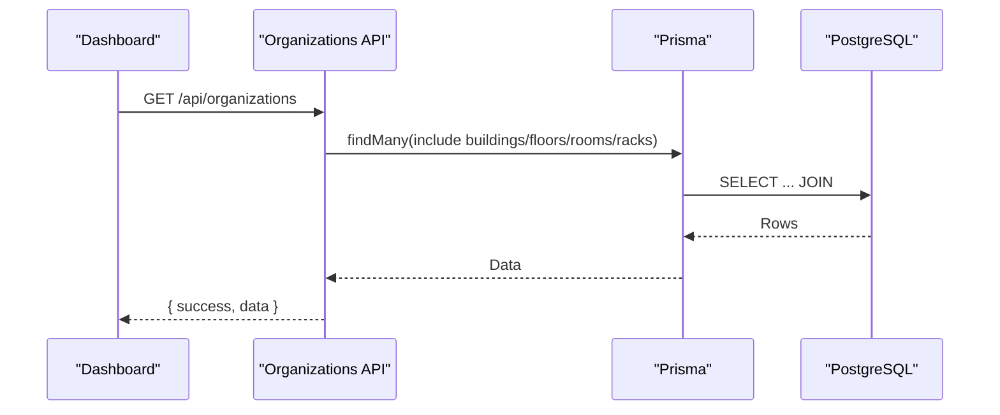
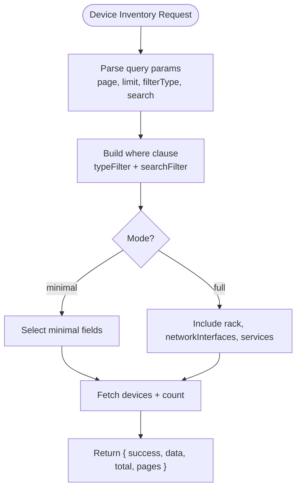
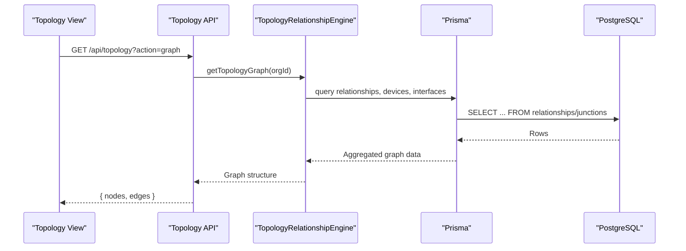
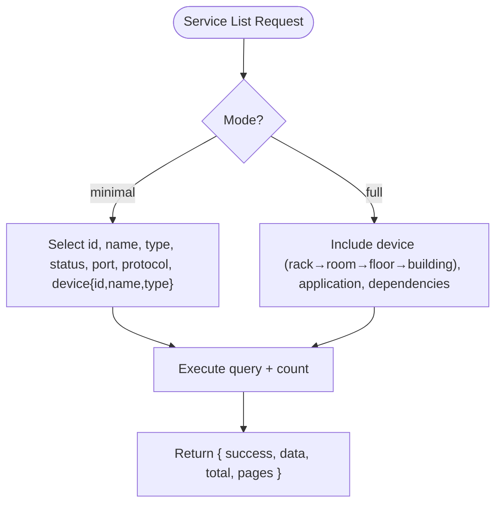
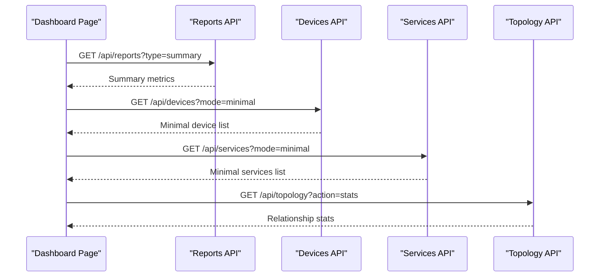
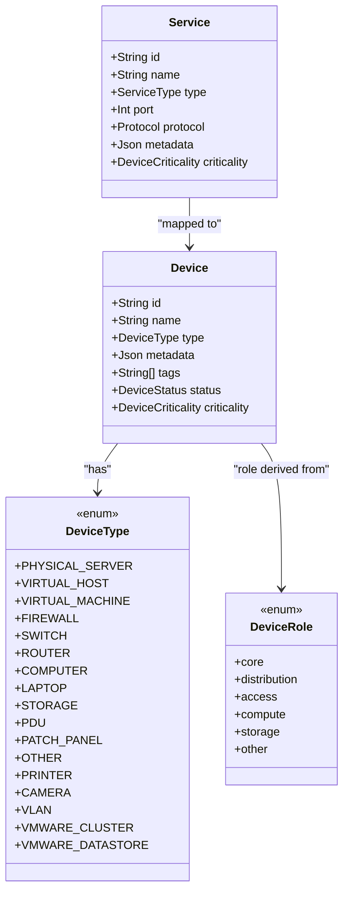
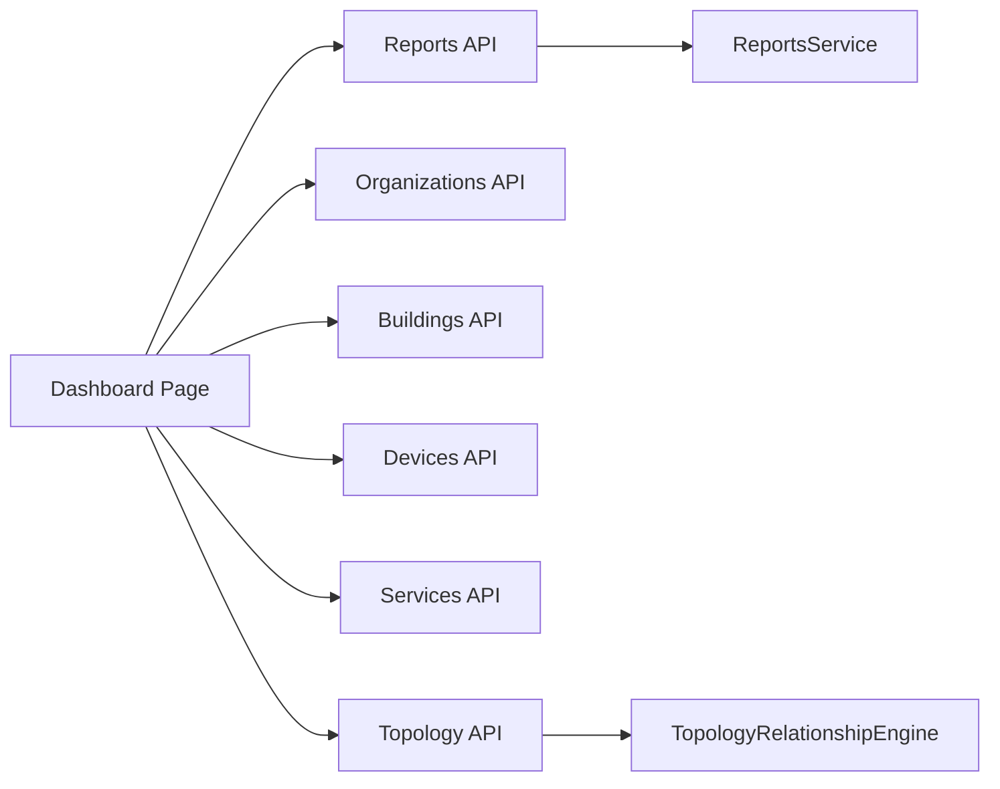

# Key Features

<cite>
**Referenced Files in This Document**
- [README.md](file://README.md)
- [docs/_archive/ARCHITECTURE.md](file://docs/_archive/ARCHITECTURE.md)
- [docs/_archive/DELIVERABLES.md](file://docs/_archive/DELIVERABLES.md)
- [app/api/organizations/route.ts](file://app/api/organizations/route.ts)
- [app/api/buildings/route.ts](file://app/api/buildings/route.ts)
- [app/api/devices/route.ts](file://app/api/devices/route.ts)
- [app/api/devices/[id]/route.ts](file://app/api/devices/[id]/route.ts)
- [app/api/services/route.ts](file://app/api/services/route.ts)
- [app/api/topology/route.ts](file://app/api/topology/route.ts)
- [lib/topology/index.ts](file://lib/topology/index.ts)
- [lib/deviceRoleMapper.ts](file://lib/deviceRoleMapper.ts)
- [components/topology/DeviceNode.tsx](file://components/topology/DeviceNode.tsx)
- [components/topology/BuildingNode.tsx](file://components/topology/BuildingNode.tsx)
- [app/dashboard/page.tsx](file://app/dashboard/page.tsx)
- [app/api/reports/route.ts](file://app/api/reports/route.ts)
- [prisma/schema.prisma](file://prisma/schema.prisma)
</cite>

## Table of Contents
1. [Introduction](#introduction)
2. [Project Structure](#project-structure)
3. [Core Components](#core-components)
4. [Architecture Overview](#architecture-overview)
5. [Detailed Component Analysis](#detailed-component-analysis)
6. [Dependency Analysis](#dependency-analysis)
7. [Performance Considerations](#performance-considerations)
8. [Troubleshooting Guide](#troubleshooting-guide)
9. [Conclusion](#conclusion)
10. [Appendices](#appendices)

## Introduction
This document presents InfraScope’s key features with a focus on practical implementation, user benefits, and technical capabilities. It covers infrastructure management with hierarchical organization, device inventory with 12+ device types, network management with topology visualization, service tracking with dependency relationships, and dashboard reporting. It also highlights extensibility features such as JSONB metadata and custom device types, and demonstrates how these features work together to deliver comprehensive infrastructure management for both operational and architectural needs.

## Project Structure
InfraScope is organized around a Next.js App Router frontend, a set of API routes implementing domain-specific endpoints, a Prisma-driven PostgreSQL schema, and reusable UI components. The structure supports modular development and clear separation of concerns across domains such as infrastructure, devices, services, topology, and reporting.

**Diagram sources**
- [app/dashboard/page.tsx:138-211](file://app/dashboard/page.tsx#L138-L211)
- [app/api/organizations/route.ts:22-64](file://app/api/organizations/route.ts#L22-L64)
- [app/api/buildings/route.ts:22-59](file://app/api/buildings/route.ts#L22-L59)
- [app/api/devices/route.ts:10-71](file://app/api/devices/route.ts#L10-L71)
- [app/api/services/route.ts:14-56](file://app/api/services/route.ts#L14-L56)
- [app/api/topology/route.ts:4-28](file://app/api/topology/route.ts#L4-L28)
- [app/api/reports/route.ts:4-36](file://app/api/reports/route.ts#L4-L36)
- [prisma/schema.prisma:11-228](file://prisma/schema.prisma#L11-L228)

**Section sources**
- [README.md:114-172](file://README.md#L114-L172)
- [docs/_archive/ARCHITECTURE.md:105-133](file://docs/_archive/ARCHITECTURE.md#L105-L133)

## Core Components
- Infrastructure Management: Hierarchical organization (Organization → Building → Floor → Room → Rack → Unit), rack visualization with U-position management, device placement, and capacity planning.
- Device Inventory: Support for 12+ device types, comprehensive attributes, parent-child relationships for VMs, status tracking, criticality levels, and extensible metadata via JSONB.
- Network Management: Network interface inventory, switch port configuration, VLAN support, inter-device connections, topology visualization, and bandwidth/status monitoring.
- Service Tracking: Application/service inventory, device-service mapping, port/protocol tracking, service status monitoring, and criticality assignment.
- Dependency Management: Service dependency modeling, impact analysis, criticality tracking, relationship visualization, and chain analysis.
- Dashboard & Reporting: Key metrics overview, recent activity, device/service statistics, health indicators, and quick action links.

**Section sources**
- [README.md:19-63](file://README.md#L19-L63)
- [docs/_archive/DELIVERABLES.md:129-171](file://docs/_archive/DELIVERABLES.md#L129-L171)

## Architecture Overview
The platform follows a layered architecture:
- Presentation: Next.js pages and components for dashboards, topology, and forms.
- API: Next.js API routes handling CRUD and specialized operations.
- Domain Services: Lightweight orchestration (e.g., topology engine, reports service).
- Persistence: PostgreSQL with Prisma ORM and JSONB for flexible metadata.

**Diagram sources**
- [app/dashboard/page.tsx:138-211](file://app/dashboard/page.tsx#L138-L211)
- [app/api/topology/route.ts:4-28](file://app/api/topology/route.ts#L4-L28)
- [app/api/reports/route.ts:4-36](file://app/api/reports/route.ts#L4-L36)
- [app/api/organizations/route.ts:22-64](file://app/api/organizations/route.ts#L22-L64)
- [app/api/buildings/route.ts:22-59](file://app/api/buildings/route.ts#L22-L59)
- [app/api/devices/route.ts:10-71](file://app/api/devices/route.ts#L10-L71)
- [app/api/services/route.ts:14-56](file://app/api/services/route.ts#L14-L56)

## Detailed Component Analysis

### Infrastructure Management
- Implementation approach:
  - Hierarchical entities: Organization, Building, Floor, Room, Rack, and RackUnit.
  - Optimized queries with selective field retrieval and caching for frequently accessed lists.
  - UI components render nested hierarchy and support expansion/collapse.
- User benefits:
  - Clear ownership and responsibility mapping across locations.
  - Efficient capacity planning and rack utilization insights.
- Technical capabilities:
  - Selective includes reduce payload sizes; caching reduces DB load.
  - Indexes on foreign keys and unique constraints ensure fast lookups.

**Diagram sources**
- [app/api/organizations/route.ts:22-64](file://app/api/organizations/route.ts#L22-L64)

**Section sources**
- [app/api/organizations/route.ts:4-88](file://app/api/organizations/route.ts#L4-L88)
- [app/api/buildings/route.ts:4-79](file://app/api/buildings/route.ts#L4-L79)
- [prisma/schema.prisma:11-149](file://prisma/schema.prisma#L11-L149)

### Device Inventory
- Implementation approach:
  - DeviceType enum defines 12+ device categories; Device model includes JSONB metadata and tags.
  - API supports filtering by manual device types, search across key fields, pagination, and minimal/full modes.
  - Parent-child relationships enable VM-to-host modeling.
- User benefits:
  - Comprehensive device catalog with searchable attributes.
  - Flexible metadata for custom fields without schema churn.
- Technical capabilities:
  - Minimal mode avoids heavy joins for dashboards; full mode loads nested relations for detail views.
  - JSONB enables extensibility for integrations and custom attributes.

**Diagram sources**
- [app/api/devices/route.ts:10-94](file://app/api/devices/route.ts#L10-L94)

**Section sources**
- [app/api/devices/route.ts:4-94](file://app/api/devices/route.ts#L4-L94)
- [app/api/devices/[id]/route.ts](file://app/api/devices/[id]/route.ts#L146-L368)
- [prisma/schema.prisma:151-228](file://prisma/schema.prisma#L151-L228)

### Network Management and Topology Visualization
- Implementation approach:
  - NetworkInterface, SwitchPort, and Connection models define network relationships.
  - Topology API delegates to a topology engine to compute graph and statistics.
  - React Flow nodes (DeviceNode, BuildingNode) render interactive topology with role-aware visuals and status indicators.
- User benefits:
  - Real-time topology with device roles and statuses.
  - Zoom and semantic controls for large-scale networks.
- Technical capabilities:
  - Role mapping and dynamic node sizing adapt visuals to zoom levels.
  - Handles building-level and device-level nodes with expandable details.

**Diagram sources**
- [app/api/topology/route.ts:4-28](file://app/api/topology/route.ts#L4-L28)
- [lib/topology/index.ts:1-3](file://lib/topology/index.ts#L1-L3)
- [components/topology/DeviceNode.tsx:22-109](file://components/topology/DeviceNode.tsx#L22-L109)
- [components/topology/BuildingNode.tsx:24-173](file://components/topology/BuildingNode.tsx#L24-L173)

**Section sources**
- [app/api/topology/route.ts:4-51](file://app/api/topology/route.ts#L4-L51)
- [lib/topology/index.ts:1-3](file://lib/topology/index.ts#L1-L3)
- [components/topology/DeviceNode.tsx:1-112](file://components/topology/DeviceNode.tsx#L1-L112)
- [components/topology/BuildingNode.tsx:1-176](file://components/topology/BuildingNode.tsx#L1-L176)
- [prisma/schema.prisma:230-295](file://prisma/schema.prisma#L230-L295)

### Service Tracking and Dependency Management
- Implementation approach:
  - Service model tracks port, protocol, and criticality; linked to Device and optional Application.
  - Dependency model connects services to target devices with typed relationships.
  - API supports minimal/full modes for efficient dashboard rendering.
- User benefits:
  - End-to-end visibility of services and their underlying devices.
  - Impact analysis and dependency chain visualization for change planning.
- Technical capabilities:
  - Minimal mode selects only essential fields for dashboards; full mode includes device hierarchy and dependencies.

**Diagram sources**
- [app/api/services/route.ts:4-75](file://app/api/services/route.ts#L4-L75)

**Section sources**
- [app/api/services/route.ts:4-122](file://app/api/services/route.ts#L4-L122)
- [prisma/schema.prisma:328-387](file://prisma/schema.prisma#L328-L387)

### Dashboard Reporting
- Implementation approach:
  - Dashboard aggregates data from multiple integrations and internal endpoints.
  - Reports API supports multiple report types (inventory, capacity, VMware, integration, alerts, summary).
  - UI composes widgets from multiple fetches, with loading states and error handling.
- User benefits:
  - Single-pane-of-glass for critical infrastructure metrics.
  - Quick access to VMware, firewall, NMS, and security insights.
- Technical capabilities:
  - Parallel fetches improve responsiveness; reachability flags indicate integration health.

**Diagram sources**
- [app/dashboard/page.tsx:138-211](file://app/dashboard/page.tsx#L138-L211)
- [app/api/reports/route.ts:4-36](file://app/api/reports/route.ts#L4-L36)
- [app/api/devices/route.ts:41-71](file://app/api/devices/route.ts#L41-L71)
- [app/api/services/route.ts:10-27](file://app/api/services/route.ts#L10-L27)
- [app/api/topology/route.ts:15-18](file://app/api/topology/route.ts#L15-L18)

**Section sources**
- [app/dashboard/page.tsx:101-732](file://app/dashboard/page.tsx#L101-L732)
- [app/api/reports/route.ts:4-45](file://app/api/reports/route.ts#L4-L45)

### Extensibility: JSONB Metadata and Custom Device Types
- JSONB metadata:
  - Device and Service models include JSONB fields for flexible attributes and integration-specific data.
  - Device metadata supports custom tags and per-integration identifiers.
- Custom device types:
  - DeviceType enum enumerates 12+ categories; manual device types are filtered for inventory listings.
  - DeviceRoleMapper assigns roles (core, distribution, access, compute, storage, other) for topology visualization and layout weighting.

**Diagram sources**
- [prisma/schema.prisma:151-228](file://prisma/schema.prisma#L151-L228)
- [prisma/schema.prisma:328-368](file://prisma/schema.prisma#L328-L368)
- [prisma/schema.prisma:437-455](file://prisma/schema.prisma#L437-L455)
- [lib/deviceRoleMapper.ts:1-35](file://lib/deviceRoleMapper.ts#L1-L35)

**Section sources**
- [prisma/schema.prisma:171-172](file://prisma/schema.prisma#L171-L172)
- [prisma/schema.prisma](file://prisma/schema.prisma#L359)
- [app/api/devices/route.ts:5-8](file://app/api/devices/route.ts#L5-L8)
- [lib/deviceRoleMapper.ts:3-22](file://lib/deviceRoleMapper.ts#L3-L22)

## Dependency Analysis
- API routes depend on Prisma for data access and on lightweight domain services for specialized logic.
- Topology API depends on a topology engine that encapsulates relationship computation.
- Dashboard composes data from multiple endpoints and integrates with UI components.

**Diagram sources**
- [app/dashboard/page.tsx:138-211](file://app/dashboard/page.tsx#L138-L211)
- [app/api/topology/route.ts:4-28](file://app/api/topology/route.ts#L4-L28)
- [lib/topology/index.ts:1-3](file://lib/topology/index.ts#L1-L3)

**Section sources**
- [app/dashboard/page.tsx:138-211](file://app/dashboard/page.tsx#L138-L211)
- [app/api/topology/route.ts:4-28](file://app/api/topology/route.ts#L4-L28)

## Performance Considerations
- Caching: Organization and Building endpoints cache results to reduce database load.
- Selective queries: Minimal modes avoid heavy joins for dashboards; full modes load nested relations for detail pages.
- Pagination and limits: Device and Service listings enforce page size caps to control payload sizes.
- Parallelization: Dashboard performs concurrent fetches to minimize perceived latency.

**Section sources**
- [app/api/organizations/route.ts:4-20](file://app/api/organizations/route.ts#L4-L20)
- [app/api/buildings/route.ts:4-20](file://app/api/buildings/route.ts#L4-L20)
- [app/api/devices/route.ts:13-14](file://app/api/devices/route.ts#L13-L14)
- [app/api/services/route.ts:7-8](file://app/api/services/route.ts#L7-L8)
- [app/dashboard/page.tsx:138-161](file://app/dashboard/page.tsx#L138-L161)

## Troubleshooting Guide
- API response format: All endpoints return a consistent envelope with success, data/error, and timestamp.
- Error handling: API routes catch exceptions and return structured error responses.
- Dashboard integration health: Reachability flags indicate whether external systems (e.g., NMS) are reachable.

**Section sources**
- [README.md:288-307](file://README.md#L288-L307)
- [app/api/devices/route.ts:82-93](file://app/api/devices/route.ts#L82-L93)
- [app/api/services/route.ts:67-74](file://app/api/services/route.ts#L67-L74)
- [app/dashboard/page.tsx:138-161](file://app/dashboard/page.tsx#L138-L161)

## Conclusion
InfraScope delivers a cohesive platform for infrastructure management through:
- A hierarchical, location-centric model for physical assets.
- A rich device inventory with extensible metadata and 12+ device types.
- Network topology visualization powered by relationship engines and interactive nodes.
- Service tracking with dependency modeling for impact analysis.
- A dashboard that synthesizes data from multiple sources for rapid situational awareness.

These capabilities combine operational excellence with strong technical foundations, enabling both IT teams and system architects to manage complex infrastructures effectively.

## Appendices
- Practical example: Use the dashboard to monitor VMware and firewall metrics, drill into device/service lists with minimal/full modes, and visualize topology with role-aware nodes. Combine inventory and dependency reports to assess risk and plan changes.

[No sources needed since this section provides general guidance]