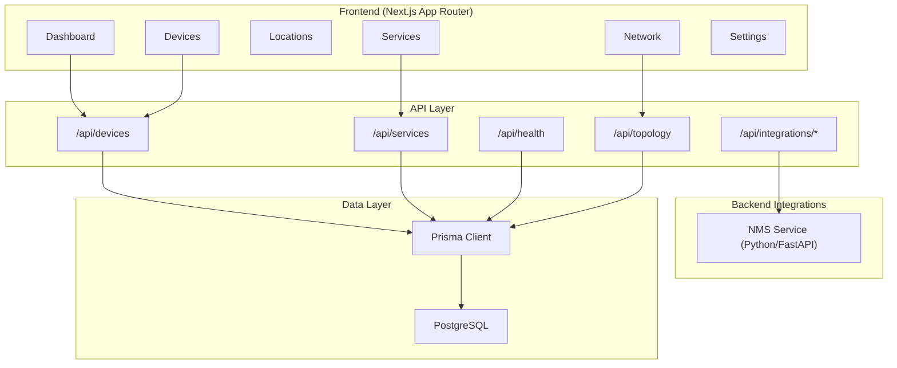
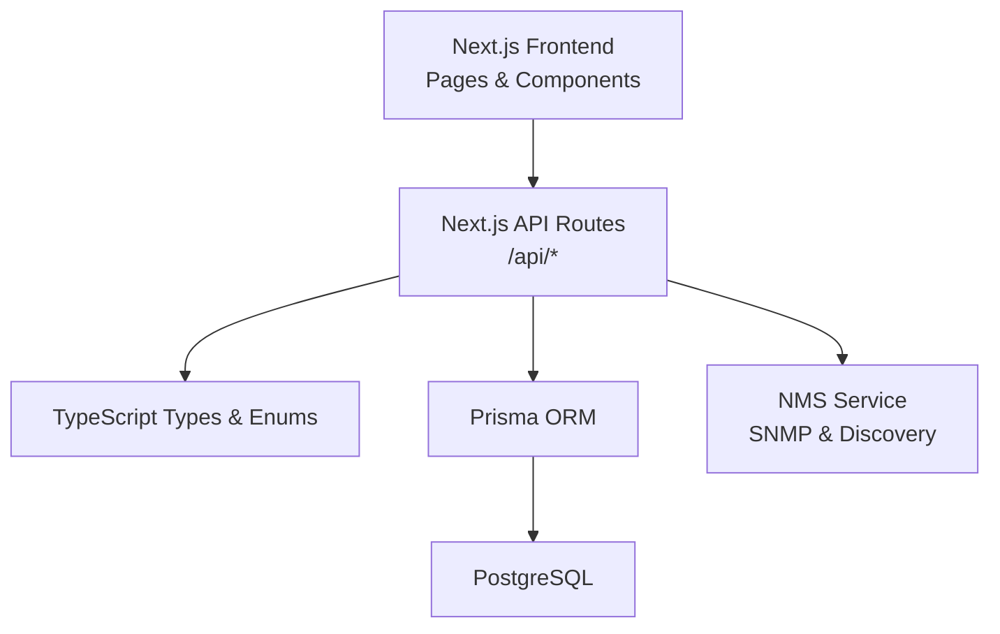
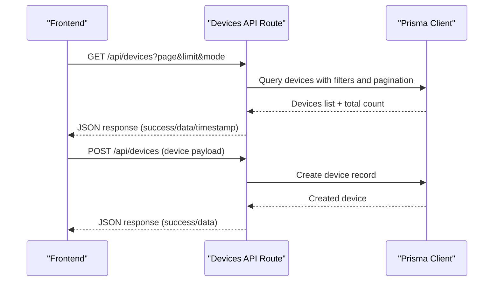
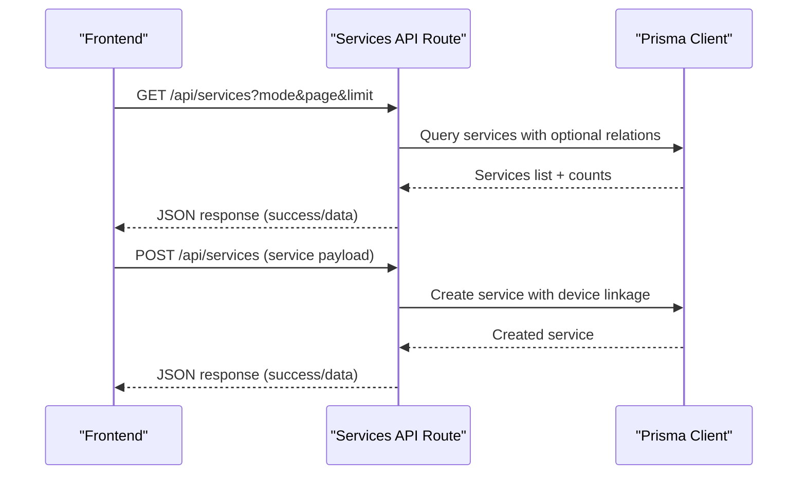
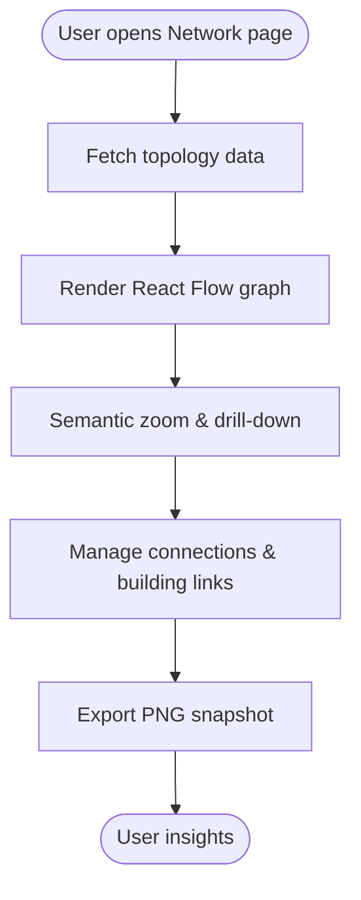
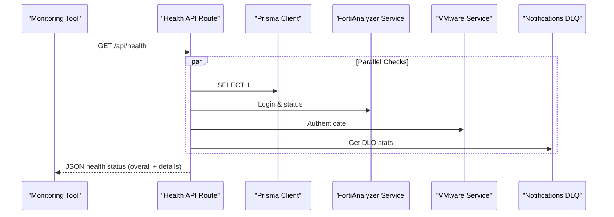
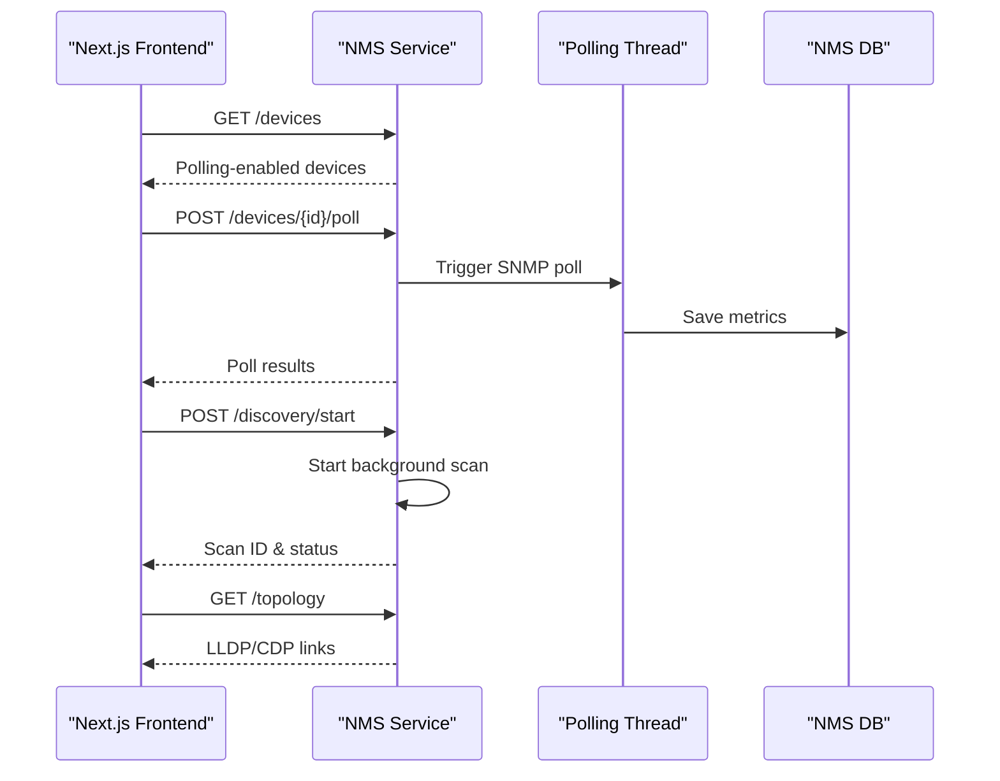
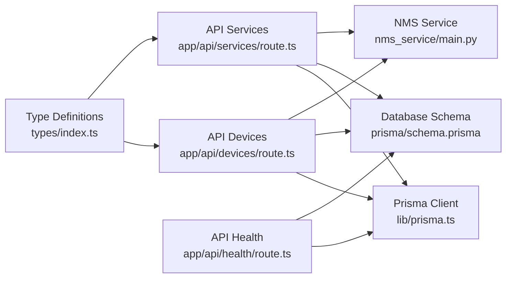

# Project Overview

<cite>
**Referenced Files in This Document**
- [README.md](file://README.md)
- [PROJECT_SUMMARY.md](file://PROJECT_SUMMARY.md)
- [ARCHITECTURE.md](file://ARCHITECTURE.md)
- [QUICK_START.md](file://QUICK_START.md)
- [package.json](file://package.json)
- [nms_service/main.py](file://nms_service/main.py)
- [app/api/devices/route.ts](file://app/api/devices/route.ts)
- [app/api/services/route.ts](file://app/api/services/route.ts)
- [app/api/health/route.ts](file://app/api/health/route.ts)
- [lib/prisma.ts](file://lib/prisma.ts)
- [types/index.ts](file://types/index.ts)
- [prisma/schema.prisma](file://prisma/schema.prisma)
- [docs/network-topology-guide.md](file://docs/network-topology-guide.md)
</cite>

## Table of Contents
1. [Introduction](#introduction)
2. [Project Structure](#project-structure)
3. [Core Components](#core-components)
4. [Architecture Overview](#architecture-overview)
5. [Detailed Component Analysis](#detailed-component-analysis)
6. [Dependency Analysis](#dependency-analysis)
7. [Performance Considerations](#performance-considerations)
8. [Troubleshooting Guide](#troubleshooting-guide)
9. [Conclusion](#conclusion)
10. [Appendices](#appendices)

## Introduction
InfraScope is a production-ready, enterprise infrastructure management platform that centralizes visibility and control over IT operations. It unifies physical infrastructure, device inventory, network topology, and service dependencies into a cohesive CMDB-driven system. The platform enables stakeholders to manage complex enterprise environments with confidence, while equipping developers with a scalable, type-safe foundation.

Key value propositions:
- Centralized CMDB and topology visualization for physical and logical infrastructure
- Device inventory tracking with status, criticality, and lifecycle dates
- Network topology visualization and connection management
- Service dependency mapping and impact analysis (CMDB)
- Comprehensive reporting and health monitoring
- Enterprise-grade observability and integration readiness

## Project Structure
The project follows a modern full-stack architecture with a Next.js 14 App Router frontend, TypeScript-based API routes, and a PostgreSQL backend powered by Prisma. Supporting integrations include an internal NMS service for SNMP polling and discovery, and a modular component library for UI and utilities.

**Diagram sources**
- [README.md:106-164](file://README.md#L106-L164)
- [ARCHITECTURE.md:28-103](file://ARCHITECTURE.md#L28-L103)
- [nms_service/main.py:1-11](file://nms_service/main.py#L1-L11)

**Section sources**
- [README.md:106-164](file://README.md#L106-L164)
- [ARCHITECTURE.md:28-103](file://ARCHITECTURE.md#L28-L103)

## Core Components
- Database-first CMDB schema with normalized entities for organizations, buildings, floors, rooms, racks, devices, services, and dependencies
- Type-safe frontend and backend using TypeScript enums and interfaces
- API routes implementing CRUD operations for devices and services with pagination and filtering
- Health endpoint integrating alarm services, datasource checks, and notification delivery queues
- Internal NMS service for SNMP polling, discovery scans, and topology retrieval

Practical examples:
- Capacity planning: Use rack units and device criticality to assess growth and replacement schedules
- Incident response: Leverage topology visualization and dependency analysis to isolate affected services
- Service impact analysis: Trace dependencies to understand outage propagation across services and devices

**Section sources**
- [PROJECT_SUMMARY.md:18-40](file://PROJECT_SUMMARY.md#L18-L40)
- [types/index.ts:10-312](file://types/index.ts#L10-L312)
- [prisma/schema.prisma:10-800](file://prisma/schema.prisma#L10-L800)
- [app/api/devices/route.ts:10-94](file://app/api/devices/route.ts#L10-L94)
- [app/api/services/route.ts:4-75](file://app/api/services/route.ts#L4-L75)
- [app/api/health/route.ts:204-254](file://app/api/health/route.ts#L204-L254)
- [nms_service/main.py:103-182](file://nms_service/main.py#L103-L182)

## Architecture Overview
The platform adopts a layered architecture:
- Presentation: Next.js pages and components with Tailwind CSS styling
- API: REST endpoints under app/api/ using Next.js API routes
- Domain: TypeScript models and enums define business entities
- Persistence: Prisma ORM with PostgreSQL, JSONB for extensibility
- Integrations: Internal NMS service for device telemetry and discovery

Technology stack highlights:
- Frontend: Next.js 14, TypeScript 5.2, Tailwind CSS, React Flow, Zustand, Axios
- Backend: Next.js API Routes, Node.js runtime
- Database: PostgreSQL 12+, Prisma ORM
- DevOps: Docker and docker-compose configurations for development and production

**Diagram sources**
- [README.md:108-126](file://README.md#L108-L126)
- [ARCHITECTURE.md:7-27](file://ARCHITECTURE.md#L7-L27)
- [package.json:16-57](file://package.json#L16-L57)

**Section sources**
- [README.md:108-126](file://README.md#L108-L126)
- [ARCHITECTURE.md:7-27](file://ARCHITECTURE.md#L7-L27)
- [package.json:16-57](file://package.json#L16-L57)

## Detailed Component Analysis

### Device Inventory Management
The device API supports listing, filtering, pagination, and creation. It distinguishes between minimal and full modes to optimize performance for dashboards versus detailed views. The backend integrates with Prisma for robust querying and includes validation for required fields.

**Diagram sources**
- [app/api/devices/route.ts:10-94](file://app/api/devices/route.ts#L10-L94)
- [lib/prisma.ts:10-21](file://lib/prisma.ts#L10-L21)

**Section sources**
- [app/api/devices/route.ts:10-94](file://app/api/devices/route.ts#L10-L94)
- [lib/prisma.ts:10-21](file://lib/prisma.ts#L10-L21)

### Service and Dependency Management
The services API mirrors device API patterns with pagination and mode selection. It includes service-to-device mapping and dependency relationships for CMDB-based impact analysis. The underlying Prisma schema defines service types, statuses, protocols, and dependency types.

**Diagram sources**
- [app/api/services/route.ts:4-75](file://app/api/services/route.ts#L4-L75)
- [prisma/schema.prisma:344-387](file://prisma/schema.prisma#L344-L387)
- [types/index.ts:234-293](file://types/index.ts#L234-L293)

**Section sources**
- [app/api/services/route.ts:4-75](file://app/api/services/route.ts#L4-L75)
- [prisma/schema.prisma:344-387](file://prisma/schema.prisma#L344-L387)
- [types/index.ts:234-293](file://types/index.ts#L234-L293)

### Network Topology Visualization
The network topology page leverages React Flow for interactive topology visualization. The system supports semantic zoom, drill-down navigation, and connection management across buildings and devices. The documentation outlines view modes and export capabilities.

**Diagram sources**
- [docs/network-topology-guide.md:1-52](file://docs/network-topology-guide.md#L1-L52)

**Section sources**
- [docs/network-topology-guide.md:1-52](file://docs/network-topology-guide.md#L1-L52)

### Health Monitoring and Alarm Services
The health endpoint consolidates database, FortiAnalyzer, and VMware connectivity checks, alarm statistics, and notification delivery queue metrics. It ensures alarm services are running and auto-restarts them if stopped.

**Diagram sources**
- [app/api/health/route.ts:204-254](file://app/api/health/route.ts#L204-L254)

**Section sources**
- [app/api/health/route.ts:204-254](file://app/api/health/route.ts#L204-L254)

### NMS Service Integration
The internal NMS service exposes endpoints for device polling, discovery scans, backups, and topology retrieval. It manages background threads for continuous polling and supports on-demand operations.

**Diagram sources**
- [nms_service/main.py:103-182](file://nms_service/main.py#L103-L182)
- [nms_service/main.py:328-442](file://nms_service/main.py#L328-L442)

**Section sources**
- [nms_service/main.py:103-182](file://nms_service/main.py#L103-L182)
- [nms_service/main.py:328-442](file://nms_service/main.py#L328-L442)

## Dependency Analysis
The project exhibits strong separation of concerns:
- Frontend pages depend on API routes for data
- API routes depend on Prisma for persistence
- Health and integrations depend on external services and internal NMS
- Types define contracts across layers

**Diagram sources**
- [types/index.ts:10-312](file://types/index.ts#L10-L312)
- [lib/prisma.ts:10-21](file://lib/prisma.ts#L10-L21)
- [prisma/schema.prisma:10-800](file://prisma/schema.prisma#L10-L800)
- [app/api/devices/route.ts:1-142](file://app/api/devices/route.ts#L1-L142)
- [app/api/services/route.ts:1-122](file://app/api/services/route.ts#L1-L122)
- [app/api/health/route.ts:1-255](file://app/api/health/route.ts#L1-L255)
- [nms_service/main.py:1-483](file://nms_service/main.py#L1-L483)

**Section sources**
- [types/index.ts:10-312](file://types/index.ts#L10-L312)
- [lib/prisma.ts:10-21](file://lib/prisma.ts#L10-L21)
- [prisma/schema.prisma:10-800](file://prisma/schema.prisma#L10-L800)
- [app/api/devices/route.ts:1-142](file://app/api/devices/route.ts#L1-L142)
- [app/api/services/route.ts:1-122](file://app/api/services/route.ts#L1-L122)
- [app/api/health/route.ts:1-255](file://app/api/health/route.ts#L1-L255)
- [nms_service/main.py:1-483](file://nms_service/main.py#L1-L483)

## Performance Considerations
- Database: Indexes on frequently queried fields, pagination for large datasets, lazy loading for relations, and caching for common reads
- Frontend: Dynamic imports, virtual scrolling for large lists, and efficient component composition
- API: Request validation, compression, and rate limiting where applicable
- Observability: Structured logging, error tracking, and audit trails for compliance

[No sources needed since this section provides general guidance]

## Troubleshooting Guide
Common issues and resolutions:
- PostgreSQL connection failures: verify credentials and database existence
- Prisma client generation: regenerate client and reinstall dependencies if missing
- Port conflicts: adjust dev server port
- TypeScript errors: run type checks and resolve type mismatches
- Health endpoint degraded/unhealthy: inspect datasource connectivity and alarm service status

**Section sources**
- [README.md:357-393](file://README.md#L357-L393)
- [QUICK_START.md:152-179](file://QUICK_START.md#L152-L179)

## Conclusion
InfraScope delivers a production-ready foundation for enterprise infrastructure management. Its CMDB-centric design, topology visualization, and dependency analysis enable both strategic planning and tactical operations. The modular architecture, type-safe codebase, and integration-ready backend position teams to scale effectively and maintain high reliability.

[No sources needed since this section summarizes without analyzing specific files]

## Appendices

### Practical Use Cases
- Capacity planning: Assess rack utilization and device criticality to plan expansions and replacements
- Incident response: Use topology and dependency views to isolate impacted services and devices
- Service impact analysis: Traverse dependencies to understand outage propagation and recovery order

**Section sources**
- [docs/network-topology-guide.md:1-52](file://docs/network-topology-guide.md#L1-L52)
- [types/index.ts:278-293](file://types/index.ts#L278-L293)

### Technology Stack and Production Readiness
- Frontend: Next.js 14, TypeScript 5.2, Tailwind CSS, React Flow, Zustand, Axios
- Backend: Next.js API Routes, Node.js runtime
- Database: PostgreSQL 12+, Prisma ORM
- Production status: Production Ready (foundation complete)

**Section sources**
- [README.md:108-126](file://README.md#L108-L126)
- [PROJECT_SUMMARY.md:153-175](file://PROJECT_SUMMARY.md#L153-L175)
- [README.md:410-422](file://README.md#L410-L422)