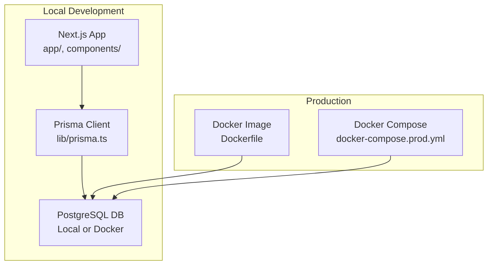
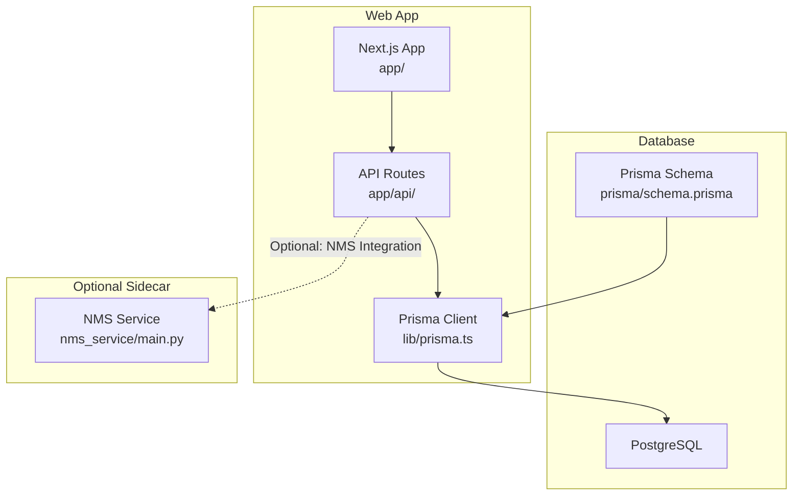
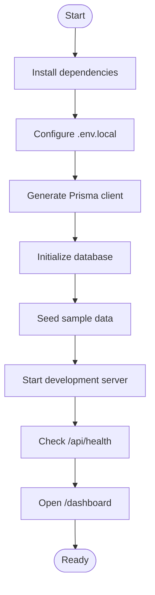
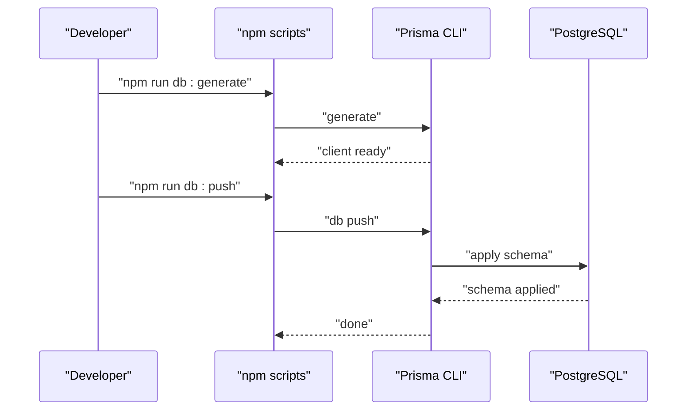
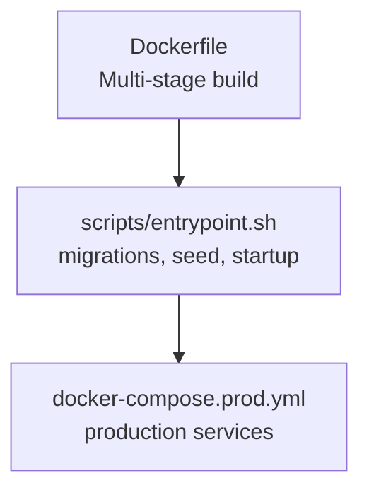
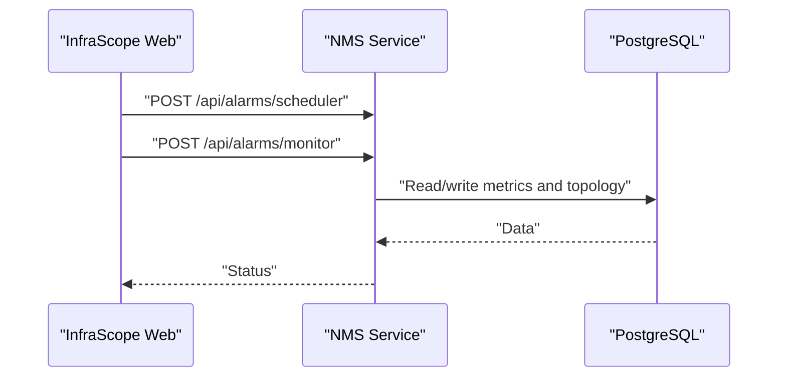
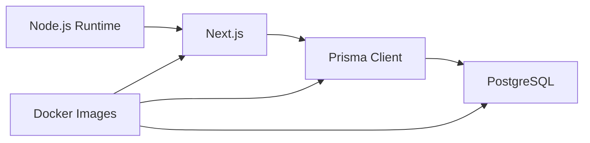

# Quick Start Guide

<cite>
**Referenced Files in This Document**
- [README.md](file://README.md)
- [package.json](file://package.json)
- [docker-compose.yml](file://docker-compose.yml)
- [Dockerfile](file://Dockerfile)
- [docker-compose.prod.yml](file://docker-compose.prod.yml)
- [.env.example](file://.env.example)
- [scripts/dev-startup.sh](file://scripts/dev-startup.sh)
- [scripts/entrypoint.sh](file://scripts/entrypoint.sh)
- [scripts/wait-for-db.sh](file://scripts/wait-for-db.sh)
- [prisma/schema.prisma](file://prisma/schema.prisma)
- [lib/prisma.ts](file://lib/prisma.ts)
- [nms_service/main.py](file://nms_service/main.py)
- [nms_service/requirements.txt](file://nms_service/requirements.txt)
</cite>

## Table of Contents
1. [Introduction](#introduction)
2. [Project Structure](#project-structure)
3. [Core Components](#core-components)
4. [Architecture Overview](#architecture-overview)
5. [Detailed Component Analysis](#detailed-component-analysis)
6. [Dependency Analysis](#dependency-analysis)
7. [Performance Considerations](#performance-considerations)
8. [Troubleshooting Guide](#troubleshooting-guide)
9. [Conclusion](#conclusion)
10. [Appendices](#appendices)

## Introduction
This Quick Start Guide helps you get InfraScope running quickly, from prerequisites to your first successful run. It covers:
- Prerequisites: Node.js and PostgreSQL
- Local development setup with npm scripts and Prisma
- Environment configuration and database initialization
- Sample data seeding and initial navigation
- Production deployment using Docker and Docker Compose
- Verification steps and troubleshooting for common issues

The guide is written for users with varying technical backgrounds, providing step-by-step instructions and expected outcomes.

## Project Structure
InfraScope is a Next.js 14 application with a PostgreSQL database managed by Prisma. The repository includes:
- Frontend under app/ and components/
- Backend API routes under app/api/
- Prisma schema and migrations under prisma/
- Docker configurations for development and production
- Scripts for development startup, database readiness, and container entrypoint

**Diagram sources**
- [Dockerfile:1-115](file://Dockerfile#L1-L115)
- [docker-compose.prod.yml:1-135](file://docker-compose.prod.yml#L1-L135)
- [lib/prisma.ts:1-21](file://lib/prisma.ts#L1-L21)

**Section sources**
- [README.md:114-172](file://README.md#L114-L172)
- [Dockerfile:1-115](file://Dockerfile#L1-L115)
- [docker-compose.yml:1-153](file://docker-compose.yml#L1-L153)
- [docker-compose.prod.yml:1-135](file://docker-compose.prod.yml#L1-L135)

## Core Components
- Prisma ORM and database client: Manages schema, migrations, and database connectivity.
- Next.js API routes: Serve frontend pages and backend endpoints.
- Environment configuration: Controls database URLs, API base URLs, and runtime behavior.
- Development and production containers: Provide repeatable environments with health checks and migrations.

Key setup commands and scripts:
- Install dependencies: [package.json:5-14](file://package.json#L5-L14)
- Generate Prisma client: [package.json:11-14](file://package.json#L11-L14)
- Initialize database: [package.json:11-14](file://package.json#L11-L14)
- Seed database: [package.json:11-14](file://package.json#L11-L14)
- Start development server: [package.json:5-14](file://package.json#L5-L14)
- Container entrypoint and migrations: [scripts/entrypoint.sh:1-88](file://scripts/entrypoint.sh#L1-L88)

**Section sources**
- [package.json:5-14](file://package.json#L5-L14)
- [lib/prisma.ts:1-21](file://lib/prisma.ts#L1-L21)
- [prisma/schema.prisma:1-8](file://prisma/schema.prisma#L1-L8)
- [scripts/entrypoint.sh:22-38](file://scripts/entrypoint.sh#L22-L38)

## Architecture Overview
The system consists of:
- Frontend: Next.js App Router serving pages and consuming API routes
- Backend: Next.js API routes backed by Prisma
- Database: PostgreSQL with Prisma schema and migrations
- Optional: NMS (Network Monitoring System) sidecar for SNMP polling and discovery

**Diagram sources**
- [lib/prisma.ts:1-21](file://lib/prisma.ts#L1-L21)
- [prisma/schema.prisma:1-8](file://prisma/schema.prisma#L1-L8)
- [nms_service/main.py:1-11](file://nms_service/main.py#L1-L11)

**Section sources**
- [README.md:114-172](file://README.md#L114-L172)
- [nms_service/main.py:1-11](file://nms_service/main.py#L1-L11)

## Detailed Component Analysis

### Prerequisites and Environment Setup
- Node.js: Version 18 or higher
- PostgreSQL: Version 12 or higher
- Package manager: npm or yarn

Environment variables to configure:
- Database URL: DATABASE_URL
- Public API URL: NEXT_PUBLIC_API_URL
- Node environment: NODE_ENV
- Application name: APP_NAME
- Logging level: LOG_LEVEL
- NMS backend URL: NMS_BACKEND_URL

Create a local environment file (.env.local) with the database connection string and other settings. Example placeholders are provided in the environment template.

Verification steps:
- Confirm Node.js and npm versions meet requirements.
- Confirm PostgreSQL is installed and accessible.

**Section sources**
- [README.md:66-69](file://README.md#L66-L69)
- [README.md:340-363](file://README.md#L340-L363)
- [.env.example:1-26](file://.env.example#L1-L26)

### Local Development Setup
Complete the following steps to run InfraScope locally:

1. Install dependencies
   - Command: [package.json:5-14](file://package.json#L5-L14)
   - Expected outcome: node_modules installed

2. Configure environment
   - Create .env.local with DATABASE_URL pointing to your PostgreSQL instance.
   - Example placeholder: [README.md:342-349](file://README.md#L342-L349)

3. Generate Prisma client
   - Command: [package.json:11-14](file://package.json#L11-L14)
   - Expected outcome: Prisma client generated

4. Initialize database
   - Command: [package.json:11-14](file://package.json#L11-L14)
   - Expected outcome: Database schema applied

5. Seed database with sample data
   - Command: [package.json:11-14](file://package.json#L11-L14)
   - Expected outcome: Sample dataset loaded

6. Start development server
   - Command: [package.json:5-14](file://package.json#L5-L14)
   - Expected outcome: Dev server starts on the configured port

7. Verify health endpoint
   - Navigate to: [README.md](file://README.md#L97)
   - Expected outcome: Dashboard loads successfully

**Diagram sources**
- [package.json:5-14](file://package.json#L5-L14)
- [README.md](file://README.md#L97)

**Section sources**
- [README.md:64-98](file://README.md#L64-L98)
- [package.json:5-14](file://package.json#L5-L14)
- [scripts/dev-startup.sh:1-58](file://scripts/dev-startup.sh#L1-L58)

### Database Initialization and Prisma
- Prisma client generation ensures type-safe database access.
- Database initialization applies migrations and creates tables.
- The Prisma client is a singleton to avoid multiple connections.

**Diagram sources**
- [package.json:11-14](file://package.json#L11-L14)
- [prisma/schema.prisma:1-8](file://prisma/schema.prisma#L1-L8)

**Section sources**
- [package.json:11-14](file://package.json#L11-L14)
- [lib/prisma.ts:1-21](file://lib/prisma.ts#L1-L21)

### Sample Data Seeding
- The seed command loads predefined sample data into the database.
- After seeding, you can explore the dashboard and related pages.

Verification:
- After running the seed command, navigate to the dashboard and confirm entities appear.

**Section sources**
- [README.md:219-231](file://README.md#L219-L231)
- [package.json:11-14](file://package.json#L11-L14)

### Initial Navigation
- Default dashboard: [README.md](file://README.md#L97)
- Key pages include dashboard, devices, locations, services, and network.
- Health endpoint: [README.md](file://README.md#L200)

**Section sources**
- [README.md:191-201](file://README.md#L191-L201)

### Production Deployment Considerations
- Build a production-ready Docker image:
  - Multi-stage build with Prisma client generation and application build.
  - Health checks and non-root user.
  - Entrypoint script handles database readiness, migrations, and seeding in development.
- Docker Compose for production:
  - Separate compose file for production with security hardening and health checks.
  - Database exposed only internally; optional reverse proxy recommended.

**Diagram sources**
- [Dockerfile:1-115](file://Dockerfile#L1-L115)
- [scripts/entrypoint.sh:1-88](file://scripts/entrypoint.sh#L1-L88)
- [docker-compose.prod.yml:1-135](file://docker-compose.prod.yml#L1-L135)

**Section sources**
- [Dockerfile:1-115](file://Dockerfile#L1-L115)
- [docker-compose.prod.yml:1-135](file://docker-compose.prod.yml#L1-L135)
- [scripts/entrypoint.sh:22-41](file://scripts/entrypoint.sh#L22-L41)

### NMS Integration (Optional)
- The NMS sidecar provides internal endpoints for device polling, discovery, backups, and topology.
- It runs on port 8500 inside the Docker network and integrates with the main web service.

**Diagram sources**
- [nms_service/main.py:91-98](file://nms_service/main.py#L91-L98)
- [docker-compose.yml:78-114](file://docker-compose.yml#L78-L114)

**Section sources**
- [docker-compose.yml:78-114](file://docker-compose.yml#L78-L114)
- [nms_service/main.py:1-11](file://nms_service/main.py#L1-L11)

## Dependency Analysis
- Node.js runtime and Next.js framework power the frontend and API routes.
- Prisma provides type-safe database access and manages migrations.
- PostgreSQL stores all application data.
- Docker images encapsulate the application and its dependencies for production.

**Diagram sources**
- [package.json:16-56](file://package.json#L16-L56)
- [lib/prisma.ts:1-21](file://lib/prisma.ts#L1-L21)
- [Dockerfile:1-115](file://Dockerfile#L1-L115)

**Section sources**
- [package.json:16-56](file://package.json#L16-L56)
- [lib/prisma.ts:1-21](file://lib/prisma.ts#L1-L21)

## Performance Considerations
- Disable Prisma query logging by default to reduce I/O overhead.
- Use health checks and pre-warming in production to improve first-load performance.
- Prefer Docker Compose for repeatable environments and reduced configuration drift.

[No sources needed since this section provides general guidance]

## Troubleshooting Guide

### PostgreSQL Connection Issues
- Test connectivity manually using psql.
- Create the database if it does not exist.

Commands:
- [README.md:368-374](file://README.md#L368-L374)

### Prisma Client Not Found
- Reinstall dependencies or regenerate the client.

Commands:
- [README.md:376-384](file://README.md#L376-L384)

### Port Already in Use
- Change the development port or stop the conflicting service.

Command:
- [README.md:386-390](file://README.md#L386-L390)

### TypeScript Errors
- Run type checking and rebuild if needed.

Commands:
- [README.md:392-400](file://README.md#L392-L400)

### Database Readiness in Containers
- The entrypoint script waits for the database to be ready before applying migrations and starting the app.

Script:
- [scripts/entrypoint.sh:11-26](file://scripts/entrypoint.sh#L11-L26)

### Development Startup Script
- The development startup script waits for the server to be healthy and then starts alarm services.

Script:
- [scripts/dev-startup.sh:12-28](file://scripts/dev-startup.sh#L12-L28)

**Section sources**
- [README.md:365-400](file://README.md#L365-L400)
- [scripts/entrypoint.sh:11-26](file://scripts/entrypoint.sh#L11-L26)
- [scripts/dev-startup.sh:12-28](file://scripts/dev-startup.sh#L12-L28)

## Conclusion
You now have the essential steps to set up InfraScope locally and understand how to deploy it in production. Use the provided commands and verification steps to ensure a smooth start. Refer to the additional documentation anchors for deeper insights as your needs evolve.

[No sources needed since this section summarizes without analyzing specific files]

## Appendices

### Verification Checklist
- Node.js and npm versions meet prerequisites.
- PostgreSQL is reachable and the database exists.
- Prisma client generated successfully.
- Database initialized and migrated.
- Sample data seeded.
- Development server running and responding to health checks.
- Dashboard loads without errors.

**Section sources**
- [README.md:66-69](file://README.md#L66-L69)
- [README.md:365-400](file://README.md#L365-L400)
- [README.md](file://README.md#L97)

### Additional Documentation Resources
- Official documentation map and runbooks: [README.md:99-113](file://README.md#L99-L113)

**Section sources**
- [README.md:99-113](file://README.md#L99-L113)