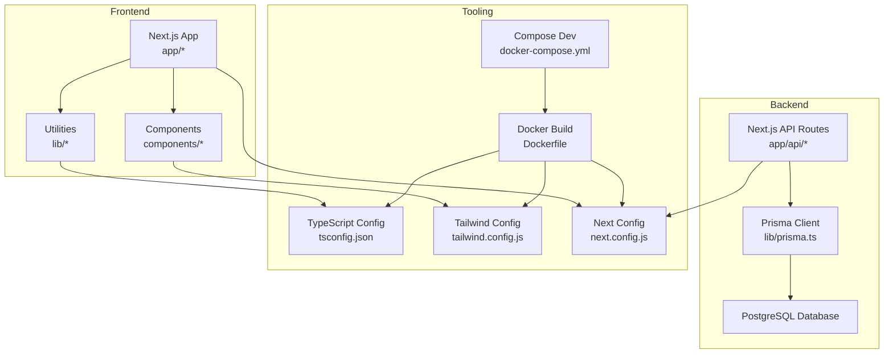
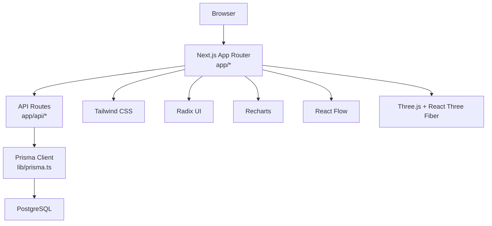
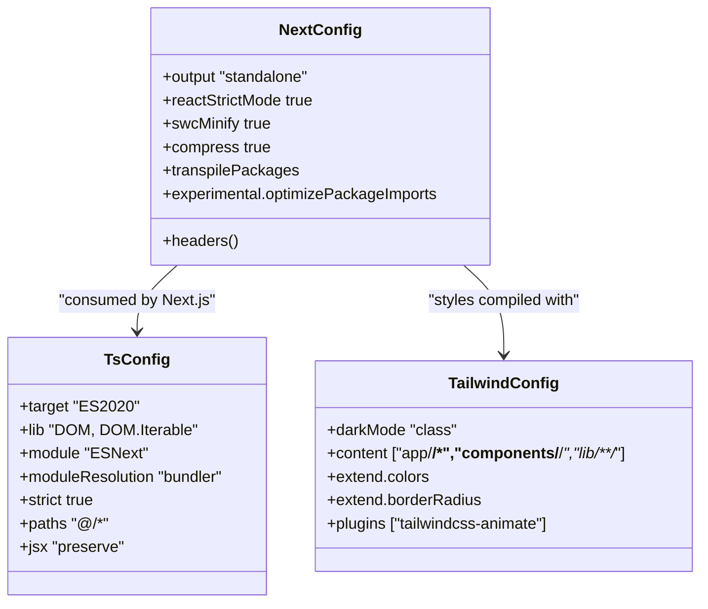
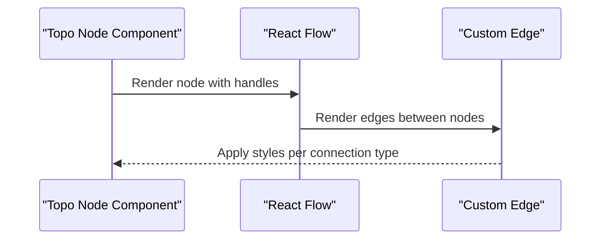
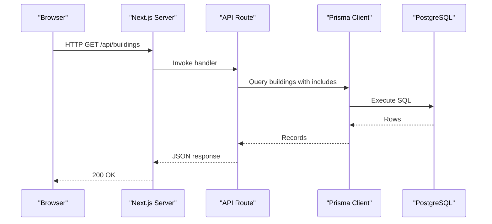
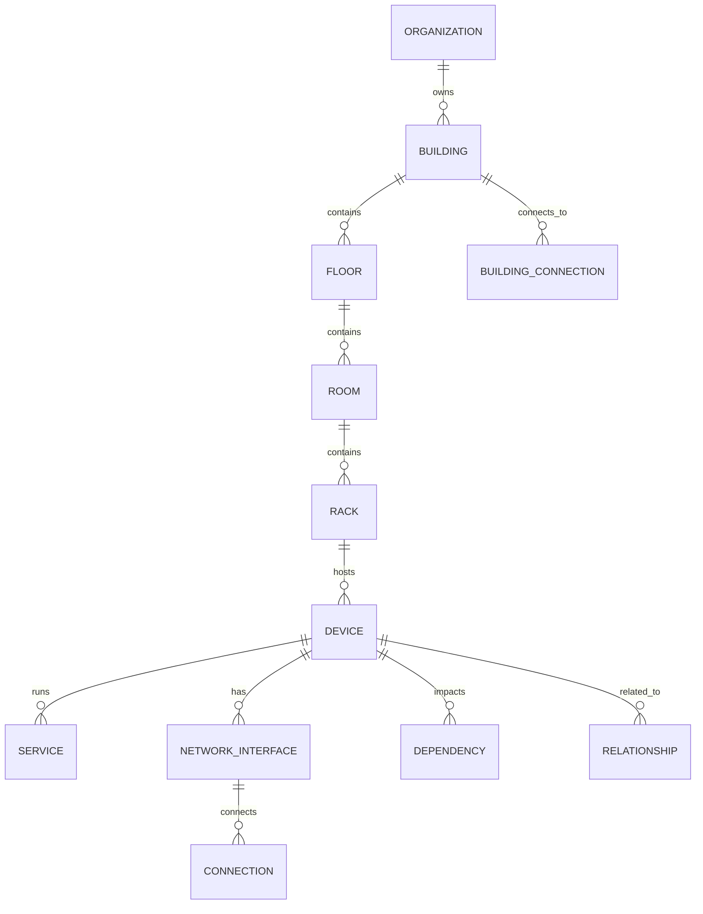
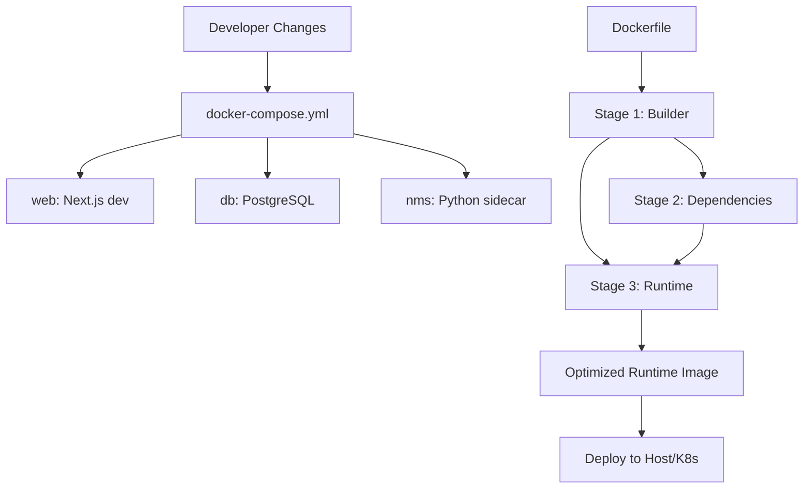
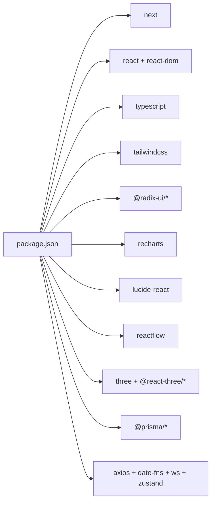

# Technology Stack

<cite>
**Referenced Files in This Document**
- [package.json](file://package.json)
- [next.config.js](file://next.config.js)
- [tsconfig.json](file://tsconfig.json)
- [tailwind.config.js](file://tailwind.config.js)
- [components.json](file://components.json)
- [prisma/schema.prisma](file://prisma/schema.prisma)
- [lib/prisma.ts](file://lib/prisma.ts)
- [app/layout.tsx](file://app/layout.tsx)
- [app/api/buildings/route.ts](file://app/api/buildings/route.ts)
- [components/topology/BuildingNode.tsx](file://components/topology/BuildingNode.tsx)
- [components/topology/CustomEdge.tsx](file://components/topology/CustomEdge.tsx)
- [components/3d/FloorPlanView.tsx](file://components/3d/FloorPlanView.tsx)
- [Dockerfile](file://Dockerfile)
- [docker-compose.yml](file://docker-compose.yml)
</cite>

## Table of Contents
1. [Introduction](#introduction)
2. [Project Structure](#project-structure)
3. [Core Components](#core-components)
4. [Architecture Overview](#architecture-overview)
5. [Detailed Component Analysis](#detailed-component-analysis)
6. [Dependency Analysis](#dependency-analysis)
7. [Performance Considerations](#performance-considerations)
8. [Troubleshooting Guide](#troubleshooting-guide)
9. [Conclusion](#conclusion)
10. [Appendices](#appendices)

## Introduction
This document describes the InfraScope technology stack and architectural choices. It covers the frontend (Next.js 14, React, TypeScript, Tailwind CSS, Radix UI, Recharts, React Flow, Three.js), the backend (Next.js API routes with Node.js runtime), and the database layer (PostgreSQL with Prisma ORM). It also documents rationale, version requirements, compatibility, upgrade paths, development workflow, build processes, and deployment architecture. Guidance is included for extending the stack and integrating new technologies.

## Project Structure
InfraScope follows a conventional Next.js 14 app directory structure with:
- app: Next.js app directory containing pages, API routes, and shared layout
- components: UI components organized by feature (topology, 3D, shared)
- lib: shared utilities and Prisma client initialization
- prisma: schema and migrations
- scripts: startup and database helpers
- docker: containerization assets

**Diagram sources**
- [app/layout.tsx:1-57](file://app/layout.tsx#L1-L57)
- [lib/prisma.ts:1-21](file://lib/prisma.ts#L1-L21)
- [prisma/schema.prisma:1-1288](file://prisma/schema.prisma#L1-L1288)
- [next.config.js:1-62](file://next.config.js#L1-L62)
- [tsconfig.json:1-74](file://tsconfig.json#L1-L74)
- [tailwind.config.js:1-93](file://tailwind.config.js#L1-L93)
- [Dockerfile:1-115](file://Dockerfile#L1-L115)
- [docker-compose.yml:1-153](file://docker-compose.yml#L1-L153)

**Section sources**
- [package.json:1-71](file://package.json#L1-L71)
- [next.config.js:1-62](file://next.config.js#L1-L62)
- [tsconfig.json:1-74](file://tsconfig.json#L1-L74)
- [tailwind.config.js:1-93](file://tailwind.config.js#L1-L93)
- [components.json:1-17](file://components.json#L1-L17)

## Core Components
- Frontend framework and runtime
  - Next.js 14 with app directory and API routes
  - React 18 with client components
  - TypeScript strict configuration
  - Tailwind CSS for styling with shadcn/ui components
- UI primitives and design system
  - Radix UI primitives for accessible controls
  - Recharts for data visualization
  - Lucide icons for UI
- Specialized libraries
  - React Flow for interactive topology graphs
  - Three.js with @react-three/fiber and @react-three/drei for 3D scenes
- Backend runtime and API
  - Next.js API routes executed on Node.js runtime
  - Prisma ORM with PostgreSQL client
- Tooling and DX
  - ESLint, PostCSS, autoprefixer
  - Sharp for image optimization
  - Zustand for lightweight state management

**Section sources**
- [package.json:16-69](file://package.json#L16-L69)
- [next.config.js:1-62](file://next.config.js#L1-L62)
- [tsconfig.json:1-74](file://tsconfig.json#L1-L74)
- [tailwind.config.js:1-93](file://tailwind.config.js#L1-L93)
- [components.json:1-17](file://components.json#L1-L17)

## Architecture Overview
The system is a single-page application served by Next.js with a Node.js runtime. API routes under app/api provide server-side logic and database access via Prisma. PostgreSQL stores enterprise infrastructure data. Docker containers orchestrate the web app, database, and optional NMS sidecar service.

**Diagram sources**
- [app/layout.tsx:1-57](file://app/layout.tsx#L1-L57)
- [app/api/buildings/route.ts:1-118](file://app/api/buildings/route.ts#L1-L118)
- [lib/prisma.ts:1-21](file://lib/prisma.ts#L1-L21)
- [prisma/schema.prisma:1-1288](file://prisma/schema.prisma#L1-L1288)
- [tailwind.config.js:1-93](file://tailwind.config.js#L1-L93)

## Detailed Component Analysis

### Frontend Stack: Next.js, React, TypeScript, Tailwind CSS
- Next.js 14
  - App directory with pages and API routes
  - Standalone output for minimal Docker images
  - SWC minification and aggressive caching headers
  - Transpilation optimization for Three.js and related packages
- React 18
  - Client components with React.memo for topology nodes
  - Strict mode enabled
- TypeScript
  - Strict compiler options, incremental builds, bundler module resolution
  - Path aliases for clean imports
- Tailwind CSS
  - Dark mode support, oklch color tokens, animations plugin
  - Content scanning scoped to app, components, and lib
- UI primitives
  - Radix UI for dialogs, selects, tabs, progress, toasts
  - shadcn/ui configured with TSX and custom aliases

**Diagram sources**
- [next.config.js:1-62](file://next.config.js#L1-L62)
- [tsconfig.json:1-74](file://tsconfig.json#L1-L74)
- [tailwind.config.js:1-93](file://tailwind.config.js#L1-L93)

**Section sources**
- [next.config.js:1-62](file://next.config.js#L1-L62)
- [tsconfig.json:1-74](file://tsconfig.json#L1-L74)
- [tailwind.config.js:1-93](file://tailwind.config.js#L1-L93)
- [components.json:1-17](file://components.json#L1-L17)

### Specialized Libraries: React Flow and Three.js
- React Flow
  - Used for topology graphs with custom nodes and edges
  - Handles connection handles, labels, and dynamic styles per connection type
- Three.js with React Three Fiber and Drei
  - 3D rendering pipeline integrated via client components
  - Canvas-based floor plan visualization with interactive controls

**Diagram sources**
- [components/topology/BuildingNode.tsx:1-176](file://components/topology/BuildingNode.tsx#L1-L176)
- [components/topology/CustomEdge.tsx:1-156](file://components/topology/CustomEdge.tsx#L1-L156)

**Section sources**
- [components/topology/BuildingNode.tsx:1-176](file://components/topology/BuildingNode.tsx#L1-L176)
- [components/topology/CustomEdge.tsx:1-156](file://components/topology/CustomEdge.tsx#L1-L156)
- [components/3d/FloorPlanView.tsx:1-768](file://components/3d/FloorPlanView.tsx#L1-L768)

### Backend Architecture: Next.js API Routes and Node.js Runtime
- API routes
  - Located under app/api with route handlers per resource
  - Example: buildings endpoint with GET/POST and in-memory cache
- Prisma ORM
  - Singleton client initialized once and reused
  - Logging controlled via environment variable
- Database
  - PostgreSQL provider configured in Prisma schema
  - Strongly typed models for infrastructure entities

**Diagram sources**
- [app/api/buildings/route.ts:1-118](file://app/api/buildings/route.ts#L1-L118)
- [lib/prisma.ts:1-21](file://lib/prisma.ts#L1-L21)
- [prisma/schema.prisma:1-1288](file://prisma/schema.prisma#L1-L1288)

**Section sources**
- [app/api/buildings/route.ts:1-118](file://app/api/buildings/route.ts#L1-L118)
- [lib/prisma.ts:1-21](file://lib/prisma.ts#L1-L21)
- [prisma/schema.prisma:1-1288](file://prisma/schema.prisma#L1-L1288)

### Database Layer: PostgreSQL and Prisma ORM
- Provider and connection
  - PostgreSQL configured as datasource
  - DATABASE_URL from environment
- Client lifecycle
  - Singleton pattern to avoid multiple clients
  - Optional query logging via environment flag
- Schema coverage
  - Organizations, Users, Buildings, Floors, Rooms, Racks, Devices, Services, Dependencies, Connections, Relationships, Integrations, and more
  - Enums for types, statuses, and relationships
  - Indexes and relations for performance and referential integrity

**Diagram sources**
- [prisma/schema.prisma:1-1288](file://prisma/schema.prisma#L1-L1288)

**Section sources**
- [prisma/schema.prisma:1-1288](file://prisma/schema.prisma#L1-L1288)
- [lib/prisma.ts:1-21](file://lib/prisma.ts#L1-L21)

### Development Workflow, Build Processes, and Deployment Architecture
- Development
  - Docker Compose for local dev with db, web, and optional NMS service
  - Hot reload enabled in dev container
  - Health checks for services
- Build
  - Multi-stage Docker build: builder, deps, runtime
  - Standalone Next.js output for smaller runtime image
  - Prisma client generation during build
- Deployment
  - Non-root user in runtime stage
  - Health check via internal API endpoint
  - Entrypoint script runs migrations and starts server

**Diagram sources**
- [docker-compose.yml:1-153](file://docker-compose.yml#L1-L153)
- [Dockerfile:1-115](file://Dockerfile#L1-L115)

**Section sources**
- [docker-compose.yml:1-153](file://docker-compose.yml#L1-L153)
- [Dockerfile:1-115](file://Dockerfile#L1-L115)

## Dependency Analysis
- Frontend dependencies
  - Next.js, React, TypeScript, Tailwind CSS, Radix UI, Recharts, Lucide icons
  - React Flow for graphing, Three.js ecosystem for 3D
- Backend dependencies
  - Prisma client and Prisma CLI for schema and migrations
  - Node-cron for scheduling, ws for websockets, axios for HTTP
- Tooling
  - ESLint, PostCSS, autoprefixer, sharp, ts-node, cross-env

**Diagram sources**
- [package.json:16-69](file://package.json#L16-L69)

**Section sources**
- [package.json:16-69](file://package.json#L16-L69)

## Performance Considerations
- Frontend
  - SWC minification and standalone output reduce bundle size and startup time
  - Aggressive caching headers for static assets and selected API endpoints
  - Optimize package imports for icon and chart libraries
  - Memoization in React Flow nodes reduces re-renders
- Backend
  - In-memory cache in API route prevents frequent DB queries
  - Selective includes in Prisma queries minimize payload size
  - Singleton Prisma client avoids connection overhead
- Database
  - Extensive indexing on frequently queried fields
  - Enum types and constraints improve query plans and data integrity

[No sources needed since this section provides general guidance]

## Troubleshooting Guide
- Database connectivity
  - Verify DATABASE_URL environment variable
  - Ensure health checks pass for db and web services
- Prisma client
  - Check PRISMA_LOG_QUERIES environment flag for verbose logging
  - Regenerate client after schema changes
- API route errors
  - Inspect returned JSON error payloads and HTTP status codes
  - Validate request bodies and required fields
- Docker
  - Review health checks and logs for db, web, and nms services
  - Confirm entrypoint script executes migrations before starting server

**Section sources**
- [lib/prisma.ts:1-21](file://lib/prisma.ts#L1-L21)
- [app/api/buildings/route.ts:71-78](file://app/api/buildings/route.ts#L71-L78)
- [docker-compose.yml:23-28](file://docker-compose.yml#L23-L28)
- [Dockerfile:107-111](file://Dockerfile#L107-L111)

## Conclusion
InfraScope leverages a modern, type-safe, and developer-friendly stack centered on Next.js 14, React, and TypeScript. The frontend benefits from Tailwind CSS, Radix UI, and specialized libraries for topology and 3D visualization. The backend uses Next.js API routes with a robust Prisma/PostgreSQL layer. The Docker-based build and deployment pipeline ensures reproducibility and scalability. The documented architecture, tooling, and extension guidance enable teams to evolve the system while maintaining performance and reliability.

[No sources needed since this section summarizes without analyzing specific files]

## Appendices

### Version Requirements and Compatibility
- Next.js 14
  - App directory, API routes, standalone output
- Node.js
  - Base images use Node 20; ensure local and CI environments align
- React 18
  - Concurrent features and client components
- TypeScript 5.x
  - Bundler module resolution and strict mode
- Tailwind CSS 3.x
  - JIT and content scanning configuration
- Prisma 5.x
  - Client and CLI versions aligned
- PostgreSQL
  - Provider configured in Prisma schema

**Section sources**
- [package.json:41-56](file://package.json#L41-L56)
- [Dockerfile:9-53](file://Dockerfile#L9-L53)
- [tsconfig.json:3-11](file://tsconfig.json#L3-L11)
- [tailwind.config.js:1-93](file://tailwind.config.js#L1-L93)
- [prisma/schema.prisma:1-8](file://prisma/schema.prisma#L1-L8)

### Upgrade Paths
- Next.js
  - Use Next.js upgrade guide; validate app directory and API routes
  - Test standalone output and caching headers after upgrades
- React and TypeScript
  - Incremental updates; verify bundler module resolution and path aliases
- Tailwind CSS
  - Review content paths and dark mode configuration
- Prisma
  - Run migrations after schema changes; regenerate client
- Node.js
  - Align base images and runtime versions across stages

**Section sources**
- [next.config.js:1-62](file://next.config.js#L1-L62)
- [tsconfig.json:1-74](file://tsconfig.json#L1-L74)
- [tailwind.config.js:1-93](file://tailwind.config.js#L1-L93)
- [Dockerfile:1-115](file://Dockerfile#L1-L115)

### Extending the Stack
- Add a new UI component
  - Place under components and configure shadcn/ui aliases
  - Import Tailwind classes and Radix primitives
- Add a new API route
  - Create app/api/{resource}/route.ts
  - Use lib/prisma.ts for database access
  - Return structured JSON responses with appropriate status codes
- Integrate a new library
  - Install via npm/yarn
  - Configure Next.js transpilePackages if needed
  - Add caching headers in next.config.js if serving static assets
- Add a new database model
  - Extend prisma/schema.prisma
  - Run migrations and regenerate Prisma client
  - Use the generated client in API routes or components

**Section sources**
- [components.json:1-17](file://components.json#L1-L17)
- [app/api/buildings/route.ts:1-118](file://app/api/buildings/route.ts#L1-L118)
- [lib/prisma.ts:1-21](file://lib/prisma.ts#L1-L21)
- [prisma/schema.prisma:1-1288](file://prisma/schema.prisma#L1-L1288)
- [next.config.js:12-12](file://next.config.js#L12-L12)