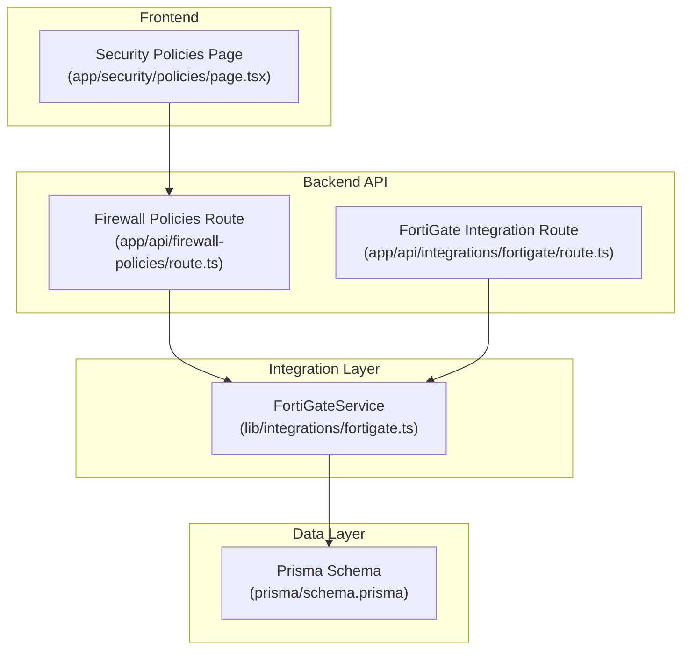
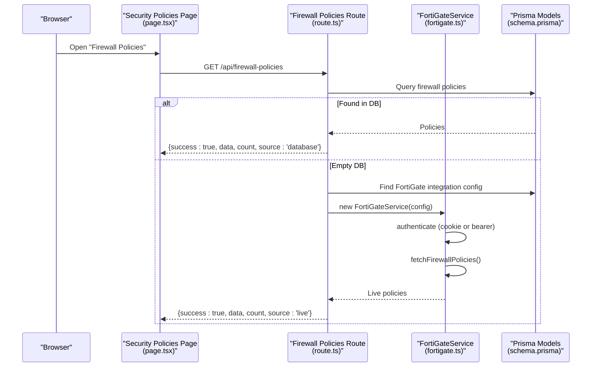
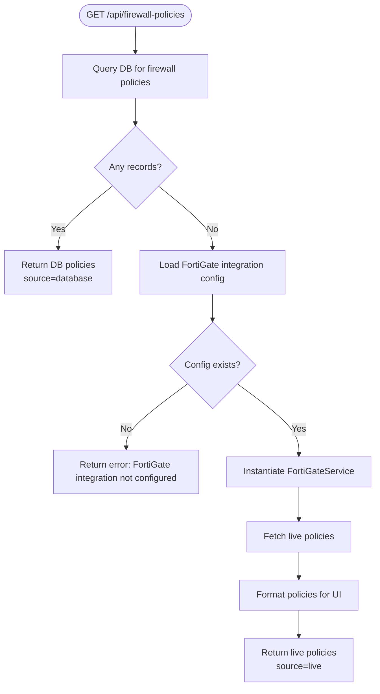
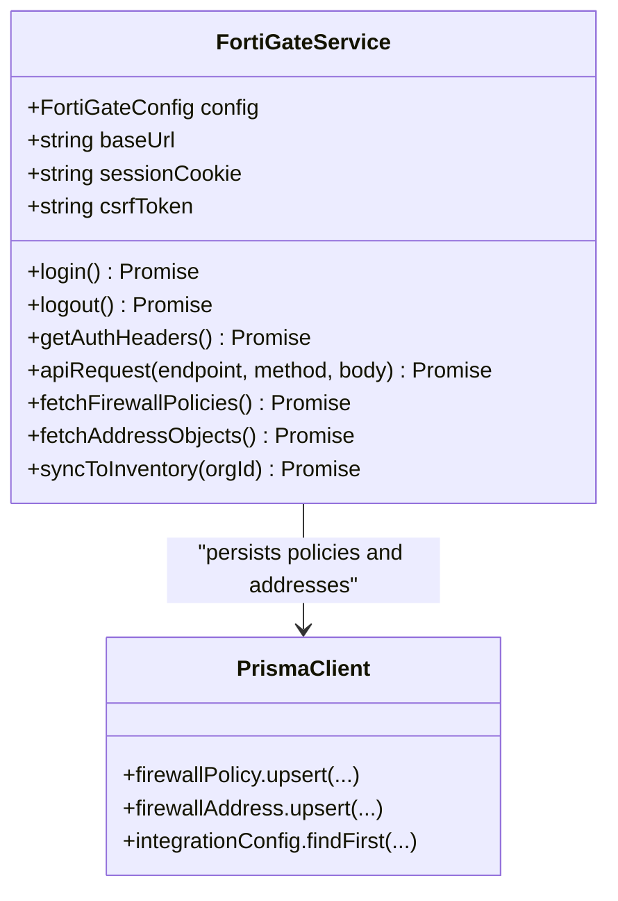
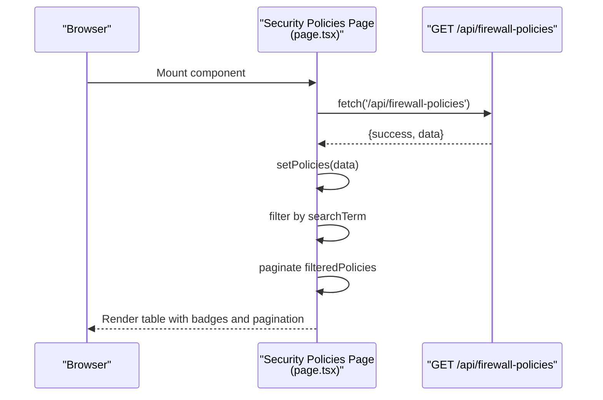
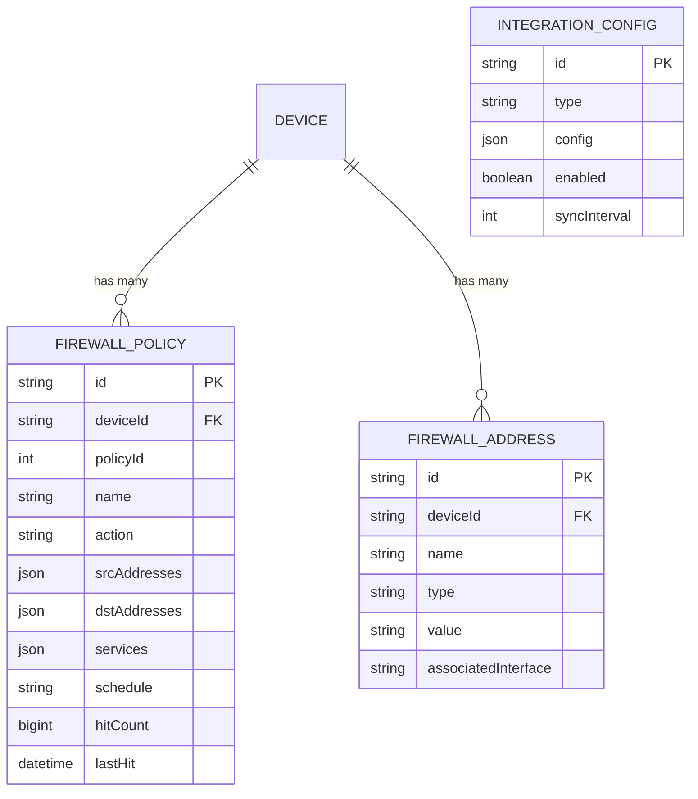
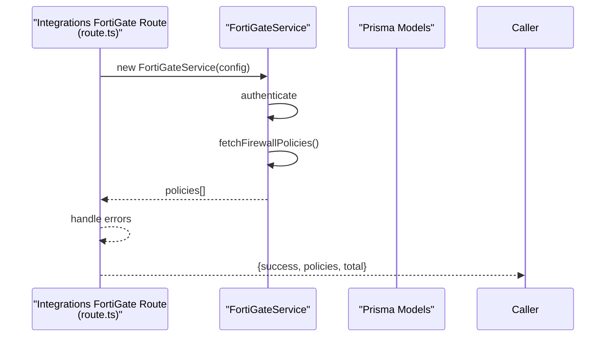
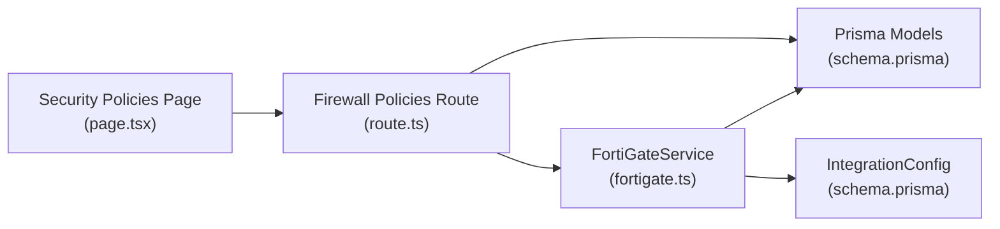

# Firewall Policies

<cite>
**Referenced Files in This Document**
- [route.ts](file://app/api/firewall-policies/route.ts)
- [page.tsx](file://app/security/policies/page.tsx)
- [fortigate.ts](file://lib/integrations/fortigate.ts)
- [schema.prisma](file://prisma/schema.prisma)
- [route.ts](file://app/api/integrations/fortigate/route.ts)
- [SECURITY_RISKS_CONFIGURATION.md](file://docs/SECURITY_RISKS_CONFIGURATION.md)
- [detection-engine.ts](file://lib/alarms/detection-engine.ts)
- [page.tsx](file://app/dashboard/alerts/page.tsx)
</cite>

## Table of Contents
1. [Introduction](#introduction)
2. [Project Structure](#project-structure)
3. [Core Components](#core-components)
4. [Architecture Overview](#architecture-overview)
5. [Detailed Component Analysis](#detailed-component-analysis)
6. [Dependency Analysis](#dependency-analysis)
7. [Performance Considerations](#performance-considerations)
8. [Troubleshooting Guide](#troubleshooting-guide)
9. [Conclusion](#conclusion)
10. [Appendices](#appendices)

## Introduction
This document describes the firewall policy management capabilities within the InfraScope platform with a focus on Fortinet FortiGate integration. It covers how policies are fetched, presented, validated, and synchronized, along with address object management, service definitions, policy scheduling, and real-time update mechanisms. It also outlines policy hygiene, conflict detection, rollback considerations, and audit/compliance reporting hooks present in the system.

## Project Structure
The firewall policy management spans the frontend UI, backend API routes, and the FortiGate integration service backed by Prisma ORM and PostgreSQL.

**Diagram sources**
- [page.tsx:39-62](file://app/security/policies/page.tsx#L39-L62)
- [route.ts:5-111](file://app/api/firewall-policies/route.ts#L5-L111)
- [route.ts:206-233](file://app/api/integrations/fortigate/route.ts#L206-L233)
- [fortigate.ts:171-334](file://lib/integrations/fortigate.ts#L171-L334)
- [schema.prisma:628-667](file://prisma/schema.prisma#L628-L667)

**Section sources**
- [page.tsx:1-230](file://app/security/policies/page.tsx#L1-L230)
- [route.ts:1-112](file://app/api/firewall-policies/route.ts#L1-L112)
- [route.ts:206-233](file://app/api/integrations/fortigate/route.ts#L206-L233)
- [fortigate.ts:171-334](file://lib/integrations/fortigate.ts#L171-L334)
- [schema.prisma:628-667](file://prisma/schema.prisma#L628-L667)

## Core Components
- Firewall Policies API: Retrieves policies from the database or live from FortiGate via the FortiGateService.
- FortiGateService: Provides REST/cookie authentication, session management, and CMDB endpoints for policies, addresses, VIPs, SD-WAN, and HA.
- Prisma Models: Persist firewall policies, address objects, and integration configuration.
- Security Policies UI: Renders policies, supports search and pagination, and displays summary metrics.

Key responsibilities:
- Policy retrieval and fallback to live fetch when DB is empty.
- Authentication and session lifecycle for FortiGate REST API.
- Upsert of policies and address objects into the inventory.
- Frontend rendering and filtering of policies.

**Section sources**
- [route.ts:5-111](file://app/api/firewall-policies/route.ts#L5-L111)
- [fortigate.ts:171-334](file://lib/integrations/fortigate.ts#L171-L334)
- [schema.prisma:628-667](file://prisma/schema.prisma#L628-L667)
- [page.tsx:39-84](file://app/security/policies/page.tsx#L39-L84)

## Architecture Overview
The system integrates with Fortinet FortiGate using either Bearer token or cookie-based sessions. Policies and address objects are fetched from the FortiGate CMDB and upserted into the InfraScope database. The UI queries the backend API to render the current state.

**Diagram sources**
- [page.tsx:45-58](file://app/security/policies/page.tsx#L45-L58)
- [route.ts:5-111](file://app/api/firewall-policies/route.ts#L5-L111)
- [fortigate.ts:292-334](file://lib/integrations/fortigate.ts#L292-L334)
- [schema.prisma:628-667](file://prisma/schema.prisma#L628-L667)

## Detailed Component Analysis

### API: Firewall Policies Retrieval
- Attempts to load policies from the database ordered by hit count.
- If none found, authenticates to FortiGate using stored integration configuration and fetches live policies.
- Serializes and returns policies with a source indicator.

**Diagram sources**
- [route.ts:5-111](file://app/api/firewall-policies/route.ts#L5-L111)

**Section sources**
- [route.ts:5-111](file://app/api/firewall-policies/route.ts#L5-L111)

### FortiGateService: Authentication and Policy Fetch
- Supports cookie-based login and Bearer token authentication.
- Manages session cookies and CSRF tokens.
- Implements REST endpoints for firewall policies, addresses, VIPs, SD-WAN, and HA.
- Upserts policies and address objects into the database.

**Diagram sources**
- [fortigate.ts:171-334](file://lib/integrations/fortigate.ts#L171-L334)
- [fortigate.ts:608-779](file://lib/integrations/fortigate.ts#L608-L779)
- [schema.prisma:628-667](file://prisma/schema.prisma#L628-L667)

**Section sources**
- [fortigate.ts:171-334](file://lib/integrations/fortigate.ts#L171-L334)
- [fortigate.ts:608-779](file://lib/integrations/fortigate.ts#L608-L779)

### UI: Policies Rendering and Interaction
- Fetches policies on mount and supports search by name, ID, and interface names.
- Paginates results and shows summary badges for Accept/Deny counts and total hits.
- Displays policy attributes including source/destination interfaces, addresses, services, and hit counts.

**Diagram sources**
- [page.tsx:39-84](file://app/security/policies/page.tsx#L39-L84)

**Section sources**
- [page.tsx:39-230](file://app/security/policies/page.tsx#L39-L230)

### Data Model: Firewall Policies and Address Objects
- FirewallPolicy: stores policy metadata, arrays of source/destination addresses, services, and hit counters.
- FirewallAddress: stores address object definitions linked to a device.
- IntegrationConfig: holds FortiGate credentials and sync preferences.

**Diagram sources**
- [schema.prisma:628-667](file://prisma/schema.prisma#L628-L667)
- [schema.prisma:764-781](file://prisma/schema.prisma#L764-L781)

**Section sources**
- [schema.prisma:628-667](file://prisma/schema.prisma#L628-L667)
- [schema.prisma:764-781](file://prisma/schema.prisma#L764-L781)

### Policy Synchronization and Real-Time Updates
- The FortiGateService can be invoked to synchronize policies and addresses into the database.
- The integration route supports retrieving current policies directly from FortiGate for alarm enrichment and dashboards.

**Diagram sources**
- [route.ts:206-233](file://app/api/integrations/fortigate/route.ts#L206-L233)
- [fortigate.ts:426-463](file://lib/integrations/fortigate.ts#L426-L463)

**Section sources**
- [route.ts:206-233](file://app/api/integrations/fortigate/route.ts#L206-L233)
- [fortigate.ts:426-463](file://lib/integrations/fortigate.ts#L426-L463)

## Dependency Analysis
- The UI depends on the firewall policies API.
- The API depends on Prisma for persistence and FortiGateService for live data.
- FortiGateService depends on Prisma for device and inventory upserts and on FortiGate REST endpoints for CMDB data.
- IntegrationConfig provides runtime configuration for FortiGate connectivity.

**Diagram sources**
- [page.tsx:39-62](file://app/security/policies/page.tsx#L39-L62)
- [route.ts:5-111](file://app/api/firewall-policies/route.ts#L5-L111)
- [fortigate.ts:171-334](file://lib/integrations/fortigate.ts#L171-L334)
- [schema.prisma:628-667](file://prisma/schema.prisma#L628-L667)
- [schema.prisma:764-781](file://prisma/schema.prisma#L764-L781)

**Section sources**
- [page.tsx:39-62](file://app/security/policies/page.tsx#L39-L62)
- [route.ts:5-111](file://app/api/firewall-policies/route.ts#L5-L111)
- [fortigate.ts:171-334](file://lib/integrations/fortigate.ts#L171-L334)
- [schema.prisma:628-667](file://prisma/schema.prisma#L628-L667)
- [schema.prisma:764-781](file://prisma/schema.prisma#L764-L781)

## Performance Considerations
- Prefer database-backed policies for reduced latency; fallback to live fetch only when necessary.
- Use pagination and client-side filtering to limit DOM rendering overhead.
- Minimize repeated authentication by leveraging session cookies and CSRF tokens managed by FortiGateService.
- Batch upserts during synchronization to reduce database round trips.

## Troubleshooting Guide
Common issues and remedies:
- FortiGate integration not configured: Verify IntegrationConfig exists and is enabled.
- Authentication failures: Ensure username/password or Bearer token is correct; sessions are refreshed automatically.
- Empty policy lists: Confirm FortiGate CMDB has policies and the policies module is enabled in integration config.
- UI not updating: Trigger refresh and confirm network connectivity to FortiGate.

Validation and conflict resolution:
- Policy hygiene: Detect unused policies by hit count and last hit date to flag potential conflicts or drift.
- Anomaly detection: Use policy hit anomaly detection to identify unusual traffic patterns per policy/service/action.

Rollback procedures:
- Maintain audit logs for policy changes and leverage device snapshots for rollback where applicable.
- Re-fetch and re-sync policies from FortiGate to restore known-good state.

Audit trails and compliance reporting:
- AuditLog model captures entity changes with timestamps and optional user context.
- Compliance reporting can be derived from policy hit statistics and address object associations.

**Section sources**
- [route.ts:41-48](file://app/api/firewall-policies/route.ts#L41-L48)
- [fortigate.ts:229-286](file://lib/integrations/fortigate.ts#L229-L286)
- [SECURITY_RISKS_CONFIGURATION.md:524-556](file://docs/SECURITY_RISKS_CONFIGURATION.md#L524-L556)
- [detection-engine.ts:3485-3500](file://lib/alarms/detection-engine.ts#L3485-L3500)
- [schema.prisma:389-402](file://prisma/schema.prisma#L389-L402)

## Conclusion
InfraScope’s firewall policy management integrates tightly with Fortinet FortiGate to provide a unified view of policies and address objects. The system supports live synchronization, robust authentication, and a responsive UI for monitoring and governance. Built-in hygiene checks, anomaly detection, and audit logging enable effective policy validation, conflict resolution, and compliance reporting.

## Appendices

### Best Practices for Network Security
- Principle of least privilege: Keep policies minimal and specific.
- Regular audits: Review hit counts and schedules to prune unused rules.
- Segmentation: Use address groups and service definitions to simplify maintenance.
- Change control: Enforce approvals and audit logs for all modifications.

### Examples and Templates
- Policy template fields: policyId, name, action, srcInterface, dstInterface, srcAddresses, dstAddresses, services, schedule.
- Address object template: name, type, value, associatedInterface.
- Service template: name, protocols, ports, and grouping.

[No sources needed since this section provides general guidance]