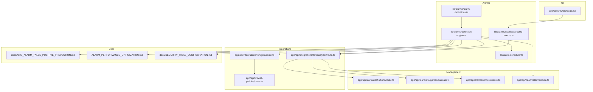
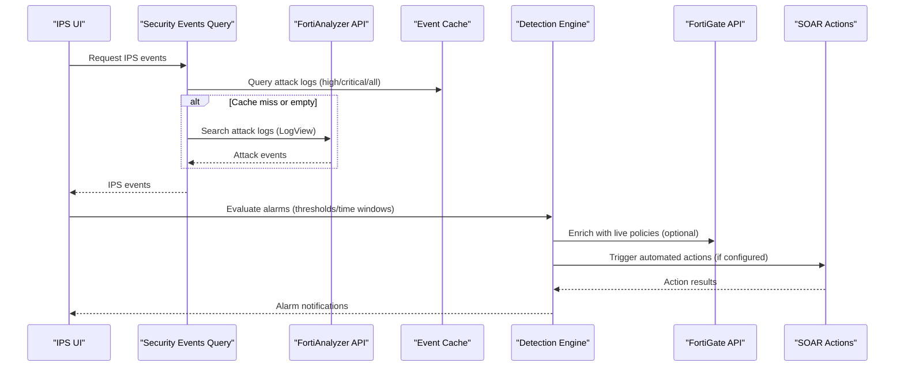
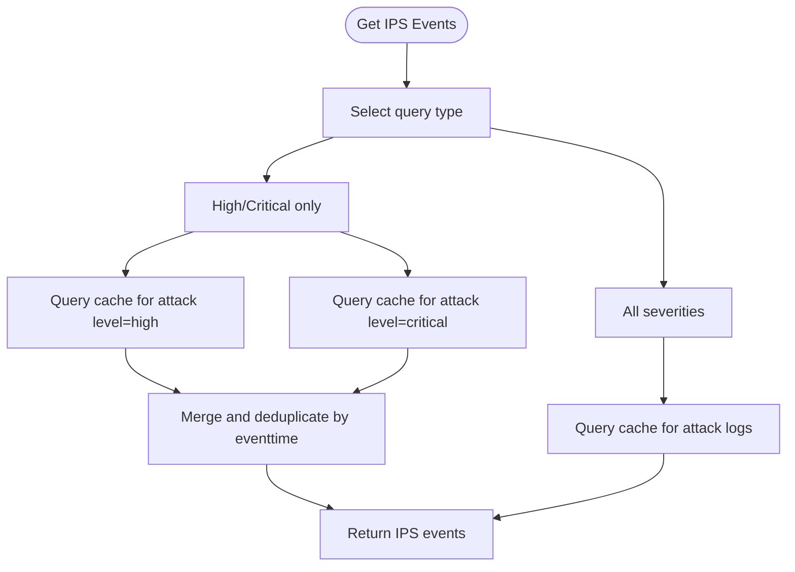
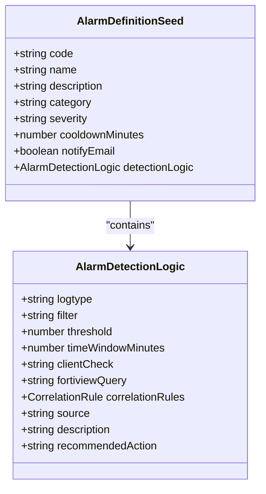
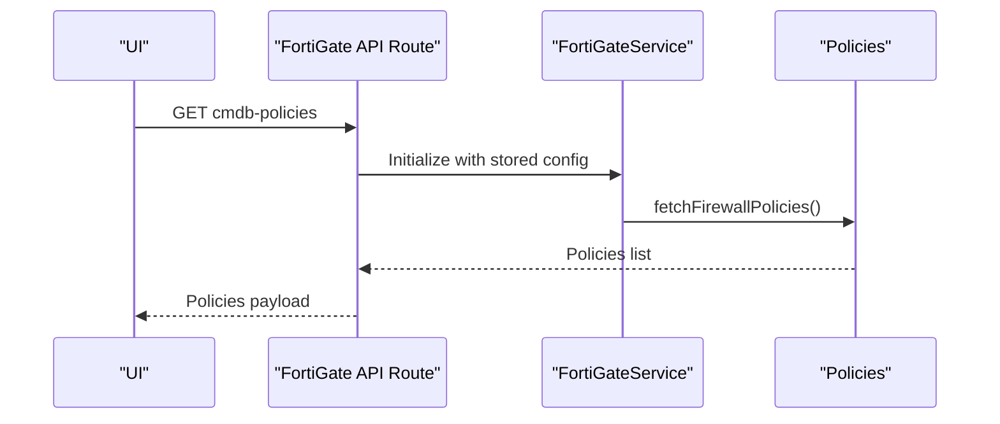
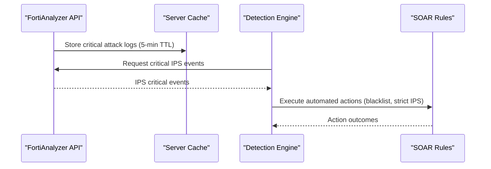
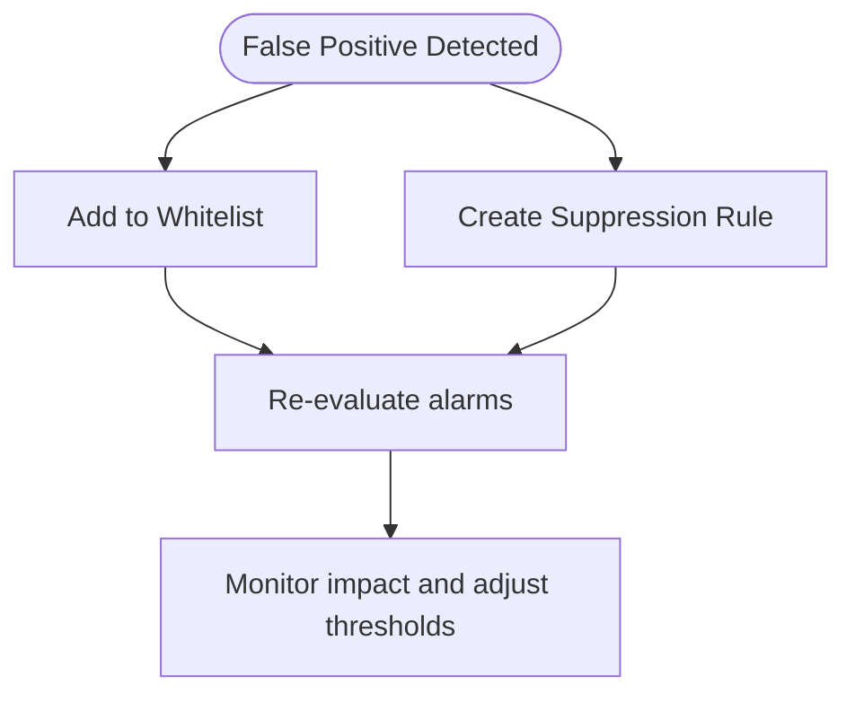
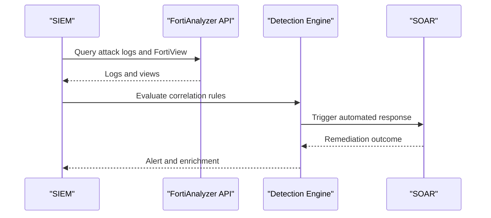
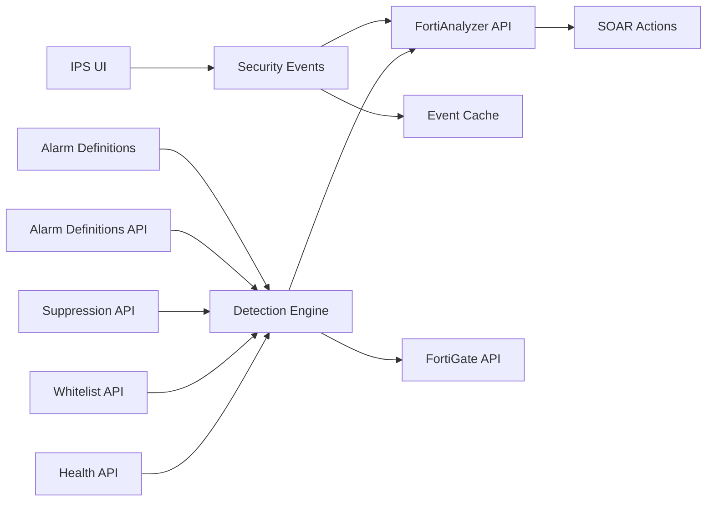

# Intrusion Prevention System (IPS)

<cite>
**Referenced Files in This Document**
- [page.tsx](file://app/security/ips/page.tsx)
- [security-events.ts](file://lib/alarms/queries/security-events.ts)
- [alarm-definitions.ts](file://lib/alarms/alarm-definitions.ts)
- [route.ts](file://app/api/integrations/fortianalyzer/route.ts)
- [route.ts](file://app/api/integrations/fortigate/route.ts)
- [route.ts](file://app/api/firewall-policies/route.ts)
- [faz_soar.htm](file://api-ref/faz_soar.htm)
- [NMS_ALARM_FALSE_POSITIVE_PREVENTION.md](file://docs/NMS_ALARM_FALSE_POSITIVE_PREVENTION.md)
- [ALARM_PERFORMANCE_OPTIMIZATION.md](file://ALARM_PERFORMANCE_OPTIMIZATION.md)
- [SECURITY_RISKS_CONFIGURATION.md](file://docs/SECURITY_RISKS_CONFIGURATION.md)
- [route.ts](file://app/api/alarms/definitions/route.ts)
- [route.ts](file://app/api/alarms/suppression/route.ts)
- [route.ts](file://app/api/alarms/whitelist/route.ts)
- [route.ts](file://app/api/health/alarms/route.ts)
- [alarm-scheduler.ts](file://lib/alarm-scheduler.ts)
- [detection-engine.ts](file://lib/alarms/detection-engine.ts)
</cite>

## Table of Contents
1. [Introduction](#introduction)
2. [Project Structure](#project-structure)
3. [Core Components](#core-components)
4. [Architecture Overview](#architecture-overview)
5. [Detailed Component Analysis](#detailed-component-analysis)
6. [Dependency Analysis](#dependency-analysis)
7. [Performance Considerations](#performance-considerations)
8. [Troubleshooting Guide](#troubleshooting-guide)
9. [Conclusion](#conclusion)
10. [Appendices](#appendices)

## Introduction
This document describes the Intrusion Prevention System (IPS) management capabilities implemented in the platform. It covers signature-based detection, anomaly-based monitoring, and policy configuration. It also documents IPS rule management, threshold tuning, false positive reduction, integration with Fortinet IPS engines, real-time threat intelligence, and automated response actions. Additional topics include signature updates, custom rule creation, policy scheduling, performance monitoring, rule optimization, compliance reporting, and SIEM integration with incident response workflows.

## Project Structure
The IPS-related functionality spans several areas:
- UI placeholder for IPS/DOS events
- Alarm query layer for IPS events
- Alarm definitions and detection engine
- FortiAnalyzer integration for IPS logs and SOAR actions
- FortiGate integration for policy retrieval and configuration
- Alarm management APIs for thresholds, whitelisting, and suppression
- Health monitoring for alarm subsystems

**Diagram sources**
- [page.tsx:1-35](file://app/security/ips/page.tsx#L1-L35)
- [security-events.ts:1-292](file://lib/alarms/queries/security-events.ts#L1-L292)
- [alarm-definitions.ts:1-200](file://lib/alarms/alarm-definitions.ts#L1-L200)
- [route.ts:1-392](file://app/api/integrations/fortianalyzer/route.ts#L1-L392)
- [route.ts:206-233](file://app/api/integrations/fortigate/route.ts#L206-L233)
- [route.ts:50-77](file://app/api/firewall-policies/route.ts#L50-L77)
- [route.ts:1-60](file://app/api/alarms/definitions/route.ts#L1-L60)
- [route.ts:1-80](file://app/api/alarms/suppression/route.ts#L1-L80)
- [route.ts:1-60](file://app/api/alarms/whitelist/route.ts#L1-L60)
- [route.ts:37-150](file://app/api/health/alarms/route.ts#L37-L150)
- [alarm-scheduler.ts:1-60](file://lib/alarm-scheduler.ts#L1-L60)
- [detection-engine.ts:119-184](file://lib/alarms/detection-engine.ts#L119-L184)

**Section sources**
- [page.tsx:1-35](file://app/security/ips/page.tsx#L1-L35)
- [security-events.ts:1-292](file://lib/alarms/queries/security-events.ts#L1-L292)
- [alarm-definitions.ts:1-200](file://lib/alarms/alarm-definitions.ts#L1-L200)
- [route.ts:1-392](file://app/api/integrations/fortianalyzer/route.ts#L1-L392)
- [route.ts:206-233](file://app/api/integrations/fortigate/route.ts#L206-L233)
- [route.ts:50-77](file://app/api/firewall-policies/route.ts#L50-L77)
- [route.ts:1-60](file://app/api/alarms/definitions/route.ts#L1-L60)
- [route.ts:1-80](file://app/api/alarms/suppression/route.ts#L1-L80)
- [route.ts:1-60](file://app/api/alarms/whitelist/route.ts#L1-L60)
- [route.ts:37-150](file://app/api/health/alarms/route.ts#L37-L150)
- [alarm-scheduler.ts:1-60](file://lib/alarm-scheduler.ts#L1-L60)
- [detection-engine.ts:119-184](file://lib/alarms/detection-engine.ts#L119-L184)

## Core Components
- IPS event ingestion and querying:
  - Signature-based detection via attack logs with severity filtering
  - All IPS events for correlation workflows
- Alarm definitions and detection engine:
  - Centralized alarm definitions with thresholds and time windows
  - Detection engine evaluates definitions against cached and live sources
- FortiAnalyzer integration:
  - IPS critical events retrieval with caching
  - SOAR rule actions for automated remediation
- FortiGate integration:
  - Firewall policy retrieval and enrichment
- Management APIs:
  - Update thresholds and enable/disable alarms
  - Whitelist and suppression management
- Health monitoring:
  - Scheduler, cache, and detection health checks

**Section sources**
- [security-events.ts:18-91](file://lib/alarms/queries/security-events.ts#L18-L91)
- [alarm-definitions.ts:16-40](file://lib/alarms/alarm-definitions.ts#L16-L40)
- [detection-engine.ts:1965-1989](file://lib/alarms/detection-engine.ts#L1965-L1989)
- [route.ts:236-268](file://app/api/integrations/fortianalyzer/route.ts#L236-L268)
- [faz_soar.htm:940-973](file://api-ref/faz_soar.htm#L940-L973)
- [route.ts:206-233](file://app/api/integrations/fortigate/route.ts#L206-L233)
- [route.ts:1-60](file://app/api/alarms/definitions/route.ts#L1-L60)
- [route.ts:1-80](file://app/api/alarms/suppression/route.ts#L1-L80)
- [route.ts:1-60](file://app/api/alarms/whitelist/route.ts#L1-L60)
- [route.ts:37-150](file://app/api/health/alarms/route.ts#L37-L150)

## Architecture Overview
The IPS management architecture integrates UI, alarm query layer, detection engine, and Fortinet integrations. It retrieves IPS events from FortiAnalyzer, applies thresholds and time windows, and triggers alarms. Automated responses can be initiated via SOAR rules.

**Diagram sources**
- [security-events.ts:34-91](file://lib/alarms/queries/security-events.ts#L34-L91)
- [route.ts:236-268](file://app/api/integrations/fortianalyzer/route.ts#L236-L268)
- [detection-engine.ts:1965-1989](file://lib/alarms/detection-engine.ts#L1965-L1989)
- [route.ts:206-233](file://app/api/integrations/fortigate/route.ts#L206-L233)
- [faz_soar.htm:940-973](file://api-ref/faz_soar.htm#L940-L973)

## Detailed Component Analysis

### IPS Event Queries and Signature-Based Detection
- High-severity IPS events:
  - Filters attack logs by level high or critical
  - Deduplicates by event time across concurrent queries
- All IPS events:
  - Retrieves all attack logs for correlation workflows
- Malware and IOC coverage:
  - Complements IPS detection with malware and IOC hits

**Diagram sources**
- [security-events.ts:34-91](file://lib/alarms/queries/security-events.ts#L34-L91)

**Section sources**
- [security-events.ts:18-91](file://lib/alarms/queries/security-events.ts#L18-L91)

### Alarm Definitions and Threshold Tuning
- Alarm definitions specify:
  - logtype, filter, threshold, timeWindowMinutes
  - Optional client-side checks and correlation rules
- Threshold tuning:
  - Adjust thresholds and time windows via management API
  - Cooldown minutes prevent duplicate triggers
- Example definitions:
  - Configuration change and access anomaly alarms demonstrate structured detection logic

**Diagram sources**
- [alarm-definitions.ts:16-40](file://lib/alarms/alarm-definitions.ts#L16-L40)

**Section sources**
- [alarm-definitions.ts:16-40](file://lib/alarms/alarm-definitions.ts#L16-L40)
- [route.ts:1-60](file://app/api/alarms/definitions/route.ts#L1-L60)

### Policy Configuration and Firewall Integration
- Policy retrieval:
  - FortiGate integration fetches live firewall policies for enrichment
- Policy scheduling:
  - Policies include schedule metadata for temporal control
- Configuration management:
  - UI/API supports saving and testing FortiAnalyzer connectivity

**Diagram sources**
- [route.ts:206-233](file://app/api/integrations/fortigate/route.ts#L206-L233)
- [route.ts:50-77](file://app/api/firewall-policies/route.ts#L50-L77)

**Section sources**
- [route.ts:206-233](file://app/api/integrations/fortigate/route.ts#L206-L233)
- [route.ts:50-77](file://app/api/firewall-policies/route.ts#L50-L77)

### Real-Time Threat Intelligence and Automated Response
- IPS critical events:
  - FortiAnalyzer API retrieves critical attack logs with server-side caching
- SOAR actions:
  - Predefined SOAR rules include CLI scripts for blacklist and strict IPS activation
- Integration points:
  - Detection engine can trigger SOAR actions upon alarm firing

**Diagram sources**
- [route.ts:236-268](file://app/api/integrations/fortianalyzer/route.ts#L236-L268)
- [faz_soar.htm:940-973](file://api-ref/faz_soar.htm#L940-L973)
- [detection-engine.ts:1965-1989](file://lib/alarms/detection-engine.ts#L1965-L1989)

**Section sources**
- [route.ts:236-268](file://app/api/integrations/fortianalyzer/route.ts#L236-L268)
- [faz_soar.htm:940-973](file://api-ref/faz_soar.htm#L940-L973)
- [detection-engine.ts:1965-1989](file://lib/alarms/detection-engine.ts#L1965-L1989)

### False Positive Reduction and Rule Management
- Whitelist and suppression:
  - Manage whitelisted entries and suppression rules to reduce false positives
- False positive prevention:
  - Dedicated documentation outlines strategies and controls
- Rule optimization:
  - Performance optimization guidelines help tune detection latency and throughput

**Diagram sources**
- [route.ts:1-60](file://app/api/alarms/whitelist/route.ts#L1-L60)
- [route.ts:1-80](file://app/api/alarms/suppression/route.ts#L1-L80)
- [NMS_ALARM_FALSE_POSITIVE_PREVENTION.md:1-200](file://docs/NMS_ALARM_FALSE_POSITIVE_PREVENTION.md#L1-L200)
- [ALARM_PERFORMANCE_OPTIMIZATION.md:1-200](file://ALARM_PERFORMANCE_OPTIMIZATION.md#L1-L200)

**Section sources**
- [route.ts:1-60](file://app/api/alarms/whitelist/route.ts#L1-L60)
- [route.ts:1-80](file://app/api/alarms/suppression/route.ts#L1-L80)
- [NMS_ALARM_FALSE_POSITIVE_PREVENTION.md:1-200](file://docs/NMS_ALARM_FALSE_POSITIVE_PREVENTION.md#L1-L200)
- [ALARM_PERFORMANCE_OPTIMIZATION.md:1-200](file://ALARM_PERFORMANCE_OPTIMIZATION.md#L1-L200)

### Signature Updates and Custom Rule Creation
- Signature updates:
  - Managed via FortiAnalyzer integration; critical IPS events are cached and retrieved for visibility
- Custom rule creation:
  - Use alarm definitions to create new detection rules with tailored thresholds and filters
- Policy scheduling:
  - Policies carry schedule metadata enabling time-based activation

**Section sources**
- [route.ts:236-268](file://app/api/integrations/fortianalyzer/route.ts#L236-L268)
- [alarm-definitions.ts:16-40](file://lib/alarms/alarm-definitions.ts#L16-L40)
- [route.ts:50-77](file://app/api/firewall-policies/route.ts#L50-L77)

### SIEM Integration and Incident Response Workflows
- SIEM integration:
  - FortiAnalyzer API supports event log retrieval and FortiView dashboards for correlation
- Incident response:
  - Automated actions (SOAR) can be triggered on alarm firing
  - Health monitoring ensures timely detection and response

**Diagram sources**
- [route.ts:287-368](file://app/api/integrations/fortianalyzer/route.ts#L287-L368)
- [faz_soar.htm:940-973](file://api-ref/faz_soar.htm#L940-L973)
- [detection-engine.ts:1965-1989](file://lib/alarms/detection-engine.ts#L1965-L1989)

**Section sources**
- [route.ts:287-368](file://app/api/integrations/fortianalyzer/route.ts#L287-L368)
- [faz_soar.htm:940-973](file://api-ref/faz_soar.htm#L940-L973)
- [detection-engine.ts:1965-1989](file://lib/alarms/detection-engine.ts#L1965-L1989)

## Dependency Analysis
- UI depends on alarm query layer for IPS events
- Detection engine depends on alarm definitions and integrations
- FortiAnalyzer integration provides IPS logs and SOAR actions
- FortiGate integration enriches with live policies
- Management APIs control thresholds, whitelists, and suppression
- Health APIs monitor subsystems

**Diagram sources**
- [page.tsx:1-35](file://app/security/ips/page.tsx#L1-L35)
- [security-events.ts:1-292](file://lib/alarms/queries/security-events.ts#L1-L292)
- [alarm-definitions.ts:1-200](file://lib/alarms/alarm-definitions.ts#L1-L200)
- [route.ts:1-392](file://app/api/integrations/fortianalyzer/route.ts#L1-L392)
- [route.ts:206-233](file://app/api/integrations/fortigate/route.ts#L206-L233)
- [route.ts:1-60](file://app/api/alarms/definitions/route.ts#L1-L60)
- [route.ts:1-80](file://app/api/alarms/suppression/route.ts#L1-L80)
- [route.ts:1-60](file://app/api/alarms/whitelist/route.ts#L1-L60)
- [route.ts:37-150](file://app/api/health/alarms/route.ts#L37-L150)

**Section sources**
- [page.tsx:1-35](file://app/security/ips/page.tsx#L1-L35)
- [security-events.ts:1-292](file://lib/alarms/queries/security-events.ts#L1-L292)
- [alarm-definitions.ts:1-200](file://lib/alarms/alarm-definitions.ts#L1-L200)
- [route.ts:1-392](file://app/api/integrations/fortianalyzer/route.ts#L1-L392)
- [route.ts:206-233](file://app/api/integrations/fortigate/route.ts#L206-L233)
- [route.ts:1-60](file://app/api/alarms/definitions/route.ts#L1-L60)
- [route.ts:1-80](file://app/api/alarms/suppression/route.ts#L1-L80)
- [route.ts:1-60](file://app/api/alarms/whitelist/route.ts#L1-L60)
- [route.ts:37-150](file://app/api/health/alarms/route.ts#L37-L150)

## Performance Considerations
- Caching:
  - FortiAnalyzer critical IPS events cached for 5 minutes to reduce load
- Query optimization:
  - Index-friendly filters (e.g., level column) improve performance
- Scheduler and health:
  - Scheduler stale thresholds and detection health checks ensure responsiveness

**Section sources**
- [route.ts:13-27](file://app/api/integrations/fortianalyzer/route.ts#L13-L27)
- [security-events.ts:8-13](file://lib/alarms/queries/security-events.ts#L8-L13)
- [route.ts:37-150](file://app/api/health/alarms/route.ts#L37-L150)
- [ALARM_PERFORMANCE_OPTIMIZATION.md:1-200](file://ALARM_PERFORMANCE_OPTIMIZATION.md#L1-L200)

## Troubleshooting Guide
- FortiAnalyzer connectivity:
  - Test and save configuration via dedicated API routes
- Empty results:
  - Fallback to NMS EventCache when FortiAnalyzer returns empty
- Alarm health:
  - Monitor scheduler, cache, and detection staleness thresholds
- False positives:
  - Use whitelists and suppression rules; consult false positive prevention guide

**Section sources**
- [route.ts:30-108](file://app/api/integrations/fortianalyzer/route.ts#L30-L108)
- [route.ts:172-230](file://app/api/integrations/fortianalyzer/route.ts#L172-L230)
- [route.ts:37-150](file://app/api/health/alarms/route.ts#L37-L150)
- [route.ts:1-60](file://app/api/alarms/whitelist/route.ts#L1-L60)
- [route.ts:1-80](file://app/api/alarms/suppression/route.ts#L1-L80)
- [NMS_ALARM_FALSE_POSITIVE_PREVENTION.md:1-200](file://docs/NMS_ALARM_FALSE_POSITIVE_PREVENTION.md#L1-L200)

## Conclusion
The platform provides a robust IPS management framework integrating signature-based detection, anomaly monitoring, policy configuration, and automated response. Through FortiAnalyzer and FortiGate integrations, it delivers real-time threat intelligence, configurable thresholds, and operational controls for reducing false positives and optimizing performance. SIEM integration and health monitoring round out a comprehensive IPS management solution.

## Appendices
- Example configurations and scenarios:
  - High-severity IPS events, correlation with outbound traffic, and off-hours VPN usage
- Compliance reporting:
  - Leverage configuration change and access anomaly alarms for audit trails

[No sources needed since this section provides general guidance]