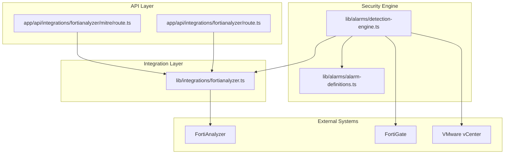
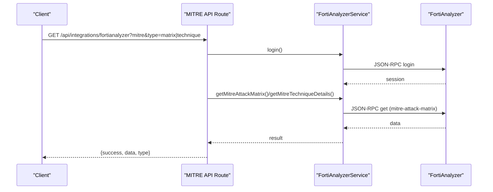
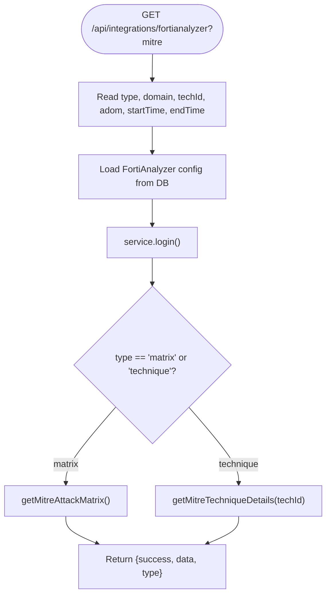
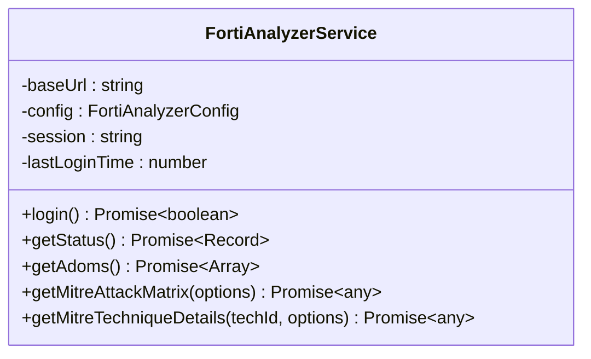
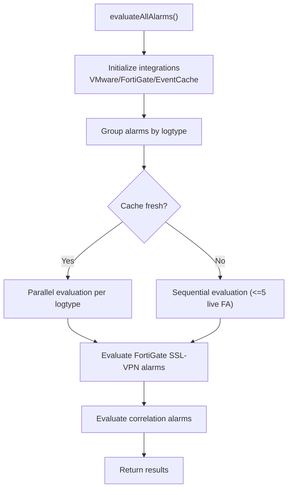
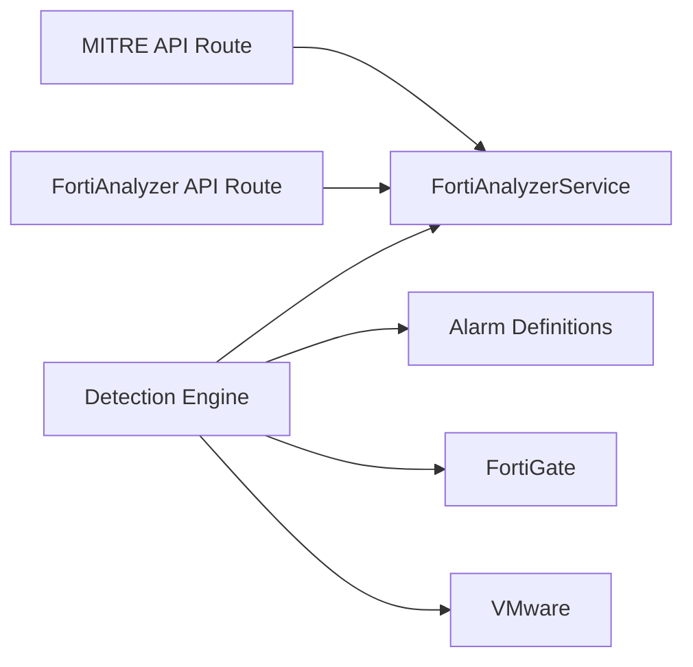

# MITRE ATT&CK Framework

<cite>
**Referenced Files in This Document**
- [route.ts](file://app/api/integrations/fortianalyzer/mitre/route.ts)
- [fortianalyzer.ts](file://lib/integrations/fortianalyzer.ts)
- [route.ts](file://app/api/integrations/fortianalyzer/route.ts)
- [alarm-definitions.ts](file://lib/alarms/alarm-definitions.ts)
- [detection-engine.ts](file://lib/alarms/detection-engine.ts)
- [SECURITY_RISKS_CONFIGURATION.md](file://docs/20-modules/security/SECURITY_RISKS_CONFIGURATION.md)
</cite>

## Table of Contents
1. [Introduction](#introduction)
2. [Project Structure](#project-structure)
3. [Core Components](#core-components)
4. [Architecture Overview](#architecture-overview)
5. [Detailed Component Analysis](#detailed-component-analysis)
6. [Dependency Analysis](#dependency-analysis)
7. [Performance Considerations](#performance-considerations)
8. [Troubleshooting Guide](#troubleshooting-guide)
9. [Conclusion](#conclusion)
10. [Appendices](#appendices)

## Introduction
This document explains how the project integrates MITRE ATT&CK into security operations, focusing on:
- ATT&CK matrix visualization and technique details retrieval
- Technique scoring and correlation with security events
- Automated threat hunting workflows and anomaly detection
- Integration touchpoints with FortiAnalyzer, FortiGate, and VMware
- Playbooks and analyst workflow automation
- Custom tactic development, framework updates, and compliance reporting

Where applicable, this document references concrete source files and highlights how the system retrieves ATT&CK data from FortiAnalyzer and correlates it with security events.

## Project Structure
The ATT&CK integration centers around:
- A FortiAnalyzer service that authenticates and queries FortiView and event APIs
- An API route that exposes MITRE matrix and technique endpoints
- Security alarm definitions and detection engine that power behavioral analysis and anomaly detection
- Documentation that outlines risk mapping and MITRE ATT&CK alignment

**Diagram sources**
- [route.ts:1-77](file://app/api/integrations/fortianalyzer/mitre/route.ts#L1-L77)
- [route.ts:110-392](file://app/api/integrations/fortianalyzer/route.ts#L110-L392)
- [fortianalyzer.ts:146-1073](file://lib/integrations/fortianalyzer.ts#L146-L1073)
- [alarm-definitions.ts:1-1826](file://lib/alarms/alarm-definitions.ts#L1-L1826)
- [detection-engine.ts:1-4068](file://lib/alarms/detection-engine.ts#L1-L4068)

**Section sources**
- [route.ts:1-77](file://app/api/integrations/fortianalyzer/mitre/route.ts#L1-L77)
- [route.ts:110-392](file://app/api/integrations/fortianalyzer/route.ts#L110-L392)
- [fortianalyzer.ts:146-1073](file://lib/integrations/fortianalyzer.ts#L146-L1073)
- [alarm-definitions.ts:1-1826](file://lib/alarms/alarm-definitions.ts#L1-L1826)
- [detection-engine.ts:1-4068](file://lib/alarms/detection-engine.ts#L1-L4068)

## Core Components
- MITRE API route: Provides endpoints to fetch ATT&CK matrix and technique details from FortiAnalyzer.
- FortiAnalyzer service: Handles authentication, session lifecycle, and API calls to FortiView and event mgmt endpoints.
- Alarm definitions: Define detection logic across log types, thresholds, and client-side checks (including anomalies and correlations).
- Detection engine: Executes alarm evaluation, supports correlation rules, and integrates with FortiGate and VMware.

**Section sources**
- [route.ts:1-77](file://app/api/integrations/fortianalyzer/mitre/route.ts#L1-L77)
- [fortianalyzer.ts:146-1073](file://lib/integrations/fortianalyzer.ts#L146-L1073)
- [alarm-definitions.ts:1-1826](file://lib/alarms/alarm-definitions.ts#L1-L1826)
- [detection-engine.ts:1-4068](file://lib/alarms/detection-engine.ts#L1-L4068)

## Architecture Overview
The MITRE integration is layered:
- Presentation/API: Exposes MITRE endpoints with typed parameters (matrix/technique, domain, time range, ADOM).
- Integration: FortiAnalyzer service encapsulates authentication, session management, and API calls.
- Security engine: Evaluates alarms and correlates events to detect attack patterns and anomalies.

**Diagram sources**
- [route.ts:6-76](file://app/api/integrations/fortianalyzer/mitre/route.ts#L6-L76)
- [fortianalyzer.ts:280-433](file://lib/integrations/fortianalyzer.ts#L280-L433)
- [fortianalyzer.ts:958-956](file://lib/integrations/fortianalyzer.ts#L958-L956)

## Detailed Component Analysis

### MITRE API Route
- Supports two modes:
  - Matrix: Retrieves ATT&CK matrix data optionally scoped by domain, time range, and ADOM.
  - Technique: Retrieves metadata and handler summary for a given technique ID.
- Validates parameters and returns structured JSON with success flag and data payload.

**Diagram sources**
- [route.ts:6-76](file://app/api/integrations/fortianalyzer/mitre/route.ts#L6-L76)

**Section sources**
- [route.ts:1-77](file://app/api/integrations/fortianalyzer/mitre/route.ts#L1-L77)

### FortiAnalyzer Service (ATT&CK Retrieval)
- Authentication and session lifecycle:
  - Username/password login with retry/backoff and global mutex to prevent concurrent logins.
  - Session TTL and invalidation handling for stale sessions.
- ATT&CK retrieval:
  - getMitreAttackMatrix(domain, timeRange, adom)
  - getMitreTechniqueDetails(techId, options)
- Robust error handling and response parsing for JSON-RPC endpoints.

**Diagram sources**
- [fortianalyzer.ts:146-1073](file://lib/integrations/fortianalyzer.ts#L146-L1073)

**Section sources**
- [fortianalyzer.ts:146-1073](file://lib/integrations/fortianalyzer.ts#L146-L1073)

### ATT&CK Matrix Visualization and Technique Scoring
- Matrix retrieval:
  - The MITRE API route calls the service’s matrix method and returns the result to the client.
  - Time range and ADOM scoping are supported to focus on specific windows or tenants.
- Technique details:
  - Technique metadata and handler summary are fetched for drill-down analysis.
- Scoring and correlation:
  - Technique scoring is derived from handler counts and event/incident counts returned by FortiAnalyzer.
  - Correlation with security events is performed by the detection engine using alarm definitions.

**Section sources**
- [route.ts:57-67](file://app/api/integrations/fortianalyzer/mitre/route.ts#L57-L67)
- [fortianalyzer.ts:958-956](file://lib/integrations/fortianalyzer.ts#L958-L956)

### Behavioral Analysis and Anomaly Detection
- Alarm definitions define detection logic across multiple log types (event, attack, traffic, dns, webfilter, app-ctrl).
- Client-side checks enable anomaly detection and correlation:
  - Anomaly detection (e.g., policy hit spikes, top talkers, geo anomalies).
  - Correlation rules to detect multi-vector attacks and temporal sequences.
- Detection engine:
  - Groups alarms by log type, batches searches, and evaluates locally for speed.
  - Supports correlation alarms that cross-reference recent alarm events with secondary log searches.

**Diagram sources**
- [detection-engine.ts:276-521](file://lib/alarms/detection-engine.ts#L276-L521)

**Section sources**
- [alarm-definitions.ts:1-1826](file://lib/alarms/alarm-definitions.ts#L1-L1826)
- [detection-engine.ts:276-521](file://lib/alarms/detection-engine.ts#L276-L521)

### Automated Threat Hunting Workflows
- MITRE technique mapping:
  - Use technique details to map observed events to ATT&CK techniques and sub-techniques.
- Kill chain analysis:
  - Correlation rules connect precursor alarms to secondary events, enabling kill chain reconstruction.
- Attack pattern recognition:
  - Multi-vector attack detection leverages distinct alarm codes from the same source IP.

**Section sources**
- [detection-engine.ts:588-772](file://lib/alarms/detection-engine.ts#L588-L772)
- [alarm-definitions.ts:7-39](file://lib/alarms/alarm-definitions.ts#L7-L39)

### Integration Touchpoints
- FortiAnalyzer:
  - Direct JSON-RPC calls for status, ADOMs, devices, and ATT&CK endpoints.
  - Log search and FortiView queries for telemetry and dashboards.
- FortiGate:
  - SSL-VPN user monitoring and policy evaluation.
- VMware:
  - VM lifecycle and configuration change detection integrated into alarm evaluation.

**Section sources**
- [route.ts:110-392](file://app/api/integrations/fortianalyzer/route.ts#L110-L392)
- [detection-engine.ts:103-184](file://lib/alarms/detection-engine.ts#L103-L184)

### Threat Hunting Playbooks and Analyst Automation
- Playbook patterns:
  - Use correlation rules to build multi-stage hunting flows (e.g., configuration change followed by traffic spike).
  - Apply anomaly detection to identify unusual behavior across traffic, DNS, and application control logs.
- Automation:
  - Detection engine runs periodic evaluations, applies suppression rules, and retries failed notifications.

**Section sources**
- [detection-engine.ts:588-772](file://lib/alarms/detection-engine.ts#L588-L772)
- [alarm-definitions.ts:470-555](file://lib/alarms/alarm-definitions.ts#L470-L555)

### Custom Tactics, Framework Updates, and Compliance Reporting
- Custom tactics:
  - Extend alarm definitions with new detection logic and client-side checks tailored to organizational needs.
- Framework updates:
  - Align ATT&CK matrix and technique details with upstream MITRE updates by adjusting domain/time range parameters.
- Compliance reporting:
  - Risk registry and mapping to security controls can be derived from threat logs and policy violations.

**Section sources**
- [SECURITY_RISKS_CONFIGURATION.md:142-250](file://docs/20-modules/security/SECURITY_RISKS_CONFIGURATION.md#L142-L250)
- [SECURITY_RISKS_CONFIGURATION.md:428-463](file://docs/20-modules/security/SECURITY_RISKS_CONFIGURATION.md#L428-L463)

## Dependency Analysis

**Diagram sources**
- [route.ts:1-77](file://app/api/integrations/fortianalyzer/mitre/route.ts#L1-L77)
- [route.ts:1-392](file://app/api/integrations/fortianalyzer/route.ts#L1-L392)
- [fortianalyzer.ts:146-1073](file://lib/integrations/fortianalyzer.ts#L146-L1073)
- [detection-engine.ts:1-4068](file://lib/alarms/detection-engine.ts#L1-L4068)
- [alarm-definitions.ts:1-1826](file://lib/alarms/alarm-definitions.ts#L1-L1826)

**Section sources**
- [route.ts:1-77](file://app/api/integrations/fortianalyzer/mitre/route.ts#L1-L77)
- [route.ts:110-392](file://app/api/integrations/fortianalyzer/route.ts#L110-L392)
- [fortianalyzer.ts:146-1073](file://lib/integrations/fortianalyzer.ts#L146-L1073)
- [detection-engine.ts:1-4068](file://lib/alarms/detection-engine.ts#L1-L4068)
- [alarm-definitions.ts:1-1826](file://lib/alarms/alarm-definitions.ts#L1-L1826)

## Performance Considerations
- Session management and backoff reduce repeated login failures and account lockouts.
- Parallel evaluation of logtype groups and batching of filters minimize FortiAnalyzer load.
- In-memory and global caching for FortiView and event logs reduces latency and API pressure.
- Retry mechanisms with exponential backoff improve resilience for transient failures.

[No sources needed since this section provides general guidance]

## Troubleshooting Guide
- Authentication failures:
  - Check credentials and account lock status; the service applies backoff and clears sessions on errors.
- Session expiration:
  - The service detects stale sessions and invalidates them to prevent cascading failures.
- API timeouts and retries:
  - The service wraps operations with retry logic and uses AbortController timeouts to avoid hanging requests.
- Cache freshness:
  - The detection engine ensures cache freshness and falls back to live API when needed.

**Section sources**
- [fortianalyzer.ts:280-433](file://lib/integrations/fortianalyzer.ts#L280-L433)
- [fortianalyzer.ts:700-766](file://lib/integrations/fortianalyzer.ts#L700-L766)
- [detection-engine.ts:327-344](file://lib/alarms/detection-engine.ts#L327-L344)

## Conclusion
The project provides a robust foundation for MITRE ATT&CK integration by:
- Exposing MITRE matrix and technique endpoints backed by FortiAnalyzer
- Enabling behavioral analysis and anomaly detection through comprehensive alarm definitions and a high-performance detection engine
- Supporting correlation-based threat hunting and analyst automation
- Laying the groundwork for custom tactics, framework updates, and compliance reporting

[No sources needed since this section summarizes without analyzing specific files]

## Appendices
- Example ATT&CK technique mapping:
  - Use technique details to map observed events to techniques and sub-techniques.
- Kill chain analysis:
  - Leverage correlation rules to reconstruct attack progression across multiple stages.
- Threat actor attribution:
  - Combine geo-anomaly and brute-force grouping to identify suspicious sources and refine attribution.

[No sources needed since this section provides general guidance]