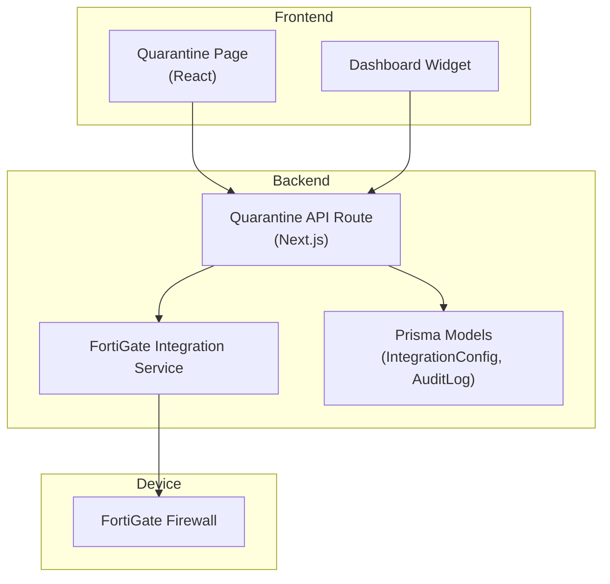
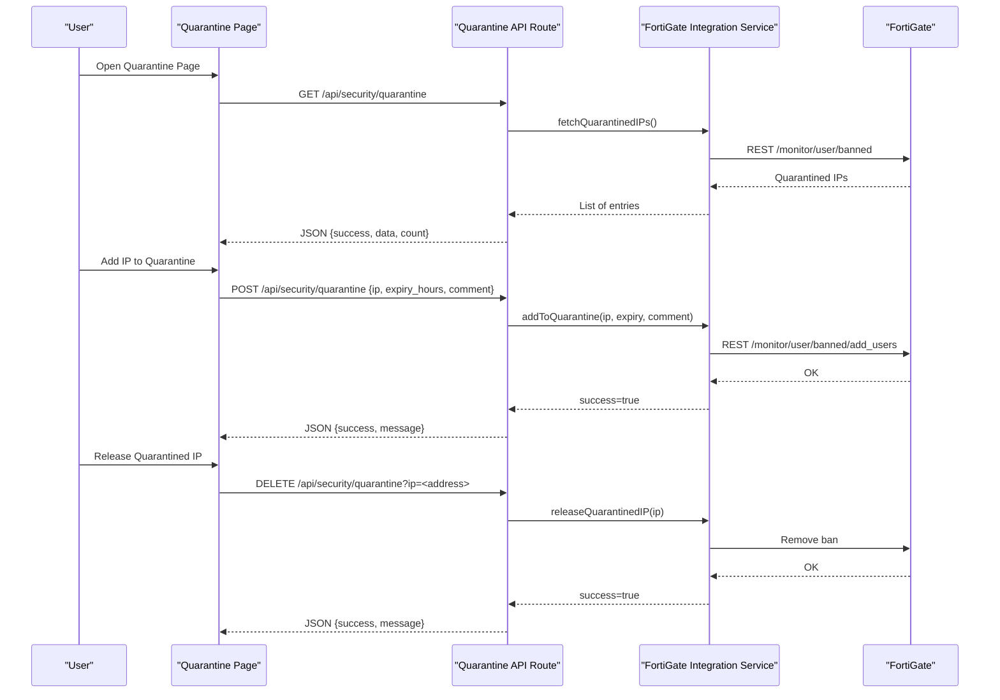
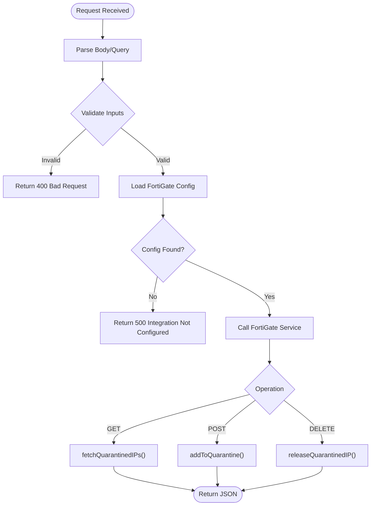
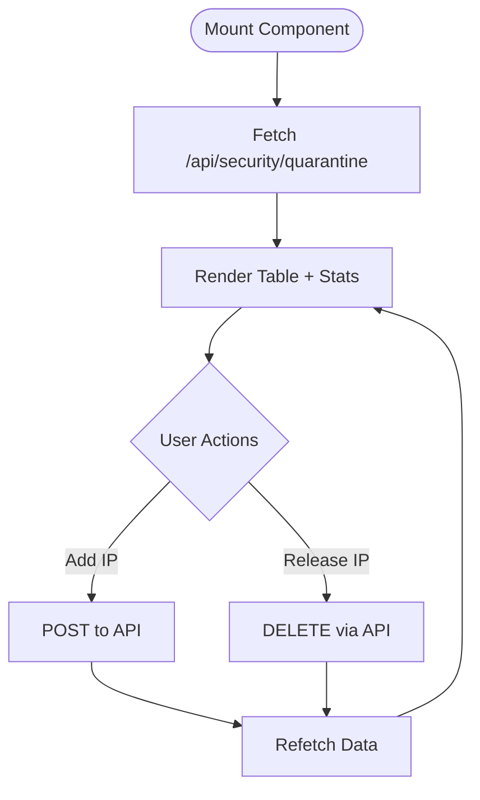
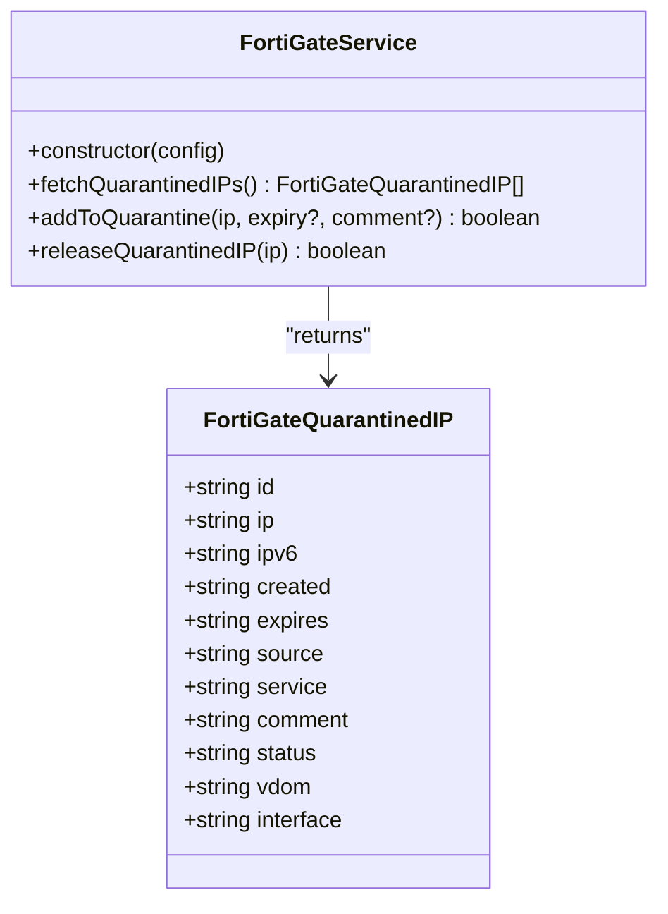
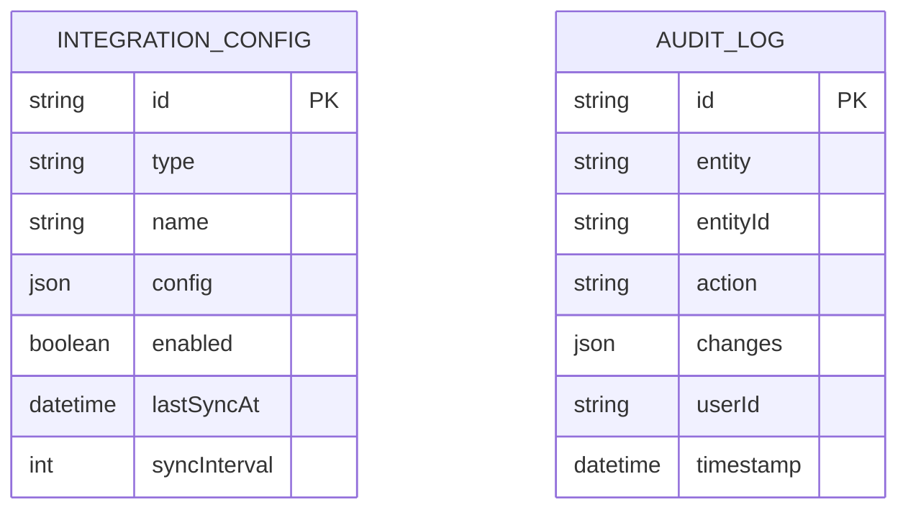
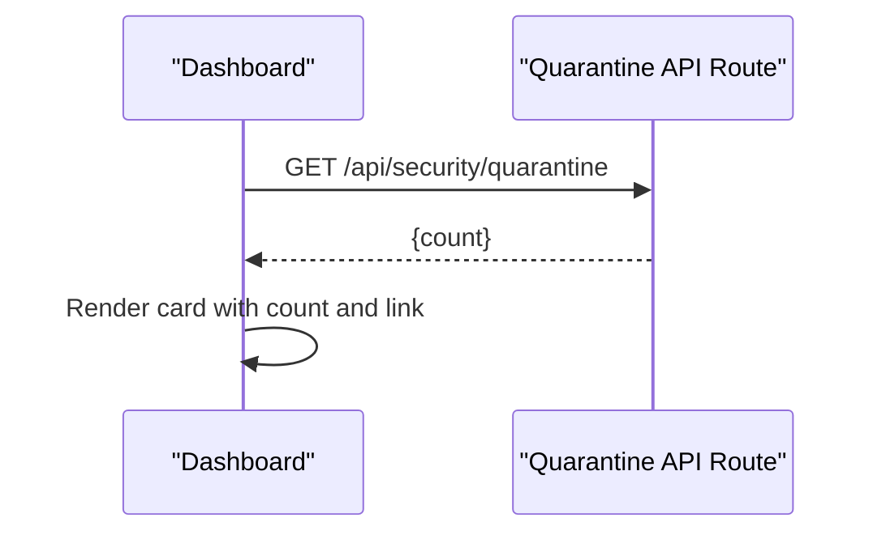
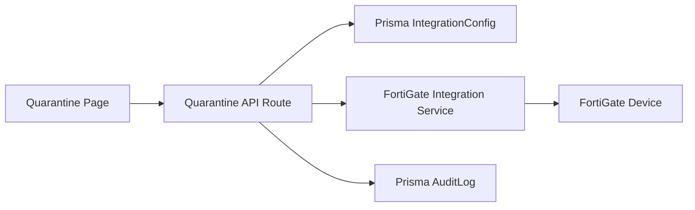

# Quarantine Management

<cite>
**Referenced Files in This Document**
- [route.ts](file://app/api/security/quarantine/route.ts)
- [page.tsx](file://app/security/quarantine/page.tsx)
- [fortigate.ts](file://lib/integrations/fortigate.ts)
- [schema.prisma](file://prisma/schema.prisma)
- [page.tsx](file://app/dashboard/page.tsx)
- [fortigate.md](file://docs/20-modules/integrations/fortigate.md)
</cite>

## Table of Contents
1. [Introduction](#introduction)
2. [Project Structure](#project-structure)
3. [Core Components](#core-components)
4. [Architecture Overview](#architecture-overview)
5. [Detailed Component Analysis](#detailed-component-analysis)
6. [Dependency Analysis](#dependency-analysis)
7. [Performance Considerations](#performance-considerations)
8. [Troubleshooting Guide](#troubleshooting-guide)
9. [Conclusion](#conclusion)
10. [Appendices](#appendices)

## Introduction
This document describes the quarantine management capabilities implemented in the system. It covers device isolation via firewall bans, automated containment triggered by security events, and remediation workflows for device reintegration. It also documents quarantine zone configuration, network segmentation, traffic filtering, reintegration and health verification, compliance validation, scenario examples, escalation procedures, stakeholder notifications, quarantine duration management, exception requests, audit logging, and integration with SIEM and SOAR systems.

## Project Structure
Quarantine management spans a small set of frontend and backend components:
- API routes expose endpoints to list, add, and remove quarantined IPs.
- A React page renders the quarantine dashboard and supports manual actions.
- An integration service communicates with Fortinet FortiGate devices to enforce and query quarantined entries.
- Prisma models define integration configuration and audit logs.
- A dashboard widget surfaces quarantine counts.

**Diagram sources**
- [route.ts:1-150](file://app/api/security/quarantine/route.ts#L1-L150)
- [page.tsx:1-401](file://app/security/quarantine/page.tsx#L1-L401)
- [fortigate.ts:1-200](file://lib/integrations/fortigate.ts#L1-L200)
- [schema.prisma:764-800](file://prisma/schema.prisma#L764-L800)

**Section sources**
- [route.ts:1-150](file://app/api/security/quarantine/route.ts#L1-L150)
- [page.tsx:1-401](file://app/security/quarantine/page.tsx#L1-L401)
- [fortigate.ts:1-200](file://lib/integrations/fortigate.ts#L1-L200)
- [schema.prisma:764-800](file://prisma/schema.prisma#L764-L800)
- [page.tsx:440-463](file://app/dashboard/page.tsx#L440-L463)

## Core Components
- Quarantine API route: Exposes GET, POST, and DELETE endpoints to list, add, and release quarantined IPs. It validates inputs, delegates to the FortiGate integration service, and returns structured responses.
- Quarantine page: A React component that fetches quarantined entries, displays them in a searchable/paginated table, and supports adding new quarantines and releasing existing ones.
- FortiGate integration service: Provides methods to fetch quarantined IPs and add/release them on the device. It authenticates and interacts with the FortiGate REST API.
- Prisma models: Define integration configuration storage and audit log entries for change tracking.
- Dashboard widget: Displays a summary of quarantined IP counts.

Key responsibilities:
- Device isolation: Enforced by FortiGate bans via the integration service.
- Automated containment: Triggered by security events and reflected in quarantined entries.
- Remediation: Manual release via the UI/API after health verification and compliance checks.
- Compliance and auditing: Integration configuration and audit logs are persisted.

**Section sources**
- [route.ts:53-149](file://app/api/security/quarantine/route.ts#L53-L149)
- [page.tsx:70-168](file://app/security/quarantine/page.tsx#L70-L168)
- [fortigate.ts:1340-1422](file://lib/integrations/fortigate.ts#L1340-L1422)
- [schema.prisma:764-802](file://prisma/schema.prisma#L764-L802)

## Architecture Overview
The quarantine workflow integrates the UI, API, integration service, and FortiGate device. The API route retrieves configuration, invokes the integration service, and returns results to the UI.

**Diagram sources**
- [route.ts:53-149](file://app/api/security/quarantine/route.ts#L53-L149)
- [page.tsx:85-164](file://app/security/quarantine/page.tsx#L85-L164)
- [fortigate.ts:1344-1421](file://lib/integrations/fortigate.ts#L1344-L1421)

## Detailed Component Analysis

### Quarantine API Route
Responsibilities:
- Validate request bodies and query parameters.
- Retrieve FortiGate integration configuration from the database.
- Delegate to the FortiGate integration service for listing, adding, and releasing quarantined IPs.
- Return standardized success/error responses.

Processing logic highlights:
- GET lists quarantined IPs by calling the integration service’s fetch method.
- POST adds an IP to quarantine with optional expiry and comment; converts hours to seconds.
- DELETE removes a quarantine entry by IP.

**Diagram sources**
- [route.ts:53-149](file://app/api/security/quarantine/route.ts#L53-L149)

**Section sources**
- [route.ts:53-149](file://app/api/security/quarantine/route.ts#L53-L149)

### Quarantine Page (UI)
Responsibilities:
- Fetch and render quarantined IP entries.
- Support manual addition with optional expiry and comment.
- Allow releasing quarantined IPs with confirmation.
- Provide statistics and pagination.

Key behaviors:
- Fetches data on mount and refreshes on demand.
- Filters entries by IP, IPv6, source, service, comment, and VDOM.
- Paginates results and shows action messages.
- Uses badges to indicate source categories and expiry status.

**Diagram sources**
- [page.tsx:85-164](file://app/security/quarantine/page.tsx#L85-L164)

**Section sources**
- [page.tsx:70-168](file://app/security/quarantine/page.tsx#L70-L168)

### FortiGate Integration Service
Responsibilities:
- Authenticate and maintain session with FortiGate.
- Fetch quarantined IPs from the device.
- Add IPs to quarantine with optional expiry and comment.
- Release quarantined IPs.

Implementation highlights:
- Uses REST API endpoints for banned users monitoring and management.
- Converts expiry hours to seconds for the device.
- Returns typed results for list, add, and release operations.

**Diagram sources**
- [fortigate.ts:1344-1436](file://lib/integrations/fortigate.ts#L1344-L1436)

**Section sources**
- [fortigate.ts:1344-1421](file://lib/integrations/fortigate.ts#L1344-L1421)
- [fortigate.md:1-7](file://docs/20-modules/integrations/fortigate.md#L1-L7)

### Prisma Models and Audit Logging
- IntegrationConfig stores FortiGate credentials and settings, enabling/disabling modules and sync intervals.
- AuditLog captures changes to entities for compliance and traceability.

**Diagram sources**
- [schema.prisma:764-802](file://prisma/schema.prisma#L764-L802)

**Section sources**
- [schema.prisma:764-802](file://prisma/schema.prisma#L764-L802)

### Dashboard Widget
Displays a summary count of quarantined IPs and links to the quarantine page for quick access.

**Diagram sources**
- [page.tsx:440-463](file://app/dashboard/page.tsx#L440-L463)

**Section sources**
- [page.tsx:440-463](file://app/dashboard/page.tsx#L440-L463)

## Dependency Analysis
- The quarantine API route depends on:
  - Prisma for retrieving integration configuration.
  - FortiGate integration service for device operations.
- The quarantine page depends on:
  - The quarantine API route for data and actions.
- The integration service depends on:
  - FortiGate REST endpoints for banned user management.
- Prisma models underpin configuration and audit logging.

**Diagram sources**
- [route.ts:11-51](file://app/api/security/quarantine/route.ts#L11-L51)
- [page.tsx:85-164](file://app/security/quarantine/page.tsx#L85-L164)
- [fortigate.ts:1344-1421](file://lib/integrations/fortigate.ts#L1344-L1421)
- [schema.prisma:764-802](file://prisma/schema.prisma#L764-L802)

**Section sources**
- [route.ts:11-51](file://app/api/security/quarantine/route.ts#L11-L51)
- [page.tsx:85-164](file://app/security/quarantine/page.tsx#L85-L164)
- [fortigate.ts:1344-1421](file://lib/integrations/fortigate.ts#L1344-L1421)
- [schema.prisma:764-802](file://prisma/schema.prisma#L764-L802)

## Performance Considerations
- API latency is dominated by device REST calls; consider caching short-lived lists and batching frequent refreshes.
- Pagination reduces UI rendering overhead for large lists.
- Session reuse and token-based authentication minimize repeated login overhead.
- Limit concurrent add/release operations to avoid device overload.

## Troubleshooting Guide
Common issues and resolutions:
- Integration not configured:
  - Symptom: API returns an error indicating FortiGate integration is not configured.
  - Resolution: Configure FortiGate integration settings and enable the integration.
- Authentication failures:
  - Symptom: Device rejects requests.
  - Resolution: Verify credentials and access token; ensure the device is reachable and the API endpoint is correct.
- Invalid IP or missing parameters:
  - Symptom: 400 Bad Request on add/release.
  - Resolution: Ensure IP address is provided and expiry is numeric when supplied.
- Device operation failures:
  - Symptom: Add/release returns failure.
  - Resolution: Check device logs and retry; confirm the device supports banned user management.

**Section sources**
- [route.ts:53-149](file://app/api/security/quarantine/route.ts#L53-L149)
- [page.tsx:125-164](file://app/security/quarantine/page.tsx#L125-L164)

## Conclusion
The quarantine management implementation provides a clear, modular pipeline for isolating devices via firewall bans, automating containment through integration with FortiGate, and enabling manual remediation workflows. The UI offers actionable insights and controls, while Prisma-backed configuration and audit logs support compliance and traceability. Extending the system to integrate with SIEM/SOAR tools and formalizing escalation/notification workflows would further strengthen the solution.

## Appendices

### Quarantine Triggers and Policy-Based Isolation
- Triggers:
  - IPS/AV/DOS events detected by integrated systems.
  - Manual operator decisions.
- Policy-based isolation:
  - Leverage FortiGate policy enforcement and address objects to segment traffic and apply bans.
  - Use quarantine comments to record policy context and justification.

### Manual Quarantine Procedures
- Use the quarantine page to add an IP with optional expiry and comment.
- Release IPs after remediation and health verification.

### Quarantine Zone Configuration and Traffic Filtering
- Zones/VDOMs: Quarantine entries include VDOM and interface fields; configure device zones and routing accordingly.
- Traffic filtering: Combine quarantine bans with firewall policies to restrict ingress/egress.

### Reintegration, Health Verification, and Compliance Validation
- Reintegration:
  - Release the IP via the UI/API.
- Health verification:
  - Confirm device health metrics and service availability before lifting restrictions.
- Compliance validation:
  - Review audit logs and integration sync logs for traceability.

### Examples of Quarantine Scenarios
- Scenario 1: IPS detects sustained scanning; system auto-quarantines source IP with 24-hour expiry.
- Scenario 2: Operator observes suspicious lateral movement; manually quarantines endpoint with comment referencing incident ID.
- Scenario 3: Endpoint quarantined for virus detection; after remediation, operator verifies clean scan and releases.

### Escalation Procedures and Stakeholder Notifications
- Escalation:
  - Promote temporary quarantines to permanent blocks after repeat incidents.
  - Notify security team and impacted stakeholders upon significant events.
- Notifications:
  - Integrate with email/SMS/Chat systems to inform stakeholders of quarantine actions and releases.

### Quarantine Duration Management, Exceptions, and Auditing
- Duration management:
  - Set expiry hours per quarantine; permanent quarantines are supported.
- Exceptions:
  - Formal request process to override or shorten quarantine durations.
- Auditing:
  - Use AuditLog entries to track who performed actions and when.

### SIEM and SOAR Integration
- SIEM:
  - Forward quarantine events and device ban logs to SIEM for correlation.
- SOAR:
  - Automate quarantine creation/release based on playbooks and incident tickets.

**Section sources**
- [page.tsx:26-68](file://app/security/quarantine/page.tsx#L26-L68)
- [route.ts:80-114](file://app/api/security/quarantine/route.ts#L80-L114)
- [schema.prisma:390-402](file://prisma/schema.prisma#L390-L402)
- [fortigate.md:1-7](file://docs/20-modules/integrations/fortigate.md#L1-L7)