# Risk Assessment

<cite>
**Referenced Files in This Document**
- [riskAnalyzer.ts](file://lib/security/riskAnalyzer.ts)
- [route.ts](file://app/api/security/risky-rules/route.ts)
- [page.tsx](file://app/dashboard/risks/page.tsx)
- [SECURITY_RISKS_CONFIGURATION.md](file://docs/20-modules/security/SECURITY_RISKS_CONFIGURATION.md)
- [EXPOSED_ASSETS_CONFIGURATION.md](file://docs/20-modules/security/EXPOSED_ASSETS_CONFIGURATION.md)
- [fortianalyzer.ts](file://lib/integrations/fortianalyzer.ts)
- [route.ts](file://app/api/integrations/fortianalyzer/mitre/route.ts)
- [fortigate.ts](file://lib/integrations/fortigate.ts)
- [route.ts](file://app/api/security/quarantine/route.ts)
- [dlq-worker.ts](file://lib/notifications/dlq-worker.ts)
- [email.ts](file://lib/notifications/email.ts)
- [detection-engine.ts](file://lib/alarms/detection-engine.ts)
</cite>

## Table of Contents
1. [Introduction](#introduction)
2. [Project Structure](#project-structure)
3. [Core Components](#core-components)
4. [Architecture Overview](#architecture-overview)
5. [Detailed Component Analysis](#detailed-component-analysis)
6. [Dependency Analysis](#dependency-analysis)
7. [Performance Considerations](#performance-considerations)
8. [Troubleshooting Guide](#troubleshooting-guide)
9. [Conclusion](#conclusion)
10. [Appendices](#appendices)

## Introduction
This document describes the risk assessment system implemented in the Infrascope platform. It covers risk scoring algorithms, threat intelligence integration, and vulnerability analysis. It documents risk calculation methodologies, scoring thresholds, and risk categorization; explains automated risk assessment workflows, manual override capabilities, and risk mitigation recommendations; details integration with external threat intelligence feeds, CVE databases, and security advisories; and includes examples of risk scoring calculations, risk heat maps, and trend analysis. It also addresses risk reporting, stakeholder notifications, remediation tracking, risk tolerance levels, and escalation procedures.

## Project Structure
The risk assessment capability spans backend APIs, security analyzers, integrations with Fortinet devices, and frontend dashboards:
- Risk detection and scoring: analyzer utilities and API endpoints
- Threat intelligence and MITRE mapping: FortiAnalyzer integration
- Vulnerability and exposed asset tracking: documentation and schema
- Quarantine management: FortiGate integration
- Notifications and retries: email and DLQ worker
- Dashboard: risk overview and trend visualization

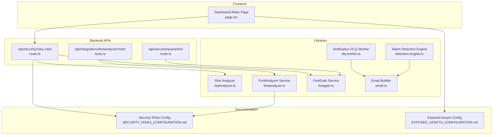

**Diagram sources**
- [page.tsx](file://app/dashboard/risks/page.tsx)
- [route.ts](file://app/api/security/risky-rules/route.ts)
- [route.ts](file://app/api/security/quarantine/route.ts)
- [route.ts](file://app/api/integrations/fortianalyzer/mitre/route.ts)
- [riskAnalyzer.ts](file://lib/security/riskAnalyzer.ts)
- [fortianalyzer.ts](file://lib/integrations/fortianalyzer.ts)
- [fortigate.ts](file://lib/integrations/fortigate.ts)
- [dlq-worker.ts](file://lib/notifications/dlq-worker.ts)
- [email.ts](file://lib/notifications/email.ts)
- [detection-engine.ts](file://lib/alarms/detection-engine.ts)
- [SECURITY_RISKS_CONFIGURATION.md](file://docs/20-modules/security/SECURITY_RISKS_CONFIGURATION.md)
- [EXPOSED_ASSETS_CONFIGURATION.md](file://docs/20-modules/security/EXPOSED_ASSETS_CONFIGURATION.md)

**Section sources**
- [route.ts](file://app/api/security/risky-rules/route.ts)
- [riskAnalyzer.ts](file://lib/security/riskAnalyzer.ts)
- [SECURITY_RISKS_CONFIGURATION.md](file://docs/20-modules/security/SECURITY_RISKS_CONFIGURATION.md)
- [EXPOSED_ASSETS_CONFIGURATION.md](file://docs/20-modules/security/EXPOSED_ASSETS_CONFIGURATION.md)
- [fortianalyzer.ts](file://lib/integrations/fortianalyzer.ts)
- [route.ts](file://app/api/integrations/fortianalyzer/mitre/route.ts)
- [fortigate.ts](file://lib/integrations/fortigate.ts)
- [route.ts](file://app/api/security/quarantine/route.ts)
- [dlq-worker.ts](file://lib/notifications/dlq-worker.ts)
- [email.ts](file://lib/notifications/email.ts)
- [detection-engine.ts](file://lib/alarms/detection-engine.ts)
- [page.tsx](file://app/dashboard/risks/page.tsx)

## Core Components
- Risk Analyzer: Detects risky firewall policy configurations and produces risk entries with severity and categorization.
- Risk API: Fetches policies from FortiGate, runs analyzer, caches results, and returns risk statistics.
- FortiAnalyzer Integration: Provides MITRE ATT&CK matrix and technique views, and supports threat log queries for risk mapping.
- FortiGate Integration: Supplies firewall policies and supports quarantine operations.
- Exposed Assets and Vulnerability Schema: Defines data model for exposed assets, risk scores, and vulnerability identifiers.
- Notifications and Remediation: Email templates, DLQ retry worker, and alarm engine for escalations.

**Section sources**
- [riskAnalyzer.ts](file://lib/security/riskAnalyzer.ts)
- [route.ts](file://app/api/security/risky-rules/route.ts)
- [SECURITY_RISKS_CONFIGURATION.md](file://docs/20-modules/security/SECURITY_RISKS_CONFIGURATION.md)
- [EXPOSED_ASSETS_CONFIGURATION.md](file://docs/20-modules/security/EXPOSED_ASSETS_CONFIGURATION.md)
- [fortianalyzer.ts](file://lib/integrations/fortianalyzer.ts)
- [route.ts](file://app/api/integrations/fortianalyzer/mitre/route.ts)
- [fortigate.ts](file://lib/integrations/fortigate.ts)
- [route.ts](file://app/api/security/quarantine/route.ts)
- [dlq-worker.ts](file://lib/notifications/dlq-worker.ts)
- [email.ts](file://lib/notifications/email.ts)
- [detection-engine.ts](file://lib/alarms/detection-engine.ts)

## Architecture Overview
The risk assessment pipeline integrates device telemetry, threat intelligence, and policy analysis to produce actionable risk insights. Automated workflows pull device data, apply detection rules, enrich with threat intel, and surface results in dashboards and notifications.

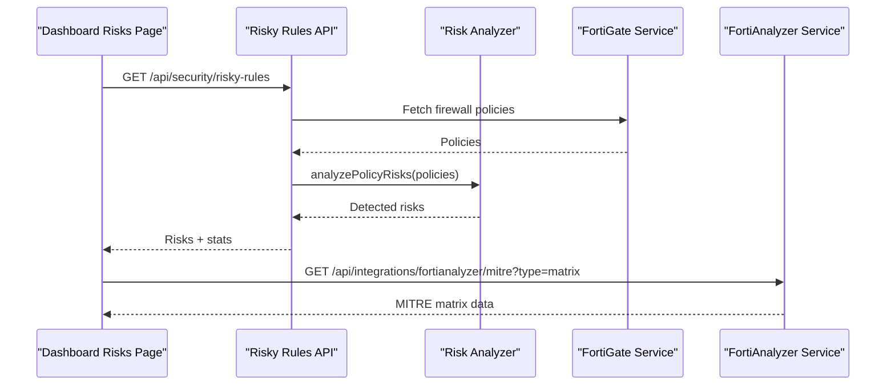

**Diagram sources**
- [page.tsx](file://app/dashboard/risks/page.tsx)
- [route.ts](file://app/api/security/risky-rules/route.ts)
- [riskAnalyzer.ts](file://lib/security/riskAnalyzer.ts)
- [fortigate.ts](file://lib/integrations/fortigate.ts)
- [fortianalyzer.ts](file://lib/integrations/fortianalyzer.ts)
- [route.ts](file://app/api/integrations/fortianalyzer/mitre/route.ts)

## Detailed Component Analysis

### Risk Scoring and Categorization
- Multi-factor risk scoring for exposed assets:
  - Service type factor (0–40)
  - Vulnerability severity factor (0–40)
  - CVE count factor (0–20)
  - Final score capped at 0–100
  - Exposure level derived from score thresholds
- Risk categories and severities are used to drive prioritization and notifications.

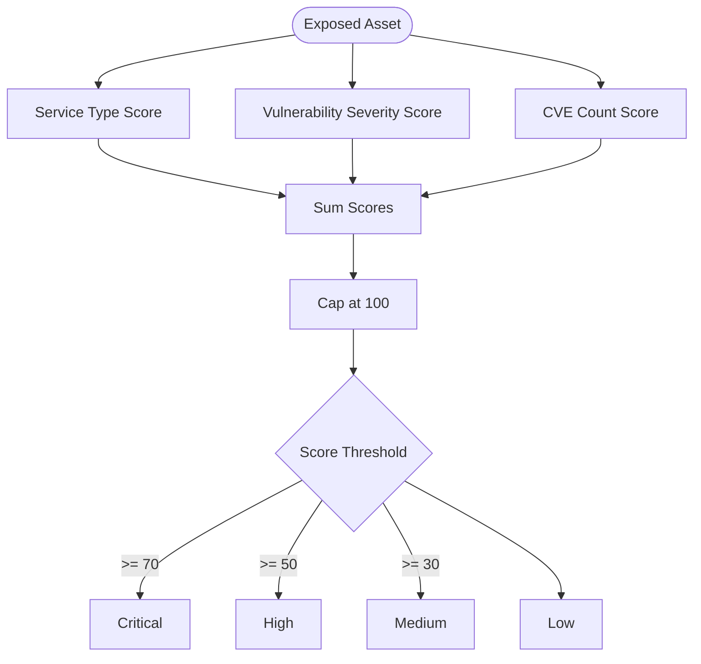

**Diagram sources**
- [EXPOSED_ASSETS_CONFIGURATION.md](file://docs/20-modules/security/EXPOSED_ASSETS_CONFIGURATION.md)

**Section sources**
- [EXPOSED_ASSETS_CONFIGURATION.md](file://docs/20-modules/security/EXPOSED_ASSETS_CONFIGURATION.md)

### Firewall Policy Risk Detection
- Detection rules include:
  - Any-to-Any rules (critical)
  - Unused policies (low)
  - External to internal exposure (high)
- Results are sorted by severity and cached for short-term reuse.

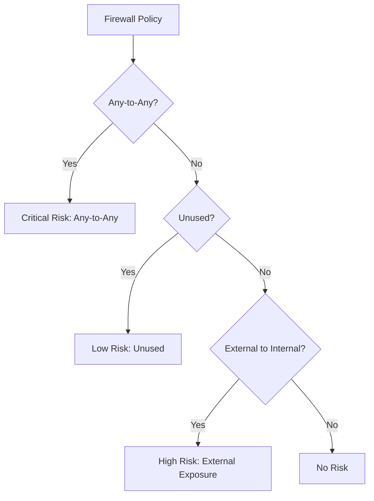

**Diagram sources**
- [riskAnalyzer.ts](file://lib/security/riskAnalyzer.ts)

**Section sources**
- [riskAnalyzer.ts](file://lib/security/riskAnalyzer.ts)
- [route.ts](file://app/api/security/risky-rules/route.ts)

### Automated Risk Assessment Workflow
- Fetch policies from FortiGate
- Analyze policies for risk patterns
- Aggregate statistics (critical, high, medium, low)
- Cache results for short TTL
- Serve via API for dashboard consumption

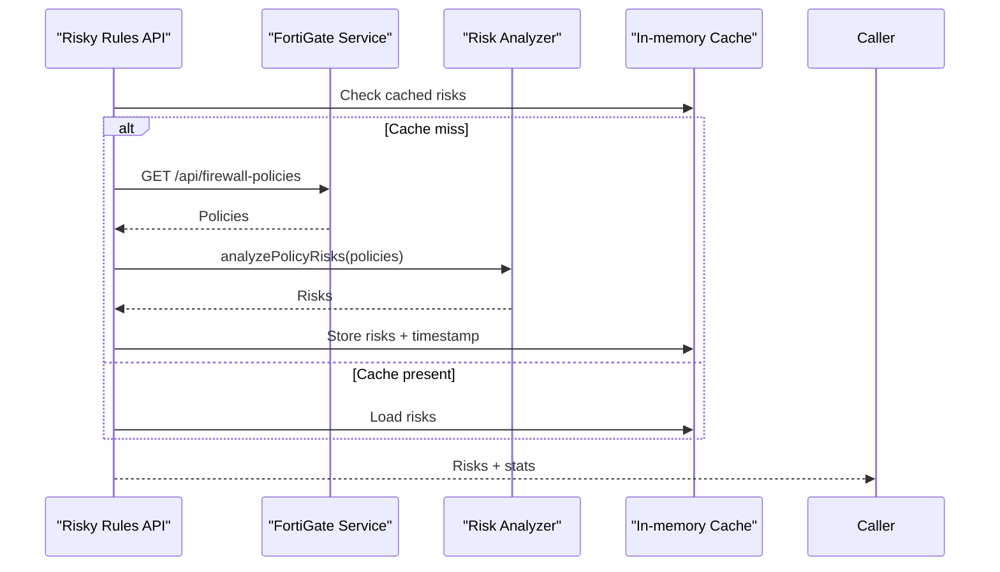

**Diagram sources**
- [route.ts](file://app/api/security/risky-rules/route.ts)
- [riskAnalyzer.ts](file://lib/security/riskAnalyzer.ts)
- [fortigate.ts](file://lib/integrations/fortigate.ts)

**Section sources**
- [route.ts](file://app/api/security/risky-rules/route.ts)
- [riskAnalyzer.ts](file://lib/security/riskAnalyzer.ts)
- [fortigate.ts](file://lib/integrations/fortigate.ts)

### Threat Intelligence Integration (MITRE ATT&CK)
- MITRE matrix and technique details are fetched from FortiAnalyzer.
- Supports domain scoping and time-range selection.
- Enables correlation of observed events with ATT&CK techniques for contextual risk.

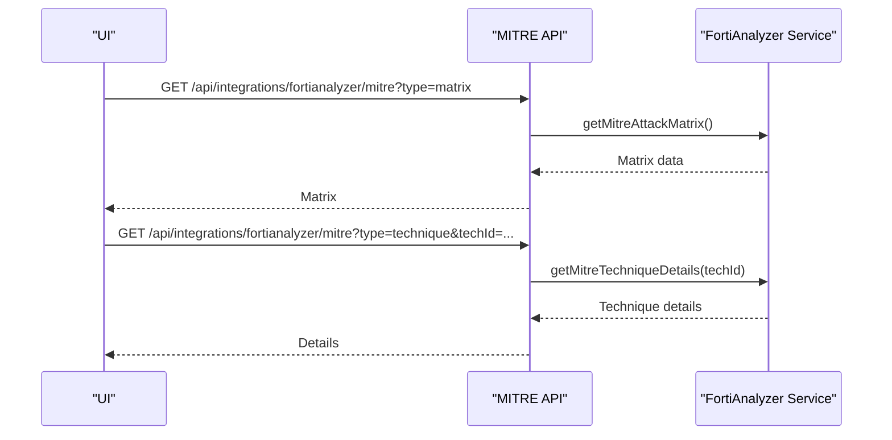

**Diagram sources**
- [route.ts](file://app/api/integrations/fortianalyzer/mitre/route.ts)
- [fortianalyzer.ts](file://lib/integrations/fortianalyzer.ts)

**Section sources**
- [route.ts](file://app/api/integrations/fortianalyzer/mitre/route.ts)
- [fortianalyzer.ts](file://lib/integrations/fortianalyzer.ts)

### Vulnerability and Exposed Asset Schema
- ExposedAsset model captures service, version, protocol, risk exposure level, risk score, vulnerability text, and CVE identifiers.
- Supports status tracking, source attribution, and metadata for cloud providers and device linkage.

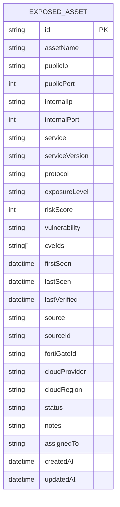

**Diagram sources**
- [EXPOSED_ASSETS_CONFIGURATION.md](file://docs/20-modules/security/EXPOSED_ASSETS_CONFIGURATION.md)

**Section sources**
- [EXPOSED_ASSETS_CONFIGURATION.md](file://docs/20-modules/security/EXPOSED_ASSETS_CONFIGURATION.md)

### Quarantine Management
- Lists, adds, and removes quarantined IPs via FortiGate integration.
- Requires integration configuration and supports expiry windows.

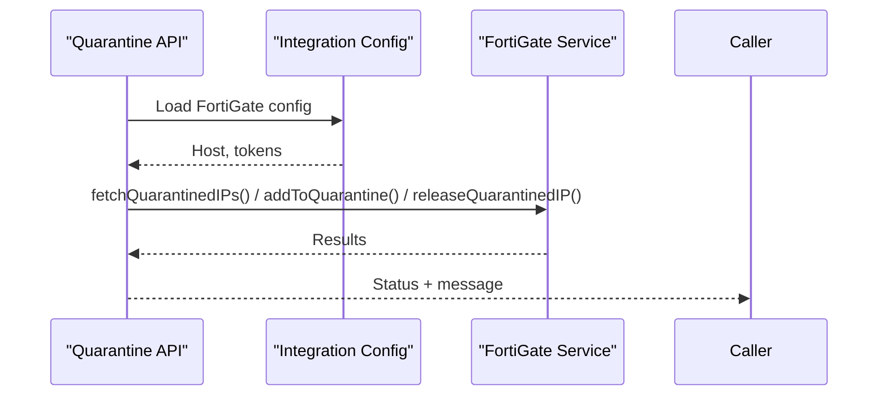

**Diagram sources**
- [route.ts](file://app/api/security/quarantine/route.ts)
- [fortigate.ts](file://lib/integrations/fortigate.ts)

**Section sources**
- [route.ts](file://app/api/security/quarantine/route.ts)
- [fortigate.ts](file://lib/integrations/fortigate.ts)

### Risk Heat Maps and Trend Analysis
- Dashboard displays average risk score, counts by severity, and trend indicators.
- Color-coded badges and icons reflect risk levels and categories.

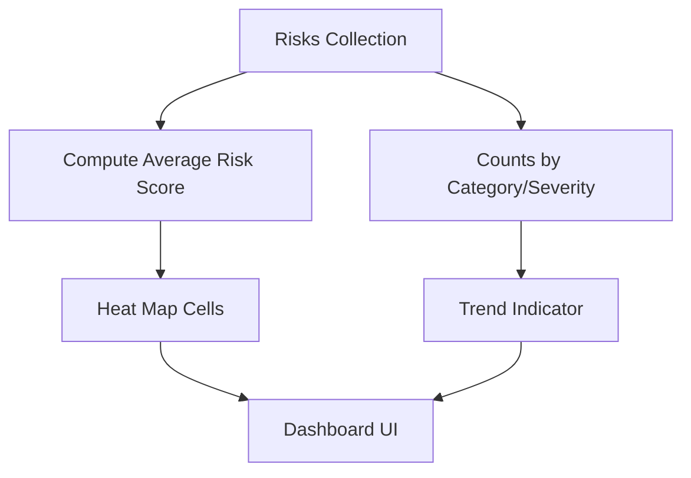

**Diagram sources**
- [page.tsx](file://app/dashboard/risks/page.tsx)

**Section sources**
- [page.tsx](file://app/dashboard/risks/page.tsx)

### Risk Mitigation Recommendations and Manual Overrides
- Risk registry schema supports mitigation plans, owners, due dates, statuses, and comments/history.
- Manual overrides and approvals can be modeled via status transitions and comments.
- Integration with risk detection rules enables semi-automated triage.

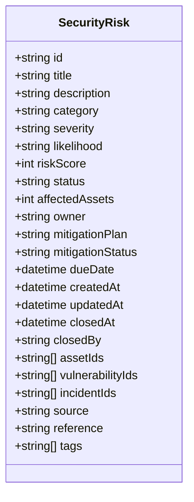

**Diagram sources**
- [SECURITY_RISKS_CONFIGURATION.md](file://docs/20-modules/security/SECURITY_RISKS_CONFIGURATION.md)

**Section sources**
- [SECURITY_RISKS_CONFIGURATION.md](file://docs/20-modules/security/SECURITY_RISKS_CONFIGURATION.md)

### Notifications, Escalation, and Remediation Tracking
- Email notifications are built from alarm data and parsed into structured sections.
- DLQ worker retries failed notifications with exponential backoff and marks permanent failures.
- Detection engine supports retrying undelivered notifications and correlating alarms.

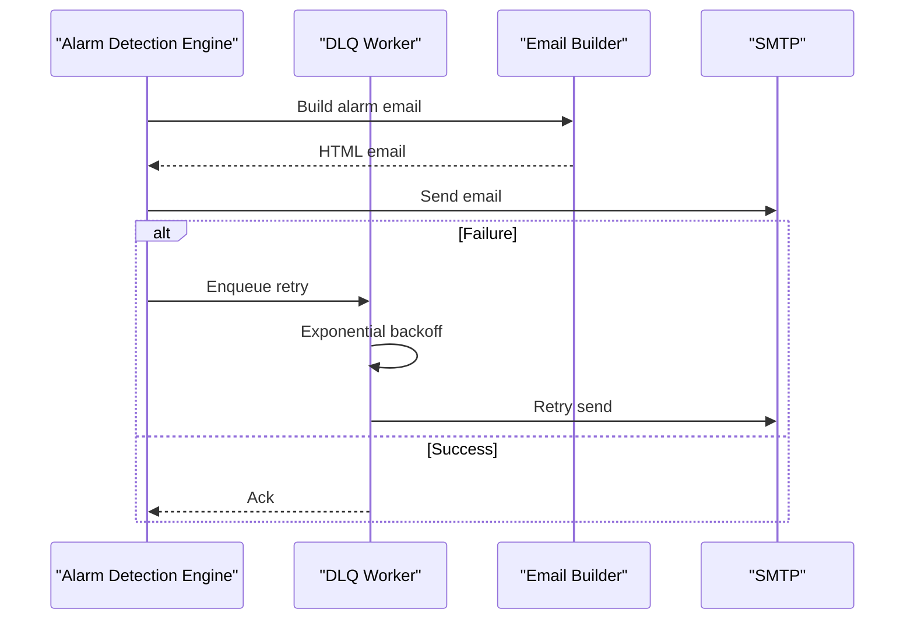

**Diagram sources**
- [detection-engine.ts](file://lib/alarms/detection-engine.ts)
- [dlq-worker.ts](file://lib/notifications/dlq-worker.ts)
- [email.ts](file://lib/notifications/email.ts)

**Section sources**
- [detection-engine.ts](file://lib/alarms/detection-engine.ts)
- [dlq-worker.ts](file://lib/notifications/dlq-worker.ts)
- [email.ts](file://lib/notifications/email.ts)

## Dependency Analysis
- Risk Analyzer depends on policy structures and returns standardized risk objects.
- Risk API depends on FortiGate integration for policy retrieval and caches results.
- MITRE API depends on FortiAnalyzer service for matrix and technique data.
- Quarantine API depends on FortiGate integration for device operations.
- Notifications depend on email builder and DLQ worker for resilient delivery.

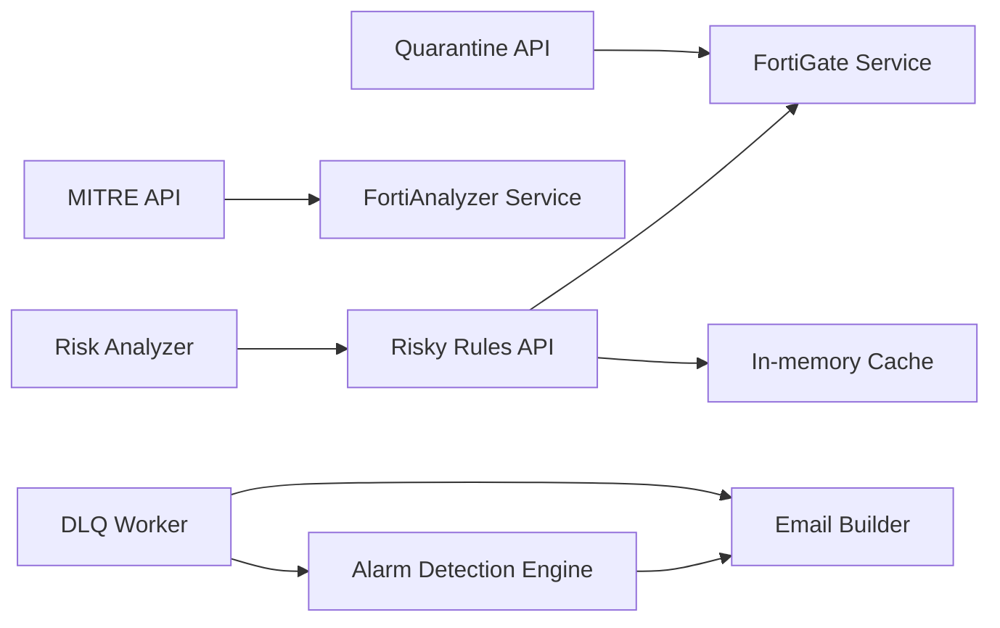

**Diagram sources**
- [riskAnalyzer.ts](file://lib/security/riskAnalyzer.ts)
- [route.ts](file://app/api/security/risky-rules/route.ts)
- [fortigate.ts](file://lib/integrations/fortigate.ts)
- [route.ts](file://app/api/integrations/fortianalyzer/mitre/route.ts)
- [fortianalyzer.ts](file://lib/integrations/fortianalyzer.ts)
- [route.ts](file://app/api/security/quarantine/route.ts)
- [detection-engine.ts](file://lib/alarms/detection-engine.ts)
- [dlq-worker.ts](file://lib/notifications/dlq-worker.ts)
- [email.ts](file://lib/notifications/email.ts)

**Section sources**
- [route.ts](file://app/api/security/risky-rules/route.ts)
- [riskAnalyzer.ts](file://lib/security/riskAnalyzer.ts)
- [fortigate.ts](file://lib/integrations/fortigate.ts)
- [route.ts](file://app/api/integrations/fortianalyzer/mitre/route.ts)
- [fortianalyzer.ts](file://lib/integrations/fortianalyzer.ts)
- [route.ts](file://app/api/security/quarantine/route.ts)
- [detection-engine.ts](file://lib/alarms/detection-engine.ts)
- [dlq-worker.ts](file://lib/notifications/dlq-worker.ts)
- [email.ts](file://lib/notifications/email.ts)

## Performance Considerations
- Short-lived caching of risk results reduces repeated computation and API calls.
- FortiAnalyzer and FortiGate integrations use timeouts and retry/backoff to handle transient failures.
- Dashboard computations (averages, counts) are lightweight and suitable for client rendering.

[No sources needed since this section provides general guidance]

## Troubleshooting Guide
- FortiAnalyzer session and account lockout:
  - Login failures trigger exponential backoff and may lock the account; unlock via FortiAnalyzer GUI.
- Session expiration:
  - Both FortiAnalyzer and FortiGate services invalidate stale sessions and re-authenticate as needed.
- Notification delivery:
  - DLQ worker retries failed sends with exponential backoff; persistent failures are marked and require manual intervention.
- Quarantine operations:
  - Ensure FortiGate integration is configured and accessible; verify credentials and permissions.

**Section sources**
- [fortianalyzer.ts](file://lib/integrations/fortianalyzer.ts)
- [fortigate.ts](file://lib/integrations/fortigate.ts)
- [dlq-worker.ts](file://lib/notifications/dlq-worker.ts)

## Conclusion
The risk assessment system combines policy-based detection, threat intelligence mapping, and vulnerability modeling to deliver actionable insights. Automated workflows integrate device telemetry and threat feeds, while manual overrides and a robust notification system support remediation tracking and escalation. The modular design enables incremental enhancements, from quick wins to enterprise-grade risk management.

[No sources needed since this section summarizes without analyzing specific files]

## Appendices

### Risk Calculation Methodology and Thresholds
- Exposed asset scoring factors and thresholds are defined in the exposed assets configuration.
- Firewall policy risk thresholds are embedded in the analyzer and API responses.

**Section sources**
- [EXPOSED_ASSETS_CONFIGURATION.md](file://docs/20-modules/security/EXPOSED_ASSETS_CONFIGURATION.md)
- [riskAnalyzer.ts](file://lib/security/riskAnalyzer.ts)
- [route.ts](file://app/api/security/risky-rules/route.ts)

### Risk Reporting and Trend Analysis
- Dashboard components compute averages and counts and render trend indicators.
- MITRE integration provides contextual risk mapping for techniques and matrices.

**Section sources**
- [page.tsx](file://app/dashboard/risks/page.tsx)
- [route.ts](file://app/api/integrations/fortianalyzer/mitre/route.ts)
- [fortianalyzer.ts](file://lib/integrations/fortianalyzer.ts)

### Integration References
- FortiAnalyzer JSON-RPC endpoints and MITRE views are documented in the integration service and API routes.
- FortiGate REST endpoints and synchronization logic are implemented in the FortiGate service.

**Section sources**
- [fortianalyzer.ts](file://lib/integrations/fortianalyzer.ts)
- [route.ts](file://app/api/integrations/fortianalyzer/mitre/route.ts)
- [fortigate.ts](file://lib/integrations/fortigate.ts)