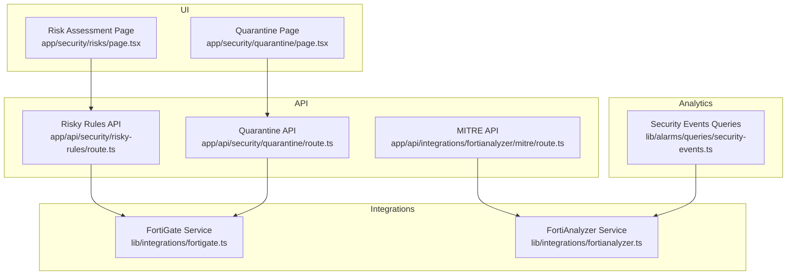
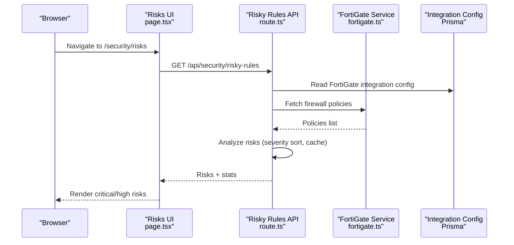
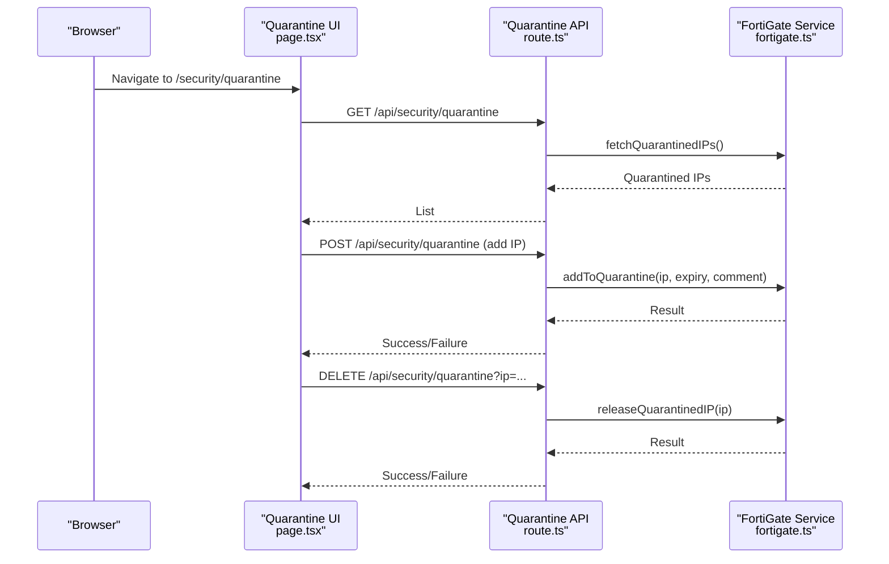
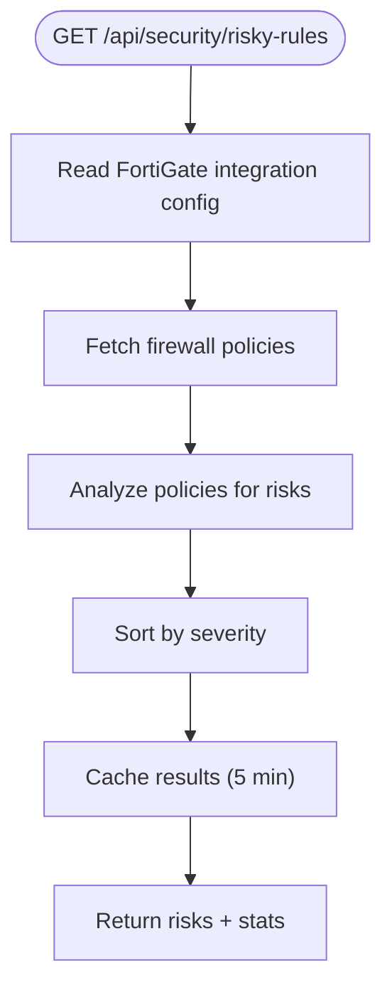
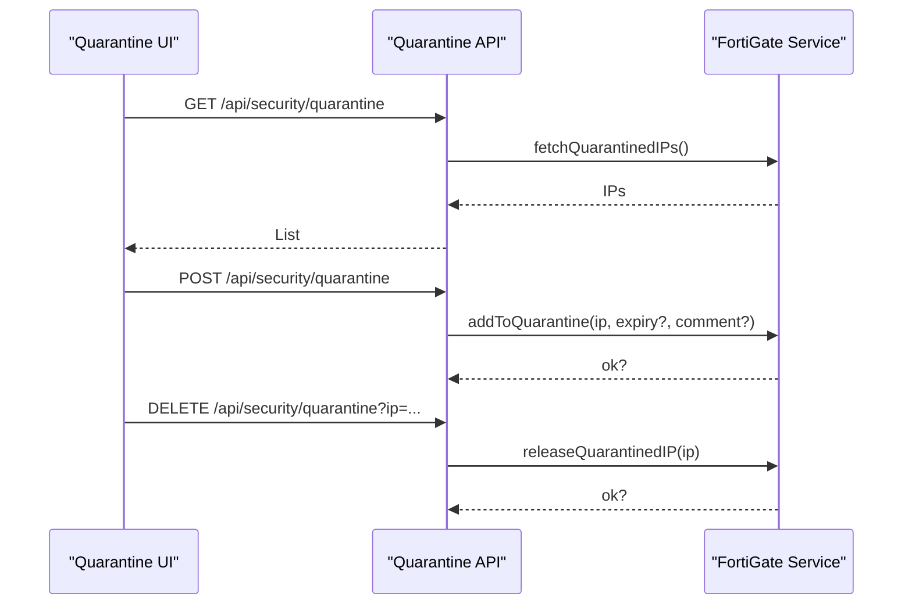
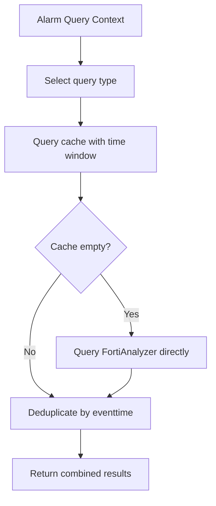
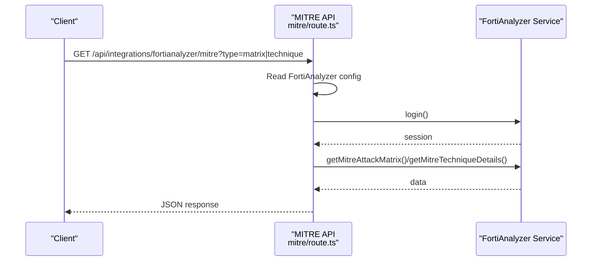
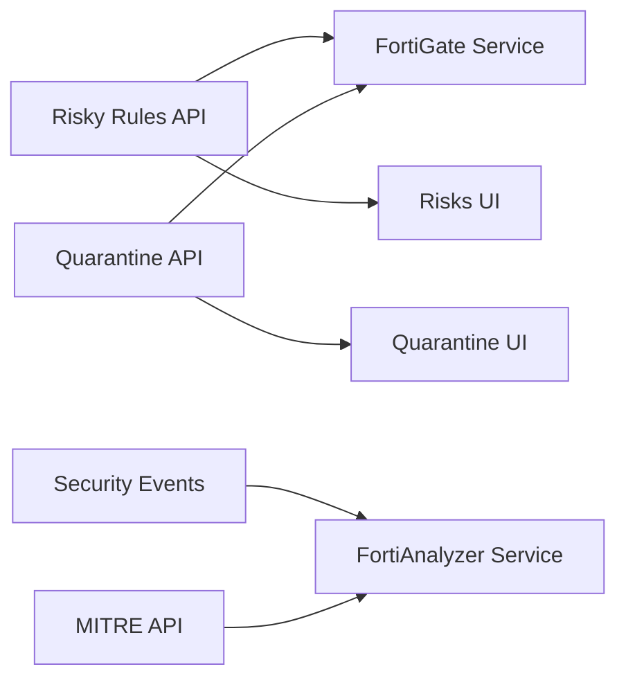

# Security Management

<cite>
**Referenced Files in This Document**
- [SECURITY_RISKS_CONFIGURATION.md](file://docs/SECURITY_RISKS_CONFIGURATION.md)
- [app/api/security/risky-rules/route.ts](file://app/api/security/risky-rules/route.ts)
- [app/security/risks/page.tsx](file://app/security/risks/page.tsx)
- [app/api/security/quarantine/route.ts](file://app/api/security/quarantine/route.ts)
- [app/security/quarantine/page.tsx](file://app/security/quarantine/page.tsx)
- [lib/alarms/queries/security-events.ts](file://lib/alarms/queries/security-events.ts)
- [lib/integrations/fortigate.ts](file://lib/integrations/fortigate.ts)
- [lib/integrations/fortianalyzer.ts](file://lib/integrations/fortianalyzer.ts)
- [app/api/integrations/fortianalyzer/mitre/route.ts](file://app/api/integrations/fortianalyzer/mitre/route.ts)
</cite>

## Table of Contents
1. [Introduction](#introduction)
2. [Project Structure](#project-structure)
3. [Core Components](#core-components)
4. [Architecture Overview](#architecture-overview)
5. [Detailed Component Analysis](#detailed-component-analysis)
6. [Dependency Analysis](#dependency-analysis)
7. [Performance Considerations](#performance-considerations)
8. [Troubleshooting Guide](#troubleshooting-guide)
9. [Conclusion](#conclusion)
10. [Appendices](#appendices)

## Introduction
This document describes the security management capabilities implemented in the codebase, focusing on firewall policy risk assessment, quarantine management for compromised devices, security analytics derived from Fortinet devices, and MITRE ATT&CK integration. It explains how firewall policies are fetched and analyzed for risky configurations, how quarantined IP addresses are managed via FortiGate, how security events are queried and correlated, and how MITRE ATT&CK data is surfaced from FortiAnalyzer. It also outlines practical configuration examples, risk scoring approaches, incident investigation workflows, and reporting/audit considerations.

## Project Structure
Security management spans frontend pages, backend API routes, and integration libraries for Fortinet devices:
- Risk assessment: API endpoint and UI page for risky firewall rules
- Quarantine management: API endpoint and UI page for managing quarantined IPs
- Security analytics: Alarm queries for IPS, malware, application control, web filter, IOC hits, and traffic anomalies
- MITRE ATT&CK integration: API route to query FortiAnalyzer for ATT&CK matrix and technique details

**Diagram sources**
- [app/security/risks/page.tsx](file://app/security/risks/page.tsx)
- [app/api/security/risky-rules/route.ts](file://app/api/security/risky-rules/route.ts)
- [app/security/quarantine/page.tsx](file://app/security/quarantine/page.tsx)
- [app/api/security/quarantine/route.ts](file://app/api/security/quarantine/route.ts)
- [lib/integrations/fortigate.ts](file://lib/integrations/fortigate.ts)
- [lib/integrations/fortianalyzer.ts](file://lib/integrations/fortianalyzer.ts)
- [lib/alarms/queries/security-events.ts](file://lib/alarms/queries/security-events.ts)
- [app/api/integrations/fortianalyzer/mitre/route.ts](file://app/api/integrations/fortianalyzer/mitre/route.ts)

**Section sources**
- [SECURITY_RISKS_CONFIGURATION.md](file://docs/SECURITY_RISKS_CONFIGURATION.md)
- [app/api/security/risky-rules/route.ts](file://app/api/security/risky-rules/route.ts)
- [app/security/risks/page.tsx](file://app/security/risks/page.tsx)
- [app/api/security/quarantine/route.ts](file://app/api/security/quarantine/route.ts)
- [app/security/quarantine/page.tsx](file://app/security/quarantine/page.tsx)
- [lib/alarms/queries/security-events.ts](file://lib/alarms/queries/security-events.ts)
- [lib/integrations/fortigate.ts](file://lib/integrations/fortigate.ts)
- [lib/integrations/fortianalyzer.ts](file://lib/integrations/fortianalyzer.ts)
- [app/api/integrations/fortianalyzer/mitre/route.ts](file://app/api/integrations/fortianalyzer/mitre/route.ts)

## Core Components
- Risk Assessment (Firewall Policy Analysis)
  - API endpoint analyzes firewall policies for risky configurations and returns a ranked list with severity counts.
  - UI displays critical and high risks, supports search and pagination.
- Quarantine Management
  - API supports listing, adding, and releasing quarantined IPs via FortiGate integration.
  - UI shows quarantined entries, source categorization, expiration badges, and bulk actions.
- Security Analytics
  - Alarm queries for IPS high severity, malware detections, application control violations, web filter blocks, IOC hits, and high outbound traffic.
- MITRE ATT&CK Integration
  - API route to query FortiAnalyzer for ATT&CK matrix and technique details with optional time range and domain.

**Section sources**
- [app/api/security/risky-rules/route.ts](file://app/api/security/risky-rules/route.ts)
- [app/security/risks/page.tsx](file://app/security/risks/page.tsx)
- [app/api/security/quarantine/route.ts](file://app/api/security/quarantine/route.ts)
- [app/security/quarantine/page.tsx](file://app/security/quarantine/page.tsx)
- [lib/alarms/queries/security-events.ts](file://lib/alarms/queries/security-events.ts)
- [app/api/integrations/fortianalyzer/mitre/route.ts](file://app/api/integrations/fortianalyzer/mitre/route.ts)

## Architecture Overview
The security management architecture integrates Fortinet devices via REST and JSON-RPC APIs, with analytics queries and UI dashboards.

**Diagram sources**
- [app/security/risks/page.tsx](file://app/security/risks/page.tsx)
- [app/api/security/risky-rules/route.ts](file://app/api/security/risky-rules/route.ts)
- [lib/integrations/fortigate.ts](file://lib/integrations/fortigate.ts)

**Diagram sources**
- [app/security/quarantine/page.tsx](file://app/security/quarantine/page.tsx)
- [app/api/security/quarantine/route.ts](file://app/api/security/quarantine/route.ts)
- [lib/integrations/fortigate.ts](file://lib/integrations/fortigate.ts)

## Detailed Component Analysis

### Risk Assessment: Firewall Policy Management
- Data source: FortiGate firewall policies via FortiGate service.
- Analysis logic: Detects risky configurations such as any-to-any rules, unused policies, permissive services, external exposure, and missing security features.
- Output: Ranked risks by severity with counts and statistics.
- UI: Filters to critical/high, search, pagination, and summary cards.

**Diagram sources**
- [app/api/security/risky-rules/route.ts](file://app/api/security/risky-rules/route.ts)

**Section sources**
- [SECURITY_RISKS_CONFIGURATION.md](file://docs/SECURITY_RISKS_CONFIGURATION.md)
- [app/api/security/risky-rules/route.ts](file://app/api/security/risky-rules/route.ts)
- [app/security/risks/page.tsx](file://app/security/risks/page.tsx)
- [lib/integrations/fortigate.ts](file://lib/integrations/fortigate.ts)

### Quarantine Management: Compromise Containment
- API supports listing, adding, and releasing quarantined IPs.
- Authentication: FortiGate service uses either cookie-based session or bearer token depending on configuration.
- UI provides search, pagination, source categorization (manual, IPS, AV, DoS), expiration badges, and action buttons.

**Diagram sources**
- [app/api/security/quarantine/route.ts](file://app/api/security/quarantine/route.ts)
- [app/security/quarantine/page.tsx](file://app/security/quarantine/page.tsx)
- [lib/integrations/fortigate.ts](file://lib/integrations/fortigate.ts)

**Section sources**
- [app/api/security/quarantine/route.ts](file://app/api/security/quarantine/route.ts)
- [app/security/quarantine/page.tsx](file://app/security/quarantine/page.tsx)
- [lib/integrations/fortigate.ts](file://lib/integrations/fortigate.ts)

### Security Analytics: Event Monitoring and Correlation
- Alarm queries cover high-severity IPS events, malware detections, application control violations, web filter blocks, IOC hits, and high outbound traffic.
- Query strategy: Prefer cached data with soft fallback to FortiAnalyzer for high-value events to minimize missed detections.

**Diagram sources**
- [lib/alarms/queries/security-events.ts](file://lib/alarms/queries/security-events.ts)
- [lib/integrations/fortianalyzer.ts](file://lib/integrations/fortianalyzer.ts)

**Section sources**
- [lib/alarms/queries/security-events.ts](file://lib/alarms/queries/security-events.ts)
- [lib/integrations/fortianalyzer.ts](file://lib/integrations/fortianalyzer.ts)

### MITRE ATT&CK Framework Integration
- API route to FortiAnalyzer’s ATT&CK views:
  - Matrix view by domain (e.g., enterprise)
  - Technique details with optional time range and ADOM
- Authentication handled via session login or API key.

**Diagram sources**
- [app/api/integrations/fortianalyzer/mitre/route.ts](file://app/api/integrations/fortianalyzer/mitre/route.ts)
- [lib/integrations/fortianalyzer.ts](file://lib/integrations/fortianalyzer.ts)

**Section sources**
- [app/api/integrations/fortianalyzer/mitre/route.ts](file://app/api/integrations/fortianalyzer/mitre/route.ts)
- [lib/integrations/fortianalyzer.ts](file://lib/integrations/fortianalyzer.ts)

### Address Objects and Security Event Monitoring
- Address objects are fetched from FortiGate and stored for policy context and risk analysis.
- Security event monitoring leverages FortiAnalyzer JSON-RPC for robust querying and retry logic.

**Section sources**
- [lib/integrations/fortigate.ts](file://lib/integrations/fortigate.ts)
- [lib/integrations/fortianalyzer.ts](file://lib/integrations/fortianalyzer.ts)

## Dependency Analysis
- Risk Assessment depends on:
  - FortiGate service for policy retrieval
  - UI page for rendering and filtering
- Quarantine depends on:
  - FortiGate service for CRUD operations on quarantined IPs
  - Integration configuration storage
- Security Analytics depends on:
  - Cached event store and FortiAnalyzer service for direct queries
- MITRE ATT&CK depends on:
  - FortiAnalyzer service for session-based queries

**Diagram sources**
- [app/api/security/risky-rules/route.ts](file://app/api/security/risky-rules/route.ts)
- [app/security/risks/page.tsx](file://app/security/risks/page.tsx)
- [app/api/security/quarantine/route.ts](file://app/api/security/quarantine/route.ts)
- [app/security/quarantine/page.tsx](file://app/security/quarantine/page.tsx)
- [lib/integrations/fortigate.ts](file://lib/integrations/fortigate.ts)
- [lib/integrations/fortianalyzer.ts](file://lib/integrations/fortianalyzer.ts)
- [lib/alarms/queries/security-events.ts](file://lib/alarms/queries/security-events.ts)
- [app/api/integrations/fortianalyzer/mitre/route.ts](file://app/api/integrations/fortianalyzer/mitre/route.ts)

**Section sources**
- [app/api/security/risky-rules/route.ts](file://app/api/security/risky-rules/route.ts)
- [app/api/security/quarantine/route.ts](file://app/api/security/quarantine/route.ts)
- [lib/integrations/fortigate.ts](file://lib/integrations/fortigate.ts)
- [lib/integrations/fortianalyzer.ts](file://lib/integrations/fortianalyzer.ts)
- [lib/alarms/queries/security-events.ts](file://lib/alarms/queries/security-events.ts)
- [app/api/integrations/fortianalyzer/mitre/route.ts](file://app/api/integrations/fortianalyzer/mitre/route.ts)

## Performance Considerations
- Caching: Risk analysis results are cached for five minutes to reduce repeated API calls.
- Parallelism: UI can lazy-load summaries and fetch detailed risks on demand; consider parallelizing multiple data sources when extending.
- Indexing and filtering: Use indexed fields (e.g., level, action) to optimize queries and reduce payload sizes.
- Retries and backoff: FortiAnalyzer service implements retry logic and exponential backoff to handle transient failures and avoid account lockouts.

**Section sources**
- [app/api/security/risky-rules/route.ts](file://app/api/security/risky-rules/route.ts)
- [lib/integrations/fortianalyzer.ts](file://lib/integrations/fortianalyzer.ts)

## Troubleshooting Guide
- Risk Assessment
  - Verify FortiGate integration configuration exists and is enabled.
  - Confirm firewall policies endpoint returns data and is reachable.
  - Check cache TTL and ensure stale data is not served unintentionally.
- Quarantine
  - Validate FortiGate credentials/token and session validity.
  - Confirm quarantine operations succeed and reflect on FortiGate.
- Security Events
  - Ensure cache availability; enable soft fallback to FortiAnalyzer for high-value events.
  - Review time windows and filters to avoid empty result sets.
- MITRE ATT&CK
  - Confirm FortiAnalyzer credentials and session persistence.
  - Check domain and time range parameters for matrix/technique queries.

**Section sources**
- [app/api/security/risky-rules/route.ts](file://app/api/security/risky-rules/route.ts)
- [app/api/security/quarantine/route.ts](file://app/api/security/quarantine/route.ts)
- [lib/alarms/queries/security-events.ts](file://lib/alarms/queries/security-events.ts)
- [app/api/integrations/fortianalyzer/mitre/route.ts](file://app/api/integrations/fortianalyzer/mitre/route.ts)

## Conclusion
The security management implementation provides a solid foundation for firewall policy risk assessment, quarantine operations, security analytics, and MITRE ATT&CK integration. By leveraging FortiGate and FortiAnalyzer APIs, the system enables rapid identification of risky configurations, containment of compromised devices, and actionable insights grounded in standardized frameworks. Extending the platform involves integrating additional risk sources, enhancing correlation engines, and enriching dashboards with trend analysis and compliance reporting.

## Appendices

### Practical Examples
- Security Configuration
  - Configure FortiGate integration with REST access and enable policy module.
  - Configure FortiAnalyzer integration with credentials and session handling.
- Risk Scoring
  - Use severity weights and counts to compute risk summaries; extend with likelihood/exposure for quantitative scoring.
- Incident Investigation
  - Use security event queries to identify high-severity IPS, malware, and IOC hits; correlate with firewall policies and quarantined IPs.

**Section sources**
- [SECURITY_RISKS_CONFIGURATION.md](file://docs/SECURITY_RISKS_CONFIGURATION.md)
- [lib/alarms/queries/security-events.ts](file://lib/alarms/queries/security-events.ts)
- [lib/integrations/fortigate.ts](file://lib/integrations/fortigate.ts)
- [lib/integrations/fortianalyzer.ts](file://lib/integrations/fortianalyzer.ts)