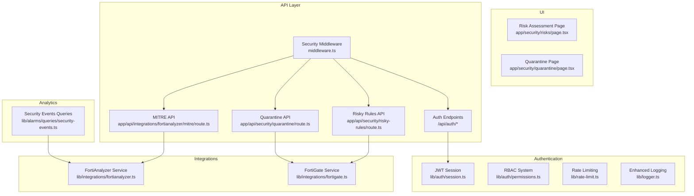
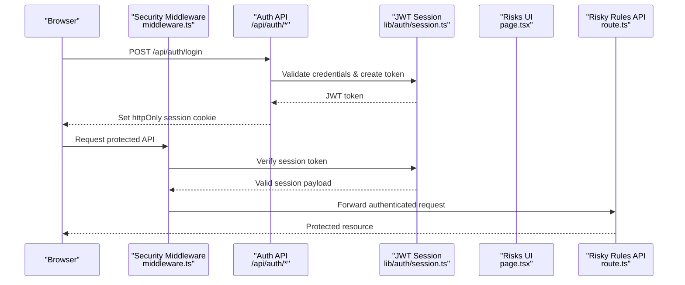
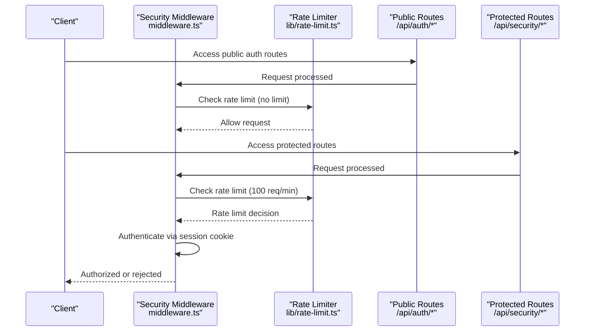
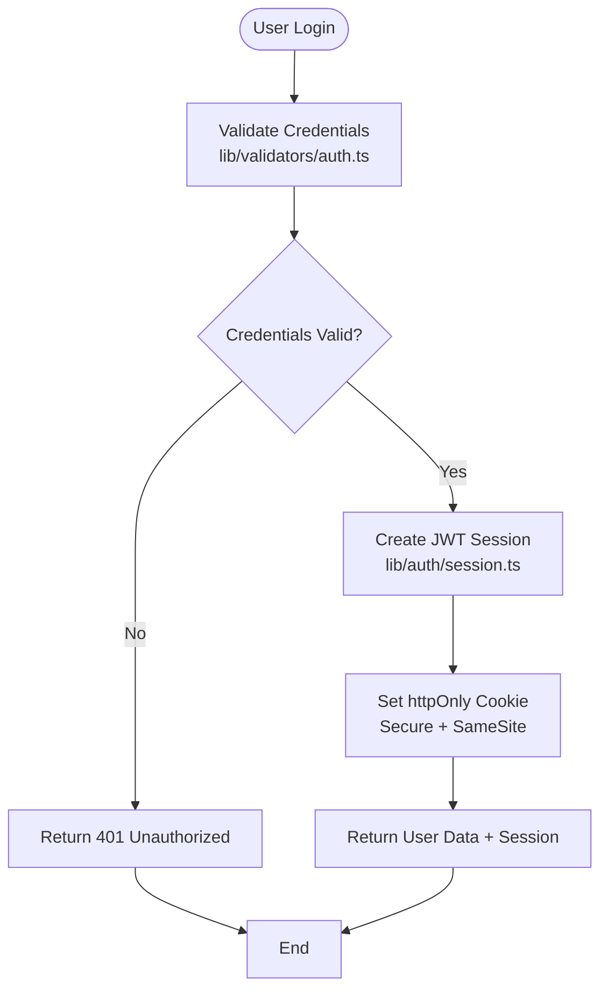
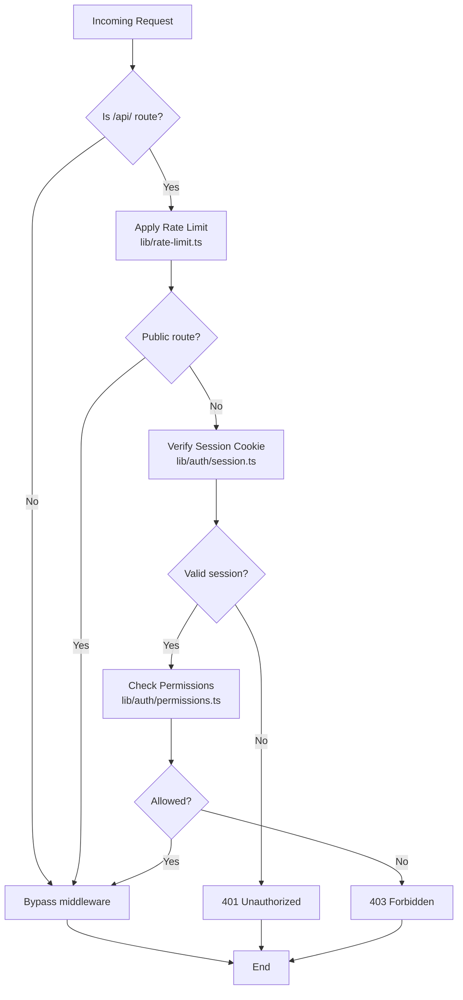
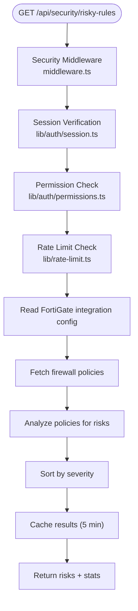
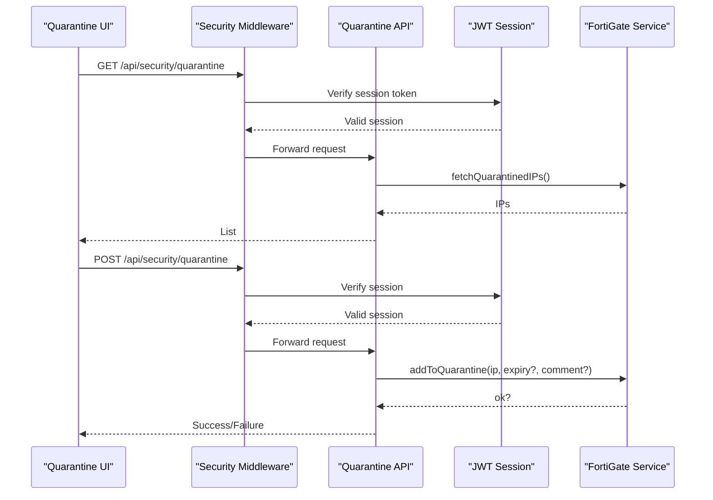
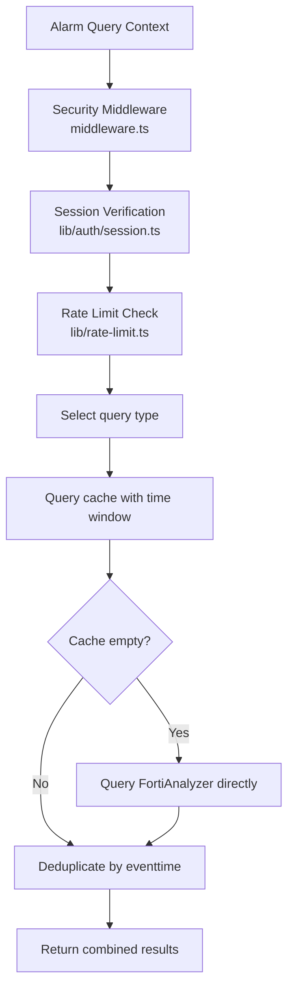
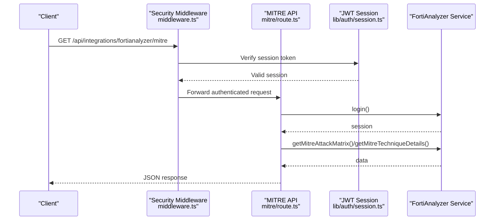

# Security Management

<cite>
**Referenced Files in This Document**
- [SECURITY_RISKS_CONFIGURATION.md](file://docs/SECURITY_RISKS_CONFIGURATION.md)
- [app/api/security/risky-rules/route.ts](file://app/api/security/risky-rules/route.ts)
- [app/security/risks/page.tsx](file://app/security/risks/page.tsx)
- [app/api/security/quarantine/route.ts](file://app/api/security/quarantine/route.ts)
- [app/security/quarantine/page.tsx](file://app/security/quarantine/page.tsx)
- [lib/alarms/queries/security-events.ts](file://lib/alarms/queries/security-events.ts)
- [lib/integrations/fortigate.ts](file://lib/integrations/fortigate.ts)
- [lib/integrations/fortianalyzer.ts](file://lib/integrations/fortianalyzer.ts)
- [app/api/integrations/fortianalyzer/mitre/route.ts](file://app/api/integrations/fortianalyzer/mitre/route.ts)
- [middleware.ts](file://middleware.ts)
- [lib/auth/session.ts](file://lib/auth/session.ts)
- [lib/auth/permissions.ts](file://lib/auth/permissions.ts)
- [lib/rate-limit.ts](file://lib/rate-limit.ts)
- [lib/logger.ts](file://lib/logger.ts)
- [app/api/auth/login/route.ts](file://app/api/auth/login/route.ts)
- [app/api/auth/logout/route.ts](file://app/api/auth/logout/route.ts)
- [app/api/auth/me/route.ts](file://app/api/auth/me/route.ts)
- [lib/validators/auth.ts](file://lib/validators/auth.ts)
</cite>

## Update Summary
**Changes Made**
- Added comprehensive authentication system documentation with JWT-based session management
- Documented new security middleware with rate limiting and RBAC enforcement
- Updated firewall policy management to reflect new authentication requirements
- Enhanced security analytics with rate limiting and session-based access controls
- Added security dashboard components with session-aware access
- Updated MITRE ATT&CK integration with proper authentication flow
- Documented enhanced logging and audit capabilities

## Table of Contents
1. [Introduction](#introduction)
2. [Project Structure](#project-structure)
3. [Core Components](#core-components)
4. [Architecture Overview](#architecture-overview)
5. [Detailed Component Analysis](#detailed-component-analysis)
6. [Dependency Analysis](#dependency-analysis)
7. [Performance Considerations](#performance-considerations)
8. [Troubleshooting Guide](#troubleshooting-guide)
9. [Conclusion](#conclusion)
10. [Appendices](#appendices)

## Introduction
This document describes the security management capabilities implemented in the codebase, focusing on firewall policy risk assessment, quarantine management for compromised devices, security analytics derived from Fortinet devices, and MITRE ATT&CK integration. The system has undergone a complete security infrastructure overhaul featuring JWT-based authentication, session management, security middleware, rate limiting, and enhanced logging. It explains how firewall policies are fetched and analyzed for risky configurations, how quarantined IP addresses are managed via FortiGate, how security events are queried and correlated, and how MITRE ATT&CK data is surfaced from FortiAnalyzer. The new authentication system replaces the previous x-user-role header approach with secure session tokens, providing robust protection against spoofing and unauthorized access.

## Project Structure
Security management spans frontend pages, backend API routes, authentication middleware, and integration libraries for Fortinet devices:
- Risk assessment: API endpoint and UI page for risky firewall rules with JWT session authentication
- Quarantine management: API endpoint and UI page for managing quarantined IPs with RBAC enforcement
- Security analytics: Alarm queries for IPS, malware, application control, web filter, IOC hits, and traffic anomalies with rate limiting
- MITRE ATT&CK integration: API route to query FortiAnalyzer for ATT&CK matrix and technique details with session-based authentication
- Authentication system: JWT-based session management with httpOnly cookies and comprehensive middleware protection



**Diagram sources**
- [middleware.ts](file://middleware.ts)
- [lib/auth/session.ts](file://lib/auth/session.ts)
- [lib/auth/permissions.ts](file://lib/auth/permissions.ts)
- [lib/rate-limit.ts](file://lib/rate-limit.ts)
- [lib/logger.ts](file://lib/logger.ts)
- [app/api/auth/login/route.ts](file://app/api/auth/login/route.ts)
- [app/api/auth/logout/route.ts](file://app/api/auth/logout/route.ts)
- [app/api/auth/me/route.ts](file://app/api/auth/me/route.ts)
- [app/api/security/risky-rules/route.ts](file://app/api/security/risky-rules/route.ts)
- [app/api/security/quarantine/route.ts](file://app/api/security/quarantine/route.ts)
- [app/api/integrations/fortianalyzer/mitre/route.ts](file://app/api/integrations/fortianalyzer/mitre/route.ts)
- [lib/integrations/fortigate.ts](file://lib/integrations/fortigate.ts)
- [lib/integrations/fortianalyzer.ts](file://lib/integrations/fortianalyzer.ts)
- [lib/alarms/queries/security-events.ts](file://lib/alarms/queries/security-events.ts)

**Section sources**
- [SECURITY_RISKS_CONFIGURATION.md](file://docs/SECURITY_RISKS_CONFIGURATION.md)
- [middleware.ts](file://middleware.ts)
- [lib/auth/session.ts](file://lib/auth/session.ts)
- [lib/auth/permissions.ts](file://lib/auth/permissions.ts)
- [lib/rate-limit.ts](file://lib/rate-limit.ts)
- [lib/logger.ts](file://lib/logger.ts)
- [app/api/auth/login/route.ts](file://app/api/auth/login/route.ts)
- [app/api/auth/logout/route.ts](file://app/api/auth/logout/route.ts)
- [app/api/auth/me/route.ts](file://app/api/auth/me/route.ts)
- [app/api/security/risky-rules/route.ts](file://app/api/security/risky-rules/route.ts)
- [app/security/risks/page.tsx](file://app/security/risks/page.tsx)
- [app/api/security/quarantine/route.ts](file://app/api/security/quarantine/route.ts)
- [app/security/quarantine/page.tsx](file://app/security/quarantine/page.tsx)
- [lib/alarms/queries/security-events.ts](file://lib/alarms/queries/security-events.ts)
- [lib/integrations/fortigate.ts](file://lib/integrations/fortigate.ts)
- [lib/integrations/fortianalyzer.ts](file://lib/integrations/fortianalyzer.ts)
- [app/api/integrations/fortianalyzer/mitre/route.ts](file://app/api/integrations/fortianalyzer/mitre/route.ts)

## Core Components
- **JWT-Based Authentication System**
  - Secure session tokens using HS256 algorithm with httpOnly cookies
  - Session duration of 8 hours with automatic expiration handling
  - Replacement of spoofable x-user-role header with secure token-based authentication
- **Security Middleware with RBAC**
  - Comprehensive API protection with rate limiting and permission enforcement
  - Role-based access control using synchronized permission matrix
  - Automatic authentication requirement for protected routes
- **Risk Assessment (Firewall Policy Analysis)**
  - API endpoint analyzes firewall policies for risky configurations with session authentication
  - UI displays critical and high risks with search and pagination capabilities
- **Quarantine Management**
  - API supports listing, adding, and releasing quarantined IPs via FortiGate integration
  - RBAC enforcement ensures only authorized users can manage quarantines
  - UI shows quarantined entries with source categorization and expiration management
- **Security Analytics**
  - Alarm queries for IPS high severity, malware detections, application control violations, web filter blocks, IOC hits, and high outbound traffic
  - Rate limiting protects against abuse while maintaining performance
- **MITRE ATT&CK Integration**
  - API route to query FortiAnalyzer for ATT&CK matrix and technique details with session-based authentication
  - Enhanced security with proper session validation and rate limiting

**Section sources**
- [lib/auth/session.ts](file://lib/auth/session.ts)
- [middleware.ts](file://middleware.ts)
- [lib/auth/permissions.ts](file://lib/auth/permissions.ts)
- [lib/rate-limit.ts](file://lib/rate-limit.ts)
- [app/api/auth/login/route.ts](file://app/api/auth/login/route.ts)
- [app/api/auth/logout/route.ts](file://app/api/auth/logout/route.ts)
- [app/api/auth/me/route.ts](file://app/api/auth/me/route.ts)
- [app/api/security/risky-rules/route.ts](file://app/api/security/risky-rules/route.ts)
- [app/security/risks/page.tsx](file://app/security/risks/page.tsx)
- [app/api/security/quarantine/route.ts](file://app/api/security/quarantine/route.ts)
- [app/security/quarantine/page.tsx](file://app/security/quarantine/page.tsx)
- [lib/alarms/queries/security-events.ts](file://lib/alarms/queries/security-events.ts)
- [app/api/integrations/fortianalyzer/mitre/route.ts](file://app/api/integrations/fortianalyzer/mitre/route.ts)

## Architecture Overview
The security management architecture integrates Fortinet devices via REST and JSON-RPC APIs, with comprehensive authentication, authorization, and rate limiting through custom middleware. The new JWT-based authentication system replaces the previous header-based approach, providing robust protection against spoofing and unauthorized access.



**Diagram sources**
- [middleware.ts](file://middleware.ts)
- [lib/auth/session.ts](file://lib/auth/session.ts)
- [app/api/auth/login/route.ts](file://app/api/auth/login/route.ts)
- [app/api/auth/logout/route.ts](file://app/api/auth/logout/route.ts)
- [app/api/auth/me/route.ts](file://app/api/auth/me/route.ts)
- [app/security/risks/page.tsx](file://app/security/risks/page.tsx)
- [app/api/security/risky-rules/route.ts](file://app/api/security/risky-rules/route.ts)



**Diagram sources**
- [middleware.ts](file://middleware.ts)
- [lib/rate-limit.ts](file://lib/rate-limit.ts)
- [app/api/auth/login/route.ts](file://app/api/auth/login/route.ts)
- [app/api/auth/logout/route.ts](file://app/api/auth/logout/route.ts)
- [app/api/auth/me/route.ts](file://app/api/auth/me/route.ts)
- [app/api/security/risky-rules/route.ts](file://app/api/security/risky-rules/route.ts)
- [app/api/security/quarantine/route.ts](file://app/api/security/quarantine/route.ts)

## Detailed Component Analysis

### JWT-Based Authentication System
The new authentication system replaces the spoofable x-user-role header with a secure JWT-based approach using httpOnly cookies:

- **Token Generation**: HS256-signed JWT tokens with 8-hour expiration
- **Cookie Security**: httpOnly, secure (HTTPS only), SameSite=strict cookies
- **Session Management**: Centralized session verification with automatic expiration handling
- **Secret Management**: Uses NEXTAUTH_SECRET environment variable for token signing
- **Validation**: Robust token verification with proper error handling for expired or invalid tokens



**Diagram sources**
- [app/api/auth/login/route.ts](file://app/api/auth/login/route.ts)
- [lib/auth/session.ts](file://lib/auth/session.ts)
- [lib/validators/auth.ts](file://lib/validators/auth.ts)

**Section sources**
- [lib/auth/session.ts](file://lib/auth/session.ts)
- [app/api/auth/login/route.ts](file://app/api/auth/login/route.ts)
- [app/api/auth/logout/route.ts](file://app/api/auth/logout/route.ts)
- [app/api/auth/me/route.ts](file://app/api/auth/me/route.ts)
- [lib/validators/auth.ts](file://lib/validators/auth.ts)

### Security Middleware with RBAC and Rate Limiting
The middleware provides comprehensive protection through multiple layers:

- **Rate Limiting**: Sliding window implementation with different limits for auth vs general API
- **Authentication**: Session-based authentication replacing header spoofing
- **Authorization**: Role-based access control with synchronized permission matrix
- **Route Protection**: Automatic protection for all /api/ routes except public endpoints
- **TLS Safety**: Production security check for TLS verification settings



**Diagram sources**
- [middleware.ts](file://middleware.ts)
- [lib/rate-limit.ts](file://lib/rate-limit.ts)
- [lib/auth/session.ts](file://lib/auth/session.ts)
- [lib/auth/permissions.ts](file://lib/auth/permissions.ts)

**Section sources**
- [middleware.ts](file://middleware.ts)
- [lib/rate-limit.ts](file://lib/rate-limit.ts)
- [lib/auth/session.ts](file://lib/auth/session.ts)
- [lib/auth/permissions.ts](file://lib/auth/permissions.ts)

### Risk Assessment: Firewall Policy Management with Authentication
The risk assessment system now operates under the new security framework:

- **Data source**: FortiGate firewall policies via FortiGate service with authenticated sessions
- **Analysis logic**: Detects risky configurations such as any-to-any rules, unused policies, permissive services, external exposure, and missing security features
- **Output**: Ranked risks by severity with counts and statistics
- **UI**: Filters to critical/high, search, pagination, and summary cards with session-aware access
- **Security**: Protected by middleware with RBAC and rate limiting



**Diagram sources**
- [app/api/security/risky-rules/route.ts](file://app/api/security/risky-rules/route.ts)
- [middleware.ts](file://middleware.ts)
- [lib/auth/session.ts](file://lib/auth/session.ts)
- [lib/auth/permissions.ts](file://lib/auth/permissions.ts)
- [lib/rate-limit.ts](file://lib/rate-limit.ts)

**Section sources**
- [SECURITY_RISKS_CONFIGURATION.md](file://docs/SECURITY_RISKS_CONFIGURATION.md)
- [app/api/security/risky-rules/route.ts](file://app/api/security/risky-rules/route.ts)
- [app/security/risks/page.tsx](file://app/security/risks/page.tsx)
- [lib/integrations/fortigate.ts](file://lib/integrations/fortigate.ts)
- [middleware.ts](file://middleware.ts)
- [lib/auth/session.ts](file://lib/auth/session.ts)
- [lib/auth/permissions.ts](file://lib/auth/permissions.ts)
- [lib/rate-limit.ts](file://lib/rate-limit.ts)

### Quarantine Management: Compromise Containment with RBAC
The quarantine management system now enforces comprehensive access controls:

- **API supports**: Listing, adding, and releasing quarantined IPs via FortiGate integration
- **Authentication**: FortiGate service uses session-based authentication
- **RBAC enforcement**: Only authorized users can manage quarantines
- **UI provides**: Search, pagination, source categorization (manual, IPS, AV, DoS), expiration badges, and action buttons
- **Security**: Protected by middleware with rate limiting and permission checks



**Diagram sources**
- [app/api/security/quarantine/route.ts](file://app/api/security/quarantine/route.ts)
- [app/security/quarantine/page.tsx](file://app/security/quarantine/page.tsx)
- [lib/integrations/fortigate.ts](file://lib/integrations/fortigate.ts)
- [middleware.ts](file://middleware.ts)
- [lib/auth/session.ts](file://lib/auth/session.ts)

**Section sources**
- [app/api/security/quarantine/route.ts](file://app/api/security/quarantine/route.ts)
- [app/security/quarantine/page.tsx](file://app/security/quarantine/page.tsx)
- [lib/integrations/fortigate.ts](file://lib/integrations/fortigate.ts)
- [middleware.ts](file://middleware.ts)
- [lib/auth/session.ts](file://lib/auth/session.ts)
- [lib/auth/permissions.ts](file://lib/auth/permissions.ts)

### Security Analytics: Event Monitoring and Correlation with Rate Limiting
The security analytics system now operates under comprehensive protection:

- **Alarm queries**: Cover high-severity IPS events, malware detections, application control violations, web filter blocks, IOC hits, and high outbound traffic
- **Rate limiting**: Applied to prevent abuse while maintaining performance
- **Query strategy**: Prefer cached data with soft fallback to FortiAnalyzer for high-value events to minimize missed detections
- **Security**: Protected by middleware with authentication and rate limiting



**Diagram sources**
- [lib/alarms/queries/security-events.ts](file://lib/alarms/queries/security-events.ts)
- [lib/integrations/fortianalyzer.ts](file://lib/integrations/fortianalyzer.ts)
- [middleware.ts](file://middleware.ts)
- [lib/auth/session.ts](file://lib/auth/session.ts)
- [lib/rate-limit.ts](file://lib/rate-limit.ts)

**Section sources**
- [lib/alarms/queries/security-events.ts](file://lib/alarms/queries/security-events.ts)
- [lib/integrations/fortianalyzer.ts](file://lib/integrations/fortianalyzer.ts)
- [middleware.ts](file://middleware.ts)
- [lib/auth/session.ts](file://lib/auth/session.ts)
- [lib/rate-limit.ts](file://lib/rate-limit.ts)

### MITRE ATT&CK Framework Integration with Session Authentication
The MITRE ATT&CK integration now operates under the new security framework:

- **API route**: To FortiAnalyzer's ATT&CK views with session-based authentication
- **Matrix view**: By domain (e.g., enterprise) with optional time range and ADOM
- **Technique details**: With optional time range and domain parameters
- **Authentication**: Handled via session login with proper token validation
- **Security**: Protected by middleware with rate limiting and RBAC



**Diagram sources**
- [app/api/integrations/fortianalyzer/mitre/route.ts](file://app/api/integrations/fortianalyzer/mitre/route.ts)
- [lib/integrations/fortianalyzer.ts](file://lib/integrations/fortianalyzer.ts)
- [middleware.ts](file://middleware.ts)
- [lib/auth/session.ts](file://lib/auth/session.ts)

**Section sources**
- [app/api/integrations/fortianalyzer/mitre/route.ts](file://app/api/integrations/fortianalyzer/mitre/route.ts)
- [lib/integrations/fortianalyzer.ts](file://lib/integrations/fortianalyzer.ts)
- [middleware.ts](file://middleware.ts)
- [lib/auth/session.ts](file://lib/auth/session.ts)

### Enhanced Logging and Audit Capabilities
The system now includes comprehensive logging and audit capabilities:

- **Structured logging**: Using Pino with component-based naming
- **Production logging**: JSON output format for easy parsing
- **Development logging**: Console-friendly output with debug level
- **Audit logging**: Structured audit trails with action, resource, and user information
- **Security logging**: Critical security events and middleware violations logged with appropriate severity

**Section sources**
- [lib/logger.ts](file://lib/logger.ts)

## Dependency Analysis
The security infrastructure introduces several new dependencies and relationships:

- **Authentication System Dependencies**:
  - JWT session management requires jose library for token signing/verification
  - Rate limiting depends on in-memory store with sliding window algorithm
  - Middleware depends on session verification and permission checking
- **Risk Assessment Dependencies**:
  - FortiGate service for policy retrieval with session authentication
  - UI page for rendering with session-aware access
  - Middleware for protection and rate limiting
- **Quarantine Dependencies**:
  - FortiGate service for CRUD operations with session authentication
  - Integration configuration storage with RBAC
  - Middleware for protection and permission enforcement
- **Security Analytics Dependencies**:
  - Cached event store with rate limiting
  - FortiAnalyzer service for direct queries with session authentication
  - Middleware for protection and rate limiting
- **MITRE ATT&CK Dependencies**:
  - FortiAnalyzer service for session-based queries
  - Middleware for protection and rate limiting

```mermaid
graph LR
SUBGRAPH "Authentication Layer"
SESSION["JWT Session<br/>lib/auth/session.ts"] --> MW["Security Middleware<br/>middleware.ts"]
PERM["RBAC System<br/>lib/auth/permissions.ts"] --> MW
RL["Rate Limiting<br/>lib/rate-limit.ts"] --> MW
LOG["Enhanced Logging<br/>lib/logger.ts"] --> MW
END
SUBGRAPH "API Layer"
MW --> RR["Risky Rules API<br/>app/api/security/risky-rules/route.ts"]
MW --> QZ["Quarantine API<br/>app/api/security/quarantine/route.ts"]
MW --> MITRE["MITRE API<br/>app/api/integrations/fortianalyzer/mitre/route.ts"]
END
SUBGRAPH "Integration Layer"
RR --> FG["FortiGate Service<br/>lib/integrations/fortigate.ts"]
QZ --> FG
MITRE --> FA["FortiAnalyzer Service<br/>lib/integrations/fortianalyzer.ts"]
SE["Security Events<br/>lib/alarms/queries/security-events.ts"] --> FA
END
```

**Diagram sources**
- [lib/auth/session.ts](file://lib/auth/session.ts)
- [lib/auth/permissions.ts](file://lib/auth/permissions.ts)
- [lib/rate-limit.ts](file://lib/rate-limit.ts)
- [lib/logger.ts](file://lib/logger.ts)
- [middleware.ts](file://middleware.ts)
- [app/api/security/risky-rules/route.ts](file://app/api/security/risky-rules/route.ts)
- [app/api/security/quarantine/route.ts](file://app/api/security/quarantine/route.ts)
- [app/api/integrations/fortianalyzer/mitre/route.ts](file://app/api/integrations/fortianalyzer/mitre/route.ts)
- [lib/integrations/fortigate.ts](file://lib/integrations/fortigate.ts)
- [lib/integrations/fortianalyzer.ts](file://lib/integrations/fortianalyzer.ts)
- [lib/alarms/queries/security-events.ts](file://lib/alarms/queries/security-events.ts)

**Section sources**
- [lib/auth/session.ts](file://lib/auth/session.ts)
- [lib/auth/permissions.ts](file://lib/auth/permissions.ts)
- [lib/rate-limit.ts](file://lib/rate-limit.ts)
- [lib/logger.ts](file://lib/logger.ts)
- [middleware.ts](file://middleware.ts)
- [app/api/security/risky-rules/route.ts](file://app/api/security/risky-rules/route.ts)
- [app/api/security/quarantine/route.ts](file://app/api/security/quarantine/route.ts)
- [app/api/integrations/fortianalyzer/mitre/route.ts](file://app/api/integrations/fortianalyzer/mitre/route.ts)
- [lib/integrations/fortigate.ts](file://lib/integrations/fortigate.ts)
- [lib/integrations/fortianalyzer.ts](file://lib/integrations/fortianalyzer.ts)
- [lib/alarms/queries/security-events.ts](file://lib/alarms/queries/security-events.ts)

## Performance Considerations
The new security infrastructure maintains performance while adding robust protection:

- **Caching**: Risk analysis results are cached for five minutes to reduce repeated API calls
- **Rate Limiting**: Different limits for auth (10 req/min) vs general API (100 req/min) to balance security and usability
- **Parallelism**: UI can lazy-load summaries and fetch detailed risks on demand; consider parallelizing multiple data sources when extending
- **Indexing and filtering**: Use indexed fields (e.g., level, action) to optimize queries and reduce payload sizes
- **Retries and backoff**: FortiAnalyzer service implements retry logic and exponential backoff to handle transient failures and avoid account lockouts
- **Memory Management**: Rate limiter uses in-memory sliding window with bounded store size (10,000 entries) to prevent memory leaks
- **Session Optimization**: JWT tokens are compact and verified server-side without database round-trips

**Section sources**
- [app/api/security/risky-rules/route.ts](file://app/api/security/risky-rules/route.ts)
- [lib/rate-limit.ts](file://lib/rate-limit.ts)
- [lib/integrations/fortianalyzer.ts](file://lib/integrations/fortianalyzer.ts)
- [lib/auth/session.ts](file://lib/auth/session.ts)

## Troubleshooting Guide
The new security infrastructure introduces several troubleshooting scenarios:

- **Authentication Issues**
  - Verify JWT secret (NEXTAUTH_SECRET) is properly configured in all environments
  - Check session cookie settings (httpOnly, secure, SameSite) in production
  - Confirm token expiration (8 hours) and renewal mechanisms
  - Validate session verification errors in middleware logs
- **Rate Limiting Problems**
  - Monitor rate limit thresholds for auth (10 req/min) vs general API (100 req/min)
  - Check client IP extraction from x-forwarded-for headers
  - Verify rate limiter store size and memory usage
  - Review Retry-After headers in 429 responses
- **RBAC and Authorization**
  - Verify user roles in database match expected values (ADMIN, EDITOR, VIEWER)
  - Check permission matrix seeding and synchronization
  - Confirm route-to-resource mapping in middleware
  - Validate method-to-action mapping (GET=read, POST=write, etc.)
- **Risk Assessment**
  - Verify FortiGate integration configuration exists and is enabled
  - Confirm firewall policies endpoint returns data and is reachable
  - Check cache TTL and ensure stale data is not served unintentionally
- **Quarantine Operations**
  - Validate FortiGate credentials/token and session validity
  - Confirm quarantine operations succeed and reflect on FortiGate
- **Security Events**
  - Ensure cache availability; enable soft fallback to FortiAnalyzer for high-value events
  - Review time windows and filters to avoid empty result sets
- **MITRE ATT&CK**
  - Confirm FortiAnalyzer credentials and session persistence
  - Check domain and time range parameters for matrix/technique queries
- **Middleware Issues**
  - Verify TLS safety checks in production environments
  - Check route protection for both mapped and unmapped resources
  - Review permission enforcement for edge cases

**Section sources**
- [middleware.ts](file://middleware.ts)
- [lib/auth/session.ts](file://lib/auth/session.ts)
- [lib/rate-limit.ts](file://lib/rate-limit.ts)
- [lib/auth/permissions.ts](file://lib/auth/permissions.ts)
- [app/api/security/risky-rules/route.ts](file://app/api/security/risky-rules/route.ts)
- [app/api/security/quarantine/route.ts](file://app/api/security/quarantine/route.ts)
- [lib/alarms/queries/security-events.ts](file://lib/alarms/queries/security-events.ts)
- [app/api/integrations/fortianalyzer/mitre/route.ts](file://app/api/integrations/fortianalyzer/mitre/route.ts)

## Conclusion
The security management implementation has undergone a comprehensive overhaul, providing a robust foundation for firewall policy risk assessment, quarantine operations, security analytics, and MITRE ATT&CK integration. The new JWT-based authentication system replaces the spoofable x-user-role header approach with secure session tokens, while the security middleware enforces comprehensive rate limiting and RBAC. By leveraging FortiGate and FortiAnalyzer APIs with enhanced security measures, the system enables rapid identification of risky configurations, containment of compromised devices, and actionable insights grounded in standardized frameworks. The enhanced logging and audit capabilities provide comprehensive visibility into security operations. Extending the platform involves integrating additional risk sources, enhancing correlation engines, and enriching dashboards with trend analysis and compliance reporting, all while maintaining the strong security foundation established by the new infrastructure.

## Appendices

### Practical Examples
- **Security Configuration**
  - Configure JWT secret (NEXTAUTH_SECRET) in environment variables
  - Set up FortiGate integration with REST access and enable policy module
  - Configure FortiAnalyzer integration with credentials and session handling
  - Set up rate limiting thresholds (10 auth requests/min, 100 general requests/min)
- **Risk Scoring**
  - Use severity weights and counts to compute risk summaries; extend with likelihood/exposure for quantitative scoring
  - Implement session-aware risk scoring with user role context
- **Incident Investigation**
  - Use security event queries to identify high-severity IPS, malware, and IOC hits; correlate with firewall policies and quarantined IPs
  - Leverage enhanced logging for comprehensive audit trails
- **Authentication Setup**
  - Implement JWT-based login with httpOnly cookie storage
  - Configure session expiration and renewal mechanisms
  - Set up proper CORS and security headers for production deployment

**Section sources**
- [SECURITY_RISKS_CONFIGURATION.md](file://docs/SECURITY_RISKS_CONFIGURATION.md)
- [lib/auth/session.ts](file://lib/auth/session.ts)
- [lib/rate-limit.ts](file://lib/rate-limit.ts)
- [lib/logger.ts](file://lib/logger.ts)
- [lib/alarms/queries/security-events.ts](file://lib/alarms/queries/security-events.ts)
- [lib/integrations/fortigate.ts](file://lib/integrations/fortigate.ts)
- [lib/integrations/fortianalyzer.ts](file://lib/integrations/fortianalyzer.ts)
- [middleware.ts](file://middleware.ts)