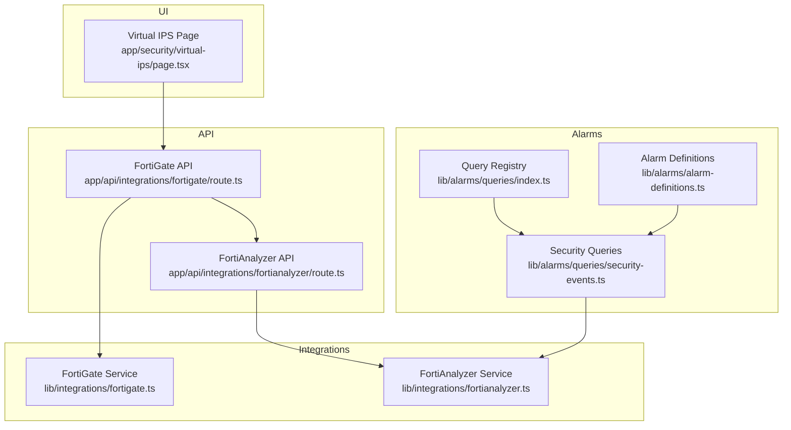
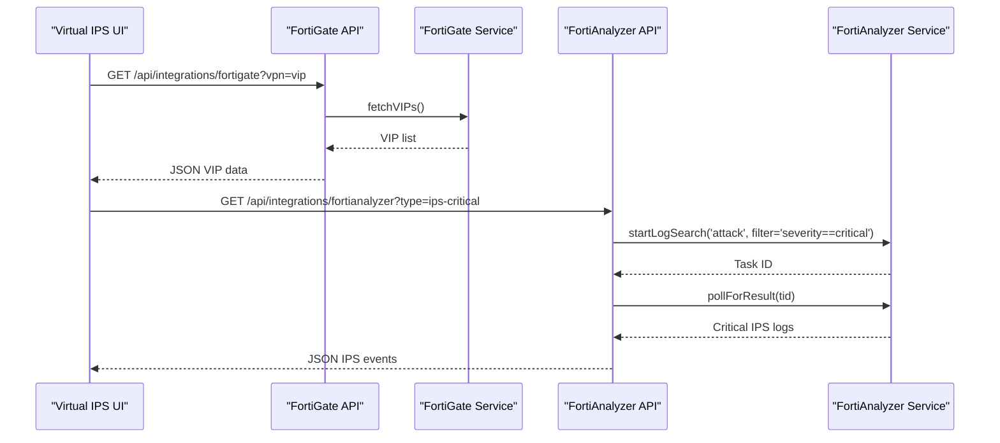
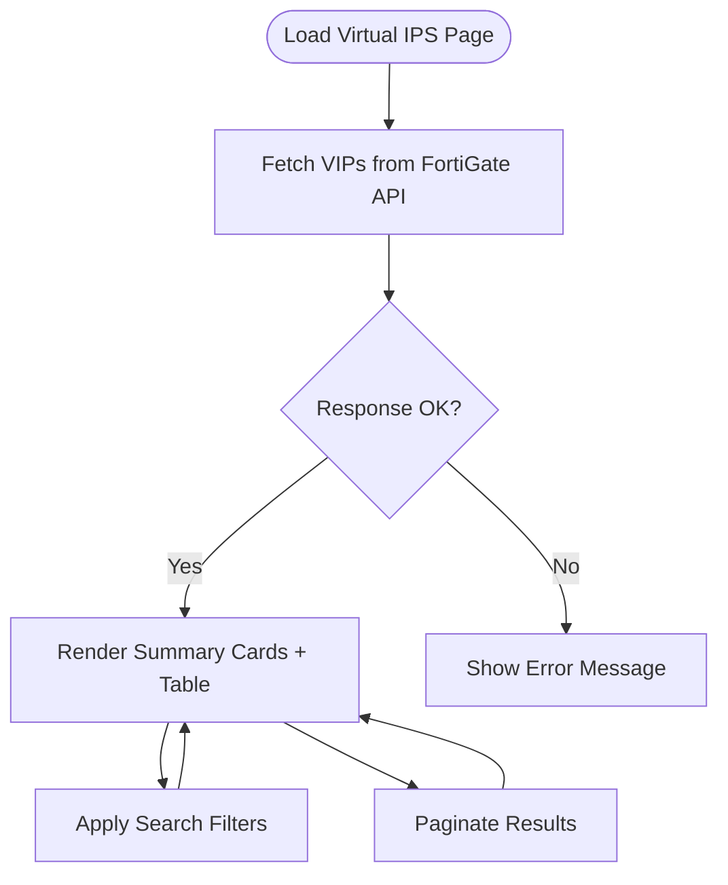
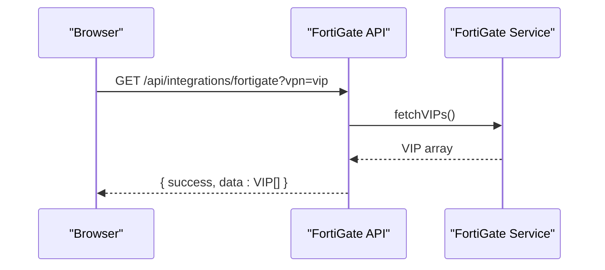
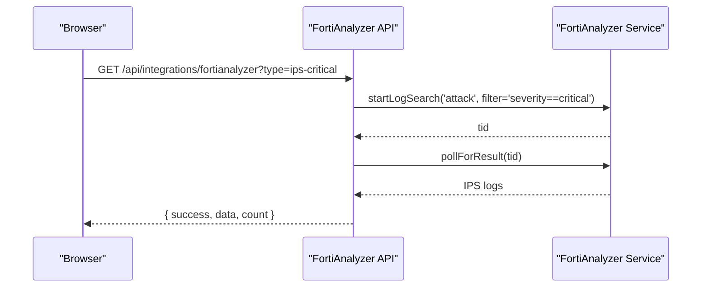
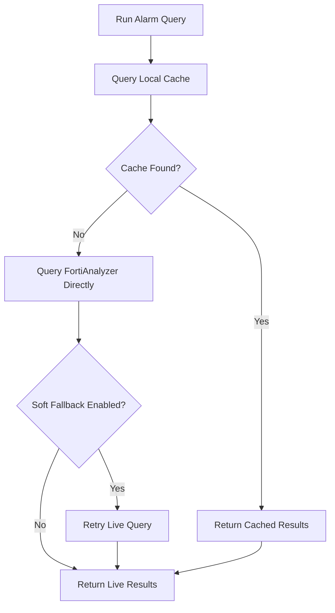
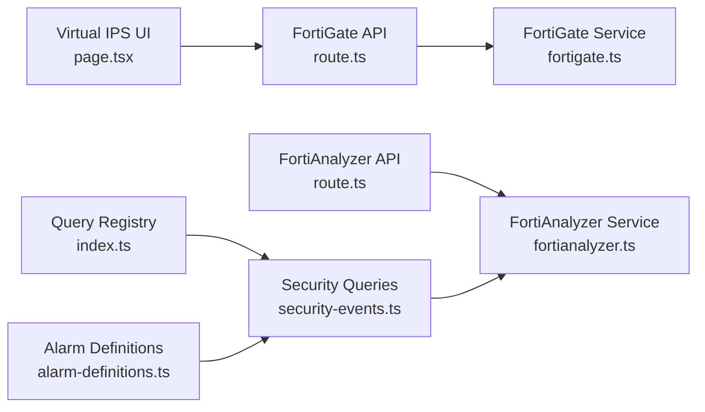

# Virtual IPS

<cite>
**Referenced Files in This Document**
- [page.tsx](file://app/security/virtual-ips/page.tsx)
- [route.ts](file://app/api/integrations/fortigate/route.ts)
- [route.ts](file://app/api/integrations/fortianalyzer/route.ts)
- [fortianalyzer.ts](file://lib/integrations/fortianalyzer.ts)
- [fortigate.ts](file://lib/integrations/fortigate.ts)
- [security-events.ts](file://lib/alarms/queries/security-events.ts)
- [alarm-definitions.ts](file://lib/alarms/alarm-definitions.ts)
- [index.ts](file://lib/alarms/queries/index.ts)
- [README.md](file://docs/20-modules/integrations/fortianalyzer.md)
- [README.md](file://docs/20-modules/security/README.md)
- [EXPOSED_ASSETS_CONFIGURATION.md](file://docs/20-modules/security/EXPOSED_ASSETS_CONFIGURATION.md)
</cite>

## Table of Contents
1. [Introduction](#introduction)
2. [Project Structure](#project-structure)
3. [Core Components](#core-components)
4. [Architecture Overview](#architecture-overview)
5. [Detailed Component Analysis](#detailed-component-analysis)
6. [Dependency Analysis](#dependency-analysis)
7. [Performance Considerations](#performance-considerations)
8. [Troubleshooting Guide](#troubleshooting-guide)
9. [Conclusion](#conclusion)
10. [Appendices](#appendices)

## Introduction
This document explains how the repository implements virtual IPS management and related security monitoring. It covers:
- Virtual appliance configuration and DNAT/VIP inspection via FortiGate integration
- Cloud-native security integration with FortiAnalyzer for centralized log viewing and correlation
- Distributed threat monitoring using alarm definitions and event queries
- Deployment and scaling strategies, resource allocation, and performance optimization
- Licensing, subscription management, and cost optimization considerations
- Integration with cloud security platforms and DevSecOps pipelines

Where applicable, this guide references concrete source files and diagrams that map to actual code.

## Project Structure
The virtual IPS capability spans several modules:
- UI: Virtual IPS list and summary cards
- APIs: FortiGate and FortiAnalyzer integration endpoints
- Integrations: Services that communicate with Fortinet appliances
- Alarms: Security event queries and alarm definitions for IPS and correlated events

**Diagram sources**
- [page.tsx:53-254](file://app/security/virtual-ips/page.tsx#L53-L254)
- [route.ts:66-362](file://app/api/integrations/fortigate/route.ts#L66-L362)
- [route.ts:137-413](file://app/api/integrations/fortianalyzer/route.ts#L137-L413)
- [fortigate.ts:171-800](file://lib/integrations/fortigate.ts#L171-L800)
- [fortianalyzer.ts:146-800](file://lib/integrations/fortianalyzer.ts#L146-L800)
- [security-events.ts:1-292](file://lib/alarms/queries/security-events.ts#L1-L292)
- [alarm-definitions.ts:1-800](file://lib/alarms/alarm-definitions.ts#L1-L800)
- [index.ts:164-293](file://lib/alarms/queries/index.ts#L164-L293)

**Section sources**
- [page.tsx:1-254](file://app/security/virtual-ips/page.tsx#L1-L254)
- [route.ts:1-559](file://app/api/integrations/fortigate/route.ts#L1-L559)
- [route.ts:1-413](file://app/api/integrations/fortianalyzer/route.ts#L1-L413)
- [fortigate.ts:1-1439](file://lib/integrations/fortigate.ts#L1-L1439)
- [fortianalyzer.ts:1-1182](file://lib/integrations/fortianalyzer.ts#L1-L1182)
- [security-events.ts:1-292](file://lib/alarms/queries/security-events.ts#L1-L292)
- [alarm-definitions.ts:1-1826](file://lib/alarms/alarm-definitions.ts#L1-L1826)
- [index.ts:164-293](file://lib/alarms/queries/index.ts#L164-L293)

## Core Components
- Virtual IPS UI: Displays DNAT/VIP entries from FortiGate, supports search, pagination, and summary metrics.
- FortiGate API: Provides configuration retrieval, status checks, and VIP data fetching.
- FortiAnalyzer API: Centralized log search, caching, and FortiView queries for security insights.
- Security Queries: IPS and malware-related event retrieval with cache-first and fallback logic.
- Alarm Definitions: Structured detection logic for IPS and correlated events.

**Section sources**
- [page.tsx:29-131](file://app/security/virtual-ips/page.tsx#L29-L131)
- [route.ts:66-362](file://app/api/integrations/fortigate/route.ts#L66-L362)
- [route.ts:137-413](file://app/api/integrations/fortianalyzer/route.ts#L137-L413)
- [security-events.ts:18-91](file://lib/alarms/queries/security-events.ts#L18-L91)
- [alarm-definitions.ts:237-251](file://lib/alarms/alarm-definitions.ts#L237-L251)

## Architecture Overview
The system integrates FortiGate and FortiAnalyzer to deliver virtual IPS visibility and threat monitoring:
- FortiGate supplies VIP/DNAT configuration and real-time stats.
- FortiAnalyzer centralizes logs and enables correlation and anomaly detection.
- Alarms query the cache and fall back to FortiAnalyzer live queries when needed.

**Diagram sources**
- [page.tsx:66-83](file://app/security/virtual-ips/page.tsx#L66-L83)
- [route.ts:347-350](file://app/api/integrations/fortigate/route.ts#L347-L350)
- [route.ts:272-296](file://app/api/integrations/fortianalyzer/route.ts#L272-L296)
- [fortigate.ts:498-508](file://lib/integrations/fortigate.ts#L498-L508)
- [fortianalyzer.ts:650-739](file://lib/integrations/fortianalyzer.ts#L650-L739)

## Detailed Component Analysis

### Virtual IPS UI and VIP Listing
The Virtual IPS page renders a table of DNAT/VIP entries from FortiGate, with:
- Summary cards for total VIPs, enabled status, port-forwarding, and interfaces
- Search across name, IP, interface, and comments
- Pagination and refresh controls

**Diagram sources**
- [page.tsx:53-131](file://app/security/virtual-ips/page.tsx#L53-L131)
- [page.tsx:175-250](file://app/security/virtual-ips/page.tsx#L175-L250)

**Section sources**
- [page.tsx:29-254](file://app/security/virtual-ips/page.tsx#L29-L254)

### FortiGate Integration API and VIP Retrieval
The FortiGate API endpoint:
- Returns configuration and status
- Supports retrieving VIPs via the FortiGate service
- Implements caching and stale-while-revalidate for dashboard performance

**Diagram sources**
- [route.ts:347-350](file://app/api/integrations/fortigate/route.ts#L347-L350)
- [fortigate.ts:498-508](file://lib/integrations/fortigate.ts#L498-L508)

**Section sources**
- [route.ts:66-362](file://app/api/integrations/fortigate/route.ts#L66-L362)
- [fortigate.ts:498-508](file://lib/integrations/fortigate.ts#L498-L508)

### FortiAnalyzer Integration API and IPS Queries
The FortiAnalyzer API:
- Manages session lifecycle and retries
- Provides cached and polled results for IPS critical events
- Supports FortiView batch queries and generic log searches

**Diagram sources**
- [route.ts:272-296](file://app/api/integrations/fortianalyzer/route.ts#L272-L296)
- [fortianalyzer.ts:650-739](file://lib/integrations/fortianalyzer.ts#L650-L739)

**Section sources**
- [route.ts:137-413](file://app/api/integrations/fortianalyzer/route.ts#L137-L413)
- [fortianalyzer.ts:146-800](file://lib/integrations/fortianalyzer.ts#L146-L800)

### Security Event Queries and Alarm Definitions
Security queries target FortiAnalyzer logs for IPS and malware events, with cache-first and soft-fallback logic. Alarm definitions encode detection logic for correlated and standalone events.

**Diagram sources**
- [security-events.ts:34-91](file://lib/alarms/queries/security-events.ts#L34-L91)
- [alarm-definitions.ts:237-251](file://lib/alarms/alarm-definitions.ts#L237-L251)

**Section sources**
- [security-events.ts:1-292](file://lib/alarms/queries/security-events.ts#L1-L292)
- [alarm-definitions.ts:1-800](file://lib/alarms/alarm-definitions.ts#L1-L800)
- [index.ts:164-293](file://lib/alarms/queries/index.ts#L164-L293)

### Cloud-Native Security Integration and Micro-Segmentation
- FortiAnalyzer integration supports centralized log aggregation and FortiView analytics, enabling cloud-native observability.
- VIP/DNAT configuration can be used for micro-segmentation of services behind secure interfaces.
- The alarm registry and definitions enable correlation across multiple vectors for coordinated defense.

**Section sources**
- [README.md:1-43](file://docs/20-modules/integrations/fortianalyzer.md#L1-L43)
- [README.md:1-17](file://docs/20-modules/security/README.md#L1-L17)
- [EXPOSED_ASSETS_CONFIGURATION.md:1-29](file://docs/20-modules/security/EXPOSED_ASSETS_CONFIGURATION.md#L1-L29)

## Dependency Analysis
The following diagram shows key dependencies among components involved in virtual IPS management and monitoring.

**Diagram sources**
- [page.tsx:53-83](file://app/security/virtual-ips/page.tsx#L53-L83)
- [route.ts:66-362](file://app/api/integrations/fortigate/route.ts#L66-L362)
- [route.ts:137-413](file://app/api/integrations/fortianalyzer/route.ts#L137-L413)
- [fortigate.ts:171-800](file://lib/integrations/fortigate.ts#L171-L800)
- [fortianalyzer.ts:146-800](file://lib/integrations/fortianalyzer.ts#L146-L800)
- [security-events.ts:1-292](file://lib/alarms/queries/security-events.ts#L1-L292)
- [index.ts:164-293](file://lib/alarms/queries/index.ts#L164-L293)
- [alarm-definitions.ts:1-800](file://lib/alarms/alarm-definitions.ts#L1-L800)

**Section sources**
- [index.ts:164-293](file://lib/alarms/queries/index.ts#L164-L293)
- [alarm-definitions.ts:1-800](file://lib/alarms/alarm-definitions.ts#L1-L800)

## Performance Considerations
- Caching and polling:
  - FortiAnalyzer API caches critical IPS logs and uses exponential backoff for polling.
  - FortiGate API implements stale-while-revalidate caching for dashboard endpoints.
- Session and retry management:
  - FortiAnalyzer service enforces session TTL, mutex-based login, and exponential backoff to avoid account lockouts.
  - Retry logic with jitter reduces transient failure impact.
- Query optimization:
  - Security queries leverage indexed fields (e.g., logtype, level) and soft fallback to minimize missed detections.

**Section sources**
- [route.ts:137-296](file://app/api/integrations/fortianalyzer/route.ts#L137-L296)
- [route.ts:13-64](file://app/api/integrations/fortigate/route.ts#L13-L64)
- [fortianalyzer.ts:146-433](file://lib/integrations/fortianalyzer.ts#L146-L433)
- [security-events.ts:18-91](file://lib/alarms/queries/security-events.ts#L18-L91)

## Troubleshooting Guide
Common issues and remedies:
- FortiGate integration not configured:
  - Verify integration configuration exists and credentials are present.
  - Use the test action to validate connectivity.
- FortiAnalyzer login failures:
  - Check credentials and account lock status; the service implements backoff to prevent lockouts.
  - Inspect session expiration and retry behavior.
- Missing IPS events:
  - Confirm cache freshness and soft fallback logic is enabled for critical events.
  - Validate filters and time windows used in queries.

**Section sources**
- [route.ts:364-559](file://app/api/integrations/fortigate/route.ts#L364-L559)
- [route.ts:53-135](file://app/api/integrations/fortianalyzer/route.ts#L53-L135)
- [fortianalyzer.ts:167-433](file://lib/integrations/fortianalyzer.ts#L167-L433)
- [security-events.ts:20-91](file://lib/alarms/queries/security-events.ts#L20-L91)

## Conclusion
The repository provides a robust foundation for virtual IPS management:
- Real-time VIP visibility via FortiGate integration
- Centralized, correlatable threat monitoring via FortiAnalyzer
- Structured alarm definitions and query registry for scalable detection
- Practical performance optimizations and resilient session/retry handling

These components can be extended to support cloud-native deployments, container-based monitoring, and DevSecOps pipelines by integrating with orchestration platforms and CI/CD hooks.

## Appendices

### Deployment Scenarios and Scaling Strategies
- Scale out FortiAnalyzer instances to handle increased log volume and correlation workloads.
- Use API caching and polling intervals to balance freshness and performance.
- Segment VIPs by workload or tenant to simplify management and improve micro-segmentation outcomes.

[No sources needed since this section provides general guidance]

### Resource Allocation and Cost Optimization
- Optimize polling intervals and cache TTLs to reduce API load.
- Prefer indexed filters in queries to minimize processing overhead.
- Consolidate redundant integrations and reuse shared sessions.

[No sources needed since this section provides general guidance]

### Licensing, Subscription Management, and Multi-Cloud Coordination
- FortiAnalyzer session management and backoff logic help avoid account lockouts and reduce administrative overhead.
- Coordinate subscriptions across cloud regions by centralizing log collection and correlation.
- Align alarm thresholds and time windows with subscription tiers to manage alert fatigue and costs.

[No sources needed since this section provides general guidance]