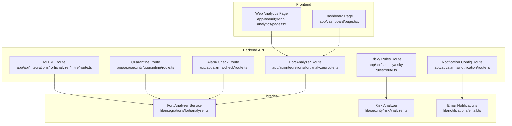
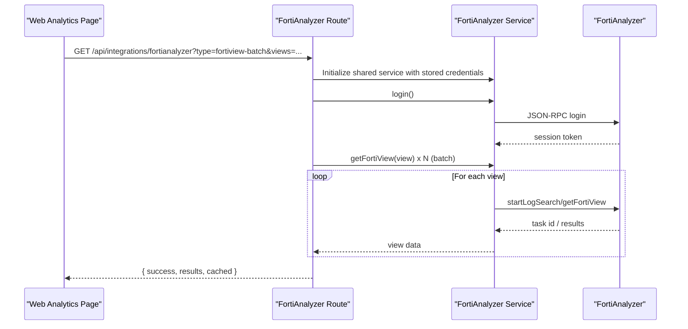
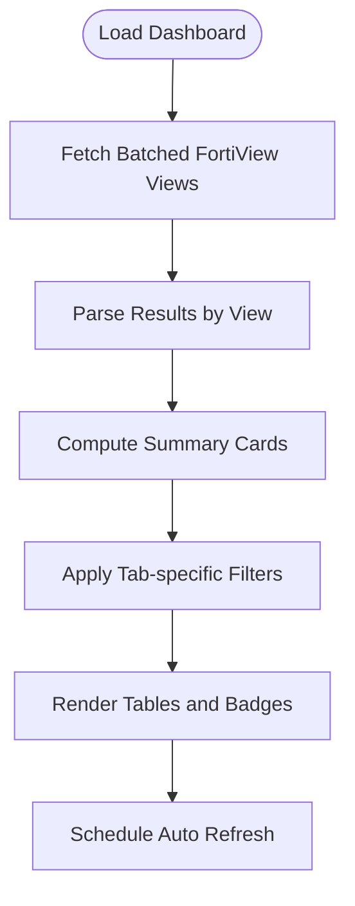
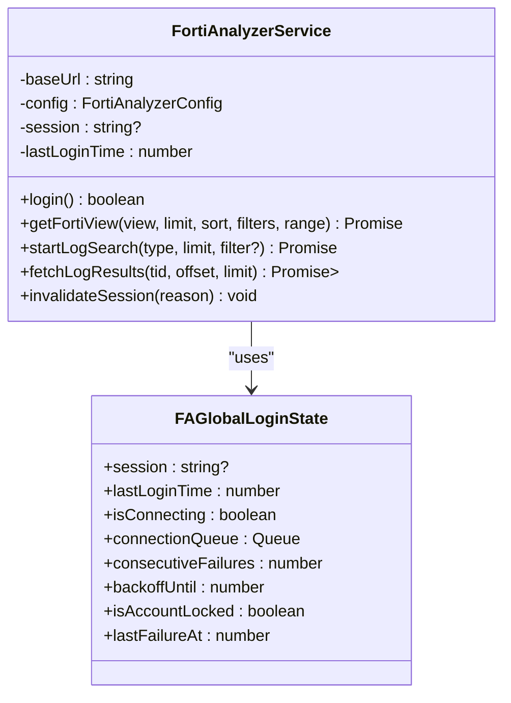
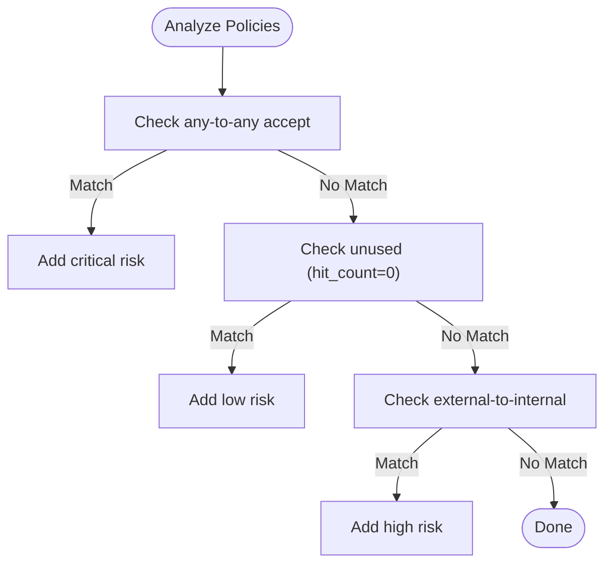
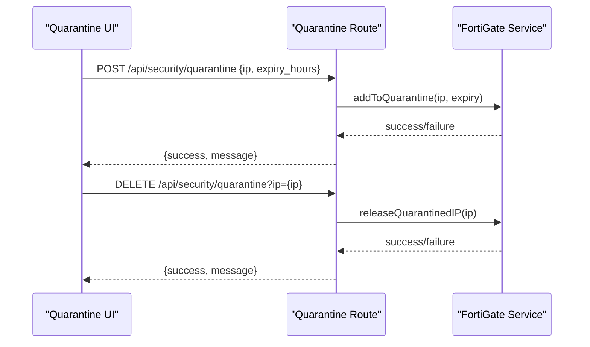
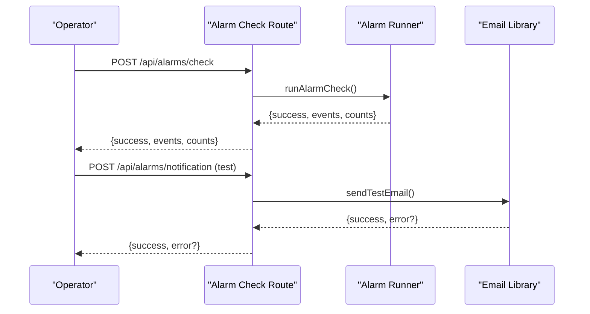
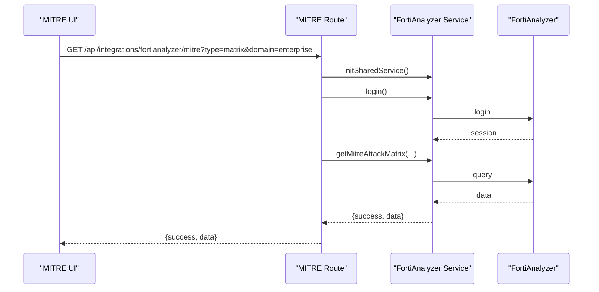
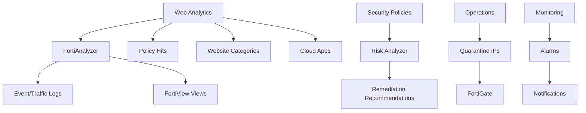
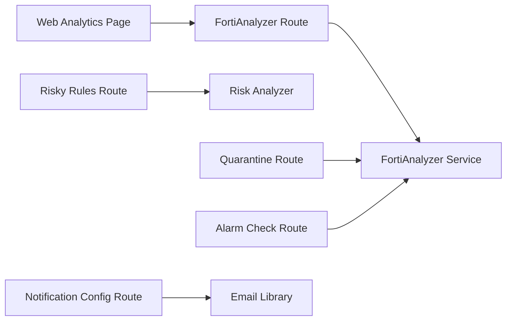

# Web Analytics Security

<cite>
**Referenced Files in This Document**
- [page.tsx](file://app/security/web-analytics/page.tsx)
- [route.ts](file://app/api/integrations/fortianalyzer/route.ts)
- [mitre/route.ts](file://app/api/integrations/fortianalyzer/mitre/route.ts)
- [fortianalyzer.ts](file://lib/integrations/fortianalyzer.ts)
- [route.ts](file://app/api/security/risky-rules/route.ts)
- [riskAnalyzer.ts](file://lib/security/riskAnalyzer.ts)
- [route.ts](file://app/api/security/quarantine/route.ts)
- [page.tsx](file://app/security/ips/page.tsx)
- [page.tsx](file://app/dashboard/page.tsx)
- [route.ts](file://app/api/alarms/check/route.ts)
- [route.ts](file://app/api/alarms/notification/route.ts)
- [email.ts](file://lib/notifications/email.ts)
</cite>

## Table of Contents
1. [Introduction](#introduction)
2. [Project Structure](#project-structure)
3. [Core Components](#core-components)
4. [Architecture Overview](#architecture-overview)
5. [Detailed Component Analysis](#detailed-component-analysis)
6. [Dependency Analysis](#dependency-analysis)
7. [Performance Considerations](#performance-considerations)
8. [Troubleshooting Guide](#troubleshooting-guide)
9. [Conclusion](#conclusion)
10. [Appendices](#appendices)

## Introduction
This document explains the web analytics security capabilities implemented in the platform, focusing on traffic analysis, anomaly detection, and security monitoring. It covers how the system classifies web traffic, detects suspicious activity, and integrates with Fortinet products (FortiGate and FortiAnalyzer) for real-time insights and automated response. It also documents security dashboards, alerting, and operational workflows, along with privacy and compliance considerations and SIEM/SOAR integration points.

## Project Structure
The web analytics security surface is primarily implemented in:
- Frontend dashboard pages under app/security/web-analytics
- Backend integration routes under app/api/integrations/fortianalyzer
- FortiAnalyzer service library under lib/integrations/fortianalyzer
- Security policy risk analyzer under lib/security/riskAnalyzer
- Quarantine management under app/api/security/quarantine
- Alarms and notifications under app/api/alarms and lib/notifications

**Diagram sources**
- [page.tsx:137-755](file://app/security/web-analytics/page.tsx#L137-L755)
- [route.ts:1-413](file://app/api/integrations/fortianalyzer/route.ts#L1-L413)
- [mitre/route.ts:1-77](file://app/api/integrations/fortianalyzer/mitre/route.ts#L1-L77)
- [fortianalyzer.ts:146-200](file://lib/integrations/fortianalyzer.ts#L146-L200)
- [route.ts:1-45](file://app/api/security/risky-rules/route.ts#L1-L45)
- [riskAnalyzer.ts:1-126](file://lib/security/riskAnalyzer.ts#L1-L126)
- [route.ts:53-149](file://app/api/security/quarantine/route.ts#L53-L149)
- [page.tsx:311-346](file://app/dashboard/page.tsx#L311-L346)
- [route.ts:1-34](file://app/api/alarms/check/route.ts#L1-L34)
- [route.ts:1-106](file://app/api/alarms/notification/route.ts#L1-L106)
- [email.ts:193-244](file://lib/notifications/email.ts#L193-L244)

**Section sources**
- [page.tsx:137-755](file://app/security/web-analytics/page.tsx#L137-L755)
- [route.ts:1-413](file://app/api/integrations/fortianalyzer/route.ts#L1-L413)

## Core Components
- Web Analytics Dashboard: Displays FortiView metrics for websites, users, policy hits, and cloud applications, with filtering, sorting, and time-range selection.
- FortiAnalyzer Integration: Provides batched FortiView queries, caching, and robust retry/backoff for reliability.
- Risk Analyzer: Scans firewall policies for misconfigurations and unused rules.
- Quarantine Management: Adds/removes quarantined IPs via FortiGate integration.
- Alarms and Notifications: Centralized alarm evaluation and email notification configuration/testing.

**Section sources**
- [page.tsx:137-755](file://app/security/web-analytics/page.tsx#L137-L755)
- [route.ts:352-389](file://app/api/integrations/fortianalyzer/route.ts#L352-L389)
- [riskAnalyzer.ts:73-125](file://lib/security/riskAnalyzer.ts#L73-L125)
- [route.ts:53-149](file://app/api/security/quarantine/route.ts#L53-L149)
- [route.ts:1-34](file://app/api/alarms/check/route.ts#L1-L34)
- [route.ts:1-106](file://app/api/alarms/notification/route.ts#L1-L106)

## Architecture Overview
The system integrates FortiGate and FortiAnalyzer to deliver web analytics and security insights. The frontend queries backend routes that authenticate with FortiAnalyzer, execute FortiView queries, and return aggregated results. The backend caches frequently accessed views and implements retry/backoff to handle transient failures. Security policy risks are analyzed offline and surfaced to administrators. Quarantine actions are executed against FortiGate. Alarms and notifications provide real-time alerting.

**Diagram sources**
- [page.tsx:154-200](file://app/security/web-analytics/page.tsx#L154-L200)
- [route.ts:352-389](file://app/api/integrations/fortianalyzer/route.ts#L352-L389)
- [fortianalyzer.ts:146-200](file://lib/integrations/fortianalyzer.ts#L146-L200)

## Detailed Component Analysis

### Web Analytics Dashboard
- Purpose: Present top websites, browsing users, policy hits, and cloud applications with threat indicators and bandwidth metrics.
- Features:
  - Time range selector (15 min, 1 hour).
  - Real-time refresh and auto-refresh intervals.
  - Filtering per tab (text search across key fields).
  - Summary cards for categories, active users, total bandwidth, and blocked threats.
  - Threat-weighted top 20 sites highlighting blocked vs passed threats.
- Data models:
  - WebsiteCategory: aggregations by category/domain with threat metrics.
  - BrowsingUser: per-user metrics including bandwidth, sessions, and threat weight.
  - PolicyHit: policy enforcement statistics by policy and interfaces.
  - CloudApp: cloud application risk and session metrics.

**Diagram sources**
- [page.tsx:154-200](file://app/security/web-analytics/page.tsx#L154-L200)
- [page.tsx:263-274](file://app/security/web-analytics/page.tsx#L263-L274)

**Section sources**
- [page.tsx:137-755](file://app/security/web-analytics/page.tsx#L137-L755)

### FortiAnalyzer Integration
- Authentication and session management:
  - Uses stored credentials from database for shared service initialization.
  - Implements exponential backoff and login throttling to prevent account lockouts.
  - Detects session expiration and invalidation to recover gracefully.
- Query orchestration:
  - Supports single and batch FortiView views with caching and TTL.
  - Polls for log search results with exponential backoff.
  - Falls back to NMS EventCache when FortiAnalyzer returns empty.
- Reliability:
  - Retry wrappers for transient errors.
  - In-memory cache keyed by parameters for fast responses.

**Diagram sources**
- [fortianalyzer.ts:146-200](file://lib/integrations/fortianalyzer.ts#L146-L200)
- [fortianalyzer.ts:114-144](file://lib/integrations/fortianalyzer.ts#L114-L144)

**Section sources**
- [route.ts:1-413](file://app/api/integrations/fortianalyzer/route.ts#L1-L413)
- [mitre/route.ts:1-77](file://app/api/integrations/fortianalyzer/mitre/route.ts#L1-L77)
- [fortianalyzer.ts:146-200](file://lib/integrations/fortianalyzer.ts#L146-L200)

### Security Policy Risk Analyzer
- Purpose: Identify risky firewall policy configurations to reduce exposure and improve hygiene.
- Detection rules:
  - Any-to-any accept policies (critical).
  - Unused policies (low severity).
  - External-to-internal exposure (high severity).
- Output: List of DetectedRisk entries with severity, category, and affected assets.

**Diagram sources**
- [riskAnalyzer.ts:34-48](file://lib/security/riskAnalyzer.ts#L34-L48)
- [riskAnalyzer.ts:53-56](file://lib/security/riskAnalyzer.ts#L53-L56)
- [riskAnalyzer.ts:61-68](file://lib/security/riskAnalyzer.ts#L61-L68)
- [riskAnalyzer.ts:73-125](file://lib/security/riskAnalyzer.ts#L73-L125)

**Section sources**
- [route.ts:1-45](file://app/api/security/risky-rules/route.ts#L1-L45)
- [riskAnalyzer.ts:1-126](file://lib/security/riskAnalyzer.ts#L1-L126)

### Quarantine Management
- Purpose: Manage quarantined IPs via FortiGate integration.
- Operations:
  - Retrieve quarantined IPs.
  - Add IP with optional expiry.
  - Remove IP from quarantine.
- Integration: Delegates to FortiGate service methods for add/release.

**Diagram sources**
- [route.ts:80-149](file://app/api/security/quarantine/route.ts#L80-L149)
- [route.ts:694-722](file://app/api/integrations/fortianalyzer/route.ts#L694-L722)

**Section sources**
- [route.ts:53-149](file://app/api/security/quarantine/route.ts#L53-L149)

### Alarms and Notifications
- Alarm evaluation: Manual trigger endpoint invokes the alarm runner to evaluate conditions and emit events.
- Notification configuration: SMTP settings persisted in DB; supports masking passwords and sending test emails.
- Severity and category mapping: Localized labels for Turkish environments.

**Diagram sources**
- [route.ts:1-34](file://app/api/alarms/check/route.ts#L1-L34)
- [route.ts:97-105](file://app/api/alarms/notification/route.ts#L97-L105)
- [email.ts:193-244](file://lib/notifications/email.ts#L193-L244)

**Section sources**
- [route.ts:1-34](file://app/api/alarms/check/route.ts#L1-L34)
- [route.ts:1-106](file://app/api/alarms/notification/route.ts#L1-L106)
- [email.ts:193-244](file://lib/notifications/email.ts#L193-L244)

### MITRE ATT&CK Integration
- Purpose: Retrieve MITRE attack matrix and technique details from FortiAnalyzer.
- Endpoint parameters: type (matrix or technique), domain, techId, time range, and ADOM.
- Authentication: Uses stored FortiAnalyzer credentials to log in and fetch data.

**Diagram sources**
- [mitre/route.ts:57-71](file://app/api/integrations/fortianalyzer/mitre/route.ts#L57-L71)
- [fortianalyzer.ts:146-200](file://lib/integrations/fortianalyzer.ts#L146-L200)

**Section sources**
- [mitre/route.ts:1-77](file://app/api/integrations/fortianalyzer/mitre/route.ts#L1-L77)

### Conceptual Overview
- Web traffic classification: Aggregated by category/domain and cloud application group, with bandwidth and session metrics.
- Suspicious activity detection: Threat-weighted scoring and blocked/passed counters for domains and users.
- Automated response: Quarantine management via FortiGate; policy risk remediation recommendations.
- SIEM/SOAR integration: FortiAnalyzer event/log APIs and MITRE matrix enable correlation and orchestration.

[No sources needed since this diagram shows conceptual workflow, not actual code structure]

## Dependency Analysis
- Frontend depends on backend integration routes for FortiView data.
- Backend routes depend on FortiAnalyzer service for authentication and queries.
- Risk analyzer is decoupled and invoked by a dedicated route.
- Quarantine route depends on FortiGate service methods.
- Alarms and notifications are independent subsystems with DB-backed configuration.

**Diagram sources**
- [page.tsx:154-200](file://app/security/web-analytics/page.tsx#L154-L200)
- [route.ts:1-413](file://app/api/integrations/fortianalyzer/route.ts#L1-L413)
- [riskAnalyzer.ts:73-125](file://lib/security/riskAnalyzer.ts#L73-L125)
- [route.ts:53-149](file://app/api/security/quarantine/route.ts#L53-L149)
- [route.ts:1-34](file://app/api/alarms/check/route.ts#L1-L34)
- [route.ts:1-106](file://app/api/alarms/notification/route.ts#L1-L106)
- [email.ts:193-244](file://lib/notifications/email.ts#L193-L244)

**Section sources**
- [page.tsx:137-755](file://app/security/web-analytics/page.tsx#L137-L755)
- [route.ts:1-413](file://app/api/integrations/fortianalyzer/route.ts#L1-L413)

## Performance Considerations
- Single-login batching: The dashboard performs a single batched FortiView query to minimize login overhead and reduce latency.
- Caching: In-memory caches for FortiView results and critical IPS logs reduce repeated workloads.
- Retry/backoff: Robust retry logic with exponential backoff prevents cascading failures and improves resilience.
- Auto-refresh cadence: Controlled refresh intervals balance freshness with resource usage.

[No sources needed since this section provides general guidance]

## Troubleshooting Guide
- FortiAnalyzer connectivity:
  - Verify stored credentials and host reachability.
  - Check login throttling and session expiration handling.
- Empty results:
  - Confirm time range and filters.
  - Review fallback to NMS EventCache for config revisions.
- Quarantine operations:
  - Ensure FortiGate integration is configured and reachable.
  - Validate IP format and expiry parameters.
- Alarms and notifications:
  - Test SMTP configuration and send a test email.
  - Trigger manual alarm evaluation to validate pipeline.

**Section sources**
- [route.ts:160-165](file://app/api/integrations/fortianalyzer/route.ts#L160-L165)
- [route.ts:213-266](file://app/api/integrations/fortianalyzer/route.ts#L213-L266)
- [route.ts:80-149](file://app/api/security/quarantine/route.ts#L80-L149)
- [route.ts:97-105](file://app/api/alarms/notification/route.ts#L97-L105)
- [route.ts:18-33](file://app/api/alarms/check/route.ts#L18-L33)

## Conclusion
The platform delivers a comprehensive web analytics security solution by integrating FortiGate and FortiAnalyzer to visualize traffic, detect anomalies, and manage risks. The dashboard provides actionable insights, while backend services ensure reliability and resilience. Automated quarantine and policy risk analysis streamline remediation, and alarms/nofitications keep operators informed. MITRE integration enables advanced correlation for SOAR orchestration.

## Appendices

### Security Dashboard Components
- Summary cards: Category count, active users, total bandwidth, blocked threats.
- Tabs: Top websites, high-threat sites, top users, policy hits, cloud applications.
- Filters: Text-based search per tab; time-range selector; refresh controls.

**Section sources**
- [page.tsx:309-334](file://app/security/web-analytics/page.tsx#L309-L334)
- [page.tsx:343-368](file://app/security/web-analytics/page.tsx#L343-L368)

### Example Workflows
- Traffic analysis:
  - Select time range and view top websites by bandwidth.
  - Drill down into high-threat domains and review policy hits.
- Suspicious activity:
  - Identify users with high threat-weight scores and correlate with policy enforcement.
- Automated response:
  - Quarantine high-risk IPs via the quarantine route.
- Incident response:
  - Trigger manual alarm evaluation and send test notifications.

**Section sources**
- [page.tsx:154-200](file://app/security/web-analytics/page.tsx#L154-L200)
- [route.ts:80-149](file://app/api/security/quarantine/route.ts#L80-L149)
- [route.ts:18-33](file://app/api/alarms/check/route.ts#L18-L33)
- [route.ts:97-105](file://app/api/alarms/notification/route.ts#L97-L105)

### Privacy Controls and Compliance
- Data minimization: Queries target specific views and time ranges.
- Access control: FortiAnalyzer credentials are stored securely and masked in API responses.
- Logging: Audit trails for configuration changes and admin events; fallback to NMS EventCache for continuity.

**Section sources**
- [route.ts:149-158](file://app/api/integrations/fortianalyzer/route.ts#L149-L158)
- [route.ts:213-266](file://app/api/integrations/fortianalyzer/route.ts#L213-L266)

### SIEM and SOAR Integration
- SIEM ingestion: FortiAnalyzer event and traffic log APIs enable log correlation and alerting.
- SOAR orchestration: MITRE matrix and technique details support automated playbooks; quarantine actions integrate with FortiGate.

**Section sources**
- [route.ts:195-197](file://app/api/integrations/fortianalyzer/route.ts#L195-L197)
- [mitre/route.ts:57-71](file://app/api/integrations/fortianalyzer/mitre/route.ts#L57-L71)
- [page.tsx:1-34](file://app/security/ips/page.tsx#L1-L34)