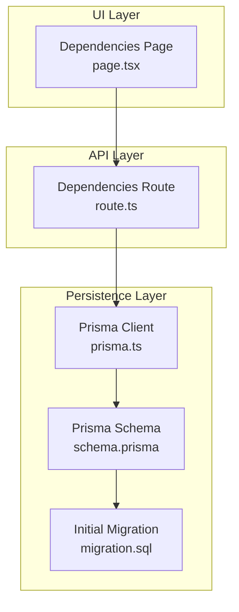
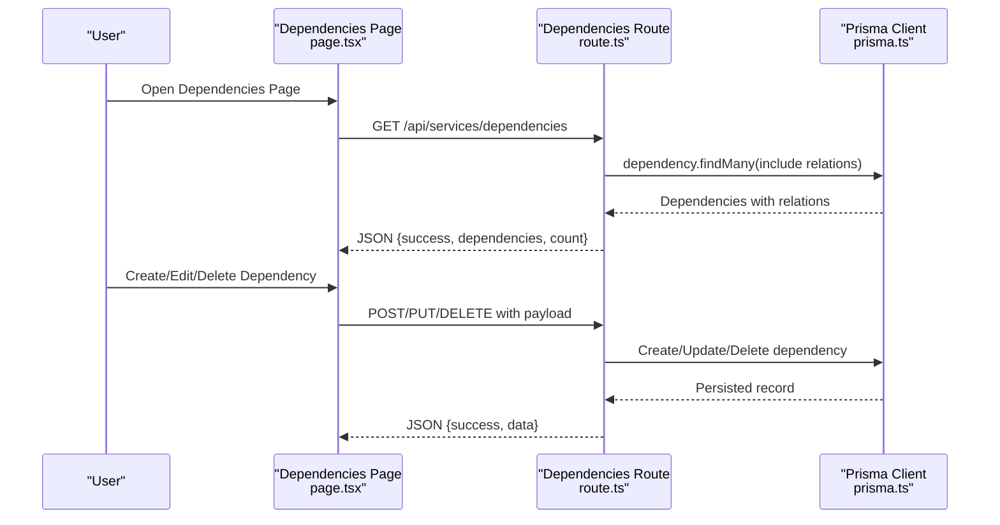
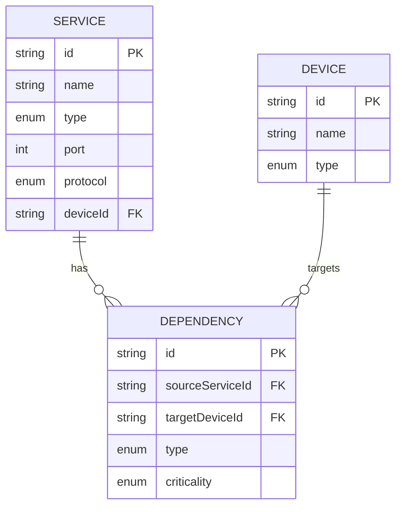
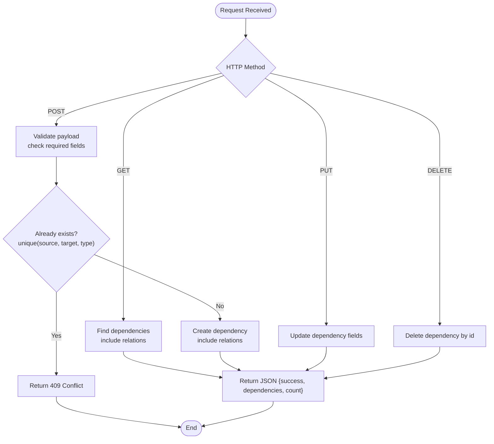
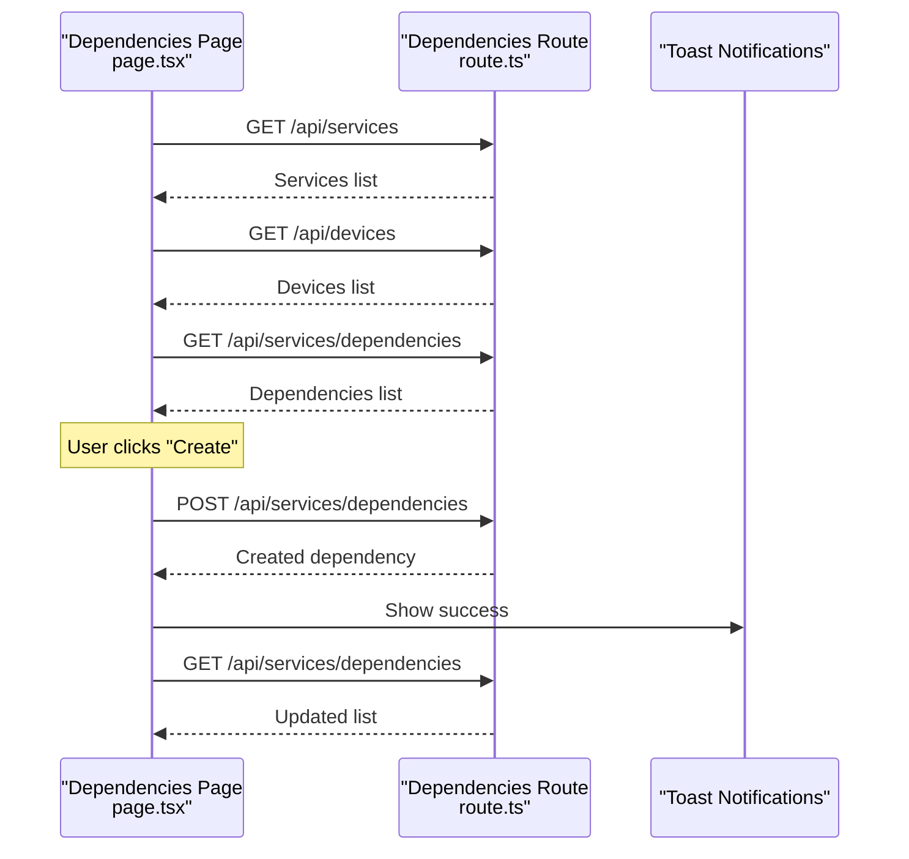
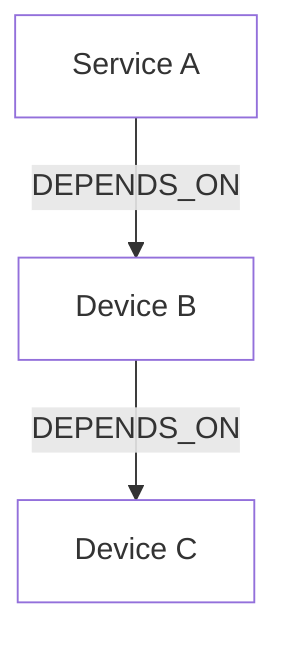

# Dependency Management

<cite>
**Referenced Files in This Document**
- [schema.prisma](file://prisma/schema.prisma)
- [migration.sql](file://prisma/migrations/20260101220408_initial_schema/migration.sql)
- [route.ts](file://app/api/services/dependencies/route.ts)
- [page.tsx](file://app/services/dependencies/page.tsx)
- [types/index.ts](file://types/index.ts)
- [prisma.ts](file://lib/prisma.ts)
- [relationship-engine.ts](file://lib/topology/relationship-engine.ts)
</cite>

## Table of Contents
1. [Introduction](#introduction)
2. [Project Structure](#project-structure)
3. [Core Components](#core-components)
4. [Architecture Overview](#architecture-overview)
5. [Detailed Component Analysis](#detailed-component-analysis)
6. [Dependency Analysis](#dependency-analysis)
7. [Performance Considerations](#performance-considerations)
8. [Troubleshooting Guide](#troubleshooting-guide)
9. [Conclusion](#conclusion)

## Introduction
This document describes the dependency management system for service-to-service and service-to-device relationships within the platform. It explains how dependencies are modeled, persisted, and exposed via APIs, along with the UI for configuration and visualization. It also covers dependency validation, configuration interfaces, and how the system supports impact analysis and health monitoring.

## Project Structure
The dependency management system spans three primary layers:
- Data model and persistence: Prisma schema and migrations define the dependency entity and its relations.
- API layer: Next.js route handlers expose CRUD operations for dependencies.
- UI layer: A dedicated page renders dependency records, supports filtering and pagination, and provides forms to create/update/delete entries.

**Diagram sources**
- [page.tsx:130-134](file://app/services/dependencies/page.tsx#L130-L134)
- [route.ts:4-81](file://app/api/services/dependencies/route.ts#L4-L81)
- [schema.prisma:344-387](file://prisma/schema.prisma#L344-L387)
- [migration.sql:236-248](file://prisma/migrations/20260101220408_initial_schema/migration.sql#L236-L248)
- [prisma.ts:10-20](file://lib/prisma.ts#L10-L20)

**Section sources**
- [page.tsx:130-134](file://app/services/dependencies/page.tsx#L130-L134)
- [route.ts:4-81](file://app/api/services/dependencies/route.ts#L4-L81)
- [schema.prisma:344-387](file://prisma/schema.prisma#L344-L387)
- [migration.sql:236-248](file://prisma/migrations/20260101220408_initial_schema/migration.sql#L236-L248)
- [prisma.ts:10-20](file://lib/prisma.ts#L10-L20)

## Core Components
- Dependency entity: Represents a directed relationship from a Service to a Device, with type and criticality attributes.
- Service and Device entities: Provide the source and target sides of a dependency.
- API endpoints: Retrieve, create, update, and delete dependencies; optionally filter by service.
- UI page: Lists dependencies, allows filtering/searching, pagination, and inline editing/deletion; provides creation form.

Key implementation references:
- Dependency model and enums: [schema.prisma:370-387](file://prisma/schema.prisma#L370-L387), [schema.prisma:575-584](file://prisma/schema.prisma#L575-L584)
- Service and Device relations: [schema.prisma:344-368](file://prisma/schema.prisma#L344-L368), [schema.prisma:151-228](file://prisma/schema.prisma#L151-L228)
- API handlers: [route.ts:4-227](file://app/api/services/dependencies/route.ts#L4-L227)
- UI page: [page.tsx:69-518](file://app/services/dependencies/page.tsx#L69-L518)
- Shared types: [types/index.ts:274-293](file://types/index.ts#L274-L293)

**Section sources**
- [schema.prisma:344-387](file://prisma/schema.prisma#L344-L387)
- [route.ts:4-227](file://app/api/services/dependencies/route.ts#L4-L227)
- [page.tsx:69-518](file://app/services/dependencies/page.tsx#L69-L518)
- [types/index.ts:274-293](file://types/index.ts#L274-L293)

## Architecture Overview
The system follows a layered architecture:
- UI triggers actions via the Dependencies Page.
- API routes validate inputs, enforce uniqueness, and persist changes.
- Prisma client executes queries against the database.
- Data model enforces referential integrity and indexes for performance.

**Diagram sources**
- [page.tsx:87-104](file://app/services/dependencies/page.tsx#L87-L104)
- [route.ts:4-227](file://app/api/services/dependencies/route.ts#L4-L227)
- [prisma.ts:10-20](file://lib/prisma.ts#L10-L20)

## Detailed Component Analysis

### Data Model and Relations
The dependency model connects a Service to a Device and captures type and criticality. Unique constraints prevent duplicate relationships per type. Indexes optimize lookups.

**Diagram sources**
- [schema.prisma:344-368](file://prisma/schema.prisma#L344-L368)
- [schema.prisma:370-387](file://prisma/schema.prisma#L370-L387)

**Section sources**
- [schema.prisma:344-387](file://prisma/schema.prisma#L344-L387)
- [migration.sql:394-401](file://prisma/migrations/20260101220408_initial_schema/migration.sql#L394-L401)

### API Handlers
The route module implements:
- GET: Fetch dependencies for a specific service or all dependencies, with included relations and ordering.
- POST: Create a new dependency with validation and uniqueness checks.
- PUT: Update dependency attributes (type, criticality, description).
- DELETE: Remove a dependency by ID.

**Diagram sources**
- [route.ts:4-227](file://app/api/services/dependencies/route.ts#L4-L227)

**Section sources**
- [route.ts:4-227](file://app/api/services/dependencies/route.ts#L4-L227)

### UI Page and Forms
The Dependencies Page:
- Loads dependencies, services, and devices on mount.
- Provides filtering by service name and pagination.
- Offers summary cards for counts of low/high critical dependencies.
- Supports create/edit dialogs with dropdowns for type and criticality.
- Uses toast notifications for feedback.

**Diagram sources**
- [page.tsx:106-134](file://app/services/dependencies/page.tsx#L106-L134)
- [page.tsx:136-167](file://app/services/dependencies/page.tsx#L136-L167)
- [route.ts:4-81](file://app/api/services/dependencies/route.ts#L4-L81)

**Section sources**
- [page.tsx:69-518](file://app/services/dependencies/page.tsx#L69-L518)

### Dependency Types and Criticality
Supported dependency types include depends-on, requires, provides, communicates-with, deployed-on, hosted-on, and connected-to. Criticality levels are CRITICAL, HIGH, MEDIUM, LOW, and INFORMATIONAL.

**Section sources**
- [schema.prisma:575-584](file://prisma/schema.prisma#L575-L584)
- [types/index.ts:104-106](file://types/index.ts#L104-L106)
- [types/index.ts:274-293](file://types/index.ts#L274-L293)

## Dependency Analysis
This section outlines how the system models and manages dependencies, including direct and transitive relationships, circular dependency detection, resolution, impact analysis, and visualization.

### Modeling Dependencies
- Direct dependencies: A Service depends on a Device via a single Dependency record.
- Transitive dependencies: Not explicitly modeled in the current schema; can be computed by traversing the dependency graph.
- Circular dependency detection: Not enforced at the database level; can be implemented in application logic during creation or updates.

[No sources needed since this diagram shows conceptual relationships]

### Dependency Resolution and Validation
- Uniqueness: The unique constraint on (sourceServiceId, targetDeviceId, type) prevents duplicates.
- Validation: Required fields are checked before creation; errors return appropriate HTTP status codes.

**Section sources**
- [schema.prisma:383-384](file://prisma/schema.prisma#L383-L384)
- [route.ts:88-109](file://app/api/services/dependencies/route.ts#L88-L109)

### Impact Analysis Workflows
- Current state: The UI displays criticality counts and allows manual filtering.
- Recommended enhancements:
  - Compute impact score based on criticality and dependency depth.
  - Provide a downstream impact view showing affected services/devices.
  - Offer bulk operations for cascading updates or deletions with warnings.

[No sources needed since this section provides general guidance]

### Cascade Failure Prediction
- Conceptual approach: Traverse dependency graph from impacted nodes and propagate failure indicators.
- UI extension: Add “Impact Preview” modal showing affected nodes before destructive operations.

[No sources needed since this section provides general guidance]

### Visualization Techniques
- Existing UI: Tabular view with criticality badges and pagination.
- Enhancement ideas:
  - Graph visualization of dependencies (nodes for services/devices, edges for dependency types).
  - Heatmaps for criticality distribution.
  - Exportable dependency charts for documentation.

[No sources needed since this section provides general guidance]

### Dependency Chains Analysis
- Chain extraction: Starting from a service, follow dependencies to collect upstream/downstream chains.
- Risk scoring: Aggregate criticality along chains to highlight high-risk paths.

[No sources needed since this section provides general guidance]

### Impact Assessment Methodologies
- Quantitative: Summarize criticality levels and counts.
- Qualitative: Use dependency types to categorize relationships (provides vs. depends-on).
- Predictive: Combine historical health metrics with dependency depth to estimate risk.

[No sources needed since this section provides general guidance]

### Practical Examples
- Setup a dependency: Create a DEPENDS_ON relationship from a Service to a Device.
- Conflict resolution: If a duplicate is detected, adjust type or target to avoid conflict.
- Explore the graph: Use the table to filter by service/device names and navigate pages.

[No sources needed since this section provides general guidance]

### Maintenance, Change Propagation, and Health Monitoring
- Maintenance: Use the UI to update criticality or remove stale dependencies.
- Change propagation: When removing a dependency, warn about potential impacts; consider revalidation of dependent services.
- Health monitoring: Surface critical dependency counts and integrate with device health snapshots for correlation.

[No sources needed since this section provides general guidance]

## Dependency Analysis

### Dependency Resolution Algorithms
- Uniqueness enforcement: Prevents duplicate typed relationships.
- Existence checks: Ensure source service and target device exist before creating a dependency.
- Cascading deletes: On dependency deletion, related audit logs or snapshots can be handled separately.

**Section sources**
- [schema.prisma:383-384](file://prisma/schema.prisma#L383-L384)
- [route.ts:88-109](file://app/api/services/dependencies/route.ts#L88-L109)

### Relationship Mapping Tools
- UI mapping: Dropdowns for selecting source service and target device.
- Type mapping: Enum-based selection for dependency types.
- Criticality mapping: Enum-based selection for criticality levels.

**Section sources**
- [page.tsx:420-515](file://app/services/dependencies/page.tsx#L420-L515)
- [types/index.ts:274-293](file://types/index.ts#L274-L293)

### Dependency Validation Processes
- Input validation: Required fields check.
- Duplicate prevention: Unique constraint check.
- Error handling: Centralized error responses with appropriate HTTP status codes.

**Section sources**
- [route.ts:88-109](file://app/api/services/dependencies/route.ts#L88-L109)
- [route.ts:155-197](file://app/api/services/dependencies/route.ts#L155-L197)

### Dependency Visualization Techniques
- Tabular visualization: Filterable and paginated table with criticality badges.
- Summary cards: Count of total dependencies and counts per criticality level.

**Section sources**
- [page.tsx:312-344](file://app/services/dependencies/page.tsx#L312-L344)
- [page.tsx:263-294](file://app/services/dependencies/page.tsx#L263-L294)

### Dependency Chains Analysis
- Chain construction: Traverse from a given service to collect all dependents.
- Depth-first traversal: Optional enhancement to compute chain depths and risk scores.

[No sources needed since this section provides general guidance]

### Impact Assessment Methodologies
- Criticality aggregation: Summarize by criticality buckets.
- Dependency type analysis: Distinguish between providing and consuming relationships.

[No sources needed since this section provides general guidance]

## Performance Considerations
- Database indexes: Unique and indexed fields improve lookup performance for dependencies.
- Query optimization: Use selective filters (serviceId) and include only necessary relations.
- Pagination: UI implements pagination to reduce payload sizes.

**Section sources**
- [schema.prisma:383-386](file://prisma/schema.prisma#L383-L386)
- [route.ts:11-43](file://app/api/services/dependencies/route.ts#L11-L43)
- [page.tsx:272-276](file://app/services/dependencies/page.tsx#L272-L276)

## Troubleshooting Guide
Common issues and resolutions:
- Missing required fields: Ensure sourceServiceId and targetDeviceId are provided.
- Duplicate dependency: Adjust type or target to avoid unique constraint violation.
- Update failures: Verify dependency ID exists before attempting updates.
- Deletion failures: Confirm dependency ID is present.

**Section sources**
- [route.ts:88-109](file://app/api/services/dependencies/route.ts#L88-L109)
- [route.ts:155-197](file://app/api/services/dependencies/route.ts#L155-L197)
- [route.ts:205-226](file://app/api/services/dependencies/route.ts#L205-L226)

## Conclusion
The dependency management system provides a robust foundation for modeling service-to-device relationships with strong data integrity, clear APIs, and a user-friendly UI. Extending the system with graph traversal, impact analysis, and predictive failure modeling would further enhance operational insights and risk management.