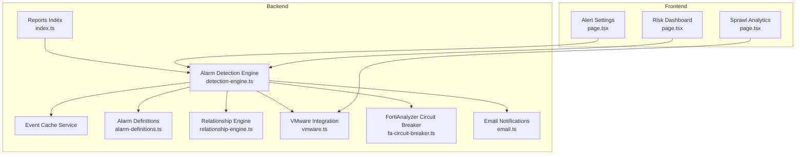
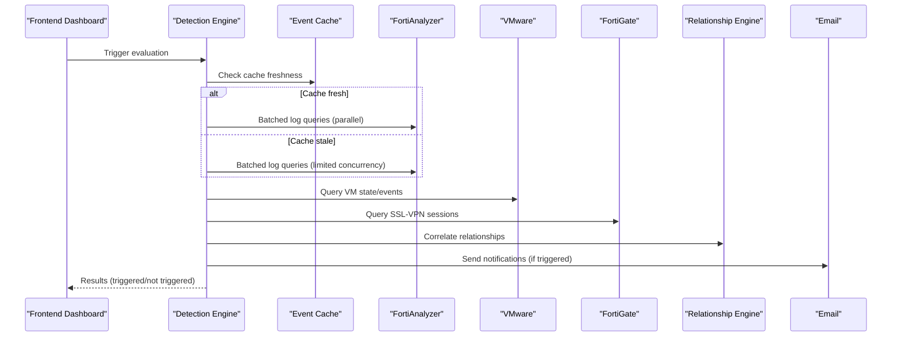
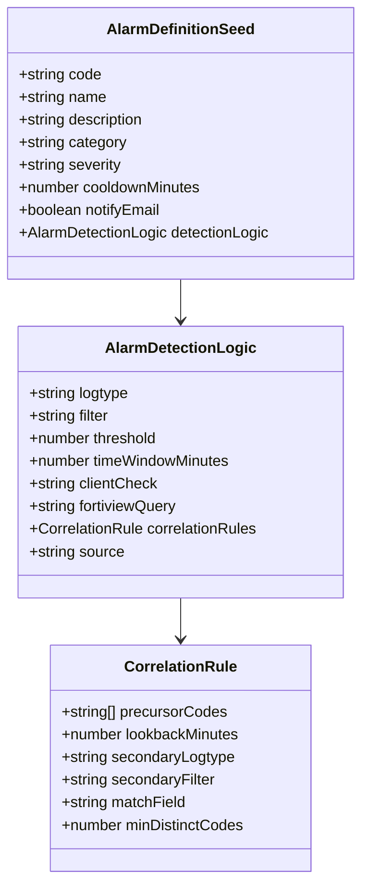
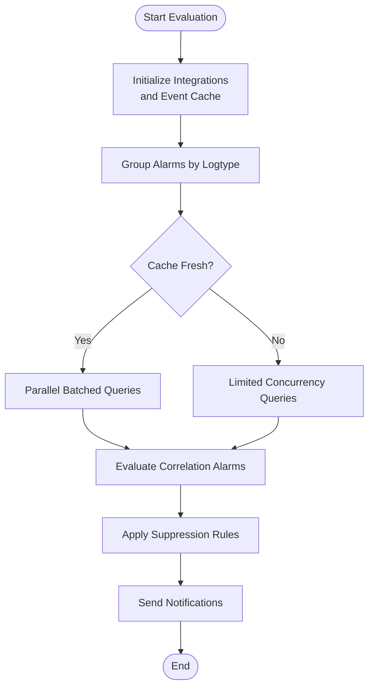
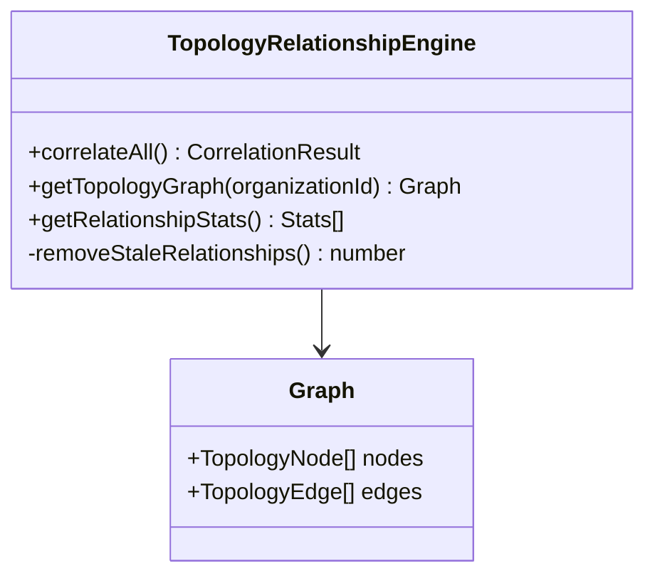
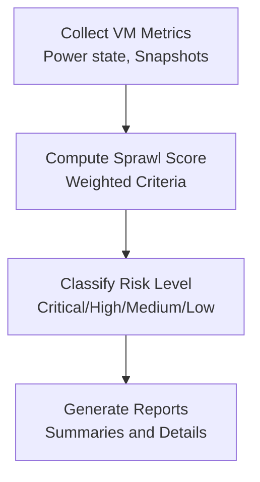
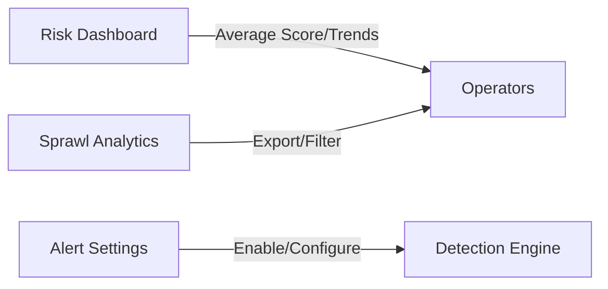
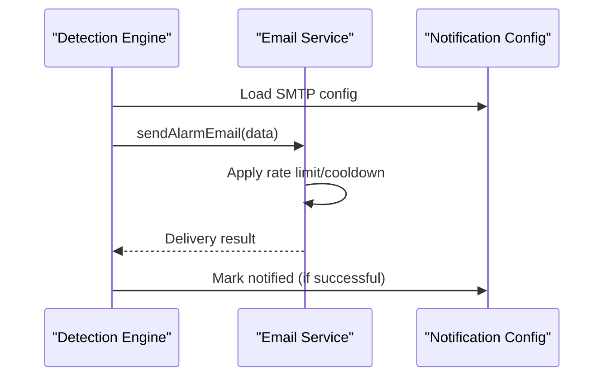
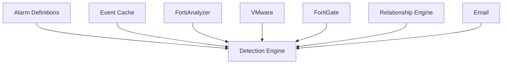

# Impact Analysis

<cite>
**Referenced Files in This Document**
- [alarm-definitions.ts](file://lib/alarms/alarm-definitions.ts)
- [detection-engine.ts](file://lib/alarms/detection-engine.ts)
- [relationship-engine.ts](file://lib/topology/relationship-engine.ts)
- [email.ts](file://lib/notifications/email.ts)
- [page.tsx](file://app/dashboard/risks/page.tsx)
- [page.tsx](file://app/analytics/sprawl/page.tsx)
- [page.tsx](file://app/settings/alerts/page.tsx)
- [vmware.ts](file://lib/integrations/vmware.ts)
- [fa-circuit-breaker.ts](file://lib/integrations/fa-circuit-breaker.ts)
- [index.ts](file://lib/reports/index.ts)
</cite>

## Table of Contents
1. [Introduction](#introduction)
2. [Project Structure](#project-structure)
3. [Core Components](#core-components)
4. [Architecture Overview](#architecture-overview)
5. [Detailed Component Analysis](#detailed-component-analysis)
6. [Dependency Analysis](#dependency-analysis)
7. [Performance Considerations](#performance-considerations)
8. [Troubleshooting Guide](#troubleshooting-guide)
9. [Conclusion](#conclusion)
10. [Appendices](#appendices)

## Introduction
This document describes the impact analysis system in Infrascope, focusing on failure propagation modeling, risk assessment, and business impact evaluation. It explains how alarms are defined and evaluated, how dependency chains are modeled, and how cascading failure predictions are supported. It also documents risk scoring methodologies, impact severity classification, threshold-based alerting, visualization tools, scenario simulation capabilities, and reporting features. Practical workflows for impact analysis, failure simulation, and mitigation planning are included, along with guidance for real-time monitoring, automated detection, and trend analysis.

## Project Structure
The impact analysis system spans frontend dashboards, backend alarm engines, topology correlation, integrations, and notifications:
- Alarm definitions and detection logic are centralized in the alarm library.
- Topology relationships model dependencies among infrastructure components.
- Integrations (FortiAnalyzer, VMware, FortiGate) feed telemetry and configuration data.
- Notifications deliver actionable alerts.
- Dashboards visualize risk, sprawl, and alert configurations.

**Diagram sources**
- [page.tsx:1-239](file://app/dashboard/risks/page.tsx#L1-L239)
- [page.tsx:1-288](file://app/analytics/sprawl/page.tsx#L1-L288)
- [page.tsx:1-446](file://app/settings/alerts/page.tsx#L1-L446)
- [detection-engine.ts:1-800](file://lib/alarms/detection-engine.ts#L1-L800)
- [alarm-definitions.ts:1-800](file://lib/alarms/alarm-definitions.ts#L1-L800)
- [relationship-engine.ts:1-516](file://lib/topology/relationship-engine.ts#L1-L516)
- [vmware.ts:2200-2400](file://lib/integrations/vmware.ts#L2200-L2400)
- [fa-circuit-breaker.ts:45-89](file://lib/integrations/fa-circuit-breaker.ts#L45-L89)
- [email.ts:1-565](file://lib/notifications/email.ts#L1-L565)
- [index.ts:1-8](file://lib/reports/index.ts#L1-L8)

**Section sources**
- [page.tsx:1-239](file://app/dashboard/risks/page.tsx#L1-L239)
- [page.tsx:1-288](file://app/analytics/sprawl/page.tsx#L1-L288)
- [page.tsx:1-446](file://app/settings/alerts/page.tsx#L1-L446)
- [detection-engine.ts:1-800](file://lib/alarms/detection-engine.ts#L1-L800)
- [alarm-definitions.ts:1-800](file://lib/alarms/alarm-definitions.ts#L1-L800)
- [relationship-engine.ts:1-516](file://lib/topology/relationship-engine.ts#L1-L516)
- [vmware.ts:2200-2400](file://lib/integrations/vmware.ts#L2200-L2400)
- [fa-circuit-breaker.ts:45-89](file://lib/integrations/fa-circuit-breaker.ts#L45-L89)
- [email.ts:1-565](file://lib/notifications/email.ts#L1-L565)
- [index.ts:1-8](file://lib/reports/index.ts#L1-L8)

## Core Components
- Alarm definitions define detection logic, thresholds, time windows, categories, severities, and recommended actions. These are used by the detection engine to evaluate telemetry streams.
- The detection engine orchestrates evaluation of alarms, manages caches, applies suppression rules, and coordinates integrations (FortiAnalyzer, VMware, FortiGate).
- Relationship engine correlates topology and dependency relationships (e.g., VM-to-host, VLAN membership, interface connections) to support impact propagation modeling.
- Notifications deliver timely, structured alerts via email with severity and category labeling.
- Dashboards visualize risk scores, trends, and sprawl metrics to support business impact evaluation.
- Reports index exposes report service types for inventory, capacity, VMware, integration, and alert reporting.

**Section sources**
- [alarm-definitions.ts:1-800](file://lib/alarms/alarm-definitions.ts#L1-L800)
- [detection-engine.ts:1-800](file://lib/alarms/detection-engine.ts#L1-L800)
- [relationship-engine.ts:1-516](file://lib/topology/relationship-engine.ts#L1-L516)
- [email.ts:1-565](file://lib/notifications/email.ts#L1-L565)
- [page.tsx:1-239](file://app/dashboard/risks/page.tsx#L1-L239)
- [page.tsx:1-288](file://app/analytics/sprawl/page.tsx#L1-L288)
- [index.ts:1-8](file://lib/reports/index.ts#L1-L8)

## Architecture Overview
The system evaluates alarms against telemetry and configuration data, correlates dependencies, and emits notifications. The detection engine optimizes performance by batching queries and leveraging an event cache. Topology relationships inform impact propagation, while dashboards and reports provide visibility and trend analysis.

**Diagram sources**
- [detection-engine.ts:276-521](file://lib/alarms/detection-engine.ts#L276-L521)
- [relationship-engine.ts:390-474](file://lib/topology/relationship-engine.ts#L390-L474)
- [email.ts:405-481](file://lib/notifications/email.ts#L405-L481)

**Section sources**
- [detection-engine.ts:276-521](file://lib/alarms/detection-engine.ts#L276-L521)
- [relationship-engine.ts:390-474](file://lib/topology/relationship-engine.ts#L390-L474)
- [email.ts:405-481](file://lib/notifications/email.ts#L405-L481)

## Detailed Component Analysis

### Alarm Definitions and Threshold-Based Alerting
- Each alarm definition specifies:
  - Detection logic: logtype, filter, threshold, timeWindowMinutes, optional client-side checks (e.g., off-hours, brute-force grouping, anomaly detection).
  - Correlation rules for SIEM-like detection across multiple event streams.
  - Category and severity for classification and notification routing.
  - Recommended actions for remediation.
- Threshold-based alerting ensures that only significant deviations trigger alarms, reducing noise.

**Diagram sources**
- [alarm-definitions.ts:7-39](file://lib/alarms/alarm-definitions.ts#L7-L39)

**Section sources**
- [alarm-definitions.ts:1-800](file://lib/alarms/alarm-definitions.ts#L1-L800)

### Detection Engine: Failure Propagation Modeling and Cascading Prediction
- The detection engine:
  - Initializes integrations (VMware, FortiGate) and an event cache.
  - Groups alarms by logtype to batch queries and reduce API load.
  - Applies suppression rules and evaluates correlation alarms after regular alarms to capture multi-vector attacks.
  - Manages cache freshness guarantees and concurrency limits to prevent overwhelming external systems.
  - Emits notifications and retries failed ones.
- Correlation alarms enable cascading failure prediction by correlating precursor events with secondary log searches.

**Diagram sources**
- [detection-engine.ts:276-521](file://lib/alarms/detection-engine.ts#L276-L521)
- [detection-engine.ts:588-772](file://lib/alarms/detection-engine.ts#L588-L772)

**Section sources**
- [detection-engine.ts:276-521](file://lib/alarms/detection-engine.ts#L276-L521)
- [detection-engine.ts:588-772](file://lib/alarms/detection-engine.ts#L588-L772)

### Dependency Chain Analysis and Topology Relationships
- The relationship engine:
  - Correlates VM-to-host, cluster-to-host, VLAN memberships, and interface connections.
  - Builds a topology graph with nodes and edges, labeling relationships and confidence.
  - Provides statistics on relationship types and removes stale relationships.
- This supports impact propagation modeling by identifying how failures in one component can affect others (e.g., a down interface impacts connected devices, or a failing host affects VMs running on it).

**Diagram sources**
- [relationship-engine.ts:39-83](file://lib/topology/relationship-engine.ts#L39-L83)
- [relationship-engine.ts:390-474](file://lib/topology/relationship-engine.ts#L390-L474)

**Section sources**
- [relationship-engine.ts:1-516](file://lib/topology/relationship-engine.ts#L1-L516)

### Risk Scoring Methodologies and Business Impact Evaluation
- Risk dashboards compute average risk scores and categorize assets by risk level, enabling business impact evaluation.
- Sprawl analytics computes a sprawl score for VMs based on criteria such as powered-off state, snapshot age, and snapshot count, supporting capacity and governance risk assessments.
- Severity and category labels are mapped for consistent alerting and reporting.

**Diagram sources**
- [page.tsx:101-103](file://app/dashboard/risks/page.tsx#L101-L103)
- [page.tsx:117-119](file://app/analytics/sprawl/page.tsx#L117-L119)
- [vmware.ts:2236-2335](file://lib/integrations/vmware.ts#L2236-L2335)

**Section sources**
- [page.tsx:1-239](file://app/dashboard/risks/page.tsx#L1-L239)
- [page.tsx:1-288](file://app/analytics/sprawl/page.tsx#L1-L288)
- [vmware.ts:2236-2335](file://lib/integrations/vmware.ts#L2236-L2335)

### Impact Visualization Tools and Scenario Simulation
- Risk dashboard displays average risk scores, counts of critical risks, and trends.
- Sprawl analytics provides summary cards, filtering, and CSV export for scenario simulation and impact reporting.
- Alert settings dashboard enables tuning alarm definitions and notification channels.

**Diagram sources**
- [page.tsx:117-178](file://app/dashboard/risks/page.tsx#L117-L178)
- [page.tsx:93-114](file://app/analytics/sprawl/page.tsx#L93-L114)
- [page.tsx:81-108](file://app/settings/alerts/page.tsx#L81-L108)

**Section sources**
- [page.tsx:1-239](file://app/dashboard/risks/page.tsx#L1-L239)
- [page.tsx:1-288](file://app/analytics/sprawl/page.tsx#L1-L288)
- [page.tsx:1-446](file://app/settings/alerts/page.tsx#L1-L446)

### Notification Delivery and Automated Impact Detection
- Email notifications include severity and category labels, parsed message sections, and recommended actions.
- Rate limiting and per-alarm cooldown prevent duplicate notifications and manage throughput.
- The detection engine retries failed notifications to ensure reliable delivery.

**Diagram sources**
- [email.ts:86-98](file://lib/notifications/email.ts#L86-L98)
- [email.ts:405-481](file://lib/notifications/email.ts#L405-L481)
- [detection-engine.ts:530-583](file://lib/alarms/detection-engine.ts#L530-L583)

**Section sources**
- [email.ts:1-565](file://lib/notifications/email.ts#L1-L565)
- [detection-engine.ts:530-583](file://lib/alarms/detection-engine.ts#L530-L583)

### Reporting Features and Business Continuity Impact Assessment
- Reports index exposes report service types for inventory, capacity, VMware, integration, and alert reporting.
- These reports support business continuity impact assessment by aggregating telemetry and configuration data across environments.

**Section sources**
- [index.ts:1-8](file://lib/reports/index.ts#L1-L8)

## Dependency Analysis
The detection engine depends on alarm definitions, event caching, integrations, and notifications. Topology relationships support impact propagation modeling. The following diagram highlights key dependencies:

**Diagram sources**
- [detection-engine.ts:1-100](file://lib/alarms/detection-engine.ts#L1-L100)
- [relationship-engine.ts:1-50](file://lib/topology/relationship-engine.ts#L1-L50)

**Section sources**
- [detection-engine.ts:1-100](file://lib/alarms/detection-engine.ts#L1-L100)
- [relationship-engine.ts:1-50](file://lib/topology/relationship-engine.ts#L1-L50)

## Performance Considerations
- Event cache optimization: The detection engine initializes a shared event cache and uses it to avoid live API calls when fresh, dramatically reducing load on external systems.
- Concurrency control: When the cache is stale, the engine limits live API concurrency to prevent overwhelming external systems (e.g., FortiAnalyzer).
- Batched queries: Alarms are grouped by logtype and evaluated with batched searches to minimize API calls.
- Circuit breaker: FortiAnalyzer requests are gated by a circuit breaker to handle outages gracefully.
- Suppression engine: Reduces noise by suppressing known benign events.

**Section sources**
- [detection-engine.ts:228-270](file://lib/alarms/detection-engine.ts#L228-L270)
- [detection-engine.ts:415-457](file://lib/alarms/detection-engine.ts#L415-L457)
- [fa-circuit-breaker.ts:45-89](file://lib/integrations/fa-circuit-breaker.ts#L45-L89)

## Troubleshooting Guide
- Email delivery issues:
  - Check SMTP configuration and test email functionality.
  - Review hourly rate limits and per-alarm cooldowns.
  - Inspect DLQ retries for failed notifications.
- Detection engine issues:
  - Verify event cache freshness and background sync status.
  - Confirm integrations (VMware, FortiGate) are properly initialized.
  - Review correlation alarm evaluation logs for missing or stale data.
- Topology relationship issues:
  - Validate correlation results and stale relationship removal.
  - Ensure device metadata includes neighbor information for accurate edge labeling.

**Section sources**
- [email.ts:86-98](file://lib/notifications/email.ts#L86-L98)
- [email.ts:405-481](file://lib/notifications/email.ts#L405-L481)
- [detection-engine.ts:317-344](file://lib/alarms/detection-engine.ts#L317-L344)
- [relationship-engine.ts:370-388](file://lib/topology/relationship-engine.ts#L370-L388)

## Conclusion
Infrascope’s impact analysis system combines robust alarm definitions, a high-performance detection engine, topology correlation, and comprehensive notifications to model failure propagation, assess risk, and evaluate business impact. The system’s design emphasizes reliability, scalability, and operability through caching, concurrency control, and circuit breaking. Dashboards and reports provide actionable insights for real-time monitoring, automated detection, and trend analysis, enabling effective mitigation planning and business continuity assurance.

## Appendices
- Practical workflows:
  - Configure alarm definitions and notification channels in the alert settings dashboard.
  - Monitor risk scores and trends in the risk dashboard.
  - Analyze sprawl and export reports for capacity and governance decisions.
  - Simulate scenarios by adjusting thresholds and filters in alarm definitions and observing downstream impacts via topology relationships and notifications.