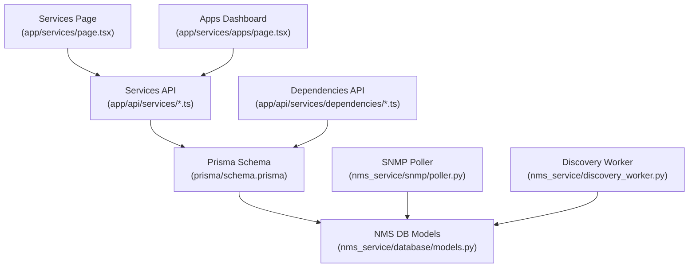
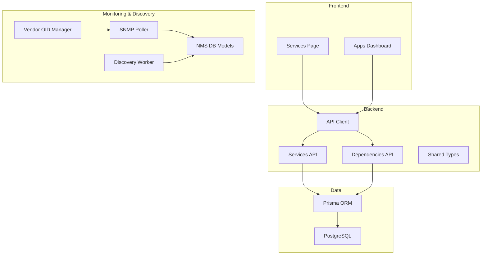
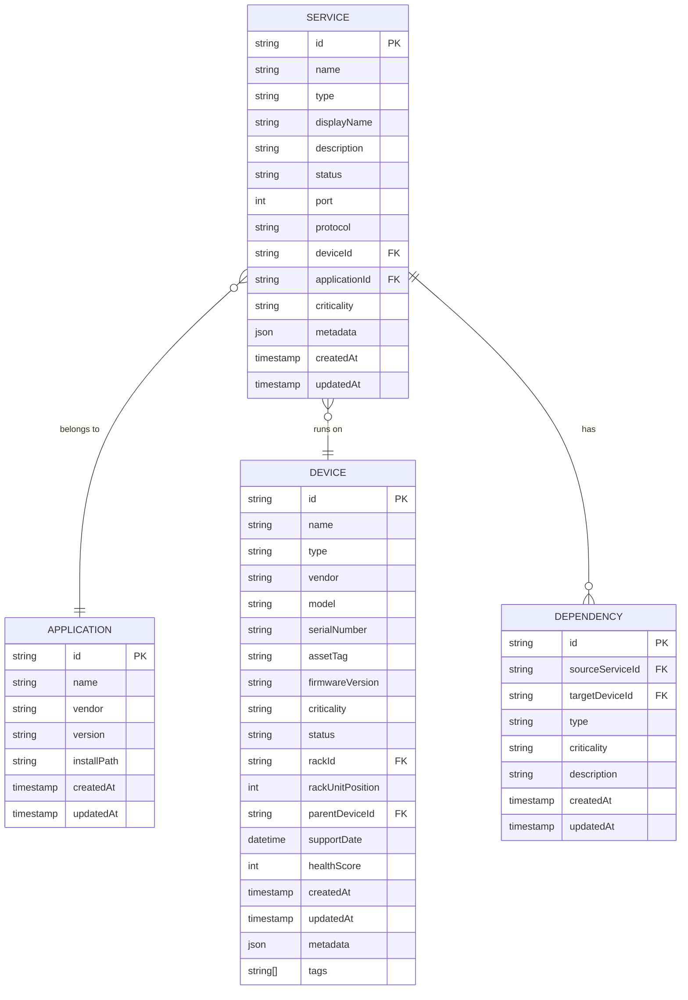
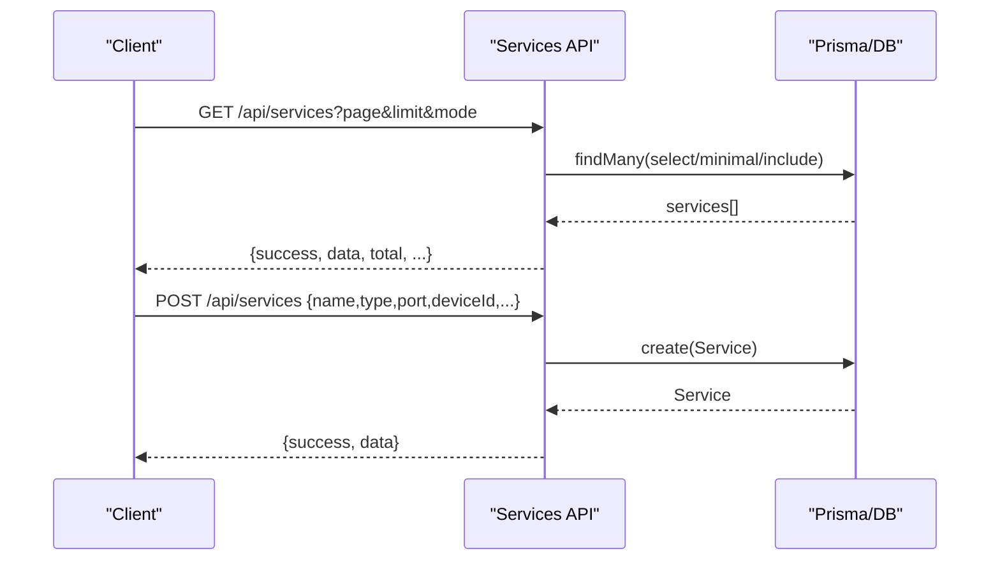
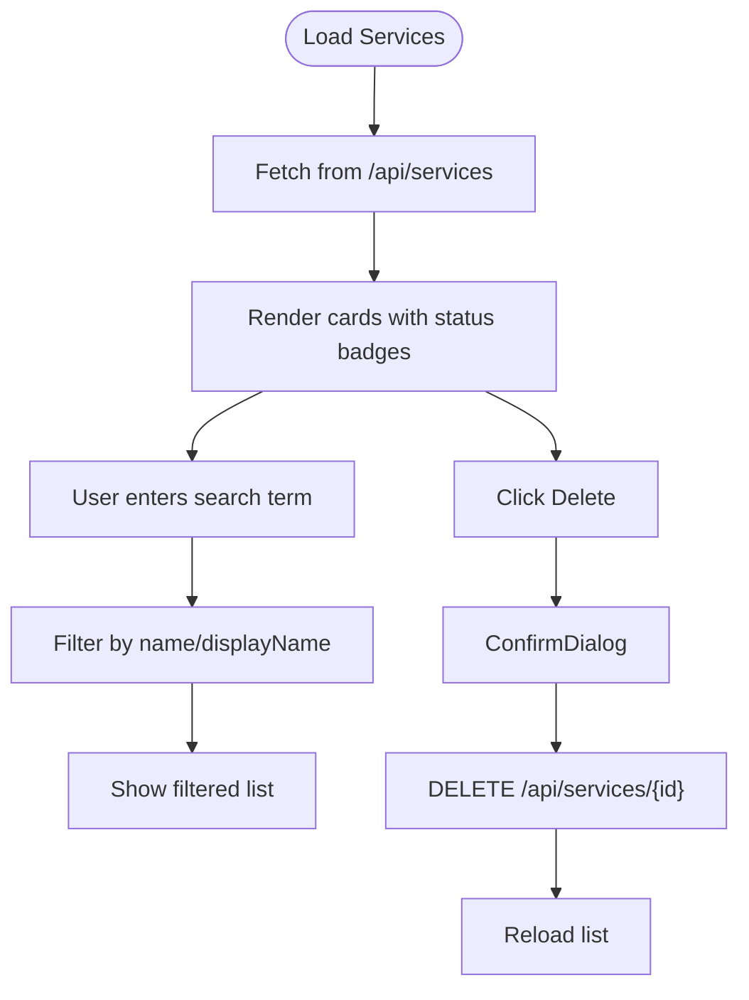
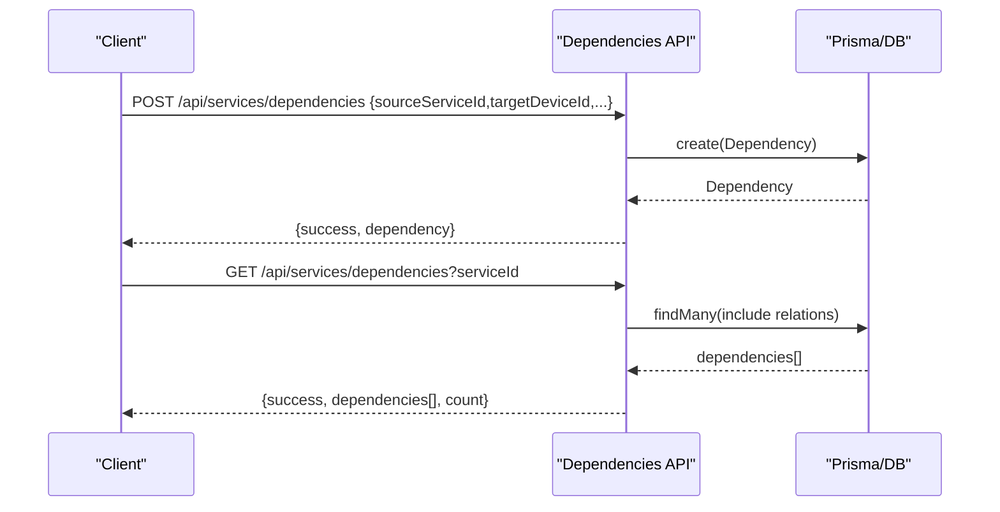
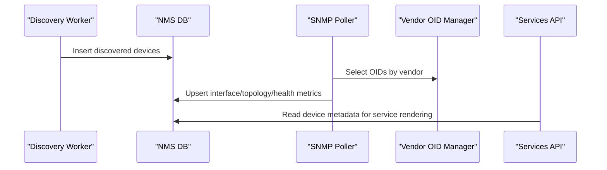
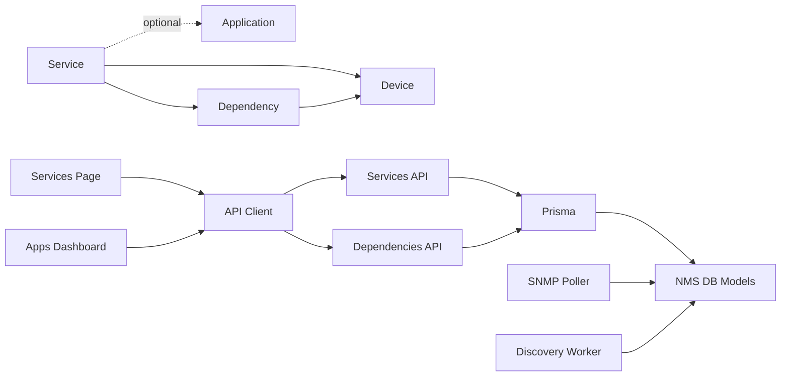

# Service Inventory

<cite>
**Referenced Files in This Document**
- [app/api/services/route.ts](file://app/api/services/route.ts)
- [app/api/services/[id]/route.ts](file://app/api/services/[id]/route.ts)
- [app/api/services/dependencies/route.ts](file://app/api/services/dependencies/route.ts)
- [app/services/page.tsx](file://app/services/page.tsx)
- [app/services/apps/page.tsx](file://app/services/apps/page.tsx)
- [lib/api.ts](file://lib/api.ts)
- [types/index.ts](file://types/index.ts)
- [prisma/schema.prisma](file://prisma/schema.prisma)
- [nms_service/snmp/poller.py](file://nms_service/snmp/poller.py)
- [nms_service/snmp/vendor_oids.py](file://nms_service/snmp/vendor_oids.py)
- [nms_service/discovery_worker.py](file://nms_service/discovery_worker.py)
- [nms_service/database/models.py](file://nms_service/database/models.py)
- [lib/formatting.ts](file://lib/formatting.ts)
</cite>

## Table of Contents
1. [Introduction](#introduction)
2. [Project Structure](#project-structure)
3. [Core Components](#core-components)
4. [Architecture Overview](#architecture-overview)
5. [Detailed Component Analysis](#detailed-component-analysis)
6. [Dependency Analysis](#dependency-analysis)
7. [Performance Considerations](#performance-considerations)
8. [Troubleshooting Guide](#troubleshooting-guide)
9. [Conclusion](#conclusion)
10. [Appendices](#appendices)

## Introduction
This document describes the Service Inventory system in Infrascope, focusing on application and service registration, management, lifecycle operations, and integration with monitoring and discovery subsystems. It covers the service data model (types, ports/protocols, criticality, status), the listing interface with search and pagination, onboarding workflows, vendor integration, automatic detection, metadata management, and practical examples for registration, status monitoring, and administrative operations. It also outlines performance characteristics and integration touchpoints with SNMP-based monitoring and network discovery.

## Project Structure
The Service Inventory spans:
- Backend API routes for listing, creating, updating, and deleting services
- Frontend pages for service listing and application dashboards
- Prisma schema defining the service data model and enumerations
- NMS integration modules for SNMP polling, vendor OID mapping, and discovery scanning
- Shared TypeScript types and API client utilities

**Diagram sources**
- [app/services/page.tsx:1-231](file://app/services/page.tsx#L1-L231)
- [app/services/apps/page.tsx:1-244](file://app/services/apps/page.tsx#L1-L244)
- [app/api/services/route.ts:1-122](file://app/api/services/route.ts#L1-L122)
- [app/api/services/dependencies/route.ts:1-228](file://app/api/services/dependencies/route.ts#L1-L228)
- [prisma/schema.prisma:344-387](file://prisma/schema.prisma#L344-L387)
- [nms_service/snmp/poller.py:1-592](file://nms_service/snmp/poller.py#L1-L592)
- [nms_service/discovery_worker.py:1-262](file://nms_service/discovery_worker.py#L1-L262)
- [nms_service/database/models.py:1-227](file://nms_service/database/models.py#L1-L227)

**Section sources**
- [app/services/page.tsx:1-231](file://app/services/page.tsx#L1-L231)
- [app/services/apps/page.tsx:1-244](file://app/services/apps/page.tsx#L1-L244)
- [app/api/services/route.ts:1-122](file://app/api/services/route.ts#L1-L122)
- [app/api/services/dependencies/route.ts:1-228](file://app/api/services/dependencies/route.ts#L1-L228)
- [prisma/schema.prisma:344-387](file://prisma/schema.prisma#L344-L387)
- [nms_service/snmp/poller.py:1-592](file://nms_service/snmp/poller.py#L1-L592)
- [nms_service/discovery_worker.py:1-262](file://nms_service/discovery_worker.py#L1-L262)
- [nms_service/database/models.py:1-227](file://nms_service/database/models.py#L1-L227)

## Core Components
- Service API: Provides listing (with pagination and minimal/full modes), creation, updates, and deletion of services.
- Service Listing UI: Presents services with search, status badges, and delete actions.
- Dependencies API: Manages service-to-device dependency relationships.
- Prisma Data Model: Defines Service, Application, Device, and Dependency entities and enumerations.
- NMS Integration: SNMP polling for health metrics and topology, discovery worker for network scanning, and vendor OID mapping.
- Shared Types and API Client: Define TypeScript interfaces and a reusable API client.

**Section sources**
- [app/api/services/route.ts:1-122](file://app/api/services/route.ts#L1-L122)
- [app/api/services/[id]/route.ts:11-L452](file://app/api/services/[id]/route.ts#L11-L452)
- [app/api/services/dependencies/route.ts:1-228](file://app/api/services/dependencies/route.ts#L1-L228)
- [prisma/schema.prisma:344-387](file://prisma/schema.prisma#L344-L387)
- [types/index.ts:254-311](file://types/index.ts#L254-L311)
- [lib/api.ts:1-57](file://lib/api.ts#L1-L57)

## Architecture Overview
The Service Inventory architecture connects frontend pages to backend APIs, which persist data via Prisma to PostgreSQL. Monitoring and discovery integrate through NMS modules that write to dedicated NMS tables while aligning with the Prisma-managed schema.

**Diagram sources**
- [app/services/page.tsx:1-231](file://app/services/page.tsx#L1-L231)
- [app/services/apps/page.tsx:1-244](file://app/services/apps/page.tsx#L1-L244)
- [app/api/services/route.ts:1-122](file://app/api/services/route.ts#L1-L122)
- [app/api/services/dependencies/route.ts:1-228](file://app/api/services/dependencies/route.ts#L1-L228)
- [lib/api.ts:1-57](file://lib/api.ts#L1-L57)
- [prisma/schema.prisma:344-387](file://prisma/schema.prisma#L344-L387)
- [nms_service/snmp/poller.py:1-592](file://nms_service/snmp/poller.py#L1-L592)
- [nms_service/discovery_worker.py:1-262](file://nms_service/discovery_worker.py#L1-L262)
- [nms_service/database/models.py:1-227](file://nms_service/database/models.py#L1-L227)

## Detailed Component Analysis

### Service Data Model
The Service entity captures application/service metadata and relationships:
- Identity: id, name, displayName, description
- Operational: type (enumeration), status (enumeration), port, protocol (enumeration)
- Ownership: deviceId (Device), applicationId (Application)
- Risk: criticality (DeviceCriticality)
- Metadata: metadata (JSON)
- Relationships: application (Application), device (Device), dependencies (Dependency[])
- Constraints: unique(deviceId, port, protocol)

Enumerations define allowed values for type, status, protocol, and criticality.

**Diagram sources**
- [prisma/schema.prisma:344-387](file://prisma/schema.prisma#L344-L387)
- [types/index.ts:254-311](file://types/index.ts#L254-L311)

**Section sources**
- [prisma/schema.prisma:344-387](file://prisma/schema.prisma#L344-L387)
- [types/index.ts:254-311](file://types/index.ts#L254-L311)

### Service API: Listing, Creation, Updates, Deletion
- GET /api/services
  - Pagination: page, limit (max 500), mode (full|minimal)
  - Minimal mode excludes heavy nested relations for performance-sensitive dashboards
  - Full mode includes device hierarchy, application, and dependencies
- POST /api/services
  - Required: name, type, port, deviceId
  - Optional: displayName, description, status, protocol, applicationId, criticality
  - Defaults applied for status, protocol, criticality
- GET /api/services/[id]
  - Retrieves a single service with full relations
- PUT /api/services/[id]
  - Validates inputs against allowed enumerations
  - Enforces uniqueness of (port, protocol) per device
  - Supports partial updates and metadata
- DELETE /api/services/[id]
  - Prevents deletion if dependencies exist

**Diagram sources**
- [app/api/services/route.ts:4-75](file://app/api/services/route.ts#L4-L75)
- [app/api/services/route.ts:77-121](file://app/api/services/route.ts#L77-L121)

**Section sources**
- [app/api/services/route.ts:4-75](file://app/api/services/route.ts#L4-L75)
- [app/api/services/route.ts:77-121](file://app/api/services/route.ts#L77-L121)
- [app/api/services/[id]/route.ts:31-L139](file://app/api/services/[id]/route.ts#L31-L139)
- [app/api/services/[id]/route.ts:144-L372](file://app/api/services/[id]/route.ts#L144-L372)
- [app/api/services/[id]/route.ts:377-L451](file://app/api/services/[id]/route.ts#L377-L451)

### Service Listing Interface
- Search: Filters by name or displayName
- Status badges: Color-coded by status (RUNNING, STOPPED, DEGRADED)
- Bulk operations: Delete via confirmation dialog
- Pagination: Handled server-side via API

**Diagram sources**
- [app/services/page.tsx:16-231](file://app/services/page.tsx#L16-L231)
- [lib/api.ts:1-57](file://lib/api.ts#L1-L57)

**Section sources**
- [app/services/page.tsx:16-231](file://app/services/page.tsx#L16-L231)
- [lib/api.ts:1-57](file://lib/api.ts#L1-L57)

### Dependencies Management
- GET /api/services/dependencies?serviceId
  - Lists dependencies for a service or all dependencies
- POST /api/services/dependencies
  - Creates a dependency between a service and a device
- PUT /api/services/dependencies
  - Updates dependency type/criticality/description
- DELETE /api/services/dependencies?id
  - Removes a dependency

**Diagram sources**
- [app/api/services/dependencies/route.ts:4-81](file://app/api/services/dependencies/route.ts#L4-L81)
- [app/api/services/dependencies/route.ts:83-148](file://app/api/services/dependencies/route.ts#L83-L148)
- [app/api/services/dependencies/route.ts:150-198](file://app/api/services/dependencies/route.ts#L150-L198)
- [app/api/services/dependencies/route.ts:200-227](file://app/api/services/dependencies/route.ts#L200-L227)

**Section sources**
- [app/api/services/dependencies/route.ts:4-81](file://app/api/services/dependencies/route.ts#L4-L81)
- [app/api/services/dependencies/route.ts:83-148](file://app/api/services/dependencies/route.ts#L83-L148)
- [app/api/services/dependencies/route.ts:150-198](file://app/api/services/dependencies/route.ts#L150-L198)
- [app/api/services/dependencies/route.ts:200-227](file://app/api/services/dependencies/route.ts#L200-L227)

### Onboarding Workflows and Automatic Detection
- Vendor integration and automatic detection:
  - SNMP polling extracts vendor, model, serial, firmware, CPU/memory/temp, interface states, and topology
  - Vendor OID mapping selects appropriate OIDs per vendor (Cisco, Fortinet, MikroTik, generic)
  - Discovery worker scans CIDR ranges, probes SNMP/SSH, and persists results to NMS tables
- Integration with Service Inventory:
  - Services reference Device and Application; NMS modules populate device metadata and health snapshots
  - Vendor logos are resolved in the UI for application entries

**Diagram sources**
- [nms_service/discovery_worker.py:128-244](file://nms_service/discovery_worker.py#L128-L244)
- [nms_service/snmp/poller.py:63-592](file://nms_service/snmp/poller.py#L63-L592)
- [nms_service/snmp/vendor_oids.py:344-373](file://nms_service/snmp/vendor_oids.py#L344-L373)
- [nms_service/database/models.py:68-194](file://nms_service/database/models.py#L68-L194)

**Section sources**
- [nms_service/discovery_worker.py:128-244](file://nms_service/discovery_worker.py#L128-L244)
- [nms_service/snmp/poller.py:63-592](file://nms_service/snmp/poller.py#L63-L592)
- [nms_service/snmp/vendor_oids.py:344-373](file://nms_service/snmp/vendor_oids.py#L344-L373)
- [nms_service/database/models.py:68-194](file://nms_service/database/models.py#L68-L194)
- [lib/formatting.ts:61-89](file://lib/formatting.ts#L61-L89)

### Practical Examples
- Register a service
  - Endpoint: POST /api/services
  - Required fields: name, type, port, deviceId
  - Example payload fields: name, type, displayName, description, status, port, protocol, deviceId, applicationId, criticality
- Update a service
  - Endpoint: PUT /api/services/[id]
  - Validates type/status/criticality against allowed lists; enforces unique (port, protocol) per device
- Delete a service
  - Endpoint: DELETE /api/services/[id]
  - Fails if dependencies exist
- View service details
  - Endpoint: GET /api/services/[id]
  - Returns service with device/application/dependencies
- Manage dependencies
  - Create: POST /api/services/dependencies
  - Update: PUT /api/services/dependencies
  - Delete: DELETE /api/services/dependencies?id

**Section sources**
- [app/api/services/route.ts:77-121](file://app/api/services/route.ts#L77-L121)
- [app/api/services/[id]/route.ts:144-L372](file://app/api/services/[id]/route.ts#L144-L372)
- [app/api/services/[id]/route.ts:377-L451](file://app/api/services/[id]/route.ts#L377-L451)
- [app/api/services/dependencies/route.ts:83-148](file://app/api/services/dependencies/route.ts#L83-L148)
- [app/api/services/dependencies/route.ts:150-198](file://app/api/services/dependencies/route.ts#L150-L198)
- [app/api/services/dependencies/route.ts:200-227](file://app/api/services/dependencies/route.ts#L200-L227)

## Dependency Analysis
- Service depends on Device (deviceId) and optionally Application (applicationId)
- Dependencies connect Service to Device targets
- UI components depend on shared types and API client
- NMS modules depend on NMS DB models and vendor OID mappings

**Diagram sources**
- [prisma/schema.prisma:344-387](file://prisma/schema.prisma#L344-L387)
- [app/services/page.tsx:1-231](file://app/services/page.tsx#L1-L231)
- [app/services/apps/page.tsx:1-244](file://app/services/apps/page.tsx#L1-L244)
- [lib/api.ts:1-57](file://lib/api.ts#L1-L57)
- [nms_service/database/models.py:1-227](file://nms_service/database/models.py#L1-L227)

**Section sources**
- [prisma/schema.prisma:344-387](file://prisma/schema.prisma#L344-L387)
- [app/services/page.tsx:1-231](file://app/services/page.tsx#L1-L231)
- [app/services/apps/page.tsx:1-244](file://app/services/apps/page.tsx#L1-L244)
- [lib/api.ts:1-57](file://lib/api.ts#L1-L57)
- [nms_service/database/models.py:1-227](file://nms_service/database/models.py#L1-L227)

## Performance Considerations
- Pagination and limits: The listing endpoint caps limit at 500 and supports a minimal mode to reduce payload sizes for dashboards.
- Parallel queries: Listing uses Promise.all for count and data retrieval.
- Unique constraints: Database-level uniqueness of (deviceId, port, protocol) prevents duplicates.
- NMS polling: SNMP polling is designed to scale; current implementation is synchronous for modest device counts, with notes for async/refactoring.

[No sources needed since this section provides general guidance]

## Troubleshooting Guide
- Service creation fails with missing required fields
  - Ensure name, type, port, and deviceId are provided
- Duplicate service on device
  - Updating port/protocol triggers a uniqueness check; adjust to a unique combination
- Service not found
  - Verify ID correctness and existence
- Dependency conflicts
  - Creating/updating dependencies validates presence and uniqueness; remove or adjust existing dependencies as needed
- API errors
  - The API client wraps responses and surfaces error messages from the backend

**Section sources**
- [app/api/services/route.ts:85-91](file://app/api/services/route.ts#L85-L91)
- [app/api/services/[id]/route.ts:286-L307](file://app/api/services/[id]/route.ts#L286-L307)
- [app/api/services/[id]/route.ts:109-L118](file://app/api/services/[id]/route.ts#L109-L118)
- [app/api/services/dependencies/route.ts:95-109](file://app/api/services/dependencies/route.ts#L95-L109)
- [lib/api.ts:10-56](file://lib/api.ts#L10-L56)

## Conclusion
The Service Inventory system provides a robust foundation for registering, managing, and visualizing services across devices and applications. Its data model supports rich metadata, criticality levels, and status tracking, while the API offers efficient listing, validation, and dependency management. Integration with SNMP-based monitoring and discovery enables automatic detection and enrichment of device and service information, supporting informed operational decisions.

[No sources needed since this section summarizes without analyzing specific files]

## Appendices

### API Definitions

- GET /api/services
  - Query parameters: page (integer), limit (integer, max 500), mode (string: full|minimal)
  - Response: paginated array of services with total, page, limit, totalPages

- POST /api/services
  - Body: name, type, displayName, description, status, port, protocol, deviceId, applicationId, criticality
  - Response: created service

- GET /api/services/[id]
  - Response: service with relations

- PUT /api/services/[id]
  - Body: name, type, displayName, description, status, port, protocol, applicationId, criticality, metadata
  - Response: updated service

- DELETE /api/services/[id]
  - Response: deletion confirmation

- GET /api/services/dependencies?serviceId
  - Response: dependencies array

- POST /api/services/dependencies
  - Body: sourceServiceId, targetDeviceId, type, criticality, description
  - Response: created dependency

- PUT /api/services/dependencies
  - Body: id, type, criticality, description
  - Response: updated dependency

- DELETE /api/services/dependencies?id
  - Response: deletion confirmation

**Section sources**
- [app/api/services/route.ts:4-75](file://app/api/services/route.ts#L4-L75)
- [app/api/services/route.ts:77-121](file://app/api/services/route.ts#L77-L121)
- [app/api/services/[id]/route.ts:31-L139](file://app/api/services/[id]/route.ts#L31-L139)
- [app/api/services/[id]/route.ts:144-L372](file://app/api/services/[id]/route.ts#L144-L372)
- [app/api/services/[id]/route.ts:377-L451](file://app/api/services/[id]/route.ts#L377-L451)
- [app/api/services/dependencies/route.ts:4-81](file://app/api/services/dependencies/route.ts#L4-L81)
- [app/api/services/dependencies/route.ts:83-148](file://app/api/services/dependencies/route.ts#L83-L148)
- [app/api/services/dependencies/route.ts:150-198](file://app/api/services/dependencies/route.ts#L150-L198)
- [app/api/services/dependencies/route.ts:200-227](file://app/api/services/dependencies/route.ts#L200-L227)

### Enumerations and Allowed Values
- ServiceType: WEB_SERVER, DATABASE, DNS, DHCP, LDAP, MONITORING, BACKUP, FILE_SERVER, MAIL_SERVER, PROXY, VPN, LOAD_BALANCER, STORAGE, CONTAINER_ORCHESTRATION, OTHER
- ServiceStatus: RUNNING, STOPPED, DEGRADED, FAILED, UNKNOWN
- Protocol: TCP, UDP, BOTH
- DeviceCriticality: CRITICAL, HIGH, MEDIUM, LOW, INFORMATIONAL

**Section sources**
- [prisma/schema.prisma:543-584](file://prisma/schema.prisma#L543-L584)