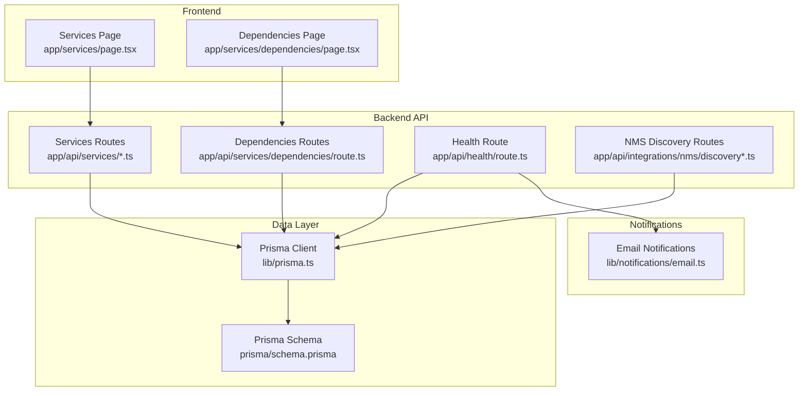
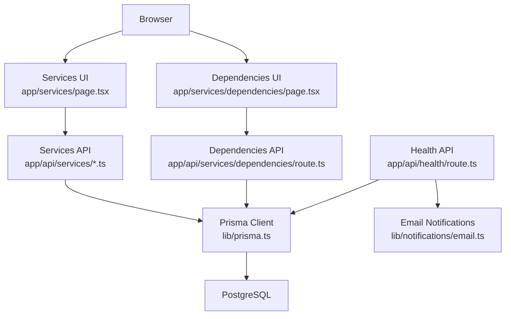
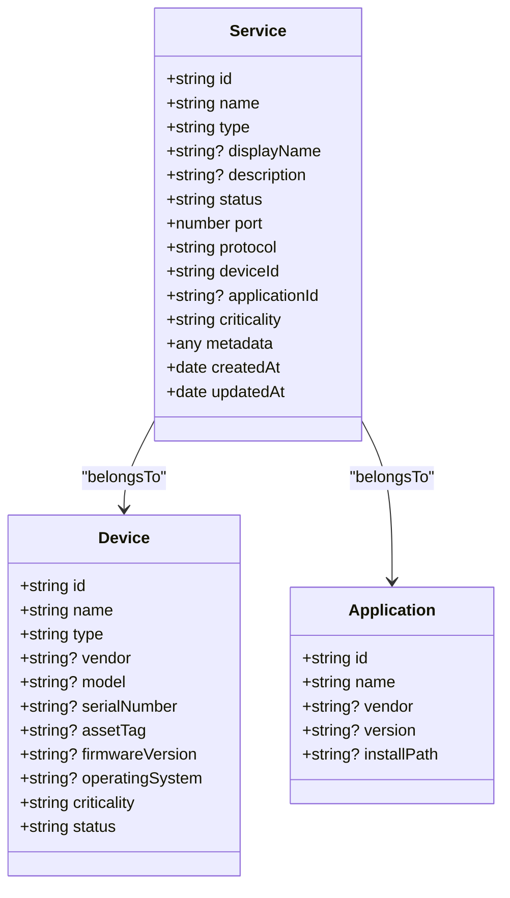
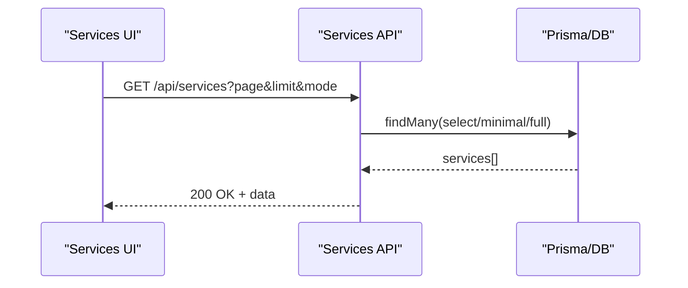
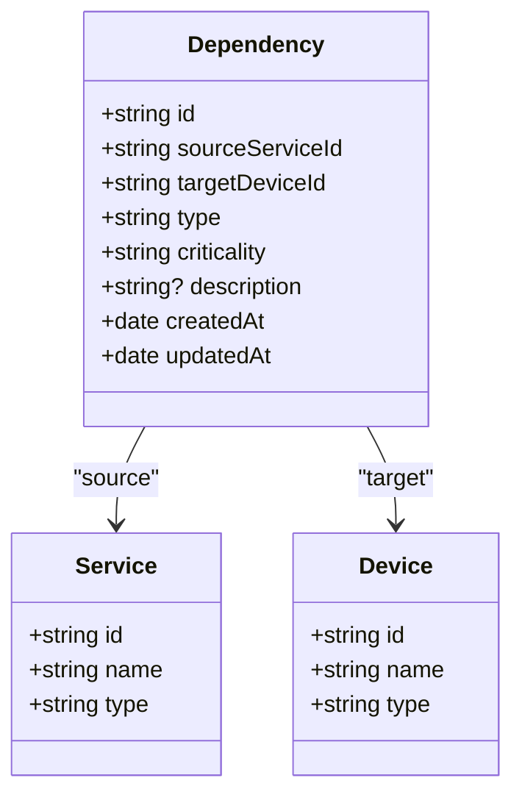
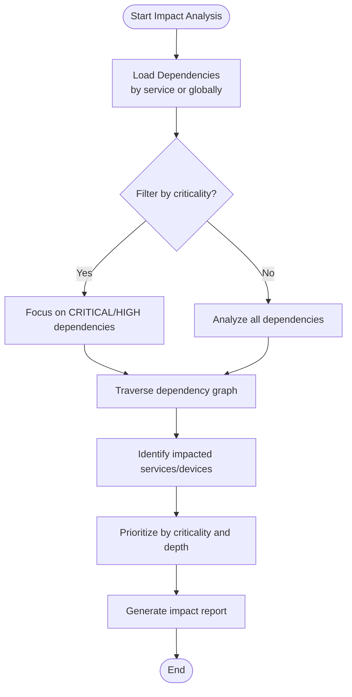
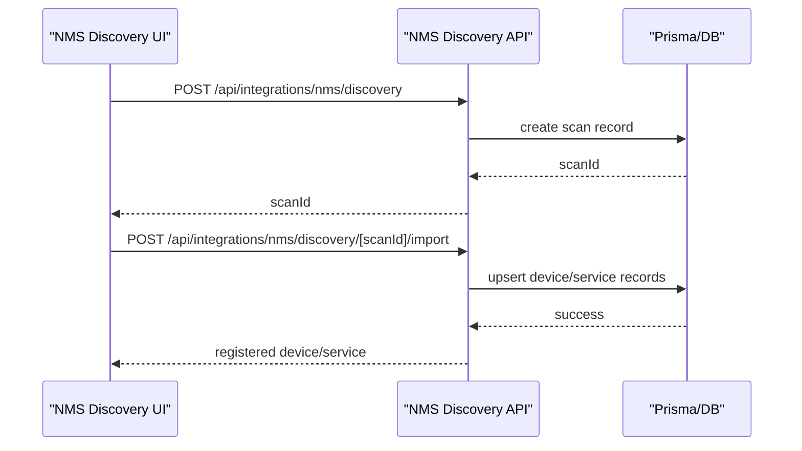
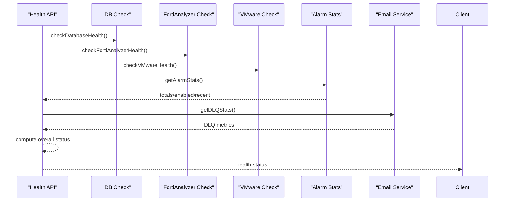

# Service Management

<cite>
**Referenced Files in This Document**
- [schema.prisma](file://prisma/schema.prisma)
- [types/index.ts](file://types/index.ts)
- [app/api/services/route.ts](file://app/api/services/route.ts)
- [app/api/services/[id]/route.ts](file://app/api/services/[id]/route.ts)
- [app/api/services/dependencies/route.ts](file://app/api/services/dependencies/route.ts)
- [app/services/page.tsx](file://app/services/page.tsx)
- [app/services/dependencies/page.tsx](file://app/services/dependencies/page.tsx)
- [lib/prisma.ts](file://lib/prisma.ts)
- [app/api/health/route.ts](file://app/api/health/route.ts)
- [lib/notifications/email.ts](file://lib/notifications/email.ts)
- [app/api/integrations/nms/discovery/route.ts](file://app/api/integrations/nms/discovery/route.ts)
- [app/api/integrations/nms/discovery/[scanId]/import/route.ts](file://app/api/integrations/nms/discovery/[scanId]/import/route.ts)
</cite>

## Table of Contents
1. [Introduction](#introduction)
2. [Project Structure](#project-structure)
3. [Core Components](#core-components)
4. [Architecture Overview](#architecture-overview)
5. [Detailed Component Analysis](#detailed-component-analysis)
6. [Dependency Analysis](#dependency-analysis)
7. [Performance Considerations](#performance-considerations)
8. [Troubleshooting Guide](#troubleshooting-guide)
9. [Conclusion](#conclusion)
10. [Appendices](#appendices)

## Introduction
This document describes the service management capabilities centered on application and service inventory, dependency relationships, and operational observability. It explains how services are modeled, how they map to devices, how ports and protocols are tracked, and how service status is monitored. It also documents dependency modeling for impact analysis, the dependency engine that analyzes service chains, and how to onboard services, map dependencies, and assess impact. Finally, it covers health monitoring, alerting integration, and performance monitoring with capacity planning.

## Project Structure
Service management spans the backend API routes, the Prisma data model, frontend pages, and integration endpoints for discovery and lifecycle management.



**Diagram sources**
- [app/services/page.tsx:1-231](file://app/services/page.tsx#L1-L231)
- [app/services/dependencies/page.tsx:1-519](file://app/services/dependencies/page.tsx#L1-L519)
- [app/api/services/route.ts:1-122](file://app/api/services/route.ts#L1-L122)
- [app/api/services/[id]/route.ts:1-452](file://app/api/services/[id]/route.ts#L1-L452)
- [app/api/services/dependencies/route.ts:1-228](file://app/api/services/dependencies/route.ts#L1-L228)
- [app/api/health/route.ts:1-254](file://app/api/health/route.ts#L1-L254)
- [app/api/integrations/nms/discovery/route.ts:1-44](file://app/api/integrations/nms/discovery/route.ts#L1-L44)
- [app/api/integrations/nms/discovery/[scanId]/import/route.ts:1-39](file://app/api/integrations/nms/discovery/[scanId]/import/route.ts#L1-L39)
- [lib/prisma.ts:1-21](file://lib/prisma.ts#L1-L21)
- [prisma/schema.prisma:344-387](file://prisma/schema.prisma#L344-L387)
- [lib/notifications/email.ts:1-565](file://lib/notifications/email.ts#L1-L565)

**Section sources**
- [app/services/page.tsx:1-231](file://app/services/page.tsx#L1-L231)
- [app/services/dependencies/page.tsx:1-519](file://app/services/dependencies/page.tsx#L1-L519)
- [app/api/services/route.ts:1-122](file://app/api/services/route.ts#L1-L122)
- [app/api/services/[id]/route.ts:1-452](file://app/api/services/[id]/route.ts#L1-L452)
- [app/api/services/dependencies/route.ts:1-228](file://app/api/services/dependencies/route.ts#L1-L228)
- [app/api/health/route.ts:1-254](file://app/api/health/route.ts#L1-L254)
- [app/api/integrations/nms/discovery/route.ts:1-44](file://app/api/integrations/nms/discovery/route.ts#L1-L44)
- [app/api/integrations/nms/discovery/[scanId]/import/route.ts:1-39](file://app/api/integrations/nms/discovery/[scanId]/import/route.ts#L1-L39)
- [lib/prisma.ts:1-21](file://lib/prisma.ts#L1-L21)
- [prisma/schema.prisma:344-387](file://prisma/schema.prisma#L344-L387)
- [lib/notifications/email.ts:1-565](file://lib/notifications/email.ts#L1-L565)

## Core Components
- Service model and API
  - Service definition includes identity, type, status, port, protocol, device linkage, application linkage, criticality, and optional metadata.
  - API supports listing services with minimal/full modes, pagination, creation, updates, and deletion with validation and uniqueness checks.
- Dependency model and API
  - Dependency defines typed relationships from a service to a device, with criticality and description.
  - API supports listing, creating, updating, and deleting dependencies with existence checks and uniqueness constraints.
- Frontend pages
  - Services page renders a searchable and filterable list of services with status and criticality indicators.
  - Dependencies page renders a paginated table of dependencies, supports CRUD operations, and allows filtering by service/device names.
- Data model and relationships
  - Prisma schema defines Service, Dependency, Device, and Application entities and their relations and indexes.
- Health monitoring and alerting
  - Health route aggregates database, integration, and alarm pipeline health and exposes a status endpoint.
  - Email notification module handles immediate delivery, rate limiting, and cooldowns for alarm notifications.

**Section sources**
- [types/index.ts:254-312](file://types/index.ts#L254-L312)
- [app/api/services/route.ts:1-122](file://app/api/services/route.ts#L1-L122)
- [app/api/services/[id]/route.ts:1-452](file://app/api/services/[id]/route.ts#L1-L452)
- [app/api/services/dependencies/route.ts:1-228](file://app/api/services/dependencies/route.ts#L1-L228)
- [app/services/page.tsx:1-231](file://app/services/page.tsx#L1-L231)
- [app/services/dependencies/page.tsx:1-519](file://app/services/dependencies/page.tsx#L1-L519)
- [prisma/schema.prisma:344-387](file://prisma/schema.prisma#L344-L387)
- [app/api/health/route.ts:1-254](file://app/api/health/route.ts#L1-L254)
- [lib/notifications/email.ts:1-565](file://lib/notifications/email.ts#L1-L565)

## Architecture Overview
The service management architecture integrates frontend UI, backend API routes, Prisma ORM, and external integrations. The data model enforces referential integrity and uniqueness constraints. Health monitoring and notifications are integrated into the service stack.



**Diagram sources**
- [app/services/page.tsx:1-231](file://app/services/page.tsx#L1-L231)
- [app/services/dependencies/page.tsx:1-519](file://app/services/dependencies/page.tsx#L1-L519)
- [app/api/services/route.ts:1-122](file://app/api/services/route.ts#L1-L122)
- [app/api/services/[id]/route.ts:1-452](file://app/api/services/[id]/route.ts#L1-L452)
- [app/api/services/dependencies/route.ts:1-228](file://app/api/services/dependencies/route.ts#L1-L228)
- [app/api/health/route.ts:1-254](file://app/api/health/route.ts#L1-L254)
- [lib/prisma.ts:1-21](file://lib/prisma.ts#L1-L21)
- [lib/notifications/email.ts:1-565](file://lib/notifications/email.ts#L1-L565)

## Detailed Component Analysis

### Service Inventory and Lifecycle
- Data model
  - Service entity includes name, type, display name, description, status, port, protocol, device linkage, application linkage, criticality, and metadata.
  - Uniqueness constraint ensures a device cannot host duplicate services on the same port/protocol combination.
- API behavior
  - Listing supports pagination and mode selection (minimal vs full) to optimize dashboard performance.
  - Creation validates required fields and defaults for status, protocol, and criticality.
  - Updates validate inputs, enforce uniqueness when changing port/protocol, and prevent deletion if dependencies exist.
- Frontend
  - Services page displays services with status badges, port/protocol, and criticality, and supports search and refresh.



**Diagram sources**
- [prisma/schema.prisma:344-368](file://prisma/schema.prisma#L344-L368)
- [types/index.ts:254-272](file://types/index.ts#L254-L272)

**Section sources**
- [prisma/schema.prisma:344-368](file://prisma/schema.prisma#L344-L368)
- [types/index.ts:254-272](file://types/index.ts#L254-L272)
- [app/api/services/route.ts:1-122](file://app/api/services/route.ts#L1-L122)
- [app/api/services/[id]/route.ts:1-452](file://app/api/services/[id]/route.ts#L1-L452)
- [app/services/page.tsx:1-231](file://app/services/page.tsx#L1-L231)

### Service-to-Device Mapping and Port/Protocol Tracking
- Mapping
  - Each Service belongs to a Device via foreign key, enabling per-device service enumeration and filtering.
- Port and protocol tracking
  - Services track port and protocol; uniqueness constraint prevents overlapping service endpoints on the same device.
- Frontend display
  - Services page shows port/protocol badges and criticality levels for quick triage.



**Diagram sources**
- [app/api/services/route.ts:1-122](file://app/api/services/route.ts#L1-L122)
- [lib/prisma.ts:1-21](file://lib/prisma.ts#L1-L21)

**Section sources**
- [prisma/schema.prisma:344-368](file://prisma/schema.prisma#L344-L368)
- [app/api/services/route.ts:1-122](file://app/api/services/route.ts#L1-L122)
- [app/services/page.tsx:1-231](file://app/services/page.tsx#L1-L231)

### Dependency Modeling and Impact Analysis
- Dependency model
  - Dependency connects a Service (source) to a Device (target) with a typed relationship and criticality.
  - Supported types include depends-on, requires, provides, supports, communicates-with, deployed-on, hosted-on, connected-to.
- API behavior
  - Listing supports filtering by service ID and includes related service/device names.
  - Creation enforces uniqueness of the (sourceServiceId, targetDeviceId, type) tuple.
  - Updates allow changing type, criticality, and description; deletion requires ID.
- Frontend
  - Dependencies page lists dependencies, supports search by service/device names, and CRUD operations.



**Diagram sources**
- [prisma/schema.prisma:370-387](file://prisma/schema.prisma#L370-L387)
- [types/index.ts:278-293](file://types/index.ts#L278-L293)

**Section sources**
- [prisma/schema.prisma:370-387](file://prisma/schema.prisma#L370-L387)
- [types/index.ts:278-293](file://types/index.ts#L278-L293)
- [app/api/services/dependencies/route.ts:1-228](file://app/api/services/dependencies/route.ts#L1-L228)
- [app/services/dependencies/page.tsx:1-519](file://app/services/dependencies/page.tsx#L1-L519)

### Dependency Engine and Impact Cascades
- Dependency engine concept
  - The dependency engine analyzes service chains and identifies potential impact cascades by traversing typed relationships from services to devices.
  - Criticality levels inform risk prioritization during impact assessments.
- Practical usage
  - Use the dependencies API to export dependency graphs for visualization and impact analysis.
  - Combine with device/service status to estimate outage propagation.



[No sources needed since this diagram shows conceptual workflow, not actual code structure]

### Service Discovery, Registration, and Lifecycle Management
- Discovery
  - NMS discovery endpoints list scans and initiate new scans for network device discovery.
- Registration
  - Discovery import endpoint registers discovered devices into InfraScope, linking to existing devices or creating new ones, and configuring SNMP polling parameters.
- Lifecycle
  - Services are created, updated, and deleted via dedicated APIs with validation and uniqueness enforcement.



**Diagram sources**
- [app/api/integrations/nms/discovery/route.ts:1-44](file://app/api/integrations/nms/discovery/route.ts#L1-L44)
- [app/api/integrations/nms/discovery/[scanId]/import/route.ts:1-39](file://app/api/integrations/nms/discovery/[scanId]/import/route.ts#L1-L39)

**Section sources**
- [app/api/integrations/nms/discovery/route.ts:1-44](file://app/api/integrations/nms/discovery/route.ts#L1-L44)
- [app/api/integrations/nms/discovery/[scanId]/import/route.ts:1-39](file://app/api/integrations/nms/discovery/[scanId]/import/route.ts#L1-L39)

### Service Health Monitoring and Alerting Integration
- Health monitoring
  - Health route aggregates database, FortiAnalyzer, and VMware connectivity, and alarm pipeline statistics to compute overall system health.
- Alerting integration
  - Email notification module sends immediate alarm emails with rate limiting and per-alarm cooldowns, and integrates with DLQ for retries.



**Diagram sources**
- [app/api/health/route.ts:1-254](file://app/api/health/route.ts#L1-L254)
- [lib/notifications/email.ts:1-565](file://lib/notifications/email.ts#L1-L565)

**Section sources**
- [app/api/health/route.ts:1-254](file://app/api/health/route.ts#L1-L254)
- [lib/notifications/email.ts:1-565](file://lib/notifications/email.ts#L1-L565)

### Practical Workflows

#### Onboarding a New Service
- Steps
  - Create a service via the services API with name, type, port, protocol, device ID, and optional application ID and criticality.
  - Validate uniqueness of port/protocol on the device.
  - Observe service appear in the services list with status and criticality.

**Section sources**
- [app/api/services/route.ts:77-121](file://app/api/services/route.ts#L77-L121)
- [prisma/schema.prisma:364-364](file://prisma/schema.prisma#L364-L364)
- [app/services/page.tsx:1-231](file://app/services/page.tsx#L1-L231)

#### Mapping a Service Dependency
- Steps
  - From the dependencies page, select a source service and target device, choose a dependency type, set criticality, and optionally add a description.
  - Submit to create the dependency; verify it appears in the list and can be edited or deleted.

**Section sources**
- [app/api/services/dependencies/route.ts:83-148](file://app/api/services/dependencies/route.ts#L83-L148)
- [app/services/dependencies/page.tsx:136-233](file://app/services/dependencies/page.tsx#L136-L233)

#### Impact Assessment Workflow
- Steps
  - Export dependencies via the dependencies API.
  - Filter by criticality and traverse the dependency graph to identify downstream services and devices.
  - Prioritize remediation actions based on criticality and depth of impact.

**Section sources**
- [app/api/services/dependencies/route.ts:4-81](file://app/api/services/dependencies/route.ts#L4-L81)
- [types/index.ts:278-293](file://types/index.ts#L278-L293)

### Capacity Planning Integration
- Capacity metrics
  - VMware integration routes expose capacity metrics and growth forecasting, which can be correlated with service usage and device capacity.
- Usage
  - Use these metrics to anticipate capacity needs and plan scaling around critical services.

**Section sources**
- [app/api/integrations/vmware/route.ts:26-96](file://app/api/integrations/vmware/route.ts#L26-L96)

## Dependency Analysis
Service and dependency relationships are enforced by Prisma schema constraints and validated by API endpoints.

```mermaid
erDiagram
SERVICE {
string id PK
string name
string type
string status
int port
string protocol
string deviceId FK
string? applicationId FK
string criticality
json metadata
datetime createdAt
datetime updatedAt
}
APPLICATION {
string id PK
string name
string? vendor
string? version
string? installPath
}
DEVICE {
string id PK
string name
string type
string criticality
string status
}
DEPENDENCY {
string id PK
string sourceServiceId FK
string targetDeviceId FK
string type
string criticality
string? description
datetime createdAt
datetime updatedAt
}
SERVICE }o--|| DEVICE : "belongs to"
SERVICE }o--|| APPLICATION : "belongs to"
DEPENDENCY }o--|| SERVICE : "from"
DEPENDENCY }o--|| DEVICE : "to"
```

**Diagram sources**
- [prisma/schema.prisma:328-387](file://prisma/schema.prisma#L328-L387)

**Section sources**
- [prisma/schema.prisma:328-387](file://prisma/schema.prisma#L328-L387)

## Performance Considerations
- Pagination and mode selection
  - Services listing supports pagination and a minimal mode to reduce payload size for dashboards.
- Indexes and uniqueness
  - Unique constraints on device/port/protocol and indexes improve lookup performance.
- Health checks
  - Parallelized health checks and lightweight logging minimize overhead.

**Section sources**
- [app/api/services/route.ts:51-75](file://app/api/services/route.ts#L51-L75)
- [prisma/schema.prisma:364-364](file://prisma/schema.prisma#L364-L364)
- [app/api/health/route.ts:204-254](file://app/api/health/route.ts#L204-L254)

## Troubleshooting Guide
- Service creation fails with conflict on port/protocol
  - Cause: Duplicate service on the same device with identical port/protocol.
  - Resolution: Change port/protocol or update the existing service.
- Deleting a service fails due to dependencies
  - Cause: Service has existing dependencies.
  - Resolution: Remove dependencies first, then delete the service.
- Dependency creation fails due to duplication
  - Cause: Same (sourceServiceId, targetDeviceId, type) already exists.
  - Resolution: Update the existing dependency or change the type.
- Health status shows degraded/unhealthy
  - Review database, FortiAnalyzer, and VMware connectivity checks; inspect alarm pipeline statistics and DLQ metrics.

**Section sources**
- [app/api/services/[id]/route.ts:414-424](file://app/api/services/[id]/route.ts#L414-L424)
- [app/api/services/dependencies/route.ts:95-109](file://app/api/services/dependencies/route.ts#L95-L109)
- [app/api/health/route.ts:218-254](file://app/api/health/route.ts#L218-L254)

## Conclusion
Service management in this system centers on a robust data model for services and dependencies, a flexible API for lifecycle operations, and integrated health monitoring and alerting. The dependency engine concept enables impact analysis and cascade identification. Discovery and registration pipelines integrate with NMS for device onboarding. Capacity metrics support capacity planning alongside service performance monitoring.

## Appendices
- API endpoints summary
  - Services: GET /api/services, POST /api/services, GET /api/services/[id], PUT /api/services/[id], DELETE /api/services/[id]
  - Dependencies: GET /api/services/dependencies, POST /api/services/dependencies, PUT /api/services/dependencies, DELETE /api/services/dependencies?id=
  - Health: GET /api/health
  - NMS Discovery: GET /api/integrations/nms/discovery, POST /api/integrations/nms/discovery, POST /api/integrations/nms/discovery/[scanId]/import

**Section sources**
- [app/api/services/route.ts:1-122](file://app/api/services/route.ts#L1-L122)
- [app/api/services/[id]/route.ts:1-452](file://app/api/services/[id]/route.ts#L1-L452)
- [app/api/services/dependencies/route.ts:1-228](file://app/api/services/dependencies/route.ts#L1-L228)
- [app/api/health/route.ts:1-254](file://app/api/health/route.ts#L1-L254)
- [app/api/integrations/nms/discovery/route.ts:1-44](file://app/api/integrations/nms/discovery/route.ts#L1-L44)
- [app/api/integrations/nms/discovery/[scanId]/import/route.ts:1-39](file://app/api/integrations/nms/discovery/[scanId]/import/route.ts#L1-L39)