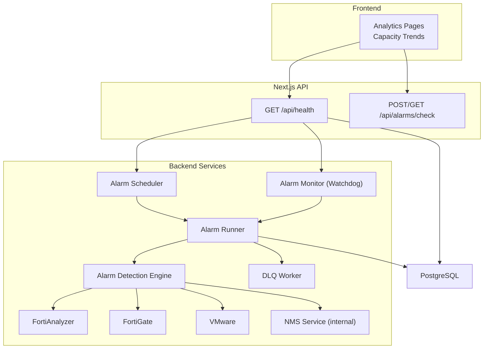
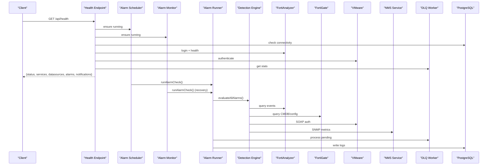
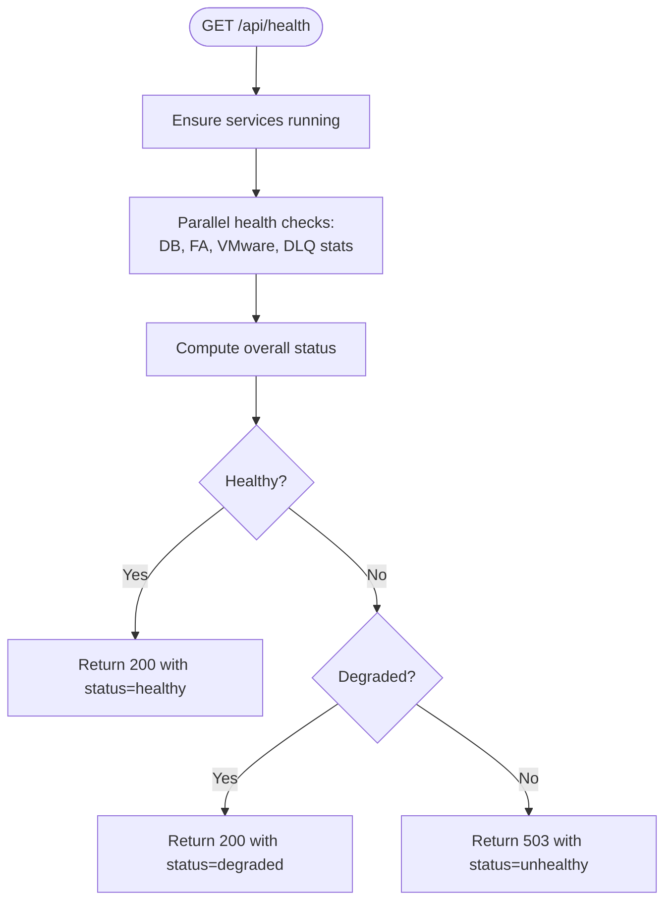
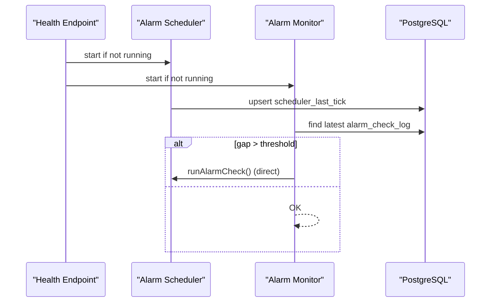
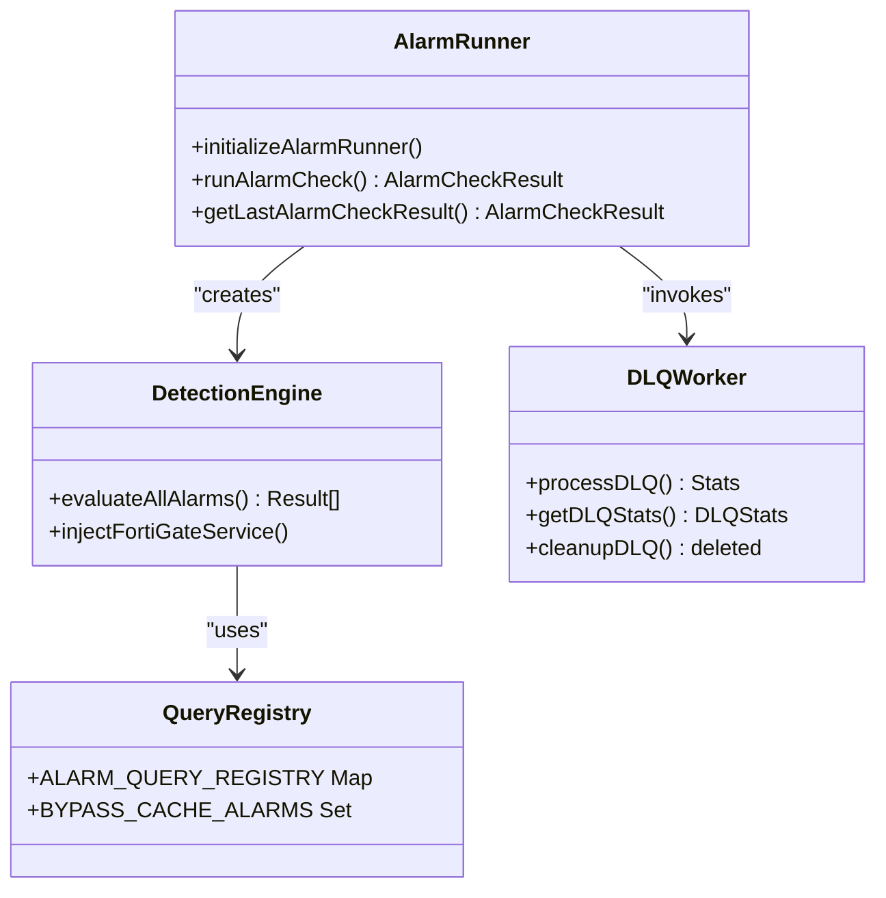
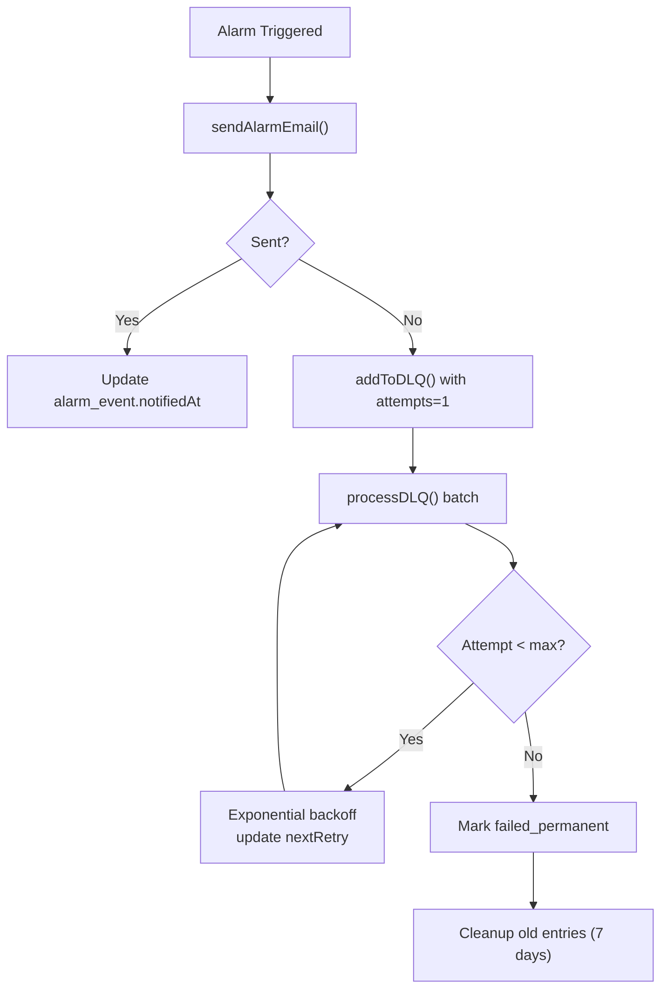
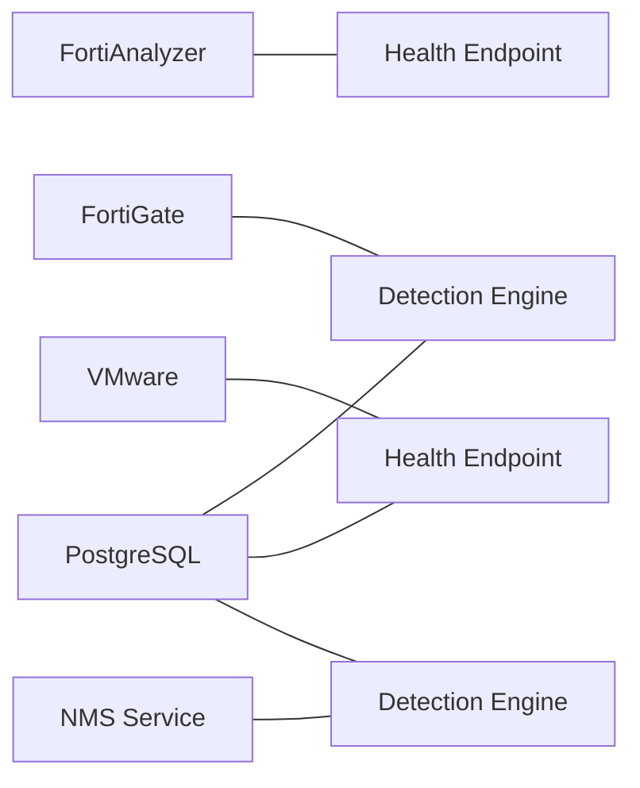
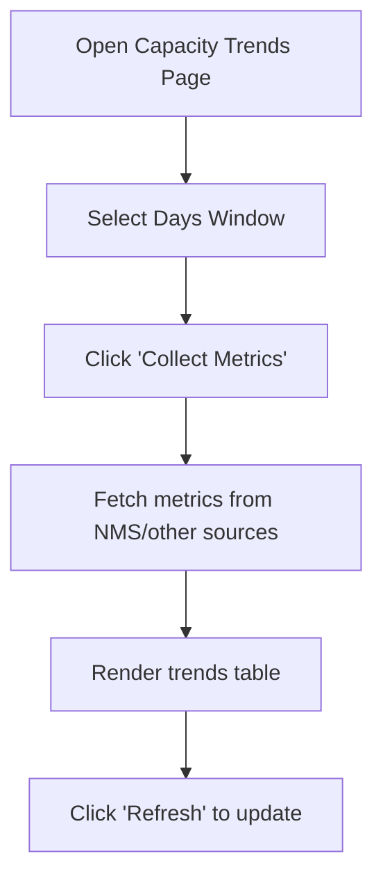
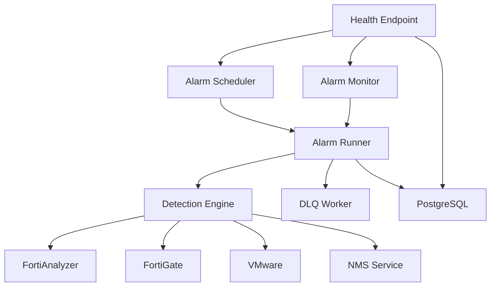

# Service Monitoring

<cite>
**Referenced Files in This Document**
- [route.ts](file://app/api/health/route.ts)
- [alarm-runner.ts](file://lib/alarms/alarm-runner.ts)
- [alarm-scheduler.ts](file://lib/alarm-scheduler.ts)
- [alarm-monitor.ts](file://lib/alarms/alarm-monitor.ts)
- [dlq-worker.ts](file://lib/notifications/dlq-worker.ts)
- [index.ts](file://lib/alarms/queries/index.ts)
- [route.ts](file://app/api/alarms/check/route.ts)
- [main.py](file://nms_service/main.py)
- [page.tsx](file://app/analytics/capacity/page.tsx)
</cite>

## Table of Contents
1. [Introduction](#introduction)
2. [Project Structure](#project-structure)
3. [Core Components](#core-components)
4. [Architecture Overview](#architecture-overview)
5. [Detailed Component Analysis](#detailed-component-analysis)
6. [Dependency Analysis](#dependency-analysis)
7. [Performance Considerations](#performance-considerations)
8. [Troubleshooting Guide](#troubleshooting-guide)
9. [Conclusion](#conclusion)
10. [Appendices](#appendices)

## Introduction
This document explains how InfraScope monitors service health, evaluates security and configuration alarms, and delivers reliable notifications. It covers health status tracking, automated health checks, performance metrics, alerting and escalation, integration with external systems (FortiAnalyzer, FortiGate, VMware, NMS), and practical workflows for setting up monitoring, configuring alerts, and optimizing performance.

## Project Structure
Monitoring and observability spans several layers:
- Health endpoint aggregates system-wide status and auto-restores services.
- Alarm scheduler and watchdog orchestrate periodic detection.
- Detection engine evaluates alarms against integrated data sources.
- Dead-letter queue (DLQ) retries failed notifications.
- NMS service provides internal SNMP-based metrics and discovery.
- Analytics pages visualize capacity trends and resource utilization.

**Diagram sources**
- [route.ts:1-255](file://app/api/health/route.ts#L1-L255)
- [alarm-runner.ts:1-463](file://lib/alarms/alarm-runner.ts#L1-L463)
- [alarm-scheduler.ts:1-136](file://lib/alarm-scheduler.ts#L1-L136)
- [alarm-monitor.ts:1-220](file://lib/alarms/alarm-monitor.ts#L1-L220)
- [dlq-worker.ts:1-253](file://lib/notifications/dlq-worker.ts#L1-L253)
- [main.py:1-483](file://nms_service/main.py#L1-L483)

**Section sources**
- [route.ts:1-255](file://app/api/health/route.ts#L1-L255)
- [alarm-runner.ts:1-463](file://lib/alarms/alarm-runner.ts#L1-L463)
- [alarm-scheduler.ts:1-136](file://lib/alarm-scheduler.ts#L1-L136)
- [alarm-monitor.ts:1-220](file://lib/alarms/alarm-monitor.ts#L1-L220)
- [dlq-worker.ts:1-253](file://lib/notifications/dlq-worker.ts#L1-L253)
- [main.py:1-483](file://nms_service/main.py#L1-L483)

## Core Components
- Health endpoint: Aggregates health across database, FortiAnalyzer, VMware, alarm engine, and DLQ. Auto-starts scheduler and monitor if missing.
- Alarm scheduler: Periodic trigger (every 10 minutes) that runs detection and writes run logs.
- Alarm monitor: Watchdog that detects missed runs and recovers by invoking detection directly.
- Detection engine: Evaluates alarms against integrated data sources, with a query registry for optimized retrieval.
- DLQ worker: Retries failed notifications with exponential backoff and tracks delivery statistics.
- NMS service: Internal FastAPI service for SNMP polling, device backups, discovery, and topology.

**Section sources**
- [route.ts:14-255](file://app/api/health/route.ts#L14-L255)
- [alarm-runner.ts:119-463](file://lib/alarms/alarm-runner.ts#L119-L463)
- [alarm-scheduler.ts:26-136](file://lib/alarm-scheduler.ts#L26-L136)
- [alarm-monitor.ts:26-220](file://lib/alarms/alarm-monitor.ts#L26-L220)
- [dlq-worker.ts:1-253](file://lib/notifications/dlq-worker.ts#L1-L253)
- [main.py:91-483](file://nms_service/main.py#L91-L483)

## Architecture Overview
The monitoring pipeline combines scheduled and watchdog-triggered detection, robust logging, and resilient notification delivery.

**Diagram sources**
- [route.ts:204-254](file://app/api/health/route.ts#L204-L254)
- [alarm-scheduler.ts:37-113](file://lib/alarm-scheduler.ts#L37-L113)
- [alarm-monitor.ts:117-184](file://lib/alarms/alarm-monitor.ts#L117-L184)
- [alarm-runner.ts:181-463](file://lib/alarms/alarm-runner.ts#L181-L463)
- [dlq-worker.ts:76-192](file://lib/notifications/dlq-worker.ts#L76-L192)
- [main.py:91-483](file://nms_service/main.py#L91-L483)

## Detailed Component Analysis

### Health Status Tracking
- Purpose: Provide a single source of truth for system health, including service liveness, datasource connectivity, alarm activity, and notification delivery.
- Key behaviors:
  - Auto-starts alarm scheduler and monitor if not running.
  - Parallelizes health checks for database, FortiAnalyzer, and VMware.
  - Computes overall status from counts of unhealthy datasources, scheduler/monitor liveness, recent alarm errors, and DLQ failures.
  - Returns HTTP 200 for healthy/degraded, 503 for unhealthy.

**Diagram sources**
- [route.ts:204-254](file://app/api/health/route.ts#L204-L254)

**Section sources**
- [route.ts:14-255](file://app/api/health/route.ts#L14-L255)

### Automated Health Checks and Service Restart
- Health endpoint calls ensureAlarmServicesRunning to start scheduler and monitor if missing.
- Scheduler writes heartbeat-like systemConfig entries for downstream health monitoring.
- Monitor periodically checks last run time and triggers recovery run if gap exceeds threshold.

**Diagram sources**
- [route.ts:168-202](file://app/api/health/route.ts#L168-L202)
- [alarm-scheduler.ts:82-102](file://lib/alarm-scheduler.ts#L82-L102)
- [alarm-monitor.ts:117-184](file://lib/alarms/alarm-monitor.ts#L117-L184)

**Section sources**
- [route.ts:168-202](file://app/api/health/route.ts#L168-L202)
- [alarm-scheduler.ts:26-136](file://lib/alarm-scheduler.ts#L26-L136)
- [alarm-monitor.ts:26-220](file://lib/alarms/alarm-monitor.ts#L26-L220)

### Alarm Detection Engine and Metrics
- Detection engine:
  - Evaluates alarms in batches, with correlation alarms evaluated after regular alarms.
  - Supports dedicated query functions per alarm via a registry for optimized retrieval.
  - Retries failed notifications from previous cycles.
- Metrics collected:
  - Duration, alarms per second, severity breakdown, category breakdown.
  - Logs success/failure to alarm_check_log with status SUCCESS/PARTIAL/FAILED.

**Diagram sources**
- [alarm-runner.ts:181-463](file://lib/alarms/alarm-runner.ts#L181-L463)
- [index.ts:1-250](file://lib/alarms/queries/index.ts#L1-L250)
- [dlq-worker.ts:76-253](file://lib/notifications/dlq-worker.ts#L76-L253)

**Section sources**
- [alarm-runner.ts:119-463](file://lib/alarms/alarm-runner.ts#L119-L463)
- [index.ts:1-250](file://lib/alarms/queries/index.ts#L1-L250)
- [dlq-worker.ts:1-253](file://lib/notifications/dlq-worker.ts#L1-L253)

### Alerting Mechanisms and Escalation
- Email notifications:
  - Sent upon alarm trigger; failures are captured in DLQ with exponential backoff.
  - Retry logic re-processes failed notifications on subsequent cycles.
- FortiAnalyzer health escalations:
  - Periodic alerts when FA login fails repeatedly or account is locked, with throttling to once per hour.
- DLQ lifecycle:
  - Pending entries retried with increasing backoff; after max attempts, marked failed_permanent.
  - Automatic cleanup of old delivered/failed entries after retention period.

**Diagram sources**
- [alarm-runner.ts:2242-2271](file://lib/alarms/alarm-runner.ts#L2242-L2271)
- [dlq-worker.ts:43-192](file://lib/notifications/dlq-worker.ts#L43-L192)

**Section sources**
- [alarm-runner.ts:83-117](file://lib/alarms/alarm-runner.ts#L83-L117)
- [dlq-worker.ts:1-253](file://lib/notifications/dlq-worker.ts#L1-L253)

### Integration with External Systems
- FortiAnalyzer:
  - Shared singleton login with caching and backoff to avoid repeated lockouts.
  - Health endpoint caches unhealthy results to prevent continuous login attempts.
- FortiGate:
  - Singleton service reused across runs; CMDB snapshot cache cleared each cycle.
- VMware:
  - Optional integration; authenticates via SOAP to verify connectivity.
- NMS (internal):
  - Provides device inventory, on-demand polling, backups, discovery, and topology.
  - Health endpoint indicates poller liveness and registered devices.

**Diagram sources**
- [route.ts:62-144](file://app/api/health/route.ts#L62-L144)
- [alarm-runner.ts:44-77](file://lib/alarms/alarm-runner.ts#L44-L77)
- [main.py:91-483](file://nms_service/main.py#L91-L483)

**Section sources**
- [route.ts:62-144](file://app/api/health/route.ts#L62-L144)
- [alarm-runner.ts:44-77](file://lib/alarms/alarm-runner.ts#L44-L77)
- [main.py:91-483](file://nms_service/main.py#L91-L483)

### Performance Monitoring Dashboards and Trend Analysis
- Capacity analytics page:
  - Allows selecting time windows (1/7/30 days) and refreshing metrics.
  - Displays resource trends, current values, and status badges.
  - Provides controls to collect metrics and refresh views.

**Diagram sources**
- [page.tsx:118-257](file://app/analytics/capacity/page.tsx#L118-L257)

**Section sources**
- [page.tsx:118-257](file://app/analytics/capacity/page.tsx#L118-L257)

### Practical Examples

#### Setting Up Health Monitoring
- Ensure the health endpoint is reachable and configure monitoring systems to call GET /api/health.
- Use the returned status and service fields to drive synthetic checks and alerting.

**Section sources**
- [route.ts:204-254](file://app/api/health/route.ts#L204-L254)

#### Configuring Alarms and Notifications
- Define alarm definitions in the system; the scheduler will evaluate them every 10 minutes.
- Configure email notifications; failures are queued and retried automatically.
- Monitor DLQ statistics to track delivery health.

**Section sources**
- [alarm-runner.ts:181-463](file://lib/alarms/alarm-runner.ts#L181-L463)
- [dlq-worker.ts:1-253](file://lib/notifications/dlq-worker.ts#L1-L253)

#### Performance Optimization Workflows
- Use the detection engine’s metrics (duration, alarms/sec, severity/category breakdown) to tune evaluation windows and reduce noise.
- Prefer dedicated queries via the registry for high-volume or latency-sensitive alarms.
- Monitor FA health alerts to maintain timely detection.

**Section sources**
- [alarm-runner.ts:320-410](file://lib/alarms/alarm-runner.ts#L320-L410)
- [index.ts:1-250](file://lib/alarms/queries/index.ts#L1-L250)

## Dependency Analysis
- Health endpoint depends on scheduler, monitor, datasource checks, and DLQ stats.
- Scheduler and monitor both depend on the runner; monitor acts as a backup watchdog.
- Runner depends on the detection engine and integrates with DLQ and FA/FG/VM/NMS.
- DLQ worker depends on DB and email transport.

**Diagram sources**
- [route.ts:1-255](file://app/api/health/route.ts#L1-L255)
- [alarm-scheduler.ts:1-136](file://lib/alarm-scheduler.ts#L1-L136)
- [alarm-monitor.ts:1-220](file://lib/alarms/alarm-monitor.ts#L1-L220)
- [alarm-runner.ts:1-463](file://lib/alarms/alarm-runner.ts#L1-L463)
- [dlq-worker.ts:1-253](file://lib/notifications/dlq-worker.ts#L1-L253)
- [main.py:1-483](file://nms_service/main.py#L1-L483)

**Section sources**
- [route.ts:1-255](file://app/api/health/route.ts#L1-L255)
- [alarm-scheduler.ts:1-136](file://lib/alarm-scheduler.ts#L1-L136)
- [alarm-monitor.ts:1-220](file://lib/alarms/alarm-monitor.ts#L1-L220)
- [alarm-runner.ts:1-463](file://lib/alarms/alarm-runner.ts#L1-L463)
- [dlq-worker.ts:1-253](file://lib/notifications/dlq-worker.ts#L1-L253)
- [main.py:1-483](file://nms_service/main.py#L1-L483)

## Performance Considerations
- In-process execution: Both scheduler and monitor call the runner directly to guarantee completion and avoid HTTP drop risks.
- Mutex and DB guard: Prevents overlapping runs and resolves stale locks.
- Timeouts and logging: Evaluation runs with a global timeout and writes logs regardless of outcome.
- DLQ batching: Limits retry batch size to avoid overwhelming external services.
- Query optimization: Dedicated query functions reduce memory filtering overhead and improve throughput.

[No sources needed since this section provides general guidance]

## Troubleshooting Guide
- Health endpoint returns unhealthy:
  - Verify scheduler and monitor are running; the health endpoint auto-starts them.
  - Inspect datasource health checks (database, FortiAnalyzer, VMware).
  - Review alarm stats and DLQ status for recent errors.
- Frequent timeouts or blackouts:
  - Confirm the runner’s in-process execution and DB guard are functioning.
  - Check for stale locks and orphaned RUNNING entries.
- FA login failures or account locked:
  - Expect periodic FA health alerts; address lock/unreachability promptly.
  - Health endpoint caches unhealthy results to avoid continuous login attempts.
- DLQ backlog:
  - DLQ worker processes pending entries with exponential backoff; inspect oldest pending age and retry counts.
  - Cleanup removes old delivered/failed entries after retention.

**Section sources**
- [route.ts:204-254](file://app/api/health/route.ts#L204-L254)
- [alarm-runner.ts:162-178](file://lib/alarms/alarm-runner.ts#L162-L178)
- [alarm-scheduler.ts:40-63](file://lib/alarm-scheduler.ts#L40-L63)
- [dlq-worker.ts:197-227](file://lib/notifications/dlq-worker.ts#L197-L227)

## Conclusion
InfraScope’s monitoring stack combines robust scheduling, watchdog recovery, optimized detection, and resilient notification delivery. The health endpoint centralizes visibility, while the alarm runner and DLQ worker ensure reliability. Integrations with FortiAnalyzer, FortiGate, VMware, and the internal NMS service provide comprehensive observability across security, configuration, and infrastructure domains.

[No sources needed since this section summarizes without analyzing specific files]

## Appendices

### API Definitions
- GET /api/health
  - Returns overall system status, service liveness, datasource health, alarm stats, and DLQ metrics.
  - HTTP 200 for healthy/degraded, 503 for unhealthy.

- POST/GET /api/alarms/check
  - Manual trigger for alarm evaluation; delegates to the runner.

**Section sources**
- [route.ts:204-254](file://app/api/health/route.ts#L204-L254)
- [route.ts:1-34](file://app/api/alarms/check/route.ts#L1-L34)

### Integration Endpoints (NMS Service)
- GET /health
  - Indicates poller liveness and registered devices.
- GET /devices
  - Lists polling-enabled devices and registration status.
- POST /devices/{nms_device_id}/poll
  - On-demand SNMP poll and metric save.
- POST /devices/{nms_device_id}/backup
  - SSH-based config backup.
- GET /devices/{nms_device_id}/health
  - Latest health metrics.
- GET /devices/{nms_device_id}/interfaces
  - Current interface states.
- POST /discovery/start
  - Starts discovery scan; returns scan_id.
- GET /discovery/{scan_id}
  - Progress of a scan.
- GET /discovery/{scan_id}/results
  - Discovered devices.
- GET /topology
  - LLDP/CDP topology links.

**Section sources**
- [main.py:91-483](file://nms_service/main.py#L91-L483)