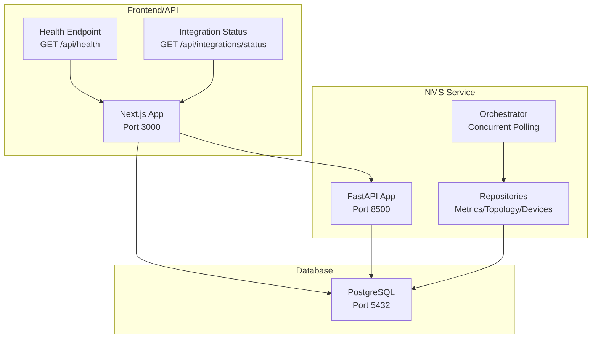
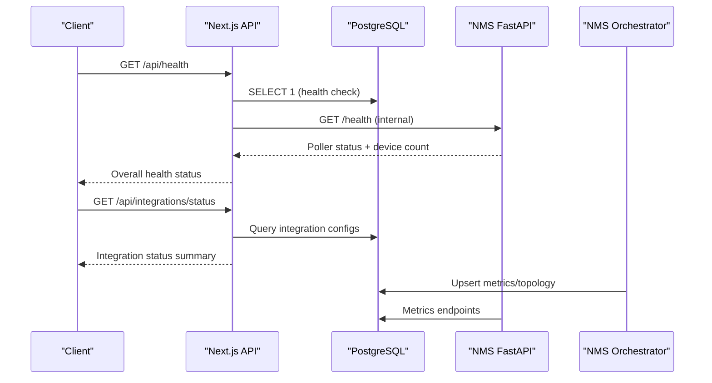
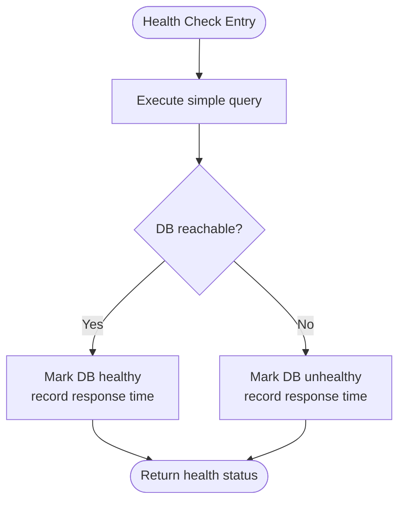
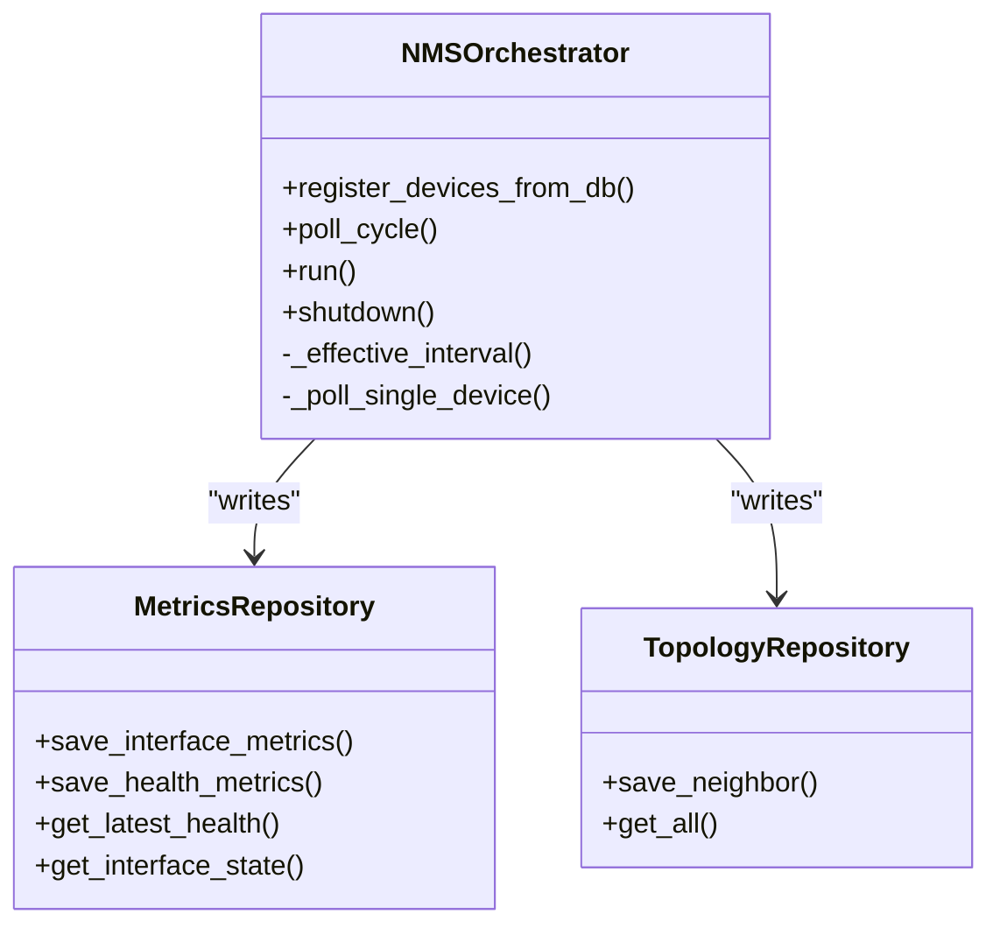
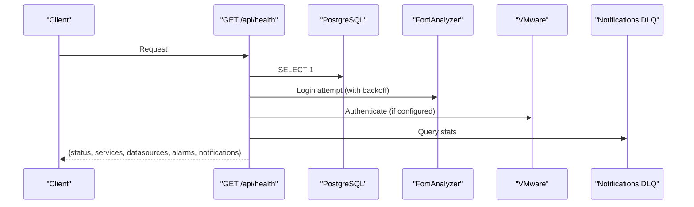
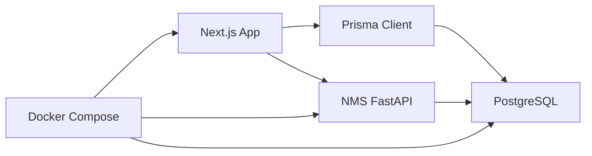
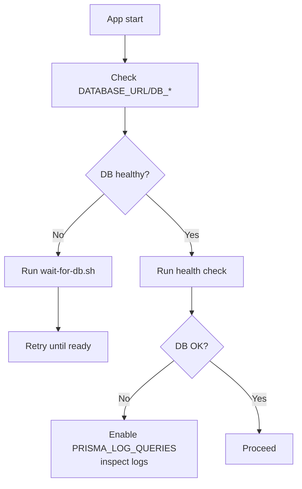

# Troubleshooting & Maintenance

<cite>
**Referenced Files in This Document**
- [prisma.ts](file://lib/prisma.ts)
- [route.ts](file://app/api/health/route.ts)
- [route.ts](file://app/api/integrations/status/route.ts)
- [main.py](file://nms_service/main.py)
- [config.py](file://nms_service/core/config.py)
- [orchestrator.py](file://nms_service/orchestrator.py)
- [repository.py](file://nms_service/database/repository.py)
- [docker-compose.yml](file://docker-compose.yml)
- [wait-for-db.sh](file://scripts/wait-for-db.sh)
- [postgres-backup.sh](file://docker/postgres-backup.sh)
- [package.json](file://package.json)
- [alarm-scheduler.ts](file://lib/alarm-scheduler.ts)
- [diagnostic.js](file://scripts/diagnostic.js)
</cite>

## Table of Contents
1. [Introduction](#introduction)
2. [Project Structure](#project-structure)
3. [Core Components](#core-components)
4. [Architecture Overview](#architecture-overview)
5. [Detailed Component Analysis](#detailed-component-analysis)
6. [Dependency Analysis](#dependency-analysis)
7. [Performance Considerations](#performance-considerations)
8. [Troubleshooting Guide](#troubleshooting-guide)
9. [Conclusion](#conclusion)
10. [Appendices](#appendices)

## Introduction
This document provides a comprehensive troubleshooting and maintenance guide for the system. It focuses on diagnosing and resolving common operational issues, including database connectivity, Prisma client behavior, port conflicts, performance optimization, memory management, backup and recovery, system health checks, integration diagnostics, API debugging, and component isolation. It also outlines preventive maintenance, monitoring, and escalation procedures.

## Project Structure
The system comprises:
- Next.js frontend and API with health and integration status endpoints
- Prisma client for database access
- NMS (Network Monitoring Sidecar) service written in Python/FastAPI
- Docker Compose orchestration for local development with health checks and port mappings
- Scripts for database readiness, backups, and diagnostics

**Diagram sources**
- [docker-compose.yml:32-77](file://docker-compose.yml#L32-L77)
- [main.py:39-483](file://nms_service/main.py#L39-L483)
- [route.ts:204-255](file://app/api/health/route.ts#L204-L255)
- [route.ts:14-202](file://app/api/integrations/status/route.ts#L14-L202)

**Section sources**
- [docker-compose.yml:1-153](file://docker-compose.yml#L1-L153)
- [package.json:5-14](file://package.json#L5-L14)

## Core Components
- Prisma Client singleton with configurable logging and environment-aware initialization
- Health endpoint aggregating database, FortiAnalyzer, VMware, alarm services, and notification DLQ stats
- NMS FastAPI service exposing device, metrics, discovery, and topology endpoints
- NMS orchestrator managing concurrent SNMP/SSH polling with dynamic intervals and thread safety
- Docker Compose with health checks and port mappings for web, DB, and NMS
- Backup script for PostgreSQL and readiness script for DB connectivity

**Section sources**
- [prisma.ts:10-20](file://lib/prisma.ts#L10-L20)
- [route.ts:46-144](file://app/api/health/route.ts#L46-L144)
- [main.py:91-483](file://nms_service/main.py#L91-L483)
- [config.py:71-172](file://nms_service/core/config.py#L71-L172)
- [orchestrator.py:35-461](file://nms_service/orchestrator.py#L35-L461)
- [docker-compose.yml:5-153](file://docker-compose.yml#L5-L153)
- [postgres-backup.sh:1-37](file://docker/postgres-backup.sh#L1-L37)
- [wait-for-db.sh:1-29](file://scripts/wait-for-db.sh#L1-L29)

## Architecture Overview
The system integrates a Next.js application with a Python-based NMS sidecar that polls network devices and writes metrics to the same PostgreSQL database. Health endpoints expose system-wide status and auto-restart alarm services if needed.

**Diagram sources**
- [route.ts:204-255](file://app/api/health/route.ts#L204-L255)
- [main.py:91-117](file://nms_service/main.py#L91-L117)
- [repository.py:65-200](file://nms_service/database/repository.py#L65-L200)
- [docker-compose.yml:32-77](file://docker-compose.yml#L32-L77)

## Detailed Component Analysis

### Database Connectivity and Prisma Client
- Prisma singleton pattern ensures a single client instance across the app lifecycle and disables verbose logging by default to reduce I/O overhead.
- Health endpoint performs a simple query to verify database availability and measures response time.
- Diagnostic script demonstrates basic connectivity and data sampling.

**Diagram sources**
- [route.ts:46-54](file://app/api/health/route.ts#L46-L54)
- [prisma.ts:10-20](file://lib/prisma.ts#L10-L20)

**Section sources**
- [prisma.ts:10-20](file://lib/prisma.ts#L10-L20)
- [route.ts:46-54](file://app/api/health/route.ts#L46-L54)
- [diagnostic.js:4-22](file://scripts/diagnostic.js#L4-L22)

### NMS Service and Concurrent Polling
- NMS FastAPI exposes health, device, metrics, discovery, and topology endpoints.
- Orchestrator coordinates concurrent SNMP/SSH polling with dynamic intervals, jitter, and per-device throttling.
- Repositories encapsulate DB writes for interfaces, health metrics, and topology links.

**Diagram sources**
- [orchestrator.py:35-461](file://nms_service/orchestrator.py#L35-L461)
- [repository.py:65-251](file://nms_service/database/repository.py#L65-L251)

**Section sources**
- [main.py:91-483](file://nms_service/main.py#L91-L483)
- [config.py:71-172](file://nms_service/core/config.py#L71-L172)
- [orchestrator.py:35-461](file://nms_service/orchestrator.py#L35-L461)
- [repository.py:65-251](file://nms_service/database/repository.py#L65-L251)

### Health and Integration Monitoring
- Health endpoint aggregates database, FortiAnalyzer, VMware, alarm services, and DLQ stats, returning degraded/unhealthy when thresholds are exceeded.
- Integration status endpoint surfaces configured integrations, last sync labels, and health scores.

**Diagram sources**
- [route.ts:204-255](file://app/api/health/route.ts#L204-L255)

**Section sources**
- [route.ts:14-255](file://app/api/health/route.ts#L14-L255)
- [route.ts:14-202](file://app/api/integrations/status/route.ts#L14-L202)

## Dependency Analysis
- Web app depends on Prisma client and communicates with NMS internally.
- NMS depends on shared PostgreSQL configuration and writes metrics directly to nms_* tables.
- Docker Compose defines port mappings and health checks for web (3000), DB (5432), and NMS (8500).

**Diagram sources**
- [docker-compose.yml:32-114](file://docker-compose.yml#L32-L114)
- [prisma.ts:10-20](file://lib/prisma.ts#L10-L20)
- [main.py:39-483](file://nms_service/main.py#L39-L483)

**Section sources**
- [docker-compose.yml:32-114](file://docker-compose.yml#L32-L114)
- [prisma.ts:10-20](file://lib/prisma.ts#L10-L20)
- [main.py:39-483](file://nms_service/main.py#L39-L483)

## Performance Considerations
- Prisma logging disabled by default to minimize I/O overhead; enable selectively for diagnostics.
- NMS orchestrator uses a persistent thread pool with timeouts to avoid long-running cycles and supports dynamic polling intervals and jitter to distribute load.
- Health endpoint parallelizes checks and returns 200 for degraded to avoid alert storms while still signaling issues.

Recommendations:
- Keep PRISMA_LOG_QUERIES disabled unless investigating slow queries.
- Tune SNMP/SSH timeouts and concurrency limits via environment variables.
- Monitor alarm scheduler heartbeat via systemConfig entries to detect deadlocks or long evaluations.

**Section sources**
- [prisma.ts:13-16](file://lib/prisma.ts#L13-L16)
- [orchestrator.py:61-70](file://nms_service/orchestrator.py#L61-L70)
- [route.ts:218-226](file://app/api/health/route.ts#L218-L226)
- [alarm-scheduler.ts:37-113](file://lib/alarm-scheduler.ts#L37-L113)

## Troubleshooting Guide

### Database Connection Issues
Symptoms:
- Health endpoint reports unhealthy DB
- Prisma queries fail with connection errors
- Application logs show connection refused or authentication failures

Resolution steps:
1. Verify DATABASE_URL or individual DB_* environment variables match the running DB container.
2. Confirm DB is healthy using Docker health checks and connect manually via psql.
3. Use the readiness script to confirm DB availability before starting services.
4. Temporarily enable Prisma query logging to capture failing statements.
5. Check for connection pool exhaustion and adjust pool sizes if needed.

**Diagram sources**
- [wait-for-db.sh:1-29](file://scripts/wait-for-db.sh#L1-L29)
- [route.ts:46-54](file://app/api/health/route.ts#L46-L54)
- [prisma.ts:13-16](file://lib/prisma.ts#L13-L16)

**Section sources**
- [docker-compose.yml:23-28](file://docker-compose.yml#L23-L28)
- [wait-for-db.sh:1-29](file://scripts/wait-for-db.sh#L1-L29)
- [route.ts:46-54](file://app/api/health/route.ts#L46-L54)
- [prisma.ts:13-16](file://lib/prisma.ts#L13-L16)

### Prisma Client Problems
Symptoms:
- Singleton not initialized
- Memory leaks or excessive connections
- Unexpected query logs causing performance degradation

Resolution steps:
1. Ensure the Prisma client is imported early during app initialization.
2. Avoid creating multiple clients; rely on the singleton exported from the module.
3. Disable PRISMA_LOG_QUERIES in production; enable only for targeted investigations.
4. Monitor connection lifecycle and ensure proper disconnection in scripts.

**Section sources**
- [prisma.ts:10-20](file://lib/prisma.ts#L10-L20)
- [diagnostic.js:1-23](file://scripts/diagnostic.js#L1-L23)

### Port Conflicts
Symptoms:
- Services fail to start or bind to ports
- Docker Compose reports port collisions

Resolution steps:
1. Review port mappings in Docker Compose for web (3000), DB (5432), and NMS (8500).
2. Change exposed ports or stop conflicting services.
3. On the host, verify free ports using netstat/ss and adjust DOCKER_HOST mappings if needed.

**Section sources**
- [docker-compose.yml:19-20](file://docker-compose.yml#L19-L20)
- [docker-compose.yml:51-52](file://docker-compose.yml#L51-L52)
- [docker-compose.yml:99-100](file://docker-compose.yml#L99-L100)

### System Performance Optimization
Actions:
- Tune SNMP/SSH timeouts and concurrency via NMS environment variables.
- Adjust polling intervals for interfaces, CPU/memory, inventory, and topology.
- Use jitter to smooth polling spikes across devices.
- Monitor alarm scheduler heartbeat to detect long-running evaluations.

**Section sources**
- [config.py:112-140](file://nms_service/core/config.py#L112-L140)
- [orchestrator.py:75-96](file://nms_service/orchestrator.py#L75-L96)
- [alarm-scheduler.ts:37-113](file://lib/alarm-scheduler.ts#L37-L113)

### Memory Management and Resource Utilization
Guidance:
- Limit max workers for SNMP/SSH polling to prevent memory pressure.
- Monitor NMS thread pool usage and adjust max_concurrent_pollers.
- Use Docker health checks to detect stalled containers and restart as needed.

**Section sources**
- [config.py:115-124](file://nms_service/core/config.py#L115-L124)
- [docker-compose.yml:109-114](file://docker-compose.yml#L109-L114)

### Backup and Recovery Procedures
Steps:
1. Trigger a backup using the provided script inside the DB container.
2. Verify compressed backup file and retention policy.
3. Test restore procedure in a staging environment before applying to production.

**Section sources**
- [postgres-backup.sh:1-37](file://docker/postgres-backup.sh#L1-L37)

### Database Maintenance Tasks
Tasks:
- Apply migrations using the project’s scripts.
- Seed initial data if needed.
- Use Prisma Studio for local inspection.

**Section sources**
- [package.json:11-14](file://package.json#L11-L14)

### System Health Checks
- Use the health endpoint to validate DB, FortiAnalyzer, VMware, alarm services, and DLQ status.
- Use the integration status endpoint to track configured integrations and sync health.

**Section sources**
- [route.ts:204-255](file://app/api/health/route.ts#L204-L255)
- [route.ts:14-202](file://app/api/integrations/status/route.ts#L14-L202)

### Integration Troubleshooting
Common issues:
- Missing credentials or host configuration
- Sync failures leading to “error” status
- Unknown integration types requiring configuration

Resolution:
- Validate integration configurations in the database and ensure hosts are reachable.
- Investigate last sync timestamps and messages.
- Add missing integration configurations if types are unconfigured.

**Section sources**
- [route.ts:47-117](file://app/api/integrations/status/route.ts#L47-L117)

### API Debugging and Component Isolation
Techniques:
- Use the NMS health endpoint to verify internal service status.
- Isolate DB vs. NMS issues by checking each service’s health independently.
- Temporarily disable alarm services to test DB-only operations.

**Section sources**
- [main.py:91-98](file://nms_service/main.py#L91-L98)
- [route.ts:168-202](file://app/api/health/route.ts#L168-L202)

### Preventive Maintenance and Proactive Detection
- Monitor health endpoint status and set up external alerts.
- Periodically review alarm scheduler heartbeat and prune stale locks.
- Rotate secrets and validate credentials regularly.
- Schedule periodic backups and verify restoration.

**Section sources**
- [alarm-scheduler.ts:46-63](file://lib/alarm-scheduler.ts#L46-L63)
- [route.ts:218-226](file://app/api/health/route.ts#L218-L226)

### Escalation Procedures and Support Resources
Escalation:
- If DB remains unreachable after readiness checks, escalate to DB team with logs and connection details.
- If NMS polling stalls, escalate to platform team with thread dumps and repository logs.
- For integration failures, escalate to the integration owner with endpoint logs and credentials.

Support resources:
- Health endpoint for system-wide status
- Integration status endpoint for integration health
- Docker Compose logs for container-level diagnostics

**Section sources**
- [route.ts:204-255](file://app/api/health/route.ts#L204-L255)
- [route.ts:14-202](file://app/api/integrations/status/route.ts#L14-L202)
- [docker-compose.yml:149-152](file://docker-compose.yml#L149-L152)

## Conclusion
This guide consolidates practical procedures for diagnosing and resolving common issues, optimizing performance, maintaining backups, and ensuring system health. By leveraging health endpoints, NMS diagnostics, and Docker-based monitoring, teams can quickly isolate problems, apply fixes, and maintain a resilient deployment.

## Appendices

### Quick Diagnostic Workflows
- Database connectivity: run readiness script, verify health endpoint, enable PRISMA_LOG_QUERIES temporarily
- NMS polling: check NMS health endpoint, review orchestrator logs, adjust concurrency and intervals
- Integrations: inspect integration status endpoint, validate credentials and reachability

**Section sources**
- [wait-for-db.sh:1-29](file://scripts/wait-for-db.sh#L1-L29)
- [main.py:91-98](file://nms_service/main.py#L91-L98)
- [route.ts:14-202](file://app/api/integrations/status/route.ts#L14-L202)