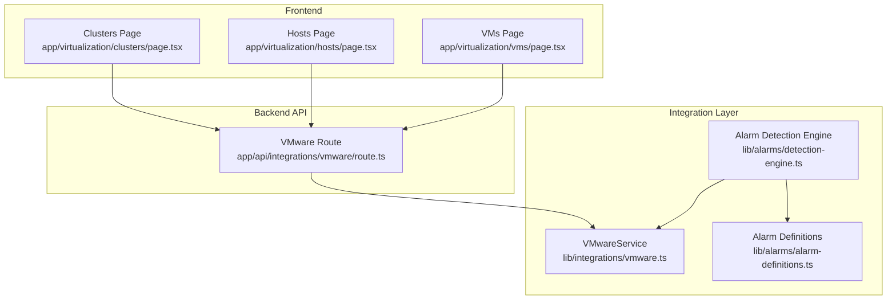
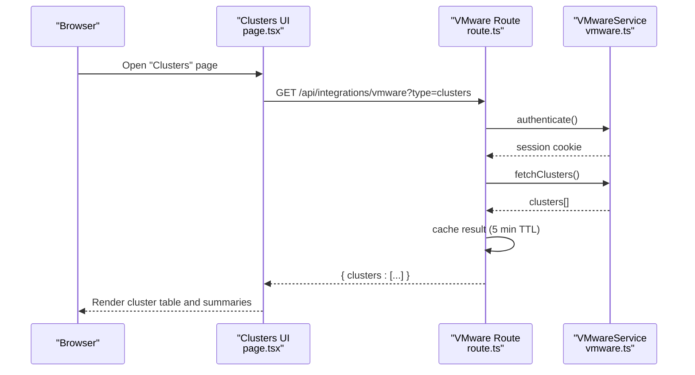
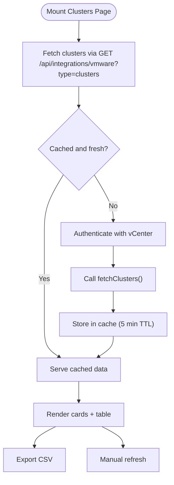
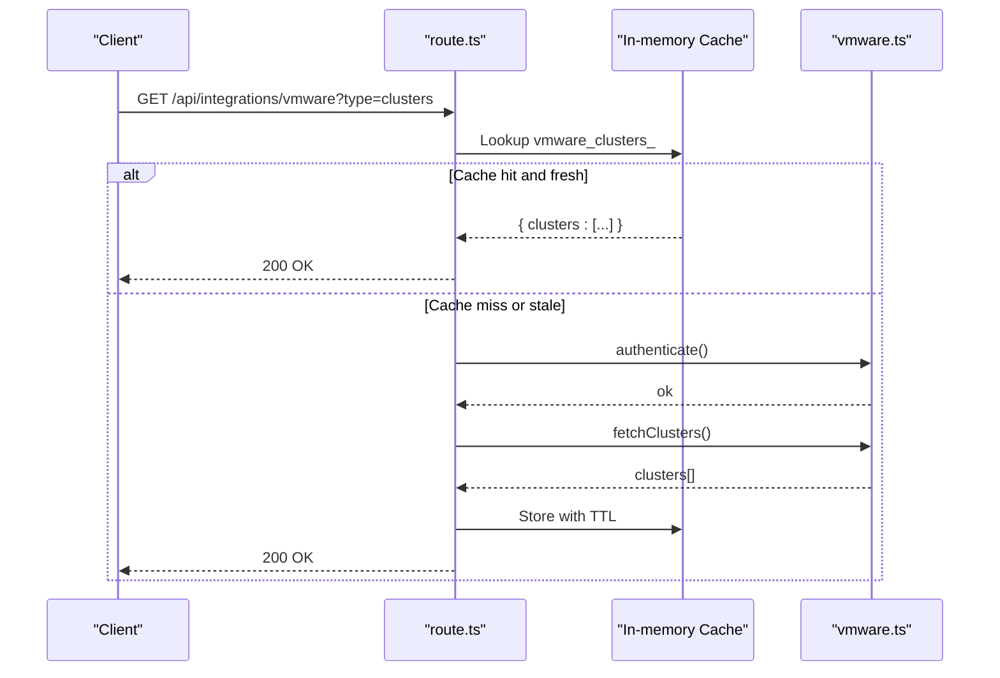
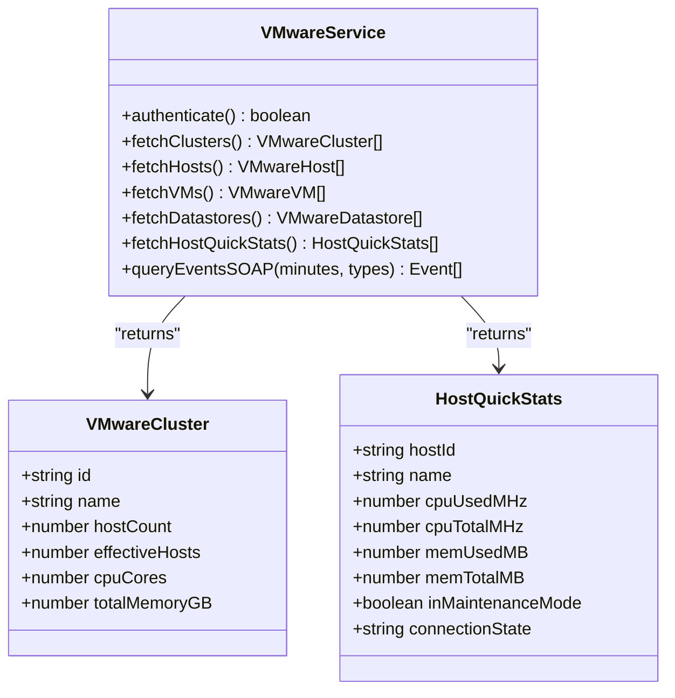
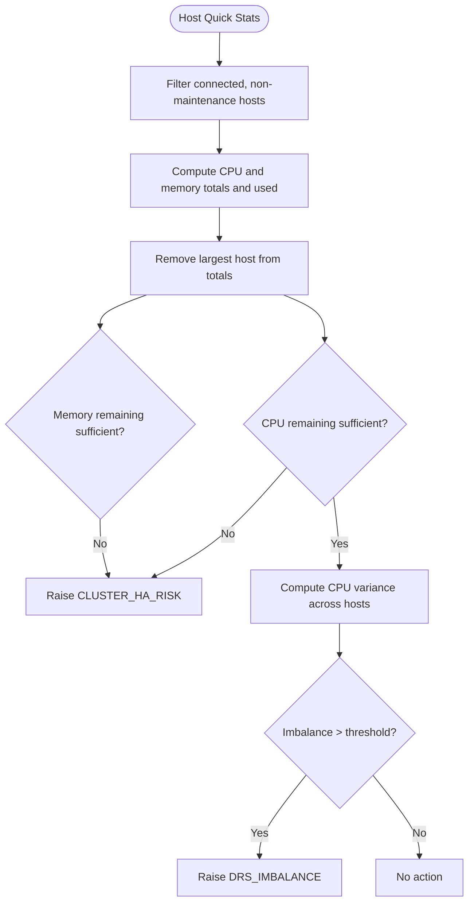
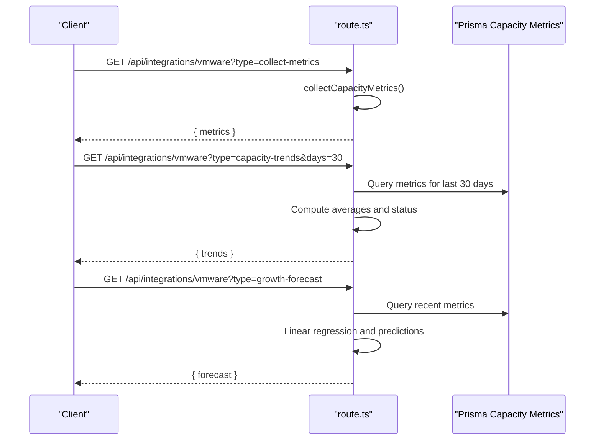
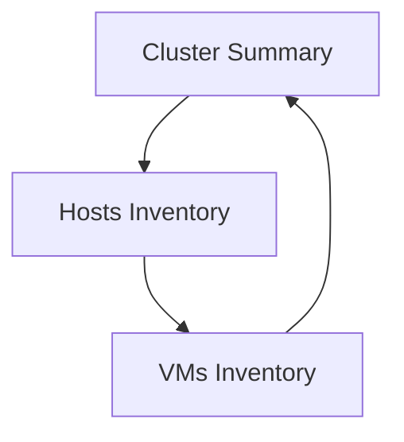
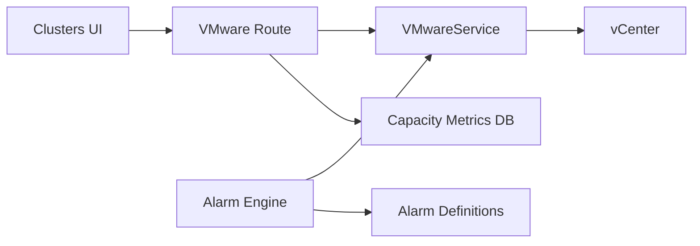

# Cluster Management

<cite>
**Referenced Files in This Document**
- [page.tsx](file://app/virtualization/clusters/page.tsx)
- [route.ts](file://app/api/integrations/vmware/route.ts)
- [vmware.ts](file://lib/integrations/vmware.ts)
- [detection-engine.ts](file://lib/alarms/detection-engine.ts)
- [alarm-definitions.ts](file://lib/alarms/alarm-definitions.ts)
- [hosts-page.tsx](file://app/virtualization/hosts/page.tsx)
- [vms-page.tsx](file://app/virtualization/vms/page.tsx)
</cite>

## Table of Contents
1. [Introduction](#introduction)
2. [Project Structure](#project-structure)
3. [Core Components](#core-components)
4. [Architecture Overview](#architecture-overview)
5. [Detailed Component Analysis](#detailed-component-analysis)
6. [Dependency Analysis](#dependency-analysis)
7. [Performance Considerations](#performance-considerations)
8. [Troubleshooting Guide](#troubleshooting-guide)
9. [Conclusion](#conclusion)
10. [Appendices](#appendices)

## Introduction
This document explains the VMware cluster management functionality implemented in the project. It focuses on:
- Cluster topology visualization and summaries
- Resource pool allocation visibility
- High Availability (HA) and Distributed Resource Scheduler (DRS) configuration tracking
- Cluster health monitoring and performance metrics collection
- Capacity planning indicators and resource utilization
- Practical examples for configuration management, optimization, and troubleshooting
- Migration scenarios, maintenance mode operations, and disaster recovery planning

## Project Structure
The cluster management capability spans the frontend UI, backend API routes, and the VMware integration service. The UI renders cluster summaries and tables, the API routes orchestrate data retrieval and caching, and the service integrates with vCenter via REST and SOAP.

**Diagram sources**
- [page.tsx:1-252](file://app/virtualization/clusters/page.tsx#L1-L252)
- [route.ts:1-1072](file://app/api/integrations/vmware/route.ts#L1-L1072)
- [vmware.ts:1-2431](file://lib/integrations/vmware.ts#L1-L2431)
- [detection-engine.ts:1745-1832](file://lib/alarms/detection-engine.ts#L1745-L1832)
- [alarm-definitions.ts:1287-1349](file://lib/alarms/alarm-definitions.ts#L1287-L1349)

**Section sources**
- [page.tsx:1-252](file://app/virtualization/clusters/page.tsx#L1-L252)
- [route.ts:187-794](file://app/api/integrations/vmware/route.ts#L187-L794)
- [vmware.ts:909-933](file://lib/integrations/vmware.ts#L909-L933)

## Core Components
- Clusters UI: Displays cluster-level metrics (host count, effective hosts, CPU cores, memory), supports CSV export, and refresh controls.
- API route: Provides endpoints for clusters, hosts, VMs, datastores, dashboard, capacity metrics, trends, and forecasts. Implements a cache layer with stale-while-revalidate semantics.
- VMwareService: Implements vCenter integration via REST and SOAP, including authentication, cluster enumeration, host details, VM lifecycle and snapshot events, and host quick stats for CPU/memory usage.
- Alarm engine: Detects DRS imbalance and HA risk conditions using host quick stats and exposes them as alarms with recommended actions.

**Section sources**
- [page.tsx:35-252](file://app/virtualization/clusters/page.tsx#L35-L252)
- [route.ts:187-794](file://app/api/integrations/vmware/route.ts#L187-L794)
- [vmware.ts:909-933](file://lib/integrations/vmware.ts#L909-L933)
- [detection-engine.ts:1745-1832](file://lib/alarms/detection-engine.ts#L1745-L1832)

## Architecture Overview
The system retrieves cluster data from vCenter through the VMwareService, caches it at the API layer, and serves it to the UI. Alarms are generated based on host quick stats to track HA and DRS health.

**Diagram sources**
- [page.tsx:40-64](file://app/virtualization/clusters/page.tsx#L40-L64)
- [route.ts:589-614](file://app/api/integrations/vmware/route.ts#L589-L614)
- [vmware.ts:694-743](file://lib/integrations/vmware.ts#L694-L743)
- [vmware.ts:909-933](file://lib/integrations/vmware.ts#L909-L933)

## Detailed Component Analysis

### Clusters UI: Topology and Summaries
- Renders cluster cards summarizing total clusters, hosts, CPU cores, and memory.
- Displays a sortable table with host counts, effective hosts, CPU cores, and memory per cluster.
- Supports CSV export and manual refresh.
- Uses a 5-minute polling interval aligned with cache TTL.

**Diagram sources**
- [page.tsx:40-85](file://app/virtualization/clusters/page.tsx#L40-L85)
- [route.ts:589-614](file://app/api/integrations/vmware/route.ts#L589-L614)

**Section sources**
- [page.tsx:35-252](file://app/virtualization/clusters/page.tsx#L35-L252)
- [route.ts:589-614](file://app/api/integrations/vmware/route.ts#L589-L614)

### API Route: Endpoints and Caching
- Endpoints:
  - GET /api/integrations/vmware?type=clusters → returns cluster summaries
  - GET /api/integrations/vmware?type=hosts → returns host inventory
  - GET /api/integrations/vmware?type=vms → returns VM inventory
  - GET /api/integrations/vmware?type=datastores → returns datastore inventory
  - GET /api/integrations/vmware?type=dashboard → returns combined summary
  - GET /api/integrations/vmware?type=status → checks connectivity
  - GET /api/integrations/vmware?type=collect-metrics → collects capacity metrics
  - GET /api/integrations/vmware?type=capacity-trends → trends over time
  - GET /api/integrations/vmware?type=growth-forecast → growth projections
- Caching:
  - In-memory cache keyed by request type with TTLs (5 minutes for heavy endpoints).
  - Stale-while-revalidate pattern to keep UI responsive.

**Diagram sources**
- [route.ts:225-274](file://app/api/integrations/vmware/route.ts#L225-L274)
- [route.ts:589-614](file://app/api/integrations/vmware/route.ts#L589-L614)
- [vmware.ts:694-743](file://lib/integrations/vmware.ts#L694-L743)
- [vmware.ts:909-933](file://lib/integrations/vmware.ts#L909-L933)

**Section sources**
- [route.ts:187-794](file://app/api/integrations/vmware/route.ts#L187-L794)

### VMwareService: Cluster and Host Data Access
- fetchClusters():
  - Retrieves clusters with summary fields (host counts, CPU cores, total CPU/memory).
  - Returns structured data consumed by the UI and API.
- fetchHostQuickStats():
  - Uses SOAP RetrievePropertiesEx to obtain per-host CPU and memory usage, connection state, and maintenance mode.
  - Enables HA and DRS health checks.

**Diagram sources**
- [vmware.ts:909-933](file://lib/integrations/vmware.ts#L909-L933)
- [vmware.ts:1239-1388](file://lib/integrations/vmware.ts#L1239-L1388)

**Section sources**
- [vmware.ts:909-933](file://lib/integrations/vmware.ts#L909-L933)
- [vmware.ts:1239-1388](file://lib/integrations/vmware.ts#L1239-L1388)

### HA and DRS Configuration Tracking
- HA Risk Detection:
  - Alarm code CLUSTER_HA_RISK evaluates whether removing the largest host leaves insufficient CPU/RAM to handle current workload.
  - Uses host quick stats to compute remaining capacity and triggers critical alarms when thresholds are exceeded.
- DRS Imbalance Detection:
  - Alarm code DRS_IMBALANCE measures CPU usage variance across hosts and raises medium-severity alarms when imbalance exceeds a threshold.

**Diagram sources**
- [detection-engine.ts:1774-1832](file://lib/alarms/detection-engine.ts#L1774-L1832)
- [alarm-definitions.ts:1287-1331](file://lib/alarms/alarm-definitions.ts#L1287-L1331)

**Section sources**
- [detection-engine.ts:1745-1832](file://lib/alarms/detection-engine.ts#L1745-L1832)
- [alarm-definitions.ts:1287-1331](file://lib/alarms/alarm-definitions.ts#L1287-L1331)

### Capacity Planning and Metrics Collection
- Capacity Metrics:
  - Endpoint collect-metrics gathers capacity metrics for clusters, hosts, and datastores.
- Trends:
  - Endpoint capacity-trends computes average usage over time windows and classifies status (normal/warning/critical).
- Growth Forecast:
  - Endpoint growth-forecast performs linear regression on recent metrics to predict future utilization (30/60/90 days).

**Diagram sources**
- [route.ts:21-151](file://app/api/integrations/vmware/route.ts#L21-L151)
- [route.ts:726-743](file://app/api/integrations/vmware/route.ts#L726-L743)

**Section sources**
- [route.ts:21-151](file://app/api/integrations/vmware/route.ts#L21-L151)
- [route.ts:726-743](file://app/api/integrations/vmware/route.ts#L726-L743)

### Cluster-Level Resource Utilization and VM Distribution
- Cluster table displays:
  - Host count and effective hosts (online/active)
  - CPU cores per cluster
  - Memory per cluster (GB/TB)
- VM distribution:
  - Dashboard endpoint aggregates VM counts per cluster.
  - Hosts page shows per-host CPU cores and memory, enabling cross-checking with cluster totals.

**Diagram sources**
- [route.ts:325-440](file://app/api/integrations/vmware/route.ts#L325-L440)
- [route.ts:552-587](file://app/api/integrations/vmware/route.ts#L552-L587)
- [hosts-page.tsx:50-371](file://app/virtualization/hosts/page.tsx#L50-L371)
- [vms-page.tsx:1-371](file://app/virtualization/vms/page.tsx#L1-L371)

**Section sources**
- [route.ts:325-440](file://app/api/integrations/vmware/route.ts#L325-L440)
- [route.ts:552-587](file://app/api/integrations/vmware/route.ts#L552-L587)
- [hosts-page.tsx:50-371](file://app/virtualization/hosts/page.tsx#L50-L371)

## Dependency Analysis
- UI depends on API endpoints for data.
- API depends on VMwareService for vCenter integration.
- Alarm engine depends on host quick stats from VMwareService.
- Capacity forecasting relies on persisted metrics in the database.

**Diagram sources**
- [page.tsx:1-252](file://app/virtualization/clusters/page.tsx#L1-L252)
- [route.ts:1-1072](file://app/api/integrations/vmware/route.ts#L1-L1072)
- [vmware.ts:1-2431](file://lib/integrations/vmware.ts#L1-L2431)
- [detection-engine.ts:1745-1832](file://lib/alarms/detection-engine.ts#L1745-L1832)
- [alarm-definitions.ts:1287-1349](file://lib/alarms/alarm-definitions.ts#L1287-L1349)

**Section sources**
- [route.ts:187-794](file://app/api/integrations/vmware/route.ts#L187-L794)
- [vmware.ts:1239-1388](file://lib/integrations/vmware.ts#L1239-L1388)

## Performance Considerations
- Caching:
  - 5-minute TTL for heavy endpoints (clusters, hosts, datastores, dashboard) reduces vCenter load and improves UI responsiveness.
  - Stale-while-revalidate keeps the UI responsive during background revalidation.
- Parallelization:
  - Dashboard endpoint fetches VMs, hosts, clusters, and datastores concurrently.
- Efficient queries:
  - Host quick stats use SOAP with targeted property retrieval to minimize payload size.
- Recommendations:
  - Monitor cache hit rates and adjust TTLs based on change frequency.
  - Consider pagination for large datasets if needed.

[No sources needed since this section provides general guidance]

## Troubleshooting Guide
Common issues and resolutions:
- vCenter connectivity failures:
  - Verify integration configuration and credentials. Use the status endpoint to confirm connectivity.
- Authentication errors:
  - Ensure vCenter credentials are correct and certificate handling is acceptable.
- Missing host details:
  - Some hardware details require SOAP/PyVmomi; fallback REST API may omit vendor/model/CPU/RAM fields.
- Alarm false positives:
  - Review DRS imbalance and HA risk thresholds; adjust automation levels and resource reservations accordingly.
- Snapshot-related alerts:
  - Investigate snapshot growth rate and retention policies; clean up unnecessary snapshots.

**Section sources**
- [route.ts:698-718](file://app/api/integrations/vmware/route.ts#L698-L718)
- [vmware.ts:935-1002](file://lib/integrations/vmware.ts#L935-L1002)
- [detection-engine.ts:1745-1832](file://lib/alarms/detection-engine.ts#L1745-L1832)

## Conclusion
The cluster management module provides a robust foundation for monitoring VMware clusters, tracking HA/DRS health, and planning capacity. The UI offers actionable insights, the API ensures efficient data access with caching, and the integration service bridges to vCenter via REST and SOAP. By leveraging alarms and capacity analytics, operators can maintain healthy clusters, optimize resource allocation, and prepare for maintenance and disaster recovery scenarios.

[No sources needed since this section summarizes without analyzing specific files]

## Appendices

### Practical Examples

- Cluster configuration management:
  - Use the clusters endpoint to review host counts and effective hosts; export CSV for reporting.
  - Align DRS automation levels and HA admission control with host quick stats to prevent overload.
- Resource optimization:
  - Compare per-host CPU and memory usage against cluster totals; redistribute VMs to reduce DRS imbalance.
  - Apply growth forecasts to anticipate capacity needs and schedule additions proactively.
- Troubleshooting performance issues:
  - Investigate HA risk alerts indicating insufficient failover capacity after a host loss.
  - Address DRS imbalance by reviewing VM affinity rules and migration thresholds.
- Migration and maintenance:
  - Place hosts into maintenance mode during updates; ensure remaining hosts can absorb workload.
  - Use dashboard and host quick stats to validate capacity before and after migrations.
- Disaster recovery:
  - Monitor snapshot growth and retention; ensure datastore capacity remains above critical thresholds.
  - Validate HA configuration so that failover remains feasible under worst-case host loss scenarios.

[No sources needed since this section provides general guidance]