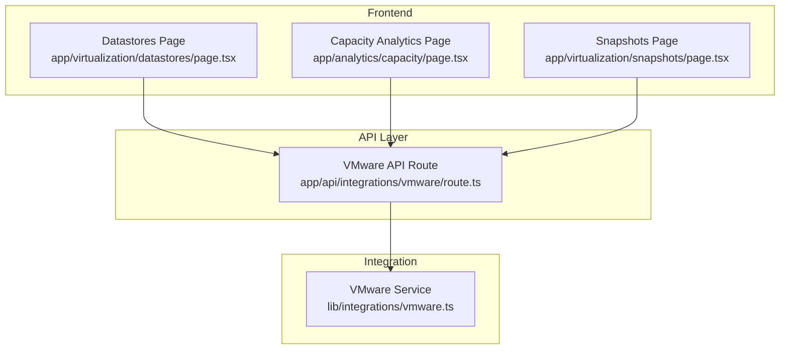
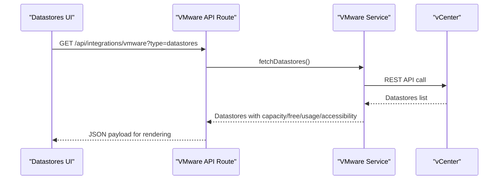
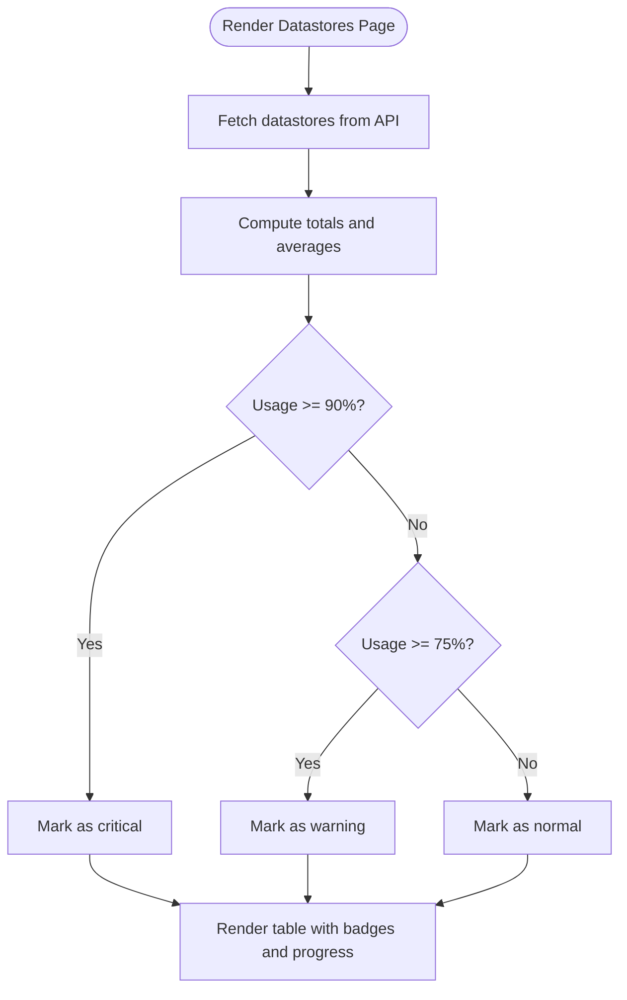
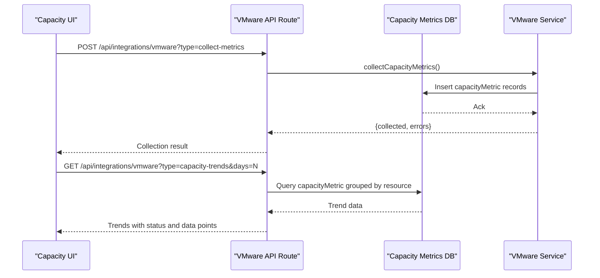
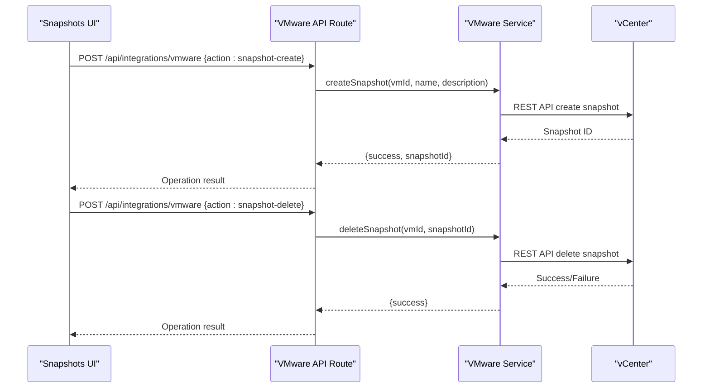
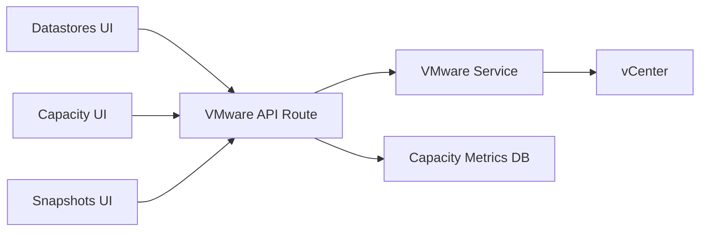

# Datastore Management

<cite>
**Referenced Files in This Document**
- [page.tsx](file://app/virtualization/datastores/page.tsx)
- [route.ts](file://app/api/integrations/vmware/route.ts)
- [vmware.ts](file://lib/integrations/vmware.ts)
- [page.tsx](file://app/analytics/capacity/page.tsx)
- [page.tsx](file://app/virtualization/snapshots/page.tsx)
- [DATASTORE_CRITICAL.md](file://docs/30-runbooks/DATASTORE_CRITICAL.md)
</cite>

## Table of Contents
1. [Introduction](#introduction)
2. [Project Structure](#project-structure)
3. [Core Components](#core-components)
4. [Architecture Overview](#architecture-overview)
5. [Detailed Component Analysis](#detailed-component-analysis)
6. [Dependency Analysis](#dependency-analysis)
7. [Performance Considerations](#performance-considerations)
8. [Troubleshooting Guide](#troubleshooting-guide)
9. [Conclusion](#conclusion)
10. [Appendices](#appendices)

## Introduction
This document explains VMware datastore management and storage virtualization capabilities implemented in the project. It covers datastore capacity monitoring, storage performance tracking, space utilization analysis, storage tier classification, thin/thick provision detection, storage policy enforcement, datastore health indicators, I/O performance metrics, storage bottleneck identification, provisioning and capacity planning, storage optimization, migration operations, snapshot storage management, and backup storage configuration within the virtual environment.

## Project Structure
The datastore management functionality spans three layers:
- Frontend pages for datastore listing, capacity analytics, and snapshot management
- API routes that orchestrate VMware integration and cache behavior
- Integration library that communicates with vCenter and executes storage operations

**Diagram sources**
- [page.tsx:1-376](file://app/virtualization/datastores/page.tsx#L1-L376)
- [route.ts:1-800](file://app/api/integrations/vmware/route.ts#L1-L800)
- [vmware.ts:1-800](file://lib/integrations/vmware.ts#L1-L800)

**Section sources**
- [page.tsx:1-376](file://app/virtualization/datastores/page.tsx#L1-L376)
- [route.ts:1-800](file://app/api/integrations/vmware/route.ts#L1-L800)
- [vmware.ts:1-800](file://lib/integrations/vmware.ts#L1-L800)

## Core Components
- Datastores page: Displays datastore inventory, capacity, free space, usage percentage, accessibility, and supports pagination and CSV export.
- Capacity analytics page: Visualizes capacity trends and growth forecasts derived from stored metrics.
- Snapshots page: Manages VM snapshots, including creation, deletion, and revert operations, with filtering and pagination.
- VMware API route: Provides endpoints for datastores, snapshots, capacity metrics collection, and analytics.
- VMware integration library: Implements vCenter connectivity, datastores retrieval, snapshot operations, and capacity metric collection.

**Section sources**
- [page.tsx:26-112](file://app/virtualization/datastores/page.tsx#L26-L112)
- [page.tsx:17-98](file://app/analytics/capacity/page.tsx#L17-L98)
- [page.tsx:40-166](file://app/virtualization/snapshots/page.tsx#L40-L166)
- [route.ts:187-794](file://app/api/integrations/vmware/route.ts#L187-L794)
- [vmware.ts:108-123](file://lib/integrations/vmware.ts#L108-L123)

## Architecture Overview
The system integrates with VMware vCenter to retrieve datastore and snapshot information, persist capacity metrics for trend analysis, and expose management operations via a REST API consumed by frontend pages.

**Diagram sources**
- [route.ts:616-644](file://app/api/integrations/vmware/route.ts#L616-L644)
- [vmware.ts:748-756](file://lib/integrations/vmware.ts#L748-L756)

## Detailed Component Analysis

### Datastores Page
The Datastores page aggregates datastore metrics and presents them in a tabular format with summary cards and pagination. It computes totals, averages, and thresholds to highlight critical and warning states.

Key behaviors:
- Fetches datastore inventory via the API route
- Computes total capacity, used space, free space, and average usage percentage
- Flags critical (≥90%) and warning (75–90%) usage
- Supports CSV export and manual refresh
- Paginates results for large datasets

**Diagram sources**
- [page.tsx:104-112](file://app/virtualization/datastores/page.tsx#L104-L112)
- [page.tsx:298-310](file://app/virtualization/datastores/page.tsx#L298-L310)

**Section sources**
- [page.tsx:37-68](file://app/virtualization/datastores/page.tsx#L37-L68)
- [page.tsx:104-112](file://app/virtualization/datastores/page.tsx#L104-L112)
- [page.tsx:240-372](file://app/virtualization/datastores/page.tsx#L240-L372)

### Capacity Monitoring and Analytics
The Capacity Analytics page consumes historical metrics to compute trends and growth forecasts. It triggers metric collection and displays aggregated statistics.

Key behaviors:
- Triggers metric collection for CPU, memory, and disk
- Computes recent vs older periods to derive trends
- Applies thresholds to classify status (normal, warning, critical)
- Provides growth forecasts for disk usage

**Diagram sources**
- [page.tsx:34-64](file://app/analytics/capacity/page.tsx#L34-L64)
- [route.ts:726-743](file://app/api/integrations/vmware/route.ts#L726-L743)
- [vmware.ts:2341-2427](file://lib/integrations/vmware.ts#L2341-L2427)

**Section sources**
- [page.tsx:28-98](file://app/analytics/capacity/page.tsx#L28-L98)
- [route.ts:21-71](file://app/api/integrations/vmware/route.ts#L21-L71)
- [route.ts:726-743](file://app/api/integrations/vmware/route.ts#L726-L743)
- [vmware.ts:2341-2427](file://lib/integrations/vmware.ts#L2341-L2427)

### Snapshot Storage Management
The Snapshots page enables lifecycle management of VM snapshots, including creation, deletion, and revert operations. It also surfaces snapshot age and size to identify storage bloat.

Key behaviors:
- Lists snapshots with VM association, creation date, age, and size
- Filters snapshots by name, VM name, or description
- Performs snapshot operations via API with confirmation dialogs
- Highlights old snapshots (>7 days) and very old snapshots (>30 days)

**Diagram sources**
- [page.tsx:167-200](file://app/virtualization/snapshots/page.tsx#L167-L200)
- [page.tsx:201-227](file://app/virtualization/snapshots/page.tsx#L201-L227)
- [vmware.ts:2147-2230](file://lib/integrations/vmware.ts#L2147-L2230)

**Section sources**
- [page.tsx:56-116](file://app/virtualization/snapshots/page.tsx#L56-L116)
- [page.tsx:118-166](file://app/virtualization/snapshots/page.tsx#L118-L166)
- [page.tsx:167-253](file://app/virtualization/snapshots/page.tsx#L167-L253)
- [vmware.ts:2047-2230](file://lib/integrations/vmware.ts#L2047-L2230)

### Storage Tier Classification and Provisioning
- Storage tier classification: The integration retrieves datastore types and capacity metadata. While explicit tier labels are not stored, the datastore type field can be used to infer tiers (e.g., SSD vs HDD) for planning and policy enforcement.
- Thin/thick provision detection: The integration does not currently expose thin/thick provisioning flags. To implement detection, extend the datastore model to include provisioning type and update the API route to surface this attribute.
- Storage policy enforcement: The integration does not currently enforce storage policies. To support policy enforcement, integrate with vCenter Storage Policies APIs to apply and validate policies during datastore provisioning and VM disk creation.

[No sources needed since this section provides implementation guidance]

### Datastore Health Indicators and Bottleneck Identification
- Health indicators: The datastore model includes an accessibility flag to indicate whether the datastore is reachable. Combine this with capacity usage thresholds to flag unhealthy or near-capacity datastores.
- Bottleneck identification: Use capacity trends and growth forecasts to identify rapidly growing datastores. Pair this with snapshot analysis to uncover snapshot-driven growth spikes.

**Section sources**
- [vmware.ts:108-123](file://lib/integrations/vmware.ts#L108-L123)
- [route.ts:414-423](file://app/api/integrations/vmware/route.ts#L414-L423)

### Practical Examples
- Datastore provisioning: Use the VMware API route to trigger provisioning actions and update the UI after a delay to reflect changes.
- Capacity planning: Leverage capacity trends and growth forecasts to project when datastores will reach capacity and plan expansions accordingly.
- Storage optimization: Apply the triage steps from the runbook to identify oversized snapshots and optimize storage usage.

**Section sources**
- [DATASTORE_CRITICAL.md:44-89](file://docs/30-runbooks/DATASTORE_CRITICAL.md#L44-L89)

## Dependency Analysis
The frontend pages depend on the VMware API route, which in turn depends on the VMware integration library. The library interacts with vCenter and persists metrics to the database.

**Diagram sources**
- [page.tsx:44-62](file://app/virtualization/datastores/page.tsx#L44-L62)
- [page.tsx:34-52](file://app/analytics/capacity/page.tsx#L34-L52)
- [page.tsx:88-110](file://app/virtualization/snapshots/page.tsx#L88-L110)
- [route.ts:187-289](file://app/api/integrations/vmware/route.ts#L187-L289)
- [vmware.ts:154-183](file://lib/integrations/vmware.ts#L154-L183)

**Section sources**
- [page.tsx:44-68](file://app/virtualization/datastores/page.tsx#L44-L68)
- [page.tsx:34-58](file://app/analytics/capacity/page.tsx#L34-L58)
- [page.tsx:88-116](file://app/virtualization/snapshots/page.tsx#L88-L116)
- [route.ts:187-289](file://app/api/integrations/vmware/route.ts#L187-L289)
- [vmware.ts:154-183](file://lib/integrations/vmware.ts#L154-L183)

## Performance Considerations
- Caching: The API route implements a cache layer with fresh and stale windows to reduce latency and vCenter load. Datastores and dashboard summaries leverage this caching strategy.
- Batch operations: Snapshot retrieval uses a Python script to batch fetch all snapshots efficiently, reducing repeated REST calls.
- Pagination: Large datasets are paginated to minimize DOM and network overhead.
- Metric collection cadence: Capacity metrics are collected periodically and queried on demand to balance freshness and performance.

**Section sources**
- [route.ts:225-274](file://app/api/integrations/vmware/route.ts#L225-L274)
- [vmware.ts:2047-2097](file://lib/integrations/vmware.ts#L2047-L2097)
- [page.tsx:113-118](file://app/virtualization/datastores/page.tsx#L113-L118)
- [page.tsx:128-135](file://app/virtualization/snapshots/page.tsx#L128-L135)

## Troubleshooting Guide
Common issues and resolutions:
- vCenter connectivity failures: The API route returns an error when authentication fails. The UI displays a clear error and allows retrying.
- Snapshot operations failing: Verify snapshot existence and permissions; the API route handles errors and invalidations caches upon success.
- Capacity metrics missing: Trigger metric collection via the Capacity Analytics page and refresh trends.

**Section sources**
- [route.ts:276-288](file://app/api/integrations/vmware/route.ts#L276-L288)
- [page.tsx:201-227](file://app/virtualization/snapshots/page.tsx#L201-L227)
- [page.tsx:60-64](file://app/analytics/capacity/page.tsx#L60-L64)

## Conclusion
The project provides a robust foundation for VMware datastore management, including capacity monitoring, analytics, snapshot lifecycle management, and operational insights. Extending the integration to include thin/thick provision detection, storage tier classification, and policy enforcement will further enhance storage virtualization governance and automation.

## Appendices
- Runbook guidance for datastore critical situations, including triage and remediation steps.

**Section sources**
- [DATASTORE_CRITICAL.md:44-89](file://docs/30-runbooks/DATASTORE_CRITICAL.md#L44-L89)