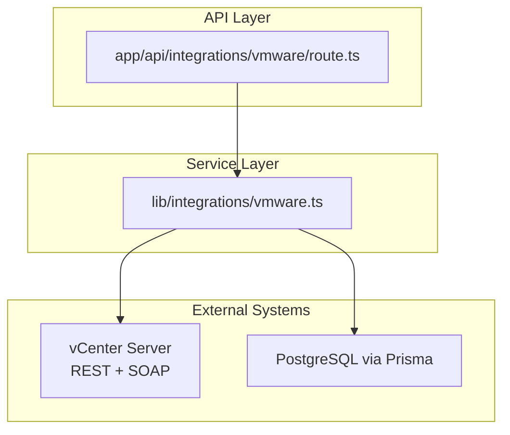
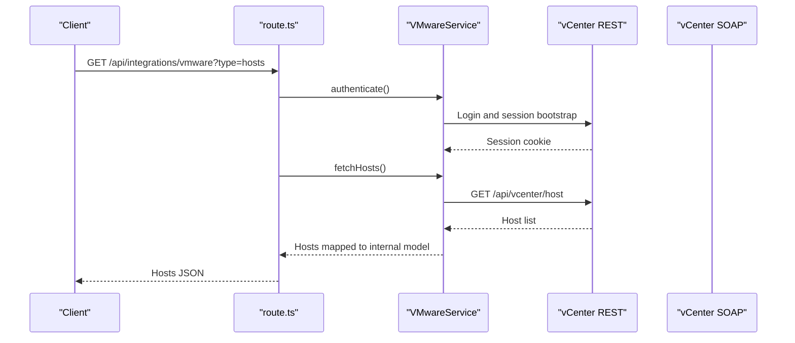
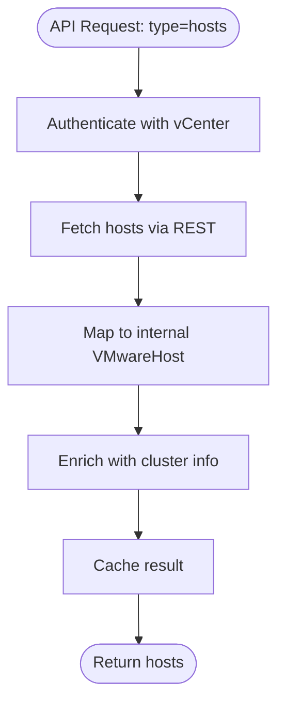
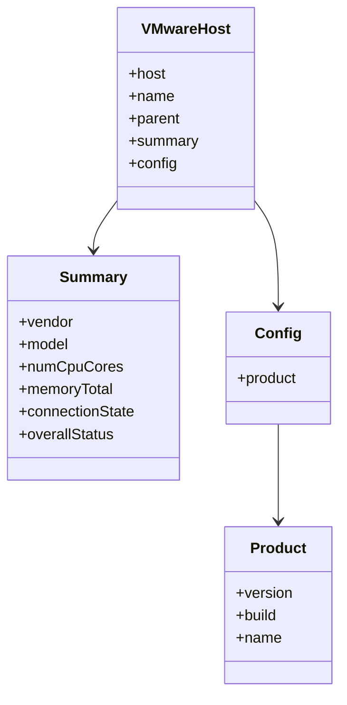
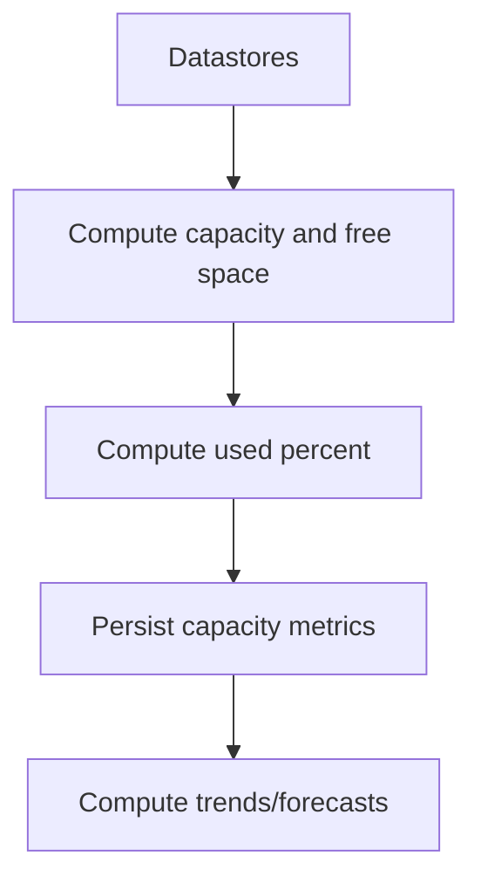
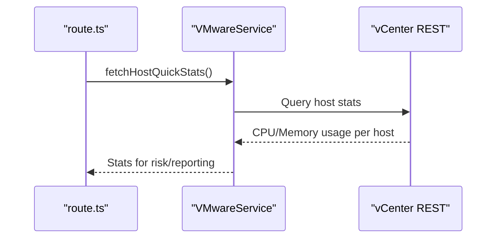
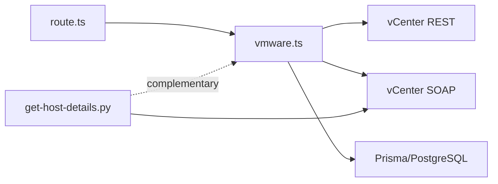

# Host Management

<cite>
**Referenced Files in This Document**
- [route.ts](file://app/api/integrations/vmware/route.ts)
- [vmware.ts](file://lib/integrations/vmware.ts)
- [vmware.md](file://docs/20-modules/integrations/vmware.md)
- [get-host-details.py](file://scripts/get-host-details.py)
- [detection-engine.ts](file://lib/alarms/detection-engine.ts)
- [reports-service.ts](file://lib/reports/reports-service.ts)
</cite>

## Table of Contents
1. [Introduction](#introduction)
2. [Project Structure](#project-structure)
3. [Core Components](#core-components)
4. [Architecture Overview](#architecture-overview)
5. [Detailed Component Analysis](#detailed-component-analysis)
6. [Dependency Analysis](#dependency-analysis)
7. [Performance Considerations](#performance-considerations)
8. [Troubleshooting Guide](#troubleshooting-guide)
9. [Conclusion](#conclusion)

## Introduction
This document explains VMware ESXi host management capabilities implemented in the project. It focuses on host inventory tracking, hardware resource monitoring, firmware version management, host health status, storage connectivity, and network adapter configuration. It also covers CPU utilization, memory allocation, and storage performance metrics for individual hosts, along with practical examples for provisioning, maintenance operations, hardware failure detection, upgrades, patch management, and performance tuning recommendations.

## Project Structure
The VMware integration spans a small API surface that delegates to a robust service layer. The API routes expose endpoints for retrieving inventory (hosts, clusters, VMs, datastores), dashboard summaries, and operational helpers (sync, metrics collection, event testing). The service layer handles authentication, data retrieval, mapping, and persistence-related tasks.

**Diagram sources**
- [route.ts:187-800](file://app/api/integrations/vmware/route.ts#L187-L800)
- [vmware.ts:154-743](file://lib/integrations/vmware.ts#L154-L743)

**Section sources**
- [route.ts:187-800](file://app/api/integrations/vmware/route.ts#L187-L800)
- [vmware.ts:154-743](file://lib/integrations/vmware.ts#L154-L743)

## Core Components
- API routes: Provide endpoints for configuration, dashboard, inventory queries, sync, metrics, and event testing.
- VMwareService: Implements authentication, REST/SOAP integration, data retrieval, and mapping to internal models.
- Inventory mapping: Converts vCenter data into normalized structures for hosts, VMs, clusters, and datastores.
- Metrics and forecasting: Collects capacity metrics and computes trends/forecasts for storage resources.
- Event integration: Uses SOAP EventHistoryCollector to capture lifecycle and snapshot events.

**Section sources**
- [route.ts:187-800](file://app/api/integrations/vmware/route.ts#L187-L800)
- [vmware.ts:154-743](file://lib/integrations/vmware.ts#L154-L743)
- [vmware.md:1-133](file://docs/20-modules/integrations/vmware.md#L1-L133)

## Architecture Overview
The system integrates with vCenter using both REST and SOAP APIs concurrently. REST is used for inventory and lightweight operations; SOAP is used for event history and advanced operations where REST lacks coverage.

**Diagram sources**
- [route.ts:552-587](file://app/api/integrations/vmware/route.ts#L552-L587)
- [vmware.ts:694-743](file://lib/integrations/vmware.ts#L694-L743)
- [vmware.md:10-29](file://docs/20-modules/integrations/vmware.md#L10-L29)

## Detailed Component Analysis

### Host Inventory Tracking
- Retrieval: The API exposes a dedicated endpoint to fetch all ESXi hosts, returning identifiers, names, cluster membership, vendor/model, CPU cores, memory, firmware version/build, connection state, and overall status.
- Mapping: Hosts are mapped to an internal interface that includes summary and config blocks, enabling downstream consumption and persistence.
- Cluster association: Hosts are associated with clusters via parent references; standalone hosts are labeled accordingly.

**Diagram sources**
- [route.ts:552-587](file://app/api/integrations/vmware/route.ts#L552-L587)
- [vmware.ts:56-79](file://lib/integrations/vmware.ts#L56-L79)

**Section sources**
- [route.ts:552-587](file://app/api/integrations/vmware/route.ts#L552-L587)
- [vmware.ts:56-79](file://lib/integrations/vmware.ts#L56-L79)

### Hardware Resource Monitoring
- CPU and memory totals: Hosts expose CPU core counts and total memory bytes in the summary block.
- Firmware version and build: Firmware metadata is exposed via the config product block.
- Quick stats: The service includes a method to fetch per-host CPU and memory usage statistics, enabling utilization calculations.

**Diagram sources**
- [vmware.ts:56-79](file://lib/integrations/vmware.ts#L56-L79)
- [vmware.ts:978-1002](file://lib/integrations/vmware.ts#L978-L1002)

**Section sources**
- [vmware.ts:978-1002](file://lib/integrations/vmware.ts#L978-L1002)
- [vmware.ts:1353-1388](file://lib/integrations/vmware.ts#L1353-L1388)

### Firmware Version Management
- Firmware metadata: The host config includes version, build, and product name, enabling tracking of ESXi versions across the fleet.
- Upgrade readiness: Use the firmware version/build to compare against supported baselines and plan upgrades.

**Section sources**
- [vmware.ts:978-1002](file://lib/integrations/vmware.ts#L978-L1002)

### Host Health Status
- Connection state: Exposed as part of the host summary; used to compute online/offline counts.
- Overall status: Mapped to internal criticality levels for downstream risk assessment and reporting.

**Section sources**
- [route.ts:392-406](file://app/api/integrations/vmware/route.ts#L392-L406)
- [vmware.ts:1544-1563](file://lib/integrations/vmware.ts#L1544-L1563)

### Storage Connectivity
- Datastores: The API exposes datastore capacity, free space, and computed usage percentages.
- Storage performance metrics: Capacity metrics are collected and persisted for trending and forecasting.

**Diagram sources**
- [route.ts:616-644](file://app/api/integrations/vmware/route.ts#L616-L644)
- [vmware.ts:2393-2427](file://lib/integrations/vmware.ts#L2393-L2427)

**Section sources**
- [route.ts:616-644](file://app/api/integrations/vmware/route.ts#L616-L644)
- [vmware.ts:2393-2427](file://lib/integrations/vmware.ts#L2393-L2427)

### Network Adapter Configuration
- Network adapters: The host config includes a network block that can carry vnic/portgroup information for adapter mapping.
- Practical note: The current REST surface does not expose detailed NIC configuration; SOAP-based discovery is available for deeper hardware introspection.

**Section sources**
- [vmware.ts:56-79](file://lib/integrations/vmware.ts#L56-L79)

### CPU Utilization, Memory Allocation, and Storage Metrics
- CPU/memory usage: Per-host quick stats are available and used for cluster-level risk checks and reporting.
- Storage metrics: Disk usage percent is computed and persisted for capacity planning and forecasting.

**Diagram sources**
- [vmware.ts:1353-1388](file://lib/integrations/vmware.ts#L1353-L1388)
- [detection-engine.ts:1775-1832](file://lib/alarms/detection-engine.ts#L1775-L1832)
- [reports-service.ts:259-293](file://lib/reports/reports-service.ts#L259-L293)

**Section sources**
- [vmware.ts:1353-1388](file://lib/integrations/vmware.ts#L1353-L1388)
- [detection-engine.ts:1775-1832](file://lib/alarms/detection-engine.ts#L1775-L1832)
- [reports-service.ts:259-293](file://lib/reports/reports-service.ts#L259-L293)

### Practical Examples

#### Host Provisioning
- Use the hosts endpoint to discover new hosts and correlate with cluster membership.
- Combine with VM placement insights to ensure balanced distribution across hosts.

**Section sources**
- [route.ts:552-587](file://app/api/integrations/vmware/route.ts#L552-L587)

#### Maintenance Operations
- Identify hosts in maintenance mode and offline states via connection state and maintenance mode flags.
- Plan maintenance windows around low utilization periods using quick stats.

**Section sources**
- [vmware.ts:1353-1388](file://lib/integrations/vmware.ts#L1353-L1388)

#### Hardware Failure Detection
- Monitor host connection state and overall status to detect failures.
- Use event integration to capture host-related events (e.g., HA events) and correlate with quick stats.

**Section sources**
- [vmware.ts:1353-1388](file://lib/integrations/vmware.ts#L1353-L1388)
- [detection-engine.ts:1775-1832](file://lib/alarms/detection-engine.ts#L1775-L1832)

#### Host Upgrade Procedures and Patch Management
- Track firmware versions and builds to identify hosts requiring updates.
- Use the integration’s configuration endpoint to verify vCenter reachability and credentials before initiating upgrade-related tasks.

**Section sources**
- [route.ts:668-696](file://app/api/integrations/vmware/route.ts#L668-L696)
- [vmware.ts:978-1002](file://lib/integrations/vmware.ts#L978-L1002)

#### Performance Tuning Recommendations
- Use per-host CPU/memory usage to identify hotspots and rebalance workloads.
- Apply capacity trends and forecasts to right-size storage and plan growth.

**Section sources**
- [vmware.ts:1353-1388](file://lib/integrations/vmware.ts#L1353-L1388)
- [route.ts:726-744](file://app/api/integrations/vmware/route.ts#L726-L744)

## Dependency Analysis
The API routes depend on the VMwareService for authentication and data retrieval. The service depends on vCenter REST/SOAP endpoints and persists data via Prisma. The host details script complements the service by extracting hardware details unavailable through REST.

**Diagram sources**
- [route.ts:187-800](file://app/api/integrations/vmware/route.ts#L187-L800)
- [vmware.ts:154-743](file://lib/integrations/vmware.ts#L154-L743)
- [get-host-details.py:1-69](file://scripts/get-host-details.py#L1-L69)

**Section sources**
- [route.ts:187-800](file://app/api/integrations/vmware/route.ts#L187-L800)
- [vmware.ts:154-743](file://lib/integrations/vmware.ts#L154-L743)
- [get-host-details.py:1-69](file://scripts/get-host-details.py#L1-L69)

## Performance Considerations
- Caching: The API implements a cache layer with fresh/stale windows and background revalidation to reduce latency and load on vCenter.
- Parallelism: Bulk operations (e.g., dashboard) fetch multiple resources concurrently to minimize round trips.
- Trending and forecasting: Capacity metrics are persisted and processed to avoid repeated heavy computations.

**Section sources**
- [route.ts:225-275](file://app/api/integrations/vmware/route.ts#L225-L275)
- [route.ts:324-440](file://app/api/integrations/vmware/route.ts#L324-L440)
- [vmware.ts:2393-2427](file://lib/integrations/vmware.ts#L2393-L2427)

## Troubleshooting Guide
- Authentication failures: The service attempts both modern and legacy REST endpoints; if both fail, the API returns an authentication error.
- SOAP session issues: SOAP operations require a valid session cookie; the service re-authenticates automatically when needed.
- Network timeouts: The integration logs and surfaces errors; ensure vCenter is reachable and credentials are correct.
- Event availability: Event history requires SOAP; if unavailable, lifecycle and snapshot event detection is limited.

**Section sources**
- [vmware.ts:694-743](file://lib/integrations/vmware.ts#L694-L743)
- [vmware.ts:168-215](file://lib/integrations/vmware.ts#L168-L215)
- [vmware.md:119-127](file://docs/20-modules/integrations/vmware.md#L119-L127)

## Conclusion
The integration provides a comprehensive foundation for ESXi host management: inventory tracking, health monitoring, firmware visibility, storage metrics, and event-driven insights. While REST covers most scenarios, SOAP enables advanced operations and event history. The API and service layers support caching, parallelism, and persistence, enabling scalable dashboards and reporting. For deep hardware introspection (e.g., NICs), the included script demonstrates a complementary SOAP-based approach.