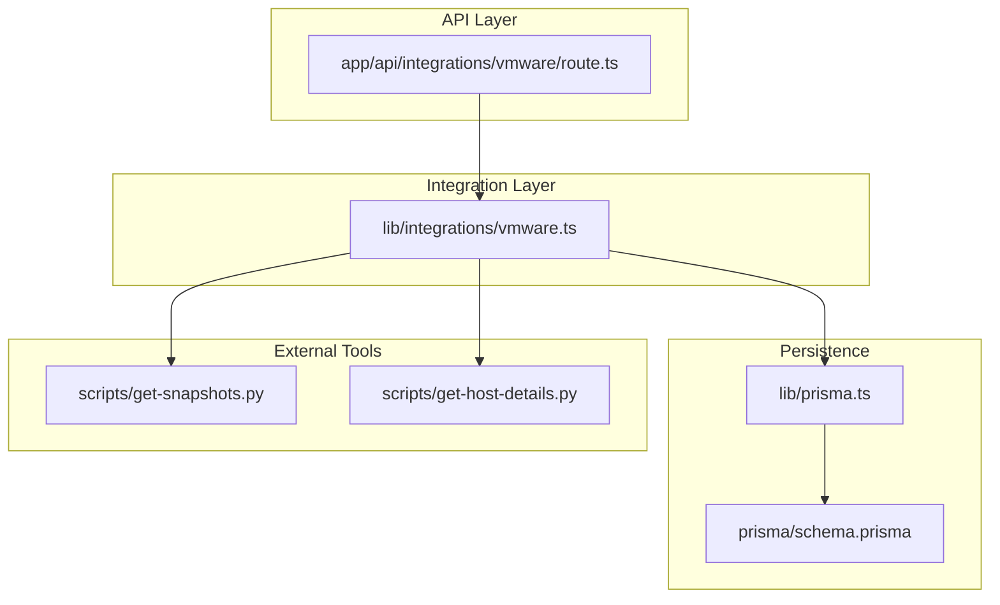
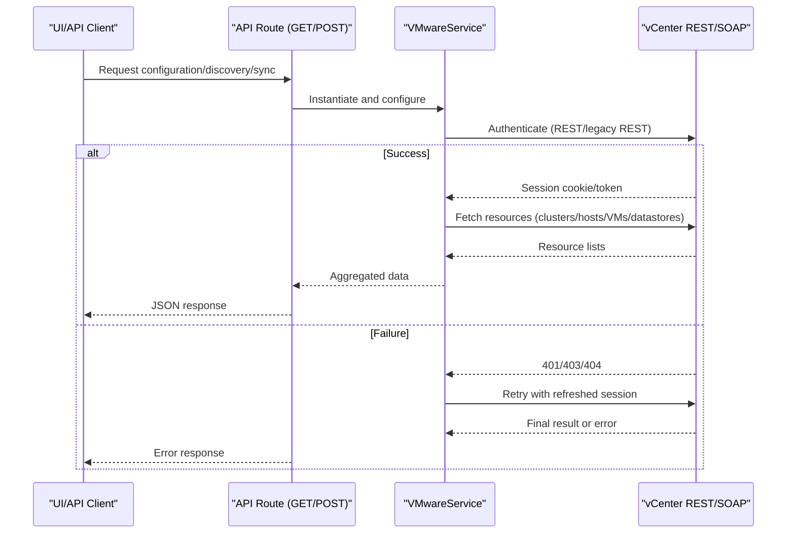
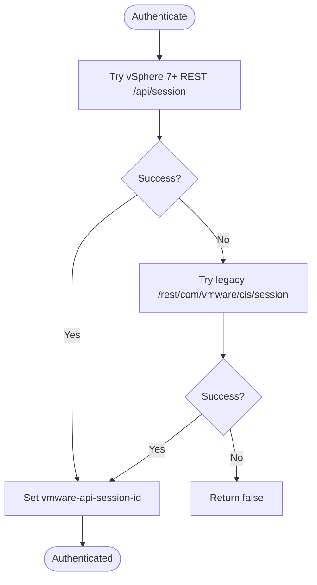
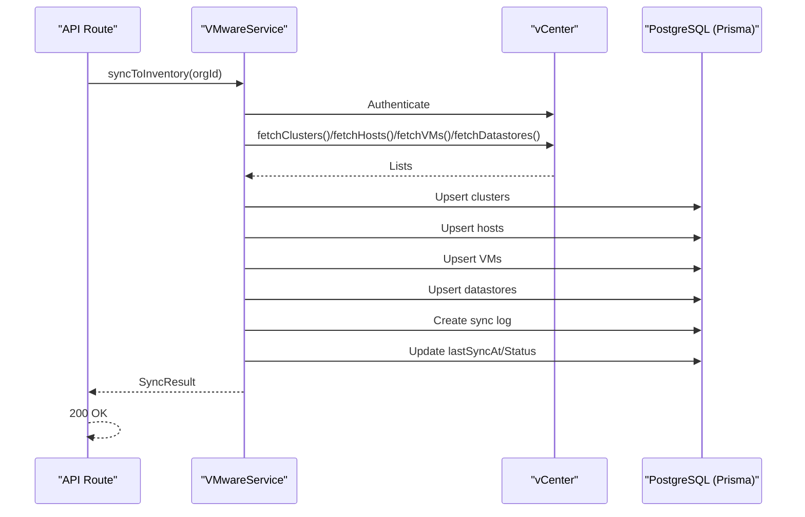
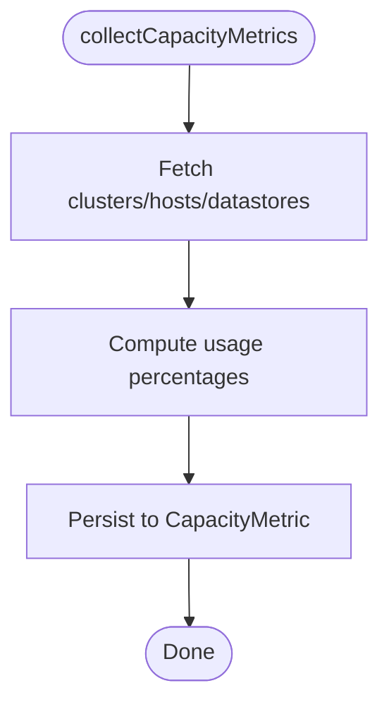
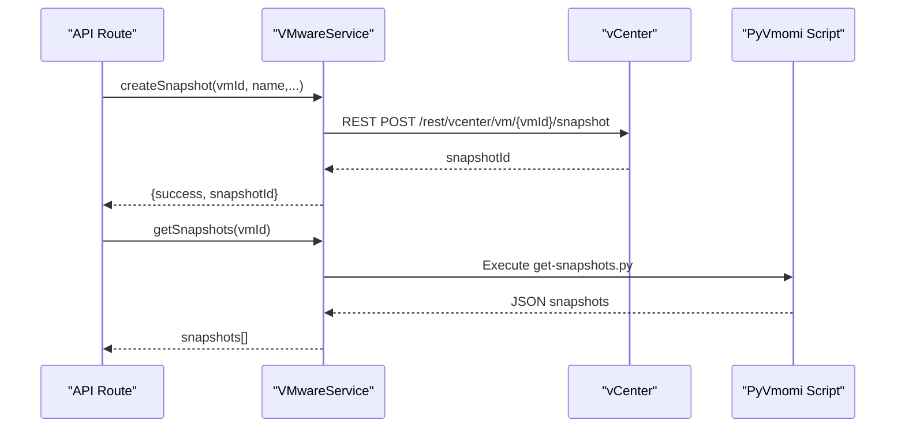
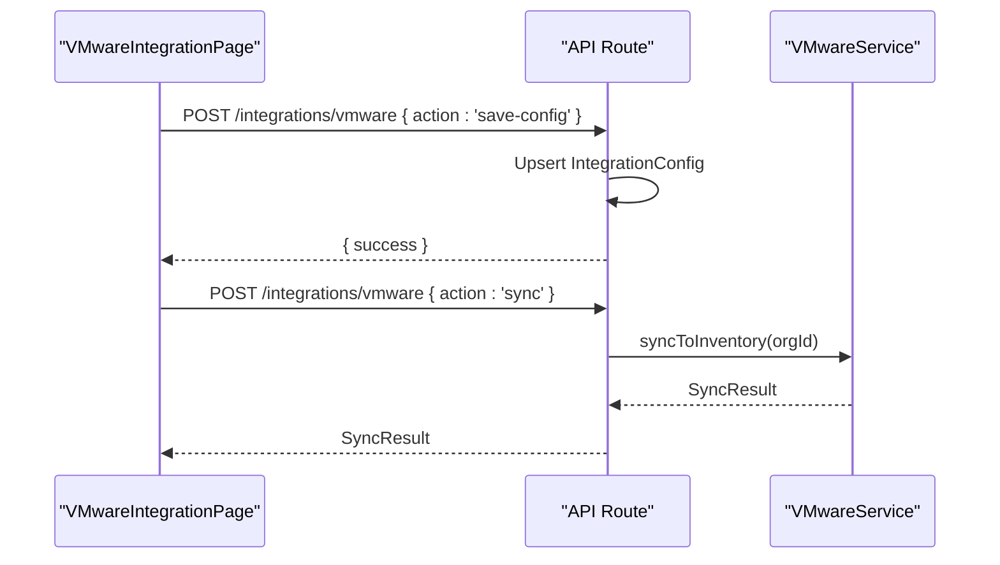
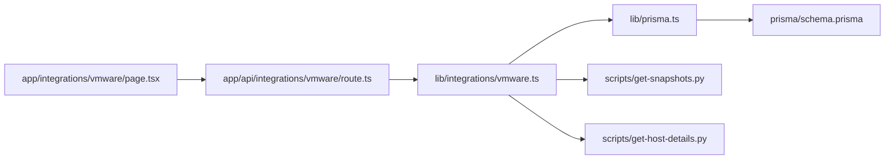

# VMware Integration

<cite>
**Referenced Files in This Document**
- [route.ts](file://app/api/integrations/vmware/route.ts)
- [vmware.ts](file://lib/integrations/vmware.ts)
- [page.tsx](file://app/integrations/vmware/page.tsx)
- [schema.prisma](file://prisma/schema.prisma)
- [prisma.ts](file://lib/prisma.ts)
- [get-snapshots.py](file://scripts/get-snapshots.py)
- [test-vmware-events.js](file://scripts/test-vmware-events.js)
- [get-host-details.py](file://scripts/get-host-details.py)
</cite>

## Table of Contents
1. [Introduction](#introduction)
2. [Project Structure](#project-structure)
3. [Core Components](#core-components)
4. [Architecture Overview](#architecture-overview)
5. [Detailed Component Analysis](#detailed-component-analysis)
6. [Dependency Analysis](#dependency-analysis)
7. [Performance Considerations](#performance-considerations)
8. [Troubleshooting Guide](#troubleshooting-guide)
9. [Conclusion](#conclusion)
10. [Appendices](#appendices)

## Introduction
This document explains the VMware vCenter integration and API connectivity implementation. It covers integration architecture, authentication mechanisms, data synchronization, virtual infrastructure discovery, automated inventory updates, real-time status monitoring, configuration requirements, credential management, network prerequisites, and practical examples. It also addresses performance optimization, connection reliability, and error handling strategies.

## Project Structure
The VMware integration spans three layers:
- API surface: Next.js route handlers that expose endpoints for configuration, discovery, sync, and control.
- Integration service: A TypeScript service encapsulating VMware SDK usage, session management, and data mapping.
- Persistence: Prisma models and database schema for storing integration configuration, sync logs, and synchronized inventory.

**Diagram sources**
- [route.ts:187-800](file://app/api/integrations/vmware/route.ts#L187-L800)
- [vmware.ts:154-2431](file://lib/integrations/vmware.ts#L154-L2431)
- [schema.prisma:764-801](file://prisma/schema.prisma#L764-L801)
- [prisma.ts:1-20](file://lib/prisma.ts#L1-L20)
- [get-snapshots.py:1-96](file://scripts/get-snapshots.py#L1-L96)
- [get-host-details.py](file://scripts/get-host-details.py)

**Section sources**
- [route.ts:1-1072](file://app/api/integrations/vmware/route.ts#L1-L1072)
- [vmware.ts:1-2431](file://lib/integrations/vmware.ts#L1-L2431)
- [schema.prisma:1-801](file://prisma/schema.prisma#L1-L801)
- [prisma.ts:1-20](file://lib/prisma.ts#L1-L20)

## Core Components
- VMwareService: Central integration class handling authentication, API requests, SOAP-based event queries, inventory sync, and snapshot management.
- API routes: Expose endpoints for configuration retrieval, discovery, sync, power control, snapshot management, and testing.
- UI page: Provides configuration UI, connection testing, module toggles, and manual sync.
- Prisma models: Store integration configuration, sync logs, VMware clusters/datastores, and capacity metrics.

Key responsibilities:
- Authentication: REST and legacy REST session creation, SOAP session creation, and automatic session refresh on 401.
- Discovery: Fetch datacenters, clusters, hosts, VMs, datastores, and snapshots.
- Inventory sync: Upsert clusters, hosts, VMs, and datastores into the database.
- Monitoring: Capacity metrics collection and trend analysis.
- Control: Power operations and snapshot lifecycle management.

**Section sources**
- [vmware.ts:154-2431](file://lib/integrations/vmware.ts#L154-L2431)
- [route.ts:187-1072](file://app/api/integrations/vmware/route.ts#L187-L1072)
- [page.tsx:53-599](file://app/integrations/vmware/page.tsx#L53-L599)
- [schema.prisma:669-712](file://prisma/schema.prisma#L669-L712)

## Architecture Overview
The integration uses dual API strategies:
- REST API (preferred): vSphere 7+ REST API endpoints with vmware-api-session-id header.
- Legacy REST API: vCenter 6.5–6.7 CIS session endpoint.
- SOAP API: EventManager and property queries for advanced capabilities like host quick stats and event history.

**Diagram sources**
- [route.ts:187-800](file://app/api/integrations/vmware/route.ts#L187-L800)
- [vmware.ts:631-743](file://lib/integrations/vmware.ts#L631-L743)

**Section sources**
- [route.ts:187-800](file://app/api/integrations/vmware/route.ts#L187-L800)
- [vmware.ts:631-743](file://lib/integrations/vmware.ts#L631-L743)

## Detailed Component Analysis

### VMwareService: Authentication and Session Management
- REST authentication attempts vSphere 7+ endpoint first, falls back to legacy CIS session endpoint.
- SOAP authentication creates vmware_soap_session cookie for advanced operations.
- Automatic session refresh on 401 Unauthorized for REST requests.
- Environment variable disables TLS verification for self-signed certificates.

**Diagram sources**
- [vmware.ts:694-743](file://lib/integrations/vmware.ts#L694-L743)

**Section sources**
- [vmware.ts:694-743](file://lib/integrations/vmware.ts#L694-L743)

### Discovery and Inventory Sync
- Discovery endpoints: datacenters, clusters, hosts, VMs, datastores, snapshots.
- Sync pipeline: authenticate → fetch → upsert clusters → upsert hosts → upsert VMs → upsert datastores → record sync log → update last sync metadata.
- Host details: REST API provides limited info; Python/PyVmomi script augments with vendor/model/CPU/RAM/ESXi version.

**Diagram sources**
- [route.ts:837-916](file://app/api/integrations/vmware/route.ts#L837-L916)
- [vmware.ts:1568-1784](file://lib/integrations/vmware.ts#L1568-L1784)

**Section sources**
- [route.ts:837-916](file://app/api/integrations/vmware/route.ts#L837-L916)
- [vmware.ts:909-1002](file://lib/integrations/vmware.ts#L909-L1002)
- [vmware.ts:1568-1784](file://lib/integrations/vmware.ts#L1568-L1784)

### Real-Time Status Monitoring and Capacity Metrics
- Capacity metrics collection: compute CPU/memory/disk usage percentages for clusters, hosts, and datastores; persist to CapacityMetric table.
- Trend analysis and growth forecasting endpoints leverage stored metrics for insights.
- Host quick stats via SOAP property queries for CPU/memory usage.

**Diagram sources**
- [vmware.ts:2341-2427](file://lib/integrations/vmware.ts#L2341-L2427)

**Section sources**
- [vmware.ts:2341-2427](file://lib/integrations/vmware.ts#L2341-L2427)
- [schema.prisma:714-727](file://prisma/schema.prisma#L714-L727)

### Snapshot Management and VM Lifecycle Events
- Snapshot management: batch snapshot enumeration via PyVmomi script, create/delete/revert snapshots.
- VM lifecycle events: SOAP EventManager for created/deleted/powered-on/powered-off/restarted events; filters backup/service accounts.
- Power operations: graceful shutdown via guest operation, hard stop, suspend, reset.

**Diagram sources**
- [route.ts:1014-1061](file://app/api/integrations/vmware/route.ts#L1014-L1061)
- [vmware.ts:2147-2230](file://lib/integrations/vmware.ts#L2147-L2230)
- [get-snapshots.py:1-96](file://scripts/get-snapshots.py#L1-L96)

**Section sources**
- [route.ts:1014-1061](file://app/api/integrations/vmware/route.ts#L1014-L1061)
- [vmware.ts:1017-1140](file://lib/integrations/vmware.ts#L1017-L1140)
- [vmware.ts:2047-2230](file://lib/integrations/vmware.ts#L2047-L2230)
- [get-snapshots.py:1-96](file://scripts/get-snapshots.py#L1-L96)

### API Surface and UI Integration
- API endpoints: GET /integrations/vmware?type=(config|dashboard|summary|vms|hosts|clusters|datastores|snapshots|status|sprawl|collect-metrics|capacity-trends|growth-forecast|test-events-api|test-soap-events), POST /integrations/vmware (action: test|sync|save-config|vm-power|snapshot-create|snapshot-delete|snapshot-revert).
- UI page: Config tab (host, username, password, thumbprint, polling interval, module toggles), Sync tab (counts and errors), Modules tab (enable/disable modules).

**Diagram sources**
- [page.tsx:173-225](file://app/integrations/vmware/page.tsx#L173-L225)
- [route.ts:837-916](file://app/api/integrations/vmware/route.ts#L837-L916)

**Section sources**
- [route.ts:1-1072](file://app/api/integrations/vmware/route.ts#L1-L1072)
- [page.tsx:53-599](file://app/integrations/vmware/page.tsx#L53-L599)

## Dependency Analysis
- Internal dependencies: API routes depend on VMwareService; VMwareService depends on Prisma client; UI page consumes API endpoints.
- External dependencies: vCenter REST/SOAP APIs; PyVmomi-based scripts for snapshots and host details.
- Database schema: IntegrationConfig, IntegrationSyncLog, VMwareCluster, VMwareDatastore, CapacityMetric.

**Diagram sources**
- [page.tsx:53-599](file://app/integrations/vmware/page.tsx#L53-L599)
- [route.ts:1-1072](file://app/api/integrations/vmware/route.ts#L1-L1072)
- [vmware.ts:1-2431](file://lib/integrations/vmware.ts#L1-L2431)
- [prisma.ts:1-20](file://lib/prisma.ts#L1-L20)
- [schema.prisma:764-801](file://prisma/schema.prisma#L764-L801)
- [get-snapshots.py:1-96](file://scripts/get-snapshots.py#L1-L96)
- [get-host-details.py](file://scripts/get-host-details.py)

**Section sources**
- [route.ts:1-1072](file://app/api/integrations/vmware/route.ts#L1-L1072)
- [vmware.ts:1-2431](file://lib/integrations/vmware.ts#L1-L2431)
- [schema.prisma:764-801](file://prisma/schema.prisma#L764-L801)
- [prisma.ts:1-20](file://lib/prisma.ts#L1-L20)

## Performance Considerations
- Caching: In-process cache with TTL and stale-while-revalidate for dashboard and discovery endpoints to reduce API load.
- Parallelization: Concurrent discovery of VMs, hosts, clusters, and datastores.
- Batch operations: Snapshot enumeration via PyVmomi script to avoid per-VM REST calls.
- Efficient mapping: Build VM-to-host mapping by querying hosts and collecting VMs per host.
- Capacity metrics sampling: Periodic collection to historical trend analysis.

Recommendations:
- Tune pollingInterval to balance freshness and API load.
- Monitor cache hit ratio and adjust TTLs based on change frequency.
- Use module toggles to limit discovery scope during initial setup.

**Section sources**
- [route.ts:225-268](file://app/api/integrations/vmware/route.ts#L225-L268)
- [vmware.ts:1438-1508](file://lib/integrations/vmware.ts#L1438-L1508)
- [vmware.ts:2047-2097](file://lib/integrations/vmware.ts#L2047-L2097)

## Troubleshooting Guide
Common issues and resolutions:
- Authentication failures:
  - Verify vCenter host, username, and password.
  - Check certificate thumbprint if using strict TLS.
  - Use test connection endpoint to validate.
- Self-signed certificates:
  - Environment variable disables TLS verification; ensure network allows outbound HTTPS to vCenter.
- REST vs SOAP availability:
  - REST endpoints preferred; SOAP used for advanced features like host quick stats and event history.
- Snapshot visibility:
  - Some vSphere versions lack REST snapshots; rely on PyVmomi script.
- Power operations:
  - Graceful shutdown requires VMware Tools; otherwise hard stop is used.
- UI sync errors:
  - Review sync logs and error details persisted in IntegrationSyncLog.

Diagnostic utilities:
- Test script for snapshot event detection and alarm checks.
- SOAP event testing endpoint to probe event availability and types.

**Section sources**
- [route.ts:804-1072](file://app/api/integrations/vmware/route.ts#L804-L1072)
- [vmware.ts:694-743](file://lib/integrations/vmware.ts#L694-L743)
- [vmware.ts:1017-1140](file://lib/integrations/vmware.ts#L1017-L1140)
- [test-vmware-events.js:1-73](file://scripts/test-vmware-events.js#L1-L73)

## Conclusion
The VMware integration provides robust REST and SOAP connectivity, comprehensive discovery and sync, real-time monitoring via capacity metrics, and practical VM control and snapshot management. The modular design, caching, and batch operations deliver performance and reliability for production environments.

## Appendices

### Configuration Requirements
- vCenter host: Accepts host or IP; protocol prefix is stripped.
- Credentials: Username and password; thumbprint optional.
- Polling interval: Minutes between sync cycles.
- Enabled modules: Toggle discovery of datacenters, clusters, hosts, VMs, datastores.

**Section sources**
- [page.tsx:25-67](file://app/integrations/vmware/page.tsx#L25-L67)
- [route.ts:918-974](file://app/api/integrations/vmware/route.ts#L918-L974)

### Credential Management
- Stored in IntegrationConfig.config as JSON; password field masked in UI.
- On save, empty passwords preserve existing stored value for security.

**Section sources**
- [route.ts:918-974](file://app/api/integrations/vmware/route.ts#L918-L974)
- [schema.prisma:764-781](file://prisma/schema.prisma#L764-L781)

### Network Connectivity Prerequisites
- Outbound HTTPS to vCenter REST/SOAP endpoints.
- Optional outbound to PyVmomi scripts for snapshots and host details.
- Access to vCenter API ports (typically 443).

**Section sources**
- [vmware.ts:631-689](file://lib/integrations/vmware.ts#L631-L689)
- [get-snapshots.py:1-96](file://scripts/get-snapshots.py#L1-L96)

### Practical Examples

- Connection setup:
  - Fill vCenter host, username, password, optional thumbprint.
  - Click Test Connection; review status badge.
  - Save configuration; then run manual sync.

- API authentication:
  - REST: vmware-api-session-id header after successful authentication.
  - Legacy REST: vmware-use-header-authn header.

- Integration troubleshooting:
  - Use test endpoints for events and SOAP.
  - Inspect IntegrationSyncLog for detailed errors.

**Section sources**
- [page.tsx:157-225](file://app/integrations/vmware/page.tsx#L157-L225)
- [route.ts:745-790](file://app/api/integrations/vmware/route.ts#L745-L790)
- [vmware.ts:631-743](file://lib/integrations/vmware.ts#L631-L743)