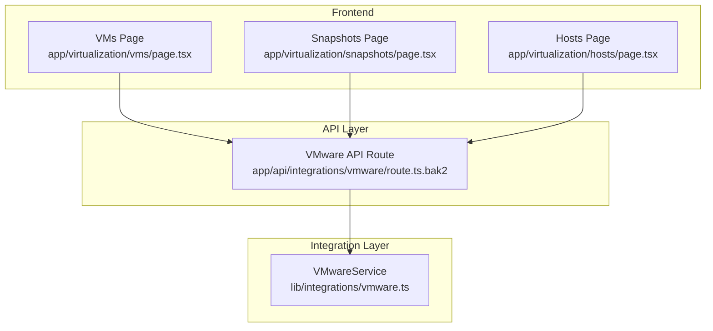
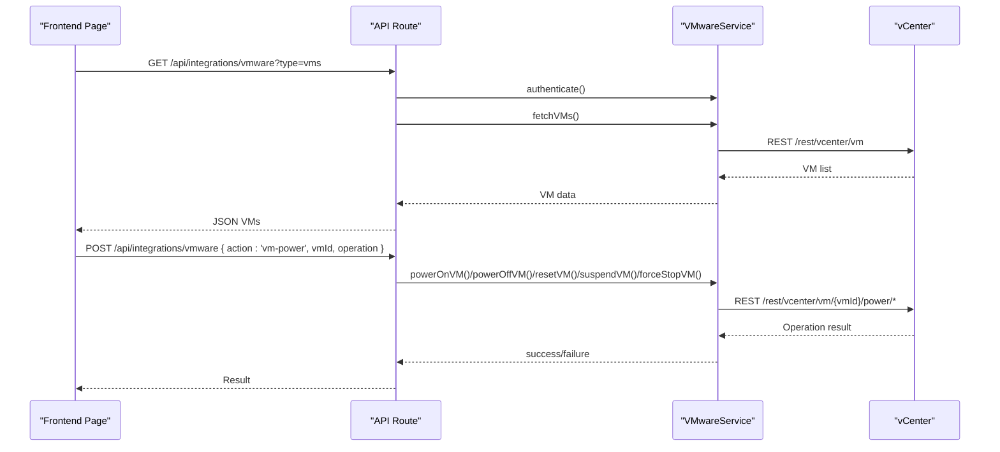
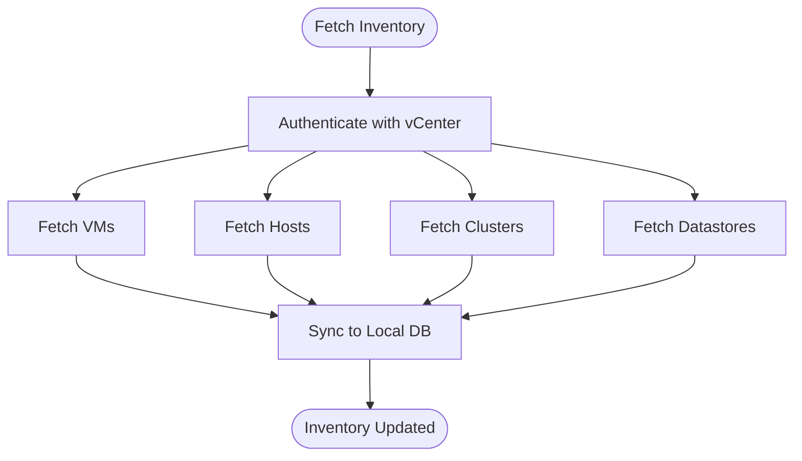
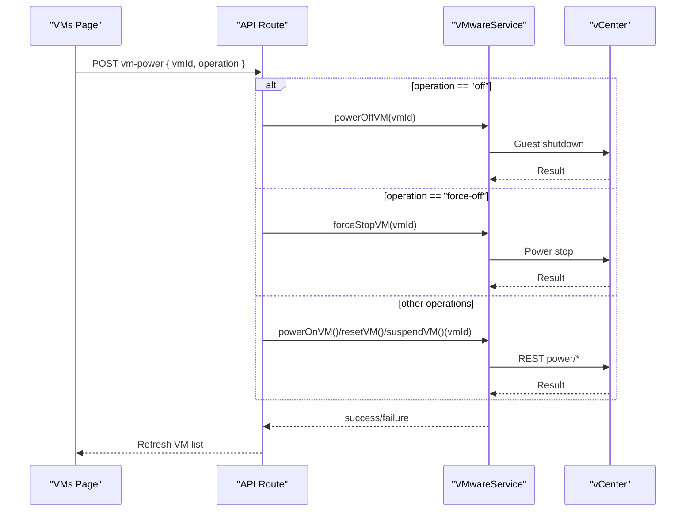
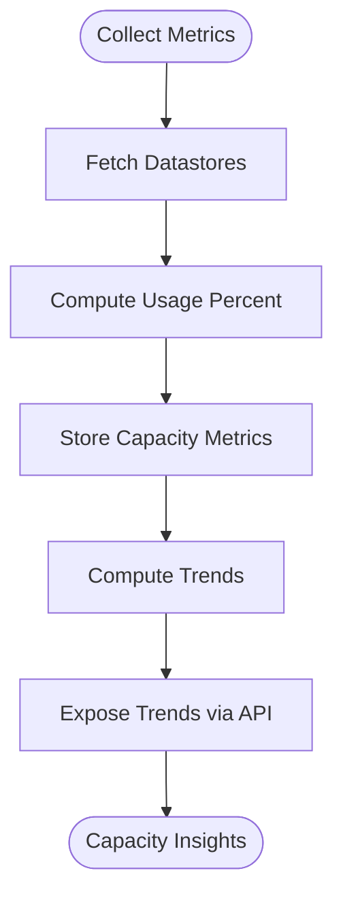
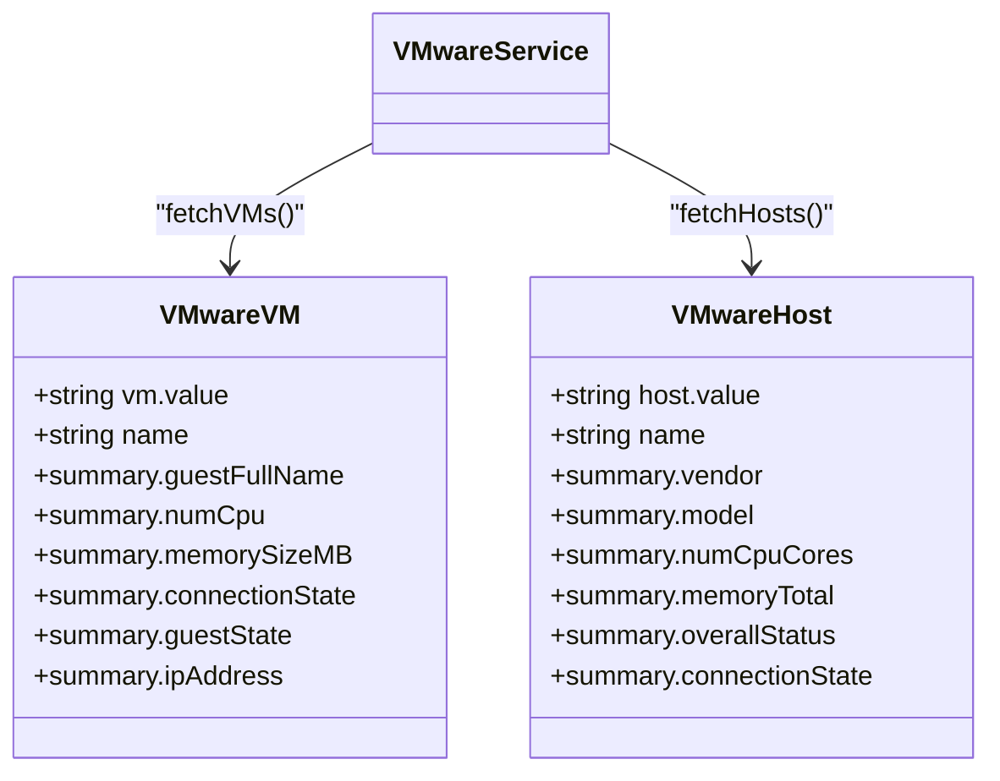
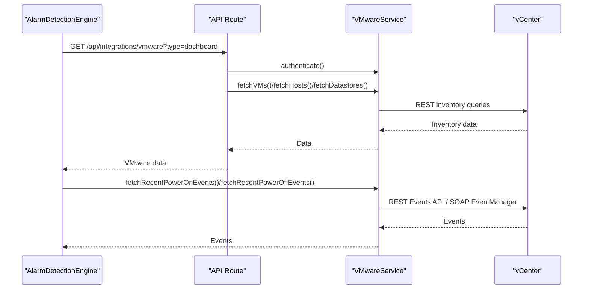
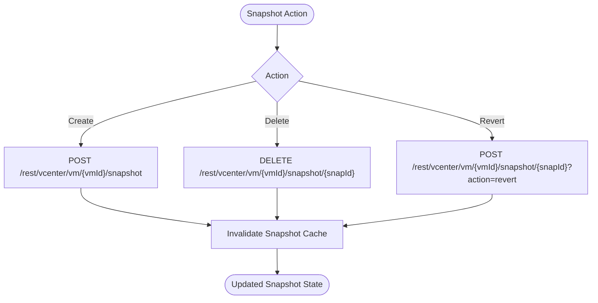
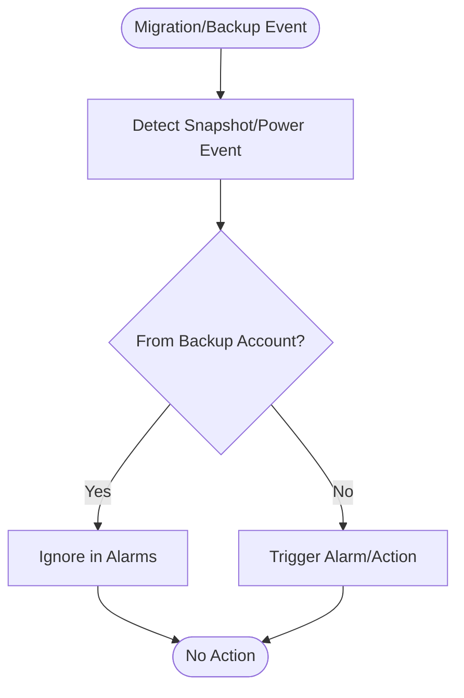
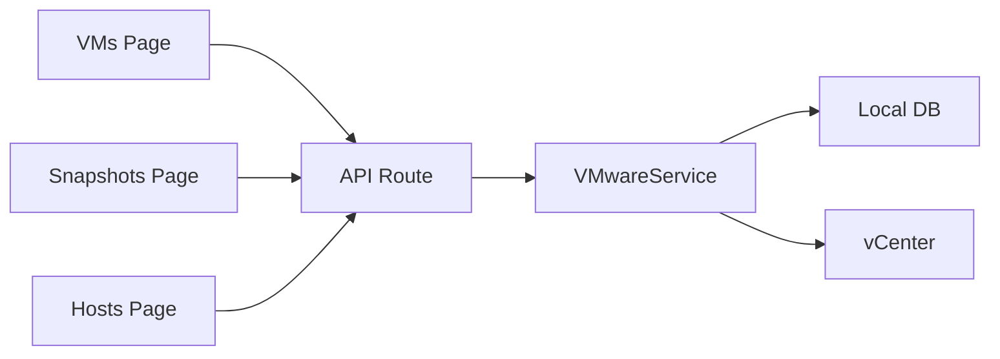

# Virtual Machine Management

<cite>
**Referenced Files in This Document**
- [vmware.ts](file://lib/integrations/vmware.ts)
- [route.ts.bak2](file://app/api/integrations/vmware/route.ts.bak2)
- [page.tsx](file://app/virtualization/vms/page.tsx)
- [page.tsx](file://app/virtualization/snapshots/page.tsx)
- [page.tsx](file://app/virtualization/hosts/page.tsx)
- [detection-engine.ts](file://lib/alarms/detection-engine.ts)
</cite>

## Table of Contents
1. [Introduction](#introduction)
2. [Project Structure](#project-structure)
3. [Core Components](#core-components)
4. [Architecture Overview](#architecture-overview)
5. [Detailed Component Analysis](#detailed-component-analysis)
6. [Dependency Analysis](#dependency-analysis)
7. [Performance Considerations](#performance-considerations)
8. [Troubleshooting Guide](#troubleshooting-guide)
9. [Conclusion](#conclusion)

## Introduction
This document explains the virtual machine lifecycle management and operational monitoring capabilities implemented in the codebase. It covers VM inventory tracking, power state management, resource allocation monitoring, performance metrics collection, guest OS monitoring, application-aware VM detection, snapshot management, migration operations, and backup integration. Practical workflows for provisioning, troubleshooting, and capacity planning are included, along with strategies for VM placement, resolving resource contention, and optimizing mixed workload environments.

## Project Structure
The virtualization management spans three layers:
- Frontend pages for VMs, snapshots, and hosts
- API routes that orchestrate VMware integration and expose inventory and operations
- Integration library that communicates with vCenter REST/SOAP APIs and synchronizes data to the local database

**Diagram sources**
- [page.tsx:1-484](file://app/virtualization/vms/page.tsx#L1-L484)
- [page.tsx:1-608](file://app/virtualization/snapshots/page.tsx#L1-L608)
- [page.tsx:1-371](file://app/virtualization/hosts/page.tsx#L1-L371)
- [route.ts.bak2:1-712](file://app/api/integrations/vmware/route.ts.bak2#L1-L712)
- [vmware.ts:1-2431](file://lib/integrations/vmware.ts#L1-L2431)

**Section sources**
- [page.tsx:1-484](file://app/virtualization/vms/page.tsx#L1-L484)
- [page.tsx:1-608](file://app/virtualization/snapshots/page.tsx#L1-L608)
- [page.tsx:1-371](file://app/virtualization/hosts/page.tsx#L1-L371)
- [route.ts.bak2:1-712](file://app/api/integrations/vmware/route.ts.bak2#L1-L712)
- [vmware.ts:1-2431](file://lib/integrations/vmware.ts#L1-L2431)

## Core Components
- VMwareService: Provides authentication, inventory retrieval, power control, snapshot management, event querying, and capacity metric collection. It supports both REST and SOAP APIs and caches snapshots and VMware data to reduce API load.
- API Route: Exposes endpoints for dashboard summaries, VM/host/datastore listings, snapshot queries, sync operations, and power/snapshot actions.
- Frontend Pages: Render VM inventory, enable power operations, manage snapshots, and present host inventory with filters and exports.

Key capabilities:
- VM inventory tracking: fetch VMs, hosts, clusters, datastores, and sync to local database
- Power state management: power on/off, force stop, suspend, reset
- Snapshot management: create/delete/revert snapshots with cache invalidation
- Capacity monitoring: collect datastore usage metrics and trends
- Event-driven detection: query recent power-on/off events and integrate with alarm engine

**Section sources**
- [vmware.ts:1816-1900](file://lib/integrations/vmware.ts#L1816-L1900)
- [vmware.ts:2147-2230](file://lib/integrations/vmware.ts#L2147-L2230)
- [vmware.ts:2393-2430](file://lib/integrations/vmware.ts#L2393-L2430)
- [route.ts.bak2:186-465](file://app/api/integrations/vmware/route.ts.bak2#L186-L465)
- [route.ts.bak2:467-711](file://app/api/integrations/vmware/route.ts.bak2#L467-L711)
- [page.tsx:68-138](file://app/virtualization/vms/page.tsx#L68-L138)
- [page.tsx:88-253](file://app/virtualization/snapshots/page.tsx#L88-L253)

## Architecture Overview
The system integrates with VMware vCenter via REST and SOAP APIs. The API route authenticates with vCenter, retrieves inventory and events, and exposes operations to the frontend. The integration library centralizes vCenter connectivity, caching, and synchronization to the local database.

**Diagram sources**
- [route.ts.bak2:186-351](file://app/api/integrations/vmware/route.ts.bak2#L186-L351)
- [vmware.ts:1816-1900](file://lib/integrations/vmware.ts#L1816-L1900)

**Section sources**
- [route.ts.bak2:186-351](file://app/api/integrations/vmware/route.ts.bak2#L186-L351)
- [vmware.ts:1816-1900](file://lib/integrations/vmware.ts#L1816-L1900)

## Detailed Component Analysis

### VM Inventory Tracking
- Fetches VMs, hosts, clusters, and datastores from vCenter REST API
- Synchronizes inventory to local database with health scores and status mapping
- Supports filtering and pagination in frontend pages

**Diagram sources**
- [vmware.ts:1568-1784](file://lib/integrations/vmware.ts#L1568-L1784)
- [route.ts.bak2:325-351](file://app/api/integrations/vmware/route.ts.bak2#L325-L351)

**Section sources**
- [vmware.ts:1568-1784](file://lib/integrations/vmware.ts#L1568-L1784)
- [route.ts.bak2:325-351](file://app/api/integrations/vmware/route.ts.bak2#L325-L351)
- [page.tsx:68-92](file://app/virtualization/vms/page.tsx#L68-L92)

### Power State Management
- Operations supported: power on, graceful power off, force stop, suspend, reset
- Graceful shutdown attempts guest shutdown first, then falls back to hard stop if needed
- Frontend provides confirmation dialogs and action loading states

**Diagram sources**
- [route.ts.bak2:616-652](file://app/api/integrations/vmware/route.ts.bak2#L616-L652)
- [vmware.ts:1816-1900](file://lib/integrations/vmware.ts#L1816-L1900)

**Section sources**
- [route.ts.bak2:616-652](file://app/api/integrations/vmware/route.ts.bak2#L616-L652)
- [vmware.ts:1816-1900](file://lib/integrations/vmware.ts#L1816-L1900)
- [page.tsx:116-138](file://app/virtualization/vms/page.tsx#L116-L138)

### Resource Allocation Monitoring
- Datastore usage metrics collected periodically and stored for trend analysis
- Dashboard displays capacity usage and trends; capacity metrics include disk usage percentage and totals
- Trend calculation compares recent vs older periods to detect growth patterns

**Diagram sources**
- [vmware.ts:2393-2430](file://lib/integrations/vmware.ts#L2393-L2430)
- [route.ts.bak2:436-453](file://app/api/integrations/vmware/route.ts.bak2#L436-L453)

**Section sources**
- [vmware.ts:2393-2430](file://lib/integrations/vmware.ts#L2393-L2430)
- [route.ts.bak2:436-453](file://app/api/integrations/vmware/route.ts.bak2#L436-L453)

### Performance Metrics and Guest OS Monitoring
- VM guest OS information and IP addresses are retrieved from vCenter inventory
- Overall status and connection state are mapped to device health and status
- CPU/memory usage and host utilization placeholders indicate where performance stats API would be integrated

**Diagram sources**
- [vmware.ts:81-106](file://lib/integrations/vmware.ts#L81-L106)
- [vmware.ts:56-79](file://lib/integrations/vmware.ts#L56-L79)
- [vmware.ts:1500-1508](file://lib/integrations/vmware.ts#L1500-L1508)

**Section sources**
- [vmware.ts:81-106](file://lib/integrations/vmware.ts#L81-L106)
- [vmware.ts:56-79](file://lib/integrations/vmware.ts#L56-L79)
- [vmware.ts:1500-1508](file://lib/integrations/vmware.ts#L1500-L1508)
- [route.ts.bak2:325-351](file://app/api/integrations/vmware/route.ts.bak2#L325-L351)

### Application-Aware VM Detection
- The alarm detection engine integrates VMware data to correlate VM events with security and operational alarms
- It caches VMware data during evaluation runs and supports dedicated queries for specific alarm types
- Recent power-on/off events are fetched from vCenter to detect unexpected VM activity

**Diagram sources**
- [detection-engine.ts:103-146](file://lib/alarms/detection-engine.ts#L103-L146)
- [detection-engine.ts:189-226](file://lib/alarms/detection-engine.ts#L189-L226)
- [route.ts.bak2:206-323](file://app/api/integrations/vmware/route.ts.bak2#L206-L323)
- [vmware.ts:1906-1974](file://lib/integrations/vmware.ts#L1906-L1974)

**Section sources**
- [detection-engine.ts:103-146](file://lib/alarms/detection-engine.ts#L103-L146)
- [detection-engine.ts:189-226](file://lib/alarms/detection-engine.ts#L189-L226)
- [route.ts.bak2:206-323](file://app/api/integrations/vmware/route.ts.bak2#L206-L323)
- [vmware.ts:1906-1974](file://lib/integrations/vmware.ts#L1906-L1974)

### Snapshot Management
- Create, delete, and revert snapshots via vCenter REST API
- Snapshot cache invalidated on successful operations to ensure freshness
- Frontend provides creation dialog, deletion confirmation, and revert confirmation

**Diagram sources**
- [vmware.ts:2147-2230](file://lib/integrations/vmware.ts#L2147-L2230)
- [route.ts.bak2:654-701](file://app/api/integrations/vmware/route.ts.bak2#L654-L701)
- [page.tsx:167-253](file://app/virtualization/snapshots/page.tsx#L167-L253)

**Section sources**
- [vmware.ts:2147-2230](file://lib/integrations/vmware.ts#L2147-L2230)
- [route.ts.bak2:654-701](file://app/api/integrations/vmware/route.ts.bak2#L654-L701)
- [page.tsx:167-253](file://app/virtualization/snapshots/page.tsx#L167-L253)

### Migration Operations and Backup Integration
- Migration operations are not exposed via the current API surface; VM movement between hosts/clusters is managed by vCenter and reflected in inventory sync
- Backup integration is supported through snapshot management and event filtering: backup-related snapshots and operations are excluded from certain anomaly detections (e.g., power-off detection ignores backup accounts)

**Diagram sources**
- [vmware.ts:1947-1974](file://lib/integrations/vmware.ts#L1947-L1974)
- [vmware.ts:1082-1117](file://lib/integrations/vmware.ts#L1082-L1117)

**Section sources**
- [vmware.ts:1947-1974](file://lib/integrations/vmware.ts#L1947-L1974)
- [vmware.ts:1082-1117](file://lib/integrations/vmware.ts#L1082-L1117)

### Practical Workflows

#### VM Provisioning Workflow
- Configure vCenter integration
- Trigger sync to populate inventory
- Use VMs page to locate target host/cluster
- Power on VMs as needed

**Section sources**
- [route.ts.bak2:500-574](file://app/api/integrations/vmware/route.ts.bak2#L500-L574)
- [page.tsx:68-92](file://app/virtualization/vms/page.tsx#L68-L92)

#### Performance Troubleshooting
- Use VMs page to identify VMs with non-running or suspended states
- Review dashboard trends for datastore usage and capacity
- Investigate recent power events to detect unexpected shutdowns

**Section sources**
- [route.ts.bak2:206-323](file://app/api/integrations/vmware/route.ts.bak2#L206-L323)
- [detection-engine.ts:1473-1494](file://lib/alarms/detection-engine.ts#L1473-L1494)

#### Capacity Planning for Virtual Workloads
- Use capacity trends and growth forecasts to anticipate storage needs
- Monitor datastore usage and plan growth accordingly

**Section sources**
- [route.ts.bak2:436-453](file://app/api/integrations/vmware/route.ts.bak2#L436-L453)
- [vmware.ts:2393-2430](file://lib/integrations/vmware.ts#L2393-L2430)

### VM Placement Strategies and Contention Resolution
- Placement strategies can leverage cluster and host inventory to distribute VMs across hosts
- Contention resolution can be informed by host CPU/memory totals and overall status; thresholds can trigger alerts or auto-scaling actions

**Section sources**
- [vmware.ts:1510-1539](file://lib/integrations/vmware.ts#L1510-L1539)
- [page.tsx:160-165](file://app/virtualization/hosts/page.tsx#L160-L165)

## Dependency Analysis
The system exhibits layered dependencies:
- Frontend pages depend on API routes
- API routes depend on the VMware integration library
- The integration library depends on vCenter REST/SOAP APIs and the local database

**Diagram sources**
- [page.tsx:1-484](file://app/virtualization/vms/page.tsx#L1-L484)
- [page.tsx:1-608](file://app/virtualization/snapshots/page.tsx#L1-L608)
- [page.tsx:1-371](file://app/virtualization/hosts/page.tsx#L1-L371)
- [route.ts.bak2:1-712](file://app/api/integrations/vmware/route.ts.bak2#L1-L712)
- [vmware.ts:1-2431](file://lib/integrations/vmware.ts#L1-L2431)

**Section sources**
- [page.tsx:1-484](file://app/virtualization/vms/page.tsx#L1-L484)
- [page.tsx:1-608](file://app/virtualization/snapshots/page.tsx#L1-L608)
- [page.tsx:1-371](file://app/virtualization/hosts/page.tsx#L1-L371)
- [route.ts.bak2:1-712](file://app/api/integrations/vmware/route.ts.bak2#L1-L712)
- [vmware.ts:1-2431](file://lib/integrations/vmware.ts#L1-L2431)

## Performance Considerations
- API caching: VMware data is cached per evaluation run to minimize repeated API calls
- Snapshot cache: In-memory cache with TTL for snapshot queries; invalidated on create/delete/revert
- Polling intervals: Frontend pages poll at 5-minute intervals aligned with cache TTL
- Capacity metrics: Stored periodically for trend analysis; linear regression used for forecasting

**Section sources**
- [detection-engine.ts:189-226](file://lib/alarms/detection-engine.ts#L189-L226)
- [vmware.ts:17-20](file://lib/integrations/vmware.ts#L17-L20)
- [page.tsx:88-92](file://app/virtualization/vms/page.tsx#L88-L92)
- [route.ts.bak2:436-453](file://app/api/integrations/vmware/route.ts.bak2#L436-L453)

## Troubleshooting Guide
Common issues and resolutions:
- Authentication failures: Verify vCenter credentials and endpoint reachability
- Stale cache: Trigger a manual refresh or wait for cache TTL to expire
- Snapshot operations failing: Check vCenter permissions and snapshot state; invalidate cache and retry
- Power operations timing out: Confirm guest shutdown compatibility and retry hard stop if graceful fails

**Section sources**
- [vmware.ts:1788-1810](file://lib/integrations/vmware.ts#L1788-L1810)
- [route.ts.bak2:616-652](file://app/api/integrations/vmware/route.ts.bak2#L616-L652)
- [page.tsx:167-253](file://app/virtualization/snapshots/page.tsx#L167-L253)

## Conclusion
The codebase provides a robust foundation for virtual machine lifecycle management and operational monitoring. It integrates tightly with VMware vCenter to track inventory, manage power states, and maintain snapshots, while exposing APIs for dashboards, trends, and alarm-driven insights. Extending performance metrics collection and adding migration controls would further enhance operational visibility and automation for mixed workload environments.