# Virtualization Management

<cite>
**Referenced Files in This Document**
- [route.ts](file://app/api/integrations/vmware/route.ts)
- [vmware.ts](file://lib/integrations/vmware.ts)
- [clusters/page.tsx](file://app/virtualization/clusters/page.tsx)
- [hosts/page.tsx](file://app/virtualization/hosts/page.tsx)
- [datastores/page.tsx](file://app/virtualization/datastores/page.tsx)
- [vms/page.tsx](file://app/virtualization/vms/page.tsx)
- [snapshots/page.tsx](file://app/virtualization/snapshots/page.tsx)
- [get-snapshots.py](file://scripts/get-snapshots.py)
- [get-host-details.py](file://scripts/get-host-details.py)
- [main.py](file://nms_service/main.py)
</cite>

## Table of Contents
1. [Introduction](#introduction)
2. [Project Structure](#project-structure)
3. [Core Components](#core-components)
4. [Architecture Overview](#architecture-overview)
5. [Detailed Component Analysis](#detailed-component-analysis)
6. [Dependency Analysis](#dependency-analysis)
7. [Performance Considerations](#performance-considerations)
8. [Troubleshooting Guide](#troubleshooting-guide)
9. [Conclusion](#conclusion)
10. [Appendices](#appendices)

## Introduction
This document describes the virtualization management capabilities centered on VMware vCenter integration and virtual infrastructure oversight. It covers cluster and host management, datastore monitoring, virtual machine lifecycle operations, snapshot management, and automated discovery/status updates. It also explains topology mapping, resource utilization tracking, placement strategies, capacity planning, and troubleshooting workflows tailored to the current implementation.

## Project Structure
The virtualization management surface is composed of:
- Frontend pages under app/virtualization for clusters, hosts, datastores, VMs, and snapshots.
- An API gateway under app/api/integrations/vmware that orchestrates VMware integration and caching.
- A backend service library lib/integrations/vmware.ts implementing VMware vSphere REST/SOAP clients, event retrieval, and inventory synchronization.
- Utility scripts under scripts/ for snapshot enumeration and host details extraction.
- An internal NMS service under nms_service/ for network monitoring (separate from VMware).

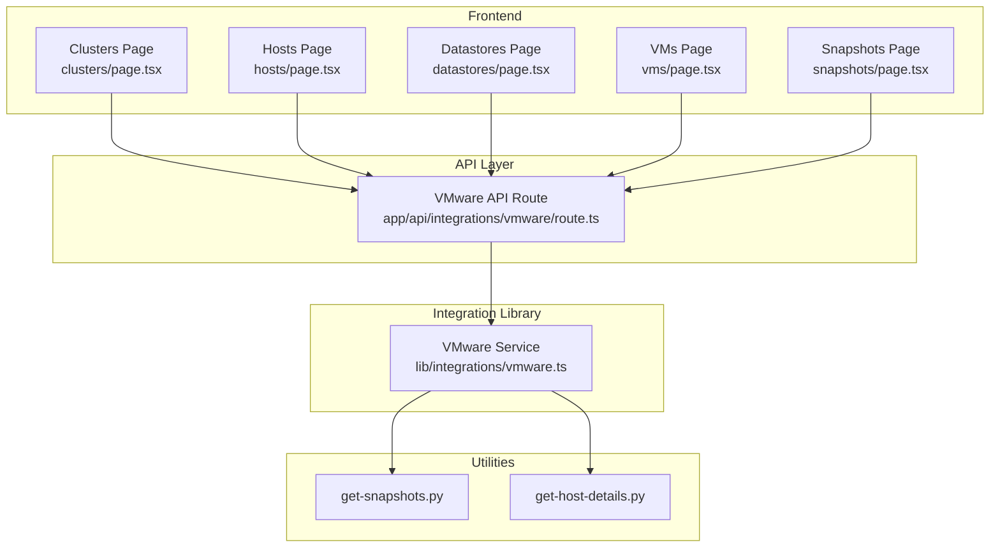

**Diagram sources**
- [route.ts:187-800](file://app/api/integrations/vmware/route.ts#L187-L800)
- [vmware.ts:154-2431](file://lib/integrations/vmware.ts#L154-L2431)
- [clusters/page.tsx:1-252](file://app/virtualization/clusters/page.tsx#L1-L252)
- [hosts/page.tsx:1-371](file://app/virtualization/hosts/page.tsx#L1-L371)
- [datastores/page.tsx:1-376](file://app/virtualization/datastores/page.tsx#L1-L376)
- [vms/page.tsx:1-484](file://app/virtualization/vms/page.tsx#L1-L484)
- [snapshots/page.tsx:1-608](file://app/virtualization/snapshots/page.tsx#L1-L608)
- [get-snapshots.py:1-96](file://scripts/get-snapshots.py#L1-L96)
- [get-host-details.py:1-69](file://scripts/get-host-details.py#L1-L69)

**Section sources**
- [route.ts:187-800](file://app/api/integrations/vmware/route.ts#L187-L800)
- [vmware.ts:154-2431](file://lib/integrations/vmware.ts#L154-L2431)
- [clusters/page.tsx:1-252](file://app/virtualization/clusters/page.tsx#L1-L252)
- [hosts/page.tsx:1-371](file://app/virtualization/hosts/page.tsx#L1-L371)
- [datastores/page.tsx:1-376](file://app/virtualization/datastores/page.tsx#L1-L376)
- [vms/page.tsx:1-484](file://app/virtualization/vms/page.tsx#L1-L484)
- [snapshots/page.tsx:1-608](file://app/virtualization/snapshots/page.tsx#L1-L608)
- [get-snapshots.py:1-96](file://scripts/get-snapshots.py#L1-L96)
- [get-host-details.py:1-69](file://scripts/get-host-details.py#L1-L69)

## Core Components
- VMware API Route: Provides endpoints for dashboard summaries, inventory queries, snapshot listings, and actions (power control, snapshot operations). Implements a cache layer with stale-while-revalidate semantics and supports background revalidation.
- VMware Service: Implements REST and SOAP clients against vCenter, performs authentication, enumerates clusters/hosts/datastores/vms, retrieves events and tasks, powers VMs, manages snapshots, detects sprawl, and collects capacity metrics.
- Frontend Pages: Render inventory lists, filters, summaries, and actions for clusters, hosts, datastores, VMs, and snapshots. They poll the API route and support CSV exports and pagination.

Key capabilities:
- Automated discovery and status updates via periodic polling and caching.
- VM lifecycle operations (power on/off/suspend/reset) and snapshot creation/deletion/revert.
- Snapshot management with age analysis and batch operations.
- Capacity trends and growth forecasting helpers (via API route).
- Sprawl detection based on VM power state and snapshot age.

**Section sources**
- [route.ts:187-800](file://app/api/integrations/vmware/route.ts#L187-L800)
- [vmware.ts:154-2431](file://lib/integrations/vmware.ts#L154-L2431)
- [clusters/page.tsx:35-252](file://app/virtualization/clusters/page.tsx#L35-L252)
- [hosts/page.tsx:50-371](file://app/virtualization/hosts/page.tsx#L50-L371)
- [datastores/page.tsx:37-376](file://app/virtualization/datastores/page.tsx#L37-L376)
- [vms/page.tsx:50-484](file://app/virtualization/vms/page.tsx#L50-L484)
- [snapshots/page.tsx:56-608](file://app/virtualization/snapshots/page.tsx#L56-L608)

## Architecture Overview
The system integrates frontend pages with a Next.js API route that authenticates to vCenter via REST/SOAP, caches responses, and optionally invokes Python scripts for snapshot and host details retrieval. Inventory synchronization writes to the local database for long-term tracking.

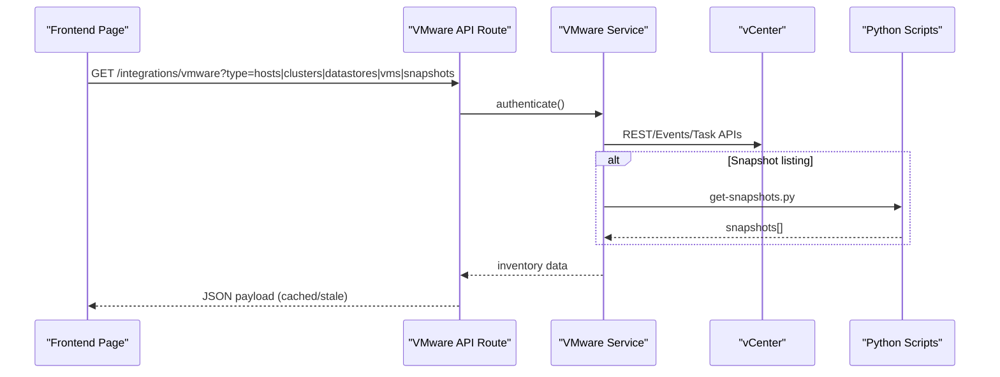

**Diagram sources**
- [route.ts:225-275](file://app/api/integrations/vmware/route.ts#L225-L275)
- [vmware.ts:631-743](file://lib/integrations/vmware.ts#L631-L743)
- [get-snapshots.py:15-96](file://scripts/get-snapshots.py#L15-L96)

**Section sources**
- [route.ts:187-800](file://app/api/integrations/vmware/route.ts#L187-L800)
- [vmware.ts:154-2431](file://lib/integrations/vmware.ts#L154-L2431)

## Detailed Component Analysis

### Clusters Management
- Purpose: Display cluster inventory with host counts, effective hosts, CPU cores, and memory totals.
- Data source: API route type=clusters; cached with 5-minute TTL.
- Features: Export to CSV, refresh, and summary cards aggregating totals.

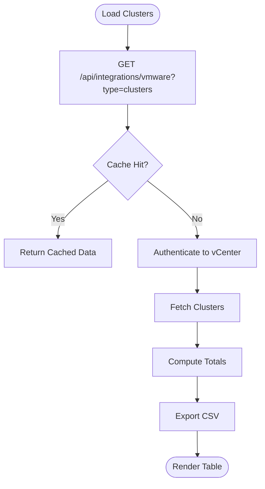

**Diagram sources**
- [clusters/page.tsx:40-129](file://app/virtualization/clusters/page.tsx#L40-L129)
- [route.ts:589-614](file://app/api/integrations/vmware/route.ts#L589-L614)

**Section sources**
- [clusters/page.tsx:1-252](file://app/virtualization/clusters/page.tsx#L1-L252)
- [route.ts:589-614](file://app/api/integrations/vmware/route.ts#L589-L614)

### Host Resource Allocation
- Purpose: Show ESXi hosts with vendor/model, CPU cores, memory, version/build, connection state, and overall health.
- Data source: API route type=hosts; cached with 5-minute TTL.
- Features: Filters by cluster and status, CSV export, pagination, and summary cards.

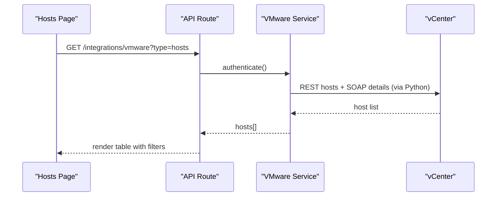

**Diagram sources**
- [hosts/page.tsx:58-82](file://app/virtualization/hosts/page.tsx#L58-L82)
- [route.ts:552-587](file://app/api/integrations/vmware/route.ts#L552-L587)
- [vmware.ts:939-1002](file://lib/integrations/vmware.ts#L939-L1002)
- [get-host-details.py:10-69](file://scripts/get-host-details.py#L10-L69)

**Section sources**
- [hosts/page.tsx:1-371](file://app/virtualization/hosts/page.tsx#L1-L371)
- [route.ts:552-587](file://app/api/integrations/vmware/route.ts#L552-L587)
- [vmware.ts:939-1002](file://lib/integrations/vmware.ts#L939-L1002)
- [get-host-details.py:1-69](file://scripts/get-host-details.py#L1-L69)

### Datastore Monitoring
- Purpose: Track datastore capacity, free space, usage percentage, and accessibility.
- Data source: API route type=datastores; cached with 5-minute TTL.
- Features: Pagination, usage badges, critical/warning indicators, CSV export, and summary cards.

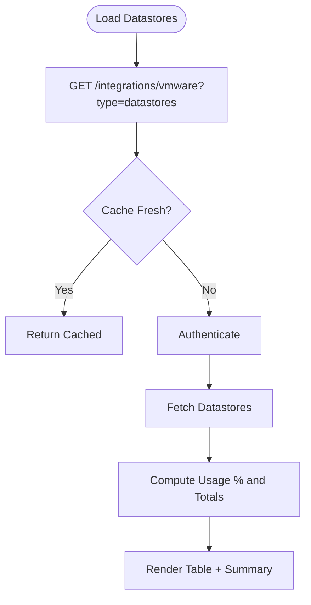

**Diagram sources**
- [datastores/page.tsx:44-68](file://app/virtualization/datastores/page.tsx#L44-L68)
- [route.ts:616-644](file://app/api/integrations/vmware/route.ts#L616-L644)

**Section sources**
- [datastores/page.tsx:1-376](file://app/virtualization/datastores/page.tsx#L1-L376)
- [route.ts:616-644](file://app/api/integrations/vmware/route.ts#L616-L644)

### Virtual Machine Lifecycle Management
- Purpose: View VMs with host, IP, CPU, RAM, OS, status, and overall health; perform power actions.
- Data source: API route type=vms; cached with 5-minute TTL.
- Features: Filters by status, CSV export, pagination, and action dialogs for power operations.

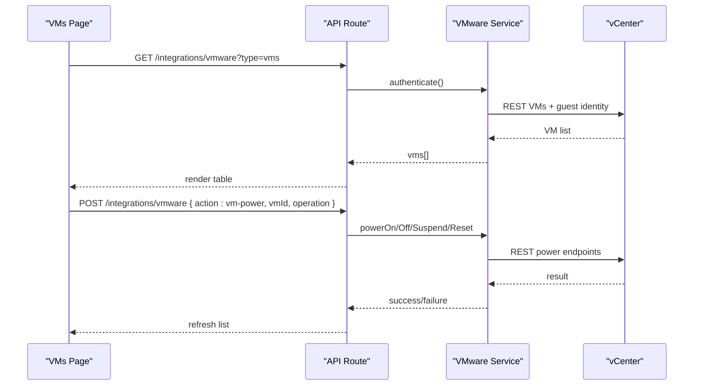

**Diagram sources**
- [vms/page.tsx:68-92](file://app/virtualization/vms/page.tsx#L68-L92)
- [route.ts:442-550](file://app/api/integrations/vmware/route.ts#L442-L550)
- [vmware.ts:1816-1900](file://lib/integrations/vmware.ts#L1816-L1900)

**Section sources**
- [vms/page.tsx:1-484](file://app/virtualization/vms/page.tsx#L1-L484)
- [route.ts:442-550](file://app/api/integrations/vmware/route.ts#L442-L550)
- [vmware.ts:1816-1900](file://lib/integrations/vmware.ts#L1816-L1900)

### Snapshot Operations
- Purpose: List snapshots across VMs, create/delete/revert snapshots, and analyze snapshot age.
- Data source: API route type=snapshots; batch snapshots via Python script; cached with 5-minute TTL.
- Features: Search, pagination, age warnings, and confirmation dialogs.

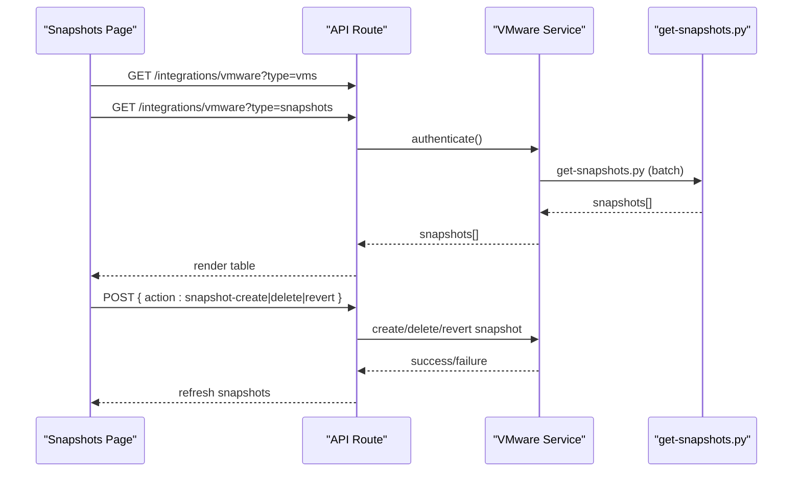

**Diagram sources**
- [snapshots/page.tsx:88-116](file://app/virtualization/snapshots/page.tsx#L88-L116)
- [route.ts:646-666](file://app/api/integrations/vmware/route.ts#L646-L666)
- [vmware.ts:2047-2230](file://lib/integrations/vmware.ts#L2047-L2230)
- [get-snapshots.py:15-96](file://scripts/get-snapshots.py#L15-L96)

**Section sources**
- [snapshots/page.tsx:1-608](file://app/virtualization/snapshots/page.tsx#L1-L608)
- [route.ts:646-666](file://app/api/integrations/vmware/route.ts#L646-L666)
- [vmware.ts:2047-2230](file://lib/integrations/vmware.ts#L2047-L2230)
- [get-snapshots.py:1-96](file://scripts/get-snapshots.py#L1-L96)

### Integration with vCenter for Automated Discovery and Status Updates
- Authentication: REST and legacy REST endpoints; SOAP session for advanced operations.
- Caching: Global cache with TTL and stale-while-revalidate; background revalidation.
- Inventory sync: Sync clusters, hosts, VMs, and datastores to the local database.
- Events and tasks: Query recent tasks and lifecycle/snapshot events via REST/Events API or SOAP fallback.

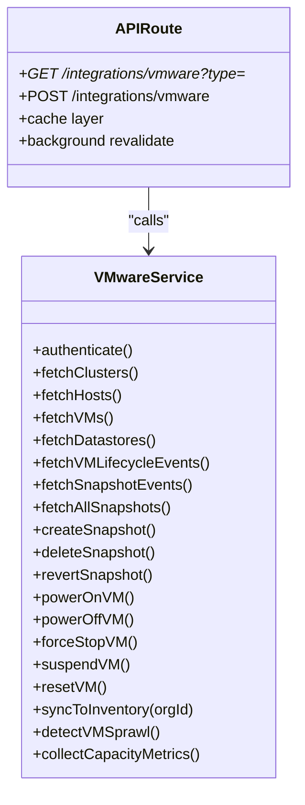

**Diagram sources**
- [vmware.ts:154-2431](file://lib/integrations/vmware.ts#L154-L2431)
- [route.ts:187-800](file://app/api/integrations/vmware/route.ts#L187-L800)

**Section sources**
- [route.ts:225-275](file://app/api/integrations/vmware/route.ts#L225-L275)
- [vmware.ts:154-2431](file://lib/integrations/vmware.ts#L154-L2431)

### Virtual Infrastructure Topology Mapping and Relationship Tracking
- VM-to-Host mapping: Constructed by correlating VMs to hosts via REST queries and used to enrich VM details.
- Cluster relationships: Hosts and VMs are associated with clusters for reporting and capacity planning.
- Physical-to-virtual mapping: Hosts expose vendor/model/version/build for physical context; VMs expose guest OS and IP when available.

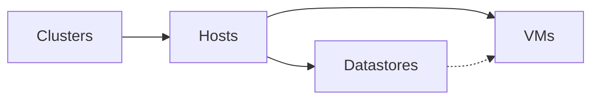

**Diagram sources**
- [vmware.ts:1452-1508](file://lib/integrations/vmware.ts#L1452-L1508)
- [route.ts:442-550](file://app/api/integrations/vmware/route.ts#L442-L550)

**Section sources**
- [vmware.ts:1452-1508](file://lib/integrations/vmware.ts#L1452-L1508)
- [route.ts:442-550](file://app/api/integrations/vmware/route.ts#L442-L550)

### Virtual Machine Placement Strategies and Capacity Planning
- Placement: VMs are associated with hosts and clusters; sprawl detection identifies candidates for consolidation or archival.
- Capacity planning: Helpers compute trends and growth forecasts; capacity metrics collection stores historical CPU/memory/disk usage for analysis.

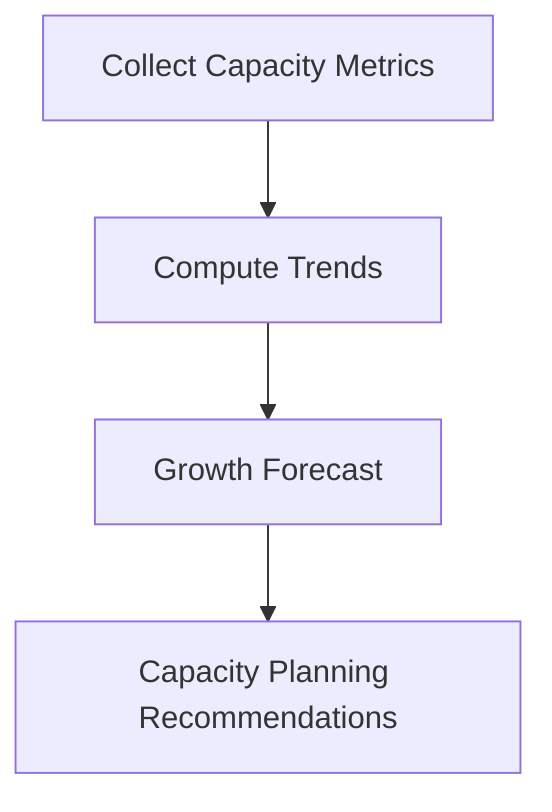

**Diagram sources**
- [route.ts:21-71](file://app/api/integrations/vmware/route.ts#L21-L71)
- [route.ts:726-743](file://app/api/integrations/vmware/route.ts#L726-L743)
- [vmware.ts:2337-2399](file://lib/integrations/vmware.ts#L2337-L2399)

**Section sources**
- [route.ts:21-71](file://app/api/integrations/vmware/route.ts#L21-L71)
- [route.ts:726-743](file://app/api/integrations/vmware/route.ts#L726-L743)
- [vmware.ts:2337-2399](file://lib/integrations/vmware.ts#L2337-L2399)

### Practical Examples
- VM Onboarding: Use the VMs page to locate VMs by host/IP/OS; leverage filters and CSV export for bulk operations.
- Snapshot Management: Create snapshots from the Snapshots page; review age and size; revert or delete with confirmation dialogs.
- Performance Monitoring: Use the Hosts and Datastores pages to track utilization; rely on the Sprawl detection to identify underutilized VMs.

[No sources needed since this section provides practical guidance derived from the analyzed components]

## Dependency Analysis
- Frontend pages depend on the API route for data and actions.
- The API route depends on the VMware service for vCenter integration.
- The VMware service invokes Python scripts for snapshot enumeration and host details extraction.
- Internal NMS service (network monitoring) is separate and does not impact VMware virtualization views.

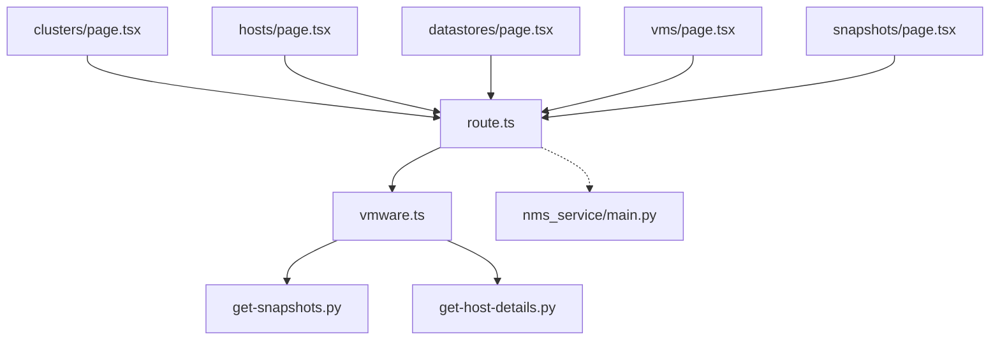

**Diagram sources**
- [clusters/page.tsx:1-252](file://app/virtualization/clusters/page.tsx#L1-L252)
- [hosts/page.tsx:1-371](file://app/virtualization/hosts/page.tsx#L1-L371)
- [datastores/page.tsx:1-376](file://app/virtualization/datastores/page.tsx#L1-L376)
- [vms/page.tsx:1-484](file://app/virtualization/vms/page.tsx#L1-L484)
- [snapshots/page.tsx:1-608](file://app/virtualization/snapshots/page.tsx#L1-L608)
- [route.ts:187-800](file://app/api/integrations/vmware/route.ts#L187-L800)
- [vmware.ts:154-2431](file://lib/integrations/vmware.ts#L154-L2431)
- [get-snapshots.py:1-96](file://scripts/get-snapshots.py#L1-L96)
- [get-host-details.py:1-69](file://scripts/get-host-details.py#L1-L69)
- [main.py:1-483](file://nms_service/main.py#L1-L483)

**Section sources**
- [route.ts:187-800](file://app/api/integrations/vmware/route.ts#L187-L800)
- [vmware.ts:154-2431](file://lib/integrations/vmware.ts#L154-L2431)

## Performance Considerations
- Caching: The API route implements a global cache with TTL and stale-while-revalidate to reduce latency and load on vCenter. Background revalidation keeps data fresh.
- Parallelization: Dashboard and inventory endpoints use Promise.all to fetch multiple resource sets concurrently.
- Pagination: Large datasets (VMs, snapshots) are paginated to improve responsiveness.
- Batch operations: Snapshot enumeration uses a Python script to minimize API round-trips.

[No sources needed since this section provides general guidance]

## Troubleshooting Guide
Common issues and resolutions:
- vCenter connectivity failures: Verify integration configuration and credentials; check authentication endpoints and error messages.
- Snapshot listing delays: Batch snapshot enumeration relies on a Python script; ensure the script is executable and returns data.
- Host details missing: Hardware details (vendor/model/CPU/RAM) are fetched via Python/PyVmomi; confirm script execution and vCenter permissions.
- Cache staleness: The cache has a TTL and background revalidation; force refresh or wait for automatic updates.
- Power/snapshot actions failing: Confirm vCenter session validity and endpoint availability; check error responses and invalidate caches after successful operations.

**Section sources**
- [route.ts:225-275](file://app/api/integrations/vmware/route.ts#L225-L275)
- [vmware.ts:631-743](file://lib/integrations/vmware.ts#L631-L743)
- [get-snapshots.py:15-96](file://scripts/get-snapshots.py#L15-L96)
- [get-host-details.py:10-69](file://scripts/get-host-details.py#L10-L69)

## Conclusion
The virtualization management layer provides a robust, cache-aware interface to VMware vCenter, enabling inventory oversight, lifecycle operations, snapshot management, and capacity insights. The modular design separates concerns between frontend, API orchestration, and integration logic, supporting scalable operations and actionable capacity planning.

## Appendices
- Related internal service: The NMS service under nms_service/ provides network monitoring and discovery; it is separate from VMware virtualization management.

**Section sources**
- [main.py:1-483](file://nms_service/main.py#L1-L483)