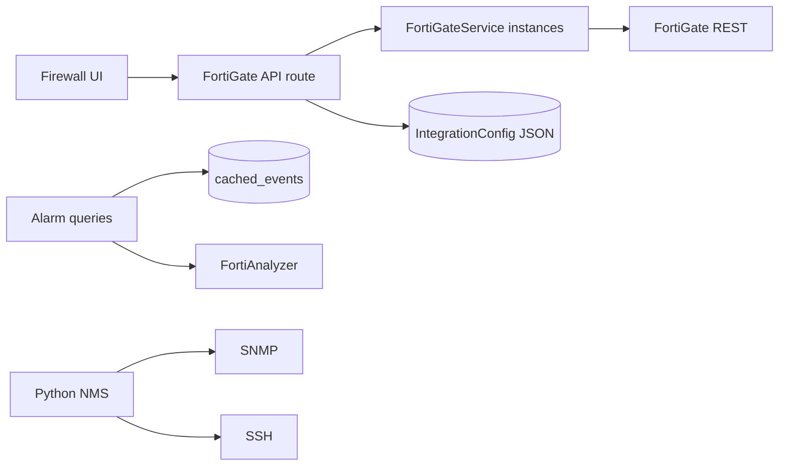
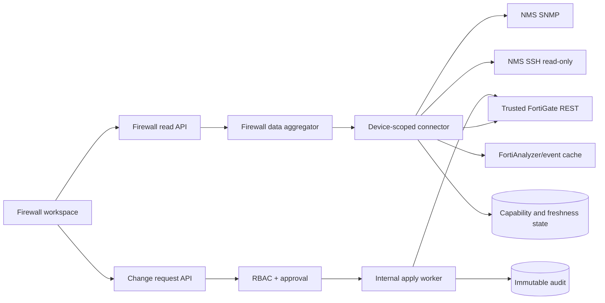

# FortiGate Firewall Yönetim Modülü Hedef Mimarisi

**Durum:** Proposed design

**Bağımlı karar:** Yeni bounded context ve authorization modeli nedeniyle uygulamadan önce ADR

**Teslim yaklaşımı:** V1 read-only, V2 kontrollü write

## 1. Tasarım hedefi

InfraScope bir FortiGate cihazını sertifika veya REST problemi yüzünden kaybetmemelidir. Cihaz envantere alınır, kullanılabilir veri kaynakları ayrı ayrı test edilir ve kullanıcıya her verinin kaynağı ile güncelliği gösterilir. Buna karşılık hiçbir fallback, production TLS doğrulamasını gevşetmemeli ve hiçbir write işlemi REST trust zinciri sağlıklı değilken çalışmamalıdır.

## 2. Güvenlik ve veri bütünlüğü invariant'ları

1. Geçersiz veya süresi geçmiş sertifika otomatik kabul edilmez.
2. REST başarısızlığı cihaz onboarding'ini engellemez.
3. “Boş sonuç” ile “kaynak kullanılamıyor” aynı değer değildir.
4. Her read response kaynak, timestamp ve freshness taşır.
5. Cihaz kimliği host/IP değil, mümkün olduğunda serial/devid + VDOM'dur.
6. Credential yalnız şifreli DB envelope veya runtime secret'tan çözülür.
7. Read ve write credential ayrı tutulur.
8. Write capability varsayılan kapalıdır ve izleme durumundan ayrıdır.
9. SSH read-only fallback/config backup içindir; write kanalı değildir.
10. FortiAnalyzer log/event kaynağıdır; FortiGate CMDB current state yerine geçmez.
11. Dış write öncesi authorization, current-state doğrulaması ve audit reservation zorunludur.
12. Genel REST path veya CLI passthrough endpoint'i oluşturulmaz.

## 3. Mevcut ve hedef akış

### Mevcut



Bu yapıda kaynaklar aynı cihaz/capability state'i altında birleşmez. FortiGate route'ları tek config varsayar, bazı hatalar boş sonuç olur ve direct quarantine write ayrı bir güvenlik sınırı olmadan çalışır.

### Hedef



## 4. Bounded context bileşenleri

### Firewall inventory service

- `Device` kaydını ve firewall connector lifecycle'ını sahiplenir.
- Onboarding'i REST testinden bağımsız tamamlar.
- Geçici host/IP ile kaydı açar; serial/devid bulunduğunda kalıcı kimliğe bağlar.
- Çoklu FortiGate ve VDOM'u birinci sınıf kavram olarak ele alır.

### Connector factory

- Her firewall hedefi için device-scoped connector üretir.
- REST session/backoff durumunu aynı hedef için paylaşır.
- Cache anahtarlarında `firewallId`, `vdom`, capability ve query fingerprint bulunur.
- DB erişiminde yalnız `lib/prisma.ts` singleton'ını kullanır.

### Capability probe service

Her kaynağı bağımsız test eder:

| Capability | Probe örneği | Başarı koşulu |
|---|---|---|
| REST TLS | HTTPS handshake + hostname/chain | Güvenilir sertifika |
| REST auth | Read-only status endpoint | Yetkili 2xx cevap |
| SNMP | sysUpTime/sysDescr | Beklenen tipte cevap |
| SSH | Host-key verify + read-only identity | Allowlist komut başarılı |
| FortiAnalyzer | Device serial/devid/VDOM eşleşmesi | Güncel event erişimi |

### Data aggregator

- Özellik bazında authoritative source seçer.
- LIMITED modda yalnız gerçekten doğrulanmış fallback'i kullanır.
- Son başarılı snapshot'ı kaybetmez; stale olarak işaretler.
- Kaynak hatasını veri sıfırına dönüştürmez.

### Change control service

- Yalnız V2'de aktiftir.
- Preview, request, approval ve execution sınırlarını ayırır.
- Web request içinde doğrudan FortiGate write yapmaz.
- Apply yetkisi yalnız internal worker'a verilir.

## 5. İzleme durum modeli

```ts
type FirewallMonitoringMode = 'FULL' | 'LIMITED' | 'UNAVAILABLE';

type CapabilityState = {
  capability: 'rest' | 'snmp' | 'ssh' | 'fortianalyzer';
  status: 'healthy' | 'degraded' | 'unavailable' | 'not-configured';
  lastAttemptAt: string | null;
  lastSuccessAt: string | null;
  nextProbeAt: string | null;
  errorClass?: 'tls' | 'auth' | 'timeout' | 'network' | 'rate-limit' | 'unsupported';
  errorCode?: string;
};
```

### FULL

- REST TLS chain ve hostname doğrulanır.
- REST authentication ve minimum read probe başarılıdır.
- Policy, object, VPN ve HA current state kullanılabilir.
- SNMP/FortiAnalyzer yine tamamlayıcı kaynak olarak çalışır.
- Write otomatik açılmaz.

### LIMITED

- REST TLS/auth/read probe başarısızdır.
- SNMP, SSH veya FortiAnalyzer'dan en az biri son freshness penceresinde başarılıdır.
- Yalnız kaynak matrisi izin verdiği veriler gösterilir.
- REST-only alanlar `unavailable` olur; eski snapshot varsa `stale` olarak gösterilebilir.
- Tüm write işlemleri kapalıdır.

### UNAVAILABLE

- Hiçbir kaynak freshness penceresinde başarılı değildir.
- Son bilinen veri varsa yalnız stale snapshot olarak gösterilir.
- UI bağlantı hatasını açıklar; sahte sıfır üretmez.

## 6. Write capability modeli

```ts
type FirewallWriteCapability = {
  configured: boolean;
  enabled: boolean;
  restTrusted: boolean;
  credentialSet: boolean;
  permissionProfileVerified: boolean;
  lastVerifiedAt: string | null;
  blockedReason?: string;
};
```

`FULL` olmak write yetkisi anlamına gelmez. `enabled=false` varsayılandır. Write için trusted REST, ayrı credential, doğrulanmış minimum FortiGate admin profile, feature flag, InfraScope permission ve onay akışı birlikte gereklidir.

## 7. Veri kaynağı ve freshness modeli

```ts
type FirewallDataEnvelope<T> = {
  data: T | null;
  source:
    | 'fortigate-rest'
    | 'fortianalyzer'
    | 'event-cache'
    | 'snmp'
    | 'ssh'
    | 'database';
  status: 'available' | 'stale' | 'unavailable';
  collectedAt: string | null;
  unavailableReason?: string;
};
```

Önerilen freshness başlangıç değerleri:

| Veri | Fresh | Stale kabul penceresi |
|---|---:|---:|
| System/interface health | 2 dakika | 15 dakika |
| Active VPN sessions/tunnels | 2 dakika | 10 dakika |
| Policy/address/VIP/HA config | 15 dakika | 24 saat |
| Auth/security events | 5 dakika | 60 dakika |
| Config backup | 24 saat | 7 gün |

Bu değerler policy olarak yapılandırılabilir olmalıdır; UI source ve collectedAt değerini her zaman gösterebilmelidir.

### Uygulanan SNMP freshness köprüsü

- SNMP poll işlemi Python NMS sidecar'da kalır; Next.js FortiGate REST isteğiyle SNMP isteğini aynı request zincirinde çalıştırmaz.
- Firewall API, yalnız connector'ın açık bağlı olduğu `Device.nmsDeviceId` için `nms_health_metrics` ve `nms_interfaces` okur.
- Poll aralığının üç katı, en az 2 ve en fazla 5 dakika içinde kalan metric `available` kabul edilir.
- 15 dakikaya kadar veri `stale` olarak gösterilir; daha eski veri `unavailable` olur.
- SNMP `available`, REST `unavailable` ise monitoring evaluator `LIMITED` üretir.
- SNMPv1/v2c için explicit community zorunludur; `public` varsayımı yoktur.
- SNMPv3 USM secret'ları alan bazlı AES-256-GCM envelope ile saklanır; `authNoPriv` SHA/SHA-256 ve `authPriv` SHA/SHA-256 + AES-128 desteklenir.
- API secret değerleri geri döndürmez; yalnız credential presence bilgisi verir. Discovery kayıtları USM secret taşımadığı için SNMPv3 doğrudan NMS izleme formundan yapılandırılır.
- CPU ve memory Fortinet `fgSystemInfo` scalar'larından; sıcaklık model-dependent `fgHwSensorTable` içinden alınır.

## 8. Cihaz kimliği ve çoklu VDOM

### Önerilen kimlik

- `Device.id`: InfraScope internal identity.
- `serialNumber` veya FortiGate `serial`: fiziksel/HA üye kimliği.
- `devid`: FortiAnalyzer event correlation identity.
- `vdom`: config ve event scope.
- `managementHost`: değişebilir bağlantı adresi.

Host değişikliği yeni cihaz üretmemelidir. Aynı cluster/HA üyeleri ve VDOM'lar açık ilişkiyle modellenmelidir. `serial/devid + vdom` normalize edilmiş unique identity olarak hedeflenir; migration ayrıntısı ADR ve uygulama planında kararlaştırılır.

### Uygulanan FortiAnalyzer korelasyonu

- FortiGate serial kimliği yalnız trusted REST probe sonrasında `VERIFIED` kabul edilir.
- FortiAnalyzer managed-device listesindeki `devid`, verified serial ile exact eşleşmelidir.
- İsim ve IP adresi kimlik eşleştirme girdisi değildir.
- `analyzerDeviceId + VDOM` DB seviyesinde benzersizdir.
- Event cache ve canlı logsearch aynı `devid + VDOM` scope'unu kullanır.
- Auth, security ve config-change endpoint'leri yalnız güvenli alan projeksiyonu döndürür; `rawLog` dış arayüze taşınmaz.
- Cache güncelse `event-cache`, cache eskiyse canlı `fortianalyzer`, canlı kaynak başarısızsa son cache `stale` olarak raporlanır.

## 9. Önerilen typed modeller

Bu bölüm migration değildir; gelecek uygulama için sözleşmedir.

```ts
type FirewallConnector = {
  id: string;
  deviceId: string;
  managementHost: string;
  serialNumber: string | null;
  analyzerDeviceId: string | null;
  vdom: string;
  monitoringMode: FirewallMonitoringMode;
  writeEnabled: boolean;
  readCredentialRef: string | null;
  writeCredentialRef: string | null;
  capabilities: CapabilityState[];
};
```

Credential envelope:

```ts
type EncryptedCredentialEnvelope = {
  cipherText: string;
  keyVersion: string;
  algorithm: 'AES-256-GCM';
  nonce: string;
  authTag: string;
  createdAt: string;
  rotatedAt: string | null;
};
```

UI'ya secret dönmez; yalnız `credentialSet`, `lastVerifiedAt` ve profile bilgisi döner.

## 10. Probe, backoff ve recovery

1. Onboarding sırasında REST, SNMP, SSH ve FortiAnalyzer probe'ları bağımsız çalışır.
2. Her probe timeout + abort signal taşır.
3. REST healthy iken 5 dakikada bir hafif probe yapılır.
4. Hata halinde backoff 5, 10, 20, 40 ve 60 dakika olarak büyür.
5. Manual probe rate-limited olur ve mevcut in-flight probe ile deduplicate edilir.
6. Başarılı REST probe backoff'u sıfırlar ve `FULL` değerlendirmesini tekrar çalıştırır.
7. TLS expiry hatası özel sınıflandırılır; UI sertifika çözümünü söyler ama bypass sunmaz.
8. Auth lock/rate-limit durumunda probe sıklığı düşürülür.

**Implemented:** P1.9 worker bu sözleşmeyi `FirewallConnector.nextProbeAt` ve REST capability içindeki ardışık hata sayısıyla uygular. Due kayıtlar PostgreSQL advisory transaction lock altında kısa süreli lease edilir; aynı connector için process-local in-flight promise paylaşılır. REST sonucu önceki fallback capability kayıtlarını silmez. Scheduler heartbeat'i operasyonel sağlık sorguları için `SystemConfig.firewall_recovery_last_tick` içinde saklanır.

## 11. Onboarding akışı

1. Kullanıcı ad, management IP/FQDN, VDOM ve isteğe bağlı SNMP/SSH/FortiAnalyzer eşleşmesini girer.
2. InfraScope `Device + FirewallConnector` kaydını `UNKNOWN`/pending state ile oluşturur.
3. Capability probe başlar.
4. REST sertifika hatası alırsa kayıt korunur; SNMP/SSH/FA denenir.
5. En az bir fallback başarılıysa `LIMITED`, hiçbiri değilse `UNAVAILABLE` olur.
6. Serial/devid elde edilirse kimlik güncellenir ve duplicate kontrolü yapılır.
7. UI kullanılabilir özellikleri ve remediation bilgisini gösterir.

Müşterinin `.env`, Docker veya CA dosyası düzenlemesi bu akışın zorunlu adımı değildir. Sertifika FortiGate üzerinde düzeltildiğinde auto recovery devreye girer.

## 12. Read-only V1 API sözleşmesi

- `POST /api/firewalls`
- `GET /api/firewalls`
- `GET /api/firewalls/:id`
- `POST /api/firewalls/:id/probe`
- `GET /api/firewalls/:id/status`
- `GET /api/firewalls/:id/interfaces`
- `GET /api/firewalls/:id/policies`
- `GET /api/firewalls/:id/addresses`
- `GET /api/firewalls/:id/vips`
- `GET /api/firewalls/:id/vpn/ssl-sessions`
- `GET /api/firewalls/:id/vpn/ipsec`
- `GET /api/firewalls/:id/ha`
- `GET /api/firewalls/:id/auth-events`
- `GET /api/firewalls/:id/backups`

Tüm endpoint'ler explicit firewall ID ve VDOM scope alır. `findFirst()` ile global config seçmez. Liste endpoint'leri pagination/filter taşır; veriyi source envelope ile döndürür.

## 13. Write-enabled V2 API sözleşmesi

- `POST /api/firewalls/:id/change-requests/preview`
- `POST /api/firewalls/:id/change-requests`
- `POST /api/firewalls/:id/change-requests/:requestId/approve`
- `POST /api/firewalls/:id/change-requests/:requestId/cancel`

Apply için public endpoint yoktur. Worker onaylanmış kuyruğu tüketir ve execution lease/idempotency key ile yalnız bir kez uygular.

## 14. RBAC sınırı

- `firewall:read`: read API ve capability durumu.
- `firewall:configure`: connector/read credential ayarları; write açma yetkisi tek başına değil.
- `firewall:request_change`: preview ve request.
- `firewall:approve_change`: risk politikasına göre approval.
- `firewall:emergency_quarantine`: acil karantina talebi; audit/preview atlanmaz.

Worker execution izni kullanıcı session'ından türetilmez.

## 15. Failure davranışı

- REST timeout/TLS/auth: response `unavailable`, mevcut snapshot `stale` olabilir.
- FortiAnalyzer down: event-cache freshness kontrol edilir; current CMDB etkilenmez.
- SNMP down: REST interface varsa kullanılabilir; health kaynağı açıkça değişir.
- SSH down: son backup stale olur; diğer read işlevleri devam eder.
- Audit DB down: read devam eder; write başlatılmaz.
- Apply sonrası verify başarısız: operation `VERIFY_FAILED`; otomatik sınırsız retry yapılmaz, operatör müdahalesi gerekir.

## 16. Gözlemlenebilirlik

Her connector için şu metrikler üretilmelidir:

- Probe başarı/hata sayısı ve latency.
- Capability status, backoff ve last success.
- Source freshness ve stale response sayısı.
- FortiGate auth/session refresh sayısı.
- Change request durum sayıları.
- Write apply/verify başarı-hata ve idempotency collision.
- Audit reservation failure.

Loglar cihaz internal ID ve VDOM taşır; secret, raw cookie, token ve password içermez.

## 17. Uygulama sırası

1. ADR ve güvenlik invariant'ları.
2. Direct write yüzeyinin kapatılması.
3. RBAC ve credential encryption.
4. Connector/capability modeli.
5. Read-only API ve hybrid onboarding.
6. FortiAnalyzer korelasyonu, SNMP/SSH hardening ve auto recovery.
7. V1 production gözlemi.
8. V2 change-control modeli ve kademeli write operasyonları.

## 18. Non-goals

- TLS bypass veya otomatik expired-certificate trust.
- FortiAnalyzer'ı CMDB current-state kaynağı yapmak.
- SSH üzerinden firewall config write.
- Generic CLI/REST proxy.
- V1'de policy veya object değiştirmek.
- İlk V2 sürümünde kalıcı/genel internet erişim policy'si.
