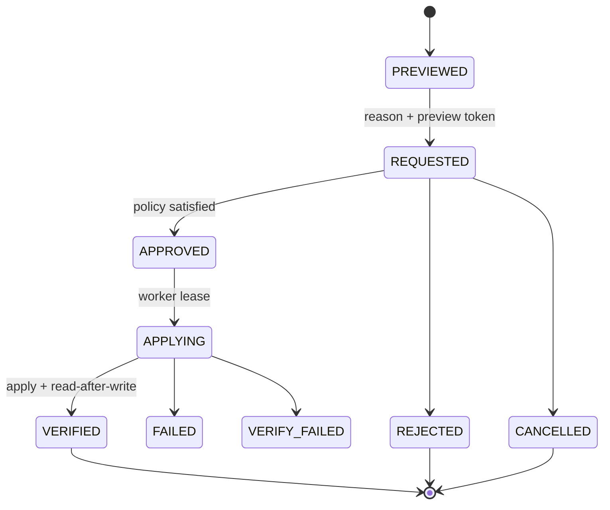

# FortiGate Write Operations Guardrail'ları

**Durum:** Proposed security contract

**Kapsam:** Karantina, address object ve policy değişiklikleri

**Varsayılan:** Tüm write operasyonları kapalı

## 1. Tehdit modeli özeti

Firewall write yetkisi, tek bir yanlış authorization kararı veya stale preview ile müşteri trafiğini kesebilir, güvenlik politikasını zayıflatabilir ya da internet erişimi açabilir. Başlıca riskler:

- Authenticated fakat yetkisiz kullanıcının direct endpoint çağırması.
- Çalınmış session veya credential ile yüksek etkili işlem.
- Preview ile apply arasında FortiGate state'inin değişmesi.
- Retry sırasında aynı işlemin iki kez uygulanması.
- Yanlış firewall veya VDOM üzerinde işlem.
- Audit başarısızken değişikliğin yine uygulanması.
- Generic REST/CLI proxy üzerinden guardrail bypass.
- Expired/untrusted TLS ile yanlış hedefe write.
- Address/policy referanslarının gözden kaçması.

## 2. Değişmez güvenlik kuralları

1. `writeEnabled=false` varsayılandır.
2. `LIMITED` veya `UNAVAILABLE` cihazda write yapılamaz.
3. TLS chain/hostname ve REST authentication her apply öncesi sağlıklı olmalıdır.
4. Read ve write credential'ları ayrıdır.
5. Write hesabı FortiGate üzerinde IP allowlist ve minimum yetkili profile sahip olmalıdır.
6. Public web request doğrudan FortiGate write çağrısı yapmaz.
7. Genel REST path, arbitrary JSON payload veya CLI passthrough yoktur.
8. Her operation typed schema ve allowlist endpoint'e bağlıdır.
9. Preview olmadan request, request olmadan approval, approval olmadan apply yoktur.
10. Dış çağrıdan önce fail-closed audit reservation zorunludur.
11. Apply idempotent ve tek worker lease'i altında çalışır.
12. Apply sonrası read-after-write verification zorunludur.
13. Secret, cookie, token ve password preview/audit/log içine girmez.
14. Emergency akış approval süresini değiştirebilir; preview ve audit'i atlayamaz.

## 3. Mevcut direct quarantine yüzeyi

`POST` ve `DELETE /api/security/quarantine` bugün FortiGate write metodunu doğrudan çağırır. Bu route firewall permission map'inde değildir, preview/approval/audit taşımaz. Uygulamanın ilk P0 adımı:

1. `FORTIGATE_WRITES_ENABLED=false` varsayılan feature flag.
2. Route kapalıyken `503/feature-disabled` ve remediation döndürür.
3. Geçici açık kullanım yalnız `ADMIN` ve explicit firewall permission ile sınırlandırılır.
4. V2 worker akışı hazır olduğunda direct POST/DELETE kaldırılır.

Bu geçici kontrol hedef mimari değildir; yalnız mevcut risk yüzeyini azaltır.

## 4. Permission modeli

| Permission | Yetki |
|---|---|
| `firewall:read` | Firewall read API ve capability/freshness |
| `firewall:configure` | Connector, read credential ve probe ayarları |
| `firewall:request_change` | Preview ve change request oluşturma |
| `firewall:approve_change` | Risk politikasına uygun request onayı |
| `firewall:emergency_quarantine` | Acil karantina talebi; audit/preview korunur |

Ek kurallar:

- Worker execution service identity'si son kullanıcı rolü değildir.
- ADMIN rolü tek başına permission bypass sağlamaz; permission açık değerlendirilir.
- HIGH/CRITICAL onayında requester ve approver farklı user ID olmalıdır.
- Suspended/inactive user'ın bekleyen request'i apply öncesi tekrar doğrulanır.

## 5. Credential sınırı

### Read credential

- FortiGate read-only REST profile.
- Policy/object/monitor endpoint'leri için minimum scope.
- UI'ya secret dönmez.

### Write credential

- Ayrı FortiGate hesabı veya token.
- Yalnız desteklenen typed operations için minimum profile.
- Mümkünse InfraScope appliance IP allowlist.
- Şifreli DB envelope; key version ve rotation metadata.
- Runtime'da kısa süreli çözülür, loglanmaz, request body'de istemciye dönmez.

Write credential mevcut değilse izleme etkilenmez; capability `configured=false` olur.

## 6. Değişiklik workflow'u



### Adım 1: Current state

- Firewall ID, serial/devid ve VDOM yeniden çözülür.
- Capability `FULL`, write capability enabled ve credential profile healthy olmalıdır.
- Operasyonun hedef nesnesi authoritative REST'ten okunur.

### Adım 2: Canonical preview

Preview, şu alanları içerir:

- Operation type ve risk.
- Target firewall, serial/devid ve VDOM.
- Sanitized current state.
- Sanitized desired state.
- Canonical field-level diff.
- Referans ve etki analizi.
- Geri dönüş/compensation yöntemi.
- Expiry ve otomatik cleanup varsa zaman.

### Adım 3: Preview token

- Sunucu tarafından imzalanır.
- Preview hash, target identity, actor ve expiry içerir.
- 10 dakika geçerlidir.
- Tek başına apply yetkisi değildir.

### Adım 4: Change request

- Requester gerekçe ve ticket/reference ekler.
- Preview hash değiştirilmeden saklanır.
- Permission ve session tekrar değerlendirilir.

### Adım 5: Approval

- Risk politikasına göre self/four-eyes kontrol edilir.
- Approver preview diff'i görür.
- Approval timestamp ve approver identity immutable kaydedilir.

### Adım 6: Apply öncesi doğrulama

- Worker target identity ve VDOM'u tekrar doğrular.
- REST TLS/auth probe tekrar başarılı olmalıdır.
- Current state yeniden okunur ve preview current-state hash'iyle karşılaştırılır.
- Hash değiştiyse request `STALE` olur; yeni preview gerekir.

### Adım 7: Idempotent apply

- Her request için sabit idempotency key.
- Distributed lease aynı request'i tek worker'ın işlemesini sağlar.
- Yalnız operation registry'deki endpoint/payload builder kullanılır.

### Adım 8: Read-after-write

- Authoritative REST endpoint'i yeniden okunur.
- Beklenen state ile canonical karşılaştırma yapılır.
- Sonuç `VERIFIED`, `FAILED` veya `VERIFY_FAILED` olur.

### Adım 9: Immutable audit

- Request, approval, apply attempt ve verification ayrı transition kayıtlarıdır.
- Audit reservation dış çağrıdan önce yazılamazsa apply yapılmaz.
- Final audit yazılamazsa target write circuit breaker açılır ve reconciliation tamamlanana kadar yeni write engellenir.

## 7. Risk sınıfları

| İşlem | Risk | Onay kuralı | Ek kontrol |
|---|---|---|---|
| Quarantine add | MEDIUM | ADMIN self-approval gerekçeyle mümkün | Expiry zorunlu veya explicit permanent reason |
| Quarantine remove | HIGH | Farklı ADMIN | Mevcut incident/reason görünür |
| Address create | MEDIUM | ADMIN self-approval gerekçeyle mümkün | Duplicate ve overlap kontrolü |
| Address update | MEDIUM | ADMIN self-approval gerekçeyle mümkün | Referans/etki diff'i |
| Address disable/delete | HIGH | Farklı ADMIN | Referans grafiği; disable tercih edilir |
| Policy enable/disable | HIGH | Farklı ADMIN | Traffic etkisi ve placement |
| Internet policy create | CRITICAL | Farklı ADMIN | Dar scope, duration, logging ve auto-disable |

## 8. Operasyon sözleşmeleri

### Karantina add

- IP/CIDR normalize edilir; broadcast/multicast/unspecified adresler reddedilir.
- VDOM açık seçilir.
- Reason zorunludur.
- Expiry varsayılan olmalıdır; süresiz add ayrı gerekçe ister.
- Mevcut karantina kaydı varsa duplicate apply yapılmaz.

### Karantina remove

- Kayıt authoritative banned list'te bulunmalıdır.
- Request mevcut expiry, source ve reason'ı gösterir.
- Aynı IP için açık security incident varsa uyarı/approval bilgisine eklenir.

### Address create/update

- Name canonicalize edilir fakat kullanıcı girdisi sessizce değiştirilmez.
- Type, subnet/FQDN, interface ve VDOM schema ile doğrulanır.
- Duplicate, overlap ve group/policy referansları preview'da görünür.
- Update, target object'in current-state hash'ini taşır.

### Address disable/delete

- FortiOS object tipinde disable yoksa ürün “disable” taklidi yapmaz.
- Policy/group referansı varken delete reddedilir.
- Physical delete HIGH risk; mümkünse lifecycle/deprecation yaklaşımı kullanılır.

### Policy enable/disable

- Policy ID ve VDOM zorunludur.
- Source/destination interface, address, service, action, NAT ve logging preview'da gösterilir.
- Policy content değişikliği ile enable/disable aynı request'te birleştirilmez.

### Süreli internet erişim policy'si

- Varsayılan süre 8 saat, maksimum 24 saat.
- Kaynak cihaz/IP ve hedef kapsam açık olmalıdır.
- `any/any`, servicesiz, süresiz veya logging kapalı policy reddedilir.
- Placement açıkça gösterilir; implicit top/bottom ekleme yoktur.
- Expiry worker disable işlemini yeni operation attempt olarak uygular ve doğrular.

## 9. Preview örneği

```json
{
  "operation": "address.update",
  "risk": "MEDIUM",
  "target": {
    "firewallId": "fw_internal_id",
    "serial": "masked-device-serial",
    "vdom": "root"
  },
  "before": {
    "name": "APP-SERVER",
    "subnet": "10.0.10.10/32"
  },
  "after": {
    "name": "APP-SERVER",
    "subnet": "10.0.10.11/32"
  },
  "impact": {
    "referencedPolicies": 2,
    "referencedGroups": 1
  },
  "expiresAt": "2026-07-13T12:10:00Z"
}
```

Gerçek serial, token veya credential dokümana/loga yazılmaz; örnek değerler sentetiktir.

## 10. Idempotency ve concurrency

- Idempotency key request ID'den deterministik üretilir.
- Operation attempt için unique `(requestId, attemptNumber)` ve tek active lease kuralı gerekir.
- Aynı target object üzerinde çakışan approved request'ler serialize edilir.
- REST timeout sonrası state bilinmiyorsa kör retry yapılmaz; önce current state okunur.
- Apply başarılı fakat response kayıpsa read-after-write sonucu işlemi verified yapabilir.

## 11. Audit içeriği

Zorunlu alanlar:

- Requester, approver, worker identity.
- Permission decision ve policy version.
- Firewall internal ID, serial/devid ve VDOM.
- Operation type, risk, reason ve ticket reference.
- Sanitized before/after ve preview hash.
- Current-state hash ve apply idempotency key.
- FortiGate HTTP status / vendor request ID; response body secret-free summary.
- Verification result ve timestamps.
- Failure class ve remediation.

Audit update/delete endpoint'i olmamalıdır. Düzeltme gerekiyorsa yeni append-only reconciliation record yazılır.

## 12. Hata ve rollback yaklaşımı

| Durum | Davranış |
|---|---|
| Preview süresi doldu | Yeni preview gerekir |
| Current state değişti | Request `STALE`; otomatik apply yok |
| TLS/auth capability düştü | Apply bloklanır |
| FortiGate 4xx | `FAILED`; payload güvenli özeti kaydedilir |
| Timeout / belirsiz sonuç | Current state okunur; kör retry yok |
| Apply başarılı, verify başarısız | `VERIFY_FAILED`; yeni write circuit breaker |
| Audit reservation başarısız | FortiGate çağrısı yapılmaz |
| Expiry cleanup başarısız | Kritik operasyon alarmı ve retry/backoff |

Rollback aynı endpoint'i sessizce tersine çevirmek değildir. Önceki state'ten yeni bir change request/compensating operation oluşturulur; yalnız süreli policy expiry gibi önceden onaylanmış otomatik kapatma bu kuralın kontrollü istisnasıdır.

## 13. Test zorunlulukları

- VIEWER/EDITOR direct write çağrısı 403.
- Unmapped firewall route kalmaması.
- `LIMITED`, TLS error ve auth error durumunda apply 409/blocked.
- Expired preview ve changed current-state hash reddi.
- MEDIUM self-approval ve HIGH four-eyes kuralları.
- Duplicate worker delivery'de tek write.
- Timeout sonrası state read ve duplicate önleme.
- Audit reservation failure'da FortiGate mock'una sıfır write.
- Secret redaction snapshot testleri.
- Multi-firewall/VDOM target isolation.
- Address referansı varken delete reddi.
- Internet policy için any/any, >24h ve logging-off reddi.

## 14. V2 rollout

1. Tüm write feature flag'leri kapalı deploy.
2. Preview-only mode; gerçek apply yok.
3. Lab FortiGate üzerinde quarantine add.
4. Tek pilot müşteride quarantine add, sonra remove.
5. Address create/update; delete kapalı.
6. Policy enable/disable pilotu.
7. Süreli internet policy'si en son ve ayrı ürün onayıyla.

Her aşama bağımsız geri alınabilir; izleme/read-only işlevler write rollout'tan etkilenmemelidir.
